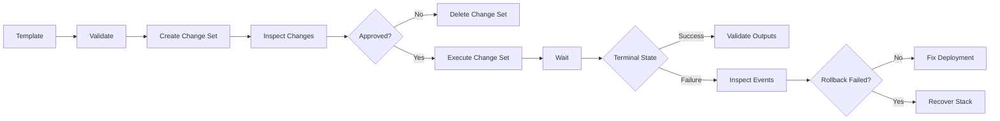

# 12- CloudFormation CLI Cheat Sheet

## Overview

AWS CloudFormation CLI commands are primarily used to validate templates, inspect stacks, create and update deployments, review changes, diagnose failures, detect drift, and manage stack lifecycle operations.

The AWS CLI is most useful when CloudFormation is integrated into CI/CD pipelines or when production infrastructure requires repeatable operational workflows.

This cheat sheet focuses on the commands most useful for day-to-day backend and platform engineering.

## CLI Prerequisites

Verify the AWS CLI installation:

```bash
aws --version
```

Verify the active AWS identity:

```bash
aws sts get-caller-identity
```

Configure credentials when required:

```bash
aws configure
```

Use a named profile:

```bash
aws sts get-caller-identity \
  --profile production
```

Specify a region explicitly:

```bash
aws cloudformation describe-stacks \
  --stack-name production-platform \
  --region ap-south-1
```

For production operations, prefer explicit profiles and regions rather than relying on an accidental shell configuration.

## Template Validation

Validate a CloudFormation template before creating or updating a stack:

```bash
aws cloudformation validate-template \
  --template-body file://template.yaml
```

For a JSON template:

```bash
aws cloudformation validate-template \
  --template-body file://template.json
```

Validation checks whether the template is structurally valid CloudFormation input.

It does **not** guarantee that:

- Resources can actually be created.
- IAM permissions are sufficient.
- Resource configuration is operationally valid.
- Service quotas will not be exceeded.
- External dependencies are available.

For production pipelines, template validation should be an early CI step.

## Create a Stack

Create a stack from a local template:

```bash
aws cloudformation create-stack \
  --stack-name production-platform \
  --template-body file://template.yaml
```

Create a stack from an S3 template:

```bash
aws cloudformation create-stack \
  --stack-name production-platform \
  --template-url https://s3.amazonaws.com/my-bucket/templates/platform.yaml
```

Specify parameters:

```bash
aws cloudformation create-stack \
  --stack-name production-platform \
  --template-body file://template.yaml \
  --parameters \
    ParameterKey=Environment,ParameterValue=production \
    ParameterKey=VpcId,ParameterValue=vpc-0123456789abcdef0
```

Specify tags:

```bash
aws cloudformation create-stack \
  --stack-name production-platform \
  --template-body file://template.yaml \
  --tags \
    Key=Environment,Value=production \
    Key=Owner,Value=platform
```

## Create a Stack With IAM Capabilities

If the template creates IAM resources, CloudFormation may require explicit capabilities.

For IAM resources:

```bash
aws cloudformation create-stack \
  --stack-name production-platform \
  --template-body file://template.yaml \
  --capabilities CAPABILITY_IAM
```

For named IAM resources:

```bash
aws cloudformation create-stack \
  --stack-name production-platform \
  --template-body file://template.yaml \
  --capabilities CAPABILITY_NAMED_IAM
```

`CAPABILITY_NAMED_IAM` should be treated carefully because the template can create or modify explicitly named IAM resources.

## Create a Stack With a Service Role

Specify a CloudFormation service role:

```bash
aws cloudformation create-stack \
  --stack-name production-platform \
  --template-body file://template.yaml \
  --role-arn arn:aws:iam::123456789012:role/CloudFormationExecutionRole
```

The role controls which AWS resources CloudFormation can create, modify, or delete.

## Wait for Stack Creation

Instead of manually polling:

```bash
aws cloudformation wait stack-create-complete \
  --stack-name production-platform
```

This is useful in shell scripts and CI/CD pipelines.

After the waiter returns, verify the actual state:

```bash
aws cloudformation describe-stacks \
  --stack-name production-platform \
  --query "Stacks[0].StackStatus"
```

## Describe a Stack

Retrieve complete stack information:

```bash
aws cloudformation describe-stacks \
  --stack-name production-platform
```

Retrieve only the stack status:

```bash
aws cloudformation describe-stacks \
  --stack-name production-platform \
  --query "Stacks[0].StackStatus"
```

Retrieve status and reason:

```bash
aws cloudformation describe-stacks \
  --stack-name production-platform \
  --query "Stacks[0].[StackStatus,StackStatusReason]" \
  --output table
```

## List Stacks

List stacks:

```bash
aws cloudformation list-stacks
```

List only active stacks:

```bash
aws cloudformation list-stacks \
  --stack-status-filter CREATE_COMPLETE UPDATE_COMPLETE
```

Useful statuses include:

```text
CREATE_IN_PROGRESS
CREATE_COMPLETE
CREATE_FAILED
ROLLBACK_IN_PROGRESS
ROLLBACK_COMPLETE
UPDATE_IN_PROGRESS
UPDATE_COMPLETE
UPDATE_ROLLBACK_IN_PROGRESS
UPDATE_ROLLBACK_COMPLETE
UPDATE_ROLLBACK_FAILED
DELETE_IN_PROGRESS
DELETE_FAILED
```

## List Stack Resources

List resources managed by a stack:

```bash
aws cloudformation list-stack-resources \
  --stack-name production-platform
```

Display logical ID, physical ID, and status:

```bash
aws cloudformation list-stack-resources \
  --stack-name production-platform \
  --query "StackResourceSummaries[*].[LogicalResourceId,PhysicalResourceId,ResourceType,ResourceStatus]" \
  --output table
```

This is particularly useful when mapping:

```text
LogicalResourceId
        |
        v
PhysicalResourceId
```

For example:

```text
WebSecurityGroup
        |
        v
sg-0123456789abcdef0
```

## Get Stack Outputs

Retrieve all outputs:

```bash
aws cloudformation describe-stacks \
  --stack-name production-platform \
  --query "Stacks[0].Outputs"
```

Retrieve only output values:

```bash
aws cloudformation describe-stacks \
  --stack-name production-platform \
  --query "Stacks[0].Outputs[*].[OutputKey,OutputValue]" \
  --output table
```

Retrieve a specific output:

```bash
aws cloudformation describe-stacks \
  --stack-name production-platform \
  --query "Stacks[0].Outputs[?OutputKey=='ApiEndpoint'].OutputValue" \
  --output text
```

## Update a Stack

Update using a local template:

```bash
aws cloudformation update-stack \
  --stack-name production-platform \
  --template-body file://template.yaml
```

Update parameters:

```bash
aws cloudformation update-stack \
  --stack-name production-platform \
  --template-body file://template.yaml \
  --parameters \
    ParameterKey=Environment,ParameterValue=production
```

Update with IAM capabilities:

```bash
aws cloudformation update-stack \
  --stack-name production-platform \
  --template-body file://template.yaml \
  --capabilities CAPABILITY_IAM
```

Wait for completion:

```bash
aws cloudformation wait stack-update-complete \
  --stack-name production-platform
```

## No-Op Updates

If the submitted template and parameters do not result in a change, CloudFormation may return:

```text
ValidationError: No updates are to be performed.
```

This is not necessarily an infrastructure failure.

CI/CD pipelines should distinguish a no-op deployment from an actual deployment failure.

## Change Sets

Create a change set before executing an update:

```bash
aws cloudformation create-change-set \
  --stack-name production-platform \
  --change-set-name production-update \
  --template-body file://template.yaml \
  --change-set-type UPDATE
```

For a new stack:

```bash
aws cloudformation create-change-set \
  --stack-name production-platform \
  --change-set-name initial-deployment \
  --template-body file://template.yaml \
  --change-set-type CREATE
```

Describe the change set:

```bash
aws cloudformation describe-change-set \
  --stack-name production-platform \
  --change-set-name production-update
```

Display changes in a compact format:

```bash
aws cloudformation describe-change-set \
  --stack-name production-platform \
  --change-set-name production-update \
  --query "Changes[*].[ResourceChange.Action,ResourceChange.LogicalResourceId,ResourceChange.ResourceType,ResourceChange.Replacement]" \
  --output table
```

Execute the change set:

```bash
aws cloudformation execute-change-set \
  --stack-name production-platform \
  --change-set-name production-update
```

Delete an unused change set:

```bash
aws cloudformation delete-change-set \
  --stack-name production-platform \
  --change-set-name production-update
```

## Detect Resource Replacement

A particularly important field when reviewing a change set is:

```text
ResourceChange.Replacement
```

Typical values include:

```text
True
False
Conditional
```

A replacement can result in a new physical resource being created.

For production systems, investigate replacements carefully, especially for:

- Databases.
- Load balancers.
- Stateful storage.
- Security-sensitive resources.
- Resources with expensive initialization.
- Resources with externally referenced physical IDs.

## Stack Events

Retrieve stack events:

```bash
aws cloudformation describe-stack-events \
  --stack-name production-platform
```

Display the most useful diagnostic fields:

```bash
aws cloudformation describe-stack-events \
  --stack-name production-platform \
  --query "StackEvents[*].[Timestamp,LogicalResourceId,ResourceType,ResourceStatus,ResourceStatusReason]" \
  --output table
```

Find failed resources:

```bash
aws cloudformation describe-stack-events \
  --stack-name production-platform \
  --query "StackEvents[?contains(ResourceStatus, 'FAILED')].[Timestamp,LogicalResourceId,ResourceType,ResourceStatus,ResourceStatusReason]" \
  --output table
```

When debugging, inspect the **earliest meaningful failure** rather than focusing only on the final rollback event.

## Diagnose a Failed Deployment

A useful diagnostic sequence is:

```bash
aws cloudformation describe-stacks \
  --stack-name production-platform \
  --query "Stacks[0].[StackStatus,StackStatusReason]" \
  --output table
```

Then:

```bash
aws cloudformation describe-stack-events \
  --stack-name production-platform \
  --query "StackEvents[?contains(ResourceStatus, 'FAILED')].[Timestamp,LogicalResourceId,ResourceType,ResourceStatusReason]" \
  --output table
```

Then inspect resources:

```bash
aws cloudformation list-stack-resources \
  --stack-name production-platform \
  --query "StackResourceSummaries[*].[LogicalResourceId,PhysicalResourceId,ResourceStatus]" \
  --output table
```

The operational sequence is:

```text
Stack Status
     |
     v
Stack Events
     |
     v
Failed Resource
     |
     v
Physical Resource
     |
     v
AWS Service Error
```

## Continue Update Rollback

Check the current state:

```bash
aws cloudformation describe-stacks \
  --stack-name production-platform \
  --query "Stacks[0].StackStatus"
```

If the stack is:

```text
UPDATE_ROLLBACK_FAILED
```

and the underlying blocker has been addressed:

```bash
aws cloudformation continue-update-rollback \
  --stack-name production-platform
```

Skip a specific logical resource only when the consequences are understood:

```bash
aws cloudformation continue-update-rollback \
  --stack-name production-platform \
  --resources-to-skip ProblematicResource
```

Do not treat `--resources-to-skip` as a generic force option.

## Rollback Monitoring

Monitor rollback events:

```bash
aws cloudformation describe-stack-events \
  --stack-name production-platform \
  --query "StackEvents[?contains(ResourceStatus, 'ROLLBACK')].[Timestamp,LogicalResourceId,ResourceStatus,ResourceStatusReason]" \
  --output table
```

Then verify the final state:

```bash
aws cloudformation describe-stacks \
  --stack-name production-platform \
  --query "Stacks[0].StackStatus"
```

## Stack Deletion

Delete a stack:

```bash
aws cloudformation delete-stack \
  --stack-name production-platform
```

Wait for deletion:

```bash
aws cloudformation wait stack-delete-complete \
  --stack-name production-platform
```

Verify deletion:

```bash
aws cloudformation describe-stacks \
  --stack-name production-platform
```

A deleted stack normally results in a validation error because the stack no longer exists.

## Delete With a Service Role

Specify a role for the deletion operation:

```bash
aws cloudformation delete-stack \
  --stack-name production-platform \
  --role-arn arn:aws:iam::123456789012:role/CloudFormationExecutionRole
```

This is useful when CloudFormation-managed resources require permissions provided by a service role.

## Termination Protection

Enable termination protection:

```bash
aws cloudformation update-termination-protection \
  --stack-name production-platform \
  --enable-termination-protection
```

Disable it:

```bash
aws cloudformation update-termination-protection \
  --stack-name production-platform \
  --no-enable-termination-protection
```

Check the setting:

```bash
aws cloudformation describe-stacks \
  --stack-name production-platform \
  --query "Stacks[0].EnableTerminationProtection"
```

Termination protection is particularly useful for production stacks containing stateful resources.

## Stack Policies

A stack policy can restrict updates to protected resources.

For example, a stack policy file can be supplied during stack creation or update where supported by the operation.

Inspecting and managing stack policies is useful when protecting critical resources from accidental updates.

Typical production use cases include:

- Protecting a production database.
- Preventing accidental replacement.
- Restricting updates to critical infrastructure.
- Adding an additional safety layer around deployment automation.

## Drift Detection

Start drift detection:

```bash
aws cloudformation detect-stack-drift \
  --stack-name production-platform
```

The command returns a drift detection ID.

Check its status:

```bash
aws cloudformation describe-stack-drift-detection-status \
  --stack-drift-detection-id <detection-id>
```

Retrieve the final stack drift status:

```bash
aws cloudformation describe-stacks \
  --stack-name production-platform \
  --query "Stacks[0].DriftInformation"
```

Retrieve resource-level drift:

```bash
aws cloudformation describe-stack-resource-drifts \
  --stack-name production-platform
```

Display only resources with drift:

```bash
aws cloudformation describe-stack-resource-drifts \
  --stack-name production-platform \
  --query "StackResourceDrifts[?StackResourceDriftStatus!='IN_SYNC'].[LogicalResourceId,ResourceType,StackResourceDriftStatus]" \
  --output table
```

Drift detection is useful after emergency manual changes or suspected configuration divergence.

## Stack Import

CloudFormation can import existing AWS resources into a stack.

The workflow generally requires:

```text
Existing AWS Resource
        |
        v
Import Template
        |
        v
CloudFormation Change Set
        |
        v
Execute Import
        |
        v
Resource Managed by Stack
```

Create an import change set:

```bash
aws cloudformation create-change-set \
  --stack-name production-platform \
  --change-set-name import-resource \
  --change-set-type IMPORT \
  --resources-to-import file://resources-to-import.json \
  --template-body file://template.yaml
```

Execute it:

```bash
aws cloudformation execute-change-set \
  --stack-name production-platform \
  --change-set-name import-resource
```

Import is useful when infrastructure exists outside CloudFormation but needs to become CloudFormation-managed.

## Stack Export and Import Values

List stack exports:

```bash
aws cloudformation list-exports
```

Retrieve export names and values:

```bash
aws cloudformation list-exports \
  --query "Exports[*].[Name,Value]" \
  --output table
```

Cross-stack references are commonly defined in templates with:

```yaml
Fn::ImportValue:
  Fn::Sub: "${NetworkStackName}-VpcId"
```

The CLI is useful for verifying that expected exports exist before deploying dependent stacks.

## Stack Parameters

Inspect stack parameters:

```bash
aws cloudformation describe-stacks \
  --stack-name production-platform \
  --query "Stacks[0].Parameters"
```

Display parameters in table form:

```bash
aws cloudformation describe-stacks \
  --stack-name production-platform \
  --query "Stacks[0].Parameters[*].[ParameterKey,ParameterValue]" \
  --output table
```

Do not expose sensitive parameter values in CI/CD logs.

## Secure Parameter Handling

Avoid passing plaintext secrets directly through shell history or CI logs.

Prefer CloudFormation parameters backed by AWS Systems Manager Parameter Store or Secrets Manager where appropriate.

Example parameter reference:

```yaml
Parameters:
  DatabasePassword:
    Type: AWS::SSM::Parameter::Value<String>
```

For sensitive application secrets, use appropriate secret-management services rather than storing credentials directly in templates.

## Tags

List stack tags:

```bash
aws cloudformation describe-stacks \
  --stack-name production-platform \
  --query "Stacks[0].Tags"
```

Tags are useful for:

- Cost allocation.
- Ownership.
- Environment identification.
- Automation.
- Operational filtering.

A production tagging convention should be consistent across all stacks.

## Template Summary

Retrieve template metadata:

```bash
aws cloudformation get-template-summary \
  --template-body file://template.yaml
```

For a template stored in S3:

```bash
aws cloudformation get-template-summary \
  --template-url https://s3.amazonaws.com/my-bucket/templates/platform.yaml
```

Useful information includes:

- Parameters.
- Resource types.
- Capabilities.
- Outputs.
- Metadata.

This is useful for automation and CI/CD preflight checks.

## Retrieve the Deployed Template

Retrieve the template associated with a stack:

```bash
aws cloudformation get-template \
  --stack-name production-platform
```

Retrieve only the template body:

```bash
aws cloudformation get-template \
  --stack-name production-platform \
  --query "TemplateBody"
```

This is useful when investigating what CloudFormation currently has associated with a stack.

## List Stack Resources

Compact resource inventory:

```bash
aws cloudformation list-stack-resources \
  --stack-name production-platform \
  --query "StackResourceSummaries[*].[LogicalResourceId,ResourceType,PhysicalResourceId,ResourceStatus]" \
  --output table
```

This is often the fastest way to map a CloudFormation logical resource to its actual AWS resource.

## Nested Stack Diagnostics

For a nested stack, first inspect the parent:

```bash
aws cloudformation describe-stack-events \
  --stack-name root-stack
```

Find nested stack resources:

```bash
aws cloudformation list-stack-resources \
  --stack-name root-stack \
  --query "StackResourceSummaries[?ResourceType=='AWS::CloudFormation::Stack'].[LogicalResourceId,PhysicalResourceId,ResourceStatus]" \
  --output table
```

Then inspect the child stack using its physical stack identifier.

This gives:

```text
Root Stack
    |
    v
Nested Stack
    |
    v
Failed Resource
```

## StackSets

List StackSets:

```bash
aws cloudformation list-stack-sets
```

Describe a StackSet:

```bash
aws cloudformation describe-stack-set \
  --stack-set-name organization-infrastructure
```

List StackSet instances:

```bash
aws cloudformation list-stack-instances \
  --stack-set-name organization-infrastructure
```

List StackSet operations:

```bash
aws cloudformation list-stack-set-operations \
  --stack-set-name organization-infrastructure
```

Describe an operation:

```bash
aws cloudformation describe-stack-set-operation \
  --stack-set-name organization-infrastructure \
  --operation-id <operation-id>
```

StackSets are useful for deploying standardized infrastructure across multiple accounts and regions.

## CLI Output Formats

Human-readable table:

```bash
aws cloudformation list-stacks \
  --output table
```

JSON:

```bash
aws cloudformation list-stacks \
  --output json
```

Plain text:

```bash
aws cloudformation list-stacks \
  --output text
```

YAML:

```bash
aws cloudformation list-stacks \
  --output yaml
```

Use `table` for manual inspection and `json` or `text` for automation.

## JMESPath Queries

JMESPath makes AWS CLI output useful for operational scripts.

Get stack status:

```bash
aws cloudformation describe-stacks \
  --stack-name production-platform \
  --query "Stacks[0].StackStatus" \
  --output text
```

Get all logical and physical resource IDs:

```bash
aws cloudformation list-stack-resources \
  --stack-name production-platform \
  --query "StackResourceSummaries[*].[LogicalResourceId,PhysicalResourceId]" \
  --output table
```

Get failed resources:

```bash
aws cloudformation describe-stack-events \
  --stack-name production-platform \
  --query "StackEvents[?contains(ResourceStatus, 'FAILED')].[LogicalResourceId,ResourceStatusReason]" \
  --output table
```

Get stack outputs:

```bash
aws cloudformation describe-stacks \
  --stack-name production-platform \
  --query "Stacks[0].Outputs[*].[OutputKey,OutputValue]" \
  --output table
```

## CI/CD Command Sequence

A practical deployment pipeline can use:

```bash
aws cloudformation validate-template \
  --template-body file://template.yaml
```

Then:

```bash
aws cloudformation create-change-set \
  --stack-name production-platform \
  --change-set-name "$CHANGE_SET_NAME" \
  --template-body file://template.yaml \
  --change-set-type UPDATE
```

Inspect:

```bash
aws cloudformation describe-change-set \
  --stack-name production-platform \
  --change-set-name "$CHANGE_SET_NAME"
```

Execute after approval:

```bash
aws cloudformation execute-change-set \
  --stack-name production-platform \
  --change-set-name "$CHANGE_SET_NAME"
```

Wait:

```bash
aws cloudformation wait stack-update-complete \
  --stack-name production-platform
```

Verify:

```bash
aws cloudformation describe-stacks \
  --stack-name production-platform \
  --query "Stacks[0].StackStatus" \
  --output text
```

## Production Deployment Flow



## High-Value Command Reference

| Task | Command |
|---|---|
| Verify AWS identity | `aws sts get-caller-identity` |
| Validate template | `aws cloudformation validate-template --template-body file://template.yaml` |
| Create stack | `aws cloudformation create-stack --stack-name <name> --template-body file://template.yaml` |
| Update stack | `aws cloudformation update-stack --stack-name <name> --template-body file://template.yaml` |
| Describe stack | `aws cloudformation describe-stacks --stack-name <name>` |
| List stacks | `aws cloudformation list-stacks` |
| List resources | `aws cloudformation list-stack-resources --stack-name <name>` |
| Inspect events | `aws cloudformation describe-stack-events --stack-name <name>` |
| Create change set | `aws cloudformation create-change-set ...` |
| Inspect change set | `aws cloudformation describe-change-set ...` |
| Execute change set | `aws cloudformation execute-change-set ...` |
| Delete change set | `aws cloudformation delete-change-set ...` |
| Continue rollback | `aws cloudformation continue-update-rollback --stack-name <name>` |
| Delete stack | `aws cloudformation delete-stack --stack-name <name>` |
| Enable termination protection | `aws cloudformation update-termination-protection --stack-name <name> --enable-termination-protection` |
| Detect drift | `aws cloudformation detect-stack-drift --stack-name <name>` |
| Check drift detection | `aws cloudformation describe-stack-drift-detection-status ...` |
| Inspect resource drift | `aws cloudformation describe-stack-resource-drifts --stack-name <name>` |
| Get template | `aws cloudformation get-template --stack-name <name>` |
| Get template summary | `aws cloudformation get-template-summary --template-body file://template.yaml` |
| List exports | `aws cloudformation list-exports` |
| Delete stack | `aws cloudformation delete-stack --stack-name <name>` |
| Wait for creation | `aws cloudformation wait stack-create-complete --stack-name <name>` |
| Wait for update | `aws cloudformation wait stack-update-complete --stack-name <name>` |
| Wait for deletion | `aws cloudformation wait stack-delete-complete --stack-name <name>` |

## Wait Commands

CloudFormation provides waiter commands for common lifecycle operations:

```bash
aws cloudformation wait stack-create-complete \
  --stack-name <stack-name>
```

```bash
aws cloudformation wait stack-update-complete \
  --stack-name <stack-name>
```

```bash
aws cloudformation wait stack-delete-complete \
  --stack-name <stack-name>
```

For rollback:

```bash
aws cloudformation wait stack-update-rollback-complete \
  --stack-name <stack-name>
```

Waiters simplify scripting but should not replace explicit status and event inspection when diagnosing failures.

## Production Safety Checklist

```text
[ ] Verify AWS account with sts get-caller-identity
[ ] Verify AWS region
[ ] Validate the template
[ ] Confirm the target stack
[ ] Review parameters
[ ] Review IAM capabilities
[ ] Use a controlled CloudFormation execution role
[ ] Create a change set for important updates
[ ] Check for resource replacement
[ ] Check stateful resource changes
[ ] Enable termination protection where appropriate
[ ] Execute only after review/approval
[ ] Wait for a terminal state
[ ] Inspect stack events on failure
[ ] Do not blindly retry failed deployments
[ ] Do not use resources-to-skip without understanding drift
[ ] Protect secrets and sensitive parameters
[ ] Preserve deployment and CloudFormation logs
[ ] Verify outputs and resource state
```

## Common Mistakes

### Deploying Without Validating the Template

Run:

```bash
aws cloudformation validate-template \
  --template-body file://template.yaml
```

before deployment.

Template validation catches structural problems early, although it is not a complete deployment test.

### Assuming `create-stack` Is Synchronous

The API request starts the operation. It does not mean the infrastructure is ready.

Use a waiter or explicitly inspect the stack state.

### Skipping Change Sets in Production

Direct updates make it harder to review resource replacements and destructive changes before execution.

### Ignoring Stack Events

A generic CI/CD error such as:

```text
CloudFormation deployment failed
```

is not enough to diagnose the problem.

Inspect:

```bash
aws cloudformation describe-stack-events \
  --stack-name <stack-name>
```

### Using the Wrong AWS Account

Before destructive operations:

```bash
aws sts get-caller-identity
```

This simple check prevents many operational mistakes.

### Exposing Secrets Through CLI Arguments

Shell history, CI logs, process inspection, or verbose logging can expose sensitive values.

Use AWS-native secret management and secure CI/CD secret handling.

### Ignoring Resource Replacement

A template update may look small while causing a critical resource replacement.

Always inspect the change set for replacement behavior.

### Treating Rollback as Data Recovery

CloudFormation rollback does not replace database backups, snapshots, or application-level recovery mechanisms.

## Interview Traps

### What Is the Difference Between `validate-template` and a Change Set?

`validate-template` checks template structure and metadata.

A change set shows the resource-level changes CloudFormation plans to make to a stack.

### What Is the Most Important Diagnostic Command?

For a failed stack operation:

```bash
aws cloudformation describe-stack-events \
  --stack-name <stack-name>
```

It provides resource-level operation history and failure reasons.

### Why Use `aws sts get-caller-identity` Before Production Operations?

It confirms the AWS account and identity associated with the current CLI credentials.

### What Does a Waiter Do?

A waiter polls for a supported CloudFormation state transition and returns when the expected state is reached or the waiter times out.

### What Is a Change Set?

A change set is a preview of the changes CloudFormation intends to apply to a stack before those changes are executed.

### What Does `continue-update-rollback` Do?

It resumes an interrupted update rollback, typically for a stack in `UPDATE_ROLLBACK_FAILED`.

### What Is Drift Detection?

Drift detection compares the current configuration of supported resources with the configuration CloudFormation expects from the stack template.

### Does `validate-template` Guarantee Deployment Success?

No. It does not validate every runtime condition such as permissions, quotas, service availability, dependencies, or resource-specific constraints.

## Key Takeaways

- `aws cloudformation validate-template` is an early structural validation step, not a deployment test.
- `describe-stacks` is the primary command for checking stack state.
- `describe-stack-events` is the primary command for diagnosing stack failures.
- `list-stack-resources` maps CloudFormation logical resources to physical AWS resources.
- Change sets provide a safer review mechanism before production updates.
- Always inspect resource replacement when reviewing a change set.
- `execute-change-set` applies a previously created change set.
- `continue-update-rollback` is used for recovering interrupted update rollbacks.
- `detect-stack-drift` and related commands help identify infrastructure changes made outside CloudFormation.
- `update-termination-protection` provides an additional safeguard against accidental stack deletion.
- Stack outputs can be retrieved with `describe-stacks` and JMESPath queries.
- `get-template` helps inspect the template currently associated with a stack.
- `list-exports` helps verify cross-stack dependencies.
- Waiters are useful for automation but should be combined with status and event inspection when troubleshooting.
- Always verify the AWS identity and region before production operations.
- Protect secrets from CLI arguments, shell history, CI logs, and command output.
- Treat stack deletion, rollback recovery, and resource replacement as high-risk operations.
- A reliable CloudFormation workflow is: **validate → preview → review → execute → wait → verify → diagnose if necessary**.