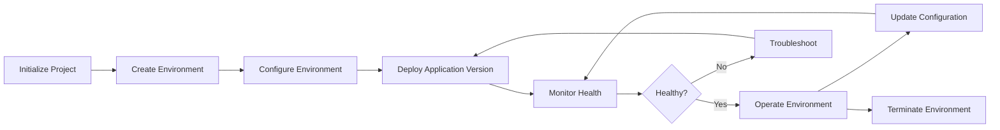
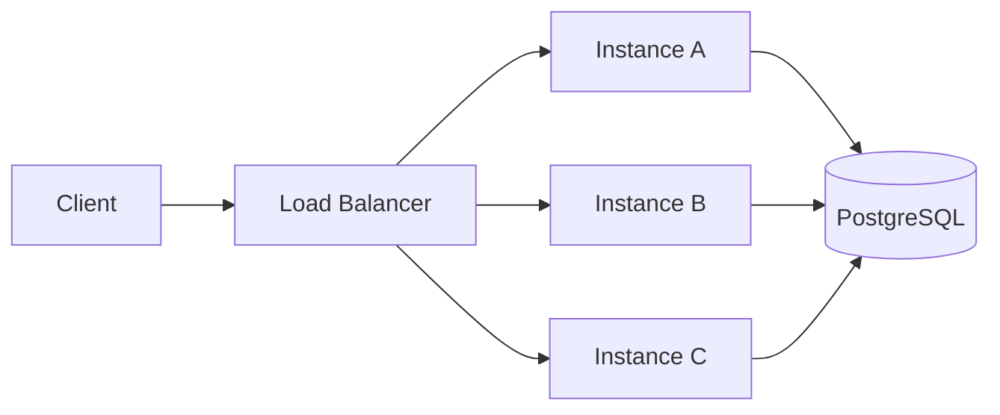
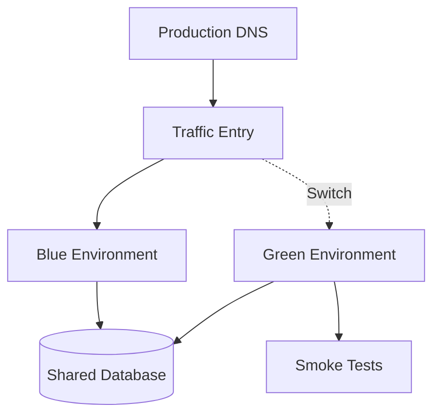

# 02- Environment Management

## Overview

Elastic Beanstalk environments are the primary runtime units used to deploy and operate application versions. An environment represents a running instance of an application under a specific configuration, including compute capacity, load balancing, networking, scaling, health checks, platform settings, and deployment behavior.

Environment management is therefore more than creating and deleting environments. Production operations require controlled environment creation, configuration, promotion, scaling, monitoring, rollback, and lifecycle management.

A typical backend platform may maintain separate environments for different stages:

```text
Elastic Beanstalk Application
│
├── development
│   └── Developer testing
│
├── staging
│   └── Integration and release validation
│
└── production
    └── Customer traffic
```

The EB CLI provides commands for managing these environments without requiring every operation to be performed through the AWS console.

## Application and Environment Relationship

An Elastic Beanstalk application is a logical container. An environment is a running deployment of that application.

```text
Application
│
├── Application Version A
├── Application Version B
├── Application Version C
│
├── staging environment
│   └── Version B
│
└── production environment
    └── Version A
```

This distinction is important because multiple environments can use different application versions while belonging to the same application.

| Resource | Responsibility |
|---|---|
| Application | Logical grouping of environments and application versions |
| Application version | Deployable source artifact |
| Environment | Running application infrastructure and configuration |
| Instance | Compute resource running the application |
| Load balancer | Distributes incoming traffic |
| Auto Scaling | Maintains desired capacity |
| Environment configuration | Defines runtime and infrastructure behavior |

## Environment Lifecycle

A typical environment lifecycle is:



The lifecycle should be controlled through versioned configuration and repeatable operational procedures.

## List Environments

List environments associated with the current Elastic Beanstalk application:

```bash
eb list
```

A project may contain environments such as:

```text
production
staging
development
```

The currently selected environment is important because many EB CLI commands operate against it by default.

Before performing an operational action, verify the selected environment:

```bash
eb status
```

## Select an Environment

Switch the active environment:

```bash
eb use staging
```

Verify:

```bash
eb status
```

For production operations, explicitly confirming the environment is a useful safety control.

A dangerous workflow is:

```bash
eb use production
eb deploy
```

without verifying the current application, AWS account, or environment.

A safer workflow is:

```bash
aws sts get-caller-identity
eb status
eb health
eb deploy production
```

## Create an Environment

Create a new environment:

```bash
eb create staging
```

A production environment might be created with:

```bash
eb create production
```

Environment creation can provision and configure underlying AWS resources according to the selected Elastic Beanstalk platform and environment configuration.

The environment therefore represents infrastructure as well as application runtime.

## Environment Naming

Environment names should be predictable and consistent.

A common convention is:

| Environment | Purpose |
|---|---|
| `development` | Developer integration |
| `staging` | Pre-production validation |
| `production` | Customer traffic |

For larger systems, names may encode additional context:

```text
orders-api-staging
orders-api-production
orders-api-production-blue
orders-api-production-green
```

Avoid arbitrary names such as:

```text
test123
new-env
final
temp
my-env
```

Predictable names make automation, monitoring, incident response, and access control easier.

## Environment Status

Inspect the current environment:

```bash
eb status
```

Typical information includes:

- Application name
- Environment name
- Platform
- Health status
- Current application version
- Environment URL
- CNAME

A status check is useful for confirming that the local EB CLI context matches the intended target.

## Environment Health

Inspect environment health:

```bash
eb health
```

Environment health provides operational information about the environment and its instances.

A simplified health model is:

```text
Environment
│
├── Load Balancer
│
├── Instance A ── Healthy
├── Instance B ── Healthy
└── Instance C ── Warning
```

Health problems should be investigated at the instance and application level rather than assuming that the entire environment is broken.

Useful follow-up commands include:

```bash
eb events
eb logs
eb status
```

## Environment Events

View environment events:

```bash
eb events
```

Events provide a timeline of environment operations and failures.

Typical events can relate to:

- Deployments
- Instance launches
- Instance termination
- Configuration updates
- Health changes
- Load balancer operations
- Platform operations

A useful troubleshooting sequence is:

```text
Health problem
     │
     ▼
eb health
     │
     ▼
eb events
     │
     ▼
eb logs
     │
     ▼
Application / infrastructure investigation
```

## Deploying to an Environment

Deploy the current application source:

```bash
eb deploy
```

Deploy to a specific environment:

```bash
eb deploy staging
```

For production:

```bash
eb deploy production
```

The deployment relationship is:

```text
Source Code
    │
    ▼
EB CLI
    │
    ▼
Application Version
    │
    ▼
Elastic Beanstalk Environment
    │
    ▼
Instances
```

A successful deployment command does not necessarily mean the application is healthy.

Always verify:

```bash
eb health
```

and inspect events when required:

```bash
eb events
```

## Environment Configuration

Environment configuration determines how the environment operates.

Configuration can influence:

- Instance types
- Auto Scaling
- Load balancing
- Environment variables
- Health checks
- Deployment policy
- Networking
- Security groups
- Platform settings
- Logging
- Monitoring

Inspect environment configuration:

```bash
eb config
```

Configuration should ideally be reproducible and version-controlled rather than maintained through undocumented console changes.

## Environment Variables

Display environment variables:

```bash
eb printenv
```

Set variables:

```bash
eb setenv \
  DJANGO_SETTINGS_MODULE=config.settings.production \
  LOG_LEVEL=INFO
```

Remove a variable:

```bash
eb unsetenv LOG_LEVEL
```

Environment variables are appropriate for runtime configuration such as:

```text
DJANGO_SETTINGS_MODULE
LOG_LEVEL
DATABASE_HOST
REDIS_HOST
API_BASE_URL
```

Secrets should generally be retrieved from managed secret storage rather than committed to source control or embedded directly into application artifacts.

## Configuration Layers

Elastic Beanstalk environments can receive configuration from multiple sources.

| Configuration mechanism | Typical responsibility |
|---|---|
| EB CLI | Environment operations |
| `.elasticbeanstalk/` | Local EB CLI configuration |
| `eb setenv` | Runtime environment variables |
| `.ebextensions/` | Elastic Beanstalk configuration |
| `.platform/` | Platform hooks and customization |
| Elastic Beanstalk console | Interactive configuration |
| Infrastructure as Code | Repeatable infrastructure management |

The key production principle is consistency.

If staging is configured manually while production is configured through a different process, the environments can drift.

## Environment Configuration Drift

Configuration drift occurs when environments that should behave similarly accumulate different settings.

For example:

```text
Staging
├── Python version: X
├── Instance type: A
└── Environment variable set: 1

Production
├── Python version: Y
├── Instance type: B
└── Environment variable set: 2
```

This can produce the classic situation:

> "It works in staging but fails in production."

Reduce drift by keeping infrastructure and configuration changes reproducible.

## Scaling an Environment

Elastic Beanstalk environments can run with multiple instances.

Inspect or modify environment capacity using:

```bash
eb scale
```

For example:

```bash
eb scale 3
```

This can be useful for controlled capacity changes, but production systems should generally use Auto Scaling policies rather than relying on repeated manual scaling.

Scaling should account for:

- CPU
- Memory
- Request rate
- Latency
- Database capacity
- Network throughput
- Queue depth
- External dependency latency
- Instance startup time

Application scaling and database scaling must be considered together.

Increasing EC2 instances does not solve a database bottleneck.

## Single-Instance vs Load-Balanced Environments

Elastic Beanstalk environments can be configured for different capacity models.

| Model | Use case | Production suitability |
|---|---|---|
| Single instance | Development or low-cost testing | Generally not suitable for HA |
| Load balanced | Multiple application instances | Common production architecture |
| Auto scaled | Variable traffic | Preferred for scalable workloads |

A production backend normally benefits from multiple instances behind a load balancer.



The application should remain stateless where practical so that requests can be distributed across instances.

## Stateless Application Design

Elastic Beanstalk environments can replace instances during deployments, scaling, recovery, or infrastructure operations.

Therefore, application state should not depend on the local instance filesystem.

Avoid designs such as:

```text
Request
  │
  ▼
Instance A
  │
  └── Session stored only on local disk
```

Prefer shared or external systems:

```text
Application Instances
       │
       ├── Redis ── Sessions / Cache
       ├── S3 ───── Object Storage
       └── RDS ──── Persistent Database
```

This is particularly important for Django, FastAPI, and other horizontally scaled applications.

## Environment Updates

Environment configuration changes should be treated as production changes.

A controlled workflow is:

```text
Configuration change
        │
        ▼
Version control
        │
        ▼
Review
        │
        ▼
Staging validation
        │
        ▼
Production update
        │
        ▼
Health verification
```

Avoid making undocumented configuration changes directly in production.

## Environment Health During Updates

Configuration changes and deployments can temporarily affect environment capacity.

Before making changes, understand:

- Current instance count
- Deployment policy
- Health-check behavior
- Expected application startup time
- Database migration behavior
- Dependency availability

A slow-starting Django or FastAPI application may require more time to become healthy than a lightweight service.

Health-check configuration should reflect actual application startup and readiness behavior.

## Environment Swapping

Elastic Beanstalk supports environment swapping, which can be useful for blue/green deployment patterns.

Conceptually:

```text
Blue Environment
Version A
     │
     │
     ├── Current traffic
     │
     ▼
Production

Green Environment
Version B
     │
     └── Validation
```

After validation, traffic mapping can be changed.

The key benefit is separating the new environment from the currently serving environment.

However, environment swapping does not automatically solve:

- Database schema compatibility
- Stateful sessions
- Cache compatibility
- External integrations
- Background workers
- Long-running jobs
- Data migrations

Application changes should therefore follow backward-compatible migration patterns.

## Blue/Green Environment Management

A production blue/green model may look like:



A safer deployment sequence is:

1. Deploy the new version to the inactive environment.
2. Validate application startup.
3. Run smoke tests.
4. Validate health.
5. Verify critical dependencies.
6. Switch traffic.
7. Monitor the new environment.
8. Retain the previous environment until rollback confidence is established.

## Rollback Strategy

A rollback strategy should be defined before deployment.

Possible approaches include:

- Redeploying a known-good application version
- Reverting environment configuration
- Swapping traffic back to the previous environment
- Rolling back through the CI/CD system

The appropriate strategy depends on the deployment model.

The most dangerous situation is:

```text
Production deployment
       │
       ▼
Failure
       │
       ▼
"No rollback plan"
```

Application versions, database migrations, and infrastructure changes must be designed together.

## Database Migration Considerations

Environment management becomes more complex when deployments modify database schemas.

A deployment such as:

```text
Application Version A
       │
       ▼
Database Schema A
```

should not immediately require:

```text
Application Version B
       │
       ▼
Database Schema B
```

if old instances may still serve traffic.

Prefer backward-compatible migration patterns:

```text
Phase 1
Old application + compatible schema

        ↓

Phase 2
Schema expanded

        ↓

Phase 3
New application deployed

        ↓

Phase 4
Old schema elements removed later
```

This is especially important for rolling and blue/green deployments.

## Environment Termination

Terminate an environment:

```bash
eb terminate staging
```

Environment termination is destructive and should be treated carefully.

Before termination, verify:

```bash
eb status
eb health
eb events
```

Confirm:

- Correct AWS account
- Correct application
- Correct environment
- No required production traffic
- Required data is preserved
- DNS does not depend on the environment
- Dependent resources are handled correctly
- Required backups exist

Do not assume that terminating an Elastic Beanstalk environment means every external resource used by the application has also been safely handled.

## Development Environment Management

Development environments can prioritize:

- Low cost
- Fast creation
- Easy replacement
- Simple debugging

For example:

```text
Developer
   │
   ▼
development environment
   │
   ├── Small instance capacity
   ├── Debug-oriented logging
   └── Lower availability requirements
```

Development environments should not silently become production-like infrastructure with permanent manual configuration.

## Staging Environment Management

Staging should provide meaningful production validation.

It should ideally resemble production in important areas:

- Runtime
- Application configuration
- Database behavior
- Networking
- Deployment process
- Health checks
- Observability

It does not necessarily need identical capacity.

The objective is to validate production assumptions before production deployment.

## Production Environment Management

Production environments should prioritize:

- High availability
- Controlled deployments
- Least-privilege access
- Monitoring
- Automated scaling
- Reproducible configuration
- Disaster recovery
- Rollback capability
- Auditability

A production workflow should avoid direct manual intervention unless required for incident response.

## Environment Management with CI/CD

A mature deployment process separates developer convenience from production control.


The EB CLI can be used within the pipeline, but the pipeline should control:

- Which environment is targeted
- Which artifact is deployed
- Who can promote to production
- Which tests must pass
- How rollback occurs

## Monitoring Environment Changes

Environment management should be observable.

Monitor:

- Environment health
- Instance count
- Deployment events
- Application errors
- CPU and memory
- Request latency
- HTTP status codes
- Load balancer health
- Auto Scaling activity
- Database performance

Operational investigation commonly starts with:

```bash
eb health
eb events
eb logs
```

but production observability should extend into CloudWatch and application-level monitoring.

## Security Considerations

Environment operations can modify production infrastructure and therefore require controlled access.

Use:

- IAM least privilege
- Separate production access
- Short-lived credentials where possible
- MFA for privileged human access
- CI/CD deployment roles
- Audit logging
- Restricted SSH access

Avoid giving every developer unrestricted production environment permissions.

A useful separation is:

```text
Developer
   │
   ├── Development
   └── Staging

CI/CD
   │
   └── Production deployment

Platform / SRE
   │
   └── Production operations
```

## Cost Considerations

Each environment can consume AWS resources.

Multiple permanent environments can increase costs through:

- EC2 instances
- Load balancers
- Storage
- Monitoring
- Data transfer
- NAT gateways
- Databases
- Additional supporting resources

Environment strategy should therefore balance:

```text
Isolation
   +
Reliability
   +
Operational safety
   +
Cost
```

Development environments may be created and terminated as required instead of running continuously.

## Common Mistakes

### Deploying to the Wrong Environment

Running:

```bash
eb deploy
```

without checking the active environment is a common operational mistake.

Verify:

```bash
eb status
```

before deployment.

### Treating Environment Names as Security Boundaries

An environment name such as:

```text
production
```

does not itself provide security.

IAM policies, AWS accounts, roles, networking, and deployment controls provide the actual security boundaries.

### Storing Application State on Instances

Instance-local files can disappear when instances are replaced.

Use appropriate managed services for persistent state.

### Manual Production Configuration

Console changes that are not represented in version-controlled configuration create drift.

Prefer reproducible configuration.

### Scaling Only the Application Tier

Adding more EC2 instances does not solve a saturated PostgreSQL database or overloaded Redis cluster.

Always identify the actual bottleneck.

### Ignoring Database Compatibility

Application deployments and schema changes must account for overlapping application versions.

Use backward-compatible migration strategies.

### Terminating the Wrong Environment

The EB CLI can perform destructive operations against the selected environment.

Verify:

```bash
aws sts get-caller-identity
eb status
```

before destructive operations.

### Assuming Staging Is Production-Equivalent

A staging environment can have the same code but different networking, capacity, IAM permissions, database behavior, or environment variables.

Validate the properties that actually matter.

## Production Checklist

Before modifying a production environment:

- [ ] Confirm AWS account identity.
- [ ] Confirm application name.
- [ ] Confirm environment name.
- [ ] Check current environment health.
- [ ] Review recent environment events.
- [ ] Confirm the target application version.
- [ ] Verify configuration changes.
- [ ] Check database migration compatibility.
- [ ] Confirm rollback strategy.
- [ ] Verify monitoring and alerting.
- [ ] Confirm required approvals.
- [ ] Ensure the change is traceable to version control.

Useful commands:

```bash
aws sts get-caller-identity
eb status
eb health
eb events
eb config
```

## Interview Traps

### What is an Elastic Beanstalk environment?

It is a running deployment unit that contains the application runtime and associated infrastructure configuration.

### Can one Elastic Beanstalk application have multiple environments?

Yes.

A common pattern is:

```text
Application
├── development
├── staging
└── production
```

### Does every environment need to use the same application version?

No.

Different environments can run different application versions.

### Is environment scaling the same as application scaling?

No.

Environment scaling changes infrastructure capacity. Application performance also depends on databases, caches, queues, external dependencies, and application architecture.

### Why should applications be stateless?

Because instances may be replaced or scaled horizontally. Persistent state should live in appropriate external systems.

### Does blue/green deployment eliminate database migration risks?

No.

Traffic switching does not make incompatible schema changes safe.

### Should production environments be modified manually?

Manual changes may be necessary during incidents, but normal production changes should be controlled, reviewable, and reproducible.

## Practical Environment Management Workflow

A controlled staging deployment might look like:

```bash
# Confirm the current environment
eb status

# Inspect current health
eb health

# Deploy
eb deploy staging

# Inspect deployment activity
eb events

# Verify health
eb health

# Retrieve logs if required
eb logs
```

A production promotion should add stronger controls:

```text
Build
  │
  ▼
Automated Tests
  │
  ▼
Staging Deployment
  │
  ▼
Smoke Tests
  │
  ▼
Production Approval
  │
  ▼
Production Deployment
  │
  ▼
Health Verification
  │
  ▼
Monitoring
```

## Key Takeaways

- An Elastic Beanstalk environment is the primary runtime and infrastructure unit used to operate an application deployment.
- An application can contain multiple environments, commonly development, staging, and production.
- Always verify the selected environment before deployment or destructive operations.
- `eb list`, `eb use`, `eb status`, `eb health`, `eb events`, and `eb config` are core environment-management commands.
- Environment configuration should be reproducible and preferably represented in version-controlled infrastructure and configuration.
- Production applications should be designed to be stateless so instances can be replaced and scaled safely.
- Scaling the application tier does not automatically solve database, cache, queue, or external dependency bottlenecks.
- Blue/green environments can reduce deployment risk, but they do not eliminate database migration and state-management concerns.
- Production environments require controlled deployments, health verification, monitoring, rollback procedures, and least-privilege access.
- Environment termination is destructive and should always be preceded by explicit environment and AWS-account verification.
- Effective environment management is fundamentally about controlling infrastructure state, application versions, configuration, traffic, and operational risk together.