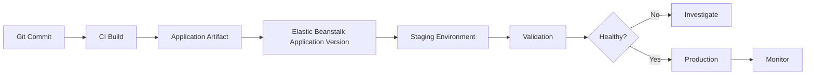
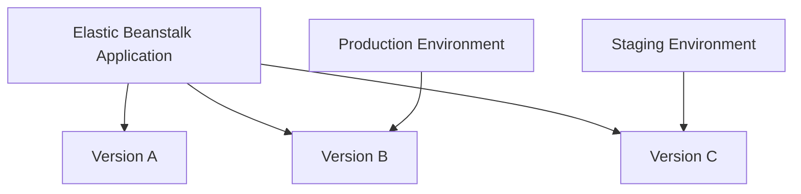
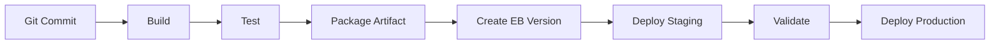

# 03- Application and Version Management

## Overview

Elastic Beanstalk separates an application from the deployable versions of that application and the environments that run those versions.

This distinction is central to reliable deployments:

```text
Elastic Beanstalk Application
│
├── Application Version 1
├── Application Version 2
├── Application Version 3
│
├── staging environment
│   └── Application Version 3
│
└── production environment
    └── Application Version 2
```

An **application version** is a specific deployable artifact identified by Elastic Beanstalk. An **environment** is the runtime infrastructure where a selected application version is deployed.

This separation enables controlled promotion, rollback, blue/green deployments, release validation, and CI/CD workflows.

## Application Versions

An application version represents a deployable version of an application.

It typically references an application bundle stored in Amazon S3. The bundle can contain source code, configuration files, platform-specific files, and other artifacts required to run the application.

The important distinction is:

| Resource | Purpose |
|---|---|
| Application | Logical container for the application |
| Application version | Immutable deployable release artifact |
| Environment | Running infrastructure |
| Instance | Compute resource running the application |

An application version does not represent a running application by itself.

For example:

```text
Application
└── orders-api

Application Versions
├── release-2026-08-01
├── release-2026-08-08
└── release-2026-08-13

Environments
├── staging  → release-2026-08-13
└── production → release-2026-08-08
```

This allows staging and production to run different releases while sharing the same application-level version history.

## Why Application Versions Matter

Application versions provide a stable deployment unit.

Without versioned artifacts, deployment would effectively mean:

```text
Current source code
      ↓
Production
```

This makes it difficult to answer:

- What exactly was deployed?
- Which release caused the incident?
- What version should be restored?
- Which artifact was tested in staging?
- Can the previous release be redeployed?

With application versions:

```text
Git Commit
    ↓
CI Build
    ↓
Application Artifact
    ↓
Elastic Beanstalk Application Version
    ↓
Staging
    ↓
Production
```

The deployment process becomes traceable and repeatable.

## Application Version Naming

Version labels should be unique and meaningful.

Good examples:

```text
orders-api-2026-08-13-001
orders-api-v2.7.3
release-a84f21c
build-1842
```

A strong production convention is to include a build or commit identifier:

```text
orders-api-a84f21c
```

where `a84f21c` identifies the source revision.

Avoid ambiguous labels:

```text
latest
final
new
test
version1
production
```

A version label should identify a specific release rather than a moving concept.

## Application Version Lifecycle

A typical release lifecycle is:



The application version should remain tied to the artifact that was actually tested.

## Deploying the Current Application

The EB CLI can package and deploy the current application:

```bash
eb deploy
```

When an application is deployed, Elastic Beanstalk creates or selects an application version and associates it with the target environment.

Specify an environment explicitly when appropriate:

```bash
eb deploy staging
```

or:

```bash
eb deploy production
```

Before production deployment:

```bash
eb status
eb health
```

This reduces the risk of deploying to the wrong environment.

## Deploying a Specific Version

A production rollback often involves deploying a previously known-good application version rather than rebuilding the application.

The general model is:

```text
Known-good Application Version
             ↓
       Production Environment
```

This is preferable to attempting to reconstruct an old release from memory or from a developer workstation.

The exact deployment command should be chosen according to the release workflow and whether the version already exists in the Elastic Beanstalk application.

## Version Promotion

A mature release process promotes the same artifact between environments.

```text
                    Application Version
                           │
                           ▼
                       Staging
                           │
                     Automated Tests
                           │
                     Manual Approval
                           │
                           ▼
                      Production
```

Avoid rebuilding source code separately for staging and production.

Bad:

```text
Source
 ├── Build A → Staging
 └── Build B → Production
```

Preferred:

```text
Source
   │
   ▼
One Build
   │
   ▼
One Artifact
   ├── Staging
   └── Production
```

This reduces differences between what was tested and what was released.

## Application Version and Environment Relationship

An environment points to an application version.



This means an application can maintain many versions while each environment runs one selected version at a time.

## Version History

Version history is valuable during incident investigation.

For example:

```text
Version                 Environment
------------------------------------------------
release-101             archived
release-102             archived
release-103             staging
release-104             production
```

If production begins failing immediately after `release-104`, the previous version can be identified without reconstructing the deployment history.

Version history should be correlated with:

- Git commit
- CI build ID
- Deployment timestamp
- Change request
- Release notes
- Infrastructure changes

## Application Version Source Bundles

Elastic Beanstalk deploys an application source bundle rather than directly deploying an arbitrary working directory.

For Python applications, the bundle may contain:

```text
application/
├── manage.py
├── requirements.txt
├── config/
├── application/
├── .ebextensions/
└── .platform/
```

The bundle should contain only what is required for deployment.

Avoid including:

```text
.git/
.venv/
__pycache__/
*.pyc
local secrets
development databases
large temporary files
```

Use `.ebignore` where appropriate to control files excluded from the deployment bundle.

## `.ebignore`

The `.ebignore` file controls files that should not be included in the application bundle generated by the EB CLI.

A typical example:

```text
.git/
.gitignore
.venv/
venv/
__pycache__/
*.pyc
.pytest_cache/
.env
.env.*
*.log
```

Do not use `.ebignore` as a substitute for proper secret management.

Secrets should not exist in the source tree in the first place.

## Platform Configuration and Application Versions

Application versions can contain Elastic Beanstalk-specific configuration files.

Common mechanisms include:

```text
.ebextensions/
.platform/
```

For example:

```text
application/
├── .ebextensions/
│   └── application.config
├── .platform/
│   └── hooks/
├── requirements.txt
└── application/
```

These files can influence environment configuration and application startup behavior.

Be careful when configuration changes are packaged with an application version because a deployment can therefore change both application behavior and infrastructure behavior.

## Application Code vs Environment Configuration

A useful separation is:

| Concern | Example | Typical location |
|---|---|---|
| Application code | Django views | Source repository |
| Dependencies | `requirements.txt` | Source repository |
| Platform hooks | Startup scripts | `.platform/` |
| Environment configuration | Runtime variables | Environment |
| Secrets | Database credentials | Secrets Manager / Parameter Store |
| Infrastructure | VPC, subnets, IAM | Infrastructure configuration |

Not every configuration belongs inside the application artifact.

## Versioning Python Applications

For Django or FastAPI applications, dependency versions should be controlled.

For example:

```text
Django==5.2.3
gunicorn==23.0.0
psycopg[binary]==3.2.9
```

The exact versions should reflect the application's tested dependency set.

Avoid deploying with uncontrolled dependency resolution such as:

```text
Django
psycopg
gunicorn
```

when reproducibility is required.

The artifact should represent a known dependency graph.

## Versioning Docker-Based Applications

For Docker-based Elastic Beanstalk environments, the application version should identify the exact image configuration being deployed.

Avoid relying on mutable tags such as:

```text
latest
```

Prefer immutable identifiers:

```text
orders-api:sha-a84f21c
```

or a digest-based reference where supported by the deployment architecture.

The goal is the same:

```text
Release
  ↓
Immutable Artifact
  ↓
Environment
```

## Application Version Rollback

Rollback means moving an environment from the current application version to a known-good version.

Example:

```text
Current:
production → release-105

Incident detected

Rollback:
production → release-104
```

Rollback is effective when application versions are immutable and independently deployable.

A rollback should not require:

```text
git checkout old-commit
pip install something
manually edit configuration
rebuild locally
deploy manually
```

That workflow introduces too many variables.

## Rollback and Database Migrations

Application rollback does not automatically imply database rollback.

Consider:

```text
Version A
Database Schema A
```

After deployment:

```text
Version B
Database Schema B
```

If Version B performs a destructive schema migration, deploying Version A may fail because Version A expects Schema A.

Prefer expand-and-contract migrations:

```text
Schema A
   ↓
Expand schema
   ↓
Deploy Version B
   ↓
Migrate data
   ↓
Remove obsolete schema later
```

This allows multiple application versions to coexist safely during deployment transitions.

## Application Version Retention

Application versions consume storage and should not accumulate indefinitely.

A mature lifecycle may look like:

```text
Recent versions
      ↓
Retained for rollback

Older versions
      ↓
Retained according to policy

Obsolete versions
      ↓
Deleted
```

Retention should consider:

- Rollback requirements
- Audit requirements
- Compliance
- Incident investigation
- Storage cost
- Release frequency

Do not delete old versions immediately after a production deployment if they are part of the rollback strategy.

## Deleting Application Versions

Application versions can be removed when they are no longer required.

Before deleting versions, verify:

- They are not currently deployed where they are needed.
- They are outside the rollback window.
- Required audit information has been preserved.
- CI/CD does not depend on them.
- Retention policies permit deletion.

A production platform should define a version-retention policy instead of allowing unlimited accumulation.

## CI/CD Integration

Elastic Beanstalk application version management works particularly well with CI/CD.

A pipeline can follow:



A production pipeline should identify every deployment with an immutable release identifier.

For example:

```text
Git SHA:
a84f21c

Build:
1842

Elastic Beanstalk Version:
orders-api-a84f21c
```

This provides traceability across the entire release pipeline.

## GitHub Actions Example

A simplified deployment workflow might look like:

```yaml
name: Deploy to Elastic Beanstalk

on:
  push:
    branches:
      - main

jobs:
  deploy:
    runs-on: ubuntu-latest

    steps:
      - name: Checkout
        uses: actions/checkout@v4

      - name: Configure AWS credentials
        uses: aws-actions/configure-aws-credentials@v4
        with:
          aws-region: ${{ secrets.AWS_REGION }}
          aws-access-key-id: ${{ secrets.AWS_ACCESS_KEY_ID }}
          aws-secret-access-key: ${{ secrets.AWS_SECRET_ACCESS_KEY }}

      - name: Install EB CLI
        run: |
          python -m pip install --upgrade pip
          pip install awsebcli

      - name: Deploy
        run: |
          eb deploy production
```

For production systems, prefer short-lived AWS credentials through an appropriate GitHub Actions OIDC role rather than long-lived IAM access keys stored as CI secrets.

## Release Metadata

Application versions should be traceable to the source revision that produced them.

A useful release metadata model is:

| Field | Example |
|---|---|
| Application | `orders-api` |
| Version | `orders-api-a84f21c` |
| Git SHA | `a84f21c` |
| Build ID | `1842` |
| Environment | `production` |
| Deployment time | `2026-08-13T10:30:00Z` |
| Pipeline | `github-actions` |

This makes incident investigation significantly easier.

## Deployment Strategies

Application versions support several deployment strategies.

| Strategy | Behavior | Main characteristic |
|---|---|---|
| All at once | Update all instances | Fast but higher risk |
| Rolling | Update instances in batches | Reduced simultaneous impact |
| Rolling with additional batch | Uses extra capacity during deployment | Better availability |
| Immutable | Launches new instances before replacing old ones | Strong deployment isolation |
| Traffic splitting | Gradually shifts traffic | Controlled exposure |
| Blue/green | Separate environments | Strong rollback isolation |

The exact availability and rollback characteristics depend on the selected Elastic Beanstalk deployment configuration.

## Rolling Deployment

A rolling deployment updates instances in batches.

```text
Before:

A v1
B v1
C v1
D v1

Deployment:

A v2
B v1
C v1
D v1

A v2
B v2
C v1
D v1

A v2
B v2
C v2
D v1

Final:

A v2
B v2
C v2
D v2
```

This reduces the number of instances simultaneously affected by the deployment.

However, the old and new versions can coexist temporarily.

Therefore, application changes should be backward compatible.

## Immutable Deployment

An immutable deployment creates new instances with the new application version before terminating the old instances.

Conceptually:

```text
Old fleet
├── v1
├── v1
└── v1

New fleet
├── v2
├── v2
└── v2
```

After the new fleet becomes healthy, the old fleet can be removed.

This provides stronger isolation than a traditional rolling update but may temporarily require additional compute capacity.

## Deployment Safety

Before production deployment:

```text
Application Version
        │
        ▼
Dependency Validation
        │
        ▼
Automated Tests
        │
        ▼
Staging
        │
        ▼
Health Checks
        │
        ▼
Smoke Tests
        │
        ▼
Production
```

The release process should verify both application behavior and infrastructure assumptions.

## Application Version Security

Application bundles should not contain secrets.

Do not package:

```text
.env
database passwords
private keys
AWS access keys
API tokens
production credentials
```

Instead, use managed secret mechanisms and runtime configuration.

Also ensure CI/CD permissions are limited to the operations required by the deployment process.

## Common Mistakes

### Using Mutable Version Labels

Using:

```text
latest
```

makes release identification ambiguous.

Prefer immutable release identifiers.

### Rebuilding During Promotion

Building a new artifact for production after testing a different artifact in staging weakens release confidence.

Promote the tested artifact.

### Deleting Versions Too Aggressively

Deleting the previous production version immediately removes an easy rollback target.

Retain versions according to an explicit policy.

### Rolling Back Without Considering the Database

Application code and database schema must remain compatible.

A version rollback can fail even when the application artifact itself is valid.

### Storing Secrets in Application Bundles

The application bundle can be copied, stored, inspected, or retained.

Secrets should be externalized.

### Using `latest` for Container Images

A mutable container tag can cause the same application version to execute different code at different times.

Use immutable image identifiers.

### Ignoring Deployment Strategy

The deployment strategy affects:

- Availability
- Capacity
- Rollback behavior
- Mixed-version operation
- Deployment duration

Choose it according to application characteristics rather than using the default blindly.

### Deploying Without Health Verification

A successful deployment command only confirms that the deployment operation completed.

Verify:

```bash
eb health
eb events
```

and application-level metrics.

## Production Workflow

A production-grade release process can be structured as:

```text
Developer Commit
      │
      ▼
CI Build
      │
      ▼
Automated Tests
      │
      ▼
Immutable Artifact
      │
      ▼
Elastic Beanstalk Version
      │
      ▼
Staging Environment
      │
      ▼
Smoke / Integration Tests
      │
      ▼
Approval
      │
      ▼
Production Deployment
      │
      ▼
Health Verification
      │
      ▼
Observability
      │
      ├── Healthy → Retain Version
      │
      └── Unhealthy → Roll Back
```

This creates a clear relationship between source code, artifact, environment, and production state.

## Operational Checklist

Before creating or deploying an application version:

- [ ] Confirm the target Elastic Beanstalk application.
- [ ] Confirm the target environment.
- [ ] Verify the Git commit or release identifier.
- [ ] Ensure the artifact is reproducible.
- [ ] Confirm dependencies are pinned appropriately.
- [ ] Ensure secrets are excluded from the bundle.
- [ ] Validate configuration changes.
- [ ] Verify database migration compatibility.
- [ ] Confirm the deployment strategy.
- [ ] Validate staging.
- [ ] Confirm rollback capability.
- [ ] Retain the previous known-good version.
- [ ] Monitor application health after deployment.

Useful commands include:

```bash
eb status
eb health
eb events
eb deploy
```

## Interview Traps

### What is the difference between an application and an application version?

An application is the logical Elastic Beanstalk container. An application version represents a specific deployable artifact associated with that application.

### Can multiple environments use different application versions?

Yes.

For example:

```text
staging    → version-105
production → version-104
```

### Why are application versions useful for rollback?

Because a previous known-good artifact can be redeployed without rebuilding the source code.

### Should staging and production use separately built artifacts?

Generally no.

A stronger release process builds once, validates the artifact, and promotes that same artifact.

### Does rolling back an application version roll back the database?

No.

Database schema and application rollback are separate concerns and must be designed for compatibility.

### Why are immutable artifacts important?

They provide predictable deployment behavior and make releases traceable and reproducible.

### Why should version labels contain a Git SHA or build identifier?

They create a direct relationship between the deployed artifact and the source revision that produced it.

### Does a successful `eb deploy` prove that the application is healthy?

No.

Deployment success and application health are different states. Health checks, logs, events, metrics, and application-level tests should be used for verification.

## Key Takeaways

- An Elastic Beanstalk application is a logical container, while an application version is a specific deployable release artifact.
- Environments select and run application versions.
- Version labels should be unique, immutable, and traceable to a Git commit or CI build.
- Build an artifact once and promote the same artifact through staging and production.
- Keep application bundles free of secrets, unnecessary files, and development artifacts.
- `.ebignore` can reduce unnecessary bundle contents but should not be treated as a secrets-management system.
- Rolling deployments can temporarily run multiple application versions, so backward-compatible application and database changes are important.
- Immutable deployments provide stronger isolation by creating new instances before replacing the old fleet.
- Application rollback does not automatically roll back database schema changes.
- Retain previous known-good versions according to a defined rollback, audit, and compliance policy.
- CI/CD should connect Git commits, build artifacts, Elastic Beanstalk versions, environments, and deployment records.
- Production deployment is complete only after the new version has passed health and application-level verification.