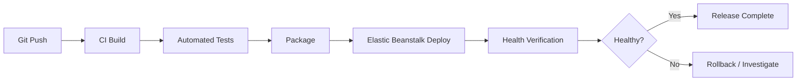
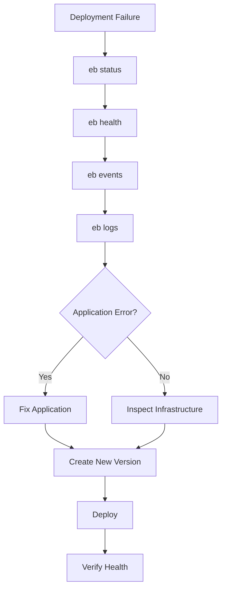

# 04- Deployment Commands

## Overview

Elastic Beanstalk deployment commands are primarily used to package application code, create or select application versions, deploy versions to environments, monitor deployment state, and recover from failed releases.

The most important operational distinction is between:

- **Application commands** — manage the Elastic Beanstalk application.
- **Environment commands** — inspect or modify a running environment.
- **Deployment commands** — publish an application version to an environment.
- **Configuration commands** — modify environment configuration.
- **Health and diagnostic commands** — verify runtime state and investigate failures.

A typical deployment workflow is:

```text
Source Code
    ↓
eb deploy
    ↓
Application Version
    ↓
Elastic Beanstalk Environment
    ↓
Deployment
    ↓
Health Verification
```

The EB CLI is useful for local development and operational workflows, while production CI/CD pipelines can use either the EB CLI or AWS APIs/CLI depending on the deployment architecture.

## EB CLI Command Categories

| Category | Common commands | Purpose |
|---|---|---|
| Application | `eb init`, `eb create` | Initialize and create environments |
| Environment | `eb use`, `eb status`, `eb health` | Select and inspect environments |
| Deployment | `eb deploy` | Deploy application code |
| Events | `eb events` | Inspect environment events |
| Logs | `eb logs` | Retrieve logs |
| Configuration | `eb config`, `eb setenv` | Inspect or change configuration |
| SSH | `eb ssh` | Connect to an instance |
| Termination | `eb terminate` | Delete an environment |
| Platform | `eb upgrade` | Upgrade environment platform |

The commands should be treated as operational interfaces rather than isolated shell commands. A production workflow normally combines several commands to validate the target, deploy safely, and verify the result.

## Prerequisites

The EB CLI requires:

- AWS credentials with appropriate permissions
- An initialized Elastic Beanstalk project
- An Elastic Beanstalk application
- A target environment
- Application source code in the current directory

Check that the CLI is available:

```bash
eb --version
```

Check AWS CLI credentials:

```bash
aws sts get-caller-identity
```

The second command is particularly useful because it confirms which AWS identity is currently being used.

## Initialize an Elastic Beanstalk Project

Use:

```bash
eb init
```

This associates the local project with an Elastic Beanstalk application and configures deployment metadata.

The EB CLI stores project configuration under:

```text
.elasticbeanstalk/
```

A typical project may contain:

```text
project/
├── .elasticbeanstalk/
├── .ebextensions/
├── .platform/
├── requirements.txt
└── application/
```

Do not treat `.elasticbeanstalk/` as a location for application secrets.

## Select an Environment

When an application has multiple environments, use:

```bash
eb use
```

This allows the CLI to select an environment associated with the current project.

A typical setup might be:

```text
Application
├── development
├── staging
└── production
```

Before deploying, verify which environment is selected:

```bash
eb status
```

This is one of the most important safety checks in a multi-environment workflow.

## Check Environment Status

Use:

```bash
eb status
```

Typical information includes:

- Environment name
- Application name
- Platform
- Health state
- CNAME
- Current application version

Use this before and after deployment.

Example workflow:

```bash
eb status
eb deploy
eb status
```

## Check Environment Health

Use:

```bash
eb health
```

For production operations, deployment success should not be interpreted as application health.

A deployment can complete while the application subsequently experiences:

- HTTP 5xx errors
- failed health checks
- startup failures
- database connectivity problems
- dependency failures
- resource exhaustion

Therefore:

```text
Deployment Success
        ≠
Application Health
```

## Deploy an Application

The primary deployment command is:

```bash
eb deploy
```

It packages the current application and deploys it to the selected environment.

A basic deployment workflow is:

```bash
eb status
eb deploy
eb health
```

For a named environment:

```bash
eb deploy production
```

Explicitly specifying the environment can reduce accidental deployments when working with multiple environments.

## Deploy with a Custom Version Label

A version label can be specified when creating a deployment:

```bash
eb deploy production --label orders-api-a84f21c
```

A useful naming convention is:

```text
<application>-<git-sha>
```

For example:

```text
orders-api-a84f21c
```

This provides traceability between:

```text
Git Commit
    ↓
Build
    ↓
Elastic Beanstalk Version
    ↓
Environment
```

Version labels should be unique and meaningful.

Avoid:

```text
latest
test
final
new
```

## Deploy Without Waiting

For automation workflows, deployment behavior can be controlled using appropriate EB CLI options.

When asynchronous behavior is required, ensure that the CI/CD pipeline separately verifies deployment completion and environment health.

Do not assume that returning from a deployment command automatically means the application is healthy.

A safer pipeline model is:

```text
Deploy
  ↓
Wait / Poll
  ↓
Check Status
  ↓
Check Health
  ↓
Run Smoke Tests
```

## Deploy from CI/CD

A typical CI/CD workflow is:



A deployment command in GitHub Actions might be:

```yaml
- name: Deploy to Elastic Beanstalk
  run: eb deploy production
```

The deployment identity should have only the permissions required by the deployment process.

For GitHub Actions, prefer short-lived AWS credentials through OIDC where practical rather than long-lived IAM access keys.

## Deployment Workflow for Django

A Django deployment might use:

```bash
python manage.py check --deploy
eb deploy production
eb health
```

The Django deployment should also account for:

- database migrations
- static assets
- environment variables
- allowed hosts
- trusted origins
- application startup
- dependency installation

A deployment command does not automatically guarantee that Django is correctly configured for production.

## Deployment Workflow for FastAPI

For a FastAPI application:

```bash
eb deploy production
eb health
```

The application must be configured to run through the Elastic Beanstalk platform's expected process.

For example, the production process may ultimately execute an application server such as:

```bash
gunicorn -k uvicorn.workers.UvicornWorker app.main:app
```

The exact command depends on the selected Elastic Beanstalk platform and application configuration.

## Deployment Events

Use:

```bash
eb events
```

Deployment events are useful for identifying:

- instance replacement
- deployment failures
- configuration changes
- health transitions
- platform events
- infrastructure failures

A useful troubleshooting sequence is:

```bash
eb status
eb health
eb events
eb logs
```

This gives progressively more information about the environment.

## Retrieve Logs

Use:

```bash
eb logs
```

Logs are useful when the deployment completes but the application fails during startup or runtime.

Typical investigation flow:

```text
Deployment
    ↓
Health Degraded
    ↓
eb events
    ↓
eb logs
    ↓
Application Error
```

For deeper investigation, use SSH where appropriate:

```bash
eb ssh
```

Do not make permanent production configuration changes manually through SSH. Instance-level changes are generally not durable across instance replacement or scaling.

## Open an SSH Session

Use:

```bash
eb ssh
```

This can be useful for diagnostics such as:

```bash
ps aux
df -h
free -m
ss -lntp
```

However, SSH should be considered a diagnostic mechanism rather than a normal deployment mechanism.

Avoid:

```text
SSH → edit application → restart service
```

Prefer:

```text
Git → CI/CD → Elastic Beanstalk deployment
```

This keeps the environment reproducible.

## Environment Variables

Set environment variables with:

```bash
eb setenv KEY=value
```

For multiple variables:

```bash
eb setenv \
  DJANGO_SETTINGS_MODULE=config.settings.production \
  LOG_LEVEL=INFO \
  APP_ENV=production
```

Environment variables are useful for non-secret configuration.

For sensitive values, prefer AWS Secrets Manager or AWS Systems Manager Parameter Store rather than placing credentials directly into shell history or source code.

## View Environment Variables

Use:

```bash
eb printenv
```

This is useful for verifying runtime configuration.

Be careful when displaying environment variables in shared terminals, CI logs, screenshots, or incident channels because they may contain sensitive values.

## Configuration Management

Inspect environment configuration with:

```bash
eb config
```

Environment configuration can include:

- instance settings
- scaling configuration
- environment variables
- load balancer settings
- deployment policies
- platform configuration

Treat configuration changes as production changes.

A good workflow is:

```text
Configuration Change
        ↓
Review
        ↓
Apply
        ↓
Health Verification
        ↓
Monitor
```

## Create an Environment

A new environment can be created with:

```bash
eb create staging
```

For production systems, environment creation should be planned carefully because it can provision:

- compute resources
- load balancers
- security groups
- Auto Scaling configuration
- networking resources
- IAM-related resources

A common architecture is:

```text
Application
├── staging
└── production
```

Separate environments provide stronger isolation than trying to represent staging and production through application-level flags.

## Environment Naming

Use predictable environment names:

```text
orders-api-dev
orders-api-staging
orders-api-production
```

Avoid ambiguous names such as:

```text
new-env
test2
temp
final-prod
```

Environment names become part of operational workflows, dashboards, deployment scripts, and incident response.

## Switch Between Environments

Use:

```bash
eb use staging
```

Then verify:

```bash
eb status
```

For production:

```bash
eb use production
eb status
```

A strong operational habit is:

```bash
eb status
```

immediately before:

```bash
eb deploy
```

This reduces accidental deployments to the wrong environment.

## Application Version Management Commands

List application versions through the AWS CLI when version-level inspection is required:

```bash
aws elasticbeanstalk describe-application-versions \
  --application-name orders-api
```

This is useful for CI/CD and operational automation.

The AWS CLI can also be used to inspect environment state:

```bash
aws elasticbeanstalk describe-environments \
  --application-name orders-api
```

The EB CLI provides a developer-oriented interface, while the AWS CLI provides broader API-level control.

## Deploy a Specific Application Version

For controlled release workflows, a previously created application version can be deployed to an environment using the Elastic Beanstalk API.

The AWS CLI pattern is:

```bash
aws elasticbeanstalk update-environment \
  --environment-name orders-api-production \
  --version-label orders-api-a84f21c
```

This is useful for:

- rollback
- promotion
- deployment automation
- reproducing a known release

The version must already exist for the target Elastic Beanstalk application.

## Rollback

A rollback should use a known-good application version.

First identify versions:

```bash
aws elasticbeanstalk describe-application-versions \
  --application-name orders-api
```

Then deploy the selected version:

```bash
aws elasticbeanstalk update-environment \
  --environment-name orders-api-production \
  --version-label orders-api-7b31e90
```

Afterward:

```bash
eb health
eb events
```

Then perform application-level smoke tests.

## Deployment Policies

Elastic Beanstalk supports multiple deployment policies.

Common strategies include:

| Strategy | Primary characteristic | Typical use |
|---|---|---|
| All at once | Fastest deployment | Low-risk environments |
| Rolling | Updates instances in batches | Availability-conscious deployments |
| Rolling with additional batch | Adds temporary capacity | Reduced capacity impact |
| Immutable | New instances run new version | Strong deployment isolation |
| Traffic splitting | Gradual traffic movement | Controlled production releases |

The correct strategy depends on:

- application startup time
- traffic characteristics
- capacity requirements
- rollback requirements
- database compatibility
- deployment risk

## Deployment Configuration

Deployment settings can be configured through Elastic Beanstalk environment configuration.

The deployment process should be treated as infrastructure configuration rather than merely a command-line action.

A production release should have documented decisions for:

```text
Deployment Policy
       +
Instance Capacity
       +
Health Checks
       +
Application Version
       +
Rollback Strategy
```

## Wait for Deployment Completion

Automation should not rely solely on the exit status of a deployment command.

A production pipeline should verify:

```text
Deployment Started
      ↓
Deployment Completed
      ↓
Environment Health
      ↓
Application Health
      ↓
Smoke Tests
```

For AWS API-driven automation, environment status can be inspected using:

```bash
aws elasticbeanstalk describe-environments \
  --environment-names orders-api-production
```

The pipeline can then evaluate environment status and health before proceeding.

## Common Deployment Sequence

A practical production sequence is:

```bash
aws sts get-caller-identity

eb status

eb health

eb deploy production

eb events

eb health
```

Then run application-level verification.

For example:

```bash
curl -fsS https://api.example.com/health
```

The deployment should be considered successful only after both infrastructure and application checks pass.

## Deployment Safety Checklist

Before deployment:

```text
[ ] Correct AWS account
[ ] Correct application
[ ] Correct environment
[ ] Correct Git commit
[ ] Tests passing
[ ] Artifact validated
[ ] Database migration reviewed
[ ] Secrets externalized
[ ] Deployment policy confirmed
[ ] Previous version available
```

After deployment:

```text
[ ] Environment healthy
[ ] No critical deployment events
[ ] Application health endpoint succeeds
[ ] Error rate normal
[ ] Latency normal
[ ] Database connectivity normal
[ ] Background workers healthy
```

## Common Mistakes

### Deploying Without Checking the Target Environment

Running:

```bash
eb deploy
```

without knowing which environment is selected can result in an accidental production deployment.

Use:

```bash
eb status
```

before deployment.

### Treating Deployment Success as Application Success

A successful deployment command does not prove that the application is healthy.

Always verify:

```bash
eb health
eb events
```

and application-level health.

### Using SSH as the Deployment Mechanism

Manual changes made through:

```bash
eb ssh
```

are not a reliable deployment strategy.

Instances can be replaced by Auto Scaling, deployments, or platform operations.

Use version-controlled CI/CD deployments instead.

### Storing Secrets with `eb setenv`

Environment variables are useful for configuration, but directly managing sensitive credentials through shell commands can expose them through command history or operational tooling.

Use Secrets Manager or Parameter Store for sensitive values.

### Deploying to Production Without a Rollback Version

A production deployment should have a known-good previous release available.

For example:

```text
production → v104

Deploy v105

If unhealthy:
production → v104
```

### Ignoring Database Compatibility

A deployment can fail even when the application artifact is correct if the database schema is incompatible.

Use backward-compatible migrations and an expand-and-contract approach for high-risk schema changes.

### Making Untracked Infrastructure Changes

Changing instance configuration manually can create configuration drift.

Prefer declarative configuration and version-controlled infrastructure wherever practical.

## Production Command Reference

| Command | Purpose | Production use |
|---|---|---|
| `eb init` | Initialize project | Initial setup |
| `eb status` | Show environment state | Pre/post deployment verification |
| `eb health` | Show health | Deployment verification |
| `eb deploy` | Deploy application | Primary deployment |
| `eb events` | Show events | Troubleshooting |
| `eb logs` | Retrieve logs | Troubleshooting |
| `eb printenv` | Show environment variables | Configuration verification |
| `eb setenv` | Set environment variables | Runtime configuration |
| `eb use` | Select environment | Multi-environment workflows |
| `eb create` | Create environment | Environment provisioning |
| `eb ssh` | Connect to instance | Diagnostics |
| `eb config` | Inspect configuration | Configuration management |
| `eb terminate` | Terminate environment | Environment cleanup |

## EB CLI vs AWS CLI

The two interfaces serve different operational needs.

| Capability | EB CLI | AWS CLI |
|---|---|---|
| Developer deployment | Excellent | Possible |
| `eb deploy` workflow | Native | API-driven |
| Environment inspection | Convenient | Detailed |
| Application version API | Limited/convenient | Extensive |
| CI/CD automation | Good | Excellent |
| Cross-service automation | Limited | Excellent |
| AWS API access | Indirect | Direct |

A common production pattern is:

```text
Developer Workflow
      ↓
EB CLI

CI/CD / Automation
      ↓
AWS CLI / AWS SDK / EB CLI
```

The choice should depend on the automation requirements rather than forcing one tool everywhere.

## Troubleshooting Workflow

When a deployment fails:



Start with high-level state and progressively inspect lower-level information.

Useful commands:

```bash
eb status
eb health
eb events
eb logs
```

For infrastructure-level inspection:

```bash
aws elasticbeanstalk describe-environments \
  --environment-names orders-api-production
```

## Production Best Practices

### Verify Before Deploying

Always confirm:

```bash
aws sts get-caller-identity
eb status
```

This validates both the AWS identity and target environment.

### Use Immutable Release Identifiers

Prefer:

```text
orders-api-a84f21c
```

over:

```text
latest
```

### Build Once, Promote Many Times

Use the same tested artifact across environments.

```text
Build
  ↓
Artifact
  ├── Staging
  └── Production
```

### Keep Rollback Simple

Maintain a known-good application version that can be deployed without rebuilding.

### Automate Health Verification

A deployment pipeline should verify:

- Elastic Beanstalk environment health
- application health endpoint
- HTTP error rates
- latency
- dependency health

### Keep Deployment Configuration Version Controlled

Avoid relying on undocumented manual changes.

### Use Least-Privilege IAM

The deployment identity should have only the permissions necessary to perform the deployment.

### Avoid Manual Instance Changes

Instances are disposable infrastructure. Configuration should be represented in the application, platform configuration, environment configuration, or infrastructure-as-code.

## Interview Traps

### What is the difference between `eb deploy` and `eb create`?

`eb deploy` deploys application code to an existing environment.

`eb create` creates a new Elastic Beanstalk environment.

### Does `eb deploy` create a new environment?

No. It deploys the application to the selected or specified existing environment.

### Why run `eb status` before deployment?

To confirm the target environment and reduce accidental deployments.

### What is the purpose of `eb health`?

It provides environment health information. Deployment completion alone does not guarantee application health.

### Why use `eb events`?

It provides chronological environment events that help diagnose deployment and infrastructure problems.

### When should `eb ssh` be used?

Primarily for diagnostics and investigation. It should not be the normal deployment mechanism.

### How do you roll back an Elastic Beanstalk deployment?

Deploy a previously known-good application version to the affected environment.

### Should production secrets be passed directly through `eb setenv`?

Sensitive values are better managed through dedicated AWS secret-management services and injected into the runtime securely.

### Why use AWS CLI instead of only EB CLI?

The AWS CLI provides direct access to Elastic Beanstalk APIs and broader AWS automation capabilities, making it useful for CI/CD and operational tooling.

## Key Takeaways

- `eb deploy` is the primary EB CLI command for deploying application code to an existing environment.
- Always verify the AWS identity and target environment before production deployment.
- `eb status` identifies the current environment state and is a useful pre/post-deployment check.
- `eb health` verifies environment health but should be supplemented with application-level health checks.
- `eb events` and `eb logs` are the first operational tools to use when diagnosing deployment failures.
- `eb use` is important when managing multiple environments from the same project.
- `eb setenv` is useful for runtime configuration, but sensitive credentials should generally be managed through AWS Secrets Manager or Parameter Store.
- `eb ssh` should be treated as a diagnostic tool, not a deployment mechanism.
- Use immutable version labels tied to Git commits or CI build identifiers.
- Production CI/CD should build once, promote the tested artifact, verify health, and retain a rollback version.
- The EB CLI provides a convenient developer workflow, while the AWS CLI is often better suited to API-driven automation and broader AWS operations.
- Deployment completion, environment health, and application health are separate states and should all be verified.