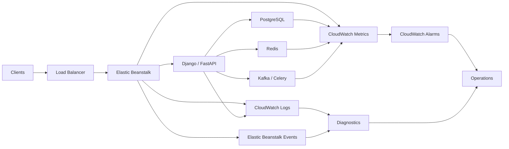

# 06- Monitoring and Diagnostics

## Overview

Monitoring and diagnostics in Amazon Elastic Beanstalk provide visibility into application health, infrastructure behavior, deployment failures, and runtime problems.

For a production backend service, monitoring should answer four questions:

- Is the application available?
- Is it responding within acceptable latency?
- Is it producing errors?
- Why did the problem occur?

Elastic Beanstalk combines environment health information, application logs, platform logs, Amazon CloudWatch metrics, Elastic Load Balancing metrics, and AWS audit information to provide operational visibility.

A useful production model is:

```text
                    Elastic Beanstalk Environment
                              │
              ┌───────────────┼────────────────┐
              │               │                │
              ▼               ▼                ▼
        Application Logs   Health Data     Deployment Events
              │               │                │
              └───────────────┼────────────────┘
                              ▼
                       CloudWatch / EB
                              │
              ┌───────────────┼────────────────┐
              ▼               ▼                ▼
           Metrics          Logs            Alarms
              │               │                │
              └───────────────┼────────────────┘
                              ▼
                       Operations Team
```

Monitoring is not simply about collecting logs. Senior-level operations require correlation between **health, metrics, logs, deployments, infrastructure, and application behavior**.

## Elastic Beanstalk Health

Elastic Beanstalk continuously evaluates the state of the environment and instances.

The environment health state provides a high-level operational signal.

Typical states include:

| State | Meaning |
|---|---|
| Green | Environment is operating normally |
| Yellow | Degraded health or warning condition |
| Red | Severe health problem |
| Grey | Health information is unavailable or insufficient |

Check environment status with:

```bash
eb status
```

Example:

```text
Environment details for: orders-api-production
  Application name: orders-api
  Region: ap-south-1
  Deployed Version: orders-api-42
  Environment ID: e-xxxxxxxxxx
  Platform: Python
  Health: Green
  CNAME: orders-api.example.com
```

The health state is useful as an initial signal, but it should not be treated as a complete representation of application health.

An environment can be healthy at the infrastructure level while the application is experiencing:

- Slow database queries
- Elevated API latency
- Business-level failures
- Increased error rates
- Partial endpoint failures

## Health Monitoring

Elastic Beanstalk health monitoring uses signals from the environment to determine whether instances and the application are behaving correctly.

The underlying signals can include:

- HTTP response codes
- Request latency
- Instance status
- Load balancer behavior
- Application process health
- Environment events

A useful operational distinction is:

```text
Infrastructure Health
        │
        ├── Instance running
        ├── Load balancer healthy
        └── Environment operational

Application Health
        │
        ├── API responding
        ├── Error rate acceptable
        ├── Latency acceptable
        └── Dependencies available
```

Both layers need to be monitored.

## Health Checks

A load balancer health check determines whether an instance should receive traffic.

For a backend API, a dedicated endpoint such as:

```text
/health
```

or:

```text
/healthz
```

can provide a lightweight health signal.

For example, a Django endpoint might return:

```json
{
  "status": "ok"
}
```

A FastAPI endpoint could be:

```python
from fastapi import FastAPI

app = FastAPI()


@app.get("/healthz")
async def healthz() -> dict[str, str]:
    return {"status": "ok"}
```

The endpoint should be intentionally lightweight.

Avoid making health checks perform expensive operations such as:

- Large database queries
- External API requests
- Full application workflows
- Cache rebuilds
- Expensive authentication operations

A health check is executed frequently. An expensive health check can become a source of additional load.

## Liveness vs Readiness

A useful production distinction is between liveness and readiness.

### Liveness

Answers:

> Is the process alive?

Example:

```text
GET /healthz
→ 200 OK
```

### Readiness

Answers:

> Can this instance safely receive application traffic?

A readiness check might validate critical dependencies such as a database connection.

The trade-off must be considered carefully. If every transient dependency failure makes an instance completely unhealthy, a dependency outage can cause all application instances to be removed from service.

For this reason, health checks should reflect the actual failure semantics of the application.

## EB CLI Diagnostics

The EB CLI provides several operational commands.

| Command | Purpose |
|---|---|
| `eb status` | Display environment status |
| `eb health` | Inspect environment health |
| `eb events` | View recent environment events |
| `eb logs` | Retrieve environment logs |
| `eb printenv` | Display environment variables |
| `eb deploy` | Deploy a new application version |
| `eb open` | Open the deployed environment |
| `eb ssh` | Connect to an instance |
| `eb config` | Inspect environment configuration |

A common first-response workflow is:

```bash
eb status
eb health
eb events
eb logs
```

This gives progressively deeper visibility into the environment.

## `eb health`

Use:

```bash
eb health
```

This provides more detailed health information than `eb status`.

It can help identify:

- Unhealthy instances
- Request failures
- Latency problems
- Instance-level degradation
- Environment-wide problems

For example:

```bash
eb health
```

is particularly useful when:

```text
eb status
    ↓
Health: Red
```

does not explain which instance or signal caused the problem.

## Environment Events

Elastic Beanstalk records environment events.

Use:

```bash
eb events
```

Events are useful for identifying changes such as:

- Deployment failures
- Instance replacement
- Configuration updates
- Scaling activity
- Health changes
- Platform problems

A typical incident investigation should correlate events with the time the problem started.

For example:

```text
14:02  Configuration changed
14:03  New instances launched
14:05  Deployment started
14:07  Health changed to Yellow
14:08  HTTP 5xx increased
```

This timeline can reveal that the application problem was introduced by a deployment or configuration change.

## Application Logs

Application logs provide detailed information about runtime behavior.

For Python applications, logs may contain:

```text
2026-08-13 10:32:18 INFO Request received
2026-08-13 10:32:18 INFO Processing order
2026-08-13 10:32:19 ERROR Database connection failed
```

A production application should use structured logging where possible.

Example:

```python
import logging

logger = logging.getLogger(__name__)

logger.info(
    "order_created",
    extra={
        "order_id": order_id,
    },
)
```

Avoid logging sensitive information such as:

- Passwords
- Access tokens
- Authorization headers
- Session cookies
- Secret keys
- Full payment information

## Retrieving Logs

Use:

```bash
eb logs
```

This retrieves logs from the environment.

For deeper investigation, logs can also be accessed through the AWS console or centralized logging systems.

When investigating an incident:

```text
Environment Health
        ↓
Recent Events
        ↓
Application Logs
        ↓
Infrastructure Metrics
        ↓
Dependency Metrics
```

Do not begin by reading thousands of log lines without first identifying the incident timeframe.

## Request Logs

Request logs are useful for understanding HTTP traffic.

They can help identify:

- Request volume
- HTTP status codes
- Slow endpoints
- Client behavior
- Traffic patterns

A request record conceptually contains information such as:

```text
Timestamp
HTTP Method
Path
Status Code
Response Time
Client Information
```

These logs can reveal patterns that application logs alone may not show.

For example:

```text
/api/orders        200   120ms
/api/orders        200   130ms
/api/orders        500   4200ms
/api/orders        500   3900ms
```

The pattern strongly suggests a backend failure rather than a simple load increase.

## Platform Logs

Platform-level logs help diagnose issues below application code.

Depending on the Elastic Beanstalk platform, useful information can include:

- Web server behavior
- Application server startup
- Deployment hooks
- Package installation
- Process startup
- Platform configuration
- Nginx behavior

This is particularly important when the application does not start successfully.

For example:

```text
Deployment
    ↓
Platform Hook
    ↓
Application Server
    ↓
Application Process
```

A failure can occur at any layer.

## Nginx and Application Server Diagnostics

A typical Python Elastic Beanstalk deployment can include:

```text
Internet
   ↓
Load Balancer
   ↓
Nginx
   ↓
Gunicorn / Application Server
   ↓
Django / FastAPI
```

If the load balancer reports HTTP 502 or 504 responses, investigate the entire request path.

For example:

| Symptom | Potential cause |
|---|---|
| 502 | Application server unavailable |
| 504 | Backend response timeout |
| 500 | Application exception |
| Connection refused | Process or port problem |
| High latency | Application or dependency bottleneck |

Do not assume every HTTP failure originates in Django or FastAPI.

## CloudWatch Metrics

Amazon CloudWatch provides metrics for monitoring AWS resources and application environments.

Important Elastic Beanstalk-related signals can include:

- Request count
- HTTP 2xx responses
- HTTP 3xx responses
- HTTP 4xx responses
- HTTP 5xx responses
- Latency
- Instance CPU utilization
- Instance health
- Load balancer metrics

Metrics are preferable to logs for detecting numerical trends.

For example:

```text
Error Rate
  0.2%
  0.3%
  0.4%
  8.5%  ← Incident
```

A metric can trigger an alarm without requiring someone to manually inspect logs.

## Metrics vs Logs

| Characteristic | Metrics | Logs |
|---|---|---|
| Best for | Trends and thresholds | Detailed diagnosis |
| Data form | Numeric/time series | Event records |
| Alerting | Excellent | Possible |
| Root-cause detail | Limited | Strong |
| Storage volume | Lower | Higher |
| Example | CPU = 82% | Database timeout |

Production systems normally need both.

## CloudWatch Alarms

CloudWatch alarms can detect abnormal conditions.

For example:

```text
IF
5xx responses > threshold
FOR
5 consecutive evaluation periods

THEN
Trigger alarm
```

Useful alarms include:

- Elevated 5xx rate
- High latency
- High CPU utilization
- Unhealthy host count
- Increased request failures
- Application-specific metrics

Avoid creating alarms for every metric.

An alarm should represent an actionable condition.

## Alert Quality

A poor alarm:

```text
CPU > 50%
```

may generate unnecessary alerts because CPU usage of 60% can be perfectly normal.

A better alarm might combine:

```text
High CPU
+
Increased latency
+
Elevated error rate
```

The goal is to alert on conditions that require engineering action.

## Application-Level Metrics

Infrastructure metrics do not always expose business or application behavior.

A backend service can produce application-level metrics such as:

- Requests per second
- Request latency
- Error rate
- Database query latency
- Queue depth
- Celery task failures
- Kafka consumer lag
- Cache hit ratio

For example:

```text
API Request
    │
    ├── Total latency
    ├── Database latency
    ├── Redis latency
    └── External API latency
```

This helps identify where time is being spent.

## Database Monitoring

An Elastic Beanstalk application often depends on PostgreSQL or another database.

An API may appear healthy while the database is degraded.

Monitor:

- Connection count
- Connection utilization
- Query latency
- CPU
- Storage
- Locks
- Slow queries
- Error rates

For example:

```text
API Latency ↑
      │
      ▼
Database Latency ↑
      │
      ▼
Slow Query
      │
      ▼
Connection Pool Saturation
```

This is why application monitoring should include dependencies.

## Redis Monitoring

If Redis is used for caching or Celery:

```text
Application
    ↓
Redis
```

monitor:

- Cache latency
- Memory usage
- Evictions
- Connection count
- Hit/miss ratio
- Command latency

A cache outage should not automatically become an application outage if the application architecture can tolerate cache failure.

## Celery Monitoring

For asynchronous Django or FastAPI workloads using Celery, monitor:

- Queue depth
- Task execution time
- Failed tasks
- Retry count
- Worker availability
- Worker CPU and memory

A backend can have healthy HTTP endpoints while background processing is completely stalled.

Therefore:

```text
HTTP Health
    +
Worker Health
    +
Queue Health
```

should be considered separately.

## Kafka Monitoring

If the application consumes Kafka events, monitor:

- Consumer lag
- Consumer errors
- Rebalances
- Processing latency
- Broker availability

A service can return HTTP 200 responses while silently falling behind on event processing.

Consumer lag is therefore an important application-level operational signal.

## Deployment Diagnostics

Deployments are a common source of production incidents.

Monitor:

```text
Deployment Started
      ↓
Instances Updated
      ↓
Application Started
      ↓
Health Checks
      ↓
Traffic Shift
      ↓
Post-Deployment Monitoring
```

A deployment should not be considered successful merely because the deployment command completed.

Validate:

- Environment health
- HTTP status codes
- Latency
- Error rates
- Application logs
- Dependency connectivity

## Failed Deployment Investigation

When a deployment fails:

```bash
eb status
```

Then:

```bash
eb events
```

Then:

```bash
eb health
```

Then:

```bash
eb logs
```

If necessary, connect to an instance:

```bash
eb ssh
```

The exact investigation depends on the failure.

Common deployment failures include:

- Dependency installation errors
- Incorrect application startup command
- Missing environment variables
- Invalid platform configuration
- Port configuration problems
- Database migration failures
- File permission problems
- Failed deployment hooks

## SSH Diagnostics

`eb ssh` provides instance-level access.

Example:

```bash
eb ssh
```

This is useful for diagnosing:

- Running processes
- Local files
- Application logs
- Environment state
- Network connectivity
- Disk usage
- Memory pressure

However, SSH should be treated as a diagnostic tool rather than the normal application management mechanism.

Manual changes made directly to an instance are generally ephemeral and can disappear when the instance is replaced.

## Instance-Level Diagnostics

Once connected to an instance, standard Linux tools can help.

Check processes:

```bash
ps aux
```

Check memory:

```bash
free -h
```

Check disk usage:

```bash
df -h
```

Check listening ports:

```bash
ss -lntp
```

Check system load:

```bash
uptime
```

These commands are useful when the problem is isolated to a specific instance.

## Memory Pressure

High memory utilization can cause:

- Process termination
- Application restarts
- Slow responses
- OOM conditions
- Instance instability

A common Python backend pattern is:

```text
Traffic ↑
   ↓
Requests ↑
   ↓
Application Memory ↑
   ↓
Worker Processes ↑
   ↓
Instance Memory Exhaustion
```

The solution is not always "increase instance size."

Investigate:

- Worker count
- Memory leaks
- Request size
- Cache usage
- Database result sizes
- Background tasks
- Application object retention

## CPU Pressure

High CPU can result from:

- Increased traffic
- CPU-intensive application code
- Encryption/compression
- Serialization
- Excessive worker processes
- Inefficient queries
- Background processing

Use CPU metrics together with latency and request rate.

```text
CPU ↑ + Traffic ↑
→ Expected scaling pressure

CPU ↑ + Traffic stable
→ Investigate application or dependency behavior
```

## Disk Usage

Instance storage can fill because of:

- Application logs
- Temporary files
- Core dumps
- Large uploads
- Package caches
- Uncontrolled application-generated files

Check:

```bash
df -h
```

Applications should not depend on local instance storage for durable data.

Use appropriate external services such as:

- Amazon S3
- PostgreSQL
- Redis
- Other managed storage systems

## Network Diagnostics

Network failures can occur between:

```text
Load Balancer
      ↓
Elastic Beanstalk Instance
      ↓
Database / Redis / AWS Service
```

Useful diagnostic questions include:

- Is DNS resolving?
- Is the destination reachable?
- Is the security group allowing traffic?
- Is the subnet routing correct?
- Is a network ACL blocking traffic?
- Is the destination listening on the expected port?

Do not treat every connection timeout as an application bug.

## Common HTTP Failure Patterns

| HTTP code | Typical investigation |
|---|---|
| 400 | Request validation and client behavior |
| 401 | Authentication |
| 403 | Authorization or security controls |
| 404 | Routing |
| 408 | Client/request timeout |
| 429 | Rate limiting |
| 500 | Application exception |
| 502 | Proxy/application server failure |
| 503 | Service unavailable |
| 504 | Upstream timeout |

The status code is a starting point, not a root cause.

## Observability Architecture

A production architecture can combine several telemetry sources:



The important principle is correlation.

A useful incident investigation connects:

```text
Metric
  +
Log
  +
Deployment
  +
Infrastructure Event
  +
Dependency Behavior
```

## Monitoring Request Latency

Latency should be considered as a distribution rather than only an average.

For example:

```text
p50 = 120 ms
p95 = 350 ms
p99 = 1.8 s
```

Averages can hide tail latency.

For user-facing APIs, p95 and p99 often provide more useful operational information than the average.

## Monitoring Error Rate

Error rate can be expressed as:

```text
Error Rate = Failed Requests / Total Requests
```

For example:

```text
50 failed requests
------------------ × 100
10,000 total requests

= 0.5%
```

Track errors over time rather than looking only at absolute counts.

## Monitoring Availability

Availability should reflect actual user-facing behavior.

A service returning HTTP 200 for every request while returning invalid data is technically reachable but operationally unhealthy.

For mature systems, monitor:

- Availability
- Latency
- Error rate
- Dependency health
- Business-critical operations

## Structured Logging

Prefer structured logs where possible.

Example:

```json
{
  "level": "ERROR",
  "event": "database_timeout",
  "service": "orders-api",
  "endpoint": "/api/orders",
  "duration_ms": 3200
}
```

Structured logging makes logs easier to search and aggregate.

Avoid unstructured messages such as:

```text
something went wrong
```

Prefer:

```text
database_timeout endpoint=/api/orders duration_ms=3200
```

Do not include sensitive credentials or personal data unless there is a justified and controlled requirement.

## Correlation IDs

For distributed systems, correlation IDs help connect a request across services.

Example:

```text
Client
  │
  │ X-Request-ID: abc123
  ▼
API Gateway
  │
  ▼
Django Service
  │
  ├── PostgreSQL
  ├── Redis
  └── Kafka
```

Logs across the request path can then be searched using:

```text
request_id=abc123
```

This is particularly valuable in microservice architectures.

## Monitoring Security

Monitoring systems themselves contain sensitive information.

Protect:

- Application logs
- Audit logs
- CloudWatch log groups
- Monitoring dashboards
- SSH access
- Diagnostic endpoints

A `/debug` endpoint should not be exposed publicly in production.

Logs should also be subject to:

- Access control
- Retention policies
- Encryption
- Appropriate data classification

## Cost Considerations

Monitoring has a cost.

Potential cost drivers include:

- Log ingestion
- Log storage
- High-volume application logging
- Custom metrics
- CloudWatch dashboards
- Long retention periods
- Excessive diagnostic verbosity

Avoid logging every internal operation at high verbosity in production unless there is a specific operational requirement.

A good model is:

```text
Production
    ↓
Useful Signals
    ↓
Actionable Alerts
    ↓
Controlled Log Volume
```

## Disaster Recovery and Diagnostics

Monitoring should survive application failure.

Do not depend exclusively on local instance logs.

If an instance disappears:

```text
Instance Failure
      ↓
Local Logs Lost / Replaced
```

Centralized logging provides:

```text
Instance Failure
      ↓
CloudWatch / Central Log Store
      ↓
Historical Diagnostic Data
```

This is particularly important for Auto Scaling environments where instances can be created and terminated dynamically.

## Common Monitoring Mistakes

### Monitoring Only CPU

CPU may be normal while the API returns 500 errors.

Monitor application-level signals as well.

### Treating Green Health as Full Application Health

Elastic Beanstalk health is useful but does not capture every business or application failure.

### Logging Everything

Excessive logging increases cost, noise, and potentially security exposure.

Log meaningful operational information.

### No Correlation Between Metrics and Logs

A metric showing high latency is much more useful when logs can identify the affected endpoint and request.

### Ignoring Dependencies

PostgreSQL, Redis, Kafka, and external APIs can cause application failures.

Monitor critical dependencies.

### Performing Manual Instance Fixes

Changes made through SSH can disappear when instances are replaced.

Fix the underlying deployment or configuration problem instead.

### No Post-Deployment Monitoring

A deployment can technically succeed while introducing runtime failures.

Monitor immediately after deployments.

### Alerting on Every Metric

Too many alerts create alert fatigue.

Only alert on actionable conditions.

## Production Troubleshooting Workflow

Use a consistent incident workflow.

### Establish Scope

Determine:

```text
Who is affected?
Which endpoint?
Which environment?
Which region?
When did it start?
```

### Check Environment Health

```bash
eb status
eb health
```

### Check Recent Events

```bash
eb events
```

### Check Metrics

Review:

- Request count
- 4xx
- 5xx
- Latency
- CPU
- Memory
- Instance health

### Check Logs

```bash
eb logs
```

Search around the incident timeframe.

### Check Dependencies

Investigate:

- PostgreSQL
- Redis
- Kafka
- Celery
- External APIs
- AWS service dependencies

### Check Recent Changes

Look for:

- Deployments
- Configuration changes
- Dependency upgrades
- Infrastructure changes
- Security changes

### Mitigate

If necessary:

- Roll back the application version
- Revert configuration
- Scale the environment
- Disable a problematic feature
- Restore dependency availability

The first priority during an incident is restoring reliable service. Root-cause analysis can follow once the system is stable.

## Production Monitoring Checklist

```text
[ ] Elastic Beanstalk health monitored
[ ] Application error rate monitored
[ ] HTTP latency monitored
[ ] HTTP 4xx and 5xx monitored
[ ] CPU monitored
[ ] Memory monitored
[ ] Load balancer metrics monitored
[ ] Database health monitored
[ ] Redis health monitored
[ ] Celery queues monitored where applicable
[ ] Kafka consumer lag monitored where applicable
[ ] Centralized application logs enabled
[ ] Deployment events monitored
[ ] CloudWatch alarms configured
[ ] Logs protected from unauthorized access
[ ] Sensitive data excluded from logs
[ ] Log retention defined
[ ] Post-deployment validation performed
[ ] Incident response workflow documented
```

## Interview Traps

### Is Elastic Beanstalk health monitoring enough?

No. Environment health provides an important infrastructure-level signal, but production systems also need application metrics, logs, dependency monitoring, and alerting.

### What is the difference between logs and metrics?

Metrics represent numeric measurements over time and are excellent for trends and alerts. Logs contain detailed event information and are more useful for diagnosing individual failures.

### Why use CloudWatch alarms?

They automatically detect abnormal conditions and can trigger operational responses without requiring engineers to continuously watch dashboards.

### Why are p95 and p99 latency useful?

Average latency can hide slow requests. Percentiles expose tail latency and provide a better view of the experience of slower requests.

### Why should application logs be centralized?

Elastic Beanstalk instances can be replaced or terminated. Centralized logs preserve diagnostic information beyond the lifetime of an individual instance.

### Why should health checks be lightweight?

Health checks run frequently. Expensive checks can consume resources and amplify failures during periods of high load.

### Why is a green environment not proof that the application is healthy?

Infrastructure health can remain normal while business logic, database queries, background workers, or external dependencies are failing.

### Why should monitoring include deployment events?

Many production incidents begin immediately after a deployment or configuration change. Correlating deployment timestamps with metric and log changes can dramatically reduce investigation time.

## Key Takeaways

- Elastic Beanstalk health provides a high-level environment signal but is not a complete observability solution.
- Use `eb status`, `eb health`, `eb events`, and `eb logs` as the primary EB CLI diagnostic workflow.
- Monitor both infrastructure-level and application-level health.
- Use CloudWatch metrics for trends, thresholds, and alerting.
- Use logs for detailed diagnosis and root-cause investigation.
- Monitor HTTP error rates, latency, request volume, CPU, memory, and instance health.
- Monitor critical dependencies such as PostgreSQL, Redis, Kafka, Celery, and external services.
- Prefer structured logging and correlation IDs for production backend systems.
- Do not expose secrets, tokens, credentials, or sensitive user data through logs.
- Treat health checks as lightweight operational signals rather than complete application tests.
- Centralize logs because Elastic Beanstalk instances can be replaced or terminated.
- Use actionable alarms rather than creating alerts for every metric.
- Correlate metrics, logs, deployment events, configuration changes, and dependency behavior during incidents.
- Do not rely on manual SSH changes as a permanent operational solution.
- Perform post-deployment monitoring even when the deployment itself reports success.
- Production monitoring should optimize for actionable signals, fast diagnosis, controlled cost, and reliable incident response.