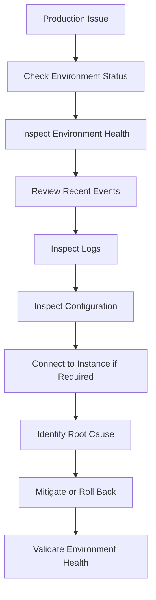

# 07- Production Operations Commands

## Overview

Amazon Elastic Beanstalk provides the Elastic Beanstalk Command Line Interface (EB CLI) for operating application environments from a terminal.

For production systems, the EB CLI is primarily useful for:

- Inspecting environment state
- Investigating incidents
- Reviewing deployments
- Retrieving logs
- Managing application versions
- Inspecting environment configuration
- Connecting to instances for diagnostics
- Monitoring environment health
- Performing controlled operational changes

The important distinction is between **deployment commands** and **production operations commands**.

Deployment commands change application state:

```text
eb deploy
```

Production operations commands primarily help engineers **observe, diagnose, and safely operate** an existing environment:

```text
eb status
eb health
eb events
eb logs
eb printenv
eb ssh
```

A typical production troubleshooting flow is:



The EB CLI should complement CloudWatch, Elastic Load Balancing, application logs, AWS Console, and infrastructure observability rather than replace them.

## Production Command Categories

| Category | Commands | Primary purpose |
|---|---|---|
| Environment state | `eb status` | Inspect environment metadata |
| Health | `eb health` | Investigate instance and environment health |
| Events | `eb events` | Investigate recent environment activity |
| Logs | `eb logs` | Retrieve application and platform logs |
| Configuration | `eb config` | Inspect environment configuration |
| Variables | `eb printenv` | Inspect environment variables |
| Instance access | `eb ssh` | Perform instance-level diagnostics |
| Application access | `eb open` | Open the deployed application |
| Deployment | `eb deploy` | Deploy an application version |
| Version management | `eb appversion` | Manage application versions |
| Environment management | `eb use` | Select the active environment |

## CLI Context

The EB CLI normally operates within a directory initialized for Elastic Beanstalk.

A typical project contains:

```text
orders-api/
├── .ebextensions/
├── .elasticbeanstalk/
│   └── config.yml
├── application/
├── requirements.txt
└── manage.py
```

The `.elasticbeanstalk/config.yml` file associates the local project with Elastic Beanstalk configuration.

Check the current environment:

```bash
eb status
```

If multiple environments exist, explicitly select one:

```bash
eb use orders-api-production
```

This is particularly important when working with:

```text
development
staging
production
```

Never assume the current EB CLI context points to production.

## `eb status`

### What It Does

`eb status` displays high-level information about the current environment.

```bash
eb status
```

Typical information includes:

- Application name
- Environment name
- Environment ID
- Region
- Platform
- Deployed version
- Environment health
- Environment URL

Example:

```text
Environment details for: orders-api-production
  Application name: orders-api
  Region: ap-south-1
  Deployed Version: orders-api-42
  Environment ID: e-xxxxxxxxxx
  Platform: Python
  Health: Green
```

### When to Use It

Use `eb status` as the first command when investigating an environment.

It quickly answers:

```text
Which environment am I operating?
What version is deployed?
Which AWS region is being used?
Is the environment healthy?
```

### Production Considerations

Always confirm the environment before executing commands that can modify infrastructure.

A safe operational sequence is:

```bash
eb status
eb use orders-api-production
eb status
```

The second status check confirms the intended environment is selected.

## `eb health`

### What It Does

`eb health` provides more detailed health information than `eb status`.

```bash
eb health
```

It is useful when the environment is:

```text
Yellow
```

or:

```text
Red
```

and you need instance-level information.

### Why It Matters

Environment-level health can hide which specific instance is failing.

Conceptually:

```text
Environment
├── Instance A → Green
├── Instance B → Green
├── Instance C → Red
└── Instance D → Green
```

The instance-level information helps determine whether the problem is:

- Isolated
- Widespread
- Related to a deployment
- Related to resource exhaustion
- Related to application startup

### Production Workflow

```bash
eb status
eb health
```

If health is degraded:

```bash
eb events
eb logs
```

## `eb events`

### What It Does

`eb events` displays Elastic Beanstalk environment events.

```bash
eb events
```

Events can reveal:

- Deployment activity
- Instance launches
- Instance termination
- Configuration changes
- Health changes
- Failed operations
- Scaling activity
- Platform-related events

### Incident Investigation

Suppose an API started returning errors at 15:20.

Run:

```bash
eb events
```

Look for events immediately before the incident.

A useful timeline might be:

```text
15:15  Configuration update
15:17  Environment update started
15:19  Instances replaced
15:20  HTTP 5xx increased
15:21  Environment health degraded
```

This correlation is often more useful than looking at application logs in isolation.

## `eb logs`

### What It Does

`eb logs` retrieves logs from the Elastic Beanstalk environment.

```bash
eb logs
```

Logs can help diagnose:

- Application exceptions
- Startup failures
- Deployment failures
- Nginx errors
- Application server failures
- Platform issues
- Request failures

### Production Investigation

A common diagnostic sequence is:

```bash
eb status
eb health
eb events
eb logs
```

Each command answers a different question:

| Command | Question |
|---|---|
| `eb status` | What environment and version am I running? |
| `eb health` | Is the environment or an instance unhealthy? |
| `eb events` | What changed recently? |
| `eb logs` | What is actually failing? |

### Log Volume

Do not treat logs as an unlimited diagnostic store.

High-volume logging can create:

- Increased storage costs
- Increased ingestion costs
- More difficult searches
- Sensitive-data exposure
- Operational noise

Production applications should use structured and appropriately leveled logging.

## `eb printenv`

### What It Does

`eb printenv` displays environment variables configured for the environment.

```bash
eb printenv
```

Typical variables may include:

```text
DJANGO_SETTINGS_MODULE
DATABASE_HOST
DATABASE_NAME
REDIS_HOST
LOG_LEVEL
```

### Production Use

This command is useful for diagnosing configuration differences.

For example:

```text
Staging
DATABASE_HOST=db-staging.internal

Production
DATABASE_HOST=db-production.internal
```

A configuration mismatch can explain an otherwise identical application behaving differently across environments.

### Security Warning

Environment variables can contain sensitive information.

Never casually paste the output of:

```bash
eb printenv
```

into:

- Public GitHub issues
- Slack channels
- Tickets
- Chat systems
- Documentation
- Terminal recordings

Sensitive variables may contain credentials, tokens, or connection strings.

For secrets, prefer a dedicated secrets-management strategy such as AWS Secrets Manager or Systems Manager Parameter Store rather than treating ordinary environment variables as a complete secret-management system.

## `eb config`

### What It Does

`eb config` is used to inspect and work with environment configuration.

```bash
eb config
```

Configuration is important because production behavior depends on more than application code.

Examples include:

- Instance type
- Auto Scaling settings
- Load balancer configuration
- Platform configuration
- Environment variables
- Networking
- Health settings
- Deployment settings

### Configuration Drift

A major production risk is configuration drift.

```text
Infrastructure as Code
        │
        ▼
Expected Configuration
        │
        X
        │
Manual Production Change
        │
        ▼
Actual Configuration
```

The environment can then behave differently from the configuration stored in source control.

Prefer reproducible configuration and treat manual changes as controlled exceptions.

## `eb use`

### What It Does

`eb use` selects the environment associated with subsequent EB CLI operations.

```bash
eb use orders-api-staging
```

Check the result:

```bash
eb status
```

### Production Safety

This command is especially important when the same repository is used for multiple environments.

For example:

```text
orders-api-staging
orders-api-production
```

A dangerous workflow is:

```bash
eb use orders-api-production
eb deploy
```

without verifying the environment.

A safer workflow is:

```bash
eb use orders-api-production
eb status
eb health
```

Then perform the intended operation.

## `eb open`

### What It Does

`eb open` opens the current Elastic Beanstalk environment in a browser.

```bash
eb open
```

This is useful for quick verification after:

- Deployment
- Configuration changes
- Incident mitigation
- Environment creation

For API services, browser validation is usually insufficient. Prefer explicit API checks as well.

Example:

```bash
curl -fsS https://api.example.com/healthz
```

A successful HTTP response should be combined with application-level checks where appropriate.

## `eb ssh`

### What It Does

`eb ssh` connects to an EC2 instance in the Elastic Beanstalk environment.

```bash
eb ssh
```

This is useful for deep diagnostics when normal environment-level information is insufficient.

Typical use cases include:

- Inspecting running processes
- Checking memory
- Checking disk usage
- Inspecting local logs
- Checking listening ports
- Investigating application startup
- Verifying local network connectivity

### Instance Diagnostics

After connecting:

```bash
ps aux
```

Check memory:

```bash
free -h
```

Check disk:

```bash
df -h
```

Check listening ports:

```bash
ss -lntp
```

Check system load:

```bash
uptime
```

### Important Limitation

An Elastic Beanstalk instance is replaceable infrastructure.

Do not use SSH to make permanent application changes such as:

```text
pip install ...
edit application files
modify system configuration manually
change application startup behavior
```

Those changes may disappear when the instance is replaced.

The correct production pattern is:

```text
Diagnosis through SSH
        ↓
Identify root cause
        ↓
Fix source configuration / deployment
        ↓
Redeploy
```

## `eb deploy`

Although deployment is covered separately, it is also an important production operations command.

```bash
eb deploy
```

Use it only after validating:

- Correct environment
- Correct application version
- Correct configuration
- Required tests
- Required migrations
- Deployment strategy
- Rollback plan

A production deployment should not be treated as a routine shell command without operational context.

## `eb appversion`

Elastic Beanstalk application versions allow deployable application artifacts to be identified and managed.

Inspect versions:

```bash
eb appversion
```

Application versions are useful when investigating:

```text
Which artifact was deployed?
Which version introduced the issue?
Which version should be restored?
```

A production deployment process should make application versions traceable to:

- Git commit
- CI/CD build
- Release
- Deployment timestamp

For example:

```text
Git commit
    ↓
CI build
    ↓
Application version
    ↓
Elastic Beanstalk environment
```

This creates deployment traceability.

## Production Command Reference

| Command | Typical production use |
|---|---|
| `eb status` | Confirm environment and deployed version |
| `eb health` | Investigate environment health |
| `eb events` | Review recent infrastructure/application events |
| `eb logs` | Retrieve logs |
| `eb printenv` | Inspect runtime configuration |
| `eb config` | Inspect environment configuration |
| `eb use` | Select target environment |
| `eb open` | Quickly access application |
| `eb ssh` | Perform instance-level diagnostics |
| `eb appversion` | Inspect application versions |
| `eb deploy` | Deploy application changes |

## Production Incident Workflow

A disciplined workflow reduces the risk of making the incident worse.

### Confirm the Target

```bash
eb status
```

If necessary:

```bash
eb use orders-api-production
eb status
```

### Check Health

```bash
eb health
```

Determine whether the problem affects:

- One instance
- Multiple instances
- The complete environment

### Review Events

```bash
eb events
```

Look for:

- Recent deployment
- Configuration update
- Scaling activity
- Instance replacement
- Health transition

### Retrieve Logs

```bash
eb logs
```

Search for errors around the incident timeframe.

### Check Runtime Configuration

```bash
eb printenv
```

Do not expose secrets while collecting evidence.

### Check Instance State

If environment-level diagnostics are insufficient:

```bash
eb ssh
```

Then inspect:

```bash
ps aux
free -h
df -h
ss -lntp
uptime
```

### Mitigate

Depending on the root cause:

```text
Configuration issue
        ↓
Correct configuration

Bad deployment
        ↓
Restore known-good version

Capacity issue
        ↓
Scale appropriately

Application failure
        ↓
Fix and redeploy

Instance-specific issue
        ↓
Investigate / replace instance
```

### Validate

After mitigation:

```bash
eb status
eb health
```

Then validate the application:

```bash
curl -fsS https://api.example.com/healthz
```

Finally check:

- Error rate
- Latency
- Logs
- Application behavior
- Dependency health

## Safe Production Command Sequence

A conservative operational sequence is:

```bash
eb status
eb health
eb events
eb logs
```

Only after understanding the situation should you execute a state-changing command.

For example:

```bash
eb deploy
```

should not be the first response to an unexplained production failure.

## Read-Only vs State-Changing Commands

It is useful to classify commands operationally.

| Command | Operational risk | Typical purpose |
|---|---:|---|
| `eb status` | Low | Inspect state |
| `eb health` | Low | Inspect health |
| `eb events` | Low | Inspect events |
| `eb logs` | Low | Inspect logs |
| `eb printenv` | Low | Inspect configuration; may expose secrets |
| `eb config` | Low/Medium | Inspect or modify configuration |
| `eb appversion` | Low/Medium | Inspect/manage versions |
| `eb use` | Low | Change CLI target context |
| `eb open` | Low | Access application |
| `eb ssh` | Medium | Instance-level access |
| `eb deploy` | High | Change application state |

The exact operational impact depends on the command options and environment configuration.

## Production Safety Rules

### Verify the Environment

Always establish:

```text
Application
Environment
Region
Version
```

before modifying anything.

### Prefer Read-Only Diagnostics First

Start with:

```bash
eb status
eb health
eb events
eb logs
```

before performing changes.

### Avoid Manual Production Changes

If the root cause is configuration drift, fix the source configuration rather than repeatedly changing instances.

### Keep Rollback Available

Before a production deployment, know:

```text
Current version
Previous known-good version
Deployment mechanism
Rollback procedure
```

### Protect Runtime Configuration

Treat the output of:

```bash
eb printenv
```

as potentially sensitive.

### Use Least Privilege

The IAM identity used for EB CLI operations should have only the permissions required for the engineer's responsibilities.

Avoid giving every developer unrestricted production administration access.

## CI/CD and EB CLI

In mature environments, engineers should not normally perform every production deployment manually from laptops.

A stronger workflow is:


The EB CLI remains useful for:

- Emergency diagnostics
- Controlled operational tasks
- Environment inspection
- Local development
- Incident response

CI/CD should provide repeatability and auditability for normal production deployments.

## Observability During Operations

EB CLI commands provide operational context, but they should be correlated with CloudWatch and application telemetry.

For example:

```text
eb health
     │
     ├── Environment health
     │
     ▼
CloudWatch
     │
     ├── CPU
     ├── Request count
     ├── 4xx
     ├── 5xx
     └── Latency
     │
     ▼
Application Logs
     │
     └── Root cause
```

A command such as:

```bash
eb health
```

may tell you **that** an environment is unhealthy.

Logs and metrics help determine **why**.

## Common Production Mistakes

### Running Commands Against the Wrong Environment

Multiple environments make context errors easy.

Always verify:

```bash
eb status
```

before operating.

### Using `eb deploy` as a Troubleshooting Tool

A deployment is a state-changing operation.

Do not redeploy blindly when the cause of an incident is unknown.

### Using SSH as Permanent Configuration Management

Manual instance changes disappear when instances are replaced.

Use source-controlled configuration and repeatable deployments.

### Sharing `eb printenv` Output

Environment variables may contain credentials or secrets.

Never share raw production configuration casually.

### Ignoring Recent Events

A production failure immediately following a deployment or configuration update is a strong signal.

Check:

```bash
eb events
```

### Looking Only at Environment Health

A green environment can still have:

- Slow APIs
- Business logic failures
- Database problems
- Background worker failures
- External dependency failures

Correlate EB health with application metrics and logs.

### Making Changes Before Collecting Evidence

Changing several things during an incident makes root-cause analysis harder.

First establish:

```text
What changed?
What failed?
When did it fail?
Who is affected?
```

Then mitigate.

## Production Command Playbook

### Environment Inspection

```bash
eb status
eb health
```

### Recent Activity

```bash
eb events
```

### Application Diagnostics

```bash
eb logs
```

### Runtime Configuration

```bash
eb printenv
```

### Configuration Inspection

```bash
eb config
```

### Instance Diagnostics

```bash
eb ssh
```

### Application Verification

```bash
eb open
```

or:

```bash
curl -fsS https://api.example.com/healthz
```

### Environment Selection

```bash
eb use orders-api-production
eb status
```

### Version Inspection

```bash
eb appversion
```

## Incident Response Example

Assume a Django API suddenly begins returning HTTP 500 responses.

Start with:

```bash
eb status
```

Suppose the result indicates degraded health.

Next:

```bash
eb health
```

Determine whether the failure affects all instances.

Then:

```bash
eb events
```

Suppose a configuration update occurred five minutes before the incident.

Inspect runtime configuration:

```bash
eb printenv
```

Then retrieve logs:

```bash
eb logs
```

Suppose the logs show:

```text
Database connection failed
```

The investigation then moves from Elastic Beanstalk to the database and network layer.

The important point is that the EB CLI provides the **operational path to the evidence**. It does not automatically identify every root cause.

## Operational Checklist

```text
[ ] Confirm AWS region
[ ] Confirm application name
[ ] Confirm environment name
[ ] Confirm deployed version
[ ] Check environment health
[ ] Check instance health
[ ] Review recent environment events
[ ] Review application logs
[ ] Check runtime configuration
[ ] Check recent deployments
[ ] Check database health
[ ] Check Redis health if applicable
[ ] Check Celery queues if applicable
[ ] Check Kafka consumer lag if applicable
[ ] Check CloudWatch metrics
[ ] Avoid unnecessary production changes
[ ] Preserve a known-good rollback path
[ ] Validate service after mitigation
[ ] Record the root cause and corrective action
```

## Interview Traps

### What is the first EB CLI command you would run during a production incident?

Usually:

```bash
eb status
```

It establishes the environment, region, deployed version, and high-level health state before deeper investigation.

### What would you use to investigate degraded environment health?

Start with:

```bash
eb health
eb events
eb logs
```

These provide progressively deeper information about instance health, recent changes, and runtime failures.

### Why is `eb ssh` not a permanent fix mechanism?

Elastic Beanstalk instances are replaceable. Manual changes made directly to an instance can disappear when that instance is terminated or replaced.

### Why should `eb printenv` be handled carefully?

Environment variables can contain sensitive credentials or secrets. Diagnostic output should therefore be treated as potentially sensitive.

### Should `eb deploy` be used to fix every production problem?

No. A deployment is a state-changing operation. During an incident, first establish the root cause and determine whether deployment, rollback, configuration correction, scaling, or another mitigation is appropriate.

### How do you make EB CLI operations safer in a multi-environment setup?

Explicitly select the environment and verify it:

```bash
eb use orders-api-production
eb status
```

### Is Elastic Beanstalk CLI sufficient for production observability?

No. It should be combined with CloudWatch metrics and alarms, application logs, load balancer metrics, dependency monitoring, and appropriate application-level observability.

## Key Takeaways

- Use `eb status` to establish environment context before taking action.
- Use `eb health` for deeper environment and instance health information.
- Use `eb events` to correlate incidents with deployments, configuration changes, scaling, and instance activity.
- Use `eb logs` to retrieve application and platform diagnostic information.
- Use `eb printenv` to investigate runtime configuration, but treat its output as potentially sensitive.
- Use `eb config` to inspect environment configuration and detect configuration problems.
- Use `eb use` carefully when working with multiple environments.
- Use `eb ssh` for temporary instance-level diagnosis, not permanent configuration management.
- Use `eb appversion` to understand and manage deployable application versions.
- Treat `eb deploy` as a state-changing production operation rather than a generic troubleshooting command.
- Prefer read-only investigation before modifying production state.
- Always verify the target environment before executing operational commands.
- Correlate EB CLI output with CloudWatch metrics, application logs, deployment history, and dependency health.
- Keep a known-good application version and documented rollback path available.
- Use CI/CD for repeatable production deployments and retain the EB CLI for operational diagnostics and controlled administration.
- Production operations should prioritize evidence collection, minimal changes, traceability, and safe recovery.