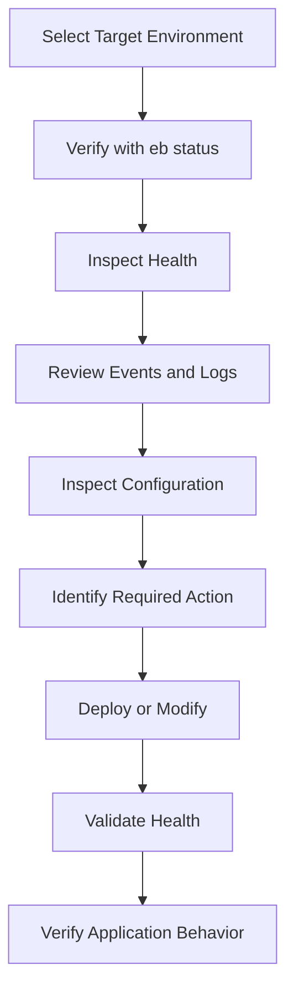

# README

## Overview

This folder contains production-oriented documentation for the **Amazon Elastic Beanstalk Command Line Interface (EB CLI)**.

The material focuses on using the EB CLI to manage environments, application versions, deployments, configuration, monitoring, diagnostics, and day-to-day production operations.

The recommended progression is:

```text
CLI Fundamentals
      ↓
Environment Management
      ↓
Application & Version Management
      ↓
Deployment Commands
      ↓
Configuration & Environment Variables
      ↓
Monitoring & Diagnostics
      ↓
Production Operations
```

## Documentation

| File | Description |
|---|---|
| [01- Elastic Beanstalk CLI Fundamentals](./01-%20Elastic%20Beanstalk%20CLI%20Fundamentals.md) | EB CLI installation, initialization, configuration, command structure, profiles, regions, and core workflow |
| [02- Environment Management](./02-%20Environment%20Management.md) | Creating, selecting, inspecting, updating, cloning, terminating, and managing Elastic Beanstalk environments |
| [03- Application and Version Management](./03-%20Application%20and%20Version%20Management.md) | Managing applications, application versions, version labels, deployment artifacts, and version lifecycle |
| [04- Deployment Commands](./04-%20Deployment%20Commands.md) | Deploying applications, deployment options, deployment strategies, rollback considerations, and deployment verification |
| [05- Configuration and Environment Variables](./05-%20Configuration%20and%20Environment%20Variables.md) | Managing environment configuration, runtime settings, environment variables, configuration files, and configuration drift |
| [06- Monitoring and Diagnostics](./06-%20Monitoring%20and%20Diagnostics.md) | Environment health, events, logs, diagnostics, instance investigation, and operational troubleshooting |
| [07- Production Operations Commands](./07-%20Production%20Operations%20Commands.md) | Production inspection, incident response, operational commands, safe troubleshooting, and production command workflows |

## Quick Navigation

### Foundations

- [Elastic Beanstalk CLI Fundamentals](./01-%20Elastic%20Beanstalk%20CLI%20Fundamentals.md)
- [Environment Management](./02-%20Environment%20Management.md)

### Application and Deployment

- [Application and Version Management](./03-%20Application%20and%20Version%20Management.md)
- [Deployment Commands](./04-%20Deployment%20Commands.md)

### Configuration

- [Configuration and Environment Variables](./05-%20Configuration%20and%20Environment%20Variables.md)

### Operations

- [Monitoring and Diagnostics](./06-%20Monitoring%20and%20Diagnostics.md)
- [Production Operations Commands](./07-%20Production%20Operations%20Commands.md)

## Command Areas

| Area | Primary EB CLI Commands |
|---|---|
| Environment inspection | `eb status`, `eb health` |
| Environment selection | `eb use` |
| Environment management | `eb create`, `eb clone`, `eb terminate` |
| Application versions | `eb appversion` |
| Deployment | `eb deploy` |
| Configuration | `eb config`, `eb printenv` |
| Diagnostics | `eb events`, `eb logs`, `eb ssh` |
| Application access | `eb open` |

## Production Workflow

A typical production workflow should move from observation to controlled action:



For incident response, prefer read-only inspection before state-changing operations:

```bash
eb status
eb health
eb events
eb logs
eb printenv
```

Only after establishing the cause and target environment should commands that modify production state be considered.

## Engineering Focus

The documentation emphasizes:

- Environment-aware CLI usage
- Repeatable deployments
- Application version traceability
- Configuration management
- Production diagnostics
- Environment and instance health
- Log-driven troubleshooting
- Safe operational practices
- CI/CD integration
- Least-privilege access
- Configuration drift prevention
- Rollback and recovery
- Correlation with CloudWatch and application observability

## Recommended Usage

Use the documents as a reference rather than memorizing every command.

For normal development:

```text
CLI Fundamentals
→ Environment Management
→ Application & Version Management
→ Deployment Commands
```

For production operations:

```text
Environment Management
→ Configuration
→ Monitoring & Diagnostics
→ Production Operations
```

For incident response:

```text
eb status
    ↓
eb health
    ↓
eb events
    ↓
eb logs
    ↓
eb printenv
    ↓
eb ssh (if required)
    ↓
Mitigate / Roll Back
    ↓
Validate
```

## Key Takeaways

- Start with the CLI fundamentals before using environment or deployment commands.
- Always verify the target environment before performing production operations.
- Treat application versions as deployment artifacts that should be traceable to source control and CI/CD.
- Keep configuration reproducible and avoid unmanaged production drift.
- Use health, events, logs, and runtime configuration together when troubleshooting.
- Use `eb ssh` for diagnosis, not as a permanent configuration mechanism.
- Prefer CI/CD for repeatable production deployments.
- Treat state-changing EB CLI commands as controlled production operations.
- Correlate EB CLI information with CloudWatch metrics, application logs, load balancer telemetry, and dependency health.