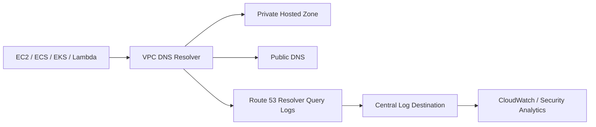
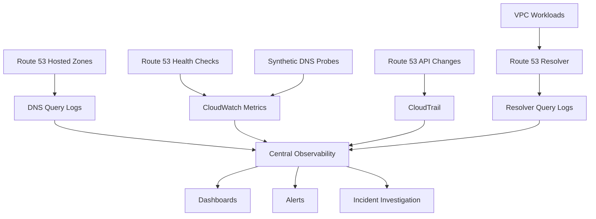

# 01- Monitoring and Observability

## Overview

Monitoring Amazon Route 53 is primarily about determining whether DNS resolution is **available, correct, and behaving as designed**.

For production backend systems, DNS observability should answer questions such as:

- Are Route 53 health checks healthy?
- Are DNS queries reaching the expected resolver or authoritative path?
- Are records returning the expected answers?
- Are private hosted zones resolving correctly from production VPCs?
- Are failover and weighted routing policies behaving as expected?
- Did a DNS change alter the observed resolution behavior?
- Are clients receiving `NXDOMAIN`, `SERVFAIL`, stale records, or unexpected targets?
- Which DNS layer is responsible for the failure?

Route 53 itself is highly distributed, so monitoring should not depend on a single control-plane signal. A healthy Route 53 configuration does not necessarily mean that an application can resolve or reach its backend.

A useful production model is:

```text
                  ┌─────────────────────┐
                  │ Route 53 Control    │
                  │ Plane Configuration  │
                  └──────────┬──────────┘
                             │
                             ▼
                  ┌─────────────────────┐
                  │ Authoritative DNS   │
                  │ Hosted Zone         │
                  └──────────┬──────────┘
                             │
                             ▼
                  ┌─────────────────────┐
                  │ Recursive Resolver  │
                  │ / VPC Resolver     │
                  └──────────┬──────────┘
                             │
                             ▼
                  ┌─────────────────────┐
                  │ Application         │
                  │ EC2/ECS/EKS/Lambda │
                  └──────────┬──────────┘
                             │
                             ▼
                  ┌─────────────────────┐
                  │ Backend Target      │
                  │ ALB/API/Service    │
                  └─────────────────────┘
```

Observability should cover these layers independently.

---

## What Route 53 Monitoring Actually Measures

Route 53 exposes several different observability mechanisms. They answer different questions and should not be treated as interchangeable.

| Mechanism | Primary Purpose | Typical Question |
|---|---|---|
| Route 53 health checks | Determine endpoint health | "Is this endpoint responding?" |
| CloudWatch metrics | Monitor health-check state and related telemetry | "Is health changing?" |
| DNS query logging | Inspect DNS queries and responses | "What DNS queries are being received?" |
| Route 53 Resolver query logging | Observe DNS queries from VPC environments | "What are workloads querying?" |
| CloudTrail | Audit Route 53 API/control-plane actions | "Who changed DNS configuration?" |
| Synthetic DNS checks | Validate real resolution behavior | "Can clients actually resolve this name?" |
| Application metrics | Validate downstream availability | "Does the resolved endpoint actually work?" |

A senior engineer should always distinguish **configuration monitoring**, **DNS resolution monitoring**, and **application availability monitoring**.

---

## Monitoring Layers

A production Route 53 observability strategy should cover multiple layers.

### Control Plane

Monitor configuration changes and administrative activity.

Examples:

- Hosted-zone changes.
- Record changes.
- Health-check configuration changes.
- DNSSEC configuration changes.
- IAM activity.
- Infrastructure-as-Code deployments.

Useful telemetry:

- AWS CloudTrail.
- CI/CD logs.
- Terraform or CloudFormation state.
- AWS Config where applicable.

### DNS Resolution Plane

Monitor whether DNS clients receive expected responses.

Examples:

- `A` records.
- `AAAA` records.
- `CNAME` chains.
- `NS` delegation.
- `NXDOMAIN`.
- `SERVFAIL`.
- Unexpected targets.
- Unexpected TTLs.

Useful telemetry:

- DNS query logs.
- Route 53 Resolver query logs.
- Synthetic DNS probes.
- `dig`.
- Application resolver metrics.

### Endpoint Health Plane

Monitor whether the destinations selected by Route 53 are healthy.

Examples:

- ALB target health.
- Application health endpoint.
- EC2 service availability.
- API Gateway availability.
- Service response latency.

Useful telemetry:

- Route 53 health checks.
- CloudWatch.
- ALB metrics.
- Application metrics.

### Application Plane

DNS may be healthy while the application is not.

Monitor:

- HTTP success rate.
- HTTP latency.
- Error rate.
- Connection failures.
- TLS failures.
- Application exceptions.
- Dependency failures.

---

## Route 53 Health Checks

Route 53 health checks allow Route 53 to determine whether an endpoint is considered healthy.

They can be used with routing policies such as failover, weighted, latency-based, and other supported routing configurations where health evaluation is relevant.

A health check may evaluate an endpoint using protocols such as:

- HTTP
- HTTPS
- TCP

The health check can validate more than simple network reachability, depending on its configuration.

For example:

```text
Route 53 Health Check
        │
        ▼
https://api.example.com/health
        │
        ▼
Application
        │
        ├── HTTP 200 → Healthy
        │
        └── Failure → Unhealthy
```

The important distinction is that **endpoint health and DNS availability are different signals**.

A healthy Route 53 health check does not guarantee:

- DNS clients can resolve the hostname.
- The application is healthy for every user.
- The backend database is healthy.
- The endpoint is reachable from every network.
- A private VPC workload can resolve the same hostname.
- A downstream dependency is working.

---

## Health Check Monitoring

Health checks should be monitored as state transitions rather than viewed only as static configuration.

A useful model is:

```text
Healthy
   │
   │ consecutive failures
   ▼
Unhealthy
   │
   │ consecutive successes
   ▼
Healthy
```

Monitor for:

- Unexpected unhealthy transitions.
- Frequent healthy/unhealthy flapping.
- Long periods of unhealthy state.
- Health checks failing while the application reports healthy.
- Health checks succeeding while users report failures.

### Why flapping matters

Consider an endpoint that alternates between healthy and unhealthy:

```text
10:00  Healthy
10:01  Healthy
10:02  Unhealthy
10:03  Healthy
10:04  Unhealthy
10:05  Healthy
```

This can cause unstable routing behavior and make incidents difficult to diagnose.

Common causes include:

- Application saturation.
- Intermittent network failures.
- Aggressive health-check thresholds.
- Slow dependencies.
- Resource exhaustion.
- Incorrect health-check endpoint design.

---

## Health Check Endpoint Design

For backend applications such as Django or FastAPI, avoid using an unnecessarily expensive endpoint as the Route 53 health-check target.

A production endpoint should generally be:

```text
GET /health
```

or:

```text
GET /healthz
```

The endpoint should execute quickly and deterministically.

For example:

```python
from fastapi import FastAPI
from fastapi.responses import JSONResponse

app = FastAPI()


@app.get("/health")
async def health() -> JSONResponse:
    return JSONResponse({"status": "ok"})
```

Do not automatically make the health endpoint perform every possible dependency check.

A database-heavy health endpoint can create a feedback loop:

```text
Database becomes slow
        │
        ▼
Health check becomes slow
        │
        ▼
Route 53 marks endpoint unhealthy
        │
        ▼
Traffic changes
        │
        ▼
Remaining infrastructure receives more traffic
        │
        ▼
System becomes further overloaded
```

The correct health-check depth depends on the failure mode the routing layer is intended to detect.

---

## DNS Query Logging

DNS query logging provides visibility into DNS queries.

This is useful when diagnosing:

- Unexpected DNS queries.
- Missing records.
- `NXDOMAIN`.
- Internal service discovery issues.
- Application behavior.
- Suspicious DNS activity.
- Resolver problems.
- Unexpected domain usage.

A simplified flow is:

```text
Application
    │
    ▼
DNS Resolver
    │
    ▼
DNS Query Logging
    │
    ▼
Log Destination
    │
    ▼
CloudWatch / Analysis Pipeline
```

Query logs are primarily an **observability and investigation mechanism**. They should not be treated as a replacement for synthetic DNS monitoring.

---

## Route 53 Resolver Query Logging

Private AWS environments introduce another important observability layer.

Applications running in:

- EC2
- ECS
- EKS
- Lambda
- VPC-based services

may rely on the VPC DNS resolver.

Resolver query logging can provide visibility into DNS queries originating from VPC environments.

This is particularly useful for:

- Private hosted zones.
- Service discovery.
- Internal domains.
- Split-horizon DNS.
- DNS failures inside VPCs.
- Unexpected external DNS queries.

A useful architecture is:



This provides visibility into what workloads are asking the DNS infrastructure to resolve.

---

## Authoritative DNS vs Resolver Observability

One of the most important distinctions in Route 53 monitoring is between **authoritative DNS** and **recursive resolution**.

### Authoritative DNS

Answers questions based on the hosted zone configuration.

Example:

```text
api.example.com
        │
        ▼
Route 53 authoritative nameserver
        │
        ▼
203.0.113.20
```

### Recursive Resolution

A recursive resolver may return a cached answer without querying the authoritative nameserver.

```text
Application
    │
    ▼
Recursive Resolver
    │
    ├── Cache hit → return cached answer
    │
    └── Cache miss → query authoritative DNS
```

Therefore:

> A correct Route 53 record does not guarantee that every client immediately observes that value.

This is especially important during DNS migrations and incident response.

---

## Synthetic DNS Monitoring

Synthetic monitoring is one of the most valuable additions to Route 53 observability.

Instead of asking:

> "Is the Route 53 record configured correctly?"

ask:

> "Can a client resolve the production hostname and receive the expected answer?"

A synthetic check can periodically perform:

```text
DNS lookup
    │
    ▼
Validate response code
    │
    ▼
Validate record type
    │
    ▼
Validate expected target
    │
    ▼
Measure resolution latency
    │
    ▼
Publish metric
```

For a production API:

```text
api.example.com
       │
       ▼
Expected:
A → expected ALB / endpoint
       │
       ▼
Unexpected:
NXDOMAIN
SERVFAIL
wrong target
expired record
```

Synthetic DNS checks are particularly valuable because they observe behavior from the perspective of an actual DNS client.

---

## DNS Resolution Metrics

Useful metrics include:

| Metric | What It Indicates |
|---|---|
| Resolution success rate | Percentage of successful DNS lookups |
| Resolution latency | Time required to obtain an answer |
| `NXDOMAIN` rate | Names that do not exist |
| `SERVFAIL` rate | Resolver/server-side DNS failures |
| Unexpected answer rate | DNS returned a value different from expected |
| Health-check status | Endpoint health from Route 53's perspective |
| Health-check latency | Endpoint response performance |
| Health-check failure rate | Endpoint availability problems |
| Query volume | DNS request activity |
| Query error volume | DNS resolution problems |

For synthetic monitoring, publish application-specific metrics rather than relying solely on generic AWS service metrics.

---

## DNS Error Monitoring

DNS response codes should be monitored separately because they indicate different classes of failure.

| Response | Meaning | Typical Investigation |
|---|---|---|
| `NOERROR` | Successful DNS response | Validate returned records |
| `NXDOMAIN` | Name does not exist | Delegation, record, negative cache |
| `SERVFAIL` | Resolver could not produce a valid response | DNSSEC, delegation, upstream failure |
| `REFUSED` | Server refused the query | Resolver policy/access configuration |
| `NODATA` | Name exists but requested record type has no answer | Record type/configuration |

Do not create a single generic `dns_error` metric if operationally different failure modes need different remediation.

---

## Monitoring DNS Changes

DNS changes should be observable through the entire deployment pipeline.

A production change flow should look like:

```text
Developer
    │
    ▼
Git commit
    │
    ▼
CI validation
    │
    ▼
Terraform / CloudFormation
    │
    ▼
Route 53 Change
    │
    ▼
CloudTrail
    │
    ▼
Synthetic DNS Validation
    │
    ▼
Application Validation
```

Useful deployment metadata includes:

- Change timestamp.
- Environment.
- Hosted zone.
- Record name.
- Previous value.
- New value.
- TTL.
- Routing policy.
- Deployment identifier.
- Git commit SHA.
- Operator or CI identity.

This makes DNS incidents significantly easier to correlate with deployments.

---

## CloudTrail and DNS Auditing

CloudTrail should be used for control-plane auditing.

It can answer questions such as:

- Who changed the hosted zone?
- Which IAM principal performed the operation?
- When was a record changed?
- Which API operation was executed?
- Was the change made manually or by automation?

This is different from DNS query logging.

| Signal | Answers |
|---|---|
| CloudTrail | "Who changed Route 53 configuration?" |
| DNS query logs | "What DNS queries occurred?" |
| Health-check metrics | "What endpoint health did Route 53 observe?" |
| Synthetic checks | "Can a client resolve the expected DNS answer?" |

These signals complement each other.

---

## Observability Architecture

A production architecture can centralize Route 53-related telemetry:



The objective is not to collect every possible DNS signal. The objective is to create enough correlated evidence to answer:

```text
What changed?
      │
      ▼
What DNS answer is authoritative?
      │
      ▼
What answer are clients receiving?
      │
      ▼
Which environment is affected?
      │
      ▼
Is the selected backend healthy?
```

---

## Alerting Strategy

Avoid alerting on every DNS event.

DNS monitoring should focus on conditions that require engineering action.

### High-priority alerts

Examples:

- Production DNS synthetic checks failing.
- Critical hostname returning `NXDOMAIN`.
- Critical hostname returning `SERVFAIL`.
- Unexpected DNS target detected.
- Primary and secondary endpoints both unhealthy.
- Private DNS resolution failing across multiple production workloads.
- DNSSEC validation failures for protected domains.
- Unexpected production DNS configuration changes.

### Lower-priority signals

Examples:

- Individual transient resolver failures.
- Small changes in DNS query volume.
- Single health-check failures that recover immediately.
- Expected deployment-related DNS changes.

---

## Alert Design

A good DNS alert should provide context.

Poor:

```text
DNS FAILED
```

Better:

```text
Production DNS resolution failure

Hostname: api.example.com
Environment: production
Resolver: synthetic-us-east-1
Response: SERVFAIL
Expected: NOERROR
First observed: 14:32 UTC
Duration: 4 minutes
Recent DNS deployment: yes
```

The alert should allow an engineer to start investigation without first searching multiple unrelated dashboards.

---

## Alert Thresholds

Avoid overly aggressive thresholds.

For example:

```text
1 failed DNS query
```

is usually insufficient to declare an outage.

A better strategy can combine:

```text
failure rate
+
duration
+
multiple observation points
```

For example:

```text
DNS resolution failure rate > 5%
for 5 consecutive minutes
from 3 independent probes
```

The exact threshold should be based on application criticality and normal DNS behavior.

---

## Multi-Region Synthetic Monitoring

DNS is globally distributed, so monitoring from a single location can hide regional problems.

For critical production domains, consider synthetic probes from multiple independent locations.

```text
                 api.example.com
                       │
        ┌──────────────┼──────────────┐
        │              │              │
        ▼              ▼              ▼
      Region A       Region B       Region C
        │              │              │
        ▼              ▼              ▼
      DNS Probe      DNS Probe      DNS Probe
```

This helps distinguish:

- Global DNS failures.
- Regional resolver problems.
- Network-specific issues.
- Routing-policy behavior.
- Localized DNS failures.

---

## Monitoring Private DNS

Private hosted zones require environment-aware monitoring.

A public synthetic check may successfully resolve:

```text
api.example.com
```

while an EKS pod fails to resolve:

```text
internal.api.example.com
```

Therefore, private DNS monitoring should run **inside the relevant VPC/network boundary**.

Useful test environments include:

- EC2.
- ECS.
- EKS.
- Lambda.
- Dedicated monitoring instances.
- Hybrid network environments.

A useful validation sequence is:

```bash
cat /etc/resolv.conf

dig internal.api.example.com

dig +short internal.api.example.com
```

For Kubernetes:

```bash
kubectl exec -it <pod> -- cat /etc/resolv.conf
```

Then:

```bash
kubectl exec -it <pod> -- nslookup internal.api.example.com
```

The goal is to verify the actual resolver path used by the workload.

---

## Monitoring Failover

DNS failover monitoring should validate both sides of the failover.

Do not monitor only:

```text
Primary healthy
```

Also verify:

```text
Primary failure
      │
      ▼
Route 53 detects unhealthy state
      │
      ▼
DNS routing changes
      │
      ▼
Secondary becomes observable
      │
      ▼
Clients resolve secondary
      │
      ▼
Secondary application works
```

A useful disaster-recovery test periodically validates the complete chain rather than merely checking that a Route 53 health check exists.

---

## Monitoring TTL Behavior

TTL is operationally important because it affects how quickly clients observe DNS changes.

Monitor expected TTL values for critical records.

For example:

```bash
dig api.example.com
```

The answer may contain:

```text
api.example.com. 60 IN A 203.0.113.10
```

The `60` represents the remaining TTL returned by the queried resolver.

Be careful when interpreting this value:

- It may already be partially consumed.
- It reflects resolver cache state.
- It does not necessarily represent the authoritative record's configured TTL at that exact moment.

For incident investigation, query the authoritative nameserver separately.

---

## Detecting Unexpected DNS Configuration

Configuration drift can create subtle production failures.

For critical records, define expected state such as:

```text
Record: api.example.com
Type: A / Alias
Expected target: production ALB
Routing policy: failover
Health check: enabled
```

Then periodically compare observed configuration against the expected infrastructure state.

Potential sources include:

- Terraform state.
- CloudFormation.
- AWS CLI.
- Route 53 APIs.
- Git-managed configuration.

This is particularly valuable for detecting accidental manual changes.

---

## Security Monitoring

DNS is part of the production security boundary.

Monitor for:

- Unexpected record modifications.
- Unexpected hosted-zone changes.
- Unauthorized IAM activity.
- Suspicious DNS query patterns.
- Unexpected external domains queried by workloads.
- DNS tunneling indicators where relevant.
- DNSSEC configuration changes.
- Unauthorized changes to delegation.
- Unexpected resolver configuration.

For example:

```text
Unexpected Route 53 record change
        │
        ▼
CloudTrail event
        │
        ▼
Identify IAM principal
        │
        ▼
Compare against CI/CD deployment
        │
        ├── Expected → close/record
        │
        └── Unexpected → investigate
```

Monitoring should therefore combine DNS telemetry with AWS identity and audit telemetry.

---

## Cost Considerations

DNS observability introduces additional costs through mechanisms such as:

- Query logging.
- Log storage.
- Log ingestion.
- CloudWatch metrics.
- Synthetic monitoring.
- Cross-region observability.
- Long-term audit retention.

Do not enable verbose logging indefinitely without a retention strategy.

A production logging strategy should define:

| Data | Retention Strategy |
|---|---|
| Health metrics | Long enough for trend analysis |
| DNS query logs | Based on security and operational requirements |
| CloudTrail | Organization/security retention policy |
| Synthetic results | Enough for SLA/SLO analysis |
| Debug-level logs | Shorter retention |

For high-volume environments, centralize and filter logs rather than retaining every event indefinitely.

---

## Dashboard Design

A Route 53 dashboard should expose the signals required to answer operational questions quickly.

### DNS Availability

Display:

- DNS success rate.
- `NXDOMAIN` rate.
- `SERVFAIL` rate.
- Resolution latency.
- Synthetic probe status.

### Health

Display:

- Health-check status.
- Endpoint response time.
- Health-check failures.
- Failover state.

### Configuration

Display:

- Recent Route 53 changes.
- Hosted-zone changes.
- DNS deployment status.
- Recent IaC deployments.

### Private DNS

Display:

- Resolver query volume.
- Resolution failures.
- Important internal hostname availability.
- EKS/ECS/EC2 synthetic results.

---

## Example Dashboard

```text
┌──────────────────────────────────────────────────────────┐
│ Route 53 Production                                      │
├──────────────────────────────────────────────────────────┤
│ DNS Availability       99.999%                            │
│ DNS Resolution P95     18 ms                              │
│ NXDOMAIN Rate          0.01%                              │
│ SERVFAIL Rate          0.00%                              │
├──────────────────────────────────────────────────────────┤
│ Health Checks                                             │
│ Primary API            HEALTHY                            │
│ Secondary API          HEALTHY                            │
├──────────────────────────────────────────────────────────┤
│ Synthetic DNS                                             │
│ Region A               PASS                               │
│ Region B               PASS                               │
│ Region C               PASS                               │
├──────────────────────────────────────────────────────────┤
│ Recent Changes                                            │
│ api.example.com        Updated 12 min ago                │
│ internal.example.com   No changes                         │
└──────────────────────────────────────────────────────────┘
```

The dashboard should prioritize actionable signals rather than raw DNS event volume.

---

## Application-Level DNS Observability

Backend services should expose DNS failures distinctly from connection failures.

For example, an application may experience:

```text
DNS resolution
      │
      ├── Failure → DNS error
      │
      ▼
TCP connection
      │
      ├── Failure → Network/connection error
      │
      ▼
TLS handshake
      │
      ├── Failure → TLS error
      │
      ▼
HTTP request
      │
      ├── 5xx → Application/backend error
      │
      ▼
Success
```

These failures should not be collapsed into a generic:

```text
request_failed
```

Instead, observability should preserve the failure layer.

For Python applications, useful attributes include:

```text
dns.hostname
dns.error
dns.record_type
network.error
tls.error
http.status_code
service.name
deployment.version
```

This allows engineers to determine whether an API failure originated in DNS or downstream networking.

---

## Kubernetes Considerations

Kubernetes introduces another DNS layer.

A typical request may flow through:

```text
Pod
 │
 ▼
/etc/resolv.conf
 │
 ▼
CoreDNS
 │
 ├── Kubernetes service DNS
 │
 └── External DNS resolution
        │
        ▼
     VPC Resolver
        │
        ▼
     Route 53
```

Monitoring should therefore distinguish:

- CoreDNS failures.
- Kubernetes service discovery failures.
- VPC Resolver failures.
- Route 53 public DNS failures.
- Private hosted-zone failures.

A Route 53 synthetic check can be healthy while CoreDNS is unavailable inside an EKS cluster.

This is why infrastructure-level monitoring and workload-level monitoring must coexist.

---

## Incident Correlation

DNS incidents should be correlated with other infrastructure events.

For example:

```text
14:20  Terraform deployment
14:21  Route 53 record changed
14:22  Synthetic DNS failures begin
14:23  Application 5xx increases
14:24  CloudTrail records DNS change
```

This correlation is much stronger evidence than simply observing:

```text
Application errors increased.
```

Useful correlation sources include:

- CloudTrail.
- CI/CD deployment events.
- CloudWatch metrics.
- Application logs.
- Load balancer metrics.
- Route 53 health checks.
- DNS query logs.
- Resolver logs.

---

## Common Monitoring Mistakes

| Mistake | Why It Happens | Better Approach |
|---|---|---|
| Monitoring only health checks | Health checks do not represent complete DNS availability | Add synthetic DNS monitoring |
| Monitoring only Route 53 metrics | Client-side resolver problems remain invisible | Test from affected environments |
| Logging everything forever | DNS can generate large log volumes | Define retention and filtering |
| Alerting on every DNS failure | Transient DNS failures create noise | Use rate and duration thresholds |
| Monitoring only public DNS | Private workloads may use different DNS paths | Add VPC-level monitoring |
| Treating CloudTrail as DNS query logs | Control-plane and data-plane events differ | Use both where needed |
| Checking only DNS records | Correct DNS does not prove application availability | Monitor downstream endpoints |
| Ignoring TTL | Cached answers can persist after changes | Monitor and understand cache behavior |
| Using one synthetic location | Regional failures may remain hidden | Use multiple observation points |
| Monitoring only configuration | Runtime resolution may still fail | Monitor actual DNS resolution |
| Using expensive health endpoints | Health checks can amplify backend load | Keep health endpoints lightweight |
| Ignoring DNS error types | Different failures require different remediation | Track `NXDOMAIN`, `SERVFAIL`, and others separately |

---

## Production Observability Checklist

### DNS Availability

- [ ] Critical public hostnames have synthetic DNS checks.
- [ ] Critical private hostnames have checks from inside the relevant VPC.
- [ ] DNS resolution success rate is monitored.
- [ ] DNS resolution latency is monitored.
- [ ] `NXDOMAIN` and `SERVFAIL` are distinguishable.

### Health Checks

- [ ] Critical Route 53 health checks are monitored.
- [ ] Health-check flapping is detectable.
- [ ] Health endpoints are lightweight.
- [ ] Failover behavior is tested periodically.
- [ ] Primary and secondary targets are independently observable.

### Query Visibility

- [ ] Required DNS query logging is enabled.
- [ ] Resolver query logging is configured where operationally necessary.
- [ ] Logs have appropriate retention.
- [ ] Query logs are protected from unauthorized access.

### Configuration Auditing

- [ ] Route 53 API changes are captured through CloudTrail.
- [ ] DNS changes are managed through IaC where appropriate.
- [ ] Production changes are associated with deployments.
- [ ] Configuration drift can be detected.

### Security

- [ ] Unauthorized Route 53 changes generate alerts.
- [ ] IAM access is least-privilege.
- [ ] DNSSEC configuration is monitored where used.
- [ ] Suspicious DNS query patterns can be investigated.

### Incident Response

- [ ] Engineers can query authoritative DNS directly.
- [ ] Engineers can test recursive resolution.
- [ ] Engineers can test DNS from production workloads.
- [ ] DNS dashboards are available during incidents.
- [ ] Recent DNS changes are easy to identify.

---

## Interview Traps

### "Route 53 health checks monitor DNS availability."

Not exactly.

Route 53 health checks primarily evaluate configured endpoints. They do not prove that every DNS client can successfully resolve a hostname.

### "CloudWatch tells you whether DNS is working."

Not necessarily.

CloudWatch can expose AWS metrics and health-check telemetry, but actual client-side DNS resolution should be validated independently.

### "DNS query logs tell you whether the application can resolve a domain."

They provide valuable evidence, but logging a query does not mean the application successfully received or used the expected answer.

### "A successful DNS lookup means the service is healthy."

False.

DNS resolution only establishes a destination. The application can still fail because of:

- TCP connectivity.
- TLS.
- Security groups.
- Load balancers.
- Application errors.
- Database failures.
- Downstream dependencies.

### "Monitoring Route 53 from outside AWS is enough."

Not for private DNS.

Private hosted zones and VPC DNS paths require monitoring from the environments that actually consume them.

---

## Key Takeaways

Route 53 observability should be designed around **DNS behavior**, not just Route 53 configuration.

The most important principles are:

- Monitor Route 53 health checks independently from DNS resolution.
- Use synthetic DNS monitoring to validate real client behavior.
- Distinguish authoritative DNS from recursive resolution.
- Monitor `NXDOMAIN`, `SERVFAIL`, and successful responses separately.
- Use Route 53 and Resolver query logging for investigation and operational visibility.
- Use CloudTrail to audit Route 53 control-plane changes.
- Monitor private DNS from inside the affected VPC or workload environment.
- Correlate DNS changes with CI/CD and infrastructure events.
- Monitor both primary and secondary paths in failover architectures.
- Use multiple synthetic locations for globally important services.
- Treat TTL and caching as part of DNS observability.
- Keep health-check endpoints lightweight and deterministic.
- Preserve DNS failures as a distinct layer in application telemetry.
- Monitor the entire path from DNS resolution through backend availability.
- Design alerts around actionable failures rather than raw DNS event volume.

A mature Route 53 monitoring strategy should allow an engineer to answer four questions quickly:

```text
1. Is Route 53 configured correctly?

2. Is authoritative DNS returning the expected answer?

3. Are real clients receiving the expected answer?

4. Is the endpoint behind that answer actually healthy?
```

If those four questions can be answered from dashboards, logs, metrics, and targeted DNS probes, Route 53 becomes an observable production dependency rather than a black box.