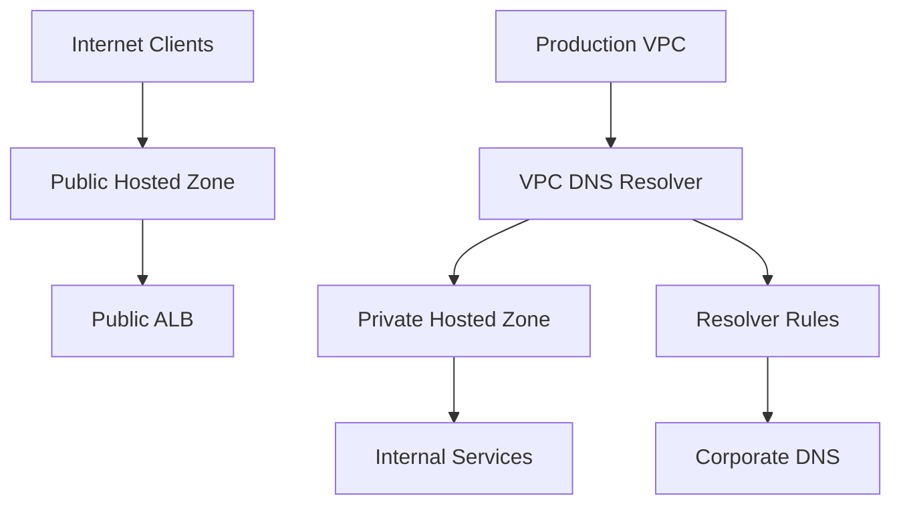
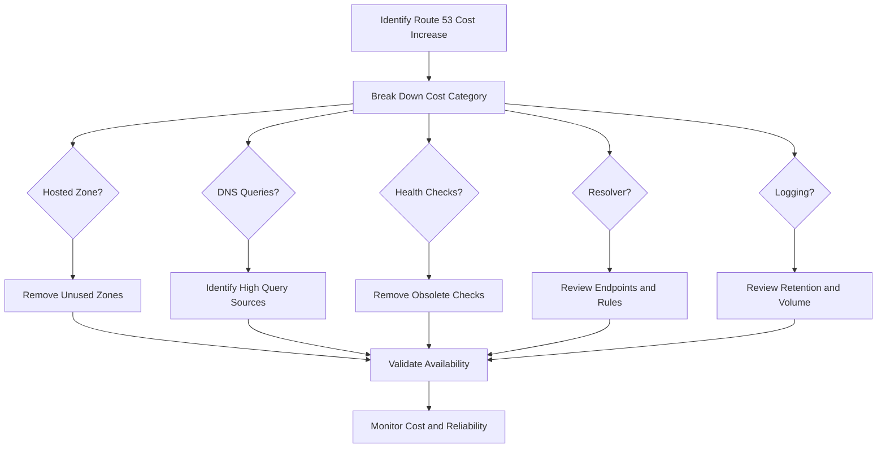

# 02- Cost Optimization

## Overview

Amazon Route 53 is generally inexpensive compared with compute, storage, and data-transfer services, but DNS costs can become meaningful in large environments because DNS is a high-volume infrastructure layer.

Cost optimization should therefore focus on **query volume, hosted zones, health checks, Resolver features, logging, and operational architecture** rather than simply trying to minimize the number of Route 53 resources.

The senior-engineering objective is:

> Reduce unnecessary DNS cost without weakening availability, security, observability, or architectural correctness.

A useful cost model is:

```text
Route 53 Cost
    │
    ├── Hosted Zones
    │
    ├── DNS Queries
    │
    ├── Health Checks
    │
    ├── Resolver Endpoints / Rules
    │
    ├── Query Logging
    │
    └── Domain Registration
```

Not every workload incurs every category. The exact pricing depends on the Route 53 feature, DNS query type, region, routing configuration, and AWS pricing model in effect.

For production planning, always validate current pricing against the official AWS pricing documentation before making financial decisions.

---

## Route 53 Cost Drivers

The main Route 53-related cost areas are:

| Cost Area | Typical Driver | Optimization Focus |
|---|---|---|
| Hosted zones | Number of hosted zones | Remove unused zones and avoid unnecessary duplication |
| DNS queries | Query volume | Reduce unnecessary DNS lookups and inefficient architectures |
| Health checks | Number and configuration | Remove obsolete checks and avoid redundant checks |
| Resolver endpoints | Endpoint capacity and configuration | Right-size and consolidate where appropriate |
| Resolver rules | Number and architecture | Avoid unnecessary duplication |
| Query logging | Log volume and retention | Filter, retain, and centralize appropriately |
| Domain registration | Registered domains | Remove unused domains |
| Monitoring | Metrics, logs, synthetic checks | Retention, sampling, and alert design |

The important point is that **DNS cost optimization is usually a systems-design problem**.

A backend service making millions of DNS lookups may have a DNS cost profile that is very different from a small internal application, even when both use the same Route 53 features.

---

## Hosted Zone Costs

A hosted zone stores DNS records for a domain or namespace.

Examples:

```text
example.com
internal.example.com
staging.example.com
```

Each hosted zone has an associated recurring charge.

### When Multiple Hosted Zones Make Sense

Multiple hosted zones are often justified for:

- Environment isolation.
- Organizational boundaries.
- Separate administrative ownership.
- Public/private DNS separation.
- Different DNS policies.
- Different security boundaries.

For example:

```text
Public DNS
example.com
      │
      ├── api.example.com
      └── www.example.com

Private DNS
internal.example.com
      │
      ├── db.internal.example.com
      └── redis.internal.example.com
```

The goal should not be to minimize the number of hosted zones at any cost.

A better objective is:

> Use the smallest number of hosted zones that preserves clean ownership, security, isolation, and operational simplicity.

---

## Avoid Unnecessary Hosted Zones

Common sources of unnecessary cost include:

- Abandoned development environments.
- Temporary testing zones.
- Duplicate zones created during migrations.
- Zones belonging to deleted applications.
- Old delegated subdomains.
- Hosted zones that no longer contain active records.

Maintain an inventory:

| Hosted Zone | Environment | Owner | Purpose | Status |
|---|---|---|---|---|
| `example.com` | Production | Platform | Public DNS | Active |
| `internal.example.com` | Production | Platform | Internal DNS | Active |
| `old-project.example.com` | Legacy | Unknown | Migration artifact | Review |

An unused hosted zone is easy to overlook because it may have no application traffic while still generating recurring cost.

---

## DNS Query Costs

DNS query volume is one of the most important operational cost considerations.

Every application lookup can potentially contribute to DNS query charges depending on the Route 53 feature and request path involved.

Consider:

```text
Microservice
    │
    ├── api.service.local
    ├── database.service.local
    ├── redis.service.local
    ├── kafka.service.local
    └── auth.service.local
```

If the application repeatedly resolves these names unnecessarily, DNS traffic can increase significantly at scale.

This is particularly relevant for:

- High-request-rate microservices.
- Large Kubernetes clusters.
- Service discovery architectures.
- Serverless workloads.
- Highly distributed applications.
- Large-scale CI/CD systems.

---

## DNS Caching

Caching is one of the most important mechanisms for controlling unnecessary DNS traffic.

A simplified request path is:

```text
Application
    │
    ▼
Local Resolver / Stub Resolver
    │
    ▼
Recursive Resolver
    │
    ├── Cache Hit ───────► Return Answer
    │
    └── Cache Miss
             │
             ▼
        Authoritative DNS
```

A cache hit avoids another authoritative lookup.

### TTL and Cost

TTL influences cache behavior.

A higher TTL generally allows answers to remain cached longer:

```text
Higher TTL
    │
    ├── Fewer repeated DNS lookups
    ├── Lower DNS query volume
    └── Faster cache reuse
```

But higher TTL also means:

```text
Higher TTL
    │
    └── Slower propagation of DNS changes
```

Therefore:

> TTL should be selected based on application reliability and change-management requirements, not solely on DNS cost.

---

## Choosing TTLs

A practical production strategy is to use different TTL policies based on record criticality.

| Record Type | Typical Strategy |
|---|---|
| Stable production endpoint | Relatively long TTL |
| Frequently changed service | Shorter TTL |
| Migration | Temporarily reduce TTL |
| Emergency failover | TTL aligned with expected failover behavior |
| Internal stable service | Moderate/long TTL where appropriate |

Avoid keeping all production records at extremely low TTLs without a specific reason.

For example:

```text
TTL = 10 seconds
```

may be useful during a migration but unnecessarily expensive or operationally noisy as a permanent setting.

---

## TTL Is Not a Cost-Control Mechanism Alone

A common mistake is to increase TTL purely to reduce DNS costs.

That can create operational problems.

Suppose an application changes from:

```text
203.0.113.10
```

to:

```text
203.0.113.20
```

If clients have cached the old answer for a long TTL, they may continue using the old destination.

This can cause:

- Delayed migrations.
- Uneven traffic distribution.
- Unexpected connections to old infrastructure.
- Longer failover recovery.

The correct approach is to balance:

```text
DNS query cost
+
change propagation requirements
+
failure recovery objectives
```

---

## Service Discovery and DNS Cost

Microservice architectures can generate substantial DNS traffic.

Consider:

```text
API Service
   │
   ├── User Service
   ├── Payment Service
   ├── Order Service
   ├── Inventory Service
   └── Notification Service
```

If every request causes repeated DNS resolution, high request rates can produce unnecessary resolver activity.

Applications should rely on the normal DNS caching behavior of their runtime and networking stack where appropriate.

Do not implement application-level DNS resolution on every request unless there is a strong architectural reason.

---

## Backend Example

An HTTP client making a request such as:

```text
https://orders.internal.example.com/orders/123
```

may perform DNS resolution before establishing the connection.

A poorly designed application could repeatedly resolve the hostname unnecessarily:

```text
Request 1 → DNS → TCP → HTTP
Request 2 → DNS → TCP → HTTP
Request 3 → DNS → TCP → HTTP
...
```

A better connection-management strategy allows the client to reuse connections and resolver caching where supported:

```text
Request 1 → DNS → TCP → HTTP
Request 2 ───────────────► HTTP
Request 3 ───────────────► HTTP
Request 4 ───────────────► HTTP
```

This can reduce both DNS overhead and network overhead.

The exact behavior depends on the client library, connection pool, operating system, runtime, and DNS resolver.

---

## Python and DNS Efficiency

For Python services using Django or FastAPI, DNS efficiency is usually influenced indirectly by:

- HTTP connection pooling.
- Keep-alive connections.
- DNS resolver behavior.
- Container networking.
- Kubernetes CoreDNS.
- Service discovery architecture.

For example, a production HTTP client should generally reuse connections rather than constructing a completely new network stack for every request.

With `httpx`:

```python
import httpx

client = httpx.Client(
    timeout=httpx.Timeout(5.0),
)

response = client.get(
    "https://api.example.com/orders/123"
)

response.raise_for_status()
```

The important engineering principle is not the library itself:

> Reuse long-lived clients and connection pools where appropriate instead of repeatedly creating clients for every request.

This reduces network overhead and can indirectly reduce repeated DNS work.

---

## Kubernetes and DNS Cost

Kubernetes environments deserve special attention because DNS traffic can become substantial.

A typical EKS request path may look like:

```text
Pod
 │
 ▼
CoreDNS
 │
 ├── Kubernetes Service
 │
 └── External / Private DNS
          │
          ▼
     VPC Resolver
          │
          ▼
     Route 53
```

Large Kubernetes clusters can generate significant DNS query volume from:

- Service discovery.
- External API calls.
- Database connections.
- Sidecars.
- Health checks.
- Controllers.
- Operators.

DNS optimization should therefore include CoreDNS and application behavior, not just Route 53 configuration.

---

## Avoid Excessive DNS Lookups in Kubernetes

Investigate workloads that generate unusually high DNS traffic.

Common causes include:

- Very short TTLs.
- Applications resolving the same hostname repeatedly.
- Misconfigured clients.
- Excessive health checks.
- Sidecars repeatedly performing discovery.
- Applications bypassing connection pooling.

The optimization sequence should be:

```text
Identify high query volume
        │
        ▼
Determine source workload
        │
        ▼
Determine queried hostname
        │
        ▼
Determine why lookups occur
        │
        ▼
Optimize application/resolver behavior
```

Do not blindly increase TTLs or disable DNS features before understanding the source of the queries.

---

## Route 53 Health Check Costs

Route 53 health checks have associated charges.

The main optimization principle is:

> Keep health checks only where they provide meaningful routing or operational value.

Remove:

- Checks for deleted applications.
- Checks for obsolete endpoints.
- Duplicate checks.
- Temporary migration checks.
- Checks no longer referenced by routing policies.

However, cost reduction should never result in removing a health check required for failover.

---

## Health Checks vs Application Monitoring

Do not create a Route 53 health check simply because an application has a monitoring requirement.

Use Route 53 health checks when their result affects DNS routing or when they provide meaningful endpoint health visibility.

Use application monitoring for:

- Detailed application metrics.
- Business-level health.
- Dependency health.
- Request latency.
- Error rates.
- Database performance.

For example:

```text
Route 53 Health Check
        │
        └── Should this endpoint receive DNS traffic?

CloudWatch/Application Monitoring
        │
        ├── Is the application healthy?
        ├── Is latency acceptable?
        ├── Are errors increasing?
        └── Are dependencies healthy?
```

One monitoring mechanism should not be forced to serve every purpose.

---

## Resolver Costs

Route 53 Resolver supports private DNS resolution and hybrid DNS architectures.

Resolver-related costs can arise from components such as:

- Resolver endpoints.
- Endpoint IP addresses.
- DNS queries through certain Resolver configurations.
- Resolver rules and forwarding architectures.

A common architecture is:

```text
AWS VPC
   │
   ▼
Outbound Resolver Endpoint
   │
   ▼
Corporate DNS
```

This is useful for hybrid environments, but unnecessary Resolver infrastructure should be removed when no longer required.

---

## Resolver Endpoint Optimization

Resolver endpoints should be designed for:

- Availability.
- Capacity.
- Network isolation.
- Hybrid DNS requirements.

Do not optimize cost by reducing redundancy below what the architecture requires.

For example, an endpoint deployed across multiple Availability Zones may cost more than a single-AZ design but provide substantially better availability.

The correct optimization is:

```text
Required availability
        │
        ▼
Determine capacity
        │
        ▼
Determine AZ placement
        │
        ▼
Remove only genuinely unnecessary capacity
```

Cost optimization must not become an availability regression.

---

## Resolver Rules

Resolver rules allow DNS queries to be forwarded according to domain patterns.

For example:

```text
*.corp.example.com
        │
        ▼
Corporate DNS
```

Rules are useful for:

- Hybrid DNS.
- Corporate domains.
- On-premises integrations.
- Split-horizon DNS.

Avoid creating duplicate rules that perform the same function.

Maintain an inventory:

| Domain | Rule | Destination | Owner |
|---|---|---|---|
| `corp.example.com` | Forward | Corporate DNS | Network |
| `legacy.example.com` | Forward | Legacy DNS | Platform |

This makes unused forwarding infrastructure easier to identify.

---

## Query Logging Costs

DNS query logging can generate substantial log volume in large environments.

For example:

```text
100,000 workloads
        │
        ▼
High DNS query volume
        │
        ▼
Resolver query logs
        │
        ▼
Large log ingestion/storage volume
```

Query logging is valuable for:

- Security investigations.
- DNS troubleshooting.
- Compliance requirements.
- Incident response.
- Application discovery.

But retaining every query forever is usually unnecessary.

---

## Log Retention Strategy

Use different retention periods based on operational value.

| Data | Suggested Approach |
|---|---|
| Recent DNS query logs | Fast-access retention |
| Security investigation data | Longer retention |
| High-volume debug data | Short retention |
| Aggregated metrics | Longer-term retention |
| Compliance-required data | Policy-driven retention |

Where supported by the logging architecture, consider:

- Filtering.
- Aggregation.
- Compression.
- Lifecycle policies.
- Centralized logging.
- Lower-cost archival storage.

---

## Observability Cost vs Value

A common senior-level mistake is optimizing infrastructure cost by disabling observability.

For example:

```text
Query logging is expensive
        │
        ▼
Disable query logging
        │
        ▼
DNS incident occurs
        │
        ▼
No historical evidence
        │
        ▼
Longer outage
```

The correct question is:

> What operational value does this telemetry provide relative to its cost?

Critical production DNS telemetry should remain available even when lower-value logging is reduced.

---

## Public vs Private DNS Architecture

A clean DNS architecture can reduce operational complexity and unnecessary infrastructure.

For example:



Avoid creating duplicate DNS infrastructure simply because the public and private environments use similar names.

Use public and private hosted zones intentionally according to the required resolution model.

---

## Split-Horizon DNS

Split-horizon DNS can be operationally useful:

```text
                    example.com
                         │
              ┌──────────┴──────────┐
              │                     │
          Internet                  VPC
              │                     │
              ▼                     ▼
       Public Hosted Zone     Private Hosted Zone
              │                     │
              ▼                     ▼
         Public ALB             Internal ALB
```

This can avoid unnecessary external routing for internal services.

However, duplicate namespaces increase operational complexity.

Before using split-horizon DNS, define:

- Ownership.
- Record lifecycle.
- Change management.
- Monitoring.
- IaC structure.
- Incident procedures.

---

## Domain Registration Costs

Route 53 can also be used for domain registration.

Review registered domains periodically.

Common waste includes:

- Expired projects.
- Old proof-of-concept domains.
- Domains retained without business purpose.
- Duplicate registrations.
- Domains belonging to decommissioned products.

Domain deletion should be handled carefully because a domain may be part of:

- Email systems.
- OAuth redirect URLs.
- Certificates.
- External integrations.
- DNS delegation.
- Customer-facing services.

Never delete a domain solely because it appears unused in application traffic.

---

## Infrastructure-as-Code and Cost Control

Route 53 resources should preferably be managed through Infrastructure as Code.

Example Terraform:

```hcl
resource "aws_route53_zone" "production" {
  name = "example.com"
}

resource "aws_route53_record" "api" {
  zone_id = aws_route53_zone.production.zone_id
  name    = "api.example.com"
  type    = "A"

  alias {
    name                   = aws_lb.api.dns_name
    zone_id                = aws_lb.api.zone_id
    evaluate_target_health = true
  }
}
```

IaC provides:

- Resource ownership.
- Change history.
- Review workflows.
- Drift detection.
- Repeatability.
- Easier cleanup.

It also makes cost review easier because Route 53 resources can be associated with environments and applications.

---

## Resource Tagging

Where supported, use consistent tagging for Route 53-related resources.

Useful dimensions include:

```text
Environment
Application
Team
Owner
CostCenter
ManagedBy
Lifecycle
```

Example:

```text
Environment=production
Application=orders-api
Owner=platform-team
ManagedBy=terraform
CostCenter=backend
```

Tags make ownership and cleanup easier, although not every Route 53 resource supports tags in the same way.

---

## Cost Allocation Strategy

A mature organization should be able to answer:

> Which team is responsible for this DNS cost?

Possible allocation models include:

- Environment.
- Application.
- Business unit.
- AWS account.
- Cost center.
- Shared platform allocation.

For shared DNS infrastructure:

```text
Platform DNS
     │
     ├── Team A
     ├── Team B
     ├── Team C
     └── Team D
```

The platform team may own the infrastructure while allocating costs internally according to an agreed model.

---

## Cost Monitoring

Use AWS billing and cost-management capabilities to monitor Route 53-related spend.

Track:

- Route 53 monthly cost.
- Cost trends.
- Query-related charges.
- Resolver-related charges.
- Health-check charges.
- Logging-related costs.
- Unexpected month-over-month changes.

A useful operational metric is:

```text
Current DNS Cost
-------------------------
Previous comparable period
```

A sudden increase should trigger investigation.

Potential causes include:

- New application deployment.
- DNS query explosion.
- New Resolver architecture.
- Increased query logging.
- New health checks.
- New hosted zones.
- Migration activity.

---

## Detecting DNS Query Explosions

A query-volume anomaly can indicate an application problem.

For example:

```text
Normal DNS Queries
        │
        │
        └───────────────┐
                        │
                        ▼
                 Sudden Increase
                        │
                        ▼
               Investigate Source
```

Possible causes:

- Application restart loops.
- Broken DNS caching.
- Excessive service discovery.
- Very low TTLs.
- Client connection failures.
- Kubernetes DNS problems.
- Retry storms.

DNS cost anomalies can therefore be an **application reliability signal**, not merely a billing problem.

---

## Cost Optimization Workflow

Use a structured process rather than deleting resources opportunistically.



This prevents cost optimization from becoming an uncontrolled infrastructure change.

---

## Production Cost Optimization Strategy

A practical priority order is:

### Remove Waste First

Look for:

- Unused hosted zones.
- Obsolete health checks.
- Unused Resolver rules.
- Unnecessary Resolver endpoints.
- Abandoned domains.
- Excessive log retention.

### Optimize Query Behavior

Investigate:

- Repeated DNS lookups.
- Low TTLs.
- Excessive service discovery.
- Connection-management issues.
- Kubernetes DNS volume.

### Optimize Observability

Review:

- Log retention.
- Log volume.
- Metric cardinality.
- Synthetic-check frequency.
- Duplicate monitoring.

### Optimize Architecture

Only after understanding the workload:

- Consolidate appropriate DNS infrastructure.
- Reduce unnecessary forwarding.
- Simplify service discovery.
- Improve caching.
- Remove redundant resolution paths.

---

## Cost Optimization vs Reliability

Never optimize DNS cost in isolation.

A useful decision framework is:

| Change | Cost Impact | Reliability Impact | Recommendation |
|---|---:|---:|---|
| Delete unused hosted zone | Lower | None | Recommended |
| Remove obsolete health check | Lower | None | Recommended |
| Increase TTL for stable record | Lower query volume | Slower change propagation | Context-dependent |
| Disable production query logging | Lower | Reduced investigation capability | Usually avoid |
| Reduce Resolver redundancy | Lower | Potential availability loss | Avoid unless justified |
| Remove duplicate Resolver rule | Lower | Usually none | Recommended after validation |
| Reduce synthetic checks excessively | Lower | Reduced detection capability | Context-dependent |
| Remove private DNS infrastructure | Lower | Potential service outage | Only after architecture review |

The cheapest DNS architecture is not necessarily the best architecture.

---

## Common Cost Optimization Mistakes

| Mistake | Why It Is Dangerous | Better Approach |
|---|---|---|
| Deleting hosted zones to save small recurring costs | Can break production DNS | Verify ownership and dependencies first |
| Increasing TTL everywhere | Can make failover and migrations slower | Tune TTL per workload |
| Disabling DNS query logs | Removes troubleshooting evidence | Optimize retention instead |
| Removing health checks used by failover | Can break traffic routing | Map dependencies before removal |
| Reducing Resolver redundancy | Creates DNS availability risks | Optimize only unused capacity |
| Ignoring Kubernetes DNS volume | Application behavior may drive costs | Analyze query sources |
| Creating a health check for every service | Creates unnecessary cost and complexity | Use checks where routing/availability value exists |
| Keeping temporary zones indefinitely | Small costs accumulate | Automate lifecycle cleanup |
| Optimizing without measurement | Can damage reliability without meaningful savings | Establish baseline first |
| Ignoring DNS during cost reviews | Query volume can scale rapidly | Include Route 53 in FinOps reviews |

---

## Cost Optimization Checklist

### Hosted Zones

- [ ] Every hosted zone has an identified owner.
- [ ] Unused zones are periodically reviewed.
- [ ] Temporary environments have lifecycle controls.
- [ ] Duplicate zones are justified.

### DNS Queries

- [ ] DNS query volume is monitored.
- [ ] High-query workloads can be identified.
- [ ] TTLs are appropriate for workload requirements.
- [ ] Applications reuse connections where appropriate.
- [ ] Kubernetes DNS traffic is monitored where relevant.

### Health Checks

- [ ] Obsolete health checks are removed.
- [ ] Health checks are associated with real routing or monitoring requirements.
- [ ] Failover health checks are protected from accidental deletion.
- [ ] Health-check endpoints are lightweight.

### Resolver

- [ ] Resolver endpoints have clear ownership.
- [ ] Resolver rules are reviewed periodically.
- [ ] Unused forwarding rules are removed.
- [ ] Availability requirements are documented before reducing capacity.

### Logging

- [ ] DNS logs have defined retention.
- [ ] High-volume logs are reviewed for value.
- [ ] Security-required logs are retained appropriately.
- [ ] Debug telemetry is not retained indefinitely.

### Infrastructure as Code

- [ ] Route 53 resources are managed through IaC where practical.
- [ ] Changes go through review.
- [ ] Resource ownership is documented.
- [ ] Drift detection is available where appropriate.
- [ ] Temporary resources have explicit lifecycle policies.

### FinOps

- [ ] Route 53 cost is visible in billing reports.
- [ ] Query-cost anomalies are investigated.
- [ ] Resolver costs are monitored.
- [ ] DNS cost trends are reviewed periodically.
- [ ] Cost reductions are validated against reliability metrics.

---

## Interview Traps

### "DNS is cheap, so Route 53 cost does not matter."

For small systems this may be true operationally, but at large scale DNS query volume, Resolver infrastructure, logging, and monitoring can become meaningful.

### "Increase TTL to reduce all DNS costs."

Increasing TTL can reduce lookup frequency but increases cache lifetime and can delay changes and failover.

### "Remove health checks to reduce Route 53 costs."

Only if those checks are genuinely obsolete. Removing a health check used by a failover routing policy can create a reliability incident.

### "Disable DNS query logging because it costs money."

This trades a measurable cost for reduced security and troubleshooting capability. Optimize retention and volume before removing critical telemetry.

### "Fewer Resolver endpoints are always better."

Not if the architecture requires high availability or hybrid DNS.

### "DNS query spikes are only a billing problem."

A DNS query explosion can indicate:

- Application retry storms.
- Broken caching.
- Service-discovery problems.
- Kubernetes DNS issues.
- Low TTLs.
- Connection-pooling problems.

The cost increase may be a symptom of a deeper reliability issue.

---

## Key Takeaways

Route 53 cost optimization is primarily about **eliminating unnecessary DNS infrastructure and controlling avoidable DNS activity without weakening reliability**.

The most important principles are:

- Remove unused hosted zones, health checks, domains, and Resolver infrastructure.
- Monitor DNS query volume rather than optimizing blindly.
- Use TTLs based on reliability and change-propagation requirements, not cost alone.
- Investigate high DNS query volume at the application and Kubernetes layers.
- Reuse HTTP connections and avoid unnecessary repeated service discovery.
- Review Resolver endpoints and forwarding rules for unused capacity and duplication.
- Retain important DNS logs while controlling retention and storage costs.
- Manage Route 53 resources through Infrastructure as Code where practical.
- Assign ownership to DNS resources so abandoned infrastructure can be removed safely.
- Treat DNS query spikes as potential application reliability signals.
- Never trade away critical failover, redundancy, or security controls for small savings.
- Validate cost reductions against availability, incident-detection, and recovery requirements.

A senior engineer should optimize Route 53 using this hierarchy:

```text
Remove waste
    │
    ▼
Understand query behavior
    │
    ▼
Optimize caching and application behavior
    │
    ▼
Right-size Resolver and monitoring infrastructure
    │
    ▼
Review logging and retention
    │
    ▼
Validate reliability
    │
    ▼
Measure actual savings
```

The correct target is not **minimum DNS cost**.

The target is **the lowest sustainable DNS cost that still satisfies the system's availability, security, observability, performance, and operational requirements**.