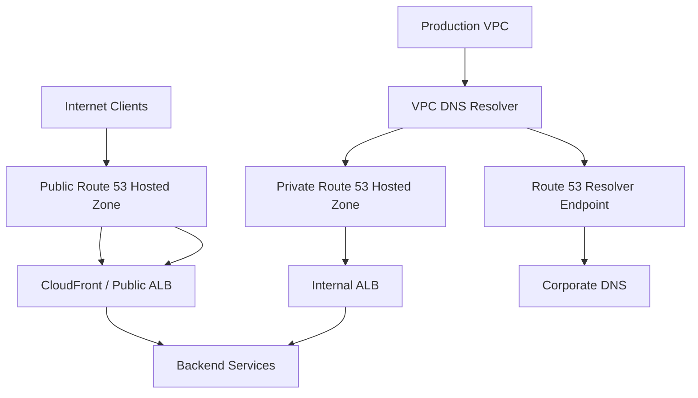
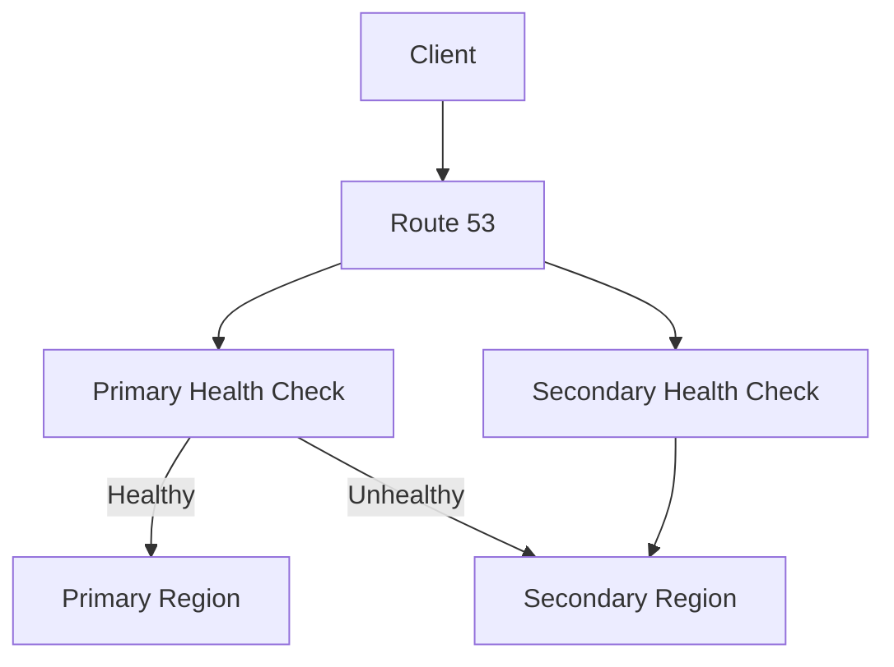
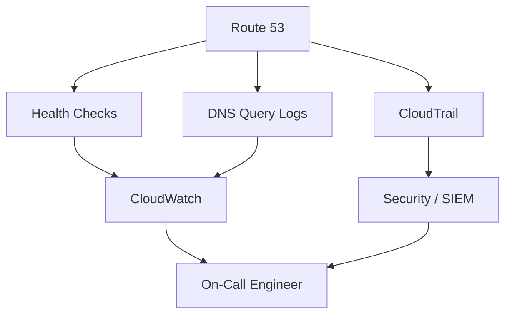

# 03- Production Best Practices

## Overview

Amazon Route 53 is a foundational production dependency because DNS sits in front of almost every public and private backend request. A DNS failure can make otherwise healthy applications unreachable, while a poorly designed DNS architecture can introduce security, availability, migration, and operational problems.

Production Route 53 design should therefore treat DNS as infrastructure rather than as a collection of records.

A mature architecture should provide:

- Clear ownership of DNS resources.
- High availability.
- Predictable change management.
- Secure administrative access.
- Appropriate public/private separation.
- Controlled DNS propagation behavior.
- Automated configuration.
- Health-aware routing where required.
- Auditable changes.
- Operational visibility.
- Tested disaster-recovery procedures.

A useful production model is:

```text
                    DNS Architecture
                          │
        ┌─────────────────┼─────────────────┐
        │                 │                 │
     Reliability        Security         Operations
        │                 │                 │
   Health checks       IAM controls      IaC
   Failover            DNSSEC            Logging
   Multi-AZ            Least privilege   Monitoring
        │                 │                 │
        └─────────────────┼─────────────────┘
                          │
                    Application
                    Availability
```

The key principle is:

> DNS should be designed with the same engineering discipline as compute, networking, databases, and application infrastructure.

---

## Production DNS Architecture

A typical production environment separates public and private DNS responsibilities.



The exact architecture depends on whether the system requires:

- Public application endpoints.
- Private service discovery.
- Hybrid connectivity.
- On-premises DNS integration.
- Multi-account AWS infrastructure.
- Cross-VPC name resolution.

Avoid creating DNS components merely because they are available. Every DNS resource should have a clear architectural purpose.

---

## Public and Private DNS Separation

Public and private DNS serve different trust and routing boundaries.

### Public DNS

Public DNS is used for names resolvable from the internet.

Examples:

```text
www.example.com
api.example.com
auth.example.com
```

Typical targets include:

- CloudFront distributions.
- Application Load Balancers.
- Network Load Balancers.
- API endpoints.
- Other public AWS services.

### Private DNS

Private DNS is used for resources that should be resolvable only from authorized VPC environments.

Examples:

```text
orders.internal.example.com
postgres.internal.example.com
redis.internal.example.com
```

Typical targets include:

- Internal load balancers.
- Private services.
- Databases.
- Internal APIs.
- Service discovery endpoints.

Do not expose internal infrastructure through public DNS unless there is a deliberate security and networking requirement.

---

## Private Hosted Zones

Private hosted zones should be associated only with the VPCs that require resolution.

For example:

```text
internal.example.com
        │
        ├── orders.internal.example.com
        ├── payments.internal.example.com
        └── inventory.internal.example
```

A private hosted zone can provide stable service names while allowing infrastructure to change underneath.

For example:

```text
orders.internal.example.com
        │
        ▼
Internal ALB
        │
        ├── ECS
        ├── EKS
        └── EC2
```

Applications should depend on the stable DNS name rather than individual private IP addresses.

---

## Multi-Account DNS Architecture

Large AWS environments commonly use multiple accounts:

```text
AWS Organization
│
├── Network Account
│   └── Central DNS / Resolver
│
├── Production Account
│   └── Production VPCs
│
├── Staging Account
│   └── Staging VPCs
│
└── Development Account
    └── Development VPCs
```

Centralizing shared DNS infrastructure can simplify:

- Ownership.
- Resolver configuration.
- Hybrid DNS.
- Governance.
- Auditing.

However, centralized DNS also creates a dependency on the networking/platform team.

The architecture should explicitly define:

- Which account owns public zones.
- Which account owns private zones.
- Which teams can modify records.
- How VPC associations are managed.
- How cross-account access works.
- How emergency changes are performed.

---

## DNS Ownership

Every production DNS zone should have an identifiable owner.

A useful ownership model is:

| Resource | Owner | Responsibility |
|---|---|---|
| Public zone | Platform/Network | Delegation and global DNS |
| Application records | Application team | Service endpoints |
| Private zones | Platform/Network | Internal namespaces |
| Resolver endpoints | Network team | Hybrid DNS |
| DNSSEC | Security/Platform | Signing and key lifecycle |
| DNS monitoring | SRE/Platform | Detection and alerting |

Avoid situations where nobody knows who can safely modify a production record.

---

## Infrastructure as Code

Production DNS should generally be managed through Infrastructure as Code.

Terraform is one common approach:

```hcl
resource "aws_route53_zone" "public" {
  name = "example.com"
}

resource "aws_route53_record" "api" {
  zone_id = aws_route53_zone.public.zone_id
  name    = "api.example.com"
  type    = "A"

  alias {
    name                   = aws_lb.api.dns_name
    zone_id                = aws_lb.api.zone_id
    evaluate_target_health = true
  }
}
```

IaC provides:

- Version control.
- Code review.
- Repeatable deployments.
- Change history.
- Automated validation.
- Easier rollback.
- Reduced configuration drift.

DNS changes should be treated as production infrastructure changes rather than manual console operations.

---

## DNS Change Workflow

A production DNS change should follow a controlled lifecycle:


For high-risk changes, include:

- Pre-change validation.
- Current-record capture.
- Reduced TTL where appropriate.
- Deployment window.
- Rollback plan.
- Post-change verification.

---

## Avoid Manual DNS Changes

Manual console changes are risky because they can create drift.

For example:

```text
Terraform
   │
   ▼
Expected Record
api.example.com → ALB-A

Route 53 Console
   │
   ▼
Actual Record
api.example.com → ALB-B
```

Now the infrastructure definition no longer describes reality.

If an engineer later runs Terraform, the manually created configuration may be overwritten or unexpectedly changed.

Manual emergency changes may be necessary, but they should be reconciled back into IaC afterward.

---

## Record Naming Conventions

Use predictable DNS naming conventions.

For example:

```text
api.example.com
admin.example.com
auth.example.com

orders.internal.example.com
payments.internal.example.com
inventory.internal.example.com
```

For multi-environment systems:

```text
api.example.com
api.staging.example.com
api.dev.example.com
```

or separate domains:

```text
example.com
example-staging.com
example-dev.com
```

The choice should be consistent across the organization.

Avoid ad hoc names such as:

```text
api-new.example.com
api-final.example.com
api-final-v2.example.com
api-temp.example.com
```

Temporary DNS names have a tendency to become permanent infrastructure.

---

## Stable DNS Names

Applications should generally depend on stable logical names rather than infrastructure-specific names.

Prefer:

```text
orders.internal.example.com
```

over:

```text
internal-alb-123456789.us-east-1.elb.amazonaws.com
```

The application should not need to know which load balancer or compute platform currently implements the service.

This makes migrations easier:

```text
Current:

orders.internal.example.com
        │
        ▼
ECS

Future:

orders.internal.example.com
        │
        ▼
EKS
```

The DNS contract remains stable.

---

## Alias Records

When supported, Route 53 alias records are generally preferable to hardcoding AWS resource IP addresses.

For example:

```text
api.example.com
        │
        ▼
Application Load Balancer
```

Instead of:

```text
api.example.com
        │
        ▼
203.0.113.10
```

AWS-managed targets can change their underlying infrastructure without requiring application-level changes.

Alias records are particularly useful for AWS resources such as:

- Application Load Balancers.
- Network Load Balancers.
- CloudFront distributions.
- S3 website endpoints.
- Other supported AWS targets.

---

## Health-Aware Routing

Production systems requiring DNS-level failover should use health-aware routing appropriately.

Example:



The important distinction is:

> Route 53 health checks determine DNS routing behavior; they do not make an unhealthy application healthy.

The application architecture must already support the desired failover model.

---

## Health Check Design

A health check should test something meaningful.

For a public API:

```text
GET /health
```

may be appropriate if the endpoint accurately represents service availability.

However, a health endpoint that always returns `200 OK` while the database, cache, or critical dependency is unavailable may produce false confidence.

A production health model should distinguish between:

- Process health.
- Application health.
- Dependency health.
- Traffic-serving capability.

Avoid making DNS failover depend on an overly complicated health endpoint that itself becomes fragile.

---

## Health Check Endpoint Design

A useful health endpoint should be:

- Fast.
- Deterministic.
- Lightweight.
- Authentication-safe.
- Observable.
- Representative of traffic-serving capability.

For example:

```text
GET /health

200 OK
{
  "status": "healthy"
}
```

Do not expose sensitive internal dependency information:

```json
{
  "database_host": "prod-db.internal.example.com",
  "redis_password": "..."
}
```

Health endpoints are operational interfaces and should be designed as carefully as public APIs.

---

## TTL Strategy

TTL should reflect operational requirements.

| Scenario | TTL Strategy |
|---|---|
| Stable production endpoint | Longer TTL |
| Frequent deployment | Moderate TTL |
| Planned migration | Temporarily lower TTL |
| Failover-sensitive record | Carefully align with recovery expectations |
| Experimental environment | Shorter TTL may be acceptable |

Do not use extremely low TTLs everywhere simply because rapid changes are convenient.

Low TTLs can increase:

- DNS query volume.
- Resolver load.
- Operational noise.
- Cost.

High TTLs can increase:

- Stale-cache duration.
- Migration complexity.
- Failover propagation time.

TTL is an availability and change-management parameter, not merely a DNS configuration value.

---

## DNSSEC

DNSSEC should be considered for domains where protection against DNS response tampering is an important security requirement.

It provides cryptographic validation of DNS data.

The architecture becomes:

```text
Client
  │
  ▼
DNS Resolver
  │
  ▼
DNSSEC Validation
  │
  ▼
Authenticated DNS Data
```

DNSSEC introduces additional operational requirements around:

- Key management.
- Signing.
- Key rotation.
- Delegation.
- DS records.
- Recovery procedures.

Do not enable security features without also defining their operational lifecycle.

---

## IAM and Least Privilege

Route 53 administrative access should follow least privilege.

Application workloads generally should not receive broad DNS-management permissions.

Avoid:

```json
{
  "Effect": "Allow",
  "Action": "route53:*",
  "Resource": "*"
}
```

Prefer narrowly scoped permissions where practical.

For example, an automation role might be permitted to modify specific hosted zones rather than every Route 53 resource in the account.

The goal is to separate:

```text
Application Runtime
        │
        └── Read-only DNS dependencies

Infrastructure Pipeline
        │
        └── DNS modification permissions

Platform Administrators
        │
        └── Controlled emergency access
```

---

## Protect Production DNS Changes

Production DNS modification should require stronger controls than development DNS.

Recommended controls include:

- Separate AWS accounts.
- Dedicated deployment roles.
- Pull-request review.
- CI/CD approval gates.
- CloudTrail auditing.
- MFA for privileged human access.
- Short-lived credentials.
- Least-privilege IAM policies.

A production DNS record can redirect traffic to infrastructure controlled by an attacker if administrative credentials are compromised.

DNS administration is therefore a high-value security boundary.

---

## CloudTrail and Auditing

Route 53 control-plane API activity should be auditable.

Track events such as:

- Hosted zone changes.
- Record changes.
- Health-check changes.
- Resolver configuration changes.
- IAM-driven administrative actions.

A useful incident question is:

> Who changed the DNS configuration, when, from which identity, and through which workflow?

Centralized audit logging makes this question answerable.

---

## Query Logging

DNS query logging is useful for operational and security investigations.

It can help identify:

- Unexpected domain resolution.
- Misconfigured clients.
- Internal service dependencies.
- Suspicious DNS activity.
- DNS resolution failures.
- Query-volume anomalies.

For example:

```text
Pod
 │
 ▼
VPC Resolver
 │
 ▼
DNS Query Logs
 │
 ├── Normal service discovery
 ├── Unexpected external domain
 └── Query storm
```

Logging should be combined with appropriate retention and access controls.

---

## Monitoring and Alerting

Route 53 should be monitored as part of the overall application availability model.

Useful signals include:

| Signal | Purpose |
|---|---|
| Health-check status | Detect endpoint availability |
| DNS query volume | Detect anomalies |
| Resolver errors | Detect resolution problems |
| NXDOMAIN volume | Detect incorrect/missing records |
| Latency | Detect resolution degradation |
| Change events | Detect unexpected configuration changes |
| DNSSEC validation failures | Detect security/configuration problems |

Do not create alerts for every possible DNS metric.

Alert on signals that require human action.

---

## DNS Monitoring Architecture



Monitoring should cover both:

1. DNS data-plane behavior.
2. DNS control-plane changes.

A system can have healthy DNS resolution while an unauthorized configuration change is taking place.

---

## Disaster Recovery

DNS is often part of disaster recovery rather than merely a networking detail.

A multi-region application might use:

```text
                    Route 53
                       │
              ┌────────┴────────┐
              │                 │
        Region A            Region B
        Primary             Secondary
           │                   │
         ALB-A               ALB-B
           │                   │
        Services            Services
```

A DNS failover strategy is only effective if the secondary region is actually capable of serving traffic.

Validate:

- Compute capacity.
- Database recovery.
- Application configuration.
- Secrets.
- Network connectivity.
- Certificates.
- DNS records.
- Health checks.
- External dependencies.

DNS failover alone is not disaster recovery.

---

## DNS Disaster Recovery Testing

Do not assume failover works because the configuration looks correct.

Test it.

A production-grade exercise should validate:

```text
Primary failure
      │
      ▼
Health check detects failure
      │
      ▼
Route 53 changes answer
      │
      ▼
Clients resolve secondary
      │
      ▼
Secondary serves traffic
      │
      ▼
Application remains functional
```

Measure:

- Detection time.
- DNS response behavior.
- Client cache effects.
- Secondary readiness.
- Recovery time.
- Rollback behavior.

---

## Multi-Region DNS Design

DNS-based multi-region routing can support:

- Active/passive deployments.
- Active/active architectures.
- Latency-based routing.
- Weighted traffic shifting.
- Geolocation-based routing.
- Failover.

The routing policy should match the application architecture.

For example:

```text
Active/Passive

Clients
   │
   ▼
Route 53
   │
   ├── Primary ─── Healthy ───► Traffic
   │
   └── Secondary ─────────────► Standby
```

For active/active:

```text
Clients
   │
   ▼
Route 53
   │
   ├── Region A ──► Traffic
   │
   └── Region B ──► Traffic
```

Do not select a routing policy because it sounds sophisticated. Select it because it satisfies measurable application requirements.

---

## Weighted Routing for Safe Deployments

Weighted routing can be useful for controlled traffic distribution.

For example:

```text
Route 53
   │
   ├── Version A → 95%
   │
   └── Version B → 5%
```

This can support:

- Canary deployments.
- Migration testing.
- Gradual traffic shifts.
- Blue/green strategies.

However, DNS-level weighting is not equivalent to precise request-level traffic control because resolver caching and TTLs influence actual traffic distribution.

For fine-grained application traffic management, consider load-balancer or service-mesh mechanisms where appropriate.

---

## DNS and Blue/Green Deployments

A simplified DNS-based blue/green architecture:

```text
api.example.com
       │
       ▼
    Route 53
       │
   ┌───┴───┐
   │       │
 Blue    Green
   │       │
 ALB-A   ALB-B
```

During migration:

```text
Before:
Blue   → 100%
Green  → 0%

Migration:
Blue   → 90%
Green  → 10%

Later:
Blue   → 0%
Green  → 100%
```

Always account for DNS caching when designing rollback procedures.

---

## DNS Change Safety

High-risk DNS changes should use a staged process.

### Before the Change

Verify:

- Current records.
- TTL.
- Routing policy.
- Health checks.
- Target health.
- Delegation.
- Dependencies.
- IaC state.
- Rollback configuration.

### During the Change

Monitor:

- DNS answers.
- Application traffic.
- HTTP status codes.
- Latency.
- Error rates.
- Health checks.

### After the Change

Validate from multiple resolver locations where appropriate.

For example:

```bash
dig api.example.com
```

and:

```bash
dig +trace api.example.com
```

The goal is not merely to verify that a record exists, but to verify that the expected DNS resolution path produces the intended answer.

---

## DNS Propagation Reality

DNS changes are often described as "propagation."

A more useful mental model is:

```text
Authoritative DNS
        │
        ▼
Recursive Resolver
        │
        ▼
Client / Local Cache
        │
        ▼
Application
```

A change at the authoritative layer does not mean every client immediately observes it.

Caching exists at multiple layers.

Therefore, production change plans should account for:

- Record TTL.
- Recursive resolver cache.
- Client resolver cache.
- Application-level caching.
- Connection reuse.

This is particularly important during migrations and incident response.

---

## Application-Level DNS Caching

Applications and networking components may introduce caching behavior beyond Route 53.

Potential layers include:

```text
Application
    │
    ▼
Runtime / Resolver
    │
    ▼
OS Cache
    │
    ▼
Container / Node Resolver
    │
    ▼
VPC Resolver
    │
    ▼
Route 53
```

When diagnosing stale DNS, engineers should identify which layer is returning the old answer.

Do not assume Route 53 itself is serving stale data simply because a client sees an old record.

---

## Kubernetes DNS Best Practices

For EKS workloads:

- Monitor CoreDNS health.
- Monitor DNS query volume.
- Avoid unnecessary external lookups.
- Use stable Kubernetes service names.
- Investigate DNS-heavy workloads.
- Avoid excessive retry loops.
- Ensure CoreDNS has appropriate resources.
- Understand how Kubernetes DNS interacts with VPC resolution.

A useful debugging path is:

```text
Pod
 │
 ▼
/etc/resolv.conf
 │
 ▼
CoreDNS
 │
 ▼
VPC Resolver
 │
 ▼
Route 53 / External DNS
```

The failure may occur at any layer.

---

## Backend Service Best Practices

For Django, FastAPI, and other backend applications:

- Use stable service DNS names.
- Reuse HTTP clients and connection pools.
- Avoid resolving service names unnecessarily.
- Do not hardcode ephemeral IP addresses.
- Make DNS dependencies explicit.
- Monitor DNS failures as part of application reliability.
- Design retry behavior carefully.

DNS failures combined with aggressive retries can produce a cascading failure:

```text
DNS Failure
    │
    ▼
Connection Failure
    │
    ▼
Application Retry
    │
    ▼
More DNS Requests
    │
    ▼
Higher Resolver Load
    │
    ▼
Larger Failure
```

Retry policies should include appropriate backoff and limits.

---

## Security Best Practices

Production Route 53 security should include:

- Least-privilege IAM.
- Separate production accounts where appropriate.
- Protected deployment roles.
- MFA for privileged human access.
- CloudTrail auditing.
- DNSSEC where appropriate.
- Controlled hosted-zone delegation.
- Private hosted zones for internal names.
- Restricted access to DNS query logs.
- Centralized security monitoring.

Never grant every developer unrestricted production DNS permissions simply because DNS changes are "simple."

A DNS record can redirect users to an attacker-controlled endpoint just as effectively as a compromised application configuration.

---

## Delegation Security

Domain delegation establishes trust between DNS layers.

For example:

```text
Parent Zone
example.com
     │
     ▼
Subdomain Delegation
prod.example.com
     │
     ▼
Child Hosted Zone
```

Production delegation should be documented and controlled.

Before modifying delegation, verify:

- Parent zone.
- NS records.
- Registrar configuration.
- Delegated child zone.
- DNSSEC requirements.
- TTL.
- Ownership.

Incorrect delegation can make an entire namespace unreachable.

---

## Change Management

DNS changes should follow the same change-management principles as other production infrastructure.

For routine changes:

```text
Pull Request
    │
    ▼
Automated Validation
    │
    ▼
Peer Review
    │
    ▼
CI/CD
    │
    ▼
Route 53
```

For emergency changes:

```text
Incident
   │
   ▼
Emergency Authorization
   │
   ▼
Minimal DNS Change
   │
   ▼
Verification
   │
   ▼
Reconcile Change into IaC
```

The last step is essential.

An emergency manual change that is never added back to IaC becomes configuration drift.

---

## Testing DNS Configuration

DNS configuration should be validated before production deployment.

Useful checks include:

- Record syntax.
- Record type.
- Target correctness.
- Hosted-zone identity.
- Routing policy.
- Health-check association.
- TTL.
- Alias target.
- Delegation.
- Expected resolution.

For critical infrastructure, automated integration tests can verify that expected records exist after deployment.

---

## Environment Isolation

Avoid accidentally modifying production DNS from development pipelines.

Use separate:

```text
AWS Accounts
+
IAM Roles
+
Terraform State
+
CI/CD Environments
```

For example:

```text
GitHub Actions
      │
      ├── Development Role
      │       └── Dev DNS
      │
      ├── Staging Role
      │       └── Staging DNS
      │
      └── Production Role
              └── Production DNS
```

Production credentials should not be available to development workflows.

---

## DNS Resource Lifecycle

Every DNS resource should have a lifecycle.

Examples:

```text
Create
  │
  ▼
Use
  │
  ▼
Review
  │
  ▼
Deprecate
  │
  ▼
Validate Dependencies
  │
  ▼
Delete
```

This is particularly important for:

- Temporary environments.
- Migration records.
- Legacy zones.
- Old health checks.
- Deprecated services.

DNS resources often survive the applications that originally created them.

---

## Documentation

Document critical DNS architecture.

At minimum, record:

- Domain ownership.
- Hosted zones.
- Public/private classification.
- VPC associations.
- Resolver endpoints.
- Forwarding rules.
- Health checks.
- Failover policies.
- DNSSEC configuration.
- IaC ownership.
- Emergency procedures.

A DNS architecture diagram should answer:

> Where does a DNS query go, and which team owns each component?

---

## Incident Response

During a DNS incident, avoid making multiple uncontrolled changes.

Use a structured sequence:

```text
Detect
  │
  ▼
Identify Scope
  │
  ▼
Determine Authoritative Answer
  │
  ▼
Check Delegation
  │
  ▼
Check Resolver Behavior
  │
  ▼
Check Route 53 Configuration
  │
  ▼
Check Application Target
  │
  ▼
Apply Minimal Change
  │
  ▼
Verify From Multiple Paths
```

Useful tools include:

```bash
dig example.com
```

```bash
dig +short api.example.com
```

```bash
dig +trace api.example.com
```

```bash
nslookup api.example.com
```

The objective is to isolate whether the failure is in:

- Authoritative DNS.
- Delegation.
- Recursive resolution.
- Local caching.
- Routing.
- Health checks.
- Target infrastructure.
- Application behavior.

---

## Common Production Pitfalls

| Pitfall | Impact | Prevention |
|---|---|---|
| Manual console changes | IaC drift | Use controlled deployment pipelines |
| Incorrect hosted zone | Records appear correct but are not authoritative | Verify zone and delegation |
| Extremely low TTLs | Higher query volume | Tune TTL to operational requirements |
| Excessively high TTLs | Slow changes/failover | Use appropriate TTLs |
| Weak IAM permissions | Unauthorized DNS changes | Least privilege |
| Missing health-check validation | Incorrect failover | Test health endpoints |
| Single-region dependency | Regional outage | Design multi-region architecture where required |
| Unmanaged temporary records | DNS clutter | Lifecycle ownership |
| Unmonitored DNS | Slow incident detection | Monitor health and query behavior |
| Unreconciled emergency changes | Future deployments overwrite fixes | Update IaC after incidents |
| Overly complex health endpoints | False failover behavior | Keep checks lightweight and meaningful |
| Assuming DNS propagation is immediate | Migration surprises | Account for caching |
| Ignoring client-side caching | Incorrect incident diagnosis | Test through multiple resolver paths |

---

## Production Readiness Checklist

### Architecture

- [ ] Public and private DNS responsibilities are clearly separated.
- [ ] Hosted zones have documented ownership.
- [ ] DNS namespaces follow consistent naming conventions.
- [ ] Multi-account DNS architecture is documented.
- [ ] Hybrid DNS requirements are explicitly designed.

### Reliability

- [ ] Critical endpoints have appropriate health checks.
- [ ] Failover routing has been tested.
- [ ] Secondary infrastructure is actually capable of serving traffic.
- [ ] DNS is not the only component considered in disaster recovery.
- [ ] Multi-region requirements are documented.

### Security

- [ ] Route 53 permissions follow least privilege.
- [ ] Production DNS roles are protected.
- [ ] Privileged human access requires strong authentication.
- [ ] DNS changes are auditable.
- [ ] DNSSEC requirements have been evaluated.
- [ ] Private DNS is used for internal services where appropriate.

### Operations

- [ ] DNS is managed through IaC.
- [ ] DNS changes use code review and CI/CD.
- [ ] Emergency procedures are documented.
- [ ] Manual changes are reconciled into IaC.
- [ ] Resource ownership is documented.
- [ ] Deprecated DNS resources are removed.

### Observability

- [ ] Health checks are monitored.
- [ ] DNS query behavior is observable.
- [ ] Important DNS changes are auditable.
- [ ] DNS incidents have defined runbooks.
- [ ] Alerts are actionable.

### Performance

- [ ] TTLs are appropriate.
- [ ] Applications reuse connections where appropriate.
- [ ] Kubernetes DNS behavior is monitored where relevant.
- [ ] DNS-heavy workloads can be identified.
- [ ] Excessive retry behavior is controlled.

### Cost

- [ ] Unused hosted zones are removed.
- [ ] Obsolete health checks are removed.
- [ ] Resolver infrastructure is reviewed.
- [ ] DNS query volume is monitored.
- [ ] Logging retention is appropriate.

---

## Senior Engineering Decision Framework

When designing or reviewing a Route 53 architecture, evaluate decisions in this order:

```text
Business Requirement
        │
        ▼
Availability Requirement
        │
        ▼
Security Boundary
        │
        ▼
DNS Resolution Model
        │
        ▼
Routing Policy
        │
        ▼
Failure Model
        │
        ▼
Operational Model
        │
        ▼
Cost
```

Cost should be considered, but it should not override availability or security requirements.

For example:

```text
Need multi-region failover?
        │
        ├── No → Simple DNS architecture
        │
        └── Yes
             │
             ▼
        Health-aware routing
             │
             ▼
        Tested secondary region
             │
             ▼
        Monitoring + DR testing
```

The correct architecture is driven by failure requirements, not by the number of Route 53 features used.

---

## Key Takeaways

Production Route 53 engineering is primarily about **reliability, controlled change, security, and operational clarity**.

The most important practices are:

- Treat DNS as production infrastructure.
- Separate public and private DNS responsibilities.
- Give every hosted zone and critical record an owner.
- Prefer Infrastructure as Code over unmanaged console changes.
- Protect production DNS with least-privilege IAM and controlled deployment roles.
- Use stable DNS names as service contracts.
- Use alias records for supported AWS-managed targets where appropriate.
- Design health checks around actual traffic-serving capability.
- Test DNS failover instead of trusting configuration alone.
- Select TTLs based on change propagation and reliability requirements.
- Understand caching at recursive resolver, OS, container, and application layers.
- Monitor both DNS behavior and DNS configuration changes.
- Document delegation, hosted zones, Resolver architecture, and ownership.
- Treat DNSSEC as both a security feature and an operational lifecycle.
- Include DNS in disaster-recovery planning.
- Reconcile emergency DNS changes back into IaC.
- Remove obsolete zones, records, health checks, and Resolver infrastructure.
- Investigate DNS query spikes as possible application reliability problems.
- Validate DNS changes from multiple resolution paths during critical migrations.
- Keep the architecture simple unless additional DNS capabilities provide measurable reliability or operational value.

A strong production Route 53 architecture should make three questions easy to answer:

```text
Where does this DNS query go?

Who is allowed to change it?

What happens when the target becomes unhealthy?
```

If those answers are documented, tested, observable, and automated, Route 53 becomes a predictable part of the platform rather than a hidden production dependency.