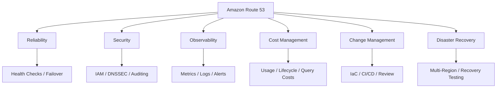
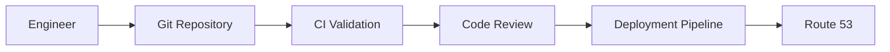

# README

## Overview

This folder contains production-oriented guidance for operating Amazon Route 53 in real-world backend and cloud environments.

Route 53 is not only a DNS configuration service. In production, it becomes part of the application's availability, deployment, disaster recovery, security, and operational control plane.

The operational concerns covered here include:

- Monitoring and observability.
- DNS query and health-check visibility.
- Cost management.
- Resource lifecycle management.
- Production DNS architecture.
- Change management.
- Reliability and disaster recovery.
- Security and operational controls.
- DNS performance and caching behavior.

The goal is to move from simply configuring DNS records to operating DNS as a reliable production platform component.

---

## Folder Structure

```text
operations/
└── 01- Route 53/
    ├── 01- Monitoring and Observability.md
    ├── 02- Cost Optimization.md
    ├── 03- Production Best Practices.md
    └── README.md
```

---

## Navigation

| File | Focus |
|---|---|
| [01- Monitoring and Observability](./01-%20Monitoring%20and%20Observability.md) | Monitoring Route 53 health, DNS behavior, query activity, changes, and operational signals |
| [02- Cost Optimization](./02-%20Cost%20Optimization.md) | Controlling Route 53 costs across hosted zones, queries, health checks, Resolver, and logging |
| [03- Production Best Practices](./03-%20Production%20Best%20Practices.md) | Production architecture, reliability, security, IaC, change management, DNS failover, and operational standards |

---

## Operational Model

A production Route 53 environment should be operated across several dimensions:



These concerns are interconnected.

For example, a DNS failover configuration may improve availability but also introduce additional health checks, monitoring requirements, and operational complexity. A senior engineer evaluates the complete system rather than optimizing one Route 53 feature in isolation.

---

## Monitoring and Observability

DNS failures can occur even when the application itself is healthy.

Operational monitoring should therefore distinguish between:

```text
DNS Layer
   │
   ├── Resolution
   ├── Health Checks
   ├── Routing
   └── Configuration
          │
          ▼
Application Layer
   │
   ├── HTTP
   ├── gRPC
   ├── Database
   └── Dependencies
```

The monitoring strategy should provide enough information to determine whether a failure originates from:

- Route 53 configuration.
- DNS delegation.
- Recursive resolution.
- DNS caching.
- Health checks.
- Load balancers.
- Application infrastructure.
- Application dependencies.

See [01- Monitoring and Observability](./01-%20Monitoring%20and%20Observability.md) for the detailed operational approach.

---

## Cost Management

Route 53 costs can come from several operational areas rather than only hosted zones.

Depending on the architecture, consider:

- Hosted zones.
- DNS queries.
- Health checks.
- Route 53 Resolver.
- Resolver endpoints.
- Query logging.
- DNS-related monitoring and log retention.

Cost optimization should not mean blindly reducing DNS usage.

For example:

```text
Lower Cost
    │
    ├── Remove unused resources
    ├── Reduce unnecessary queries
    ├── Review logging retention
    └── Remove obsolete infrastructure
```

The objective is to eliminate waste while preserving required availability, security, and observability.

See [02- Cost Optimization](./02-%20Cost%20Optimization.md) for detailed guidance.

---

## Production Best Practices

Production Route 53 design should follow the same engineering principles applied to other critical infrastructure.

Key practices include:

- Manage DNS through Infrastructure as Code.
- Protect production DNS with least-privilege IAM.
- Separate production and non-production environments.
- Define DNS ownership explicitly.
- Use stable DNS names as service contracts.
- Design public and private DNS boundaries deliberately.
- Use appropriate TTLs.
- Test health checks and failover.
- Monitor DNS behavior and configuration changes.
- Audit administrative operations.
- Document DNS delegation and ownership.
- Include DNS in disaster-recovery planning.
- Reconcile emergency manual changes into IaC.
- Remove obsolete DNS resources.

See [03- Production Best Practices](./03-%20Production%20Best%20Practices.md) for the complete production operating model.

---

## Infrastructure as Code

Production DNS should generally be version-controlled.

A typical workflow is:



This provides:

- Change history.
- Peer review.
- Repeatability.
- Automated validation.
- Reduced configuration drift.
- Easier recovery.

Manual Route 53 console changes should be reserved for controlled emergency operations or explicitly justified administrative tasks.

Any emergency change should subsequently be reconciled with the IaC source of truth.

---

## DNS as a Reliability Dependency

Backend engineers often focus on:

```text
Application
Database
Cache
Queue
```

but overlook:

```text
DNS
```

DNS sits before the application request:

```text
Client
  │
  ▼
DNS Resolution
  │
  ▼
Load Balancer / Endpoint
  │
  ▼
Backend Service
  │
  ▼
Database / Cache / Queue
```

A DNS failure can therefore make a perfectly healthy application unreachable.

This makes DNS operational readiness part of overall backend reliability.

---

## Production Change Principles

DNS changes should be treated as potentially high-impact production changes.

Before changing a critical record, verify:

- Correct hosted zone.
- Current record value.
- Record type.
- Routing policy.
- TTL.
- Health-check configuration.
- Target health.
- IaC state.
- Rollback procedure.
- Expected client caching behavior.

After the change:

- Verify authoritative answers.
- Verify recursive resolution.
- Check application traffic.
- Monitor error rates.
- Confirm expected routing.
- Watch for stale or unexpected responses.

For high-risk changes, use staged rollout rather than a single uncontrolled DNS modification.

---

## Security Operations

Route 53 should be treated as a security-sensitive control plane.

A compromised DNS-management role can potentially redirect application traffic.

Production controls should include:

- Least-privilege IAM.
- Separate deployment roles.
- Strong authentication for privileged access.
- CloudTrail auditing.
- Controlled CI/CD access.
- DNSSEC where appropriate.
- Restricted access to DNS query logs.
- Clear hosted-zone ownership.

The important distinction is:

```text
DNS Query Access
        ≠
DNS Configuration Access
```

An application may need to resolve DNS without having permission to modify DNS records.

---

## Disaster Recovery

DNS should be explicitly included in disaster-recovery architecture.

For a multi-region application:

```text
                     Route 53
                         │
              ┌──────────┴──────────┐
              │                     │
         Region A               Region B
         Primary               Secondary
              │                     │
             ALB                   ALB
              │                     │
          Services              Services
```

However, Route 53 failover does not create a functioning secondary environment.

The secondary environment must already have:

- Compute capacity.
- Network connectivity.
- Application configuration.
- Secrets.
- Certificates.
- Data recovery.
- Dependency availability.
- Valid health checks.

DNS failover should be tested as part of disaster-recovery exercises.

---

## Operational Checklist

### Reliability

- [ ] Critical DNS records have defined owners.
- [ ] Health checks are meaningful and monitored.
- [ ] Failover behavior has been tested.
- [ ] DNS is included in disaster-recovery planning.
- [ ] Multi-region routing is used only when required.

### Security

- [ ] DNS modification permissions use least privilege.
- [ ] Production DNS access is restricted.
- [ ] Administrative changes are auditable.
- [ ] DNSSEC requirements have been evaluated.
- [ ] Private DNS is used for internal services where appropriate.

### Observability

- [ ] Health-check status is monitored.
- [ ] Important DNS activity is auditable.
- [ ] Query behavior can be investigated.
- [ ] DNS incidents have troubleshooting procedures.
- [ ] Alerts are actionable.

### Cost

- [ ] Unused hosted zones are removed.
- [ ] Obsolete health checks are removed.
- [ ] Resolver infrastructure is reviewed.
- [ ] DNS query usage is understood.
- [ ] Query-log retention is appropriate.

### Change Management

- [ ] DNS configuration is managed through IaC.
- [ ] Production changes go through review.
- [ ] CI/CD roles are isolated by environment.
- [ ] Emergency changes are documented.
- [ ] Manual changes are reconciled into IaC.

---

## Relationship to Backend Engineering

Route 53 operational knowledge becomes particularly important when building:

- Django applications.
- FastAPI services.
- REST APIs.
- gRPC services.
- Microservice platforms.
- Kubernetes workloads.
- Multi-region systems.
- Blue/green deployments.
- Canary deployments.
- Private service architectures.

For example, a FastAPI service may use:

```text
api.example.com
      │
      ▼
Route 53
      │
      ▼
Application Load Balancer
      │
      ▼
FastAPI
      │
      ├── PostgreSQL
      ├── Redis
      └── Kafka
```

The backend engineer does not need to administer every DNS feature, but should understand how DNS affects:

- Service discovery.
- Availability.
- Failover.
- Deployment.
- Caching.
- Network troubleshooting.
- Security.
- Incident response.

---

## Senior Engineering Perspective

The most important operational question is not:

> "How do I create a Route 53 record?"

It is:

> "How do I operate DNS safely when the system is changing or failing?"

That requires understanding the complete lifecycle:

```text
Design
  │
  ▼
Provision
  │
  ▼
Deploy
  │
  ▼
Monitor
  │
  ▼
Change
  │
  ▼
Fail
  │
  ▼
Recover
  │
  ▼
Retire
```

A senior backend engineer should be able to reason about DNS across this entire lifecycle.

---

## Key Takeaways

- Route 53 is a production reliability dependency, not merely a DNS configuration service.
- DNS should have explicit ownership, security boundaries, monitoring, and change-management processes.
- Production DNS should generally be managed through Infrastructure as Code.
- Monitor both DNS behavior and DNS configuration changes.
- Treat production DNS permissions as a high-value security boundary.
- Use appropriate TTLs rather than universally choosing very low or very high values.
- Test health checks and failover instead of trusting configuration alone.
- Include DNS in disaster-recovery architecture and exercises.
- Remove unused hosted zones, health checks, Resolver infrastructure, and obsolete records.
- Reconcile emergency manual changes back into IaC.
- Optimize cost by removing waste rather than weakening reliability or observability.
- Stable DNS names should act as infrastructure-independent service contracts.
- Public and private DNS should be separated according to security and networking requirements.
- DNS operational maturity is measured by how safely the organization can monitor, change, troubleshoot, fail over, and recover its DNS infrastructure.