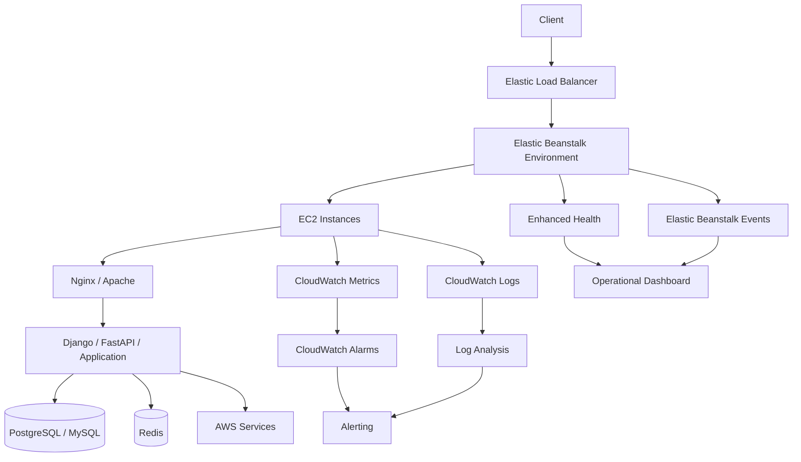

# 01- Monitoring and Observability

## Overview

Monitoring and observability in AWS Elastic Beanstalk provide the operational visibility required to understand application health, detect failures, diagnose incidents, and validate production changes.

Elastic Beanstalk environments expose health information and integrate with Amazon CloudWatch for metrics and logs. Enhanced health reporting provides deeper instance and environment health information, while CloudWatch Logs can centralize instance and environment-health logs for analysis and retention. :contentReference[oaicite:0]{index=0}

A production monitoring strategy should answer four questions:

| Question | What to observe |
|---|---|
| Is the service available? | Environment health, target health, HTTP status |
| Is it performing well? | Latency, throughput, CPU, memory, request volume |
| Is it failing? | 4xx/5xx responses, application errors, failed health checks |
| Why is it failing? | Application logs, platform logs, deployment events, health events |

The important distinction is:

```text
Monitoring
    ↓
"What is happening?"

Observability
    ↓
"Why is it happening?"
```

Monitoring detects known failure conditions. Observability combines metrics, logs, health information, events, and application context to investigate unknown failure modes.

## Observability Architecture

A typical Elastic Beanstalk web application can be observed across multiple layers:



The objective is not to collect every possible signal. The objective is to collect the signals necessary to detect, diagnose, and recover from production failures.

## Elastic Beanstalk Health Reporting

Elastic Beanstalk provides basic and enhanced health reporting.

Enhanced health analyzes available information for individual instances and the overall environment and provides more detailed health status and causes. :contentReference[oaicite:1]{index=1}

### Basic Health

Basic health provides a high-level environment status and relies primarily on infrastructure and load balancer health information.

Typical states include:

| Status | Meaning |
|---|---|
| Green | Environment is operating normally |
| Yellow | Some health checks or requests are failing |
| Red | Significant or persistent health problems |
| Grey | Environment is being updated or health information is unavailable |

Basic health metrics are useful for high-level availability but are insufficient for detailed application diagnosis. :contentReference[oaicite:2]{index=2}

### Enhanced Health

Enhanced health provides more detailed information about:

- Individual instance health
- Environment health
- Request behavior
- HTTP status codes
- Latency
- Causes of health degradation
- Deployment-related health changes

Every health check can contribute to an instance's health assessment, and failures at lower levels can cause the instance health status to be downgraded. :contentReference[oaicite:3]{index=3}

For production environments, enhanced health should generally be preferred when supported by the selected platform version.

## Enable Enhanced Health

The EB CLI can be used to inspect or configure environment settings.

```bash
eb config
```

The configuration should use enhanced health reporting where supported.

For newly created environments using current platform versions, enhanced health is enabled by default in common Elastic Beanstalk workflows, although the exact behavior depends on platform/version and configuration. :contentReference[oaicite:4]{index=4}

## What to Monitor

A production Elastic Beanstalk environment should monitor several dimensions rather than relying on a single health indicator.

### Availability

Track:

- Environment health
- Instance health
- Load balancer target health
- HTTP 5xx responses
- Failed health checks
- Deployment health

Availability tells you whether users can successfully reach the service.

### Traffic

Track:

- Request count
- Request rate
- Concurrent traffic where available
- HTTP response distribution

Traffic is essential for interpreting other metrics.

For example:

```text
CPU = 80%
```

is not necessarily a problem.

But:

```text
CPU = 80%
Request rate ↑
Latency ↑
5xx ↑
```

indicates likely capacity pressure.

### Latency

Track request latency using percentiles where possible:

```text
p50
p90
p95
p99
```

Average latency can hide tail latency.

For example:

```text
Average = 150 ms
p99     = 4.8 s
```

The service may appear healthy from the average while a significant subset of users experiences severe latency.

### Errors

Monitor:

- HTTP 4xx
- HTTP 5xx
- Application exceptions
- Database errors
- Timeout errors
- Dependency failures
- Startup failures

A particularly useful signal is the ratio of errors to total requests:

```text
Error Rate = Failed Requests / Total Requests
```

This is generally more meaningful than monitoring absolute error counts alone.

## Core CloudWatch Metrics

Elastic Beanstalk environments expose metrics from the underlying resources and can integrate these metrics with CloudWatch monitoring. Basic health monitoring commonly includes operating-system and request-related metrics at five-minute intervals, while enhanced monitoring provides deeper visibility. :contentReference[oaicite:5]{index=5}

Useful operational metrics include:

| Category | Examples |
|---|---|
| Requests | RequestCount |
| Latency | Latency / target response time |
| Errors | HTTPCode_ELB_5XX, HTTPCode_Target_5XX |
| CPU | CPUUtilization |
| Capacity | Instance count |
| Network | NetworkIn, NetworkOut |
| Storage | Disk utilization where available |
| Scaling | Desired, minimum, maximum instance counts |
| Health | Environment and instance health |

Metric names and dimensions vary by AWS resource and environment architecture, so dashboards should be built from the actual resources used by the environment.

## CPU Monitoring

High CPU can indicate:

- CPU-intensive application code
- Too few worker processes
- Excessive traffic
- Expensive serialization
- Inefficient database processing
- Background work running inside web processes
- Insufficient instance size

A useful diagnostic pattern is:

```text
CPU ↑
  ↓
Request latency ↑
  ↓
Health-check latency ↑
  ↓
Instances become unhealthy
  ↓
5xx responses ↑
```

Do not automatically scale based only on CPU.

A Django application may have low CPU but still be constrained by:

- Database connections
- Network latency
- External APIs
- Worker saturation
- Memory
- Connection pools

## Memory Monitoring

Memory pressure can be particularly important for Python applications.

Potential symptoms include:

- Increasing latency
- Worker restarts
- Process termination
- Out-of-memory conditions
- Reduced application capacity
- Unstable health checks

A typical failure pattern is:

```text
Memory usage ↑
      ↓
Available memory ↓
      ↓
Worker instability
      ↓
Requests fail
      ↓
Health checks fail
      ↓
Instance becomes unhealthy
```

Memory monitoring should therefore be correlated with process-level logs and instance health.

## Load Balancer Monitoring

For load-balanced environments, distinguish between:

```text
Load Balancer Failure
```

and:

```text
Target/Application Failure
```

For example:

```text
Client
  ↓
Load Balancer
  ↓
Target
  ↓
Application
```

If the target is unhealthy, the load balancer may return `502` or `503` even though the load balancer itself is functioning correctly.

Monitor:

- Request count
- HTTP 4xx
- HTTP 5xx
- Target response time
- Healthy target count
- Unhealthy target count

## Health Checks

Health checks are an operational contract between the infrastructure and application.

A health endpoint should be:

- Fast
- Deterministic
- Lightweight
- Authenticated appropriately for the architecture
- Free from unnecessary downstream dependencies

A basic endpoint might be:

```http
GET /health
```

Response:

```http
HTTP/1.1 200 OK
Content-Type: application/json

{
  "status": "ok"
}
```

Avoid putting expensive application logic into the health endpoint.

Bad:

```text
/health
  ↓
Database query
  ↓
Redis query
  ↓
Third-party API
  ↓
Complex business logic
```

A failure in any dependency can make every application instance appear unhealthy.

## Liveness vs Readiness

Although Elastic Beanstalk does not expose Kubernetes-style readiness/liveness semantics in exactly the same model, the distinction is useful when designing application health endpoints.

### Liveness

Answers:

> Is the application process functioning?

Example:

```text
GET /health/live
```

### Readiness

Answers:

> Is the application capable of serving normal traffic?

Example:

```text
GET /health/ready
```

For Elastic Beanstalk, keep the configured load balancer health check aligned with the application's actual availability requirements.

Do not make a health check unnecessarily strict.

## Application Logs

Logs provide the detailed context that metrics cannot provide.

Typical application logs should contain:

- Timestamp
- Log level
- Request identifier
- Service/environment
- HTTP method
- Endpoint
- Status code
- Duration
- Exception information
- Relevant business context

Example:

```text
2026-08-13T10:21:04Z ERROR request_id=8f31c
POST /api/orders status=500 duration_ms=842
error=psycopg2.OperationalError
```

Avoid logging:

- Passwords
- API keys
- Access tokens
- Session cookies
- Database credentials
- Sensitive personal data

## Elastic Beanstalk Instance Logs

Elastic Beanstalk instances generate logs from the application server, proxy, platform scripts, and other components. Logs can be retrieved from instances and can also be streamed to CloudWatch Logs. :contentReference[oaicite:6]{index=6}

Common Linux-side logs include:

```text
/var/log/eb-engine.log
/var/log/nginx/access.log
/var/log/nginx/error.log
```

Exact locations depend on the platform and runtime.

For Python platforms, AWS documentation also identifies platform-specific logs such as:

```text
/var/log/eb-activity.log
/var/log/httpd/error_log
/var/log/httpd/access_log
```

The exact paths should always be verified against the active Elastic Beanstalk platform rather than assumed. :contentReference[oaicite:7]{index=7}

## CloudWatch Logs

CloudWatch Logs provides centralized log storage and analysis.

Elastic Beanstalk can stream instance logs to CloudWatch Logs, where log groups can have configurable retention and lifecycle behavior. :contentReference[oaicite:8]{index=8}

A production architecture should prefer centralized logs:

```text
EC2 Instance 1 ─┐
EC2 Instance 2 ─┼──> CloudWatch Logs
EC2 Instance 3 ─┘          ↓
                       Search / Filter
                            ↓
                        Metric Filters
                            ↓
                       CloudWatch Alarm
```

This is especially important in Auto Scaling environments because an instance may be terminated before an engineer can manually inspect its local filesystem.

## Enable CloudWatch Log Streaming

Using the EB CLI:

```bash
eb logs --cloudwatch-logs enable
```

The current EB CLI also supports selecting instance logs, environment-health logs, or both. :contentReference[oaicite:9]{index=9}

A configuration file can enable instance log streaming:

```yaml
option_settings:
  aws:elasticbeanstalk:cloudwatch:logs:
    StreamLogs: true
```

Retention should be explicitly selected according to operational and compliance requirements.

For example:

```yaml
option_settings:
  aws:elasticbeanstalk:cloudwatch:logs:
    StreamLogs: true
    DeleteOnTerminate: false
    RetentionInDays: 180
```

Elastic Beanstalk supports configuring retention and whether logs survive environment termination. :contentReference[oaicite:10]{index=10}

## Environment Health Logs

When enhanced health is enabled, Elastic Beanstalk can stream environment health information to CloudWatch Logs.

Health events can record:

- Health status changes
- Causes of health changes
- Environment health information
- Instance-related health events

This provides a valuable bridge between:

```text
Metric
```

and:

```text
Detailed application log
```

AWS documents environment-health streaming under the `aws:elasticbeanstalk:cloudwatch:logs:health` namespace. :contentReference[oaicite:11]{index=11}

## Structured Logging

For production Python applications, prefer structured logs over unstructured strings.

Example:

```json
{
  "timestamp": "2026-08-13T10:21:04Z",
  "level": "ERROR",
  "service": "orders-api",
  "environment": "production",
  "request_id": "8f31c",
  "method": "POST",
  "path": "/api/orders",
  "status": 500,
  "duration_ms": 842,
  "error_type": "DatabaseError"
}
```

Structured logs make it easier to:

- Search
- Filter
- Aggregate
- Create metric filters
- Correlate incidents
- Build dashboards

## Request Correlation

Distributed backend systems require request correlation.

A request may travel through:

```text
Client
  ↓
Load Balancer
  ↓
Nginx
  ↓
Django / FastAPI
  ↓
Redis
  ↓
PostgreSQL
  ↓
Kafka / External API
```

A request ID allows logs from different components to be associated.

Example:

```text
request_id=abc123
```

should appear consistently across relevant application logs.

For microservices, propagate the correlation context across service boundaries rather than generating unrelated IDs at every hop.

## Application-Level Metrics

Infrastructure metrics are necessary but insufficient.

For a Django or FastAPI API, consider application metrics such as:

```text
requests_total
request_duration_seconds
errors_total
database_query_duration
external_api_duration
queue_depth
business_operation_failures
```

Useful business-oriented metrics can include:

```text
orders_created_total
payments_failed_total
messages_processed_total
```

These metrics help distinguish infrastructure health from business health.

An environment can be:

```text
Green
```

while a critical business workflow is failing.

## CloudWatch Alarms

CloudWatch alarms convert observed conditions into operational actions.

Examples:

```text
5xx rate > threshold
        ↓
CloudWatch Alarm
        ↓
SNS / Alerting
        ↓
Engineer
```

Useful alarm categories include:

| Alarm | Purpose |
|---|---|
| High 5xx rate | Detect user-facing failures |
| High latency | Detect performance degradation |
| Unhealthy targets | Detect application availability problems |
| High CPU | Detect compute saturation |
| High memory | Detect process/resource pressure |
| Low healthy instances | Detect capacity risk |
| Deployment failure | Detect release problems |

Avoid creating alarms for every metric.

Too many alarms produce alert fatigue.

## Alert Design

A good alert should answer:

1. What failed?
2. How severe is it?
3. Who owns it?
4. What should be investigated first?
5. Is user impact occurring?

Bad alert:

```text
CPUUtilization > 70%
```

Better:

```text
Production API:
5xx rate > 5% for 5 minutes
AND
healthy target count < expected capacity
```

The exact thresholds should be based on observed application behavior rather than arbitrary defaults.

## SLO-Oriented Monitoring

For mature systems, monitoring should move from infrastructure-centric metrics toward service-level objectives.

Example:

```text
Availability SLO:
99.9% successful requests

Latency SLO:
99% of API requests < 500 ms
```

Then derive operational indicators:

```text
SLI
 ↓
SLO
 ↓
Error Budget
 ↓
Alerting / Engineering Action
```

This prevents teams from optimizing infrastructure metrics that have little relationship to user experience.

## Dashboard Design

A production Elastic Beanstalk dashboard should provide an operational overview without requiring engineers to inspect dozens of graphs.

A useful dashboard layout is:

```text
┌─────────────────────────────────────────────┐
│ Environment Health                          │
├─────────────────────────────────────────────┤
│ Request Rate │ Error Rate │ p95 │ p99       │
├─────────────────────────────────────────────┤
│ Healthy Targets │ Instance Count            │
├─────────────────────────────────────────────┤
│ CPU │ Memory │ Network │ Scaling Activity   │
├─────────────────────────────────────────────┤
│ Deployment / Health Events                  │
├─────────────────────────────────────────────┤
│ Application Error Trends                    │
└─────────────────────────────────────────────┘
```

The dashboard should make it possible to determine whether an incident is primarily:

- Availability-related
- Performance-related
- Capacity-related
- Deployment-related
- Dependency-related

## Deployment Observability

Every deployment should be observable.

Monitor:

```text
Deployment Started
      ↓
Instances Updated
      ↓
Application Started
      ↓
Health Checks
      ↓
Traffic
      ↓
Error Rate
      ↓
Latency
```

A deployment should not be considered successful merely because the deployment command returned successfully.

Validate:

- Environment health
- Instance health
- Error rate
- Latency
- Application logs
- Critical endpoints
- Dependency connectivity

## Deployment Correlation

When an incident starts immediately after a deployment:

```text
Deployment timestamp
        ↓
Metric degradation
        ↓
Error increase
        ↓
Health degradation
```

This temporal correlation is valuable, but it is not proof of causation.

Confirm the relationship using:

- Application logs
- Deployment diff
- Configuration diff
- Health events
- Rollback testing where appropriate

## Auto Scaling Observability

Auto Scaling should be monitored as a system rather than only as an instance-count mechanism.

Observe:

```text
Request Load
     ↓
Resource Utilization
     ↓
Scaling Policy
     ↓
Desired Capacity
     ↓
Running Instances
     ↓
Healthy Capacity
```

A dangerous condition is:

```text
Traffic ↑
   ↓
CPU ↑
   ↓
Scaling triggered
   ↓
New instances fail startup
   ↓
Healthy capacity does not increase
   ↓
Existing instances saturate
```

This is why instance count alone is not a sufficient scaling metric.

## Dependency Monitoring

An application can appear healthy while a dependency is failing.

Monitor important dependencies such as:

- PostgreSQL
- MySQL
- Redis
- SQS
- Kafka
- External REST APIs
- AWS APIs

For example:

```text
API latency ↑
      ↓
Database latency ↑
      ↓
Connection pool saturation
      ↓
Application requests queue
      ↓
5xx / timeout errors
```

Application observability should therefore capture dependency latency and failure rates where practical.

## Cost Considerations

Observability itself has a cost.

Major cost drivers include:

- CloudWatch Logs ingestion
- CloudWatch Logs storage
- Metric volume
- Custom metrics
- High-cardinality dimensions
- Long retention periods
- Excessive log verbosity

Avoid:

```text
DEBUG logging
+ huge request bodies
+ unlimited retention
+ high-cardinality custom metrics
```

in production unless there is a deliberate operational reason.

Use:

- Appropriate log levels
- Retention policies
- Log filtering
- Sampling where appropriate
- Aggregated metrics
- Structured events

## Security Considerations

Observability systems frequently contain sensitive information.

Never assume logs are safe merely because they are internal.

Do not log:

```text
Authorization: Bearer <token>
DATABASE_PASSWORD=<secret>
AWS_SECRET_ACCESS_KEY=<secret>
credit_card_number=<value>
```

Use redaction:

```text
Authorization: Bearer [REDACTED]
DATABASE_PASSWORD=[REDACTED]
```

Apply least-privilege IAM permissions to CloudWatch Logs and metrics.

Separate operational access from application deployment permissions where practical.

## High Availability Considerations

Monitoring should remain useful during failures.

Avoid relying exclusively on:

```text
Local EC2 logs
```

because the instance may disappear.

Prefer:

```text
EC2
 ↓
CloudWatch Logs
```

for important operational logs.

For multi-instance environments, always assume:

```text
Instance A may terminate
Instance B may become unhealthy
Instance C may replace Instance A
```

Centralized telemetry ensures the incident history remains available.

## Disaster Recovery Considerations

Observability data can be important during disaster recovery.

Consider:

- Log retention
- Environment termination behavior
- CloudWatch log group retention
- Critical alarm configuration
- Dashboard persistence
- Infrastructure-as-code definitions
- Cross-environment visibility

Production observability configuration should ideally be reproducible rather than manually configured only through the console.

## Common Mistakes

### Monitoring Only CPU

CPU does not tell you whether users can successfully use the service.

**Better:** correlate CPU with request rate, latency, errors, memory, and health.

### Treating Green as Perfect

A green environment does not guarantee that every business workflow is functioning.

**Better:** combine infrastructure health with application and business metrics.

### Logging Only to Local Disk

Instances can be replaced or terminated.

**Better:** stream important logs to CloudWatch Logs.

### Logging Secrets

Verbose troubleshooting often leads engineers to print configuration values.

**Better:** redact secrets and log configuration metadata rather than values.

### Creating Too Many Alerts

An alarm for every metric creates alert fatigue.

**Better:** alert on conditions that require human action.

### Using Average Latency

Average latency hides tail behavior.

**Better:** monitor p95/p99 latency for user-facing APIs.

### Ignoring Deployment Correlation

Performance degradation immediately after deployment can be missed if deployment events are not correlated with metrics.

**Better:** annotate or correlate deployment activity with operational telemetry.

### Making Health Checks Too Expensive

A health check that calls every dependency can cause cascading failures.

**Better:** keep health checks lightweight and intentionally designed.

## Production Monitoring Checklist

```text
[ ] Enhanced health reporting enabled where supported
[ ] Environment health monitored
[ ] Instance health monitored
[ ] Load balancer target health monitored
[ ] HTTP 4xx/5xx monitored
[ ] Request latency monitored
[ ] p95/p99 latency monitored
[ ] CPU monitored
[ ] Memory monitored
[ ] Auto Scaling activity monitored
[ ] Application logs centralized
[ ] Platform logs centralized
[ ] Health events available
[ ] Log retention configured
[ ] Critical CloudWatch alarms configured
[ ] Alert routing configured
[ ] Application exceptions tracked
[ ] Request correlation IDs available
[ ] Dependency failures monitored
[ ] Sensitive data excluded from logs
[ ] Dashboards are reproducible
[ ] Deployment health is validated
[ ] Observability configuration is version-controlled
```

## Useful CLI Commands

Check environment status:

```bash
eb status
```

Inspect environment events:

```bash
eb events
```

Retrieve environment logs:

```bash
eb logs
```

Retrieve complete logs:

```bash
eb logs --all
```

Stream logs:

```bash
eb logs --stream
```

Enable instance log streaming:

```bash
eb logs --cloudwatch-logs enable
```

The EB CLI supports retrieving instance logs, CloudWatch Logs sources, and environment health logs depending on the command options and environment configuration. :contentReference[oaicite:12]{index=12}

Using AWS CLI:

```bash
aws elasticbeanstalk describe-environments \
  --environment-names <environment-name>
```

```bash
aws elasticbeanstalk describe-environment-health \
  --environment-name <environment-name> \
  --attribute-names All
```

```bash
aws elasticbeanstalk describe-events \
  --environment-name <environment-name>
```

## Production Example

Consider a Django API deployed to Elastic Beanstalk.

The environment reports:

```text
Health: Green
CPU: 45%
Instances: 3
```

However, users report that order creation is slow.

Application metrics show:

```text
GET /products
p95 = 180 ms

POST /orders
p95 = 3.2 s
```

Application logs show:

```text
POST /orders
database_query_duration=2840ms
```

The correct investigation is not:

```text
"Increase EC2 instance size."
```

Instead:

```text
API latency
    ↓
Endpoint-specific latency
    ↓
Database query duration
    ↓
Slow query
    ↓
Database investigation
```

The Elastic Beanstalk environment can remain healthy while a single application workflow is severely degraded.

This demonstrates why infrastructure monitoring and application observability must work together.

## Key Takeaways

- Monitoring answers **what is happening**; observability helps determine **why it is happening**.
- Use enhanced health reporting for deeper Elastic Beanstalk environment and instance visibility where supported.
- Monitor availability, traffic, latency, errors, capacity, dependencies, and deployment health together.
- Do not treat environment health as a complete representation of application health.
- Centralize important logs in CloudWatch Logs because individual Elastic Beanstalk instances are replaceable.
- Use structured application logs and request correlation IDs for production debugging.
- Monitor p95/p99 latency instead of relying only on averages.
- Health checks should be fast, deterministic, and intentionally scoped.
- Avoid making health checks dependent on every downstream service unless that behavior is explicitly required.
- Correlate deployments with health, latency, errors, and logs.
- Auto Scaling must be observed as a complete control loop: traffic → utilization → scaling → healthy capacity.
- Monitor critical dependencies such as PostgreSQL, Redis, Kafka, SQS, and external APIs.
- Alert on actionable conditions rather than every metric anomaly.
- Protect logs and metrics from leaking credentials, tokens, and sensitive application data.
- Control CloudWatch Logs retention, metric cardinality, and logging volume to manage observability cost.
- Treat dashboards, alarms, log configuration, and monitoring policy as production infrastructure and preferably manage them through version-controlled configuration.
- The strongest production observability strategy connects **user experience, application behavior, infrastructure health, dependencies, and deployments** into one operational view.