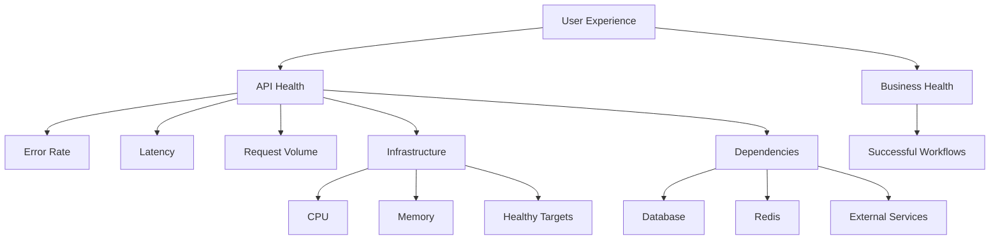

# 02- Health Monitoring

## Overview

AWS Elastic Beanstalk health monitoring provides visibility into whether an environment, its instances, and the application traffic flowing through them are operating normally.

Health monitoring is different from general infrastructure monitoring. It combines infrastructure state, load balancer behavior, application responses, and request-level signals to determine whether the environment can successfully serve traffic.

For production systems, health should be evaluated across multiple layers:

```text
                    ┌──────────────────────┐
                    │      End Users       │
                    └──────────┬───────────┘
                               │
                               ▼
                    ┌──────────────────────┐
                    │  Load Balancer       │
                    │  Availability        │
                    └──────────┬───────────┘
                               │
                               ▼
                    ┌──────────────────────┐
                    │ Elastic Beanstalk    │
                    │ Environment Health   │
                    └──────────┬───────────┘
                               │
                    ┌──────────┴──────────┐
                    ▼                     ▼
             ┌──────────────┐      ┌──────────────┐
             │ EC2 Instance │      │ EC2 Instance │
             │ Health       │      │ Health       │
             └──────┬───────┘      └──────┬───────┘
                    │                     │
                    └──────────┬──────────┘
                               ▼
                    ┌──────────────────────┐
                    │ Application Health   │
                    │ Logs / Metrics       │
                    └──────────────────────┘
```

A production engineer should not interpret a single `Green` status as proof that the application is completely healthy. Health status must be correlated with request failures, latency, resource utilization, dependency health, and application-level behavior.

## Elastic Beanstalk Health Model

Elastic Beanstalk provides environment-level health information and, when enhanced health is enabled, more detailed information about individual instances and request behavior.

The health model can be viewed as several layers:

| Layer | Primary question |
|---|---|
| Environment | Is the environment operating normally? |
| Instance | Can individual instances serve traffic? |
| Load balancer | Are targets reachable and responding correctly? |
| Application | Is the application returning successful responses? |
| Dependency | Can the application communicate with required services? |

This layered model is important because a failure at one layer can cause symptoms at another.

For example:

```text
PostgreSQL unavailable
        ↓
Django request blocks
        ↓
Request latency increases
        ↓
Health check times out
        ↓
Instance becomes unhealthy
        ↓
Load balancer removes target
        ↓
Environment health degrades
```

The final visible symptom may be an unhealthy Elastic Beanstalk environment even though the original failure occurred in PostgreSQL.

## Basic Health Reporting

Basic health reporting provides a high-level view of environment health.

Typical health states are:

| Status | Operational interpretation |
|---|---|
| Green | Environment is operating normally |
| Yellow | Environment has degraded health |
| Red | Environment has serious or persistent health problems |
| Grey | Health information is unavailable or the environment is in a transitional state |

Basic health is useful for quick operational checks but does not provide the same depth as enhanced health reporting.

It should therefore be treated as an initial signal rather than a complete diagnostic system.

## Enhanced Health Reporting

Enhanced health provides deeper visibility into the environment and its instances.

It can incorporate information such as:

- Instance health
- Request success and failure
- HTTP status codes
- Request latency
- Health check behavior
- Environment events
- Causes of health degradation

This makes enhanced health significantly more useful for production troubleshooting.

The operational difference is:

```text
Basic Health

"Something is wrong."

Enhanced Health

"Something is wrong with these instances,
and these request/health signals are contributing
to the degraded environment state."
```

For production environments, enhanced health should generally be enabled where supported by the selected Elastic Beanstalk platform.

## Environment Health vs Application Health

These concepts should not be treated as identical.

### Environment Health

Elastic Beanstalk evaluates infrastructure and application-serving signals to determine environment health.

### Application Health

Application health represents whether the actual business application is behaving correctly.

For example:

```text
Elastic Beanstalk:
Green

Application:
POST /payments → 40% failures
```

The environment can remain operational while an important business workflow is broken.

A mature monitoring strategy therefore combines:

```text
Elastic Beanstalk Health
+
CloudWatch Metrics
+
Application Metrics
+
Application Logs
+
Business Metrics
```

## Health Check Endpoint

Elastic Beanstalk environments commonly use a load balancer health check to determine whether an instance is able to receive traffic.

A typical endpoint is:

```http
GET /health
```

Expected response:

```http
HTTP/1.1 200 OK
Content-Type: application/json

{
  "status": "ok"
}
```

The endpoint should be:

- Fast
- Deterministic
- Lightweight
- Safe to call frequently
- Independent of expensive business operations

A simple Django implementation could be:

```python
from django.http import JsonResponse


def health_check(request):
    return JsonResponse({"status": "ok"})
```

For FastAPI:

```python
from fastapi import FastAPI

app = FastAPI()


@app.get("/health")
def health_check() -> dict[str, str]:
    return {"status": "ok"}
```

The endpoint should not perform unnecessary work.

## Designing a Good Health Check

A common mistake is to make the health check call every dependency:

```text
/health
   │
   ├── PostgreSQL
   ├── Redis
   ├── Kafka
   ├── External API
   └── S3
```

This creates a dangerous failure mode.

If Redis becomes temporarily unavailable, every instance may report itself unhealthy even though the application can still serve most requests.

The result can become:

```text
Dependency failure
      ↓
Health check failure
      ↓
Instance marked unhealthy
      ↓
Traffic removed
      ↓
Less available capacity
      ↓
Remaining instances overloaded
      ↓
Cascading failure
```

A lightweight liveness-style health endpoint is usually safer.

If dependency validation is required, keep it separate from the primary load balancer health check.

## Liveness and Readiness

Although Elastic Beanstalk does not implement Kubernetes readiness and liveness probes in exactly the same way, these concepts are useful when designing application health checks.

### Liveness

Liveness answers:

> Is the application process running and capable of responding?

Example:

```text
GET /health/live
```

It should generally perform minimal work.

### Readiness

Readiness answers:

> Is the application ready to receive normal traffic?

Example:

```text
GET /health/ready
```

Readiness may perform limited dependency validation when required by the architecture.

The distinction is useful because:

```text
Process alive
≠
Application fully operational
```

## Health Check Configuration

For a load-balanced Elastic Beanstalk environment, the health check configuration should point to a stable application endpoint.

Example configuration:

```yaml
option_settings:
  aws:elasticbeanstalk:environment:process:default:
    HealthCheckPath: /health
```

The exact configuration namespace and supported options depend on the Elastic Beanstalk platform and environment configuration.

The health check path should be:

```text
Stable
Predictable
Fast
Unauthenticated or appropriately exempted
```

Do not point the health check at an endpoint that:

- Requires user authentication
- Performs expensive database queries
- Triggers background jobs
- Depends on third-party services
- Has unpredictable response times

## HTTP Status Codes and Health

Health monitoring must account for HTTP response behavior.

Typical interpretation:

| Response | Typical interpretation |
|---|---|
| `200` | Healthy response |
| `3xx` | Redirect; usually undesirable for a health endpoint |
| `4xx` | Application rejected the request |
| `5xx` | Application/server failure |
| Timeout | Application or network path failed to respond |

For a dedicated health endpoint, `200 OK` should normally represent successful health validation.

Avoid returning:

```http
302 Found
```

because redirects introduce unnecessary behavior into infrastructure health checks.

## Instance Health

Elastic Beanstalk environments may contain multiple EC2 instances.

Instance health matters because the environment can contain a mixture of healthy and unhealthy instances:

```text
Environment
│
├── Instance A → Healthy
├── Instance B → Healthy
├── Instance C → Unhealthy
└── Instance D → Healthy
```

A production engineer should determine:

- Which instance is unhealthy?
- Is the problem isolated?
- Did the problem begin after deployment?
- Are new instances failing?
- Are existing instances degrading?
- Is Auto Scaling replacing instances?
- Is the problem application-specific or infrastructure-specific?

## Unhealthy Instance Patterns

Common patterns include:

### Single Instance Unhealthy

```text
A → Healthy
B → Healthy
C → Unhealthy
D → Healthy
```

Possible causes:

- Instance-specific resource pressure
- Corrupted local state
- Application process failure
- Network configuration issue
- Disk problems
- Transient platform issue

### All Instances Unhealthy

```text
A → Unhealthy
B → Unhealthy
C → Unhealthy
D → Unhealthy
```

Prioritize shared dependencies and configuration:

- Deployment failure
- Incorrect environment variables
- Security groups
- Network configuration
- Database connectivity
- Application startup failure
- Health check configuration
- Platform/runtime failure

### New Instances Unhealthy

```text
Existing instances → Healthy
New instances      → Unhealthy
```

This is particularly important during Auto Scaling or deployment.

Investigate:

- Application startup
- Dependencies
- Environment variables
- IAM permissions
- Platform hooks
- Package installation
- Health check path
- Security group rules

## Load Balancer Health

For a load-balanced Elastic Beanstalk environment, the load balancer determines whether targets are healthy enough to receive traffic.

The request path is approximately:

```text
Client
  ↓
Load Balancer
  ↓
Target Health Check
  ↓
EC2 Instance
  ↓
Web Server
  ↓
Application
```

A target can be unhealthy because:

- The application is not listening
- The health endpoint returns an error
- The process is overloaded
- The security group blocks traffic
- The application startup failed
- The response exceeds the health check timeout

## 502 and 503 Relationship

Health monitoring is closely related to `502` and `503` responses.

A simplified failure path is:

```text
Load Balancer
     ↓
No healthy target
     ↓
503 Service Unavailable
```

Another common path is:

```text
Load Balancer
     ↓
Target connection failure
     ↓
502 Bad Gateway
```

The exact HTTP behavior depends on the load balancer, target state, and failure condition.

Therefore, when investigating `502` or `503` errors, inspect target health rather than looking only at application logs.

## Health Status During Deployment

Health monitoring becomes especially important during deployments.

A deployment may appear successful at the infrastructure level while the application is unhealthy after the update.

Typical sequence:

```text
Deployment starts
      ↓
New application version deployed
      ↓
Application process starts
      ↓
Health checks execute
      ↓
Instances become healthy
      ↓
Traffic continues
```

A failed sequence might be:

```text
Deployment starts
      ↓
Application starts incorrectly
      ↓
Health checks fail
      ↓
Instances become unhealthy
      ↓
Environment health degrades
```

Always correlate deployment events with health changes.

## Health During Auto Scaling

Auto Scaling introduces another dimension to health monitoring.

Consider:

```text
Traffic increases
      ↓
CPU / request load increases
      ↓
Scaling policy triggers
      ↓
New EC2 instances launch
      ↓
Application starts
      ↓
Health checks execute
      ↓
Healthy instances join traffic
```

A failure in the startup phase can create:

```text
Traffic increases
      ↓
Scaling triggered
      ↓
New instances launch
      ↓
Startup fails
      ↓
New instances never become healthy
      ↓
Existing instances remain overloaded
```

This is why monitoring instance count alone is insufficient.

Monitor both:

```text
Desired Capacity
+
Running Capacity
+
Healthy Capacity
```

## CloudWatch Metrics

CloudWatch should be used alongside Elastic Beanstalk health information.

Important metric categories include:

| Category | Example signals |
|---|---|
| Requests | Request count |
| Errors | HTTP 4xx / 5xx |
| Latency | Target/request latency |
| Compute | CPU utilization |
| Capacity | Instance count |
| Network | Network traffic |
| Health | Healthy/unhealthy targets |
| Scaling | Desired and actual capacity |

Metrics should be interpreted together.

For example:

```text
CPU ↑
+
Request rate ↑
+
Latency ↑
+
5xx ↑
```

is much stronger evidence of capacity pressure than:

```text
CPU ↑
```

alone.

## Latency Monitoring

Health is not only about whether requests succeed.

A service returning:

```text
HTTP 200
```

after:

```text
10 seconds
```

may technically be available but operationally unhealthy.

Monitor latency percentiles:

```text
p50
p90
p95
p99
```

Example:

| Metric | Value |
|---|---:|
| p50 | 120 ms |
| p95 | 480 ms |
| p99 | 2.8 s |

The p99 value indicates a significant tail-latency problem that average latency could hide.

## Error Rate Monitoring

Monitor error ratios rather than relying only on raw counts.

```text
Error Rate =
Failed Requests / Total Requests
```

Example:

```text
Total requests = 100,000
5xx responses  = 2,000

Error rate = 2%
```

A 2% error rate during low traffic and high traffic may represent very different absolute user impact, so both the rate and request volume should be considered.

## Application Health vs Dependency Health

An application can be healthy while one dependency is degraded.

For example:

```text
Django
  ↓
PostgreSQL
```

If PostgreSQL latency increases:

```text
Database latency ↑
      ↓
Django request duration ↑
      ↓
Connection pool saturation
      ↓
Request timeout
      ↓
Health check may fail
```

When an environment becomes unhealthy, investigate shared dependencies before assuming the EC2 instances themselves are defective.

Important dependencies include:

- PostgreSQL
- MySQL
- Redis
- Kafka
- SQS
- External REST APIs
- AWS APIs

## Environment Events

Elastic Beanstalk events provide important operational context.

Events can help identify:

- Deployments
- Instance launches
- Instance termination
- Configuration changes
- Health changes
- Platform activity
- Scaling events

Use:

```bash
eb events
```

For more detailed environment information:

```bash
aws elasticbeanstalk describe-events \
  --environment-name <environment-name>
```

When troubleshooting, compare the event timeline with metric changes.

For example:

```text
10:00 Deployment started
10:02 New instances launched
10:03 Health changed to Yellow
10:04 5xx increased
10:05 Health changed to Red
```

This timeline provides a strong starting point for root cause analysis.

## CLI Health Inspection

Check the current environment:

```bash
eb status
```

Check environment health:

```bash
aws elasticbeanstalk describe-environment-health \
  --environment-name <environment-name> \
  --attribute-names All
```

Inspect environment events:

```bash
aws elasticbeanstalk describe-events \
  --environment-name <environment-name>
```

Retrieve application logs:

```bash
eb logs
```

Retrieve logs from all instances:

```bash
eb logs --all
```

These commands are useful during incidents because they allow engineers to move from:

```text
Environment status
      ↓
Health details
      ↓
Events
      ↓
Instance/application logs
```

## Health Monitoring During Incidents

When an environment is unhealthy, avoid immediately changing infrastructure.

Use a structured investigation.

### Check Environment Status

```bash
eb status
```

Determine:

- Current health
- Environment state
- Running version
- CNAME
- Platform

### Check Recent Events

```bash
eb events
```

Look for:

- Recent deployment
- Instance replacement
- Configuration update
- Scaling event
- Health transition

### Check Instance Health

```bash
aws elasticbeanstalk describe-environment-health \
  --environment-name <environment-name> \
  --attribute-names All
```

Identify whether the issue affects:

```text
One instance
Several instances
All instances
Only newly launched instances
```

### Check Application Logs

```bash
eb logs --all
```

Look for:

- Startup exceptions
- Worker crashes
- Database connection errors
- Timeout errors
- Import errors
- Configuration errors
- Memory errors

### Check CloudWatch

Correlate:

```text
Error rate
Latency
CPU
Memory
Request volume
Healthy targets
Scaling activity
```

### Check Dependencies

Verify:

```text
Database
Redis
Kafka
SQS
External APIs
AWS services
```

This avoids treating symptoms as root causes.

## Health Check Failure Example

Consider a FastAPI application deployed to Elastic Beanstalk.

Health endpoint:

```python
@app.get("/health")
def health() -> dict[str, str]:
    return {"status": "ok"}
```

The application is deployed successfully, but the environment becomes Yellow.

Investigation:

```text
1. eb status
      ↓
2. Environment health degraded
      ↓
3. describe-environment-health
      ↓
4. New instances unhealthy
      ↓
5. eb logs --all
      ↓
6. Startup exception found
      ↓
7. Missing environment variable
```

The correct fix is not:

```text
Increase instance size
```

or:

```text
Increase Auto Scaling capacity
```

The problem is configuration.

## Health Check Failure Due to Database Dependency

Consider this implementation:

```python
@app.get("/health")
def health(db=Depends(get_db)):
    db.execute("SELECT 1")
    return {"status": "ok"}
```

This makes health status dependent on database availability.

That may be intentional in some architectures, but it creates a trade-off.

If PostgreSQL becomes unavailable:

```text
PostgreSQL failure
      ↓
Health endpoint fails
      ↓
Load balancer marks instances unhealthy
      ↓
Traffic removed
      ↓
Available application capacity decreases
```

If the application can serve useful traffic without the database for certain endpoints, this may be too aggressive.

The correct design depends on the application's availability contract.

## Production Health Monitoring Strategy

A practical production strategy can be divided into four layers.

### Infrastructure Health

Monitor:

- EC2 CPU
- Memory
- Network
- Instance count
- Target health
- Auto Scaling activity

### Application Health

Monitor:

- HTTP status codes
- Request latency
- Exceptions
- Worker health
- Process restarts
- Health endpoints

### Dependency Health

Monitor:

- Database latency
- Connection errors
- Redis availability
- Queue depth
- External API failures

### Business Health

Monitor:

- Successful orders
- Payment failures
- User authentication failures
- Message processing failures
- Critical workflow completion

This creates a more complete health model:



## Health Monitoring and High Availability

Health monitoring contributes directly to high availability because unhealthy instances can be identified and removed from traffic.

A multi-instance environment provides:

```text
Load Balancer
     │
 ┌───┼───────────────┐
 ▼   ▼               ▼
EC2  EC2             EC2
 A    B               C
```

If instance B fails:

```text
A → Healthy
B → Unhealthy
C → Healthy
```

Traffic can continue through healthy capacity.

However, this only works if:

- Health checks are correctly configured
- Multiple instances exist
- Auto Scaling can replace failed capacity
- Application startup is reliable
- Dependencies are available
- The load balancer can reach targets

High availability is therefore a system property, not merely an instance-count setting.

## Security Considerations

Health endpoints should expose minimal information.

Avoid:

```json
{
  "status": "ok",
  "database_host": "prod-db.internal",
  "redis_host": "prod-redis.internal",
  "aws_account": "123456789012"
}
```

Prefer:

```json
{
  "status": "ok"
}
```

Detailed diagnostic information should not be publicly exposed unless there is a deliberate security design.

Also ensure that monitoring permissions follow least privilege.

Engineers investigating production health should have access to the required:

- Elastic Beanstalk resources
- CloudWatch metrics
- CloudWatch logs
- Environment events

without automatically receiving unrelated administrative permissions.

## Cost Considerations

Health monitoring generates operational data and therefore has associated costs.

Consider:

- CloudWatch metrics
- Custom metrics
- CloudWatch Logs ingestion
- Log storage
- Log retention
- High-cardinality dimensions
- Excessive application logging

Do not collect large amounts of data without a clear operational purpose.

A useful principle is:

```text
Collect enough telemetry to detect and diagnose failures,
but avoid telemetry that cannot drive an operational decision.
```

## Common Mistakes

### Treating Green as Proof of Application Health

An environment can be Green while an important business operation is failing.

**Avoid it:** monitor application and business-level signals in addition to environment health.

### Using an Expensive Health Endpoint

A health endpoint that performs multiple database queries or external API calls can itself become a source of failure.

**Avoid it:** keep the primary health endpoint lightweight.

### Ignoring Instance-Level Health

Environment-level status can hide the fact that one or more instances are repeatedly failing.

**Avoid it:** inspect individual instance health when diagnosing degradation.

### Ignoring Load Balancer Target Health

A healthy EC2 instance does not necessarily mean that the load balancer can successfully route traffic to it.

**Avoid it:** inspect target health and the complete network path.

### Monitoring Only CPU

Low CPU does not guarantee application availability.

**Avoid it:** combine CPU with latency, errors, request volume, memory, and dependency metrics.

### Using Average Latency

Average latency can hide serious tail latency.

**Avoid it:** monitor p95 and p99 latency.

### Making Health Checks Dependency-Heavy

A dependency outage can cause every application instance to become unhealthy.

**Avoid it:** deliberately separate liveness and dependency readiness semantics.

### Ignoring Deployment Timing

A health degradation immediately following a deployment is a strong investigation signal.

**Avoid it:** always correlate health changes with deployment events and version changes.

### Scaling Before Diagnosing

Adding instances does not fix:

- Broken application code
- Missing environment variables
- Database authentication failures
- Security group problems
- Startup failures

**Avoid it:** identify whether the problem is capacity-related before changing scaling configuration.

## Interview Traps

### Is Green the Same as 100% Healthy?

No.

Environment health is an infrastructure and application-serving signal, not a guarantee that every business workflow is functioning.

### Does Auto Scaling Guarantee High Availability?

No.

Auto Scaling can replace capacity, but high availability also depends on:

- Multiple healthy instances
- Reliable application startup
- Correct health checks
- Load balancing
- Dependency availability
- Network configuration

### Should a Health Endpoint Always Query the Database?

No.

Whether a health endpoint should validate dependencies depends on the application's availability model.

A lightweight liveness check and a deeper readiness/dependency check may be better separated.

### Does a Healthy EC2 Instance Mean the Application Is Healthy?

No.

The process may be running while:

- Requests fail
- Database operations fail
- External dependencies time out
- Important business workflows are broken

### Does a Successful Deployment Mean the Environment Is Healthy?

No.

Deployment completion and application health are separate operational signals.

Always validate health after deployment.

## Production Checklist

```text
[ ] Enhanced health enabled where supported
[ ] Health check endpoint configured
[ ] Health endpoint is lightweight
[ ] Health endpoint returns deterministic status
[ ] Load balancer target health monitored
[ ] Environment health monitored
[ ] Instance health monitored
[ ] HTTP 4xx/5xx monitored
[ ] p95/p99 latency monitored
[ ] CPU monitored
[ ] Memory monitored
[ ] Request volume monitored
[ ] Auto Scaling activity monitored
[ ] Application logs available
[ ] Environment events monitored
[ ] Database health monitored
[ ] Redis/dependency health monitored where applicable
[ ] External dependency failures monitored
[ ] Deployment health validated
[ ] Business-critical workflows monitored
[ ] Health endpoints expose minimal information
[ ] Monitoring permissions follow least privilege
[ ] CloudWatch retention is configured
[ ] Alerts represent actionable conditions
```

## Key Takeaways

- Elastic Beanstalk health monitoring provides an environment-level view of application-serving health.
- Basic health is useful for high-level status; enhanced health provides deeper operational visibility.
- Environment health and application health are related but not identical.
- A health check should be fast, deterministic, and intentionally designed.
- Avoid making the primary health check depend on every downstream service unless that behavior is explicitly required.
- Monitor environment health, instance health, load balancer target health, application errors, latency, resources, and dependencies together.
- A `Green` environment does not guarantee that every business workflow is functioning correctly.
- Monitor latency percentiles such as p95 and p99 instead of relying only on average latency.
- During incidents, inspect environment status, events, instance health, application logs, CloudWatch metrics, and dependencies in that order.
- Do not scale infrastructure before establishing that the problem is actually capacity-related.
- Health monitoring contributes to high availability only when combined with multiple instances, reliable startup, correct health checks, load balancing, and healthy dependencies.
- Health endpoints should expose minimal information and should not leak infrastructure details or secrets.
- The strongest production health strategy combines **infrastructure health, application health, dependency health, and business health**.