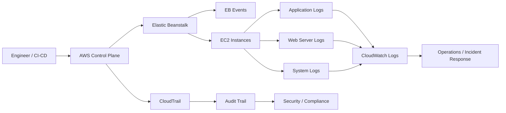

# 03- Logging and Auditing

## Overview

Logging and auditing are essential operational capabilities for AWS Elastic Beanstalk environments. Logging answers **what happened inside the application and infrastructure**, while auditing answers **who changed what, when, and through which AWS API or management interface**.

A production Elastic Beanstalk environment should provide visibility across multiple layers:

```text
                    ┌──────────────────────────┐
                    │        Application       │
                    │ Django / FastAPI / etc.  │
                    └────────────┬─────────────┘
                                 │
                                 ▼
                    ┌──────────────────────────┐
                    │     Instance Logs        │
                    │ App / Web / System Logs  │
                    └────────────┬─────────────┘
                                 │
                    ┌────────────┴────────────┐
                    ▼                         ▼
          ┌──────────────────┐      ┌──────────────────┐
          │ CloudWatch Logs  │      │ EB Environment   │
          │ Centralized Logs │      │ Events / Health  │
          └────────┬─────────┘      └────────┬─────────┘
                   │                         │
                   └────────────┬────────────┘
                                ▼
                    ┌──────────────────────────┐
                    │     CloudTrail           │
                    │ AWS API / Configuration  │
                    │ Audit History             │
                    └──────────────────────────┘
```

These systems answer different questions:

| Capability | Primary question |
|---|---|
| Application logs | What did the application do? |
| Web server logs | What happened at the HTTP server layer? |
| System logs | What happened on the EC2 instance? |
| Elastic Beanstalk events | What did the platform/environment do? |
| CloudWatch Logs | Where can logs be searched and retained centrally? |
| CloudWatch Metrics | How is the system behaving quantitatively? |
| CloudTrail | Who performed an AWS API operation? |

A senior engineer should treat logging and auditing as part of the application's operational architecture rather than as something added only after a production incident.

## Logging Layers

Elastic Beanstalk environments can produce logs from several layers.

### Application Logs

Application logs originate from the backend application.

Examples include:

```text
Django
FastAPI
Celery
Gunicorn
Uvicorn
```

Typical application events include:

- Request failures
- Exceptions
- Authentication failures
- Database errors
- External API failures
- Background task failures
- Business workflow failures

Example:

```text
2026-08-13T10:31:42Z ERROR payment_service
request_id=8f2a1f
operation=charge_customer
error="connection timeout"
```

Application logs should contain enough context to diagnose failures without exposing secrets or sensitive user information.

### Web Server Logs

Depending on the Elastic Beanstalk platform configuration, a web server such as Nginx or Apache may sit in front of the application.

The flow may look like:

```text
Client
  ↓
Load Balancer
  ↓
Nginx
  ↓
Gunicorn / Uvicorn
  ↓
Django / FastAPI
```

Web server logs can reveal:

- Request path
- HTTP method
- Response status
- Request timing
- Client information
- Upstream failures
- Connection failures

These logs are especially useful when the request never reaches the application process.

### System Logs

EC2 instances also generate operating-system-level logs.

These can help identify:

- Process failures
- Memory pressure
- Disk issues
- Package installation failures
- Boot problems
- Service startup failures
- Kernel-level problems

When diagnosing application startup failures, system and platform logs can be more useful than application logs because the application may never have started successfully.

## Elastic Beanstalk Log Retrieval

Elastic Beanstalk provides CLI commands for retrieving environment logs.

Basic log retrieval:

```bash
eb logs
```

Retrieve logs from all instances:

```bash
eb logs --all
```

These commands are useful during incidents because they provide quick access to recent environment logs without requiring manual SSH access to individual instances.

A typical investigation flow is:

```text
eb status
    ↓
eb events
    ↓
eb logs
    ↓
eb logs --all
    ↓
CloudWatch Logs
```

The Elastic Beanstalk CLI should be considered an operational convenience, not a replacement for centralized logging.

## Environment Events

Elastic Beanstalk events provide an operational timeline for the environment.

They can reveal events such as:

- Deployments
- Instance launches
- Instance termination
- Configuration updates
- Health changes
- Scaling activity
- Platform changes
- Failed operations

Inspect events with:

```bash
eb events
```

Or using the AWS CLI:

```bash
aws elasticbeanstalk describe-events \
  --environment-name <environment-name>
```

Events are particularly useful when correlated with application logs.

For example:

```text
10:00  Configuration update started
10:02  New instances launched
10:03  Application health changed to Yellow
10:04  HTTP 5xx increased
10:05  Instances became unhealthy
```

The timeline immediately narrows the investigation to the configuration change.

## CloudWatch Logs

CloudWatch Logs provides centralized storage and querying of log data.

Centralization is important because production environments typically contain multiple instances:

```text
Elastic Beanstalk
      │
      ├── EC2 Instance A ──┐
      ├── EC2 Instance B ──┼──► CloudWatch Logs
      ├── EC2 Instance C ──┤
      └── EC2 Instance D ──┘
```

Without centralized logging, an engineer may need to inspect several instances independently.

Centralized logging makes it possible to investigate events across the entire environment.

Typical use cases include:

- Searching for exceptions
- Correlating requests across instances
- Investigating deployment failures
- Searching for HTTP errors
- Reviewing application behavior
- Building log-based metrics
- Supporting incident investigations

## Log Groups and Log Streams

CloudWatch Logs organizes data using log groups and log streams.

Conceptually:

```text
Log Group
│
├── Stream: Instance A
├── Stream: Instance B
├── Stream: Instance C
└── Stream: Instance D
```

The exact naming and stream organization depend on the Elastic Beanstalk platform and logging configuration.

A log group should have an intentional retention policy.

Keeping every log indefinitely is usually unnecessary and increases cost.

## Log Retention

Production environments should explicitly define log retention.

Typical retention depends on:

- Operational requirements
- Compliance requirements
- Security requirements
- Incident investigation needs
- Cost constraints

For example:

```text
Application logs → 30–90 days
Security/audit logs → longer according to policy
Debug logs → shorter
```

The exact values should come from organizational requirements rather than arbitrary defaults.

## Application Logging Design

A production Python application should use structured logging.

Instead of:

```python
logger.error("Database failed")
```

prefer structured context:

```python
logger.error(
    "Database operation failed",
    extra={
        "request_id": request_id,
        "operation": "create_order",
        "order_id": order_id,
    },
)
```

The exact structured logging implementation depends on the application's logging stack.

A useful log event should answer:

```text
What happened?
Where did it happen?
When did it happen?
Which request was involved?
Which component generated it?
What operation was being performed?
```

## Structured Logging

Structured logging is preferable to arbitrary human-readable strings for production systems.

Example:

```json
{
  "timestamp": "2026-08-13T10:31:42Z",
  "level": "ERROR",
  "service": "orders-api",
  "environment": "production",
  "request_id": "8f2a1f",
  "operation": "create_order",
  "status_code": 500,
  "error_type": "DatabaseError"
}
```

Structured logs are easier to:

- Search
- Filter
- Aggregate
- Parse
- Correlate
- Convert into metrics

They are especially useful when multiple microservices are involved.

## Request Correlation

A request ID is one of the most valuable pieces of production logging context.

Consider:

```text
Client
  ↓
Load Balancer
  ↓
API
  ↓
Order Service
  ↓
Payment Service
  ↓
PostgreSQL
```

A request may generate logs across multiple components.

A correlation identifier allows the engineer to connect those events:

```text
request_id=8f2a1f
```

Example:

```text
API:
request_id=8f2a1f request received

Order Service:
request_id=8f2a1f creating order

Payment Service:
request_id=8f2a1f charging payment

Payment Service:
request_id=8f2a1f payment provider timeout

API:
request_id=8f2a1f returning 502
```

Without correlation, debugging distributed systems becomes significantly harder.

## Logging Levels

Use logging levels intentionally.

| Level | Appropriate use |
|---|---|
| `DEBUG` | Detailed diagnostic information |
| `INFO` | Normal operational events |
| `WARNING` | Unexpected but recoverable condition |
| `ERROR` | Operation failed |
| `CRITICAL` | Severe system failure |

Production applications should avoid indiscriminately enabling verbose `DEBUG` logging.

For example:

```text
DEBUG
  ↓
Very high volume
  ↓
Higher CloudWatch cost
  ↓
More difficult incident investigation
```

Use structured context and appropriate log levels instead.

## What Not to Log

Never log sensitive values unnecessarily.

Avoid:

```text
password
access_token
refresh_token
secret_key
database_password
private_key
credit_card_number
```

For example, do not write:

```python
logger.info("Authorization header: %s", authorization_header)
```

Prefer:

```python
logger.info(
    "Authenticated request",
    extra={"user_id": user_id, "request_id": request_id},
)
```

Sensitive data should be excluded, masked, or securely handled according to the application's security requirements.

## Logging and Personal Data

Production logs can unintentionally become a secondary database of user information.

Potentially sensitive information includes:

- Email addresses
- Phone numbers
- IP addresses
- User identifiers
- Request bodies
- Payment information
- Authentication information

Before logging request payloads, ask:

```text
Do we need this data for diagnosis?
Can the data be masked?
Can we log metadata instead?
How long should the data be retained?
Who can access it?
```

Logging less data often improves both security and operational clarity.

## CloudTrail Auditing

CloudTrail is primarily an **audit trail for AWS API activity**, not an application logging system.

For example, if an engineer changes an Elastic Beanstalk environment configuration, CloudTrail can help answer:

```text
Who performed the operation?
When did it happen?
Which AWS API was called?
From where?
What resource was involved?
```

The conceptual distinction is:

```text
Application logs
    ↓
"What did the application do?"

CloudTrail
    ↓
"What did an AWS identity do?"
```

These systems complement each other.

## Elastic Beanstalk and CloudTrail

Elastic Beanstalk operations can result in AWS API calls that are recorded by CloudTrail.

Examples include operations related to:

- Environment configuration
- Application versions
- Environment creation
- Environment updates
- Environment termination
- Platform configuration

CloudTrail is particularly valuable when a production environment changed unexpectedly.

For example:

```text
Application becomes unhealthy
        ↓
Engineer checks application logs
        ↓
No application deployment found
        ↓
Engineer checks Elastic Beanstalk events
        ↓
Configuration changed
        ↓
CloudTrail identifies API caller
        ↓
Root cause identified
```

## CloudTrail Event Investigation

A CloudTrail event typically provides information such as:

- Event time
- Event source
- Event name
- AWS region
- Identity
- Resource context
- Source IP
- Request parameters
- Response information

Use CloudTrail to establish an authoritative timeline for AWS control-plane changes.

For example:

```text
Application failure: 10:05
Environment configuration changed: 10:04
CloudTrail event: 10:04
API caller: deployment-role
```

This provides stronger evidence than relying only on human recollection.

## CloudTrail vs Elastic Beanstalk Events

These systems serve different purposes.

| Capability | Elastic Beanstalk Events | CloudTrail |
|---|---|---|
| Environment activity | Excellent | Partial |
| Platform events | Excellent | Partial |
| AWS API audit | Limited | Excellent |
| Identity information | Limited | Strong |
| API request details | Limited | Strong |
| Deployment timeline | Useful | Useful |
| Security investigation | Limited | Strong |
| Application errors | No | No |

Use both when investigating infrastructure changes.

## Audit Architecture

A production environment can use the following model:



This separates:

```text
Operational telemetry
        from
Control-plane auditing
```

while allowing them to be correlated during incidents.

## CI/CD and Auditability

CI/CD pipelines should be treated as first-class operational actors.

A deployment may originate from:

```text
Developer
   ↓
GitHub Actions
   ↓
AWS credentials / IAM role
   ↓
Elastic Beanstalk
```

When investigating a production change, determine whether it originated from:

- A human engineer
- CI/CD
- Infrastructure automation
- Scheduled automation
- AWS service activity

Using dedicated IAM roles for CI/CD improves auditability.

For example:

```text
Developer
   ↓
Pull Request
   ↓
GitHub Actions
   ↓
Deployment Role
   ↓
Elastic Beanstalk
```

CloudTrail can then distinguish deployment activity performed through the deployment role from other AWS operations.

## Log Rotation and Local Storage

Do not treat EC2 instance-local logs as permanent storage.

Elastic Beanstalk instances may be:

- Replaced
- Recreated
- Scaled in
- Terminated
- Rebuilt during deployment

Therefore:

```text
Instance-local logs
        ↓
Instance terminated
        ↓
Local log data may disappear
```

Centralized log delivery is essential for production environments.

This is especially important when Auto Scaling is enabled.

## Logging During Auto Scaling

Suppose an environment scales from:

```text
2 instances
```

to:

```text
8 instances
```

If logs remain only on the instances:

```text
Instance A → logs
Instance B → logs
Instance C → logs
...
Instance H → logs
```

Troubleshooting becomes operationally expensive.

Centralized logging provides:

```text
Instance A ──┐
Instance B ──┤
Instance C ──┤
Instance D ──┼──► Centralized Logs
Instance E ──┤
Instance F ──┤
Instance G ──┤
Instance H ──┘
```

This makes horizontally scaled systems much easier to operate.

## Logging During Deployments

Deployments should be observable.

At minimum, correlate:

```text
Deployment version
+
Deployment time
+
Elastic Beanstalk events
+
Application logs
+
Health changes
+
HTTP error rate
+
Latency
```

A useful deployment timeline looks like:

```text
09:55  Previous version healthy
10:00  Deployment started
10:01  New instances launched
10:02  Application startup logs appear
10:03  Health changes to Green
10:04  Error rate increases
10:05  Rollback initiated
10:06  Previous version restored
```

This allows engineers to distinguish deployment failures from unrelated infrastructure problems.

## Log-Based Metrics

Logs can be converted into operational signals.

For example:

```text
Log:
payment_failed

        ↓

Metric:
payment_failure_count

        ↓

Alarm:
payment failures > threshold
```

However, application metrics should generally be preferred when a value is naturally represented as a metric.

Use logs for detailed context and metrics for aggregation and alerting.

## Alerting Strategy

Do not create alerts for every log line.

Bad:

```text
ERROR log → PagerDuty alert
```

This creates alert fatigue.

Prefer actionable conditions:

```text
5xx rate > 5% for 5 minutes
```

or:

```text
Database connection failures
+
Request error rate increasing
```

or:

```text
No healthy application instances
```

A good alert should answer:

```text
What is broken?
How severe is it?
Who needs to respond?
What action should be taken?
```

## Incident Investigation Workflow

A practical logging and auditing workflow is:

### Establish the Time Window

Determine:

```text
When did the problem start?
When was it first detected?
When did recovery occur?
```

### Check Elastic Beanstalk Events

```bash
eb events
```

Identify:

- Deployment
- Scaling
- Configuration change
- Instance replacement
- Health transition

### Inspect Logs

```bash
eb logs --all
```

Search for:

- Exceptions
- Timeouts
- HTTP 5xx
- Database failures
- Startup failures
- Dependency failures

### Check CloudWatch

Correlate:

```text
Error rate
Latency
CPU
Memory
Request volume
Instance count
```

### Check CloudTrail

If an infrastructure or configuration change is suspected, inspect CloudTrail for the relevant period.

### Build the Timeline

Combine all signals:

```text
Application logs
       +
EB events
       +
CloudWatch metrics
       +
CloudTrail
       ↓
Incident timeline
       ↓
Root cause
```

## Example Incident

Suppose an Elastic Beanstalk environment begins returning `503` responses.

Application logs show:

```text
No application exceptions.
```

Elastic Beanstalk events show:

```text
Environment configuration update completed.
```

CloudWatch shows:

```text
Healthy targets: 4 → 0
```

CloudTrail reveals:

```text
UpdateEnvironment
Caller: deployment-role
Time: 14:32
```

Further inspection identifies a configuration change that caused the application process to stop listening on the expected port.

The investigation would have been significantly harder without:

```text
EB Events
+
CloudWatch
+
Application Logs
+
CloudTrail
```

## Security Considerations

Logging and auditing systems themselves require protection.

Apply least privilege to:

- CloudWatch Logs
- CloudTrail
- Elastic Beanstalk
- S3 log destinations where applicable

Restrict who can:

- Read logs
- Delete logs
- Change retention
- Disable logging
- Modify CloudTrail configuration
- Modify Elastic Beanstalk environments

Audit logs should be protected from unauthorized modification.

For security-sensitive environments, consider centralized and controlled log storage with appropriate retention, access controls, and integrity protections.

## Secrets Management

Never use logs as a substitute for secret management.

Do not log:

```text
AWS_ACCESS_KEY_ID
AWS_SECRET_ACCESS_KEY
DATABASE_PASSWORD
SECRET_KEY
JWT
Authorization headers
API tokens
```

Store secrets in appropriate secret-management systems and inject them into the application securely.

If a secret accidentally appears in logs, treat it as compromised:

```text
Secret exposed
      ↓
Rotate secret
      ↓
Remove/contain exposure
      ↓
Investigate access
      ↓
Improve logging controls
```

Deleting the log entry alone does not guarantee that the secret was never accessed.

## Cost Considerations

Logging has a direct operational cost.

Cost drivers include:

- Log ingestion
- Log storage
- CloudWatch Logs usage
- CloudTrail data/event configuration
- Long retention periods
- High-volume debug logs
- Duplicate log collection

Control costs through:

- Appropriate log levels
- Retention policies
- Structured logging
- Sampling where appropriate
- Avoiding unnecessary payload logging
- Centralized but intentional collection

Do not reduce logging blindly to save money. Insufficient telemetry increases incident resolution time and operational risk.

## Disaster Recovery and Auditing

Logs and audit trails may be required after an environment is terminated or rebuilt.

Therefore, important operational records should not depend exclusively on the lifecycle of an Elastic Beanstalk instance.

A resilient approach is:

```text
Elastic Beanstalk
      │
      ├── Application logs
      ├── Platform logs
      └── System logs
             │
             ▼
      Centralized storage
             │
             ├── Operational investigation
             └── Historical analysis

AWS API activity
      │
      ▼
CloudTrail
      │
      ▼
Protected audit storage
```

Retention should reflect operational, security, and compliance requirements.

## Common Mistakes

### Treating Application Logs as an Audit Trail

Application logs can show what the application did, but they do not reliably establish who changed an AWS resource.

**Avoid it:** use CloudTrail for AWS control-plane auditing.

### Keeping Logs Only on EC2 Instances

Instances can disappear during scaling, deployment, or recovery.

**Avoid it:** centralize production logs.

### Logging Secrets

Credentials and tokens may accidentally enter application logs.

**Avoid it:** sanitize sensitive fields and review logging middleware carefully.

### Logging Entire Request Bodies

Request payloads can contain sensitive information and create excessive log volume.

**Avoid it:** log relevant metadata rather than complete payloads.

### Using Unstructured Logs Everywhere

Free-form logs become difficult to search and correlate at scale.

**Avoid it:** use structured logging with consistent fields.

### No Request Correlation ID

Distributed requests become difficult to trace across services.

**Avoid it:** propagate a request or correlation identifier.

### Infinite Log Retention

Keeping all logs forever increases cost and may create unnecessary security exposure.

**Avoid it:** define explicit retention periods.

### Alerting on Every Error Log

A high-volume application can generate thousands of errors without every error requiring immediate human intervention.

**Avoid it:** alert on actionable error rates and service-level conditions.

### Ignoring CloudTrail

An unexplained environment configuration change may be impossible to attribute from application logs.

**Avoid it:** use CloudTrail for AWS API auditing.

### Giving Everyone Broad Log Access

Production logs may contain sensitive operational and user information.

**Avoid it:** apply least-privilege IAM permissions.

## Interview Traps

### Are CloudWatch Logs and CloudTrail the Same?

No.

CloudWatch Logs primarily stores and analyzes logs generated by applications and infrastructure.

CloudTrail records AWS API activity for auditing and governance.

### Can CloudTrail Replace Application Logs?

No.

CloudTrail can show that an AWS API operation occurred, but it cannot tell you what happened inside a Django or FastAPI application.

### Why Are Centralized Logs Important in Elastic Beanstalk?

Because instances are ephemeral.

Instances can be replaced or scaled in, causing local logs to disappear.

### Why Use Structured Logging?

Structured logs make large-scale search, filtering, aggregation, and correlation easier.

### Why Is a Request ID Important?

It allows engineers to correlate events generated by the same request across multiple services and infrastructure components.

### Should Every Error Trigger an Alert?

No.

Alerts should represent actionable operational conditions rather than individual log messages.

### Why Should Audit Logs Be Separate From Application Logs?

They serve different purposes.

Application logs describe application behavior, while audit logs establish a record of control-plane actions and identities.

## Production Checklist

```text
[ ] Application logging is enabled
[ ] Web server logging is available
[ ] System/platform logs are accessible
[ ] Elastic Beanstalk events are monitored
[ ] Centralized logging is configured
[ ] Log retention is explicitly defined
[ ] Structured logging is used where practical
[ ] Request/correlation IDs are available
[ ] Production log levels are intentional
[ ] Sensitive values are excluded from logs
[ ] Request bodies are not logged unnecessarily
[ ] CloudTrail is enabled according to organizational requirements
[ ] AWS control-plane activity is auditable
[ ] CI/CD deployments use identifiable IAM roles
[ ] Logs survive instance replacement
[ ] Deployment events can be correlated with logs
[ ] CloudWatch metrics complement logs
[ ] Alerts represent actionable conditions
[ ] Log access follows least privilege
[ ] Audit data is protected from unauthorized modification
[ ] Log retention balances cost and operational requirements
[ ] Security-sensitive logs have appropriate retention
[ ] Incident response procedures include log and audit investigation
```

## Key Takeaways

- Elastic Beanstalk logging should cover application, web server, platform, and system layers.
- Elastic Beanstalk events provide an important operational timeline for deployments, scaling, configuration changes, and environment activity.
- Centralized logging is essential because Elastic Beanstalk instances are replaceable and ephemeral.
- CloudWatch Logs provides centralized storage and investigation capabilities for operational logs.
- CloudTrail serves a different purpose: it provides an audit trail of AWS API activity and helps identify who performed infrastructure changes.
- Application logs answer **what happened inside the application**; CloudTrail helps answer **who changed the AWS environment**.
- Structured logging improves searchability, correlation, and operational analysis.
- Request and correlation IDs are critical when tracing requests across backend services.
- Never log passwords, tokens, credentials, private keys, or other sensitive information unnecessarily.
- Avoid logging entire request bodies unless there is a strong operational requirement and sensitive data is properly handled.
- Do not rely on instance-local logs for production history.
- Log retention should be explicit and aligned with operational, security, compliance, and cost requirements.
- Metrics should complement logs; use metrics for aggregation and alerting and logs for detailed diagnostic context.
- CI/CD systems should use identifiable IAM roles so production changes can be traced through CloudTrail.
- During incidents, correlate **application logs, Elastic Beanstalk events, CloudWatch metrics, and CloudTrail** to build a reliable timeline.
- Effective logging and auditing is not about collecting everything; it is about collecting enough trustworthy, searchable, and appropriately protected telemetry to detect, diagnose, and attribute production changes.