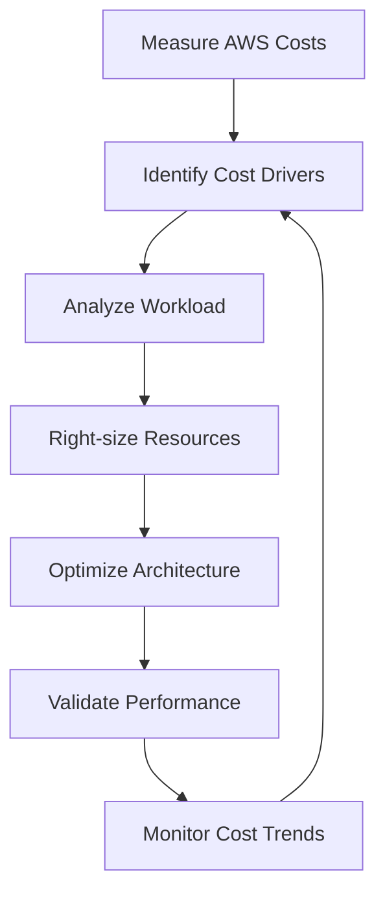

# 06- Cost Optimization

## Overview

Amazon Elastic Beanstalk reduces infrastructure-management overhead, but it does not automatically optimize the cost of the AWS resources running the application.

Elastic Beanstalk environments commonly consume costs through:

- EC2 instances
- EBS volumes
- Application Load Balancers
- NAT gateways
- RDS databases
- S3 storage
- CloudWatch logs and metrics
- Data transfer
- Elastic IP addresses and related networking resources

The correct optimization strategy is therefore to optimize the **architecture and workload**, not simply the Elastic Beanstalk environment.

A production cost model should look like:

```text
                    Elastic Beanstalk
                          │
          ┌───────────────┼────────────────┐
          │               │                │
          ▼               ▼                ▼
        EC2             ALB              EBS
          │                               
          └───────────────┐
                          ▼
                         RDS
                          │
                 ┌────────┴────────┐
                 ▼                 ▼
                S3              Redis

Additional costs:
- NAT Gateway
- CloudWatch
- Data Transfer
- DNS
- CI/CD
- Other AWS services
```

Cost optimization should balance:

```text
Cost
 │
 ├── Performance
 ├── Availability
 ├── Reliability
 ├── Security
 └── Operational simplicity
```

The cheapest architecture is not necessarily the best architecture.

## Understanding the Cost Model

Elastic Beanstalk is primarily an orchestration service. The major infrastructure charges usually come from the resources provisioned for the environment.

| Resource | Typical cost driver | Optimization focus |
|---|---|---|
| EC2 | Instance type, count, runtime | Right-sizing, scaling |
| EBS | Volume size and type | Right-sizing, cleanup |
| ALB | Load balancer hours and traffic-related usage | Consolidation, traffic efficiency |
| RDS | Instance class, storage, runtime | Right-sizing, lifecycle |
| S3 | Storage, requests, transfer | Lifecycle policies |
| NAT Gateway | Hourly charge and processed data | Reduce unnecessary traffic |
| CloudWatch | Logs, metrics, retention | Retention and volume |
| Data transfer | Cross-AZ, cross-region, internet traffic | Architecture and traffic paths |
| Elastic IP | Allocation/usage conditions | Remove unused addresses |

The first step in optimization is identifying which resources actually dominate the bill.

## Cost Optimization Workflow

Use an evidence-driven workflow rather than making arbitrary infrastructure changes.



A practical process is:

1. Measure current costs.
2. Identify the highest-cost resources.
3. Determine whether the resource is required at its current size.
4. Analyze utilization and traffic patterns.
5. Change one cost variable at a time.
6. Validate latency, availability, and error rates.
7. Measure the financial impact.
8. Automate recurring optimization where appropriate.

## EC2 Right-Sizing

EC2 is often one of the largest components of an Elastic Beanstalk application's compute cost.

An instance that consistently uses only a small percentage of its available CPU and memory may be oversized.

However, CPU utilization alone is insufficient.

For a Python Django or FastAPI application, evaluate:

- CPU utilization
- Memory utilization
- Request rate
- Response latency
- Network throughput
- Number of worker processes
- Worker concurrency
- Application startup time
- Garbage collection behavior
- Traffic peaks

Example:

```text
Current:
4 × large instances

Observed:
CPU: 15–25%
Memory: 30%
Traffic: stable

Potential:
2 × medium/large instances

Requirement:
Validate peak traffic and failure tolerance first.
```

Do not reduce capacity simply because average utilization is low.

## Auto Scaling and Cost

Auto Scaling allows capacity to follow workload demand.

A static deployment may look like:

```text
24 hours
────────────────────────────────
4 instances continuously running
```

An autoscaled deployment may look like:

```text
Low traffic       High traffic       Low traffic
     │                  │                  │
     ▼                  ▼                  ▼
  2 instances       6 instances        2 instances
```

This can reduce unnecessary compute consumption during low-traffic periods.

The trade-off is that aggressive scale-in can increase:

- Cold starts
- Deployment impact
- Connection churn
- Request latency
- Recovery time

Use scaling policies based on meaningful workload signals.

## Choosing Scaling Signals

CPU utilization is convenient but may not represent application demand accurately.

For APIs, useful signals may include:

- CPU
- Request count
- Request latency
- Load balancer request count per target
- Queue depth
- Custom application metrics

For example:

```text
HTTP traffic
    │
    ▼
ALB
    │
    ▼
Elastic Beanstalk
    │
    ├── Request count
    ├── Latency
    └── CPU
            │
            ▼
        Auto Scaling
```

The correct metric depends on the application's bottleneck.

## Scale-Out vs Right-Sizing

These are different optimization strategies.

| Strategy | Goal |
|---|---|
| Right-sizing | Reduce waste from oversized instances |
| Scale-out | Increase capacity for more concurrent workload |
| Scale-in | Remove unnecessary capacity |
| Scale-up | Increase capacity per instance |

For horizontally scalable Django or FastAPI APIs, prefer horizontal scaling when the application is stateless and the workload supports it.

## Stateless Application Design

Elastic Beanstalk cost optimization becomes easier when application instances are stateless.

Avoid storing durable state on the local instance filesystem.

Prefer:

```text
Application
   │
   ├── Static files ──► S3 / CDN
   ├── User uploads ──► S3
   ├── Sessions ──────► Database / Redis
   ├── Cache ─────────► Redis
   └── Database ──────► RDS
```

Stateless instances can be freely added and removed by Auto Scaling.

## Instance Type Selection

Instance families should match the application's resource profile.

| Workload characteristic | Consideration |
|---|---|
| CPU-heavy | Compute-oriented instances |
| Memory-heavy | Memory-oriented instances |
| General web API | General-purpose instances |
| Bursty workload | Burstable instances where appropriate |
| Consistently high utilization | Evaluate appropriate fixed-performance families |

Do not select an instance family purely from habit.

Benchmark representative workloads before making significant production changes.

## Graviton Considerations

Where application dependencies support ARM64, AWS Graviton-based instances can be evaluated as a cost/performance option.

For Python applications, verify:

- Python runtime support
- Native package compatibility
- Database drivers
- Scientific libraries if applicable
- Build tooling
- Docker images if used
- Third-party dependencies

Do not migrate production workloads solely for theoretical savings.

Test the complete application and deployment pipeline first.

## EBS Cost Optimization

EBS costs can accumulate through:

- Oversized volumes
- Unused volumes
- Unused snapshots
- Unnecessary high-performance volume types
- Temporary environments

Review:

```text
Volume size
Volume type
IOPS
Throughput
Unused volumes
Snapshot retention
```

Do not reduce storage below application requirements.

Also consider operational recovery requirements before deleting snapshots.

## Load Balancer Costs

Elastic Beanstalk environments commonly use an Application Load Balancer.

The ALB provides important functionality such as:

- Traffic distribution
- Health checks
- TLS termination
- Routing
- High availability

Removing an ALB solely to reduce cost may introduce significant architectural limitations.

Instead, optimize:

- Unnecessary duplicate environments
- Excessive idle environments
- Unnecessary traffic
- Redundant load balancers across unrelated low-traffic applications

For organizations running many services, centralized ingress can sometimes reduce duplicated infrastructure, but this introduces operational and failure-domain trade-offs.

## NAT Gateway Cost

NAT Gateway costs can become significant in VPC architectures with private application subnets.

The cost can come from both:

- Hourly NAT Gateway usage
- Data processed through the NAT Gateway

Typical traffic flow:

```text
Private EC2
    │
    ▼
Route Table
    │
    ▼
NAT Gateway
    │
    ▼
Internet
```

Before optimizing NAT usage, identify what traffic is passing through it.

Common sources include:

- Package downloads
- External APIs
- S3 access
- AWS service APIs
- Container/image downloads

Where supported and appropriate, AWS service endpoints can reduce unnecessary NAT traversal for AWS service traffic.

## NAT Traffic Optimization

A common optimization pattern is:

```text
Private EC2
    │
    ├── S3 ───────────────► VPC Endpoint
    │
    ├── Other AWS service ─► VPC Endpoint where appropriate
    │
    └── Public Internet ──► NAT Gateway
```

This can reduce unnecessary NAT data processing and improve network architecture.

However, endpoint usage itself has cost and architectural considerations. Evaluate the actual traffic volume before changing the design.

## RDS Cost Optimization

For many backend applications, RDS can become a larger cost driver than Elastic Beanstalk itself.

Review:

- Instance class
- Storage size
- Provisioned performance
- Backup retention
- Multi-AZ requirements
- Read replicas
- Idle databases
- Development environments
- Snapshot retention

Do not reduce RDS capacity without checking:

- Query latency
- CPU
- Memory pressure
- Connections
- IOPS
- Storage throughput
- Lock contention

## Development and Staging Environments

Non-production environments are frequent sources of wasted cost.

A common pattern is:

```text
Production      → 24/7
Staging         → 24/7
Development     → 24/7
Testing         → 24/7
```

If staging and development are not required continuously, consider lifecycle controls.

For example:

```text
Business hours
    │
    ▼
Environment running

After hours
    │
    ▼
Environment stopped / scaled down
```

The exact strategy depends on the environment and resource type.

Do not automatically apply production availability requirements to development infrastructure.

## Temporary Environments

Feature branches and test environments can accumulate quickly.

Example:

```text
feature-a-env
feature-b-env
feature-c-env
feature-d-env
...
```

Without automated cleanup, these environments continue consuming resources.

Use automated lifecycle management where appropriate.

A useful tagging model is:

| Tag | Example |
|---|---|
| Environment | staging |
| Owner | backend-team |
| Application | orders-api |
| ManagedBy | terraform |
| ExpirationDate | 2026-08-20 |
| CostCenter | engineering |

Tags make cost attribution and cleanup easier.

## S3 Cost Optimization

Application storage should be designed according to object lifecycle.

Typical strategy:

```text
Frequently accessed
       │
       ▼
Standard storage
       │
       ▼
Older objects
       │
       ▼
Infrequent access
       │
       ▼
Archive
       │
       ▼
Expiration
```

Use lifecycle policies when the access pattern is predictable.

Review:

- Object size
- Request frequency
- Storage class
- Retention
- Versioning
- Incomplete multipart uploads
- Lifecycle policies

Do not delete objects solely to reduce cost when they are required for compliance or recovery.

## S3 Versioning Cost

S3 versioning can protect against accidental deletion and overwrites, but old versions consume storage.

If versioning is enabled:

```text
document.pdf
document.pdf → version 1
document.pdf → version 2
document.pdf → version 3
```

Lifecycle policies can control how long older versions remain available.

Cost optimization must preserve the intended recovery guarantees.

## CloudWatch Cost Optimization

CloudWatch costs can grow significantly when applications generate excessive logs.

Common sources include:

- Application logs
- Nginx logs
- Access logs
- Debug logs
- Audit logs
- Deployment logs
- High-cardinality metrics

A common mistake is logging everything at maximum verbosity in production.

Prefer structured, useful logging.

For example:

```text
timestamp
request_id
service
endpoint
status_code
latency_ms
error_type
```

Avoid logging sensitive data or unnecessarily large payloads.

## Log Retention

Log retention should match operational and compliance requirements.

Example:

```text
Application logs
    │
    ├── Short operational retention
    │
    ├── Longer security/audit retention
    │
    └── Archive where required
```

Do not retain every operational log indefinitely.

A retention policy should be explicit rather than relying on indefinite storage.

## Logging Volume Optimization

Poor:

```text
DEBUG request payload: <large payload>
DEBUG response payload: <large response>
DEBUG database query details
DEBUG internal object state
```

Better:

```text
INFO request_completed
request_id=abc123
path=/api/orders
status=200
latency_ms=84
```

The objective is not to eliminate logs. It is to maximize their operational value per byte stored.

## Data Transfer Costs

Network architecture can create unexpected costs.

Common areas to inspect:

- Cross-AZ traffic
- Cross-region traffic
- Internet egress
- NAT Gateway traffic
- S3 traffic
- Database traffic
- Service-to-service traffic

Example:

```text
AZ-A
  │
  ▼
EC2
  │
  ▼
Database in AZ-B
```

Cross-AZ communication can be required for high availability, so eliminating it blindly is not a valid optimization.

The goal is to understand the trade-off between:

```text
Availability
     vs
Network Cost
```

## Caching and Cost

Redis can reduce database load and improve latency.

For example:

```text
Without cache:

API
 │
 ▼
RDS
 │
 ▼
Response


With cache:

API
 │
 ▼
Redis ── HIT ──► Response
 │
 MISS
 ▼
RDS
 │
 ▼
Redis
 │
 ▼
Response
```

Caching can reduce:

- Database CPU
- Database I/O
- Query volume
- Application latency

However, Redis itself has a cost.

Use caching when the reduction in expensive downstream work justifies the cache infrastructure.

## Database Query Optimization

Reducing infrastructure size is not always the best cost optimization.

A poorly optimized query can force the system to use larger database instances.

Example:

```sql
SELECT *
FROM orders
WHERE customer_id = 12345;
```

If `customer_id` is frequently queried and not indexed appropriately, database resources may be wasted.

Before increasing database capacity, investigate:

- Query plans
- Missing indexes
- N+1 queries
- Unnecessary columns
- Large scans
- Excessive connection counts

For Django applications, use tools such as query logging and `QuerySet.explain()` when investigating expensive queries.

## Connection Pooling

A large number of application instances can create excessive database connections.

For example:

```text
10 EC2 instances
×
multiple application workers
×
database connections per worker
=
large connection count
```

This can force the database to use a larger instance than otherwise necessary.

Connection management should be designed alongside Auto Scaling.

For Django, configure database connections intentionally and evaluate whether a managed connection proxy is appropriate for the workload.

## Worker Configuration

Python applications commonly run multiple worker processes.

For example:

```text
EC2 instance
   │
   ├── Worker 1
   ├── Worker 2
   ├── Worker 3
   └── Worker 4
```

More workers do not automatically improve performance.

Too many workers can increase:

- Memory usage
- CPU contention
- Database connections
- Context switching

Benchmark worker counts against actual workload.

## Celery Cost Optimization

Celery workers can create significant compute cost when permanently running at high capacity.

A better architecture can scale workers based on workload.

```text
Kafka / Queue
     │
     ▼
Queue depth
     │
     ▼
Worker scaling
     │
     ├── Low queue → fewer workers
     │
     └── High queue → more workers
```

Do not scale workers based only on CPU if queue depth is the actual business signal.

## CI/CD Cost

CI/CD can also generate AWS costs indirectly.

Examples:

- Frequent deployments
- Temporary environments
- Large build artifacts
- Excessive data transfer
- Unused deployment infrastructure

Optimize pipelines without reducing deployment safety.

A good pipeline should:

```text
Build
  ↓
Test
  ↓
Security checks
  ↓
Deploy
  ↓
Validate
```

Do not remove testing simply to reduce build minutes.

## Environment Count

Multiple Elastic Beanstalk environments can be useful:

```text
production
staging
qa
development
```

But each environment can consume infrastructure.

Review whether every environment requires:

- Load balancer
- Multiple EC2 instances
- RDS
- NAT gateways
- Redis
- Additional monitoring

Where practical, lower-cost non-production architectures can be used without weakening production architecture.

## Reserved Capacity and Savings Programs

For stable, predictable workloads, evaluate AWS purchasing options such as:

- Reserved Instances
- Savings Plans

These can reduce compute costs in exchange for longer-term commitment.

Do not purchase commitments based solely on current usage.

First determine:

- Long-term workload stability
- Expected architecture changes
- Instance family requirements
- Migration plans
- Seasonal traffic patterns

For highly variable workloads, flexibility may be more valuable than maximum unit-cost reduction.

## Spot Instances

Spot capacity can be considered for workloads that tolerate interruption.

Potential candidates include:

- Non-critical workers
- Batch processing
- CI workloads
- Asynchronous processing
- Temporary environments

Be cautious when using interruption-prone capacity for latency-sensitive production APIs.

For a web application:

```text
Critical API
   │
   └── Prefer stable capacity

Batch workers
   │
   └── Can potentially use interruption-tolerant capacity
```

The architecture must explicitly handle interruption.

## Scheduled Scaling

Some applications have predictable traffic patterns.

Example:

```text
Night       Morning       Business Hours       Night
  │             │                │                │
  ▼             ▼                ▼                ▼
  2             3                8                2
instances    instances        instances        instances
```

Scheduled scaling can reduce unnecessary capacity when demand follows a predictable schedule.

Use it as a complement to dynamic Auto Scaling rather than a replacement when demand is unpredictable.

## Performance vs Cost

Cost optimization must always be evaluated alongside performance.

A useful model is:

```text
Lower infrastructure cost
          │
          ▼
Reduced capacity
          │
          ▼
Higher utilization
          │
          ├── Good → efficient infrastructure
          │
          └── Bad → latency/errors
```

The optimization is successful only if the workload remains within its required performance and reliability boundaries.

## Cost Allocation

Use tagging and AWS cost-management capabilities to understand where money is being spent.

Useful dimensions include:

- Application
- Team
- Environment
- Service
- Owner
- Cost center

Example:

```text
Total AWS Cost
│
├── Production
│   ├── orders-api
│   ├── payments-api
│   └── users-api
│
├── Staging
│
└── Development
```

Without cost attribution, teams often optimize the wrong resources.

## Cost Monitoring

Cost optimization should be continuous.

Monitor:

- Monthly cost
- Daily cost
- Cost by service
- Cost by environment
- Cost anomalies
- Cost per request
- Cost per customer where meaningful
- Compute utilization
- Database utilization
- Storage growth

A useful engineering metric is:

```text
Cost per 1,000 API requests
```

rather than simply looking at the monthly AWS bill.

If traffic doubles while cost doubles, the architecture may be scaling linearly.

If traffic doubles while infrastructure cost grows much faster, investigate the bottleneck.

## Cost Efficiency Metrics

Useful metrics include:

| Metric | Purpose |
|---|---|
| Cost per request | API efficiency |
| Cost per active user | Product-level efficiency |
| EC2 utilization | Compute efficiency |
| RDS CPU/memory | Database efficiency |
| Storage growth | Data cost forecasting |
| NAT bytes processed | Network cost |
| Log ingestion volume | Observability cost |
| Idle resource count | Waste detection |

These metrics connect infrastructure cost to business workload.

## Production Cost Optimization Checklist

```text
[ ] EC2 instances are right-sized
[ ] Auto Scaling matches workload demand
[ ] Scaling policies use meaningful metrics
[ ] Application instances are stateless
[ ] EBS volumes are right-sized
[ ] Unused EBS volumes are removed
[ ] Snapshot retention is intentional
[ ] RDS is right-sized
[ ] RDS storage is reviewed
[ ] Database queries are optimized
[ ] Database connections are controlled
[ ] S3 lifecycle policies are configured
[ ] S3 version retention is reviewed
[ ] CloudWatch log retention is defined
[ ] Excessive production logging is removed
[ ] NAT Gateway traffic is understood
[ ] AWS service traffic uses appropriate endpoints where beneficial
[ ] Cross-AZ traffic is understood
[ ] Unused environments are removed
[ ] Non-production environments are right-sized
[ ] Temporary environments have lifecycle controls
[ ] Resources are tagged
[ ] Cost allocation is available
[ ] Cost anomalies are monitored
[ ] Stable workloads are evaluated for commitment discounts
[ ] Interruption-tolerant workloads are evaluated for Spot capacity
[ ] Scheduled scaling is considered for predictable traffic
[ ] Cost is measured against workload growth
[ ] Performance is validated after optimization
[ ] Availability requirements are preserved
```

## Common Mistakes

### Optimizing Only EC2

EC2 may not be the largest cost driver.

**Avoid it:** inspect the complete AWS bill before optimizing.

### Choosing the Cheapest Instance

The smallest instance may increase latency, errors, or scaling frequency.

**Avoid it:** optimize for cost per unit of useful work rather than lowest instance price.

### Removing High-Availability Resources

Removing instances, load balancers, or Multi-AZ resources can reduce cost while increasing operational risk.

**Avoid it:** define minimum availability requirements before cost reductions.

### Ignoring NAT Gateway Costs

High-volume private-subnet traffic can generate substantial NAT processing costs.

**Avoid it:** inspect network flows and evaluate appropriate VPC endpoints.

### Leaving Staging Running Forever

Non-production resources frequently become permanent infrastructure.

**Avoid it:** implement scheduled scaling or automated lifecycle cleanup where appropriate.

### Logging Everything

Verbose logs increase ingestion and storage costs while making troubleshooting harder.

**Avoid it:** log information that provides operational value and define retention policies.

### Over-Caching

Redis can reduce database costs, but excessive caching adds infrastructure and operational complexity.

**Avoid it:** cache high-value, frequently accessed data and measure cache effectiveness.

### Increasing Database Size Instead of Fixing Queries

A larger RDS instance may temporarily hide inefficient queries.

**Avoid it:** inspect query plans, indexes, connection usage, and application access patterns first.

### Ignoring Data Transfer

Cross-AZ and internet traffic can become meaningful cost drivers.

**Avoid it:** include network architecture in cost reviews.

### Buying Long-Term Commitments Too Early

Commitment-based pricing can become inefficient if the workload or architecture changes.

**Avoid it:** establish stable baseline usage before committing.

### Using Spot Capacity for Critical Stateless APIs Without Planning

Spot interruptions can affect availability if the workload cannot tolerate replacement.

**Avoid it:** use interruption-tolerant workloads and maintain sufficient stable capacity for critical paths.

## Production Best Practices

- Start cost optimization with billing data and resource utilization rather than assumptions.
- Optimize the largest cost drivers first.
- Right-size EC2 and RDS using sustained workload measurements.
- Use Auto Scaling to align compute capacity with demand.
- Keep Elastic Beanstalk application instances stateless.
- Use S3 for durable object storage instead of instance-local storage.
- Review EBS volume sizes, types, snapshots, and unused resources.
- Investigate NAT Gateway traffic before attempting network cost reductions.
- Use appropriate VPC endpoints when they provide a meaningful architectural or financial benefit.
- Optimize database queries before simply increasing database capacity.
- Control database connection counts as application capacity scales.
- Use Redis selectively where caching reduces expensive downstream work.
- Apply lifecycle policies to long-lived S3 data and log storage.
- Define CloudWatch log retention according to operational and compliance requirements.
- Remove excessive debug logging from production.
- Shut down, scale down, or automatically delete temporary environments when they are no longer required.
- Tag resources consistently for ownership and cost attribution.
- Use cost anomalies and budgets to detect unexpected spending.
- Evaluate Savings Plans or Reserved Instances only after establishing stable baseline demand.
- Use Spot capacity for suitable interruption-tolerant workloads.
- Use scheduled scaling when traffic follows predictable patterns.
- Measure cost per request or another workload-based efficiency metric.
- Validate latency, error rate, throughput, and availability after every significant optimization.
- Never trade away required security, availability, or disaster recovery guarantees solely to reduce infrastructure cost.

## Interview Traps

### Does Elastic Beanstalk Automatically Minimize AWS Costs?

No.

Elastic Beanstalk simplifies application deployment and environment management. The underlying resources still generate normal AWS costs.

### What Is the First Step in Cost Optimization?

Measure current costs and identify the largest cost drivers.

### Is Lower EC2 Utilization Always Better?

No.

Extremely low utilization may indicate over-provisioning, but very high utilization can increase latency and reduce failure tolerance.

### Why Can NAT Gateway Be Expensive?

NAT Gateway can incur both hourly charges and data-processing charges. High-volume private-subnet traffic can therefore become expensive.

### Should You Always Use the Smallest EC2 Instance?

No.

The objective is efficient workload processing while satisfying performance and reliability requirements.

### How Can Auto Scaling Reduce Cost?

It allows capacity to increase during demand and decrease when demand falls, avoiding unnecessary always-on capacity.

### Does Multi-AZ Increase Cost?

Generally, yes, because additional resources may be required. However, removing Multi-AZ solely to save money can violate availability requirements.

### Why Optimize Database Queries Before Scaling RDS?

Poor queries can consume CPU, memory, and I/O unnecessarily. Fixing inefficient workload behavior can sometimes provide greater savings than increasing or decreasing infrastructure size.

### How Does Logging Affect AWS Cost?

Log ingestion, storage, and retention can generate CloudWatch costs. Excessive log volume therefore directly affects operational cost.

### What Is a Better Metric Than Total Monthly AWS Cost?

A workload-normalized metric such as **cost per 1,000 API requests** can provide better insight into infrastructure efficiency.

## Key Takeaways

- Elastic Beanstalk does not eliminate the cost of the infrastructure it manages.
- Optimize the complete application architecture, not only EC2 instances.
- Identify the largest cost drivers before making changes.
- Right-size EC2, RDS, EBS, and other continuously running resources.
- Use Auto Scaling to align compute capacity with actual demand.
- Keep application instances stateless so capacity can scale horizontally.
- Investigate NAT Gateway and data-transfer costs carefully.
- Use appropriate VPC endpoints where they improve the network architecture and economics.
- Optimize database queries before relying on larger database instances.
- Use Redis when caching meaningfully reduces expensive downstream work.
- Apply S3 and CloudWatch lifecycle and retention policies.
- Treat development, staging, and temporary environments as separate cost-optimization opportunities.
- Tag resources so infrastructure costs can be attributed to teams and applications.
- Evaluate Savings Plans and Reserved Instances only after workload patterns are sufficiently stable.
- Use Spot capacity only for workloads that can tolerate interruption.
- Use scheduled scaling for predictable traffic patterns.
- Measure cost using workload-based metrics such as cost per request.
- Always validate performance, reliability, security, and availability after optimization.
- Cost optimization is successful when the system delivers the required workload at the lowest practical cost **without violating its performance, reliability, security, and availability requirements**.