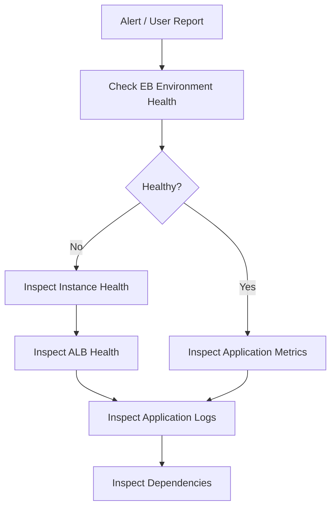
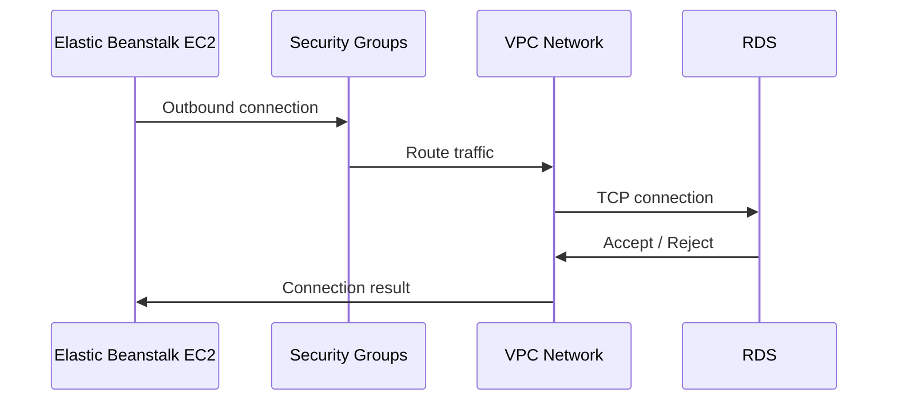

# 07- Operational Runbooks

## Overview

Operational runbooks define the repeatable procedures used to operate, diagnose, recover, and maintain an Amazon Elastic Beanstalk environment in production.

A good runbook converts operational knowledge into an executable procedure:

```text
Incident / Operational Event
            │
            ▼
       Detect Signal
            │
            ▼
      Assess Impact
            │
            ▼
     Identify Failure
            │
            ▼
    Execute Safe Action
            │
            ▼
      Verify Recovery
            │
            ▼
       Record Outcome
```

Runbooks are particularly valuable for Elastic Beanstalk because an environment is composed of multiple AWS resources and application-layer components:

- Elastic Beanstalk environment
- EC2 instances
- Auto Scaling
- Application Load Balancer
- Security groups
- VPC networking
- Application processes
- Platform configuration
- Environment variables
- CloudWatch logs and metrics
- Databases and other dependencies

A runbook should therefore describe not only **what command to execute**, but also **when to execute it, what evidence to collect, what risks exist, and how to verify the result**.

## Runbook Design Principles

Production runbooks should be:

| Principle | Requirement |
|---|---|
| Actionable | Commands and procedures should be executable |
| Safe | Include validation and rollback considerations |
| Observable | Identify logs and metrics to inspect |
| Scoped | Clearly define affected resources |
| Repeatable | Different engineers should reach similar outcomes |
| Version-aware | Commands and platform behavior can change |
| Failure-oriented | Include expected failure modes |
| Auditable | Record important operational changes |

Avoid procedures such as:

```text
Restart the application and check if it works.
```

Prefer:

```text
1. Confirm the environment and affected deployment.
2. Check environment health and recent events.
3. Inspect application and proxy logs.
4. Confirm whether the failure affects all instances.
5. Apply the least disruptive remediation.
6. Verify application health and request success.
7. Record the action and observed result.
```

## Operational Safety

Before modifying a production Elastic Beanstalk environment, confirm:

- AWS account
- AWS Region
- Elastic Beanstalk application
- Elastic Beanstalk environment
- Current deployment version
- Current environment health
- Active incidents or deployments
- Recent configuration changes
- Database status
- Dependency availability
- Rollback option

A useful mental model is:

```text
                    Production Environment
                            │
             ┌──────────────┼──────────────┐
             ▼              ▼              ▼
          Compute        Networking      Dependencies
             │              │              │
             ▼              ▼              ▼
            EC2            ALB            RDS
             │              │
             └───────┬──────┘
                     ▼
                  Application
```

Do not make multiple unrelated production changes simultaneously. It becomes difficult to determine which change caused recovery or additional failure.

## Essential Elastic Beanstalk Commands

The AWS CLI is useful for investigation and controlled operations.

Check environment health:

```bash
aws elasticbeanstalk describe-environment-health \
  --environment-name <environment-name> \
  --attribute-names All
```

Inspect environment resources:

```bash
aws elasticbeanstalk describe-environment-resources \
  --environment-name <environment-name>
```

Inspect environment configuration:

```bash
aws elasticbeanstalk describe-configuration-settings \
  --application-name <application-name> \
  --environment-name <environment-name>
```

Inspect recent environment events:

```bash
aws elasticbeanstalk describe-events \
  --environment-name <environment-name> \
  --max-items 50
```

List application versions:

```bash
aws elasticbeanstalk describe-application-versions \
  --application-name <application-name>
```

Check the current environment status:

```bash
aws elasticbeanstalk describe-environments \
  --environment-names <environment-name>
```

Use the smallest query that provides sufficient evidence. Avoid collecting large amounts of unrelated output during an active incident.

## Environment Health Investigation

Environment health is the first signal to inspect during many incidents.



Check:

```bash
aws elasticbeanstalk describe-environment-health \
  --environment-name <environment-name> \
  --attribute-names All
```

Important signals include:

- Environment status
- Health status
- Instance health
- Request counts
- HTTP response codes
- Latency
- Recent events
- Deployment state

Do not treat a green environment status as proof that the application is fully healthy. Health signals are only one layer of observability.

## Application Startup Failures

Startup failures commonly occur when the application process cannot initialize correctly.

Typical causes include:

- Incorrect startup command
- Missing dependency
- Invalid environment variable
- Python import failure
- Database connection failure
- Incorrect WSGI/ASGI configuration
- Permission problems
- Invalid platform configuration
- Application binding to the wrong port

Inspect recent events:

```bash
aws elasticbeanstalk describe-events \
  --environment-name <environment-name> \
  --max-items 100
```

Retrieve logs:

```bash
eb logs
```

For a Django application, validate that the application server can load the expected WSGI module.

Example:

```text
gunicorn
    │
    ▼
project.wsgi
    │
    ▼
Django application
```

For FastAPI:

```text
uvicorn
    │
    ▼
module:app
    │
    ▼
FastAPI application
```

The process must also listen on the port expected by the Elastic Beanstalk platform and proxy configuration.

## Application Process Failures

A process may start successfully and later terminate.

Common causes include:

- Out-of-memory conditions
- Unhandled application exceptions
- Worker crashes
- Dependency failures
- Incorrect worker configuration
- File descriptor exhaustion
- Process-level configuration errors

Check application logs and system information before restarting instances.

A restart may temporarily restore service while hiding the actual root cause.

## HTTP 502 and 503 Investigation

502 and 503 responses usually indicate a failure somewhere between the load balancer, proxy, and application process.

Typical request flow:

```text
Client
  │
  ▼
Application Load Balancer
  │
  ▼
EC2 / Reverse Proxy
  │
  ▼
Gunicorn / Uvicorn
  │
  ▼
Django / FastAPI
  │
  ├──► PostgreSQL / RDS
  ├──► Redis
  └──► External APIs
```

Investigate from the outside inward:

1. Confirm ALB target health.
2. Check HTTP status-code metrics.
3. Inspect proxy logs.
4. Inspect application logs.
5. Verify application process state.
6. Check database and external dependencies.
7. Check recent deployments or configuration changes.

Do not assume the ALB is the root cause merely because the error is returned through the ALB.

## Health Check Failures

Health checks determine whether instances can receive traffic.

A failed health check can result from:

- Incorrect health-check path
- Application startup delay
- Application process failure
- Security-group restrictions
- Incorrect port configuration
- Database dependency failure
- Slow response time
- Incorrect application routing

Example:

```text
ALB
 │
 │ GET /health
 ▼
Application
 │
 ├── Process running?
 ├── Routing configured?
 ├── Dependencies available?
 └── Response within expected time?
```

A production health endpoint should be deliberately designed.

Avoid making a simple liveness check depend on every downstream service unless the purpose is explicitly readiness validation.

A useful distinction is:

```text
Liveness
→ Is the application process alive?

Readiness
→ Can this instance safely receive production traffic?
```

## Deployment Failure Runbook

When a deployment fails:

1. Identify the deployment version.
2. Check Elastic Beanstalk events.
3. Determine whether instances failed during deployment.
4. Inspect deployment logs.
5. Check application startup logs.
6. Identify configuration changes.
7. Compare with the previous known-good version.
8. Roll back if required.
9. Verify environment health.
10. Confirm application behavior with real requests.

Example rollback strategy:

```text
Version N
   │
   ▼
Deployment
   │
   ▼
Version N+1
   │
   ├── Healthy ──► Continue
   │
   └── Failed
          │
          ▼
      Roll back
          │
          ▼
       Version N
```

Rollback should restore a known-good application version rather than repeatedly redeploying an unknown broken version.

## Configuration Change Runbook

Configuration changes can be as dangerous as code deployments.

Examples include:

- Environment variables
- Instance type
- Auto Scaling limits
- Health-check path
- Load balancer configuration
- Security groups
- Platform settings
- Database connection settings

Before changing configuration:

```text
Current Configuration
        │
        ▼
Record / Export
        │
        ▼
Change One Logical Group
        │
        ▼
Deploy / Apply
        │
        ▼
Verify
        │
        ▼
Rollback if Required
```

Inspect configuration:

```bash
aws elasticbeanstalk describe-configuration-settings \
  --application-name <application-name> \
  --environment-name <environment-name>
```

Do not modify production configuration manually without recording the intended state.

## Environment Variable Issues

Environment variables commonly control:

- Database connection
- Secret references
- Django settings
- FastAPI configuration
- External service URLs
- Feature flags
- Logging configuration

Typical failures include:

```text
Variable missing
Variable misspelled
Incorrect value
Wrong environment
Wrong secret reference
Unexpected quoting
```

For Python applications, fail fast for mandatory configuration.

Example:

```python
import os

database_url = os.environ["DATABASE_URL"]
```

For optional configuration:

```python
debug = os.getenv("DEBUG", "false").lower() == "true"
```

Never place credentials directly into source code or shell history.

## Database Connectivity Runbook

When the application cannot connect to RDS or another database, inspect the complete network path.



Check:

- Database endpoint
- Port
- Credentials
- Security groups
- Subnets
- Route tables
- Network ACLs where relevant
- Database availability
- DNS resolution
- Connection limits

Do not immediately assume the credentials are wrong.

A connection failure can occur before authentication reaches the database.

## Security Group Investigation

For an application-to-database connection, the database security group normally needs to allow the database port from the appropriate application source.

Example:

```text
Elastic Beanstalk EC2 SG
          │
          │ TCP 5432
          ▼
RDS Security Group
```

For PostgreSQL:

```text
TCP 5432
```

For MySQL:

```text
TCP 3306
```

Prefer security-group-to-security-group references over broad CIDR rules where the architecture supports them.

Avoid:

```text
0.0.0.0/0
```

for database ingress.

## DNS Investigation

DNS failures can make healthy applications appear unavailable.

Check:

- Application domain
- Route 53 records
- CNAME configuration
- DNS resolution
- Load balancer hostname
- TTL
- Certificate domain coverage

Example:

```bash
nslookup api.example.com
```

or:

```bash
dig api.example.com
```

Validate that the resolved destination matches the intended production endpoint.

## SSL/TLS Investigation

For HTTPS failures, inspect:

- ACM certificate status
- Certificate domain names
- Certificate region
- ALB listener
- HTTPS listener configuration
- Security-group rules
- DNS records

Typical flow:

```text
Client
  │
  │ HTTPS
  ▼
ALB Listener :443
  │
  │ TLS termination
  ▼
Target Group
  │
  ▼
Application
```

A certificate must cover the hostname being requested.

Do not treat an SSL error as an application-code problem until TLS and DNS have been validated.

## Auto Scaling Incident Runbook

When instances are scaling unexpectedly, inspect:

- Desired capacity
- Minimum capacity
- Maximum capacity
- Scaling policies
- CPU utilization
- Request volume
- Target health
- Deployment activity
- Instance launch failures

Useful signals:

```text
High CPU
High request count
High latency
Low healthy target count
Frequent scale-out
Frequent scale-in
```

Repeated scaling may indicate:

- Insufficient instance capacity
- Incorrect scaling threshold
- Traffic spikes
- Memory leaks
- Slow database queries
- External dependency latency
- Incorrect worker configuration

Do not increase the maximum instance count indefinitely without identifying the underlying bottleneck.

## Performance Incident Runbook

For elevated latency:

```text
Client
  │
  ▼
ALB latency
  │
  ▼
Application processing
  │
  ├── CPU
  ├── Memory
  ├── Database
  ├── Redis
  └── External APIs
```

Determine where latency is introduced.

Useful measurements include:

- ALB response time
- Application latency
- Database query latency
- External API latency
- CPU
- Memory
- Request count
- Error rate

Avoid changing instance types before determining whether the bottleneck is actually compute.

## Memory Pressure

Python applications can consume significant memory depending on:

- Worker count
- Request size
- Caching
- ORM usage
- Background jobs
- Large data processing
- Memory leaks

Symptoms include:

- Instance replacement
- Worker termination
- Slow performance
- OOM events
- Increasing restart frequency

If memory continuously grows:

```text
Normal
  │
  ▼
Memory increases
  │
  ▼
Worker restart
  │
  ▼
Memory drops
  │
  ▼
Memory increases again
```

This pattern can indicate a leak or workload-induced memory growth.

Do not solve persistent memory leaks solely by increasing instance size.

## Logging Runbook

When investigating an incident, collect logs from multiple layers:

| Layer | Evidence |
|---|---|
| ALB | Request status, latency, target behavior |
| Proxy | Upstream connection errors |
| Application | Exceptions, startup failures |
| System | Process and resource failures |
| Database | Connection and query failures |
| Elastic Beanstalk | Deployment and environment events |

Avoid looking only at application logs.

A 503 response may originate from a process, proxy, health check, or dependency problem.

## Log Retrieval

Elastic Beanstalk can retrieve recent logs through the CLI.

```bash
eb logs
```

You can also request environment logs through the AWS CLI:

```bash
aws elasticbeanstalk request-environment-info \
  --environment-name <environment-name> \
  --info-type tail
```

After requesting logs, retrieve the generated information according to the environment's platform behavior.

Keep incident investigation focused on the relevant time window.

## Deployment Monitoring

During deployment, monitor:

```text
Deployment
    │
    ├── Environment events
    ├── Instance health
    ├── Application startup
    ├── Target health
    ├── Error rate
    └── Latency
```

A deployment should not be considered successful merely because the deployment command completed.

Verify:

- Environment health
- Target health
- HTTP success rate
- Application logs
- Critical endpoints
- Database connectivity
- Background processing where applicable

## Rollback Runbook

Rollback is appropriate when the current release introduces a confirmed or strongly suspected regression.

Before rollback:

- Confirm the affected version.
- Identify the known-good version.
- Confirm rollback compatibility.
- Consider database schema changes.
- Check whether migrations are backward-compatible.
- Record the decision.

Database migrations deserve special attention.

This can be safe:

```text
Application N
      │
      ▼
Backward-compatible migration
      │
      ▼
Application N+1
```

This can be dangerous:

```text
Application N+1
      │
      ▼
Destructive schema change
      │
      ▼
Rollback to Application N
      │
      ▼
Application expects deleted column
```

Application rollback and database rollback are separate operational problems.

## Instance Replacement

If an individual EC2 instance is unhealthy while other instances are healthy:

```text
Environment
├── Instance A → Healthy
├── Instance B → Unhealthy
└── Instance C → Healthy
```

Investigate the individual instance before modifying the entire environment.

Possible causes include:

- Process failure
- Memory exhaustion
- Disk issues
- Failed deployment
- Network problems
- Instance-level configuration drift

Replacing an unhealthy instance may be appropriate when the instance is clearly corrupted or unrecoverable, but preserve diagnostic evidence first when practical.

## High Error Rate Runbook

When error rates increase:

1. Confirm whether errors are isolated to one endpoint.
2. Determine whether all instances are affected.
3. Check recent deployments.
4. Check ALB status codes.
5. Inspect application exceptions.
6. Check database and dependency health.
7. Compare current traffic against baseline.
8. Roll back if a release is implicated.
9. Verify recovery.

A useful classification is:

| Signal | Likely investigation area |
|---|---|
| 4xx increase | Client/request/authentication |
| 5xx increase | Application/infrastructure |
| 502 | Proxy/target/application path |
| 503 | Availability/target health/capacity |
| High latency | Compute/database/dependencies |
| Connection timeout | Network/security/dependency |

These are investigation starting points, not definitive root causes.

## Capacity Exhaustion

Capacity exhaustion can occur at multiple layers:

```text
Client traffic
      │
      ▼
ALB capacity
      │
      ▼
EC2 capacity
      │
      ▼
Application workers
      │
      ▼
Database connections
      │
      ▼
Database CPU / IOPS
```

The first saturated component becomes the effective system bottleneck.

Do not assume adding EC2 instances will solve a database connection limit or external API bottleneck.

## Scheduled Maintenance Runbook

Before planned maintenance:

- Confirm maintenance window.
- Identify affected resources.
- Review dependencies.
- Validate backups.
- Confirm rollback strategy.
- Notify stakeholders where required.
- Monitor the environment during the change.

After maintenance:

```text
Health
  ↓
Application
  ↓
Dependencies
  ↓
Metrics
  ↓
Logs
  ↓
Critical user flows
```

Do not close a maintenance activity until the service has been validated.

## Production Deployment Checklist

```text
[ ] Correct AWS account selected
[ ] Correct Region selected
[ ] Correct Elastic Beanstalk environment selected
[ ] Application version identified
[ ] Deployment artifact validated
[ ] Dependencies verified
[ ] Environment variables verified
[ ] Database migration reviewed
[ ] Health-check endpoint verified
[ ] Rollback version identified
[ ] Deployment window confirmed
[ ] Monitoring active
[ ] Error-rate baseline known
[ ] Latency baseline known
[ ] Post-deployment validation planned
```

## Post-Deployment Verification

After deployment, verify at multiple levels.

### Infrastructure

- Environment health
- Instance health
- Target health
- Auto Scaling state

### Application

- Application startup
- Critical API endpoints
- Authentication
- Database access
- Background workers

### Observability

- Error rate
- Latency
- Request volume
- Application logs
- Infrastructure metrics

### Business Behavior

Where possible, verify critical user workflows rather than only checking `/health`.

## Incident Escalation

Escalate when:

- Customer impact is increasing.
- Error rate continues to rise.
- Rollback fails.
- Database integrity is uncertain.
- Security compromise is suspected.
- Infrastructure capacity cannot recover.
- Root cause remains unknown after initial investigation.
- A destructive action may be required.

A runbook should define ownership where possible:

```text
Application issue
      │
      ▼
Backend team

Infrastructure issue
      │
      ▼
Platform / Cloud team

Database issue
      │
      ▼
Database / Backend team

Security issue
      │
      ▼
Security / Incident Response
```

The exact escalation path depends on the organization.

## Observability Requirements

A production Elastic Beanstalk environment should provide sufficient evidence to answer:

- Is the environment healthy?
- Are instances healthy?
- Are requests succeeding?
- Where is latency introduced?
- Are application processes running?
- Are dependencies available?
- Did a recent deployment cause the issue?
- Is capacity sufficient?

Useful signals include:

```text
Metrics
  ├── CPU
  ├── Memory
  ├── Request count
  ├── Latency
  └── Error rate

Logs
  ├── ALB
  ├── Proxy
  ├── Application
  └── System

Events
  └── Elastic Beanstalk

Dependencies
  ├── RDS
  ├── Redis
  ├── Kafka
  └── External APIs
```

## Security Considerations

Operational procedures must not weaken security.

Avoid:

- Sharing credentials in incident channels
- Copying secrets into logs
- Opening database ports to the internet
- Using overly broad security-group rules
- Disabling TLS to troubleshoot application problems
- Granting administrator access unnecessarily
- Storing production credentials in source control

Use least-privilege IAM roles and controlled access to production environments.

When troubleshooting credentials, verify configuration without exposing the secret value.

## Disaster Recovery Considerations

Runbooks should distinguish between:

```text
Restart
Replace instance
Rollback application
Restore database
Rebuild environment
Recover from backup
```

These operations have very different recovery characteristics.

For example:

- Restarting a process is a local remediation.
- Replacing an instance addresses instance-level failure.
- Rolling back addresses application regressions.
- Restoring a database addresses data recovery.
- Rebuilding an environment addresses broader infrastructure failure.

A production runbook should specify the intended recovery level before executing destructive actions.

## Common Runbook Mistakes

### Restarting Before Collecting Evidence

Restarting can remove useful diagnostic state.

**Avoid it:** capture logs, health status, and relevant metrics first when the situation permits.

### Using the Wrong Environment

Production, staging, and development environments can have similar names.

**Avoid it:** verify account, region, application, and environment before every production command.

### Treating Deployment Success as Application Success

A deployment command can succeed while the application remains unhealthy.

**Avoid it:** perform post-deployment health and functional validation.

### Ignoring Dependencies

An application may be healthy internally but unable to reach RDS, Redis, Kafka, or an external API.

**Avoid it:** trace the complete request and dependency path.

### Making Multiple Changes at Once

Changing security groups, instance types, environment variables, and deployments simultaneously destroys causal clarity.

**Avoid it:** make the smallest change that tests the current hypothesis.

### Using Production as the Experiment Environment

Unverified configuration changes can increase customer impact.

**Avoid it:** reproduce and validate changes in lower environments whenever practical.

### Running Destructive Commands Without Confirmation

Deleting environments, modifying databases, or changing network access can have irreversible consequences.

**Avoid it:** require explicit validation and backup/recovery consideration before destructive actions.

## Operational Best Practices

- Treat runbooks as executable operational documentation, not generic troubleshooting notes.
- Always verify the AWS account, Region, application, and environment before making changes.
- Collect evidence before performing disruptive remediation whenever practical.
- Start with environment health and recent Elastic Beanstalk events.
- Trace failures through the ALB, proxy, application process, and dependencies.
- Prefer the least disruptive remediation that can restore service.
- Keep application deployments and database migrations independently reversible where possible.
- Design database migrations for backward compatibility when application rollback is required.
- Keep application instances stateless to simplify scaling and replacement.
- Use health checks that accurately represent whether an instance can receive traffic.
- Distinguish liveness checks from readiness checks.
- Monitor deployments rather than assuming a completed deployment is healthy.
- Record configuration changes and operational decisions.
- Use least-privilege IAM access for production operations.
- Avoid exposing credentials or sensitive application data during troubleshooting.
- Preserve diagnostic evidence before replacing unhealthy infrastructure when practical.
- Use logs, metrics, and events together rather than relying on a single signal.
- Escalate incidents when customer impact, security risk, data integrity, or recovery uncertainty increases.
- Validate recovery using both infrastructure signals and real application behavior.

## Interview Traps

### Is restarting an unhealthy instance always the first action?

No. First determine whether the instance is actually the root cause and collect sufficient evidence to avoid losing diagnostic information.

### What should you check before modifying production?

At minimum:

- AWS account
- Region
- Application
- Environment
- Current version
- Environment health
- Recent events
- Relevant dependencies

### Why can an Elastic Beanstalk deployment succeed while the application remains unhealthy?

Deployment completion and application health are different states. The process can deploy successfully but fail to start, fail health checks, or fail when accessing dependencies.

### Why should database migrations be considered during application rollback?

A newer application may introduce schema changes that an older application version cannot understand. A rollback is therefore only safe when the database schema remains compatible.

### What is the correct approach to a 503 error?

Treat it as an investigation signal rather than a diagnosis. Inspect target health, capacity, proxy behavior, application processes, deployments, and dependencies.

### Why should a runbook include verification steps?

Because remediation is not equivalent to recovery. A restart or rollback may complete successfully while the customer-facing service remains unhealthy.

## Key Takeaways

- Operational runbooks turn production knowledge into repeatable, controlled procedures.
- Always verify the AWS account, Region, application, and environment before making changes.
- Start incidents by collecting evidence from health status, events, metrics, and logs.
- Trace failures across the complete request path rather than assuming the first visible error is the root cause.
- Use the least disruptive remediation that addresses the current failure hypothesis.
- Preserve diagnostic evidence before disruptive actions when practical.
- Treat application deployment, infrastructure health, and customer-facing behavior as separate validation layers.
- Design health checks to distinguish process liveness from traffic readiness.
- Keep application instances stateless so replacement and scaling remain predictable.
- Treat database migrations as part of rollback design.
- Control and document production configuration changes.
- Use least-privilege IAM and never expose secrets during troubleshooting.
- Validate recovery through infrastructure metrics and real application behavior.
- Escalate when customer impact, security risk, data integrity, or recovery uncertainty becomes significant.
- A good runbook should tell an engineer **what to check, why to check it, what action is safe, how to verify recovery, and when to escalate**.