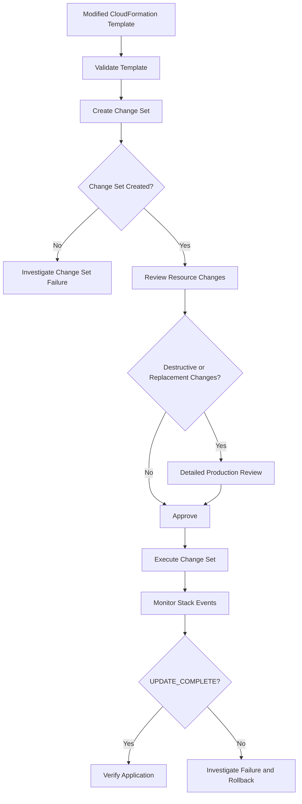

# 02- Change Sets and Safe Updates

## Overview

AWS CloudFormation change sets provide a controlled way to inspect the impact of a stack update before executing it. Instead of immediately applying a modified template, CloudFormation calculates the proposed resource changes and exposes them for review.

For production infrastructure, change sets are an important safety mechanism because a template change can result in:

- Resource creation.
- Resource modification.
- Resource deletion.
- Resource replacement.
- Configuration changes with application impact.
- Temporary duplication of resources during replacement.
- Changes to security boundaries.
- Changes to stateful resources such as databases.

A safe CloudFormation deployment should therefore separate **change calculation** from **change execution**:

```text
Template Change
      |
      v
Create Change Set
      |
      v
Review Proposed Changes
      |
      +---- Unsafe ----> Reject
      |
      v
Approve
      |
      v
Execute Change Set
      |
      v
Monitor Stack Events
      |
      v
Verify Final State
```

The key engineering principle is:

> A successful change-set creation does not mean the deployment will succeed. It means CloudFormation successfully calculated the proposed changes.

## Change Set Lifecycle

A change set typically follows this lifecycle:

```text
CREATE_PENDING
      |
      v
CREATE_IN_PROGRESS
      |
      v
CREATE_COMPLETE
      |
      v
REVIEW
      |
      v
EXECUTE
      |
      v
CloudFormation Stack Update
```

The important distinction is:

```text
Change Set
    |
    | describes what CloudFormation intends to do
    v
Execution
    |
    | actually changes AWS resources
    v
Stack
```

Creating a change set does not modify the resources in the stack.

Executing the change set does.

## What a Change Set Contains

A change set describes proposed changes at the resource level.

Typical change types include:

| Change | Meaning | Risk |
|---|---|---|
| `Add` | New resource will be created | Low to medium |
| `Modify` | Existing resource properties will change | Medium |
| `Remove` | Existing resource will be removed | High |
| `Import` | Existing resource will be brought under management | High |
| `Dynamic` | Change cannot be fully determined until execution | Requires review |

For modifications, CloudFormation can also indicate whether a resource requires replacement.

```text
Modify
  |
  +--> Replacement: False
  |       In-place update
  |
  +--> Replacement: True
          New resource + old resource lifecycle
```

Replacement is one of the most important fields to inspect during production review.

## Why Change Sets Matter

A CloudFormation template is declarative. A small-looking template modification can result in a significant infrastructure operation.

For example:

```yaml
Resources:
  Database:
    Type: AWS::RDS::DBInstance
    Properties:
      DBInstanceClass: db.r6g.large
```

Changing a property may result in:

```text
Modify
```

while another property may result in:

```text
Modify
Replacement: True
```

The difference is operationally significant.

An in-place modification might be relatively low risk:

```text
Existing RDS
     |
     v
Modify configuration
     |
     v
Same resource
```

A replacement can be much more disruptive:

```text
Existing RDS
     |
     v
Create replacement
     |
     v
Transition
     |
     v
Delete/retain old resource
```

The exact behavior depends on the resource type and property being changed.

## Creating a Change Set

For an existing stack, specify `UPDATE` as the change-set type:

```bash
aws cloudformation create-change-set \
  --stack-name my-backend-stack \
  --change-set-name release-2026-08-13 \
  --change-set-type UPDATE \
  --template-body file://template.yaml \
  --region ap-south-1
```

CloudFormation then calculates the proposed changes.

Check the change-set status:

```bash
aws cloudformation describe-change-set \
  --stack-name my-backend-stack \
  --change-set-name release-2026-08-13 \
  --region ap-south-1
```

A successful change-set creation does not execute the changes.

## Reviewing a Change Set

A useful CLI query is:

```bash
aws cloudformation describe-change-set \
  --stack-name my-backend-stack \
  --change-set-name release-2026-08-13 \
  --region ap-south-1 \
  --query 'Changes[].ResourceChange.{Action:Action,LogicalId:LogicalResourceId,Type:ResourceType,Replacement:Replacement}' \
  --output table
```

Example output:

```text
------------------------------------------------------------
|                    DescribeChangeSet                    |
+----------------------+----------+-----------------------+
| LogicalId            | Action   | Replacement           |
+----------------------+----------+-----------------------+
| BackendTaskDefinition| Modify   | False                 |
| BackendService       | Modify   | False                 |
| RedisSecurityGroup   | Modify   | False                 |
| ApplicationDatabase  | Modify   | True                  |
+----------------------+----------+-----------------------+
```

The database replacement should immediately trigger a deeper review.

## Inspecting Full Change Details

For detailed analysis:

```bash
aws cloudformation describe-change-set \
  --stack-name my-backend-stack \
  --change-set-name release-2026-08-13 \
  --region ap-south-1 \
  --output json
```

Useful fields include:

- `Action`
- `LogicalResourceId`
- `PhysicalResourceId`
- `ResourceType`
- `Replacement`
- `Details`
- `ChangeSource`
- `Scope`

The exact detail available varies by resource and property.

## Change Set Status

Change sets have their own lifecycle independent of stack status.

Common statuses include:

| Status | Meaning |
|---|---|
| `CREATE_PENDING` | Change-set creation has not started |
| `CREATE_IN_PROGRESS` | CloudFormation is calculating changes |
| `CREATE_COMPLETE` | Change set was created successfully |
| `FAILED` | Change-set creation failed |
| `DELETE_PENDING` | Change-set deletion is pending |
| `DELETE_IN_PROGRESS` | Change-set deletion is running |
| `DELETE_COMPLETE` | Change set was deleted |

A change set can fail to create even though the existing stack remains healthy.

For example:

```text
Existing Stack
UPDATE_COMPLETE
      |
      v
Create Change Set
      |
      v
FAILED
```

The failure does not necessarily mean the stack itself has been modified.

## Change Set Creation vs Execution

This distinction is fundamental.

| Operation | Changes resources? | Purpose |
|---|---:|---|
| Create change set | No | Calculate proposed changes |
| Describe change set | No | Inspect proposed changes |
| Execute change set | Yes | Apply changes |
| Delete change set | No | Remove unused change-set metadata |

Therefore:

```bash
aws cloudformation create-change-set ...
```

is fundamentally different from:

```bash
aws cloudformation execute-change-set ...
```

The first evaluates the proposed operation. The second performs it.

## Executing a Change Set

After review:

```bash
aws cloudformation execute-change-set \
  --stack-name my-backend-stack \
  --change-set-name release-2026-08-13 \
  --region ap-south-1
```

Then immediately monitor stack events:

```bash
aws cloudformation describe-stack-events \
  --stack-name my-backend-stack \
  --region ap-south-1
```

Check the final state:

```bash
aws cloudformation describe-stacks \
  --stack-name my-backend-stack \
  --region ap-south-1 \
  --query 'Stacks[0].StackStatus'
```

Expected successful state:

```text
UPDATE_COMPLETE
```

## Safe Update Workflow

A production deployment should generally follow:



This separates four concerns:

1. Template correctness.
2. Infrastructure impact analysis.
3. Change authorization.
4. Runtime deployment verification.

## Validate Before Creating the Change Set

Template validation should happen before change-set creation.

```bash
aws cloudformation validate-template \
  --template-body file://template.yaml \
  --region ap-south-1
```

For infrastructure repositories, validation should normally be part of CI/CD rather than performed manually.

A typical pipeline is:

```text
Git Push
   |
   v
CI
   |
   +--> Lint
   |
   +--> Validate Template
   |
   +--> Security Checks
   |
   v
Create Change Set
   |
   v
Review / Approval
   |
   v
Execute
```

Template validation verifies template structure. It does not prove that the eventual deployment will succeed.

## Replacement Risk

Replacement is one of the most important change-set fields.

A resource marked:

```text
Replacement: True
```

should be treated as a potentially destructive operation.

Examples of resources that require particularly careful review include:

- RDS databases.
- ElastiCache clusters.
- EC2 instances with state attached.
- EBS-backed resources.
- Load balancers.
- Network components.
- Security-sensitive IAM resources.
- Resources with externally consumed identifiers.

A replacement can affect:

- Physical resource IDs.
- IP addresses.
- DNS records.
- Connections.
- Persistent state.
- Security groups.
- Monitoring integrations.
- IAM relationships.

## Replacement and Stateful Resources

Stateful resources require special treatment.

Consider:

```text
Application
    |
    v
RDS PostgreSQL
```

If an update causes the RDS resource to be replaced, the operational impact can be much greater than a normal application deployment.

Before execution, review:

```text
Replacement?
   |
   +--> Snapshot behavior
   |
   +--> DeletionPolicy
   |
   +--> UpdateReplacePolicy
   |
   +--> Backup availability
   |
   +--> Recovery procedure
   |
   +--> Connection impact
```

CloudFormation change sets provide visibility into the replacement, but they do not make the replacement safe automatically.

## Resource Deletion

A change set containing:

```text
Action: Remove
```

requires explicit review.

For example:

```text
Modify template
      |
      v
Resource removed from template
      |
      v
Change Set
      |
      v
Action: Remove
```

The correct interpretation depends on the resource and its deletion policies.

Review:

- Whether the resource contains persistent data.
- Whether `DeletionPolicy` is configured.
- Whether `UpdateReplacePolicy` matters.
- Whether another service references the resource.
- Whether the resource is externally managed.
- Whether the resource should remain outside CloudFormation.

Do not approve a resource removal simply because the template no longer contains it.

## IAM Changes

IAM changes deserve additional scrutiny because infrastructure deployments can alter security boundaries.

Examples include:

- IAM policies.
- IAM roles.
- Instance profiles.
- Lambda execution roles.
- ECS task roles.
- Service roles.
- KMS permissions.

A change set should be reviewed for both:

```text
What resource changes?
        +
What permissions change?
```

A deployment that succeeds technically can still create a security incident if it introduces excessive permissions.

## Security Group Changes

Security group modifications can be operationally dangerous because they directly affect network access.

Example:

```text
Inbound TCP 443
Source: ALB Security Group
```

is materially different from:

```text
Inbound TCP 443
Source: 0.0.0.0/0
```

A change set review should therefore consider:

- Source CIDRs.
- Source security groups.
- Port ranges.
- Protocols.
- IPv4 and IPv6 rules.
- Public exposure.
- Database accessibility.

A change from private access to public access should be treated as a high-risk infrastructure change even if the change set itself is technically valid.

## No-Op Change Sets

A change set may contain no meaningful changes when the submitted template resolves to the same effective infrastructure configuration.

This can happen when:

- The template is unchanged.
- The wrong template was supplied.
- Parameters resolve to the same values.
- The intended property change does not affect the stack.
- The deployment references the wrong stack or environment.

This is an important CI/CD failure mode:

```text
Expected Change
      |
      v
Create Change Set
      |
      v
No meaningful changes
      |
      v
Deployment should not blindly proceed
```

The pipeline should explicitly handle no-change deployments rather than interpreting them as successful infrastructure updates.

## Parameter Changes

CloudFormation parameters can influence resource configuration without changing the template itself.

For example:

```yaml
Parameters:
  Environment:
    Type: String

  InstanceType:
    Type: String
```

A deployment can change:

```text
InstanceType
t3.medium
   |
   v
t3.large
```

while using the same template.

Always review the effective parameter values used by the change set.

In CI/CD, parameter values should be explicit and environment-specific:

```text
Development
    |
    +--> smaller resources

Staging
    |
    +--> production-like resources

Production
    |
    +--> production sizing
```

Do not rely on implicit local defaults for production infrastructure.

## Change Sets in CI/CD

A mature CI/CD workflow can use change sets as an approval boundary.

```text
Developer
    |
    v
Git Pull Request
    |
    v
CI Validation
    |
    v
CloudFormation Change Set
    |
    v
Automated Change Analysis
    |
    v
Approval
    |
    v
Execute Change Set
    |
    v
Deployment Verification
```

The change set can be stored as a deployment artifact or surfaced through the deployment system.

Useful metadata to associate with each change set:

- Git commit SHA.
- Pull request number.
- Environment.
- AWS account ID.
- AWS Region.
- Stack name.
- Change-set name.
- Deployment initiator.
- Creation timestamp.
- Approval identity.
- Execution timestamp.

This creates an auditable relationship between source code and infrastructure changes.

## Automated Risk Classification

For larger environments, CI/CD can classify change sets.

Example:

| Change | Suggested Risk |
|---|---|
| Add CloudWatch alarm | Low |
| Modify application configuration | Low to medium |
| Modify ECS service | Medium |
| Modify security group | Medium to high |
| Modify IAM policy | High |
| Remove security group rule | High |
| Replace EC2 instance | High |
| Replace RDS instance | Critical |
| Delete persistent storage | Critical |

The exact classification should be based on organizational risk policy rather than treating every resource identically.

A useful automated rule is:

```text
if Replacement == True:
    require elevated review
```

Additional rules can inspect:

```text
Action == Remove
ResourceType == IAM
ResourceType == RDS
Security group ingress changes
Public network exposure
```

## Safe Update Strategy for Backend Systems

Consider a production backend:

```text
                    CloudFormation
                         |
        +----------------+----------------+
        |                |                |
        v                v                v
       VPC              ECS             RDS
        |                |                |
        |                v                |
        |           Application           |
        |                |                |
        +----------------+----------------+
                         |
                         v
                       Redis
```

A normal application release may only require:

```text
ECS Task Definition
        |
        v
ECS Service
```

The change set should ideally show only the expected resources.

If the same release unexpectedly shows:

```text
Modify VPC
Replace RDS
Remove Security Group
Modify IAM Role
```

the deployment should stop.

The change set has exposed an unexpected infrastructure blast radius.

## Blast Radius Analysis

Before executing a production change, ask:

- Which resources change?
- Which resources are replaced?
- Which resources are deleted?
- Which resources depend on them?
- Which resources depend on external systems?
- Does a security boundary change?
- Does persistent state change?
- Does network connectivity change?
- Could availability be affected?
- Could the change increase AWS costs?
- Can the change be rolled back?

A useful mental model is:

```text
Changed Resource
      |
      v
Direct Dependencies
      |
      v
Indirect Dependencies
      |
      v
Application Impact
      |
      v
Business Impact
```

CloudFormation reports infrastructure changes, but engineers must reason about application and business impact.

## Change Set Limitations

Change sets are powerful but are not a complete deployment simulator.

They do not guarantee:

- That the deployment will succeed.
- That an AWS service will remain available.
- That a resource will stabilize.
- That application health checks will pass.
- That quotas will not be exceeded during execution.
- That external resources have not changed.
- That runtime application behavior will be correct.

For example:

```text
Change Set
    |
    v
"Modify ECS Service"
    |
    v
Execution
    |
    v
Task starts
    |
    v
Application fails health check
    |
    v
Deployment problem
```

The change set correctly described the infrastructure operation. It could not prove that the application would become healthy.

## Change Sets and Rollback

Change sets should be combined with rollback planning.

```text
Review Change Set
       |
       v
Identify risky changes
       |
       v
Execute
       |
       v
Monitor
       |
       +---- success ----> UPDATE_COMPLETE
       |
       +---- failure ----> UPDATE_ROLLBACK_IN_PROGRESS
                                  |
                                  v
                         UPDATE_ROLLBACK_COMPLETE
```

For high-risk updates, understand beforehand:

- Which resources can be replaced.
- Which resources cannot be safely rolled back.
- Whether external changes exist.
- Whether database recovery is available.
- Whether manual intervention could be required.

A change set improves visibility; it does not eliminate rollback risk.

## Operational Best Practices

### Use Descriptive Change-Set Names

Prefer:

```text
release-2026-08-13-1420
```

or:

```text
pr-1842-a7f31c2
```

over:

```text
test
```

A descriptive name improves auditability and troubleshooting.

### Review the Entire Change Set

Do not inspect only the first few changes.

Look for:

- Unexpected resources.
- Unexpected removals.
- Unexpected replacements.
- Security changes.
- Network changes.
- Stateful resource changes.

### Review Dependencies

A resource that looks harmless in isolation may be critical to another resource.

For example:

```text
Security Group
      |
      +--> ECS Service
      |
      +--> RDS
      |
      +--> Load Balancer
```

Changing the security group can therefore have a much larger blast radius than the change-set entry suggests.

### Keep Templates in Version Control

The deployment should be reproducible from:

```text
Git Commit
    +
Template
    +
Parameters
    +
Deployment Configuration
```

Avoid manually editing production templates outside version control.

### Separate Environments

Use environment-specific stacks or deployment configurations:

```text
dev
staging
production
```

Do not test risky changes directly against production.

### Use Approval Gates for High-Risk Changes

A mature pipeline can automatically require additional approval when the change set contains:

```text
Replacement: True
```

or:

```text
Action: Remove
```

or sensitive resource types such as:

```text
AWS::IAM::*
AWS::RDS::*
AWS::EC2::SecurityGroup*
```

## Common Mistakes

### Assuming Change-Set Creation Means the Update Is Safe

A change set only describes the planned infrastructure changes.

It does not guarantee runtime success.

### Ignoring Replacement

This is one of the most dangerous mistakes.

```text
Modify
Replacement: True
```

should never be treated as an ordinary configuration update.

### Ignoring Resource Removal

Removing a resource from the template can result in a resource deletion depending on the resource and deletion policy.

Always investigate `Remove`.

### Reviewing Only the Template Diff

A Git diff tells you:

```text
What changed in the source template
```

A CloudFormation change set tells you:

```text
What CloudFormation plans to do to resources
```

Both are useful and answer different questions.

### Assuming Rollback Is Always Possible

A resource may have been changed manually, deleted externally, or become impossible to restore.

Rollback planning is therefore part of safe deployment.

### Using Change Sets Without Application Verification

CloudFormation can report:

```text
UPDATE_COMPLETE
```

while the application still has problems.

For backend systems, infrastructure success must be followed by application-level verification.

## Production Checklist

Before executing a production change set:

- [ ] Correct AWS account verified.
- [ ] Correct AWS Region verified.
- [ ] Correct stack verified.
- [ ] Correct environment verified.
- [ ] Template validated.
- [ ] Parameters reviewed.
- [ ] Change set created successfully.
- [ ] All resource changes reviewed.
- [ ] All `Remove` operations reviewed.
- [ ] All replacement operations reviewed.
- [ ] IAM changes reviewed.
- [ ] Security group changes reviewed.
- [ ] Network changes reviewed.
- [ ] Stateful resources reviewed.
- [ ] Database backup/recovery strategy confirmed.
- [ ] Resource quotas considered.
- [ ] Application dependencies considered.
- [ ] Rollback behavior understood.
- [ ] Deployment approval obtained.
- [ ] Monitoring in place.
- [ ] Application verification plan ready.

## Interview Traps

### Does creating a change set modify the stack?

No. Creating a change set calculates and records the proposed changes. The changes are applied only when the change set is executed.

### Does a successful change set guarantee a successful deployment?

No. Runtime failures, service constraints, permissions, quotas, stabilization failures, and application health problems can still occur during execution.

### Why is `Replacement: True` important?

It indicates that CloudFormation expects the resource to be replaced rather than updated in place. This can affect availability, resource identifiers, persistent state, cost, dependencies, and rollback behavior.

### What is the difference between a template diff and a change set?

A template diff compares source files. A change set describes CloudFormation's calculated infrastructure operations after evaluating the template, parameters, and existing stack state.

### Can change sets be used for stack creation?

Yes. Change sets can be created for new stacks using the appropriate change-set type and workflow, allowing the proposed resources to be reviewed before the stack creation is executed.

### What is the safest way to deploy a high-risk infrastructure change?

A strong production workflow is:

```text
Version-controlled Template
        |
        v
Validate
        |
        v
Create Change Set
        |
        v
Review Blast Radius
        |
        v
Approve
        |
        v
Execute
        |
        v
Monitor Events
        |
        v
Verify Application
```

## Key Takeaways

- Change sets separate **planning** from **execution**.
- Creating a change set does not modify stack resources.
- Executing the change set applies the proposed infrastructure changes.
- Always review `Action`, `LogicalResourceId`, `ResourceType`, and `Replacement`.
- `Replacement: True` should trigger elevated review, especially for stateful resources.
- `Remove` operations require explicit investigation because persistent resources may be deleted depending on their deletion policies.
- Template validation and change-set creation answer different questions.
- A successful change set does not guarantee successful resource deployment or application health.
- Change sets should be integrated into CI/CD as an infrastructure approval boundary.
- IAM, security groups, networking, databases, and other security- or state-sensitive resources deserve additional review.
- Compare the expected source-code change with the actual CloudFormation change set to detect unexpected blast radius.
- Keep templates, parameters, and deployment configuration version-controlled and auditable.
- Production infrastructure changes should have an explicit rollback and application-verification strategy.