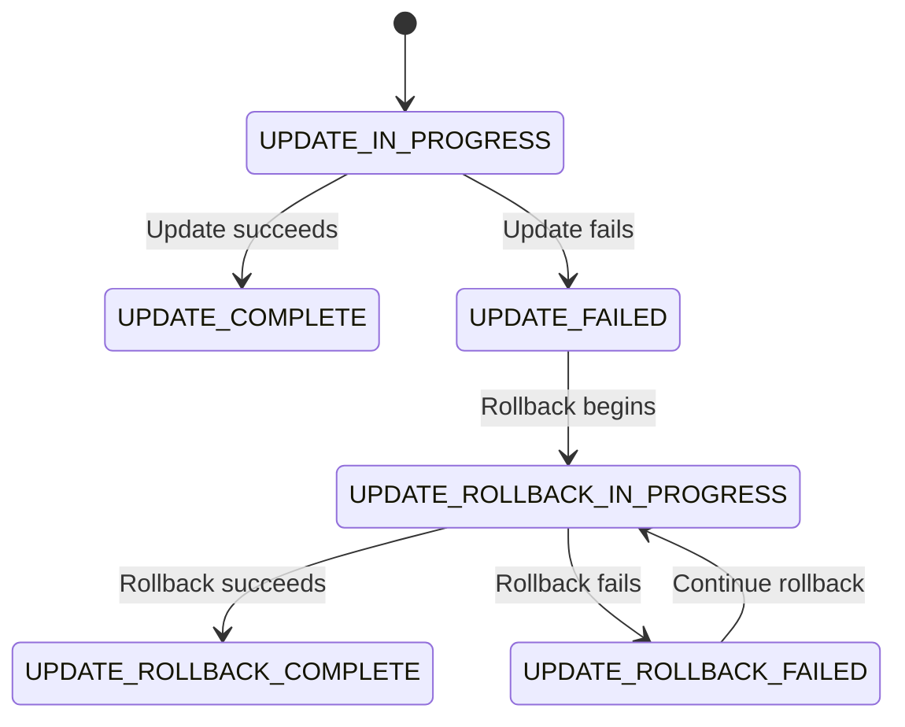
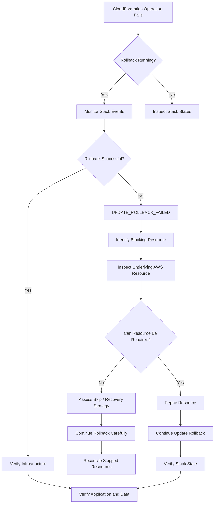

# 03- Rollbacks and Recovery

## Overview

CloudFormation rollback is the mechanism used to return a stack toward its previous known-good state when a stack operation fails. It is a critical reliability feature, but it should not be treated as a universal recovery mechanism.

A rollback can restore resources that CloudFormation can successfully restore, but it cannot automatically recover every type of failure. External changes, deleted resources, application-level failures, irreversible data mutations, and failed dependencies can require manual intervention.

For production systems, rollback should therefore be treated as one part of a broader recovery strategy:

```text
Deployment
    |
    v
CloudFormation Operation
    |
    +---- Success --------------------> Stable Stack
    |
    +---- Failure
             |
             v
        Automatic Rollback
             |
       +-----+------+
       |            |
       v            v
  Successful     Rollback
   Rollback      Failure
       |            |
       v            v
 Stable State    Recovery
```

The central operational principle is:

> CloudFormation rollback restores infrastructure state where possible; it does not guarantee application, data, or business-state recovery.

## Why Rollbacks Matter

CloudFormation operations can modify multiple resources as part of one stack update.

For example:

```text
CloudFormation Stack
        |
        +--> VPC
        +--> Security Groups
        +--> Load Balancer
        +--> ECS Service
        +--> IAM Roles
        +--> RDS
```

An update might successfully modify several resources before a later resource fails.

Without rollback, the stack could remain partially updated:

```text
Resource A  -> Updated
Resource B  -> Updated
Resource C  -> Failed
Resource D  -> Not updated
```

Rollback attempts to move the stack back toward its previous state:

```text
Resource A  -> Restore
Resource B  -> Restore
Resource C  -> Recover / Remediate
Resource D  -> Restore / Leave unchanged
```

This reduces the chance of leaving infrastructure in an unintended intermediate state.

## CloudFormation Stack States

Understanding stack states is essential when troubleshooting rollback.

Common update-related states include:

| Stack Status | Meaning |
|---|---|
| `UPDATE_IN_PROGRESS` | Stack update is running |
| `UPDATE_COMPLETE` | Update completed successfully |
| `UPDATE_FAILED` | Update failed |
| `UPDATE_ROLLBACK_IN_PROGRESS` | CloudFormation is attempting rollback |
| `UPDATE_ROLLBACK_FAILED` | Rollback itself failed |
| `UPDATE_ROLLBACK_COMPLETE` | Rollback completed successfully |
| `UPDATE_ROLLBACK_COMPLETE_CLEANUP_IN_PROGRESS` | CloudFormation is cleaning up failed update resources |
| `UPDATE_COMPLETE_CLEANUP_IN_PROGRESS` | Cleanup is occurring after an update |
| `ROLLBACK_IN_PROGRESS` | Initial stack creation is being rolled back |
| `ROLLBACK_COMPLETE` | Failed stack creation has been rolled back |

The most important distinction is:

```text
UPDATE_FAILED
```

versus:

```text
UPDATE_ROLLBACK_FAILED
```

The first indicates that the requested update failed.

The second indicates that CloudFormation also failed while trying to restore the previous state.

`UPDATE_ROLLBACK_FAILED` requires active investigation and often manual intervention.

## Initial Stack Creation Rollback

Stack creation can also fail.

A typical lifecycle is:

```text
CREATE_IN_PROGRESS
       |
       v
Resource creation
       |
       v
Failure
       |
       v
ROLLBACK_IN_PROGRESS
       |
       v
ROLLBACK_COMPLETE
```

For example:

```text
Create VPC
   |
   v
Create Security Groups
   |
   v
Create ECS Cluster
   |
   v
Create RDS
   |
   X---- Failure
        |
        v
Rollback previously created resources
```

The exact resources retained or deleted depend on the stack configuration and resource policies.

## Update Rollback Lifecycle

A normal failed update can follow:



Operationally:

```text
UPDATE_IN_PROGRESS
        |
        v
Resource failure
        |
        v
UPDATE_ROLLBACK_IN_PROGRESS
        |
        +---- successful ----> UPDATE_ROLLBACK_COMPLETE
        |
        +---- failure -------> UPDATE_ROLLBACK_FAILED
```

## Monitoring a Rollback

Start by inspecting the stack status:

```bash
aws cloudformation describe-stacks \
  --stack-name my-backend-stack \
  --region ap-south-1 \
  --query 'Stacks[0].StackStatus'
```

Then inspect recent events:

```bash
aws cloudformation describe-stack-events \
  --stack-name my-backend-stack \
  --region ap-south-1
```

A more focused query:

```bash
aws cloudformation describe-stack-events \
  --stack-name my-backend-stack \
  --region ap-south-1 \
  --query 'StackEvents[].{Time:Timestamp,LogicalId:LogicalResourceId,Status:ResourceStatus,Reason:ResourceStatusReason}' \
  --output table
```

The `ResourceStatusReason` is often the most useful field when identifying the original failure.

## Find the First Meaningful Failure

CloudFormation events are chronological and can contain many secondary failures.

For example:

```text
ECS Service       UPDATE_FAILED
Load Balancer     UPDATE_FAILED
Target Group      UPDATE_FAILED
Stack              UPDATE_FAILED
```

The root cause might actually be:

```text
ECS Task
    |
    X
Container failed health check
```

The later failures may simply be consequences.

A practical troubleshooting approach is:

1. Identify the first resource that entered a failed state.
2. Read its `ResourceStatusReason`.
3. Identify dependencies of that resource.
4. Inspect the underlying AWS service.
5. Determine whether the failure is transient, configuration-related, permission-related, or destructive.
6. Only then decide whether to continue rollback or repair the stack.

## Stack Events Are the Primary Starting Point

CloudFormation events provide the stack-level timeline.

Example:

```text
08:01:10 ECSService UPDATE_IN_PROGRESS
08:01:42 TaskDefinition UPDATE_COMPLETE
08:02:15 ECSService UPDATE_FAILED
08:02:16 CloudFormation UPDATE_ROLLBACK_IN_PROGRESS
08:02:30 ECSService UPDATE_IN_PROGRESS
08:02:51 ECSService UPDATE_FAILED
08:02:52 CloudFormation UPDATE_ROLLBACK_FAILED
```

This timeline tells you two different things:

```text
Original Failure
      |
      v
Why the update failed

Rollback Failure
      |
      v
Why CloudFormation could not restore the previous state
```

Both must be investigated.

## Rollback vs Application Recovery

CloudFormation operates at the infrastructure level.

Consider:

```text
CloudFormation
      |
      v
ECS Service
      |
      v
Django Application
      |
      v
PostgreSQL
```

CloudFormation may successfully restore the ECS service configuration while the application has already performed a database migration.

For example:

```text
Deployment
    |
    v
Database migration
    |
    v
Application deployment
    |
    X---- Application fails
    |
    v
CloudFormation rollback
```

The application infrastructure may return to its previous configuration, but the database schema may not automatically return to its previous state.

Therefore:

> Infrastructure rollback and application rollback are separate concerns.

## Database Rollback Considerations

Database resources require special care.

A CloudFormation rollback does not mean:

```text
Database schema
     |
     v
Automatically restored to previous schema
```

Database schema changes should have their own migration and recovery strategy.

For PostgreSQL-backed applications, a safer deployment model is often:

```text
Backward-compatible migration
        |
        v
Deploy application
        |
        v
Verify application
        |
        v
Remove obsolete schema later
```

This reduces dependence on destructive database rollback.

Avoid designing production deployments around the assumption that a CloudFormation rollback can undo arbitrary database changes.

## DeletionPolicy and UpdateReplacePolicy

CloudFormation resource lifecycle behavior can be influenced by resource policies.

Example:

```yaml
Resources:
  Database:
    Type: AWS::RDS::DBInstance
    DeletionPolicy: Snapshot
    UpdateReplacePolicy: Snapshot
    Properties:
      DBInstanceClass: db.r6g.large
```

`DeletionPolicy` controls what happens when a resource is removed from the stack or the stack is deleted.

`UpdateReplacePolicy` controls what happens to the old physical resource when CloudFormation replaces a resource during an update.

These policies are especially important for stateful resources.

Typical considerations:

| Resource | Important consideration |
|---|---|
| RDS | Snapshot / retention |
| S3 | Object retention |
| DynamoDB | Point-in-time recovery |
| EBS | Snapshot |
| Secrets | Retention and recovery |
| Logs | Retention requirements |

The correct policy depends on organizational recovery requirements.

## Rollback Triggers

CloudFormation can use rollback triggers to monitor specified AWS resources during stack operations.

The concept is:

```text
Stack Update
     |
     v
CloudFormation monitors configured signals
     |
     +---- Healthy ----> Continue
     |
     +---- Unhealthy --> Rollback
```

Rollback triggers can be useful when infrastructure changes need to be coupled with operational health signals.

However, they do not replace application-level deployment verification.

A healthy CloudFormation operation can still produce an unhealthy backend application if the relevant health signal is not represented by the rollback configuration.

## Automatic Rollback vs Manual Recovery

Automatic rollback is useful when the previous state is known and CloudFormation can restore it.

Manual recovery becomes necessary when:

- Rollback itself fails.
- A dependency was modified outside CloudFormation.
- A resource was manually deleted.
- An external system changed the resource.
- A resource cannot be restored automatically.
- The underlying AWS service has a persistent failure.
- The previous state is no longer valid.
- A stateful resource requires recovery from backup.

The distinction is:

| Situation | Preferred approach |
|---|---|
| Normal update failure | Allow automatic rollback |
| Transient service issue | Investigate and retry |
| `UPDATE_ROLLBACK_FAILED` | Repair and continue rollback |
| Data corruption | Use application/database recovery |
| External resource drift | Reconcile state |
| Irreversible change | Restore from backup or use forward recovery |

## Handling `UPDATE_ROLLBACK_FAILED`

`UPDATE_ROLLBACK_FAILED` means CloudFormation could not complete the rollback.

Inspect the stack first:

```bash
aws cloudformation describe-stacks \
  --stack-name my-backend-stack \
  --region ap-south-1
```

Then inspect events:

```bash
aws cloudformation describe-stack-events \
  --stack-name my-backend-stack \
  --region ap-south-1 \
  --output table
```

Identify the resource that prevents rollback.

Example:

```text
Stack
 |
 +--> ECS Service
 |
 +--> Security Group
 |
 +--> RDS
       |
       X---- rollback blocked
```

Do not repeatedly execute deployment commands while the stack is in a failed rollback state.

First determine what is blocking rollback.

## Continue Rollback

After resolving the underlying issue, CloudFormation can continue a failed rollback.

```bash
aws cloudformation continue-update-rollback \
  --stack-name my-backend-stack \
  --region ap-south-1
```

The operation asks CloudFormation to continue restoring resources toward the previous state.

Monitor it:

```bash
aws cloudformation describe-stacks \
  --stack-name my-backend-stack \
  --region ap-south-1 \
  --query 'Stacks[0].StackStatus'
```

Then inspect events:

```bash
aws cloudformation describe-stack-events \
  --stack-name my-backend-stack \
  --region ap-south-1 \
  --query 'StackEvents[].{Id:LogicalResourceId,Status:ResourceStatus,Reason:ResourceStatusReason}' \
  --output table
```

Do not use `continue-update-rollback` simply because the stack is inconveniently stuck. Understand the blocking resource first.

## Resources to Skip During Continue Rollback

CloudFormation provides a mechanism to skip resources that cannot currently be rolled back.

Conceptually:

```text
Rollback
   |
   +--> Resource A -> restored
   |
   +--> Resource B -> restored
   |
   +--> Resource C -> blocked
                 |
                 v
              Skip
```

Example:

```bash
aws cloudformation continue-update-rollback \
  --stack-name my-backend-stack \
  --resources-to-skip BackendService \
  --region ap-south-1
```

Skipping resources is a high-risk recovery operation.

The skipped resource may become inconsistent with the template and stack state.

After rollback completes, the stack can report success while the skipped resource still requires reconciliation.

Therefore:

> Skipping a resource is a recovery technique, not a permanent resolution.

Use it only when the operational impact is understood and a follow-up reconciliation plan exists.

## Drift After Recovery

A skipped or manually repaired resource can produce configuration drift.

Example:

```text
CloudFormation Template
        |
        v
Expected Configuration
        |
        X
        |
Actual AWS Resource
```

Run drift detection when appropriate:

```bash
aws cloudformation detect-stack-drift \
  --stack-name my-backend-stack \
  --region ap-south-1
```

Then obtain the drift status:

```bash
aws cloudformation describe-stack-drift-detection-status \
  --stack-drift-detection-id <drift-detection-id> \
  --region ap-south-1
```

If drift is detected, determine whether the desired state should be:

```text
Template
   |
   +--> Restore resource to template state
```

or:

```text
Actual resource
   |
   +--> Update template to desired state
```

Do not blindly overwrite production state without understanding why the drift occurred.

## Recovery Decision Tree



## Recovery Workflow

A production recovery procedure should follow a deliberate sequence.

### Confirm the AWS Context

Verify:

- AWS account.
- Region.
- Stack name.
- Environment.
- Deployment version.

For example:

```bash
aws sts get-caller-identity
```

Then:

```bash
aws cloudformation describe-stacks \
  --stack-name my-backend-stack \
  --region ap-south-1
```

This prevents troubleshooting the wrong stack or account.

### Inspect Stack Events

```bash
aws cloudformation describe-stack-events \
  --stack-name my-backend-stack \
  --region ap-south-1
```

Identify:

- First failure.
- Rollback failure.
- Resource status.
- Failure reason.
- Dependency relationship.

### Inspect the Underlying Resource

CloudFormation may only expose a summarized error.

For example:

```text
CloudFormation
    |
    v
ECS Service UPDATE_FAILED
```

The underlying ECS service may reveal:

```text
Tasks failed health checks
Container exited with code 1
Target group health check failed
```

Always inspect the underlying AWS service when CloudFormation's message is insufficient.

### Repair the Root Cause

Examples:

```text
IAM permission failure
        |
        v
Fix IAM policy

Security group issue
        |
        v
Restore required connectivity

Missing resource
        |
        v
Restore or recreate dependency

Quota problem
        |
        v
Reduce resource requirement or request quota
```

The objective is to make rollback possible, not merely to make the current deployment succeed.

### Continue Rollback

After the blocking condition has been corrected:

```bash
aws cloudformation continue-update-rollback \
  --stack-name my-backend-stack \
  --region ap-south-1
```

Continue monitoring until the stack reaches a stable state.

## Recovery State Verification

Do not stop when the CLI command returns successfully.

Verify the stack:

```bash
aws cloudformation describe-stacks \
  --stack-name my-backend-stack \
  --region ap-south-1 \
  --query 'Stacks[0].{Status:StackStatus,Reason:StackStatusReason}' \
  --output table
```

A successful rollback commonly results in:

```text
UPDATE_ROLLBACK_COMPLETE
```

Then verify:

- Critical resources.
- Networking.
- IAM.
- Load balancers.
- Application health.
- Database connectivity.
- Redis connectivity.
- Kafka connectivity where applicable.
- Background workers.
- External integrations.

## CloudFormation Rollback vs Forward Fix

Not every production failure should be solved by rollback.

Sometimes a forward fix is safer.

Example:

```text
Bad Application Deployment
        |
        v
CloudFormation Rollback
        |
        v
Database Schema Already Changed
        |
        X
Old Application Cannot Work
```

A safer strategy may be:

```text
Deploy compatible application fix
        |
        v
Restore service health
        |
        v
Perform controlled cleanup
```

Use rollback when:

- The previous infrastructure state is valid.
- Resources can be restored safely.
- The failure is isolated.
- Data compatibility is preserved.

Prefer forward recovery when:

- A database migration is irreversible.
- External systems already consumed new state.
- The old infrastructure configuration is no longer valid.
- A partial deployment has created dependencies that cannot safely be undone.

## Immutable Infrastructure Considerations

Immutable infrastructure can simplify rollback.

For application workloads:

```text
Old Task Definition
        |
        v
New Task Definition
        |
        v
Deployment
```

If the new version is unhealthy:

```text
New Version
    |
    X
    |
    v
Previous Version
```

This is generally safer than mutating the same application process or host repeatedly.

CloudFormation can manage the infrastructure lifecycle while ECS, Kubernetes, or another deployment mechanism handles application rollout behavior.

## Blue/Green Deployment Considerations

For high-availability backend systems, blue/green deployment can reduce rollback risk.

```text
                 Load Balancer
                      |
              +-------+-------+
              |               |
              v               v
            Blue            Green
          Current           New
          Version          Version
              |               |
              +-------+-------+
                      |
                      v
                  Database
```

Traffic can remain on the healthy environment while the new environment is validated.

If the new version fails:

```text
Traffic
   |
   v
Blue
```

If successful:

```text
Traffic
   |
   v
Green
```

CloudFormation rollback and application deployment rollback are complementary mechanisms rather than interchangeable ones.

## Nested Stack Recovery

Nested stacks introduce additional failure boundaries.

```text
Root Stack
    |
    +--> Network Stack
    |
    +--> Compute Stack
    |       |
    |       +--> ECS
    |
    +--> Data Stack
            |
            +--> RDS
```

A failure in a nested stack can cause the parent stack operation to fail.

When troubleshooting:

1. Identify the parent stack failure.
2. Identify the nested stack resource.
3. Inspect the nested stack directly.
4. Identify the first failing resource.
5. Repair the underlying problem.
6. Continue recovery from the appropriate stack level.

Do not assume that the parent stack event contains the complete root cause.

## Cross-Stack Dependency Recovery

Cross-stack exports can introduce dependency constraints.

```text
Network Stack
      |
      | Export VPC ID
      v
Application Stack
      |
      | Import VPC ID
      v
ECS Service
```

If a resource is exported and another stack imports it, modifying or removing the export can be blocked.

Before modifying shared infrastructure:

- Identify exports.
- Identify importing stacks.
- Determine dependency order.
- Avoid destructive changes to shared resources.
- Plan migrations before removing exports.

## External Changes and Rollback

Manual changes can interfere with rollback.

Example:

```text
CloudFormation expects:
Security Group Rule A

Operator manually changes:
Security Group Rule B
```

CloudFormation may encounter a state that differs from its expected state.

This is one reason production infrastructure should follow infrastructure-as-code ownership boundaries.

Prefer:

```text
Git
 |
 v
CloudFormation
 |
 v
AWS Resources
```

over:

```text
CloudFormation
       +
Manual Console Changes
       +
Ad-hoc CLI Changes
       |
       v
Unpredictable State
```

## Rollback and Drift

Rollback does not automatically eliminate all drift.

After recovery, ask:

```text
Does actual AWS state
match
CloudFormation's intended state?
```

If not, perform drift analysis.

Drift can originate from:

- Manual console changes.
- Direct AWS CLI/API changes.
- Failed recovery actions.
- Skipped resources.
- External automation.
- Resource-level changes outside CloudFormation.

A production recovery process should explicitly include drift assessment for high-risk failures.

## Monitoring and Alerting

CloudFormation stack failures should be observable.

Useful signals include:

- Stack status.
- Resource status.
- Stack events.
- Deployment duration.
- Rollback frequency.
- `UPDATE_ROLLBACK_FAILED`.
- `ROLLBACK_FAILED`.
- Change-set creation failures.

A deployment platform should alert on terminal failure states rather than only monitoring the deployment command itself.

Example:

```text
CI/CD
  |
  v
CloudFormation
  |
  +--> UPDATE_COMPLETE
  |
  +--> UPDATE_ROLLBACK_COMPLETE
  |
  +--> UPDATE_ROLLBACK_FAILED ---> Alert
```

`UPDATE_ROLLBACK_FAILED` should generally receive immediate operational attention.

## Security Considerations

Recovery operations often require elevated permissions.

Examples include:

- `cloudformation:ContinueUpdateRollback`
- Resource-specific modification permissions.
- IAM permissions.
- EC2/VPC permissions.
- RDS permissions.
- ECS permissions.

Avoid solving every recovery problem by granting unrestricted administrative access.

Use controlled break-glass access where appropriate and audit:

- Who initiated recovery.
- Which stack was modified.
- Which resources were changed.
- Which permissions were used.
- What manual intervention occurred.

Recovery should improve availability without creating an uncontrolled security boundary.

## Disaster Recovery Considerations

CloudFormation rollback is not disaster recovery.

Rollback handles failed infrastructure operations.

Disaster recovery handles larger failure scenarios such as:

- Region failure.
- Data loss.
- Corrupted state.
- Account compromise.
- Irrecoverable infrastructure loss.

A production DR strategy should separately address:

```text
Infrastructure
    |
    +--> CloudFormation templates

Data
    |
    +--> RDS backups
    +--> S3 versioning
    +--> DynamoDB recovery
    +--> EBS snapshots

Application
    |
    +--> Container images
    +--> Source code
    +--> Deployment artifacts

Secrets
    |
    +--> Managed secret storage
    +--> Recovery procedures
```

CloudFormation provides reproducible infrastructure, but the data and application recovery strategy must exist independently.

## Common Mistakes

### Treating Rollback as a Universal Undo Button

Rollback cannot reverse every external or stateful operation.

A database migration, external API side effect, or manually changed resource may not be reversible through CloudFormation.

### Repeatedly Retrying the Deployment

If the stack is in:

```text
UPDATE_ROLLBACK_FAILED
```

starting another update without repairing the blocking resource is usually the wrong action.

First recover the stack.

### Skipping Resources Without a Reconciliation Plan

`--resources-to-skip` can leave the stack and actual resource state inconsistent.

Always document:

- Why the resource was skipped.
- What its actual state is.
- What the template expects.
- How reconciliation will occur.

### Ignoring Application State

Infrastructure can roll back while application state remains changed.

Database migrations are the classic example.

### Assuming `UPDATE_ROLLBACK_COMPLETE` Means the Application Is Healthy

It means CloudFormation completed its rollback.

It does not prove:

- API health.
- Database health.
- Background worker health.
- Cache health.
- Message processing health.
- Business transaction correctness.

### Manually Editing Resources Without Recording the Change

Manual recovery can be necessary, but undocumented manual changes create future drift and make subsequent deployments harder to reason about.

Record every emergency intervention.

## Production Recovery Checklist

### Before Recovery

- [ ] Confirm AWS account.
- [ ] Confirm AWS Region.
- [ ] Confirm stack name.
- [ ] Record current stack status.
- [ ] Capture recent stack events.
- [ ] Identify the first failure.
- [ ] Identify the rollback failure, if present.
- [ ] Identify affected resources.
- [ ] Check dependencies.
- [ ] Check recent manual changes.
- [ ] Check application health.
- [ ] Check database state.

### During Recovery

- [ ] Repair the actual blocking condition.
- [ ] Avoid unrelated infrastructure changes.
- [ ] Use least-privilege recovery permissions.
- [ ] Continue rollback only after understanding the failure.
- [ ] Avoid skipping resources unless necessary.
- [ ] Record all manual interventions.
- [ ] Monitor CloudFormation events continuously.

### After Recovery

- [ ] Confirm stable stack status.
- [ ] Verify critical AWS resources.
- [ ] Verify application health.
- [ ] Verify database connectivity.
- [ ] Verify background workers.
- [ ] Verify cache and messaging systems.
- [ ] Check for drift.
- [ ] Reconcile skipped resources.
- [ ] Document root cause.
- [ ] Document recovery actions.
- [ ] Update deployment procedures if required.

## Interview Traps

### Does CloudFormation rollback guarantee that the previous system state is restored?

No. CloudFormation attempts to restore managed infrastructure resources, but application state, database changes, external systems, and manually modified resources may not be reversible.

### What is `UPDATE_ROLLBACK_FAILED`?

It means the stack update failed and CloudFormation was also unable to complete the rollback.

### What should you do with `UPDATE_ROLLBACK_FAILED`?

Identify the resource preventing rollback, repair the underlying condition, and then use `continue-update-rollback` when appropriate.

### Should you immediately skip a failing resource?

No. Skipping a resource can leave it inconsistent with the CloudFormation template and should be treated as a controlled recovery technique.

### Is CloudFormation rollback the same as application rollback?

No. CloudFormation manages infrastructure state. Application deployment systems and database migration strategies may require separate rollback or forward-recovery mechanisms.

### Why can a rollback fail after the original update failed?

The rollback is another set of infrastructure operations. The previous state may no longer be reachable because of manual changes, deleted resources, dependency failures, service constraints, or other environmental conditions.

### Is rollback a disaster recovery strategy?

No. Rollback handles failed infrastructure operations. Disaster recovery addresses larger failures such as data loss, regional outages, or irrecoverable infrastructure loss.

## Key Takeaways

- CloudFormation rollback attempts to restore infrastructure toward its previous known-good state.
- `UPDATE_FAILED` and `UPDATE_ROLLBACK_FAILED` represent different operational problems.
- Always inspect CloudFormation stack events to identify the first meaningful failure.
- A rollback can fail because the underlying resource cannot be restored to its previous state.
- `UPDATE_ROLLBACK_FAILED` requires root-cause analysis before continuing recovery.
- `continue-update-rollback` should be used only after understanding and addressing the blocking condition.
- Skipping resources is a controlled recovery mechanism, not a permanent fix.
- Skipped or manually repaired resources may require drift detection and reconciliation.
- CloudFormation rollback does not automatically undo database schema changes or external application side effects.
- Infrastructure rollback and application rollback are separate concerns.
- Stateful resources such as RDS require explicit backup, retention, and recovery planning.
- `DeletionPolicy` and `UpdateReplacePolicy` should be designed deliberately for persistent resources.
- Forward recovery can be safer than rollback when changes are irreversible or the previous state is no longer valid.
- CloudFormation rollback is not a substitute for disaster recovery.
- Production recovery should verify infrastructure, application health, data integrity, dependencies, and drift after the stack reaches a stable state.