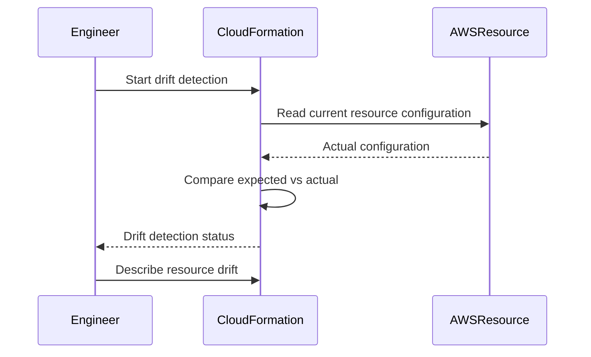
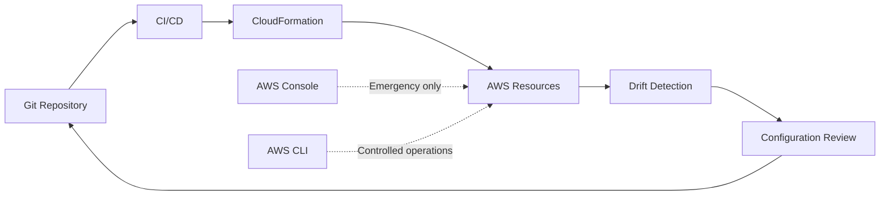
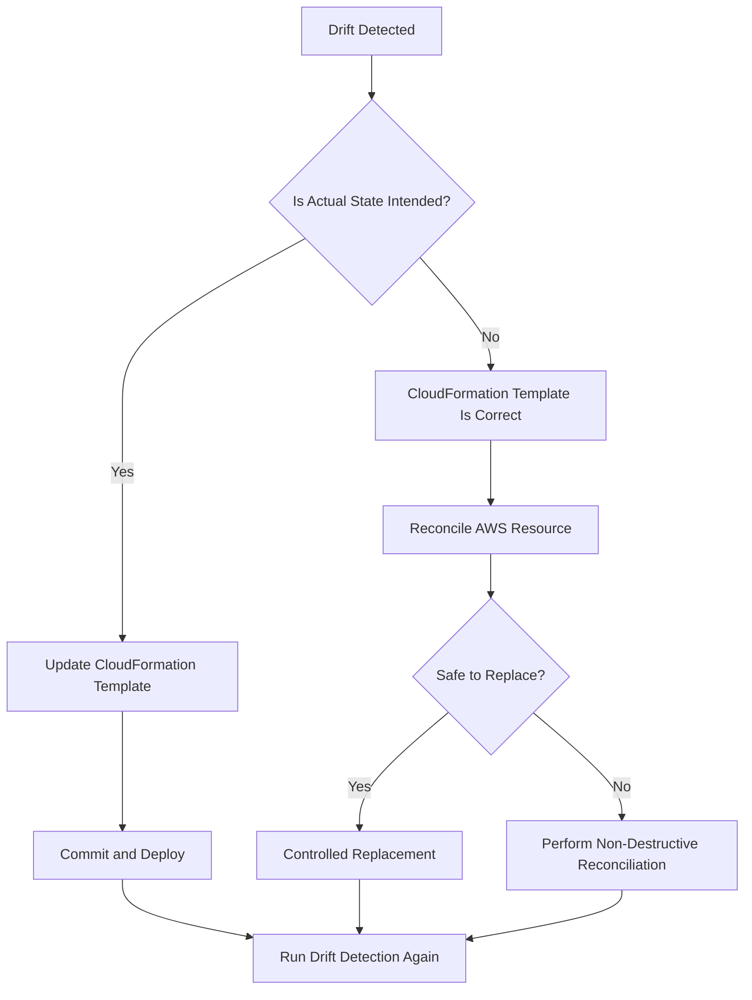
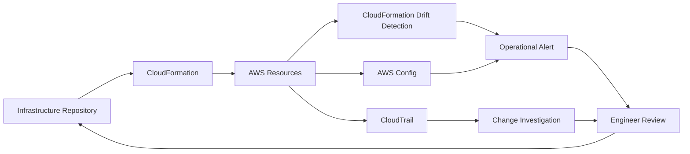

# 04- Drift Detection and Configuration Management

## Overview

AWS CloudFormation drift detection identifies differences between the configuration defined by a CloudFormation template and the current configuration of supported resources in AWS.

Drift occurs when a resource managed by CloudFormation is changed outside CloudFormation, for example through:

- AWS Management Console
- AWS CLI
- AWS SDK/API
- Another automation system
- Manual emergency remediation

The desired configuration is represented by the CloudFormation template:

```text
Git Repository
      |
      v
CloudFormation Template
      |
      v
Desired Infrastructure State
      |
      v
AWS Resources
```

If an operator changes an AWS resource directly:

```text
CloudFormation Template
        |
        | Expected
        v
   Security Group
        ^
        |
        | Manual change
        |
   AWS Console
```

the actual resource can diverge from the configuration CloudFormation expects.

Drift detection is therefore a configuration-management control, not merely a troubleshooting feature.

## Why Drift Matters

Infrastructure-as-code depends on a predictable relationship between declared configuration and deployed infrastructure.

Without drift detection, an environment can gradually become:

```text
Git
 |
 v
CloudFormation Template
 |
 | expected
 v
Configuration A

AWS Resource
 |
 | actual
 v
Configuration B
```

This creates operational problems:

- Future deployments may behave unexpectedly.
- Engineers may troubleshoot the wrong configuration.
- Security controls may be weakened.
- Production and staging environments can diverge.
- Disaster recovery becomes less predictable.
- Infrastructure changes become difficult to audit.
- Engineers may unknowingly overwrite manual fixes during a deployment.

For production systems, the preferred model is:

```text
Git
 |
 v
CloudFormation
 |
 v
AWS Resources
```

rather than allowing independent configuration paths:

```text
Git
   \
    \--> CloudFormation
     \
      \--> AWS Console
       \
        \--> CLI
         \
          \--> Other Automation
```

## Desired State vs Actual State

CloudFormation operates around a declared desired state.

Consider a security group:

```yaml
Resources:
  ApiSecurityGroup:
    Type: AWS::EC2::SecurityGroup
    Properties:
      GroupDescription: API security group
      SecurityGroupIngress:
        - IpProtocol: tcp
          FromPort: 443
          ToPort: 443
          CidrIp: 10.0.0.0/16
```

The template declares that TCP port `443` should be available from `10.0.0.0/16`.

An administrator manually adds:

```text
TCP 22
0.0.0.0/0
```

The actual AWS configuration is now different from the declared configuration.

```text
CloudFormation
Expected:
  TCP 443 -> 10.0.0.0/16

AWS
Actual:
  TCP 443 -> 10.0.0.0/16
  TCP 22  -> 0.0.0.0/0

                    |
                    v
                  DRIFT
```

This is particularly dangerous when the manual change weakens security.

## What Drift Detection Does

A drift detection operation compares the current configuration of supported resources against the expected configuration represented by the CloudFormation stack.

The high-level process is:



The result can identify whether the stack or individual resources are:

- `IN_SYNC`
- `DRIFTED`
- `NOT_CHECKED`
- `NOT_CHECKED` because the resource has not been evaluated or is not eligible for the requested check

The exact set of supported properties and resource types depends on CloudFormation drift-detection support.

## Stack Drift Status

Start drift detection with:

```bash
aws cloudformation detect-stack-drift \
  --stack-name my-backend-stack \
  --region ap-south-1
```

CloudFormation returns a drift detection ID.

Example:

```text
{
    "StackDriftDetectionId": "example-drift-detection-id"
}
```

The operation is asynchronous.

Check its progress:

```bash
aws cloudformation describe-stack-drift-detection-status \
  --stack-drift-detection-id example-drift-detection-id \
  --region ap-south-1
```

A completed detection can produce a stack-level status such as:

```text
DETECTION_COMPLETE
```

along with the resulting stack drift status.

## Detecting Stack Drift

A practical workflow is:

```text
Start Detection
      |
      v
Receive Detection ID
      |
      v
Wait for Detection
      |
      v
Check Detection Status
      |
      v
Inspect Stack Drift
      |
      v
Inspect Resource Drift
      |
      v
Decide Reconciliation Strategy
```

Example:

```bash
DRIFT_ID=$(aws cloudformation detect-stack-drift \
  --stack-name my-backend-stack \
  --region ap-south-1 \
  --query 'StackDriftDetectionId' \
  --output text)

aws cloudformation describe-stack-drift-detection-status \
  --stack-drift-detection-id "$DRIFT_ID" \
  --region ap-south-1
```

The detection request itself does not immediately provide the final drift result.

## Inspecting Stack Drift

After detection completes:

```bash
aws cloudformation describe-stack-resource-drifts \
  --stack-name my-backend-stack \
  --region ap-south-1
```

For a more useful table:

```bash
aws cloudformation describe-stack-resource-drifts \
  --stack-name my-backend-stack \
  --region ap-south-1 \
  --query 'StackResourceDrifts[].{LogicalId:LogicalResourceId,Type:ResourceType,Status:StackResourceDriftStatus}' \
  --output table
```

This helps identify resources whose actual configuration differs from the expected configuration.

## Resource-Level Drift

A stack can contain many resources:

```text
Stack
 |
 +--> VPC
 +--> Security Group
 +--> Load Balancer
 +--> ECS Service
 +--> IAM Role
 +--> RDS
```

A drift operation can identify which resources are affected.

Example:

| Logical Resource | Type | Drift Status |
|---|---|---|
| `Vpc` | `AWS::EC2::VPC` | `IN_SYNC` |
| `ApiSecurityGroup` | `AWS::EC2::SecurityGroup` | `DRIFTED` |
| `LoadBalancer` | `AWS::ElasticLoadBalancingV2::LoadBalancer` | `IN_SYNC` |
| `ApiService` | `AWS::ECS::Service` | `IN_SYNC` |

This is more actionable than looking only at the stack-level status.

## Inspecting Property Differences

For a drifted resource, inspect the detailed drift information:

```bash
aws cloudformation describe-stack-resource-drifts \
  --stack-name my-backend-stack \
  --region ap-south-1 \
  --query 'StackResourceDrifts[?StackResourceDriftStatus==`MODIFIED` || StackResourceDriftStatus==`DELETED` || StackResourceDriftStatus==`IN_SYNC`]'
```

The detailed response can contain property-level differences.

Conceptually:

```text
Property              Expected          Actual
-----------------------------------------------------
SecurityGroupIngress  HTTPS only        HTTPS + SSH
Tags                  environment=prod  environment=prod
```

Property-level information is important because a resource can be drifted for a single property while the remainder of its configuration remains consistent.

## Drift Status Values

Common resource drift states include:

| Status | Meaning |
|---|---|
| `IN_SYNC` | Actual resource configuration matches the expected configuration for the properties checked |
| `MODIFIED` | One or more properties differ |
| `DELETED` | The resource no longer exists |
| `NOT_CHECKED` | Drift has not been checked or the resource was not evaluated |

The important distinction is:

```text
MODIFIED
```

means the resource exists but differs from the expected configuration.

```text
DELETED
```

means CloudFormation expected the resource to exist but the underlying resource is absent.

## Common Sources of Drift

### AWS Console Changes

An engineer modifies:

```text
EC2
Security Group
IAM
RDS
ECS
```

through the AWS Management Console.

The resource can immediately diverge from the template.

### AWS CLI Changes

For example:

```bash
aws ec2 authorize-security-group-ingress ...
```

If the security group is CloudFormation-managed, this can create drift.

### SDK/API Changes

Python applications or automation may directly modify AWS resources:

```python
import boto3

ec2 = boto3.client("ec2")

ec2.authorize_security_group_ingress(
    GroupId="sg-0123456789abcdef0",
    IpPermissions=[
        {
            "IpProtocol": "tcp",
            "FromPort": 443,
            "ToPort": 443,
            "IpRanges": [{"CidrIp": "10.0.0.0/16"}],
        }
    ],
)
```

Direct API changes to CloudFormation-managed resources should generally be avoided unless they are explicitly part of the resource's supported operational model.

### Emergency Production Changes

Emergency changes are a legitimate source of drift.

For example:

```text
Production outage
      |
      v
Engineer changes security group
      |
      v
Service recovers
      |
      v
CloudFormation template remains unchanged
      |
      v
Drift
```

The mistake is not necessarily the emergency intervention.

The mistake is leaving the infrastructure permanently inconsistent afterward.

## Configuration Management Model

A mature CloudFormation environment should establish clear ownership.



The desired operational loop is:

```text
Change required
      |
      v
Modify CloudFormation template
      |
      v
Code review
      |
      v
CI/CD
      |
      v
CloudFormation
      |
      v
AWS
```

This keeps infrastructure changes auditable and reproducible.

## Drift Is Not Always a Problem

Not every difference between expected and actual configuration is necessarily an operational failure.

Some AWS resources have properties that can change as part of normal service behavior or may not be fully represented in CloudFormation's drift model.

Examples include:

- Runtime-generated attributes.
- Service-managed configuration.
- Properties not included in drift evaluation.
- Resources with externally managed lifecycle components.

Therefore:

> A drift result should be interpreted in the context of resource ownership and CloudFormation's support for that resource and property.

Do not automatically overwrite every drifted resource.

## Drift Detection Limitations

Drift detection has important limitations.

### Not Every Resource Property Is Evaluated

CloudFormation drift detection does not mean every possible AWS configuration detail is continuously compared.

Only supported resources and properties participate in the relevant drift detection behavior.

Always verify AWS documentation for the resource type when drift detection is important to a production control.

### Drift Detection Is Not Continuous

Running:

```bash
aws cloudformation detect-stack-drift
```

starts a detection operation.

It does not create a continuous real-time watcher.

For continuous governance, combine CloudFormation with other AWS governance and configuration-management capabilities.

### Drift Detection Does Not Fix Drift

This is a critical distinction:

```text
Detect Drift
    |
    v
Identify Difference
```

It does not automatically mean:

```text
Detect Drift
    |
    v
Repair Resource
```

Detection and remediation are separate operations.

## Drift Reconciliation Strategies

Once drift is detected, there are generally three possible strategies.

### Update the Template

Use this when the actual configuration is the intended new state.

```text
Actual AWS State
       |
       v
Desired State
       |
       v
Update CloudFormation Template
       |
       v
Git
```

Example:

```text
Manual change:
HTTPS + additional approved CIDR

Decision:
The additional CIDR is legitimate.

Action:
Update template to include it.
```

This makes the desired state explicit and auditable.

### Reapply the CloudFormation Configuration

Use this when the template represents the correct desired state.

```text
CloudFormation Template
        |
        v
Correct Desired State
        |
        v
CloudFormation Update
        |
        v
AWS Resource
```

The exact remediation behavior depends on the resource and property.

### Replace the Resource

For severe or complicated drift, replacement may be safer than incremental reconciliation.

This must be evaluated carefully for stateful resources.

For example:

```text
Stateless ECS Service
    |
    v
Replacement may be acceptable

RDS Database
    |
    v
Replacement may be highly destructive
```

Never assume resource replacement is safe simply because CloudFormation can perform it.

## Drift Remediation Decision Tree



## Drift and Change Sets

Change sets and drift detection solve different problems.

| Capability | Change Set | Drift Detection |
|---|---|---|
| Primary purpose | Preview a proposed CloudFormation change | Detect differences between expected and actual state |
| Triggered by | Proposed template/parameter change | Current resource state |
| Answers | "What will this deployment change?" | "Has the resource changed outside CloudFormation?" |
| Main use | Deployment safety | Configuration consistency |
| Reconciles resources | No | No |
| Production use | Before risky updates | During configuration governance |

They work well together:

```text
Drift Detection
      |
      v
Understand current state
      |
      v
Update template if required
      |
      v
Create Change Set
      |
      v
Review proposed changes
      |
      v
Execute
```

## Drift and Stack Updates

A stack update can become more difficult when the actual resource state has diverged significantly from the template.

Example:

```text
Template
  |
  | expects
  v
Security Group A

Actual AWS
  |
  | contains
  v
Security Group B
```

A later CloudFormation update may attempt to reconcile the resource in ways that surprise operators.

Therefore, drift should be addressed before high-risk infrastructure changes.

## Drift and Nested Stacks

Nested stacks introduce multiple configuration boundaries.

```text
Root Stack
    |
    +--> Network Nested Stack
    |
    +--> Compute Nested Stack
    |
    +--> Data Nested Stack
```

A drift investigation should determine:

- Which stack owns the resource.
- Whether the parent stack is affected.
- Whether the nested stack itself is drifted.
- Whether the resource was modified independently.
- Whether a cross-stack dependency exists.

Avoid fixing a nested resource directly without understanding the ownership boundary.

## Drift and Cross-Stack Exports

Cross-stack dependencies can make configuration reconciliation more complex.

```text
Network Stack
      |
      | Export: VpcId
      v
Application Stack
      |
      | ImportValue
      v
ECS Service
```

If the network configuration changes manually, the application stack can continue referencing an infrastructure object whose configuration no longer matches the expected architecture.

When reconciling drift:

- Identify exports.
- Identify importers.
- Understand dependency order.
- Avoid deleting shared resources.
- Use controlled stack updates.

## Drift and IAM

IAM drift deserves special attention because unauthorized or accidental permission changes can become security incidents.

Example:

```text
CloudFormation:
Allow application role -> S3 bucket

Actual:
Allow application role -> S3 bucket
Allow application role -> unrelated sensitive bucket
```

The infrastructure may continue functioning while its security posture has degraded.

When IAM-related drift is detected:

1. Determine whether the change was authorized.
2. Identify who or what made the change.
3. Review CloudTrail.
4. Compare against the intended policy.
5. Reconcile the policy.
6. Investigate whether the change indicates a broader security issue.

Do not treat security-sensitive drift as merely an infrastructure housekeeping task.

## Drift and Security Groups

Security groups are another high-risk drift area.

Example:

```text
Expected:
443 from application network

Actual:
443 from application network
22 from 0.0.0.0/0
```

A drift detection result can reveal the configuration difference, but remediation should also consider:

- Who made the change.
- Why it was made.
- Whether the port is still exposed.
- Whether other security groups were changed.
- Whether the change violated security policy.

Infrastructure drift can therefore become a security monitoring signal.

## Drift and Secrets

Secrets should not be managed by embedding sensitive values directly into CloudFormation templates.

Avoid:

```yaml
Password: SuperSecretPassword
```

Prefer managed secret mechanisms and references appropriate to the service.

Drift analysis should distinguish between:

- Configuration metadata.
- Secret references.
- Actual secret values.
- Runtime-generated values.

The goal is to detect configuration inconsistency without unnecessarily exposing sensitive material.

## Drift and CI/CD

A production CI/CD pipeline can incorporate drift checks around important environments.

Example:

```text
Pull Request
    |
    v
CloudFormation Validation
    |
    v
Change Set
    |
    v
Deployment
    |
    v
Smoke Tests
    |
    v
Drift / Configuration Verification
```

A more conservative production workflow can periodically perform:

```text
Scheduled Drift Detection
        |
        v
DRIFTED?
   /        \
 No          Yes
 |            |
 v            v
Continue    Alert
              |
              v
        Investigate
              |
              v
        Reconcile
```

Do not automatically overwrite production resources simply because drift is detected.

## Continuous Configuration Governance

For mature environments, CloudFormation drift detection can be combined with broader governance controls.

Potential components include:

- CloudFormation drift detection.
- AWS Config.
- CloudTrail.
- IAM Access Analyzer.
- CI/CD controls.
- Service Control Policies.
- Security monitoring.
- Infrastructure code review.

A useful architecture is:



Each service answers a different question:

| Tool | Primary question |
|---|---|
| CloudFormation | What infrastructure should this stack manage? |
| Drift Detection | Does actual configuration differ from expected CloudFormation state? |
| AWS Config | Does resource configuration comply with defined rules? |
| CloudTrail | Who or what made an API-level change? |
| CI/CD | How should approved infrastructure changes be deployed? |

## Configuration Ownership

A production environment should explicitly define ownership.

Example:

| Resource | Owner | Change mechanism |
|---|---|---|
| VPC | Platform team | CloudFormation |
| ECS service | Backend/platform | CloudFormation + deployment pipeline |
| RDS | Platform/DBA | CloudFormation + controlled operations |
| Security groups | Platform/security | CloudFormation |
| Application configuration | Backend | CI/CD / managed configuration |
| Secrets | Security/platform | Secrets Manager |

Ownership reduces accidental drift.

The rule should be:

> Every infrastructure resource should have a clearly defined source of truth and an approved change mechanism.

## Emergency Change Procedure

Emergency changes are sometimes unavoidable.

A controlled emergency workflow is:

```text
Production Incident
       |
       v
Emergency AWS Change
       |
       v
Restore Service
       |
       v
Record Change
       |
       v
Update CloudFormation Template
       |
       v
Code Review
       |
       v
Deploy/Reconcile
       |
       v
Verify Drift
```

The dangerous workflow is:

```text
Production Incident
       |
       v
Manual AWS Change
       |
       v
Incident Resolved
       |
       X
No template update
       |
       v
Permanent Drift
```

Emergency access should not become an alternative infrastructure-management system.

## Monitoring and Alerting

Drift should be observable in environments where configuration consistency matters.

Useful signals include:

- Stack drift status.
- Resource drift status.
- Number of drifted resources.
- Time since drift was detected.
- Security-sensitive drift.
- Drift in production.
- Repeated drift on the same resource.

A useful operational model is:

```text
Production Stack
      |
      v
Scheduled Detection
      |
      v
Drift Found
      |
      +--> Low Risk ---> Ticket
      |
      +--> High Risk --> Alert
                         |
                         v
                   Immediate Review
```

Prioritize drift based on impact rather than treating every difference identically.

## Performance and Operational Considerations

Drift detection is an operational API operation and should not be treated as a zero-cost check.

For large environments:

- Avoid unnecessary repeated detection.
- Schedule checks according to risk.
- Prioritize production and security-sensitive stacks.
- Avoid triggering large numbers of concurrent checks without operational need.
- Store and review drift results appropriately.
- Use event-driven investigation when the source of the change is known.

Drift detection is most useful when integrated into a broader configuration-management process.

## High Availability Considerations

Drift detection itself does not provide high availability.

Its value is indirect:

```text
Consistent Infrastructure
        |
        v
Predictable Deployments
        |
        v
Reduced Configuration Surprises
        |
        v
Higher Operational Reliability
```

For highly available backend systems:

- Keep infrastructure reproducible.
- Avoid undocumented manual changes.
- Keep production templates version-controlled.
- Test infrastructure changes before production.
- Use multi-AZ architecture where appropriate.
- Maintain backups for stateful resources.
- Ensure recovery procedures do not depend on undocumented console changes.

## Disaster Recovery Considerations

CloudFormation templates are valuable disaster recovery artifacts because they describe infrastructure declaratively.

However:

```text
CloudFormation Template
        |
        v
Infrastructure Recovery
```

does not automatically recover:

```text
Database Data
Secrets
Application Artifacts
External Dependencies
Business State
```

A DR strategy should therefore preserve:

- CloudFormation templates.
- Parameter configuration.
- Container images.
- Application artifacts.
- Database backups.
- Secrets recovery procedures.
- DNS configuration.
- External integration configuration.
- Operational runbooks.

Drift detection improves confidence that the infrastructure being backed up conceptually matches the intended architecture.

## Common Mistakes

### Assuming Drift Detection Is Continuous

It is not a real-time configuration monitor.

Schedule or trigger detection according to operational requirements.

### Assuming Drift Detection Repairs Resources

Detection identifies differences. Remediation is a separate decision.

### Updating the Template to Match Every Drift

This can permanently encode an unauthorized or insecure manual change into infrastructure-as-code.

First determine whether the actual state is intended.

### Ignoring the Reason for Drift

A drifted IAM policy or security group may indicate a security problem rather than a harmless configuration difference.

Investigate the source of the change.

### Making Manual Changes Without Reconciliation

Emergency changes that are never reflected in the template create long-term configuration debt.

### Treating All Drift as Equally Dangerous

A harmless metadata difference and an open SSH port are not equivalent.

Prioritize based on:

- Security impact.
- Availability impact.
- Data impact.
- Business impact.
- Recoverability.

### Ignoring Unsupported Properties

A resource can appear consistent while configuration outside the drift detection model differs.

Understand the coverage and limitations of drift detection for critical resource types.

### Running Drift Detection Immediately Before Every Deployment

This can create unnecessary operational overhead.

Use risk-based scheduling and perform targeted checks when appropriate.

## Production Best Practices

### Establish a Single Source of Truth

For CloudFormation-managed infrastructure:

```text
Git
 |
 v
CloudFormation
 |
 v
AWS
```

The template and its version history should explain why infrastructure has its current configuration.

### Minimize Direct Resource Mutation

Prefer changing:

```text
CloudFormation Template
```

over:

```text
AWS Resource Directly
```

when the resource is CloudFormation-managed.

### Use Change Sets for Risky Reconciliation

Before executing a significant infrastructure correction:

```bash
aws cloudformation create-change-set \
  --stack-name my-backend-stack \
  --change-set-name reconcile-drift \
  --template-body file://template.yaml \
  --change-set-type UPDATE \
  --region ap-south-1
```

Review the change set before execution.

### Audit Emergency Changes

For emergency interventions, record:

- Time.
- Operator.
- Resource.
- Change.
- Reason.
- Incident/ticket.
- Reconciliation plan.

### Re-run Drift Detection After Reconciliation

After resolving a known drift condition:

```text
Remediation
    |
    v
CloudFormation Update
    |
    v
Drift Detection
    |
    v
IN_SYNC
```

Do not assume reconciliation succeeded simply because the deployment command succeeded.

### Protect Critical Stateful Resources

For RDS, S3, DynamoDB, and other stateful services:

- Maintain backups.
- Define retention policies.
- Test restoration.
- Avoid destructive reconciliation.
- Understand replacement behavior.
- Separate infrastructure recovery from data recovery.

## Practical Investigation Workflow

Use the following workflow when production drift is detected.

```text
1. Identify the affected stack
       |
       v
2. Detect/confirm drift
       |
       v
3. Identify drifted resource
       |
       v
4. Identify property-level difference
       |
       v
5. Determine who/what changed it
       |
       v
6. Decide desired state
       |
       +------ Actual is correct ------> Update template
       |
       +------ Template is correct ----> Reconcile resource
       |
       +------ Security incident ------> Investigate and contain
       |
       v
7. Deploy controlled change
       |
       v
8. Re-run drift detection
       |
       v
9. Confirm expected state
```

## Production Checklist

### Configuration Governance

- [ ] Every CloudFormation-managed resource has an identified owner.
- [ ] Infrastructure templates are stored in Git.
- [ ] Production changes normally go through CI/CD.
- [ ] Direct console changes are restricted.
- [ ] Emergency changes are documented.
- [ ] Emergency changes have a reconciliation process.

### Drift Detection

- [ ] Production stacks are periodically evaluated for drift.
- [ ] Critical resources receive appropriate monitoring.
- [ ] Drift detection limitations are understood.
- [ ] Drifted resources are investigated rather than blindly overwritten.
- [ ] Security-sensitive drift receives higher priority.

### Reconciliation

- [ ] Determine whether actual state or template state is correct.
- [ ] Review changes before execution.
- [ ] Use change sets for significant updates.
- [ ] Protect stateful resources from destructive replacement.
- [ ] Re-run drift detection after remediation.
- [ ] Record the final state and root cause.

### Security

- [ ] IAM drift is investigated.
- [ ] Security group drift is investigated.
- [ ] CloudTrail is available for change investigation.
- [ ] Emergency permissions are controlled.
- [ ] Secrets are not embedded directly in templates.
- [ ] Unauthorized infrastructure changes generate alerts where appropriate.

## Interview Traps

### What is CloudFormation drift?

Drift is a difference between the expected configuration represented by a CloudFormation-managed resource and the actual configuration of that resource in AWS.

### Does CloudFormation automatically detect drift?

No. Drift detection must be initiated or incorporated into an appropriate operational process.

### Does drift detection automatically fix drift?

No. It identifies differences; remediation is a separate operation.

### What causes drift?

Common causes include manual console changes, AWS CLI commands, SDK/API calls, external automation, and emergency production changes.

### Should every drifted resource be overwritten with the template configuration?

No. First determine whether the actual state or the template represents the intended configuration.

### How do you make an intentional manual change permanent?

If the manual state is the desired state, update the CloudFormation template to represent that configuration and deploy it through the normal infrastructure workflow.

### How is drift detection different from AWS Config?

CloudFormation drift detection compares CloudFormation's expected resource configuration with the actual resource configuration for supported resources and properties. AWS Config is a broader configuration and compliance service that evaluates resource configuration against rules and records configuration history.

### How can you determine who caused drift?

Use AWS CloudTrail and other operational audit sources to investigate API activity associated with the affected resource.

### Is drift detection a security control?

It can support security governance by identifying configuration differences, particularly around IAM, security groups, networking, and other security-sensitive resources. It should complement, not replace, dedicated security controls.

### Is drift detection the same as configuration compliance?

No. Drift detection answers whether actual configuration differs from CloudFormation's expected state. Compliance evaluates whether infrastructure satisfies defined organizational or security requirements.

## Key Takeaways

- CloudFormation drift is a difference between expected infrastructure configuration and actual AWS resource configuration.
- Drift commonly results from console changes, CLI/API operations, external automation, and emergency production intervention.
- Drift detection identifies configuration differences but does not automatically remediate them.
- Drift detection is not continuous real-time monitoring.
- Not every resource or property is necessarily covered by drift detection.
- Always determine whether the template or the actual AWS state represents the intended configuration before remediating drift.
- If the actual state is correct, update the CloudFormation template and deploy it through the normal infrastructure workflow.
- If the template is correct, reconcile the AWS resource carefully.
- Do not blindly encode unauthorized or insecure manual changes into the template.
- IAM and security-group drift can represent significant security issues and should be investigated accordingly.
- CloudTrail is useful for determining who or what made an infrastructure change.
- Change sets and drift detection solve different problems and work well together.
- Nested stacks and cross-stack exports require additional ownership and dependency analysis during reconciliation.
- Emergency manual changes should be documented and subsequently reconciled into infrastructure-as-code.
- Stateful resources require special care because reconciliation or replacement can cause data loss.
- Drift detection should be integrated into a broader configuration-management and governance strategy.
- A mature infrastructure workflow maintains a clear source of truth, controlled change paths, auditability, and repeatable reconciliation.