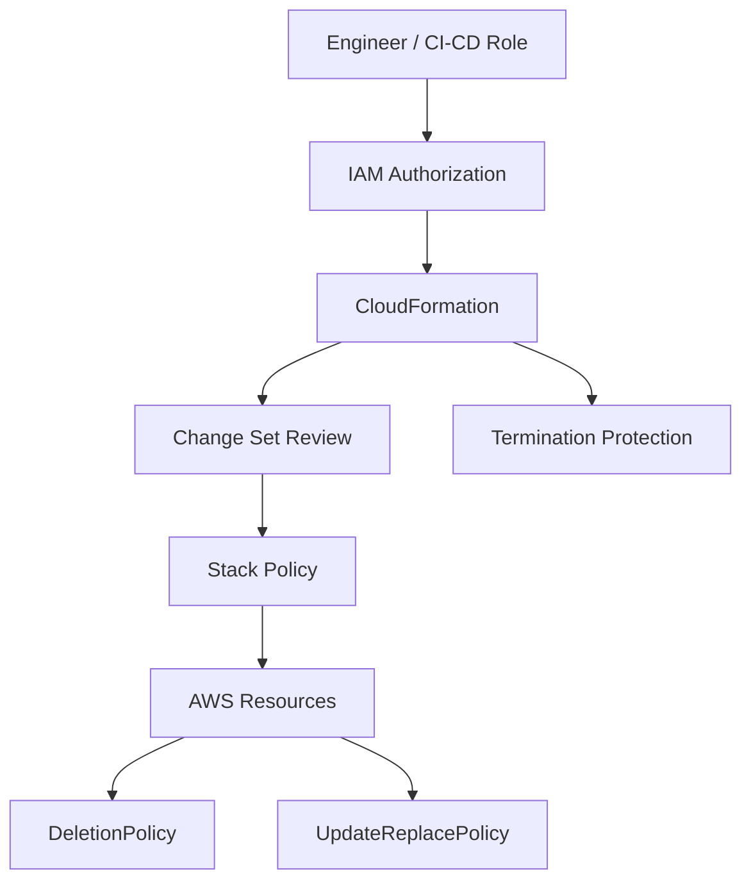
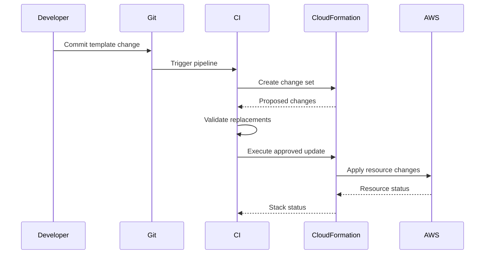

# 05- Stack Policies and Resource Protection

## Overview

AWS CloudFormation stack policies provide a protection mechanism for critical resources during stack updates. A stack policy is a JSON document that defines which update actions CloudFormation can perform on resources in a stack.

This is particularly useful for protecting high-value or stateful resources such as:

- Production databases
- RDS clusters
- S3 buckets containing important data
- Critical networking resources
- Production load balancers
- Shared infrastructure
- Resources where replacement would cause significant disruption

A stack policy is not the same as an IAM policy, `DeletionPolicy`, `UpdateReplacePolicy`, or termination protection.

The distinction matters:

| Mechanism | Primary purpose |
|---|---|
| Stack policy | Protect resources from unintended **updates** |
| IAM policy | Control who can call AWS APIs |
| `DeletionPolicy` | Control what happens to a resource when it is removed from a stack or the stack is deleted |
| `UpdateReplacePolicy` | Control what happens to the old physical resource when an update requires replacement |
| Termination protection | Prevent accidental **stack deletion** |
| Change set | Preview proposed CloudFormation changes |
| Drift detection | Detect differences between expected and actual resource configuration |

AWS recommends using stack policies for critical resources and change sets to preview resource additions, modifications, and replacements. :contentReference[oaicite:0]{index=0}

## Why Stack Policies Matter

CloudFormation updates resources based on differences between the submitted template and the stack's current template.

Some changes are relatively safe:

```text
Update application tag
        |
        v
No interruption
```

Others can cause replacement:

```text
Change immutable resource property
        |
        v
Create replacement resource
        |
        v
Delete old resource
```

For a database, this can be dangerous.

```text
CloudFormation Update
        |
        v
Property change
        |
        v
Replacement required
        |
        v
Production database replaced
        |
        v
Potential outage / data loss
```

A stack policy creates an additional protection boundary around resources where accidental updates are unacceptable.

## What a Stack Policy Is

A stack policy is a JSON document containing statements that define allowed or denied update actions for resources.

A basic policy can deny updates to a specific logical resource:

```json
{
  "Statement": [
    {
      "Effect": "Deny",
      "Action": "Update:*",
      "Principal": "*",
      "Resource": "LogicalResourceId/ProductionDatabase"
    }
  ]
}
```

The important parts are:

| Field | Purpose |
|---|---|
| `Effect` | Usually `Allow` or `Deny` |
| `Action` | Defines the CloudFormation update action |
| `Principal` | Identifies the principal; stack policies commonly use `*` |
| `Resource` | Identifies the CloudFormation logical resource being protected |

A stack policy is evaluated during stack updates. By default, resources can be updated unless a stack policy restricts them. :contentReference[oaicite:1]{index=1}

## How Stack Policy Protection Works

Consider a production stack:

```text
Backend Stack
 |
 +--> VPC
 |
 +--> ECS Service
 |
 +--> Load Balancer
 |
 +--> RDS Database
```

The database is protected:

```text
CloudFormation Update
        |
        v
Stack Policy
        |
        +------ ECS ---> Allowed
        |
        +------ ALB ---> Allowed
        |
        +------ RDS ---> Denied
```

If a template update attempts to modify the protected resource, CloudFormation blocks the update unless the protected resource is explicitly allowed through a temporary policy for that operation.

## Stack Policy Resource Identification

Stack policies generally reference CloudFormation logical resource IDs.

For example:

```yaml
Resources:
  ProductionDatabase:
    Type: AWS::RDS::DBInstance
```

The stack policy can target:

```text
LogicalResourceId/ProductionDatabase
```

The logical ID is not the physical resource identifier.

For example:

```text
Logical ID:
ProductionDatabase

Physical ID:
prod-database-abc123
```

The stack policy targets the logical CloudFormation resource.

## Protecting a Production Database

A common production policy is:

```json
{
  "Statement": [
    {
      "Effect": "Deny",
      "Action": "Update:*",
      "Principal": "*",
      "Resource": "LogicalResourceId/ProductionDatabase"
    }
  ]
}
```

The intent is:

```text
Application Resources
        |
        v
Can be updated normally

ProductionDatabase
        |
        v
Protected from updates
```

This provides an explicit safety boundary around the database.

## Creating a Stack With a Stack Policy

A stack policy can be supplied when creating a stack.

Example:

```bash
aws cloudformation create-stack \
  --stack-name production-backend \
  --template-body file://template.yaml \
  --stack-policy-body file://stack-policy.json \
  --region ap-south-1
```

For larger policies, an S3-hosted policy can be supplied using the appropriate CloudFormation API/CLI option.

Keep policies version-controlled alongside infrastructure code when possible.

Example repository:

```text
infrastructure/
├── templates/
│   └── production.yaml
├── policies/
│   └── stack-policy.json
└── README.md
```

## Updating a Stack Policy

The stack policy can be changed independently of the stack template.

For example:

```bash
aws cloudformation update-stack \
  --stack-name production-backend \
  --use-previous-template \
  --stack-policy-body file://stack-policy.json \
  --region ap-south-1
```

The AWS CLI supports `--stack-policy-body` and `--stack-policy-url` for replacing the stack's associated stack policy. :contentReference[oaicite:2]{index=2}

This is useful when a newly created critical resource needs to become protected.

## Temporary Policy During an Update

One of the most important operational features is the ability to provide a temporary stack policy during a specific update.

Suppose:

```text
ProductionDatabase
        |
        v
Normally protected
```

but an approved migration requires modifying it.

Instead of permanently weakening the stack policy:

```text
Bad approach:

Remove protection
      |
      v
Perform update
      |
      v
Forget to restore protection
```

use a temporary overriding policy for the specific update:

```text
Normal Stack Policy
        |
        v
Database protected

Approved update
        |
        v
Temporary Stack Policy
        |
        v
Database explicitly allowed
        |
        v
Update
        |
        v
Original protection remains
```

The AWS CLI provides `--stack-policy-during-update-body` and `--stack-policy-during-update-url` for this purpose. :contentReference[oaicite:3]{index=3}

Example:

```bash
aws cloudformation update-stack \
  --stack-name production-backend \
  --template-body file://updated-template.yaml \
  --stack-policy-during-update-body file://temporary-policy.json \
  --region ap-south-1
```

This is safer than permanently changing the protection policy simply to allow one controlled change.

## Temporary Policy Example

Normal policy:

```json
{
  "Statement": [
    {
      "Effect": "Deny",
      "Action": "Update:*",
      "Principal": "*",
      "Resource": "LogicalResourceId/ProductionDatabase"
    }
  ]
}
```

Temporary policy:

```json
{
  "Statement": [
    {
      "Effect": "Allow",
      "Action": "Update:*",
      "Principal": "*",
      "Resource": "LogicalResourceId/ProductionDatabase"
    }
  ]
}
```

The temporary policy should be narrowly scoped to the resources that genuinely need to change.

Do not use an unrestricted temporary policy as a shortcut.

## Allow and Deny Semantics

A policy can contain multiple statements.

For example:

```json
{
  "Statement": [
    {
      "Effect": "Deny",
      "Action": "Update:*",
      "Principal": "*",
      "Resource": "LogicalResourceId/ProductionDatabase"
    },
    {
      "Effect": "Allow",
      "Action": "Update:*",
      "Principal": "*",
      "Resource": "*"
    }
  ]
}
```

The explicit deny protects the database while allowing updates to other resources.

Conceptually:

```text
Resource                 Update
--------------------------------
ECS Service              Allowed
Load Balancer            Allowed
Security Group           Allowed
ProductionDatabase       Denied
```

This follows the important principle:

> Protect only the resources that require protection, while keeping normal infrastructure updates operational.

## Action Scope

`Update:*` provides broad protection against CloudFormation update actions.

A policy can also target more specific update actions when appropriate.

The exact policy structure should be designed around the resource and operational risk rather than copying a generic deny rule everywhere.

A broad protection policy may reduce flexibility:

```text
Everything protected
        |
        v
Every update requires override
        |
        v
Operational friction
```

A targeted policy is generally easier to operate:

```text
Critical resources protected
        |
        v
Normal resources update normally
```

## Stack Policy vs IAM Policy

These mechanisms operate at different layers.

```text
IAM
 |
 +--> Who can call CloudFormation APIs?
 |
 v
CloudFormation
 |
 +--> What stack update is permitted?
 |
 v
Stack Policy
 |
 v
AWS Resources
```

### IAM Policy

IAM determines whether an identity can perform an API operation.

Example:

```text
Can this deployment role call:
cloudformation:UpdateStack?
```

### Stack Policy

The stack policy determines whether protected stack resources can be updated as part of that CloudFormation operation.

Example:

```text
The deployment role can call UpdateStack.

But:

ProductionDatabase
    |
    v
Protected by stack policy
```

Therefore:

> IAM authorization and stack-policy protection are complementary controls.

## Stack Policy vs DeletionPolicy

These are frequently confused.

### Stack Policy

Protects resources against unintended updates during stack updates.

```text
Stack update
     |
     v
Stack Policy
     |
     v
Protect resource from update
```

### DeletionPolicy

Controls what CloudFormation does with a resource when it is deleted from the stack or when the stack itself is deleted.

Example:

```yaml
ProductionDatabase:
  Type: AWS::RDS::DBInstance
  DeletionPolicy: Snapshot
```

`DeletionPolicy` can use values such as `Delete`, `Retain`, `RetainExceptOnCreate`, and `Snapshot`, subject to resource support and semantics. :contentReference[oaicite:4]{index=4}

These controls solve different problems.

| Scenario | Stack Policy | DeletionPolicy |
|---|---:|---:|
| Prevent unintended update | Yes | No |
| Preserve resource on stack deletion | No | Yes |
| Control removal from template | No | Yes |
| Prevent accidental replacement | Indirectly | No |
| Protect critical update | Yes | No |

## Stack Policy vs UpdateReplacePolicy

`UpdateReplacePolicy` controls what happens to the old physical resource when CloudFormation replaces a resource during an update.

Example:

```yaml
ProductionDatabase:
  Type: AWS::RDS::DBInstance
  UpdateReplacePolicy: Snapshot
  DeletionPolicy: Snapshot
```

Conceptually:

```text
Template Change
      |
      v
Replacement Required
      |
      +--> UpdateReplacePolicy
      |
      v
Old Physical Resource
```

A stack policy instead prevents the protected resource from being updated in the first place unless the protection is explicitly overridden.

These controls can be combined.

## Stack Policy vs Termination Protection

Termination protection prevents an entire stack from being deleted.

```text
DeleteStack
    |
    v
Termination Protection
    |
    v
Deletion blocked
```

AWS documents termination protection as a separate mechanism. It is disabled by default and can be enabled on a stack to make deletion fail while leaving the stack unchanged. :contentReference[oaicite:5]{index=5}

Example:

```bash
aws cloudformation update-termination-protection \
  --stack-name production-backend \
  --enable-termination-protection \
  --region ap-south-1
```

The distinction is:

| Protection | Protects against |
|---|---|
| Stack policy | Unintended resource updates |
| Termination protection | Stack deletion |
| `DeletionPolicy` | Resource deletion behavior |
| `UpdateReplacePolicy` | Handling of old resources during replacement |

For critical production stacks, multiple mechanisms may be appropriate.

## Resource Protection Architecture

A production backend stack can combine several protection layers:



Each layer addresses a different failure mode.

## Protecting Stateful Resources

Stateful resources deserve stronger protection than disposable compute resources.

Example:

```text
Low Risk
  |
  +--> ECS Task
  +--> Auto Scaling replacement
  |
  v
Higher Risk
  |
  +--> Load Balancer
  +--> Persistent Volume
  +--> RDS
  +--> Production S3 data
```

A practical protection strategy might be:

```text
RDS
 |
 +--> Stack Policy
 +--> DeletionPolicy: Snapshot/Retain
 +--> UpdateReplacePolicy: Snapshot/Retain
 +--> Termination Protection
 +--> Backups
```

No single protection mechanism should be treated as a replacement for backups.

## Example Production Template

A production database can use multiple controls:

```yaml
Resources:
  ProductionDatabase:
    Type: AWS::RDS::DBInstance
    DeletionPolicy: Snapshot
    UpdateReplacePolicy: Snapshot
    Properties:
      DBInstanceClass: db.t4g.medium
      Engine: postgres
      AllocatedStorage: 100
      StorageEncrypted: true
```

The stack policy separately protects the logical resource:

```json
{
  "Statement": [
    {
      "Effect": "Deny",
      "Action": "Update:*",
      "Principal": "*",
      "Resource": "LogicalResourceId/ProductionDatabase"
    }
  ]
}
```

This produces defense in depth:

```text
             Production Database
                     |
        +------------+------------+
        |            |            |
        v            v            v
 Stack Policy   DeletionPolicy  UpdateReplacePolicy
        |            |            |
        v            v            v
 Prevent risky   Protect on    Protect old resource
 updates         deletion      during replacement
```

## Why Replacement Is Dangerous

Some CloudFormation property changes require resource replacement.

For example:

```text
Template Change
      |
      v
CloudFormation determines:
"Update requires replacement"
      |
      v
New resource created
      |
      v
Old resource removed
```

For a stateless service this may be acceptable.

For a stateful database it can be catastrophic if not carefully planned.

CloudFormation documents different update behaviors, including updates with no interruption, updates with some interruption, and updates that require replacement. :contentReference[oaicite:6]{index=6}

Before changing critical resource properties:

1. Review the resource documentation.
2. Determine the update behavior.
3. Create a change set.
4. Verify whether replacement is planned.
5. Confirm backups.
6. Verify recovery procedures.
7. Confirm application compatibility.
8. Obtain the appropriate production approval.

## Change Sets and Stack Policies

Stack policies and change sets work particularly well together.

```text
Template Change
      |
      v
Create Change Set
      |
      v
Review:
  - Add
  - Modify
  - Replace
  - Remove
      |
      v
Stack Policy
      |
      v
Protect critical resources
      |
      v
Execute approved change
```

A change set answers:

> What is CloudFormation planning to change?

A stack policy answers:

> Which resources must not be unintentionally updated?

AWS recommends change sets for previewing changes and stack policies for protecting critical resources. :contentReference[oaicite:7]{index=7}

## Production Deployment Workflow

A mature workflow can look like:



For high-risk resources, require an explicit approval gate before execution.

## Common Production Pattern

A typical backend infrastructure repository might use:

```text
cloudformation/
├── templates/
│   ├── network.yaml
│   ├── application.yaml
│   └── database.yaml
├── policies/
│   ├── production-stack-policy.json
│   └── staging-stack-policy.json
├── parameters/
│   ├── production.json
│   └── staging.json
└── README.md
```

The production policy might protect:

```text
ProductionDatabase
ProductionDataBucket
SharedNetwork
```

while leaving application compute resources more flexible.

## Updating a Protected Resource Safely

Suppose a database parameter must be changed.

### Normal Update

```text
Template
   |
   v
Change Set
   |
   v
Database modification detected
   |
   v
Stack Policy blocks protected resource
```

### Approved Update

```text
Template
   |
   v
Change Set
   |
   v
Review replacement/update behavior
   |
   v
Temporary policy
   |
   v
Execute update
   |
   v
Original stack policy remains
```

Example:

```bash
aws cloudformation update-stack \
  --stack-name production-backend \
  --template-body file://updated-template.yaml \
  --stack-policy-during-update-body file://database-update-policy.json \
  --region ap-south-1
```

The temporary policy should grant only the update required for the approved operation.

## Stack Policy Failure Diagnosis

When a CloudFormation update fails because a protected resource cannot be updated, inspect stack events first.

```bash
aws cloudformation describe-stack-events \
  --stack-name production-backend \
  --region ap-south-1
```

Look for:

```text
UPDATE_FAILED
```

and the associated status reason.

Typical investigation:

```text
UPDATE_FAILED
     |
     v
Identify logical resource
     |
     v
Check stack policy
     |
     v
Determine whether resource is protected
     |
     v
Review intended change
     |
     +------ Not required ------> Remove change
     |
     +------ Required ----------> Use controlled temporary policy
```

Do not immediately remove the stack policy.

First determine why the resource needs to change.

## Operational Safety Rules

### Never Remove Protection Casually

A dangerous workflow is:

```text
Update fails
   |
   v
Delete stack policy
   |
   v
Retry update
```

This converts a protection mechanism into an obstacle that operators simply remove when inconvenient.

Instead:

```text
Update fails
   |
   v
Understand failure
   |
   v
Review change set
   |
   v
Determine resource impact
   |
   v
Use temporary override if approved
```

### Keep Policies Version-Controlled

Treat stack policies as infrastructure code.

Use:

```text
Git
 |
 +--> Template
 |
 +--> Stack Policy
 |
 +--> Parameters
 |
 +--> Deployment Workflow
```

This allows policy changes to be reviewed and audited.

### Protect High-Value Resources Selectively

Do not protect every resource by default without considering operational consequences.

If everything requires an override:

```text
Every deployment
     |
     v
Temporary policy
     |
     v
Additional operational complexity
```

The protection boundary should reflect actual business and technical risk.

### Combine Controls

For critical stateful infrastructure, use multiple independent safeguards:

```text
IAM
 +
Change Sets
 +
Stack Policy
 +
DeletionPolicy
 +
UpdateReplacePolicy
 +
Termination Protection
 +
Backups
 +
Monitoring
```

These controls address different failure modes.

## Security Considerations

Stack policies are not a replacement for IAM.

An attacker or compromised deployment role may still have broad infrastructure privileges if IAM is poorly configured.

Use layered controls:

```text
Identity
   |
   v
IAM
   |
   v
CloudFormation API
   |
   v
Stack Policy
   |
   v
Resource
```

Recommended practices:

- Use least-privilege IAM roles.
- Separate deployment and administrative roles.
- Restrict who can change stack policies.
- Require review for production infrastructure changes.
- Log CloudFormation API calls with CloudTrail.
- Protect stack-policy files in source control.
- Avoid granting unrestricted infrastructure privileges to application workloads.
- Use temporary elevation for exceptional production changes.

CloudFormation API activity can be audited through CloudTrail. :contentReference[oaicite:8]{index=8}

## Monitoring and Auditing

Useful operational signals include:

- Failed CloudFormation updates.
- Attempts to modify protected resources.
- Changes to stack policies.
- Changes to termination protection.
- Unexpected resource replacements.
- Production stack failures.
- Manual AWS API activity.

A useful audit flow is:

```text
CloudFormation Event
        |
        v
CloudTrail
        |
        v
Identify Principal
        |
        v
Identify API Operation
        |
        v
Correlate With Deployment
        |
        v
Determine Whether Change Was Expected
```

For production systems, this helps distinguish:

```text
Approved CI/CD deployment
```

from:

```text
Unexpected manual change
```

## Common Mistakes

### Confusing Stack Policies With IAM

IAM controls who can invoke AWS APIs.

Stack policies protect resources during CloudFormation stack updates.

They are complementary, not interchangeable.

### Assuming Stack Policy Prevents Stack Deletion

It does not serve as stack-level termination protection.

Use termination protection when the goal is to prevent stack deletion. :contentReference[oaicite:9]{index=9}

### Assuming Stack Policy Prevents Every Form of Resource Change

A stack policy is specifically concerned with CloudFormation stack updates. It is not a general-purpose resource firewall against every AWS API call made outside CloudFormation.

### Protecting Everything

Overly broad protection creates deployment friction and encourages engineers to bypass controls.

Protect resources according to risk.

### Permanently Weakening the Policy

If one update requires a protected resource to change, avoid permanently removing the protection.

Use a narrowly scoped temporary update policy where appropriate.

### Forgetting Replacement Risk

A property modification can trigger resource replacement.

Always inspect change sets before high-risk updates.

### Relying Only on Stack Policies for Database Protection

Stack policies reduce accidental CloudFormation updates but do not replace:

- Automated backups.
- Snapshots.
- Point-in-time recovery.
- Disaster recovery testing.
- Access controls.

### Not Versioning Stack Policies

An unversioned stack policy makes it difficult to determine when and why a protection boundary changed.

### Using a Broad Temporary Policy

A temporary policy should not effectively disable protection for the entire stack.

Keep the override narrowly scoped.

## Stack Policy and Resource Protection Comparison

| Mechanism | Scope | Protects Against | Typical Use |
|---|---|---|---|
| IAM | API access | Unauthorized API calls | Least privilege |
| Stack policy | Stack updates | Unintended resource updates | Protect RDS/shared resources |
| Change set | Proposed stack update | Unexpected deployment changes | Pre-deployment review |
| `DeletionPolicy` | Resource lifecycle | Resource deletion behavior | Retain/Snapshot data |
| `UpdateReplacePolicy` | Replacement lifecycle | Loss of old physical resource | Snapshot/retain before replacement |
| Termination protection | Stack lifecycle | Accidental stack deletion | Production stacks |
| Backup | Data | Data loss | DR and recovery |

## Production Checklist

### Stack Policy

- [ ] Critical resources are explicitly identified.
- [ ] Production stack policies are version-controlled.
- [ ] Protected resources use stable logical IDs.
- [ ] Policies are reviewed through the normal infrastructure workflow.
- [ ] Protection is scoped to genuinely critical resources.
- [ ] Temporary overrides are narrowly scoped.

### Deployment

- [ ] Change sets are used for high-risk updates.
- [ ] Resource replacement is reviewed before execution.
- [ ] Protected-resource changes require explicit approval.
- [ ] Temporary stack policies are used instead of permanently weakening protection.
- [ ] Failed updates are investigated through stack events.

### Database and Stateful Resources

- [ ] Critical databases have appropriate backups.
- [ ] `DeletionPolicy` is configured appropriately.
- [ ] `UpdateReplacePolicy` is evaluated for replacement-sensitive resources.
- [ ] Recovery procedures are tested.
- [ ] Resource replacement is explicitly reviewed.

### Security

- [ ] CloudFormation execution roles follow least privilege.
- [ ] Stack-policy changes are restricted.
- [ ] Termination-protection changes are restricted.
- [ ] CloudTrail captures CloudFormation API activity.
- [ ] Production infrastructure changes are auditable.

## Interview Traps

### What does a CloudFormation stack policy protect?

It protects designated stack resources from unintended updates during CloudFormation stack updates.

### Is a stack policy an IAM policy?

No. IAM controls API authorization, while a stack policy controls updates to designated resources during CloudFormation stack operations.

### Does a stack policy prevent someone from changing the resource directly in the AWS console?

No. It is not a general-purpose resource-level access-control mechanism for all AWS APIs.

### Does a stack policy prevent stack deletion?

No. Use CloudFormation termination protection to prevent accidental stack deletion.

### What should you do if a protected resource legitimately needs to change?

Use a controlled update, typically with a temporary stack policy override that explicitly permits the protected resource to be updated.

### Why use a temporary stack policy instead of removing the stack policy?

It minimizes the period and scope during which protection is relaxed and avoids permanently weakening the stack's safety boundary.

### How is `DeletionPolicy` different from a stack policy?

A stack policy protects against unintended updates. `DeletionPolicy` controls resource behavior when the resource is deleted from the stack or when the stack is deleted.

### How is `UpdateReplacePolicy` different from `DeletionPolicy`?

`DeletionPolicy` governs resource deletion from stack lifecycle operations, while `UpdateReplacePolicy` governs what happens to the old physical resource when an update requires replacement.

### Should every CloudFormation resource have a stack-policy deny?

No. Over-protection can create operational friction. Protect resources according to their business and technical risk.

### What is the strongest protection for a production database?

There is no single strongest mechanism. Use layered protection: least-privilege IAM, change-set review, stack policy, appropriate deletion/replacement policies, termination protection where appropriate, backups, monitoring, and tested recovery procedures.

## Key Takeaways

- A CloudFormation stack policy protects designated resources from unintended **updates**.
- Stack policies are different from IAM policies, `DeletionPolicy`, `UpdateReplacePolicy`, and termination protection.
- Stack policies should be used selectively for high-value or stateful resources.
- A stack policy does not provide general protection against direct changes made through other AWS APIs.
- A stack policy does not replace stack termination protection.
- Change sets and stack policies complement each other: change sets show proposed changes, while stack policies protect designated resources during updates.
- Use logical resource IDs such as `LogicalResourceId/ProductionDatabase` when targeting resources in a stack policy.
- Protected resources that legitimately need to change can be updated through a narrowly scoped temporary stack policy override.
- Do not permanently remove protection just because a deployment requires an exceptional update.
- Always inspect replacement behavior before changing critical resources.
- `DeletionPolicy` and `UpdateReplacePolicy` should be considered separately for stateful resources.
- Stack policies do not replace database backups, disaster recovery, or least-privilege IAM.
- Version-control stack policies alongside CloudFormation templates and deployment configuration.
- Audit stack-policy and CloudFormation changes through appropriate operational logging and access controls.
- The goal is not to make every resource impossible to change; it is to create deliberate protection boundaries around resources where accidental updates have unacceptable consequences.