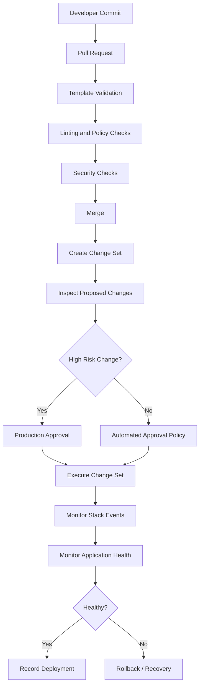
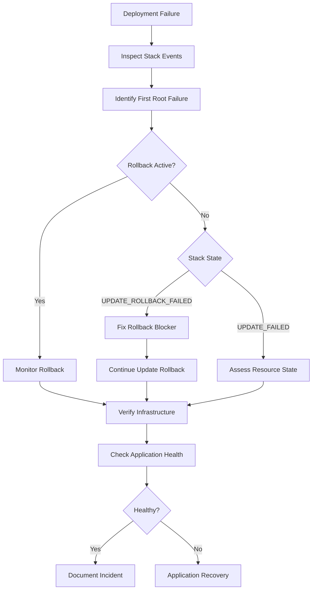

# 06- Production Deployment Practices

## Overview

Production CloudFormation deployments should be treated as controlled infrastructure releases rather than simple template executions.

The objective is not merely to make a template deploy successfully. A production deployment should provide:

- Predictable infrastructure changes
- Explicit visibility into resource additions, modifications, replacements, and deletions
- Controlled blast radius
- Fast rollback or recovery
- Auditable change history
- Least-privilege deployment access
- Protection for stateful and business-critical resources
- Consistent deployment behavior across environments

AWS recommends validating templates, managing infrastructure through CloudFormation, using change sets, protecting critical resources with stack policies, maintaining revision control, using drift detection, configuring rollback triggers, and auditing CloudFormation API activity with CloudTrail. :contentReference[oaicite:0]{index=0}

A mature deployment pipeline therefore looks like:

```text
Git Commit
    |
    v
Template Validation
    |
    v
Policy / Security Checks
    |
    v
Change Set
    |
    v
Review Proposed Changes
    |
    v
Production Approval
    |
    v
Execute Change Set
    |
    v
Monitor Stack + Application
    |
    +------ Success ------> Record Deployment
    |
    +------ Failure ------> Rollback / Recovery
```

## Production Deployment Principles

A reliable CloudFormation deployment should follow several principles.

| Principle | Production expectation |
|---|---|
| Infrastructure as Code | CloudFormation templates are the source of truth |
| Version control | Every template and policy change is tracked |
| Validation | Templates are validated before deployment |
| Preview | High-risk changes use change sets |
| Least privilege | CI/CD roles receive only required permissions |
| Protection | Critical resources use appropriate protection mechanisms |
| Small blast radius | Changes are isolated by stack and environment |
| Observability | Stack events and application health are monitored |
| Recovery | Rollback and recovery procedures are tested |
| Auditability | Deployments can be correlated with commits and AWS API activity |

The goal is to make production changes **deliberate, observable, and reversible**.

## Environment Separation

Production should not be treated as another developer environment with a different parameter file.

A typical environment model is:

```text
CloudFormation Template
        |
        +----------------+
        |                |
        v                v
   Staging Stack     Production Stack
        |                |
        v                v
   Test Changes      Approved Changes
        |                |
        v                v
 Validation          Controlled Release
```

Example:

```text
backend-network-staging
backend-network-production

backend-api-staging
backend-api-production

backend-data-staging
backend-data-production
```

Keep environment-specific values outside the template where practical.

For example:

```yaml
Parameters:
  Environment:
    Type: String
    AllowedValues:
      - staging
      - production

  DatabaseInstanceClass:
    Type: String
```

Then provide environment-specific parameter values through the deployment mechanism.

Avoid maintaining completely separate templates for staging and production unless the infrastructure genuinely differs.

## Stack Organization

CloudFormation stacks should generally be organized around lifecycle, ownership, and operational boundaries.

AWS explicitly recommends organizing stacks by lifecycle and ownership. :contentReference[oaicite:1]{index=1}

A backend platform might use:

```text
Network Stack
    |
    +--> VPC
    +--> Subnets
    +--> Route Tables
    +--> NAT Gateway

Data Stack
    |
    +--> RDS
    +--> ElastiCache

Application Stack
    |
    +--> ECS / EC2
    +--> Load Balancer
    +--> Security Groups

Observability Stack
    |
    +--> CloudWatch
    +--> Alarms
    +--> Notifications
```

This separation prevents unrelated application changes from unnecessarily affecting foundational infrastructure.

### Avoid Both Extremes

One giant stack:

```text
Everything
   |
   +--> VPC
   +--> RDS
   +--> ECS
   +--> IAM
   +--> Monitoring
   +--> S3
```

can create a large blast radius.

But excessive fragmentation:

```text
100 tiny stacks
```

can introduce dependency and operational complexity.

Choose boundaries based on:

- Lifecycle
- Ownership
- Failure domain
- Deployment frequency
- Dependency relationships
- Security boundaries

## Infrastructure Repository Structure

A production repository can use a structure such as:

```text
infrastructure/
├── templates/
│   ├── network.yaml
│   ├── data.yaml
│   ├── application.yaml
│   └── observability.yaml
├── parameters/
│   ├── staging.json
│   └── production.json
├── policies/
│   └── production-stack-policy.json
├── scripts/
│   ├── validate.sh
│   ├── create-change-set.sh
│   └── deploy.sh
└── README.md
```

The exact structure is less important than maintaining a clear relationship between:

```text
Template
   +
Parameters
   +
Stack Policy
   +
Deployment Procedure
   +
Git Commit
```

## Template Validation

Never use production as the first place to discover basic template errors.

At minimum, validate templates before creating a change set.

```bash
aws cloudformation validate-template \
  --template-body file://templates/application.yaml \
  --region ap-south-1
```

Validation should happen automatically in CI/CD.

A basic pipeline can be:

```text
Pull Request
    |
    v
CloudFormation Validation
    |
    v
Linting / Policy Checks
    |
    v
Security Checks
    |
    v
Review
    |
    v
Merge
```

Validation catches structural problems early, but it does not guarantee successful resource provisioning.

CloudFormation change-set creation also performs pre-deployment validation for several common problems, but runtime failures can still occur during execution, including failures caused by custom resources or service-specific runtime conditions. :contentReference[oaicite:2]{index=2}

## Change Sets for Production

A change set provides a preview of proposed changes before execution.

Create one for a production stack:

```bash
aws cloudformation create-change-set \
  --stack-name backend-production \
  --change-set-name release-2026-08-13 \
  --template-body file://templates/application.yaml \
  --parameters file://parameters/production.json \
  --change-set-type UPDATE \
  --region ap-south-1
```

Then inspect it:

```bash
aws cloudformation describe-change-set \
  --stack-name backend-production \
  --change-set-name release-2026-08-13 \
  --region ap-south-1
```

The important fields to review include:

- `Action`
- `ResourceType`
- `LogicalResourceId`
- `Replacement`
- `Details`

A production reviewer should specifically look for:

```text
Add
Modify
Remove
Replace
```

Change sets allow proposed changes to be inspected before execution, but they do not guarantee that the deployment will succeed. :contentReference[oaicite:3]{index=3}

## Replacement Review

Replacement is one of the most important production risks.

A seemingly small template modification can result in:

```text
Template Change
      |
      v
CloudFormation determines
replacement required
      |
      v
New physical resource
      |
      v
Old physical resource
removed/replaced
```

For stateless infrastructure this may be acceptable.

For resources such as:

- RDS
- Stateful storage
- Critical S3 resources
- Production networking components

replacement requires explicit review.

A change set might reveal:

```text
Action: Modify
Resource: ProductionDatabase
Replacement: True
```

Treat this as a high-risk deployment.

AWS specifically recommends using change sets because they expose potentially destructive changes such as database replacement before execution. :contentReference[oaicite:4]{index=4}

## Stack Policies

Critical resources should be protected with stack policies.

Example:

```json
{
  "Statement": [
    {
      "Effect": "Deny",
      "Action": "Update:*",
      "Principal": "*",
      "Resource": "LogicalResourceId/ProductionDatabase"
    }
  ]
}
```

The deployment pipeline can use a temporary stack policy during an explicitly approved update when a protected resource legitimately needs modification.

The important operational principle is:

```text
Normal deployment
    |
    v
Critical resource protected

Exceptional approved deployment
    |
    v
Narrow temporary override
    |
    v
Update
    |
    v
Normal protection restored
```

AWS recommends stack policies for protecting critical resources from unintentional updates. :contentReference[oaicite:5]{index=5}

## Termination Protection

Production stacks should generally enable termination protection where accidental stack deletion would be unacceptable.

```bash
aws cloudformation update-termination-protection \
  --stack-name backend-production \
  --enable-termination-protection \
  --region ap-south-1
```

Termination protection prevents deletion of the protected stack, but it is not a replacement for resource-level protection or backups. :contentReference[oaicite:6]{index=6}

A useful production combination is:

```text
Termination Protection
        +
Stack Policy
        +
DeletionPolicy
        +
UpdateReplacePolicy
        +
Backups
```

Each mechanism protects against a different failure mode.

## Resource Lifecycle Protection

Stateful resources need special treatment.

Example:

```yaml
Resources:
  ProductionDatabase:
    Type: AWS::RDS::DBInstance
    DeletionPolicy: Snapshot
    UpdateReplacePolicy: Snapshot
    Properties:
      Engine: postgres
      StorageEncrypted: true
```

The controls have different purposes:

| Mechanism | Purpose |
|---|---|
| Stack policy | Prevent unintended updates |
| `DeletionPolicy` | Control behavior when the resource is deleted |
| `UpdateReplacePolicy` | Control the old physical resource during replacement |
| Termination protection | Prevent stack deletion |
| Backup | Recover data after operational failure |

Do not interpret any of these mechanisms as a substitute for tested disaster recovery.

## Production Deployment Workflow

A strong deployment pipeline can use the following lifecycle:



The important distinction is that infrastructure deployment and application health should both be considered.

A CloudFormation stack can reach a successful state while the application is still unhealthy.

## CI/CD Integration

A CI/CD system should separate:

```text
Build
  |
  v
Validate
  |
  v
Plan / Change Set
  |
  v
Approval
  |
  v
Deploy
  |
  v
Verify
```

For example:

```text
GitHub Actions
      |
      +--> Validate template
      |
      +--> Run CloudFormation Guard
      |
      +--> Create change set
      |
      +--> Publish change-set information
      |
      +--> Wait for approval
      |
      +--> Execute change set
      |
      +--> Verify stack status
```

The deployment role should be separate from developer credentials.

Avoid:

```text
Developer laptop
      |
      v
Administrator credentials
      |
      v
Production CloudFormation
```

Prefer:

```text
GitHub Actions
      |
      v
Federated IAM Role
      |
      v
Least-Privilege Deployment Role
      |
      v
CloudFormation
```

## IAM and Deployment Roles

Use least-privilege IAM for production deployment.

The deployment identity should have only the permissions necessary to:

- Validate templates
- Create and inspect change sets
- Execute approved changes
- Read required stack state
- Access required CloudFormation resources

Avoid permanent access keys stored in CI/CD configuration.

Prefer short-lived credentials through workload identity or OIDC federation where supported by the CI/CD platform.

The deployment role should also be separated from highly privileged break-glass administration.

## Parameter and Secret Management

Do not embed credentials in CloudFormation templates.

Bad:

```yaml
Environment:
  DB_PASSWORD: "production-secret-password"
```

Better approaches include:

- AWS Secrets Manager
- Systems Manager Parameter Store
- Dynamic references
- Secure CI/CD secret handling

For example:

```yaml
DatabasePassword:
  Type: AWS::SSM::Parameter::Value<String>
```

Sensitive parameters should not be exposed unnecessarily through logs, command output, or deployment metadata.

AWS explicitly recommends not embedding credentials in templates and recommends secure handling of sensitive parameters. :contentReference[oaicite:7]{index=7}

## Change Set Naming

Use deterministic naming that allows operators to identify a deployment.

Example:

```text
release-2026-08-13-1420
```

or:

```text
main-4f82a91
```

A useful convention is:

```text
<environment>-<commit>-<timestamp>
```

For example:

```text
production-4f82a91-20260813-1420
```

This allows an operator to correlate:

```text
Git Commit
    |
    +--> CI Run
    |
    +--> Change Set
    |
    +--> CloudFormation Events
    |
    +--> Deployment Result
```

## Approval Gates

Not every infrastructure change requires manual approval.

Risk-based approval is more scalable.

| Change | Suggested control |
|---|---|
| Documentation-only | No deployment |
| Tag-only change | Automated |
| Stateless compute update | Automated after validation |
| Security group modification | Review depending on impact |
| IAM permission expansion | Explicit review |
| Production database modification | Explicit approval |
| Resource replacement | Explicit approval |
| Network architecture change | Explicit approval |
| Production deletion | Strong approval / break-glass |

The objective is not to add human approval to everything.

The objective is to require human judgment where automation cannot safely determine business impact.

## Blast Radius Control

Production changes should minimize blast radius.

Instead of:

```text
One deployment
     |
     v
Network + Database + Application + Monitoring
```

prefer independently deployable infrastructure boundaries where appropriate:

```text
Network
   |
   +--> Stable

Database
   |
   +--> Controlled changes

Application
   |
   +--> Frequent deployment

Monitoring
   |
   +--> Independent lifecycle
```

This reduces the number of unrelated resources affected by a deployment.

## Multi-Region and Multi-Account Deployments

For organizations operating across multiple AWS accounts or Regions, CloudFormation StackSets can provide centralized deployment of common infrastructure.

AWS recommends StackSets for multi-account and multi-Region deployments. :contentReference[oaicite:8]{index=8}

A safer rollout is:

```text
StackSet Template
       |
       v
Test Account
       |
       v
Test Region
       |
       v
Limited Production Accounts
       |
       v
Remaining Production Accounts
```

Do not immediately deploy an untested template across every account.

AWS recommends testing StackSet updates on selected stack instances before broad rollout and using conservative concurrency and failure-tolerance settings when a lower blast radius is required. :contentReference[oaicite:9]{index=9}

## Regional Rollout Strategy

For multi-Region infrastructure:

```text
Region A
   |
   v
Deploy
   |
   v
Verify
   |
   v
Region B
   |
   v
Deploy
   |
   v
Verify
```

This provides an opportunity to stop a rollout after detecting an issue.

For higher-risk infrastructure, consider:

- Lowest-impact Region first
- Limited account rollout
- Conservative concurrency
- Explicit failure tolerance
- Application health verification between stages

## Rollback Strategy

Rollback should be planned before deployment.

A useful decision model is:

```text
Deployment Failure
       |
       v
Is CloudFormation automatically rolling back?
       |
       +---- Yes ----> Monitor rollback
       |
       +---- No -----> Diagnose stack state
                            |
                            v
                     Can rollback continue?
                            |
                  +---------+---------+
                  |                   |
                 Yes                  No
                  |                   |
                  v                   v
           Continue rollback      Fix blocker
                                      |
                                      v
                              Continue rollback
```

If a stack reaches `UPDATE_ROLLBACK_FAILED`, it cannot be updated until it is returned to an operational state. CloudFormation provides `continue-update-rollback` for this recovery scenario. :contentReference[oaicite:10]{index=10}

Example:

```bash
aws cloudformation continue-update-rollback \
  --stack-name backend-production \
  --region ap-south-1
```

Do not treat rollback as merely a button.

Understand what resource caused the failure and whether the physical infrastructure still matches CloudFormation's expected state.

## Rollback Triggers

CloudFormation can monitor CloudWatch alarms during stack creation and update operations and roll back when configured alarms enter `ALARM`.

Examples of useful signals include:

- HTTP 5xx rate
- Application error rate
- CPU saturation
- Memory pressure
- Queue depth
- Custom business health metrics

The workflow becomes:

```text
CloudFormation Update
        |
        v
Application Health
        |
        v
CloudWatch Alarm
        |
        v
ALARM
        |
        v
CloudFormation Rollback
```

AWS recommends rollback triggers for automatic recovery based on critical infrastructure or application-health metrics. :contentReference[oaicite:11]{index=11}

## Deployment Verification

Do not stop monitoring when CloudFormation reports:

```text
UPDATE_COMPLETE
```

Verify the actual system.

For a Django or FastAPI backend, validation might include:

```text
CloudFormation
     |
     v
Infrastructure Healthy
     |
     v
Load Balancer Healthy
     |
     v
Application Healthy
     |
     v
API Health Check
     |
     v
Database Connectivity
     |
     v
Critical Business Flow
```

Example API verification:

```bash
curl --fail --silent \
  https://api.example.com/health/ready
```

Then validate application-specific signals:

- HTTP 5xx
- Latency
- Database errors
- Queue backlog
- Kafka consumer health
- Redis connectivity
- Celery worker health

Infrastructure success is not equivalent to application success.

## Observability

At minimum, production deployment observability should cover:

```text
Git
 |
 +--> Commit
 |
 v
CI/CD
 |
 +--> Pipeline logs
 |
 v
CloudFormation
 |
 +--> Stack events
 |
 +--> Change set
 |
 v
AWS Resources
 |
 +--> CloudWatch
 |
 +--> Service logs
 |
 v
Application
 |
 +--> Metrics
 +--> Logs
 +--> Traces
```

Useful CloudFormation commands include:

```bash
aws cloudformation describe-stacks \
  --stack-name backend-production \
  --region ap-south-1
```

```bash
aws cloudformation describe-stack-events \
  --stack-name backend-production \
  --region ap-south-1
```

For auditability, CloudTrail should capture CloudFormation API activity so teams can determine who initiated infrastructure operations and when. :contentReference[oaicite:12]{index=12}

## Drift Management

Production resources should remain managed through CloudFormation rather than being modified manually.

AWS recommends managing stack resources through CloudFormation and using drift detection regularly. Manual changes can create differences between the template and actual resource state. :contentReference[oaicite:13]{index=13}

A production workflow can include:

```text
Scheduled Drift Detection
        |
        v
Drift Found?
   |
   +---- No ----> Continue
   |
   +---- Yes ---> Investigate
                    |
                    +--> Unauthorized change
                    |
                    +--> Emergency change
                    |
                    +--> Template outdated
```

The correct response depends on why the drift occurred.

Do not blindly overwrite drift without understanding the operational reason for the difference.

## Direct AWS Console Changes

A common production anti-pattern is:

```text
Deployment fails
     |
     v
Engineer opens AWS Console
     |
     v
Manually fixes resource
     |
     v
CloudFormation template unchanged
```

This may make the immediate problem disappear while creating long-term configuration drift.

Prefer:

```text
Problem
  |
  v
Understand desired state
  |
  v
Update template
  |
  v
Review change set
  |
  v
Deploy through CloudFormation
```

Emergency manual intervention may sometimes be unavoidable, but it should be followed by reconciliation of the CloudFormation template and actual infrastructure state.

## High Availability Considerations

CloudFormation itself does not make an application highly available.

The template must describe an architecture capable of tolerating failures.

For example:

```text
                    Load Balancer
                         |
              +----------+----------+
              |                     |
          AZ-A / ECS            AZ-B / ECS
              |                     |
              +----------+----------+
                         |
                    PostgreSQL
```

Production CloudFormation templates should consider:

- Multiple Availability Zones
- Auto Scaling
- Load balancing
- Multi-AZ databases where appropriate
- Stateless application instances
- Durable storage
- Health checks
- Failure isolation

The deployment strategy should also avoid unnecessarily reducing availability during updates.

## Database Deployment Practices

Database infrastructure deserves a separate operational discipline.

Before modifying RDS infrastructure:

```text
Change Set
   |
   +--> Check replacement
   +--> Check interruption
   +--> Check storage
   +--> Check encryption
   +--> Check backups
   +--> Check parameter changes
   +--> Check security groups
```

For production databases:

- Use automated backups.
- Validate restore procedures.
- Protect critical resources with stack policies.
- Review replacement behavior.
- Avoid unnecessary resource renaming.
- Use `DeletionPolicy` appropriately.
- Evaluate `UpdateReplacePolicy`.
- Test database-related changes outside production first.

Never assume:

```text
CloudFormation rollback = database recovery
```

Rollback restores CloudFormation-managed configuration; it is not a substitute for recovering lost or corrupted application data.

## Security Group and IAM Changes

Security-sensitive resources require special review.

Examples:

```text
Security Group
     |
     +--> 0.0.0.0/0:5432
```

or:

```text
IAM Role
     |
     +--> AdministratorAccess
```

These may technically deploy successfully while introducing severe security exposure.

Production validation should therefore inspect **semantic risk**, not just CloudFormation syntax.

Use policy-as-code tooling where appropriate, including AWS CloudFormation Guard. AWS lists policy-as-code with CloudFormation Guard among its security best practices. :contentReference[oaicite:14]{index=14}

## Cost Considerations

CloudFormation deployments can indirectly create significant cost.

Examples include:

- New NAT Gateways
- Additional RDS instances
- Additional load balancers
- Larger databases
- Increased storage
- Additional cross-Region resources
- Temporary replacement infrastructure

A change set should therefore be reviewed for both:

```text
Technical impact
+
Cost impact
```

For example:

```text
RDS:
db.t4g.medium
       |
       v
db.r7g.large
```

may be operationally valid but financially significant.

Infrastructure review should include cost awareness for high-impact changes.

## Disaster Recovery

Production CloudFormation should be designed with recovery in mind.

Important questions include:

- Can the stack be recreated?
- Are persistent resources recoverable?
- Are backups available?
- Are recovery procedures documented?
- Are cross-Region requirements addressed?
- Are critical configuration values reproducible?
- Are external dependencies documented?
- Can the application reconnect after infrastructure recreation?

A useful test is:

```text
Production Infrastructure Lost
          |
          v
Recreate Infrastructure
          |
          v
Restore Data
          |
          v
Deploy Application
          |
          v
Verify Critical Workflows
```

Infrastructure as Code provides reproducibility, but reproducibility only works if stateful data and external dependencies are also recoverable.

## Deployment Failure Handling

When a deployment fails, immediately capture:

```bash
aws cloudformation describe-stack-events \
  --stack-name backend-production \
  --region ap-south-1
```

Then identify:

1. The first meaningful failure.
2. The logical resource involved.
3. The physical resource involved.
4. The failure reason.
5. Whether rollback is active.
6. Whether the resource was replaced.
7. Whether the stack has drifted.
8. Whether a dependency caused the failure.

Do not focus only on the final `UPDATE_FAILED` event.

A later failure can be a consequence of an earlier failure.

## Production Incident Workflow



For `UPDATE_ROLLBACK_FAILED`, CloudFormation may require the underlying problem to be corrected before rollback can continue. :contentReference[oaicite:15]{index=15}

## `ResourcesToSkip` During Recovery

CloudFormation provides `--resources-to-skip` for cases where rollback cannot successfully complete.

Example:

```bash
aws cloudformation continue-update-rollback \
  --stack-name backend-production \
  --resources-to-skip ProductionDatabase \
  --region ap-south-1
```

This is an advanced recovery mechanism, not a normal deployment technique.

AWS warns that skipped resources can become inconsistent with the template. After rollback, the resource and template must be reconciled before subsequent updates. :contentReference[oaicite:16]{index=16}

Use the minimum possible number of skipped resources.

## Production Change Review Checklist

Before approving a production change set:

### Template

- [ ] Template validation passes.
- [ ] Linting passes.
- [ ] Security and policy checks pass.
- [ ] Template change is reviewed.
- [ ] Parameters are correct.
- [ ] No credentials are embedded.

### Change Set

- [ ] Change set was created against the intended stack.
- [ ] Added resources are expected.
- [ ] Modified resources are expected.
- [ ] Deleted resources are expected.
- [ ] Replacement changes were explicitly reviewed.
- [ ] Database replacement has been ruled out or approved.
- [ ] Network changes were reviewed.
- [ ] IAM changes were reviewed.

### Protection

- [ ] Production stack has termination protection where appropriate.
- [ ] Critical resources have appropriate stack policies.
- [ ] `DeletionPolicy` is configured for important stateful resources.
- [ ] `UpdateReplacePolicy` has been evaluated.
- [ ] Backups are available.

### Deployment

- [ ] Correct AWS account selected.
- [ ] Correct Region selected.
- [ ] Correct deployment role selected.
- [ ] Approval requirements satisfied.
- [ ] Deployment window is appropriate.
- [ ] On-call/operations coverage is available.

### Verification

- [ ] CloudFormation reaches the expected state.
- [ ] Load balancer health checks pass.
- [ ] API health checks pass.
- [ ] Application error rate remains normal.
- [ ] Database connectivity is healthy.
- [ ] Queue and Kafka consumers remain healthy where applicable.
- [ ] No unexpected CloudWatch alarms are active.

## Post-Deployment Verification

After execution:

```bash
aws cloudformation describe-stacks \
  --stack-name backend-production \
  --region ap-south-1
```

Then inspect recent events:

```bash
aws cloudformation describe-stack-events \
  --stack-name backend-production \
  --region ap-south-1
```

Validate application behavior:

```bash
curl --fail --silent \
  https://api.example.com/health/ready
```

For a backend platform, consider validating:

```text
API
 |
 +--> Authentication
 +--> Database
 +--> Redis
 +--> Kafka
 +--> Celery
 +--> External APIs
```

The deployment should be considered complete only after infrastructure and application health have been verified.

## Audit Trail

A production deployment should be traceable end-to-end:

```text
Git Commit
    |
    v
Pull Request
    |
    v
CI Run
    |
    v
Change Set
    |
    v
Approval
    |
    v
CloudFormation Execution
    |
    v
CloudTrail Events
    |
    v
Deployment Result
```

AWS recommends code reviews and revision control for templates and CloudTrail for CloudFormation API auditing. :contentReference[oaicite:17]{index=17}

This makes incident investigation significantly easier.

## Common Production Mistakes

### Deploying Directly Without a Change Set

Direct updates can be appropriate for lower-risk workflows, but production changes involving critical infrastructure should generally use change sets.

The problem is reduced visibility into resource replacement and deletion before execution.

### Treating `UPDATE_COMPLETE` as Application Success

CloudFormation only reports infrastructure operation status.

Application health must be validated independently.

### Making Manual Console Changes

Manual changes can create drift and cause future CloudFormation operations to behave unexpectedly.

### Using Administrator Credentials in CI/CD

This creates unnecessary blast radius.

Use a dedicated deployment role with least privilege.

### Ignoring Replacement

A modification that looks harmless in YAML may replace a physical resource.

Always inspect change-set replacement information.

### Testing Only the Template

A syntactically valid template can still fail because of:

- Quotas
- Resource conflicts
- IAM permissions
- Service-specific constraints
- Runtime dependencies
- Custom resources
- Network configuration
- Application health

### Splitting Stacks Without Understanding Dependencies

Excessive stack fragmentation creates dependency management problems.

Stack boundaries should reflect real lifecycle and ownership boundaries.

### Overusing Stack Policies

Protecting everything can make normal operations cumbersome and encourage engineers to bypass safeguards.

### Treating Rollback as Disaster Recovery

Rollback restores infrastructure configuration; it does not guarantee recovery of application data.

### Skipping Resources During Rollback Without Reconciliation

Skipped resources can become inconsistent with the template and make subsequent deployments fail. :contentReference[oaicite:18]{index=18}

### Deploying StackSets Everywhere Immediately

A faulty template can multiply the impact across accounts and Regions.

Start with selected test instances and progressively increase rollout scope. :contentReference[oaicite:19]{index=19}

## Production Deployment Anti-Patterns

| Anti-pattern | Risk | Better approach |
|---|---|---|
| Manual production template editing | Untracked infrastructure | Version-controlled templates |
| Administrator CI role | Excessive blast radius | Least-privilege deployment role |
| No change-set review | Unexpected replacement/deletion | Review change sets |
| Console resource changes | Drift | CloudFormation-managed changes |
| One giant stack | Large blast radius | Lifecycle-based stack boundaries |
| Hundreds of tiny stacks | Dependency complexity | Logical stack boundaries |
| No backups | Data loss | Automated backups + tested recovery |
| Ignore stack policies | Accidental critical updates | Protect high-value resources |
| Ignore application health | False deployment success | Post-deployment verification |
| Global StackSet rollout | Large blast radius | Progressive rollout |
| Skip rollback resources casually | Template/resource inconsistency | Minimal skip + reconciliation |

## Production Deployment Reference

```text
                    Git Repository
                         |
                         v
                 Pull Request Review
                         |
                         v
              Template / Policy Validation
                         |
                         v
                 Security Validation
                         |
                         v
                  Create Change Set
                         |
                         v
               Review Resource Changes
                         |
              +----------+----------+
              |                     |
        Safe / Approved        High Risk
              |                     |
              |              Manual Approval
              |                     |
              +----------+----------+
                         |
                         v
                Execute Change Set
                         |
                         v
              CloudFormation Events
                         |
             +-----------+-----------+
             |                       |
          Success                  Failure
             |                       |
             v                       v
      Application Checks       Rollback / Recovery
             |                       |
             v                       v
       Deployment Record       Root Cause Analysis
```

## Key Takeaways

- Treat production CloudFormation deployments as controlled infrastructure releases.
- Keep templates, parameters, policies, and deployment configuration under version control.
- Organize stacks around lifecycle, ownership, dependencies, and failure boundaries.
- Validate templates before deployment.
- Use change sets to review production changes, especially modifications involving critical resources.
- Treat resource replacement as a high-risk event requiring explicit review.
- Protect stateful resources with appropriate combinations of stack policies, deletion policies, replacement policies, termination protection, and backups.
- Use dedicated least-privilege IAM deployment roles rather than administrator credentials.
- Keep secrets out of templates and use appropriate AWS secret-management mechanisms.
- Monitor both CloudFormation infrastructure state and application health.
- Do not treat `UPDATE_COMPLETE` as proof that the application is healthy.
- Maintain a tested rollback and recovery procedure for `UPDATE_ROLLBACK_FAILED` and other failure states.
- Use `ResourcesToSkip` only as an advanced recovery mechanism and reconcile skipped resources afterward.
- Avoid manual resource modifications outside CloudFormation unless operationally unavoidable; reconcile any emergency changes afterward.
- Use drift detection to identify configuration divergence.
- For StackSets, use progressive rollout strategies to control multi-account and multi-Region blast radius.
- Use CloudTrail, CI/CD records, change sets, and Git history to maintain an end-to-end audit trail.
- Production safety comes from layered controls: validation, review, least privilege, protection, controlled execution, observability, and tested recovery.