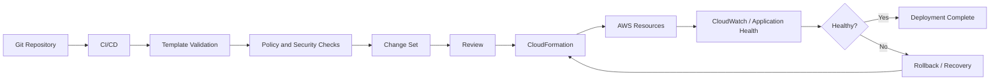

# README

## Overview

This folder contains production-oriented operational guidance for managing AWS CloudFormation stacks safely throughout their lifecycle.

The focus is on operating CloudFormation in real backend and platform environments where infrastructure changes must be controlled, observable, recoverable, and auditable.

The documentation covers:

- Stack lifecycle management
- Safe infrastructure updates
- Change sets
- Rollbacks and recovery
- Drift detection
- Stack policies
- Resource protection
- Production deployment practices

The material assumes familiarity with AWS fundamentals and focuses on operational decision-making rather than introductory CloudFormation concepts.

## Folder Structure

```text
04- Operations/
└── 03- AWS CloudFormation/
    ├── 01- Stack Lifecycle and Stack States.md
    ├── 02- Change Sets and Safe Updates.md
    ├── 03- Rollbacks and Recovery.md
    ├── 04- Drift Detection and Configuration Management.md
    ├── 05- Stack Policies and Resource Protection.md
    └── 06- Production Deployment Practices.md
```

## Quick Navigation

| File | Focus |
|---|---|
| [01- Stack Lifecycle and Stack States](./01-%20Stack%20Lifecycle%20and%20Stack%20States.md) | Stack creation, updates, deletion, lifecycle states, and operational state transitions |
| [02- Change Sets and Safe Updates](./02-%20Change%20Sets%20and%20Safe%20Updates.md) | Previewing infrastructure changes and reducing deployment risk |
| [03- Rollbacks and Recovery](./03-%20Rollbacks%20and%20Recovery.md) | Rollback behavior, failed states, recovery procedures, and operational remediation |
| [04- Drift Detection and Configuration Management](./04-%20Drift%20Detection%20and%20Configuration%20Management.md) | Detecting configuration drift and maintaining CloudFormation as the infrastructure source of truth |
| [05- Stack Policies and Resource Protection](./05-%20Stack%20Policies%20and%20Resource%20Protection.md) | Protecting critical resources from accidental updates, replacement, or deletion |
| [06- Production Deployment Practices](./06-%20Production%20Deployment%20Practices.md) | Production deployment workflows, CI/CD, approvals, observability, security, and recovery practices |

## Operational Learning Path

The recommended order is:

```text
Stack Lifecycle
      |
      v
Change Sets
      |
      v
Rollbacks and Recovery
      |
      v
Drift Detection
      |
      v
Resource Protection
      |
      v
Production Deployment
```

### Stack Lifecycle

Start by understanding how CloudFormation represents stack state and how operations such as create, update, and delete transition a stack between states.

This provides the foundation for diagnosing failed operations.

### Change Sets

Next, learn how to preview infrastructure changes before execution.

The key production concern is identifying:

- Resource additions
- Resource modifications
- Resource deletions
- Resource replacements
- Potential service interruption

### Rollbacks and Recovery

After understanding updates, focus on what happens when they fail.

This section covers operational states such as:

- `UPDATE_FAILED`
- `UPDATE_ROLLBACK_IN_PROGRESS`
- `UPDATE_ROLLBACK_FAILED`
- `UPDATE_ROLLBACK_COMPLETE`

The important skill is distinguishing an ordinary failed deployment from a stack that requires manual recovery.

### Drift Detection

Production infrastructure can diverge from the CloudFormation template through manual changes or external automation.

Drift detection helps identify when:

```text
CloudFormation Template
        !=
Actual AWS Resource Configuration
```

The objective is not simply to detect drift, but to establish a controlled process for reconciling it.

### Resource Protection

Critical resources require additional protection beyond normal CloudFormation behavior.

Examples include:

- Production databases
- Stateful storage
- Critical networking components
- Security-sensitive resources

Protection mechanisms should be layered according to the failure mode being addressed.

### Production Deployment

Finally, combine the preceding concepts into a complete production operating model:

```text
Version Control
      |
      v
Validation
      |
      v
Security / Policy Checks
      |
      v
Change Set
      |
      v
Review / Approval
      |
      v
Execution
      |
      v
Monitoring
      |
      v
Application Verification
      |
      v
Rollback / Recovery if Required
```

## Production Operating Model

A mature CloudFormation workflow should maintain a clear separation between desired state, deployment execution, and operational verification.



## Core Operational Principles

### Treat CloudFormation as the Source of Truth

Infrastructure should normally be changed through CloudFormation rather than manually modifying managed resources through the AWS Console.

Manual changes can create drift and make future deployments unpredictable.

### Review High-Risk Changes

Not every infrastructure change has the same risk profile.

Pay particular attention to:

- Resource replacement
- Resource deletion
- Database changes
- IAM permission changes
- Security group changes
- Networking changes
- Stateful resource modifications

### Protect Stateful Resources

For critical resources, evaluate the combined use of:

- Stack policies
- Termination protection
- `DeletionPolicy`
- `UpdateReplacePolicy`
- Service-level backups
- Disaster recovery procedures

No single protection mechanism provides complete protection.

### Automate Validation

CloudFormation templates should be validated and checked by CI/CD before production execution.

A production pipeline should distinguish between:

```text
Template is syntactically valid
```

and:

```text
Infrastructure change is operationally safe
```

The second requires change-set review, policy checks, and appropriate production controls.

### Monitor Application Health

A CloudFormation operation reaching a successful state does not necessarily mean the application is healthy.

For backend systems, verify signals such as:

- API availability
- HTTP 5xx rate
- Request latency
- Database connectivity
- Redis availability
- Kafka consumer health
- Celery worker health
- Load balancer target health
- Critical business workflows

## Production Checklist

Before executing a high-risk CloudFormation change:

- [ ] Correct AWS account selected
- [ ] Correct Region selected
- [ ] Template validated
- [ ] Security and policy checks passed
- [ ] Parameters verified
- [ ] Change set created
- [ ] Resource additions reviewed
- [ ] Resource modifications reviewed
- [ ] Resource deletions reviewed
- [ ] Replacement operations reviewed
- [ ] Stateful resources protected
- [ ] Backups verified
- [ ] Deployment role verified
- [ ] Approval obtained where required
- [ ] Monitoring available
- [ ] Rollback procedure understood
- [ ] Application health checks ready

## Key Takeaways

- CloudFormation operations should be treated as production infrastructure operations, not simply template execution.
- Understand stack states before attempting remediation.
- Use change sets to make high-risk infrastructure changes visible before execution.
- Treat resource replacement and deletion as explicit production risks.
- Maintain CloudFormation as the source of truth for managed infrastructure.
- Use drift detection to identify configuration divergence.
- Protect critical resources with layered controls.
- Design rollback and recovery procedures before production incidents occur.
- Separate validation, change review, execution, and post-deployment verification.
- Use CI/CD and least-privilege deployment identities for production changes.
- Always verify application health in addition to CloudFormation stack status.
- Keep infrastructure changes auditable through version control, CI/CD records, and AWS operational logs.