# 01- Resilience Patterns

## Overview

Resilience patterns are architectural techniques that allow distributed systems to continue operating when individual components fail, degrade, become unavailable, or experience unexpected load. In production backend systems, failures are normal rather than exceptional. Databases become temporarily unavailable, third-party APIs timeout, message brokers delay delivery, containers restart, networks introduce packet loss, and entire Availability Zones may become unreachable.

The objective of resilient architecture is not eliminating failures but reducing their impact. A resilient system isolates faults, prevents cascading failures, recovers automatically whenever possible, and maintains acceptable service levels during partial outages. On AWS, resilience is typically achieved through a combination of application design, infrastructure redundancy, asynchronous processing, observability, and automated recovery mechanisms.

For backend engineers working with Django, FastAPI, PostgreSQL, Redis, Kafka, Celery, Docker, Kubernetes, and AWS services, resilience patterns directly influence API reliability, scalability, deployment safety, and operational maturity.

This document explains the most important resilience patterns used in modern distributed systems and demonstrates how they fit together inside production AWS architectures.

---

## Why Resilience Matters

Traditional applications were often designed around the assumption that infrastructure remained available. Modern cloud-native systems operate differently because applications depend on multiple independently deployed services.

A single user request may involve:

- API Gateway or Application Load Balancer
- Django or FastAPI application
- Redis cache
- PostgreSQL database
- Authentication service
- Payment provider
- Kafka or SQS
- Email service
- Object storage

Each dependency introduces another potential failure point.

Consider an e-commerce checkout API. Even if the backend application is healthy, checkout may fail because the payment provider is unavailable. Without resilience mechanisms, repeated retries from users can overload the application, exhaust database connections, and create cascading failures across unrelated services.

A resilient architecture accepts temporary dependency failures and applies controlled recovery strategies instead of allowing one component to destabilize the entire system.

### Characteristics of resilient systems

| Characteristic | Description |
|---|---|
| Fault isolation | Failure remains contained within one component |
| Graceful degradation | Reduced functionality instead of complete outage |
| Automatic recovery | Services recover without manual intervention |
| Backpressure handling | Prevent overload from propagating downstream |
| Retry safety | Transient failures are retried intelligently |
| Observability | Failures are detected quickly through metrics and tracing |
| Redundancy | Multiple infrastructure components reduce single points of failure |

Resilience should always be considered together with scalability and availability. A highly scalable system is not automatically resilient if failures propagate rapidly across services.

---

## Resilience vs High Availability vs Fault Tolerance

These terms are frequently confused during architecture discussions and technical interviews.

| Concept | Primary Goal | Example |
|---|---|---|
| Resilience | Continue operating during failures | Circuit breaker prevents payment outage from crashing checkout |
| High Availability | Minimize downtime | Multi-AZ deployment behind an ALB |
| Fault Tolerance | Continue without interruption despite component failure | Active-active distributed service across multiple nodes |
| Disaster Recovery | Recover after catastrophic failure | Restoring services in another AWS Region |

Resilience primarily focuses on application behavior during partial failures rather than infrastructure redundancy alone.

A Multi-AZ RDS database improves availability, while retries, timeouts, circuit breakers, and queue-based processing improve application resilience.

---

## Failure Domains in Distributed Systems

Senior engineers design systems by identifying failure domains before choosing resilience patterns.

A failure domain is the boundary within which one failure can affect multiple components.

Typical failure domains include:

- Process
- Container
- EC2 instance
- Kubernetes pod
- Availability Zone
- AWS Region
- External dependency
- Database cluster
- Network path

The architecture should prevent failures from crossing unnecessary boundaries.

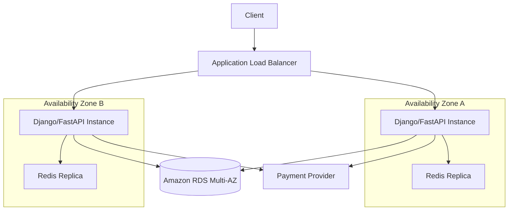

If the payment provider fails, the goal is ensuring only payment functionality becomes degraded rather than causing application-wide failure.

---

## The Request Lifecycle During Failure

Understanding request flow is essential when implementing resilience patterns.

A typical synchronous API request follows this lifecycle.

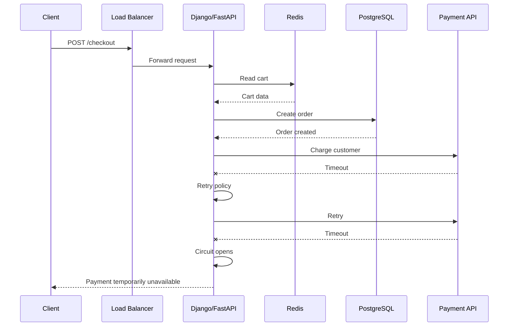

The request succeeds partially because the order may already exist in PostgreSQL while payment remains pending.

A resilient implementation avoids duplicate orders, repeated payment attempts, and inconsistent state by combining idempotency, transactional boundaries, asynchronous workflows, and observability.

---

## Timeout Pattern

### What it is

A timeout defines the maximum duration an application waits for a network operation before considering it failed.

Timeouts exist because network calls can hang indefinitely due to packet loss, overloaded services, DNS problems, or infrastructure degradation.

Every outbound network call should have explicit timeout values.

### Why it exists

Without timeouts, worker threads remain blocked waiting for responses. Eventually the application exhausts:

- Thread pools
- Async workers
- Database connections
- HTTP connection pools
- Kubernetes pod capacity

A slow dependency therefore becomes an application-wide outage.

### How it works

Instead of waiting indefinitely:

```text
Request

        │

        ▼

External Service

        │

        ├── Respond within timeout → Success

        │

        └── Exceeds timeout → Abort request
```

Timeout values should reflect service behavior rather than arbitrary constants.

### Python example

```python
import httpx


async def charge_payment(payload: dict) -> dict:
    timeout = httpx.Timeout(
        connect=2.0,
        read=5.0,
        write=5.0,
        pool=2.0,
    )

    async with httpx.AsyncClient(timeout=timeout) as client:
        response = await client.post(
            "https://payment.example.com/charge",
            json=payload,
        )

        response.raise_for_status()

        return response.json()
```

The timeout configuration separates connection timeout from response timeout, allowing more precise operational tuning.

### Production considerations

Timeout values should be determined from observed latency metrics rather than guesswork.

Typical considerations include:

- P95 latency
- P99 latency
- Network overhead
- Cross-region communication
- Dependency SLA
- User experience requirements

Avoid configuring extremely large timeout values because they delay failure detection and reduce overall throughput.

### Common mistakes

| Mistake | Impact |
|---|---|
| No timeout | Requests hang indefinitely |
| Very large timeout | Slow failures consume resources |
| Same timeout everywhere | Different dependencies require different budgets |
| Ignoring connection timeout | DNS or TCP establishment may stall separately |

---

## Retry Pattern

### What it is

Retries automatically repeat failed operations when failures are likely temporary.

Retries are useful for transient failures such as:

- HTTP 502
- HTTP 503
- Temporary network interruption
- Connection reset
- Message delivery failure

Retries should not blindly repeat every failure.

### Why it exists

Cloud infrastructure occasionally experiences temporary failures even when services remain healthy overall.

A successful retry can avoid exposing infrastructure instability directly to users.

### Retry lifecycle

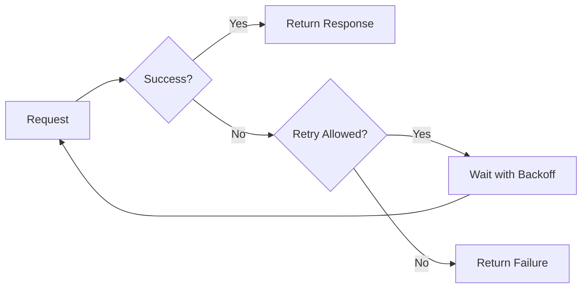

The important engineering decision is determining whether the operation is safe to retry.

### Exponential backoff

Exponential backoff increases waiting time between attempts.

Example sequence:

| Attempt | Delay |
|---|---:|
| First retry | 200 ms |
| Second retry | 400 ms |
| Third retry | 800 ms |
| Fourth retry | 1600 ms |

Adding random jitter prevents thousands of clients from retrying simultaneously.

```python
import asyncio
import random


async def retry(operation, attempts: int = 4):
    delay = 0.2

    for attempt in range(attempts):
        try:
            return await operation()

        except Exception:
            if attempt == attempts - 1:
                raise

            jitter = random.uniform(0, delay)
            await asyncio.sleep(delay + jitter)

            delay *= 2
```

### Advantages

- Handles temporary infrastructure failures
- Improves perceived reliability
- Reduces manual recovery
- Works well with distributed services

### Limitations

Retries increase traffic during outages. Poor retry policies often transform small incidents into major cascading failures.

### Production considerations

Retry only when operations are idempotent or protected using idempotency keys.

Good candidates include:

- GET requests
- Message processing
- Cache reads
- Safe database reads
- Idempotent payment requests

Avoid retrying non-idempotent operations without safeguards.

### Common mistakes

- Retrying validation errors
- Retrying authentication failures
- Infinite retry loops
- Fixed retry intervals
- Retrying overloaded dependencies aggressively

---

## Idempotency Pattern

### What it is

Idempotency ensures executing the same operation multiple times produces the same business outcome.

This pattern is essential whenever retries exist.

For example, a payment API may receive the same request multiple times because the client never received the original response.

Without idempotency:

```text
Request A

Charge $100

Timeout

Retry

Charge another $100
```

With idempotency:

```text
Idempotency Key

checkout_12345

First request → Payment created

Retry → Existing payment returned
```

### Django example

```python
from django.db import transaction
from rest_framework.response import Response
from rest_framework.views import APIView

from orders.models import Payment


class PaymentView(APIView):

    @transaction.atomic
    def post(self, request):
        key = request.headers["Idempotency-Key"]

        payment, created = Payment.objects.get_or_create(
            idempotency_key=key,
            defaults={
                "amount": request.data["amount"],
                "status": "PENDING",
            },
        )

        if not created:
            return Response(
                {
                    "payment_id": payment.id,
                    "status": payment.status,
                }
            )

        # External payment processing happens asynchronously.

        return Response(
            {
                "payment_id": payment.id,
                "status": payment.status,
            },
            status=201,
        )
```

### Production considerations

Store idempotency records in durable storage such as PostgreSQL rather than Redis alone because retries may occur long after cache expiration.

Common implementations include:

- Unique database constraints
- Idempotency key tables
- Distributed request identifiers
- Message deduplication keys

---

## Circuit Breaker Pattern

### What it is

A circuit breaker prevents repeated calls to a failing dependency.

Instead of allowing every request to attempt communication with an unavailable service, the application temporarily stops sending requests.

This protects both the caller and the failing service.

### Circuit states

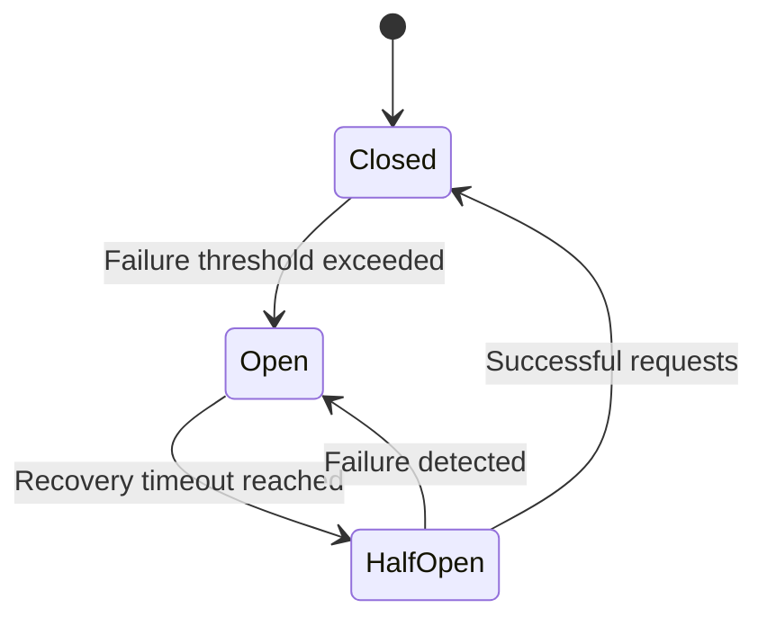

### State explanation

| State | Behavior |
|---|---|
| Closed | Requests pass normally |
| Open | Requests fail immediately |
| Half Open | Limited requests test dependency recovery |

### Why it exists

Imagine a payment provider experiencing an outage.

Without a circuit breaker:

- Every checkout request waits several seconds
- Application workers become blocked
- Request queues grow
- Database connections remain occupied
- Latency increases across unrelated APIs

With a circuit breaker, payment requests fail quickly while the remainder of the application remains healthy.

### Simplified Python implementation

```python
from datetime import datetime, timedelta


class CircuitBreaker:

    def __init__(self, threshold=5, recovery_seconds=30):
        self.threshold = threshold
        self.recovery_seconds = recovery_seconds
        self.failures = 0
        self.open_until = None

    def allow_request(self):

        if self.open_until is None:
            return True

        if datetime.utcnow() >= self.open_until:
            self.open_until = None
            self.failures = 0
            return True

        return False

    def record_success(self):
        self.failures = 0

    def record_failure(self):
        self.failures += 1

        if self.failures >= self.threshold:
            self.open_until = (
                datetime.utcnow()
                + timedelta(seconds=self.recovery_seconds)
            )
```

Production systems usually implement circuit breakers using libraries or service meshes rather than custom code.

### Advantages

- Prevents cascading failures
- Reduces resource exhaustion
- Improves recovery speed
- Protects unhealthy dependencies

### Limitations

- Requires careful threshold tuning
- Temporary false positives are possible
- Does not replace retries or timeouts

---

## Bulkhead Pattern

### What it is

The bulkhead pattern isolates resources so one workload cannot consume all available capacity.

The name originates from ship bulkheads that prevent flooding from spreading between compartments.

In backend systems, bulkheads isolate:

- Worker pools
- Thread pools
- Database connections
- Kubernetes pods
- Celery queues
- HTTP connection pools

### Example architecture

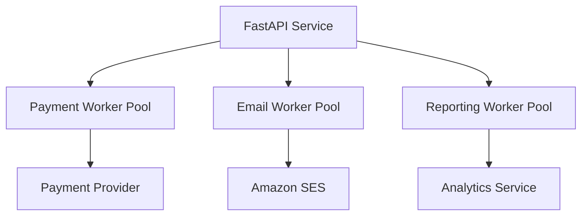

A reporting workload should never consume resources required for payment processing.

### Kubernetes example

Separate deployments provide workload isolation.

```yaml
apiVersion: apps/v1
kind: Deployment
metadata:
  name: payment-service
spec:
  replicas: 6
---
apiVersion: apps/v1
kind: Deployment
metadata:
  name: reporting-service
spec:
  replicas: 2
```

Independent deployments allow each workload to scale and recover independently.

### Production considerations

Use dedicated resource boundaries for critical workloads.

Examples include:

- Separate Celery queues
- Dedicated Redis consumers
- Independent Kubernetes deployments
- Connection pool limits
- Rate limits per dependency

---

## Queue-Based Load Leveling

### What it is

Queue-based load leveling decouples request arrival from processing capacity.

Instead of processing expensive tasks synchronously, requests are placed into a durable queue and processed asynchronously.

AWS commonly provides this through Amazon SQS.

### Architecture

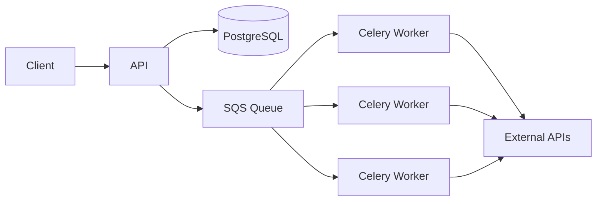

The API returns quickly while workers process tasks independently.

### When to use

Ideal for:

- Email delivery
- Invoice generation
- Image processing
- Report generation
- Notification systems
- Data synchronization
- Kafka event consumers

Avoid using queues for operations requiring immediate synchronous responses.

### Celery example

```python
from celery import shared_task


@shared_task(
    autoretry_for=(ConnectionError,),
    retry_backoff=True,
    retry_kwargs={"max_retries": 5},
)
def send_invoice(order_id: int):

    # Generate invoice.

    # Upload to S3.

    # Send notification.
    return order_id
```

The worker can retry independently without blocking API requests.

### Advantages

- Smooths traffic spikes
- Protects downstream systems
- Improves API responsiveness
- Enables independent worker scaling

### Limitations

- Eventual consistency
- Increased architectural complexity
- Requires queue monitoring
- Duplicate delivery must be handled

---

## Backpressure Pattern

### What it is

Backpressure prevents producers from overwhelming consumers.

When downstream services cannot process requests fast enough, the upstream system slows acceptance or buffers work.

Without backpressure:

```text
10,000 Requests/sec

↓

API

↓

Database can process 2,000/sec

↓

Connection exhaustion

↓

Complete outage
```

With backpressure:

```text
10,000 Requests/sec

↓

Rate Limiting

↓

Queue

↓

2,000/sec Processing Capacity
```

The system remains stable even when demand exceeds immediate processing capacity.

### AWS implementations

Backpressure is commonly implemented using:

- SQS queues
- API Gateway throttling
- Application Load Balancer
- Lambda concurrency limits
- Kubernetes resource quotas
- Redis rate limiting

### Production considerations

Backpressure policies should prioritize critical workloads.

For example:

| Request Type | Priority |
|---|---|
| Payment | High |
| Login | High |
| Product Search | Medium |
| Analytics | Low |
| Report Export | Low |

Critical operations should receive capacity before background workloads.

---

## Graceful Degradation

### What it is

Graceful degradation allows the application to provide reduced functionality when optional dependencies fail.

The goal is serving useful responses rather than complete failure.

### Example

Product page dependencies:

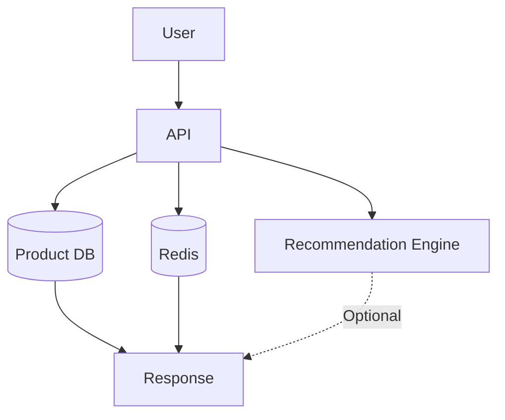

If the recommendation engine fails, the product page should still load without recommendations.

### Django example

```python
def product_detail(product_id):

    product = get_product(product_id)

    try:
        recommendations = get_recommendations(product_id)
    except Exception:
        recommendations = []

    return {
        "product": product,
        "recommendations": recommendations,
    }
```

### Suitable degradation strategies

- Disable recommendations
- Disable analytics widgets
- Return cached data
- Delay notifications
- Disable non-critical search filters
- Serve stale cache during backend outage

### Production considerations

Always identify critical and non-critical dependencies during architecture design.

A payment system cannot gracefully skip charging customers, but an analytics dashboard can tolerate delayed updates.

---

## Health Check Pattern

### What it is

Health checks allow infrastructure to determine whether an application instance should receive traffic.

AWS load balancers continuously evaluate application health before routing requests.

Typical health endpoints include:

- `/health`
- `/live`
- `/ready`

### Liveness vs readiness

| Endpoint | Purpose |
|---|---|
| Liveness | Determines whether application process is alive |
| Readiness | Determines whether application can accept traffic |

A service may be alive but not ready because database connections are unavailable.

### FastAPI example

```python
from fastapi import FastAPI
from fastapi.responses import JSONResponse

app = FastAPI()


@app.get("/live")
async def live():
    return {"status": "alive"}


@app.get("/ready")
async def ready():

    database_ok = await check_database()

    if not database_ok:
        return JSONResponse(
            status_code=503,
            content={"status": "not_ready"},
        )

    return {"status": "ready"}
```

### Production considerations

Health checks should remain lightweight.

Avoid expensive operations such as:

- Large database queries
- External API calls
- Full cache scans
- Long-running validations

The objective is determining service readiness rather than testing every dependency.

---

## Failover Pattern

### What it is

Failover redirects traffic from an unhealthy component to a healthy alternative.

AWS commonly provides infrastructure-level failover through:

- Multi-AZ RDS
- Elastic Load Balancing
- Route 53 failover routing
- ECS service replacement
- Kubernetes replica scheduling

### Example

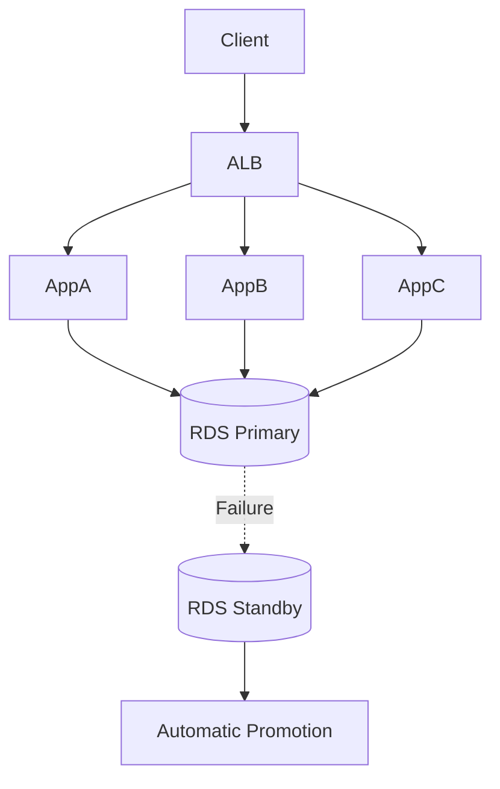

The application continues operating after infrastructure automatically promotes the standby database.

### Production considerations

Failover only works when applications reconnect correctly.

Backend applications should implement:

- Connection retry
- DNS refresh handling
- Connection pool recovery
- Short-lived database connections where appropriate

Applications that cache stale database connections may experience extended recovery even when infrastructure failover succeeds.

---

## Rate Limiting

### What it is

Rate limiting restricts how many requests clients can perform within a defined period.

It improves resilience by protecting services from:

- Abuse
- Accidental retry storms
- Scrapers
- Denial-of-service amplification
- Resource exhaustion

### Token bucket concept

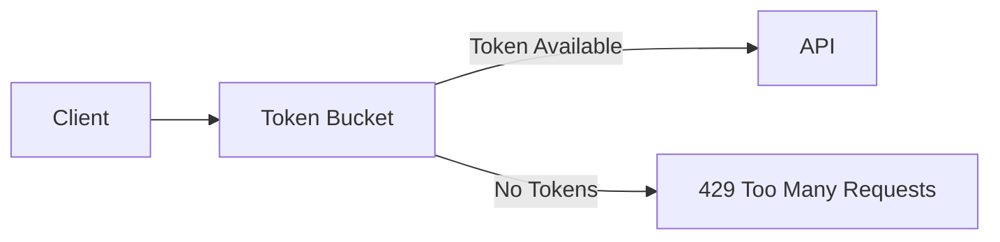

Tokens replenish gradually, allowing controlled request throughput.

### Redis implementation concept

```python
from redis import Redis

redis = Redis(host="localhost", port=6379)


def allow_request(user_id: str, limit: int = 100):

    key = f"rate:{user_id}"

    current = redis.incr(key)

    if current == 1:
        redis.expire(key, 60)

    return current <= limit
```

Production implementations typically use atomic Lua scripts or dedicated middleware to avoid race conditions.

### AWS services

Rate limiting can be enforced through:

- API Gateway throttling
- AWS WAF
- CloudFront
- Application middleware
- Redis distributed rate limiter

---

## Isolation Through Service Boundaries

Resilience improves significantly when services remain independently deployable.

Consider two architectures.

### Shared monolith

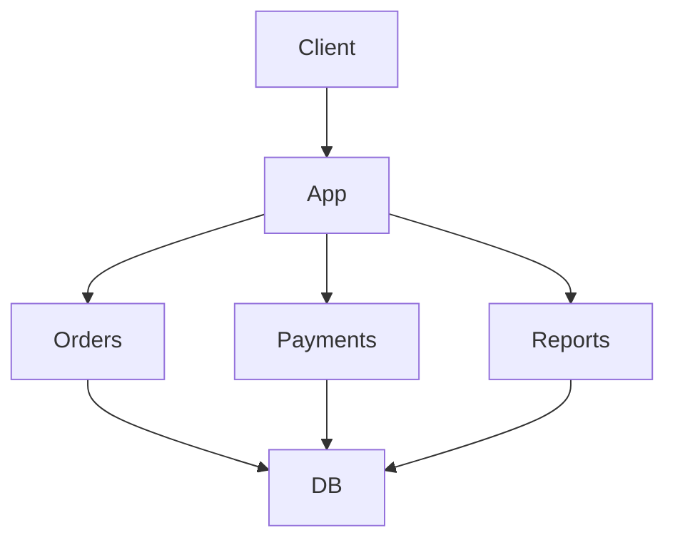

A reporting memory leak may destabilize payment processing because everything shares the same runtime.

### Isolated services

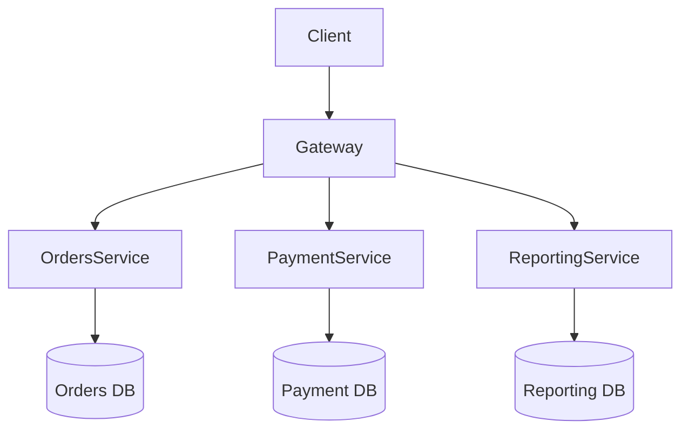

Failures become easier to isolate because services scale and restart independently.

Microservices improve fault isolation but introduce distributed systems complexity, so they should be adopted only when justified.

---

## Resilience Patterns in AWS Architecture

The following AWS services commonly participate in resilient backend architectures.

| AWS Service | Resilience Contribution |
|---|---|
| Application Load Balancer | Routes traffic only to healthy targets |
| Amazon EC2 Auto Scaling | Replaces failed instances automatically |
| Amazon ECS | Restarts unhealthy containers |
| Amazon EKS | Self-healing pods and workload scheduling |
| Amazon RDS Multi-AZ | Database failover across Availability Zones |
| Amazon ElastiCache Redis | Distributed caching and reduced database pressure |
| Amazon SQS | Durable asynchronous buffering |
| Amazon SNS | Fan-out event delivery |
| Amazon EventBridge | Event-driven service integration |
| Amazon CloudWatch | Metrics, alarms, and operational visibility |
| Route 53 | DNS-based failover routing |

Resilience emerges from combining these services with application-level patterns rather than relying on infrastructure alone.

---

## Production Architecture Example

A production order processing platform using Django, Redis, PostgreSQL, Celery, SQS, and AWS.

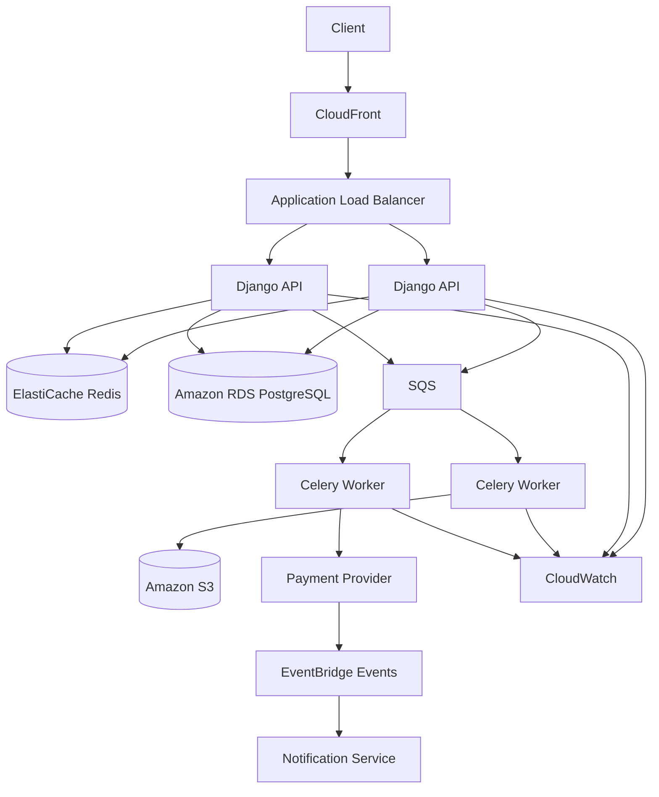

### Request flow

1. Client sends checkout request.
2. CloudFront forwards traffic to the Application Load Balancer.
3. ALB routes the request to a healthy Django instance.
4. Django retrieves cached data from Redis when available.
5. Order state is written to PostgreSQL.
6. Background processing is published to SQS.
7. Celery workers consume messages independently.
8. Payment and notification workflows execute asynchronously.
9. CloudWatch collects metrics, logs, and alarms.

This architecture separates synchronous user interactions from expensive background operations while maintaining durability and operational visibility.

---

## Choosing the Right Resilience Pattern

Different failures require different patterns.

| Failure Scenario | Recommended Pattern |
|---|---|
| External API temporarily unavailable | Timeout + Retry + Circuit Breaker |
| Sudden traffic spike | Queue-Based Load Leveling |
| Worker overload | Bulkhead + Backpressure |
| Duplicate client requests | Idempotency |
| Optional feature unavailable | Graceful Degradation |
| Application instance crashes | Health Checks + Auto Scaling |
| Database failover | Retry + Connection Recovery |
| Excessive client traffic | Rate Limiting |
| Slow dependency | Timeout + Circuit Breaker |

The correct design usually combines multiple patterns rather than selecting only one.

---

## Observability and Monitoring

Resilience cannot be improved without visibility into failures.

Production systems should continuously monitor:

### Application metrics

- Request latency
- Error rate
- Throughput
- Active requests
- Retry count
- Circuit breaker state

### Infrastructure metrics

- CPU utilization
- Memory utilization
- Container restarts
- Pod availability
- Database connections
- Redis memory usage

### Queue metrics

- Queue depth
- Message age
- Processing throughput
- Dead-letter queue size
- Consumer failures

### CloudWatch alarms

Typical alarms include:

| Metric | Example Alarm |
|---|---|
| HTTP 5xx | Error rate exceeds threshold |
| Target unhealthy count | ALB detects unhealthy instances |
| RDS CPU | Sustained high database CPU |
| Redis memory | Cache approaching memory limit |
| SQS queue age | Messages delayed beyond acceptable limit |
| DLQ messages | Any unexpected dead-letter messages |

Distributed tracing through OpenTelemetry and AWS X-Ray helps identify where latency originates across microservices.

---

## Dead Letter Queues

A Dead Letter Queue stores messages that repeatedly fail processing.

Instead of retrying indefinitely, failed messages move into a separate queue for investigation.

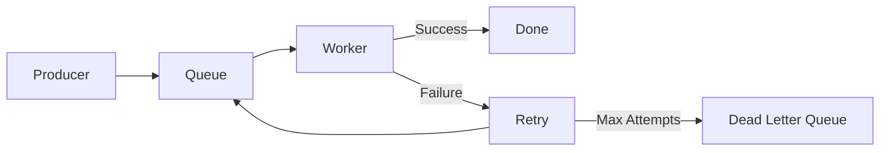

### Why DLQs matter

Without a DLQ:

- Poison messages block processing
- Infinite retries consume resources
- Operational debugging becomes difficult

With a DLQ, engineers can inspect problematic messages without affecting healthy workloads.

### Common use cases

- Invalid event payload
- Missing referenced record
- Third-party integration failure
- Serialization error
- Business validation issue

DLQ processing should be monitored and reviewed regularly rather than treated as permanent storage.

---

## Security Considerations

Resilience and security frequently overlap because uncontrolled traffic and malicious activity can trigger cascading failures.

### Recommended practices

- Enforce authentication before expensive processing.
- Apply API rate limits.
- Use AWS WAF for application protection.
- Encrypt messages stored in queues.
- Encrypt Redis and PostgreSQL connections.
- Store secrets in AWS Secrets Manager.
- Use IAM roles instead of static credentials.
- Restrict security groups between services.
- Validate all incoming event payloads.

Never assume internal services are trustworthy solely because they reside inside a VPC.

---

## Scalability Considerations

Resilience patterns should scale with workload.

### Horizontal scaling

Preferred for stateless Django and FastAPI services.

```text
10 Requests

↓

2 Instances


1000 Requests

↓

20 Instances
```

Load balancers distribute traffic while Auto Scaling adjusts capacity.

### Worker scaling

Celery workers should scale independently from API servers.

For example:

| Component | Scaling Trigger |
|---|---|
| API containers | CPU or request count |
| Celery workers | Queue depth |
| Kafka consumers | Partition lag |
| Redis replicas | Read throughput |
| Database replicas | Read-heavy workloads |

Independent scaling prevents unnecessary infrastructure expansion.

---

## Reliability and Deployment Practices

Resilience begins during deployment rather than after incidents occur.

### Recommended deployment strategy

- Rolling deployments
- Blue-green deployment
- Canary releases
- Automated health validation
- Automatic rollback
- Infrastructure as Code
- Immutable container images

CI/CD pipelines should verify:

- Health endpoints
- Database migration compatibility
- Backward API compatibility
- Message schema compatibility
- Rollback readiness

Deployment failures should remain isolated rather than affecting every production instance simultaneously.

---

## Common Production Pitfalls

### Retrying everything

Retries are beneficial only for transient failures. Retrying invalid requests increases load without improving success probability.

**Avoid:** Retrying HTTP 400 validation failures.

**Prefer:** Retry temporary infrastructure failures only.

### Missing idempotency

Network failures frequently cause clients to resend requests.

Without idempotency, duplicate payments, duplicate orders, and duplicated events become inevitable.

### Shared worker pools

Running every background task inside one Celery queue allows low-priority workloads to starve critical tasks.

Separate queues improve fault isolation.

### Long synchronous workflows

Generating reports, processing images, and sending notifications inside HTTP requests dramatically increases latency and failure probability.

Move expensive work into asynchronous queues.

### Ignoring observability

Applications often contain retries and circuit breakers without exposing their metrics.

A resilience mechanism that cannot be observed becomes difficult to tune and troubleshoot.

---

## Interview Perspective

### Why are retries dangerous?

Retries increase traffic during outages. Without exponential backoff and jitter they can create retry storms that overwhelm already unhealthy services.

### Why are circuit breakers useful?

They prevent repeated communication with failing dependencies, allowing applications to fail fast and protect resources while giving downstream systems time to recover.

### What is the difference between bulkhead and circuit breaker?

A bulkhead isolates resource capacity between workloads, while a circuit breaker stops communication with an unhealthy dependency. One protects internal resources; the other protects dependency interactions.

### Why is idempotency important in distributed systems?

Because network failures make duplicate requests unavoidable. Idempotency ensures repeated execution produces one business outcome instead of duplicated transactions.

### Why are queues considered resilience mechanisms?

Queues absorb traffic spikes, decouple producers from consumers, enable asynchronous recovery, and prevent downstream systems from becoming immediately overloaded.

---

## Production Checklist

Before deploying a resilient backend service, verify the following.

### Application

- Explicit HTTP client timeouts configured
- Retry policy uses exponential backoff with jitter
- Idempotency implemented for critical write operations
- Circuit breakers configured for unreliable dependencies
- Optional features support graceful degradation
- Health and readiness endpoints available

### Infrastructure

- Multiple application instances behind ALB
- Auto Scaling enabled where appropriate
- RDS Multi-AZ configured for critical databases
- Redis configured for distributed caching
- SQS used for asynchronous workloads
- Dead Letter Queue configured for failed messages

### Operations

- CloudWatch dashboards available
- Error rate alarms configured
- Queue depth alarms configured
- Database connection monitoring enabled
- Distributed tracing enabled
- Deployment rollback automated

---

## Key Takeaways

- Resilience patterns are application and infrastructure techniques that contain failures, enable recovery, and prevent cascading outages in distributed systems.
- Timeouts, retries with exponential backoff, idempotency, and circuit breakers should be designed together because each addresses a different failure mode.
- Bulkheads, queues, and backpressure isolate workloads and protect critical services from overload during traffic spikes or dependency degradation.
- Health checks, failover mechanisms, observability, and Dead Letter Queues provide the operational foundation required for reliable production AWS architectures.
- Graceful degradation and fault isolation are often more valuable than attempting to make every dependency permanently available.