# 02- Scalability Patterns

## Overview

Scalability is the ability of a system to handle increasing workload by adding resources, improving resource utilization, or changing how work is distributed. In production backend systems, scalability is not simply a matter of adding more EC2 instances. A system scales only when its critical components can increase capacity without creating a new bottleneck elsewhere.

A typical backend request may traverse a load balancer, application servers, Redis, PostgreSQL, external APIs, and asynchronous workers. Scaling one component independently can move the bottleneck rather than remove it. For example, increasing Django instances from 4 to 40 does not solve a PostgreSQL connection bottleneck if every application instance opens too many database connections.

Scalable architecture therefore requires understanding:

- Workload characteristics
- Statelessness
- Horizontal and vertical scaling
- Load distribution
- Caching
- Database scaling
- Asynchronous processing
- Partitioning and sharding
- Connection management
- Autoscaling
- Read/write patterns
- Bottleneck identification
- Capacity planning

The core principle is:

> **Scale the bottleneck, not the component that is easiest to scale.**

---

## Scalability Dimensions

Scalability can be evaluated across several dimensions.

| Dimension | Question |
|---|---|
| Compute | Can application processing capacity increase? |
| Network | Can the system handle increasing traffic? |
| Database | Can reads and writes scale independently? |
| Storage | Can data volume grow without operational degradation? |
| Cache | Can frequently accessed data be served without overloading the database? |
| Messaging | Can asynchronous workloads absorb traffic spikes? |
| Architecture | Can individual services scale independently? |
| Operations | Can deployment and infrastructure automation keep pace with growth? |

A system may scale well in one dimension while failing in another.

For example:

```text
Application Capacity
        ↑
        │
        │       ┌───────────────┐
        │       │ Django/FastAPI│
        │       └───────┬───────┘
        │               │
        │               ▼
        │       ┌───────────────┐
        │       │  PostgreSQL   │  ← Bottleneck
        │       └───────────────┘
        │
        └────────────────────────→ Traffic
```

Adding application instances will not increase overall system throughput if PostgreSQL remains the limiting resource.

---

## Vertical Scaling

### What it is

Vertical scaling increases the capacity of an existing machine or resource.

For example:

```text
4 vCPU / 16 GB RAM
        ↓
8 vCPU / 32 GB RAM
        ↓
16 vCPU / 64 GB RAM
```

AWS supports vertical scaling for many managed services and compute resources by changing instance or capacity configurations.

### When to use it

Vertical scaling is useful when:

- The workload is difficult to distribute.
- A database requires larger CPU or memory capacity.
- The application has a single-threaded bottleneck.
- Horizontal scaling introduces unnecessary complexity.
- The workload is relatively predictable.

### Advantages

- Simple operational model
- Minimal application changes
- Useful for databases
- Often provides immediate capacity improvement

### Limitations

- Hardware has an upper limit.
- Larger instances become increasingly expensive.
- A single machine remains a failure domain.
- Scaling may require resource modification or restart.

### Production consideration

Vertical scaling should usually be combined with redundancy.

A large single PostgreSQL instance may have more capacity than several small instances, but it remains a critical failure domain unless configured with appropriate high-availability mechanisms.

---

## Horizontal Scaling

### What it is

Horizontal scaling adds more instances instead of making one instance larger.

```text
                 ┌──────────────┐
                 │ Load Balancer│
                 └──────┬───────┘
                        │
             ┌──────────┼──────────┐
             ▼          ▼          ▼
          App #1     App #2     App #3
```

This is the preferred scaling model for stateless web applications.

### AWS implementations

Common options include:

- EC2 Auto Scaling Groups
- Amazon ECS
- Amazon EKS
- AWS Lambda
- Application Load Balancer

### Requirements for horizontal scaling

The application should generally be:

- Stateless
- Independently deployable
- Able to share durable state through external systems
- Safe to restart
- Observable
- Idempotent where necessary

### Django example

Avoid storing session state directly inside application process memory.

Prefer:

```python
SESSION_ENGINE = "django.contrib.sessions.backends.cache"
SESSION_CACHE_ALIAS = "default"
```

with Redis or another shared backend where appropriate.

Application instances can then be added or removed without losing session state.

---

## Stateless Application Architecture

Statelessness is one of the most important prerequisites for horizontal scaling.

A stateless application does not depend on local process memory or local filesystem state to preserve user-specific information between requests.

### Poorly scalable design

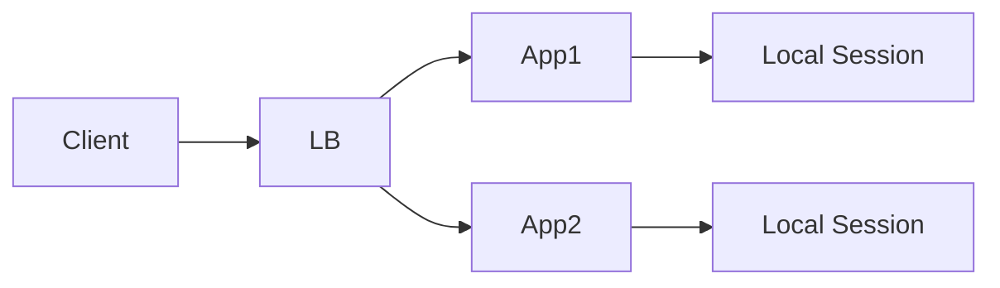

A request may reach a different instance and lose access to the required state.

### Scalable design

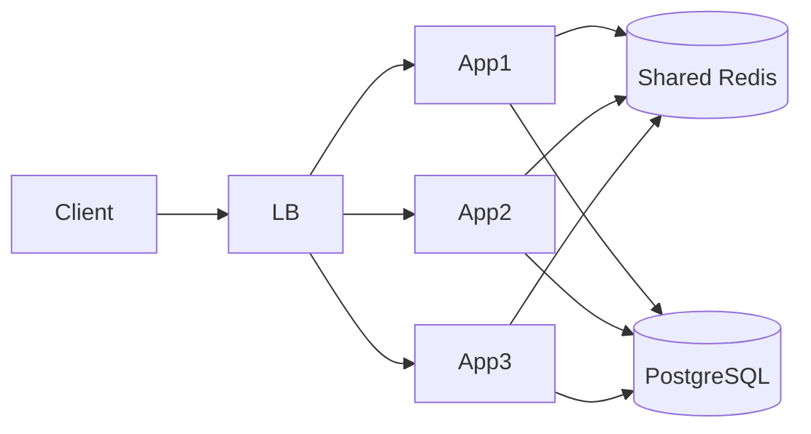

State is moved into shared infrastructure.

### State that should generally not live in application memory

- User sessions
- Distributed locks
- Persistent job state
- Shared counters
- Business data
- Authentication state
- Long-lived workflow state

Local memory remains useful for short-lived computation and process-local caches, but it should not become a hidden dependency for correctness.

---

## Load Balancing

### What it is

Load balancing distributes requests across multiple healthy application instances.

AWS Application Load Balancer is commonly used for HTTP and HTTPS workloads.

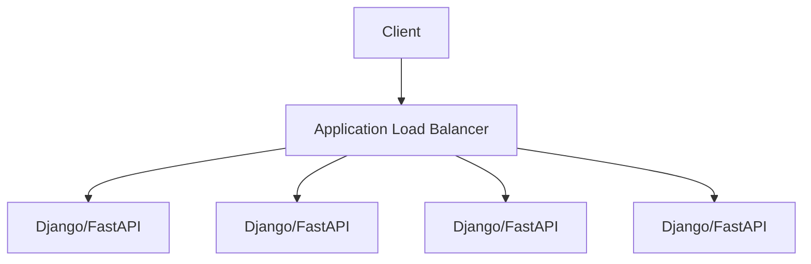

### Why it matters

Load balancing enables:

- Horizontal scaling
- Health-based routing
- Rolling deployments
- Instance replacement
- Traffic distribution
- Fault isolation

### Health checks

A load balancer should route traffic only to healthy instances.

Typical endpoint:

```http
GET /health
```

Health checks should be fast and deterministic.

Avoid using an expensive query or complex business workflow as a load-balancer health check.

---

## Connection Management

Scaling application servers increases the number of connections to downstream systems.

This is one of the most common scalability problems in Django and FastAPI systems.

Suppose:

```text
20 application instances

Each instance:
50 database connections

Total:
1,000 database connections
```

A PostgreSQL cluster may not support that connection count efficiently.

### Connection pool sizing

The correct pool size depends on:

- Database CPU
- Query latency
- Number of application instances
- Concurrent request volume
- Workload type
- PostgreSQL configuration

More connections do not automatically increase throughput.

Too many connections can cause:

- Context switching
- Memory pressure
- Lock contention
- Connection exhaustion
- Increased query latency

### Production strategy

Use controlled connection pooling and consider Amazon RDS Proxy where appropriate for workloads that create large numbers of short-lived database connections.

---

## Caching

### What it is

Caching stores frequently accessed data closer to the application so expensive operations do not need to execute repeatedly.

Typical architecture:

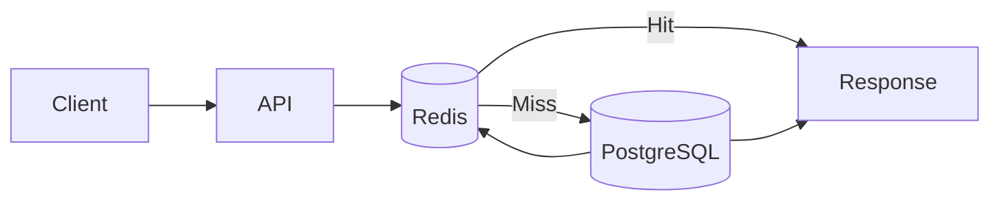

### Why caching improves scalability

Suppose a product endpoint receives:

```text
10,000 requests/sec
```

If every request executes a database query:

```text
10,000 DB queries/sec
```

If 90% of requests are served from Redis:

```text
1,000 DB queries/sec
9,000 cache responses/sec
```

The database workload decreases substantially.

### Suitable cached data

- Product metadata
- Configuration
- Frequently accessed profiles
- Computed aggregates
- Authorization metadata
- Session data
- API responses

### Poor cache candidates

- Highly volatile transactional data
- Data requiring strict consistency
- Large objects with low reuse
- Data with unpredictable access patterns

### Cache invalidation

Cache invalidation is often harder than cache insertion.

Common strategies include:

| Strategy | Description |
|---|---|
| TTL | Data expires automatically |
| Write-through | Cache updated with database writes |
| Cache-aside | Application loads database data on cache miss |
| Event-driven invalidation | Events invalidate affected entries |
| Versioned keys | New versions bypass stale entries |

For most Django/FastAPI applications, cache-aside with appropriate TTLs is a practical starting point.

---

## Cache-Aside Pattern

The application first checks the cache and loads the database only on a miss.

```python
async def get_product(product_id: int):
    key = f"product:{product_id}"

    cached = await redis.get(key)

    if cached is not None:
        return cached

    product = await load_product_from_database(product_id)

    await redis.set(
        key,
        serialize(product),
        ex=300,
    )

    return product
```

### Production concerns

Watch for:

- Cache stampedes
- Hot keys
- Stale data
- Serialization overhead
- Redis memory pressure
- Eviction behavior

Caching should reduce database load without becoming a new single point of failure.

---

## Cache Stampede

A cache stampede occurs when a popular cache entry expires and many requests simultaneously query the underlying database.

```text
Popular key expires

       ↓

10,000 requests arrive

       ↓

All see cache miss

       ↓

10,000 database queries

       ↓

Database overload
```

Mitigation strategies include:

- Request coalescing
- Distributed locks
- Randomized TTLs
- Background refresh
- Stale-while-revalidate
- Prewarming

For highly popular keys, a small amount of stale data may be preferable to overwhelming the database.

---

## Read Replicas

### What it is

Read replicas distribute database read workloads across additional database instances.

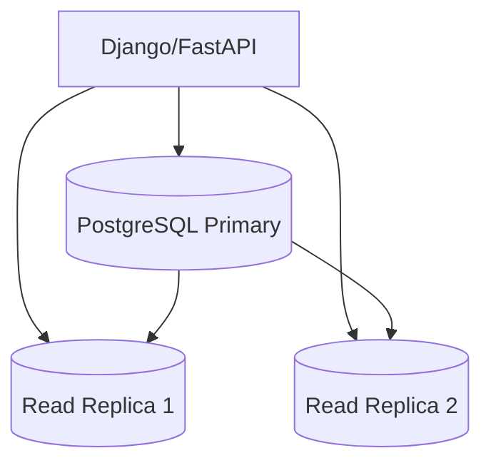

Writes go to the primary database while eligible reads can be distributed across replicas.

### When to use

Read replicas are useful when:

```text
Read traffic >> Write traffic
```

For example:

```text
100,000 reads/sec
5,000 writes/sec
```

### Limitations

Read replicas introduce replication lag.

A user may write data to the primary and immediately read from a replica that has not received the change yet.

This creates eventual consistency.

### Django example

Django supports database routing:

```python
DATABASES = {
    "default": {
        "ENGINE": "django.db.backends.postgresql",
        "NAME": "application",
        "HOST": "primary.example.internal",
    },
    "replica": {
        "ENGINE": "django.db.backends.postgresql",
        "NAME": "application",
        "HOST": "replica.example.internal",
    },
}
```

Routing should be explicit and carefully tested. Authentication, transactions, and read-after-write workflows often require primary reads.

---

## Database Indexing

Database scalability is often improved more effectively by query optimization than by adding infrastructure.

A query such as:

```sql
SELECT *
FROM orders
WHERE customer_id = 12345
ORDER BY created_at DESC
LIMIT 20;
```

may require an appropriate index.

For example:

```sql
CREATE INDEX CONCURRENTLY idx_orders_customer_created
ON orders (customer_id, created_at DESC);
```

### Why indexes matter

Without a suitable index:

```text
Large table
    ↓
Sequential scan
    ↓
More CPU + I/O
    ↓
Higher latency
```

With a suitable index:

```text
Index lookup
    ↓
Small result set
    ↓
Lower I/O
    ↓
Lower latency
```

Indexes improve read performance but increase:

- Storage usage
- Write cost
- Maintenance overhead
- Vacuum workload

Do not index every column automatically.

---

## Query Optimization

Before scaling infrastructure, inspect query behavior.

Important metrics include:

- Query latency
- Rows scanned
- Rows returned
- Query frequency
- Lock wait time
- CPU consumption
- Buffer/cache hit ratio

Use PostgreSQL tools such as:

```sql
EXPLAIN (ANALYZE, BUFFERS)
SELECT *
FROM orders
WHERE customer_id = 12345
ORDER BY created_at DESC
LIMIT 20;
```

Look for:

- Sequential scans on large tables
- Excessive rows removed by filters
- Expensive sorts
- Nested loop explosions
- Poor join strategies
- Missing indexes

A query executed 100,000 times per minute deserves more attention than a rare query that consumes more CPU per execution.

---

## Asynchronous Processing

Synchronous processing makes the API request wait for downstream work.

For example:

```text
POST /orders

↓

Create order

↓

Generate invoice

↓

Send email

↓

Call analytics API

↓

Return response
```

The API latency becomes the sum of all operations.

Asynchronous processing separates immediate user-facing work from background processing.

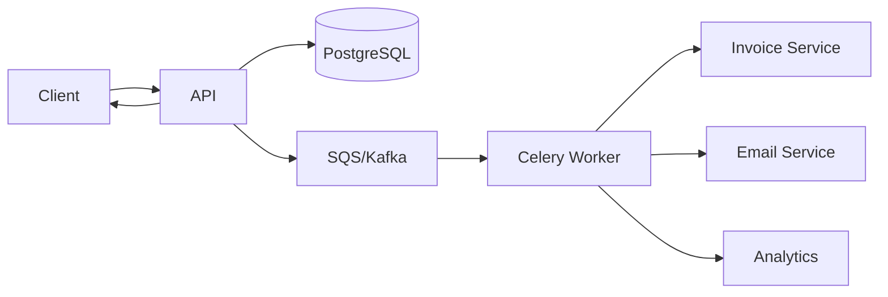

### Suitable workloads

- Email
- Reports
- Notifications
- Image processing
- Data synchronization
- Analytics
- Batch processing

### Benefits

- Lower API latency
- Independent scaling
- Traffic buffering
- Better fault isolation

### Trade-off

Asynchronous processing introduces eventual consistency and operational complexity.

---

## Queue-Based Scaling

Queues allow consumers to scale based on workload rather than request rate alone.

For example:

```text
SQS Queue Depth
      │
      │        ╭──────╮
      │       ╱        ╲
      │──────╯          ╲────
      │
      └──────────────────────→ Time
```

When queue depth increases, worker capacity can be increased.

### Scaling signals

Useful worker autoscaling signals include:

- Queue depth
- Approximate age of oldest message
- Consumer processing latency
- Kafka consumer lag
- CPU utilization

Queue depth alone can be misleading if messages have very different processing costs. Message age is often a stronger signal for user-facing SLAs.

---

## Partitioning

### What it is

Partitioning divides a large dataset into smaller logical or physical segments.

A PostgreSQL table containing billions of rows may be partitioned by time.

```text
orders

├── orders_2026_01
├── orders_2026_02
├── orders_2026_03
└── orders_2026_04
```

### When to use

Partitioning becomes useful when:

- Tables become very large
- Queries naturally filter by partition key
- Data has predictable lifecycle boundaries
- Old data can be archived or removed efficiently

### Example

```sql
CREATE TABLE events (
    id BIGINT,
    created_at TIMESTAMPTZ NOT NULL,
    payload JSONB
) PARTITION BY RANGE (created_at);
```

Partitioning does not automatically make every query faster. Queries need to contain predicates that allow partition pruning.

---

## Sharding

### What it is

Sharding distributes data across independent database nodes.

For example:

```text
Customer ID

1000-1999 → Shard A
2000-2999 → Shard B
3000-3999 → Shard C
```

### When to use

Sharding is generally considered when a single database cannot provide sufficient:

- Storage capacity
- Write throughput
- CPU capacity
- I/O throughput

### Why it is difficult

Distributed databases introduce:

- Cross-shard queries
- Distributed transactions
- Rebalancing
- Routing complexity
- Operational overhead
- Hot shard risks

Sharding should therefore be treated as a late-stage scaling strategy rather than a default architecture.

---

## Consistent Hashing

Consistent hashing helps distribute keys across changing sets of nodes while minimizing key movement.

It is commonly useful for distributed caches and some partitioned systems.

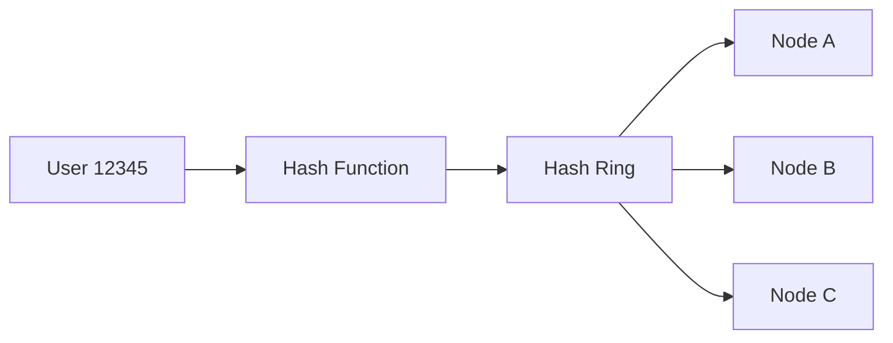

When a node is added, only a subset of keys needs to move rather than redistributing the entire dataset.

This reduces rebalancing cost and cache churn.

---

## CDN and Edge Caching

Content that does not need to be generated dynamically for every request can be served from a CDN.

AWS CloudFront can cache content close to users.

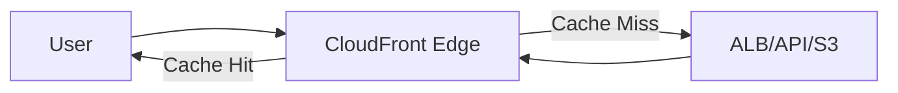

### Suitable content

- Static JavaScript
- CSS
- Images
- Video
- Public API responses with appropriate caching
- Downloadable files

CDN caching reduces:

- Origin traffic
- Latency
- Bandwidth consumption
- Application server load

### Security considerations

Do not cache personalized responses unless cache keys and cache-control behavior are designed correctly.

A cache configuration mistake can expose one user's response to another user.

---

## Rate Limiting and Admission Control

Scalability requires controlling demand when demand exceeds available capacity.

For example:

```text
System capacity = 5,000 requests/sec

Incoming traffic = 20,000 requests/sec

Without admission control:
20,000 requests enter the system

With admission control:
5,000 requests processed
15,000 rejected/throttled
```

Returning HTTP `429 Too Many Requests` can be healthier than allowing every request to consume resources until the entire service fails.

Common mechanisms include:

- API Gateway throttling
- AWS WAF
- Redis token bucket
- Nginx rate limiting
- Application-level quotas

---

## Autoscaling

### What it is

Autoscaling adjusts compute capacity according to workload.

AWS Auto Scaling can increase or decrease application instances based on configured policies.

### Example

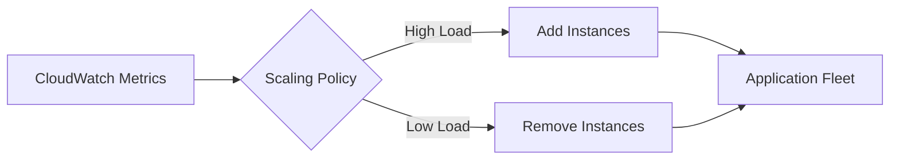

### Scaling signals

Possible signals include:

| Signal | Suitable Workload |
|---|---|
| CPU utilization | CPU-bound application |
| Memory utilization | Memory-heavy workload |
| Request count | HTTP APIs |
| Target response time | Latency-sensitive API |
| Queue depth | Background workers |
| Kafka consumer lag | Event consumers |

### Common mistake

CPU is not always the correct autoscaling signal.

An API may have low CPU but high latency because it is waiting on:

- PostgreSQL
- Redis
- External APIs
- Network I/O

For these workloads, request latency or queue depth may be a better signal.

---

## Service Decomposition

Microservices can scale individual workloads independently.

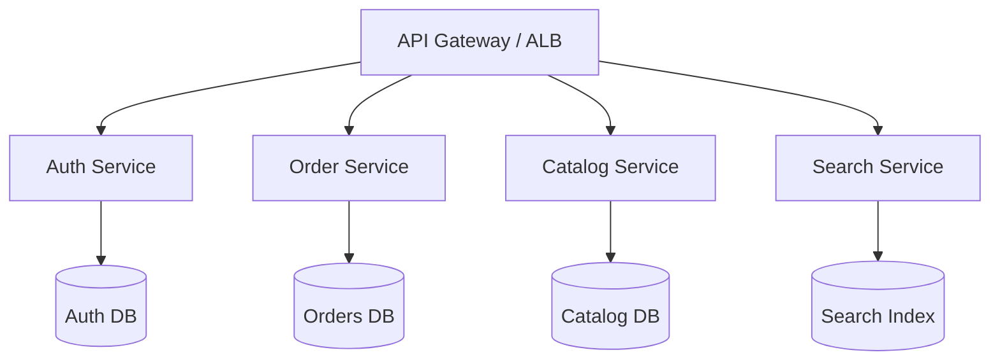

For example, if catalog traffic increases 20x while authentication traffic remains stable, only the catalog service needs significant additional capacity.

### Trade-offs

Microservices also introduce:

- Network calls
- Distributed transactions
- Service discovery
- Observability requirements
- Deployment complexity
- Data consistency challenges

Service decomposition should follow workload and domain boundaries rather than arbitrary technical layers.

---

## Event-Driven Scaling

Kafka and other event streaming systems allow producers and consumers to scale independently.

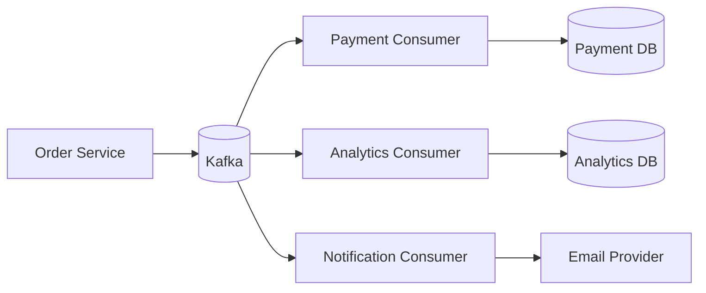

Kafka partitions allow consumer groups to process events in parallel.

### Scaling rule

For a Kafka consumer group:

```text
More partitions
        ↓
More potential consumer parallelism
```

A consumer group cannot achieve useful parallelism beyond the number of partitions for a topic.

Partition count therefore becomes an architectural scaling decision.

---

## Hot Partitions and Hot Keys

A theoretically scalable architecture can still fail because traffic is unevenly distributed.

Suppose a Kafka topic has 20 partitions but one customer generates 80% of events because partitioning uses customer ID.

```text
Partition 1 → 80% traffic
Partitions 2-20 → 20% traffic
```

The system has 20 partitions but effectively behaves like a one-partition workload.

Similar problems occur with Redis hot keys and database shard hotspots.

### Mitigation

- Choose appropriate partition keys
- Distribute high-volume entities
- Use key salting where appropriate
- Split extremely hot tenants
- Monitor per-partition throughput
- Avoid assuming uniform traffic

---

## Scalability Bottleneck Analysis

A production engineer should identify the actual bottleneck before changing architecture.

A useful investigation sequence is:

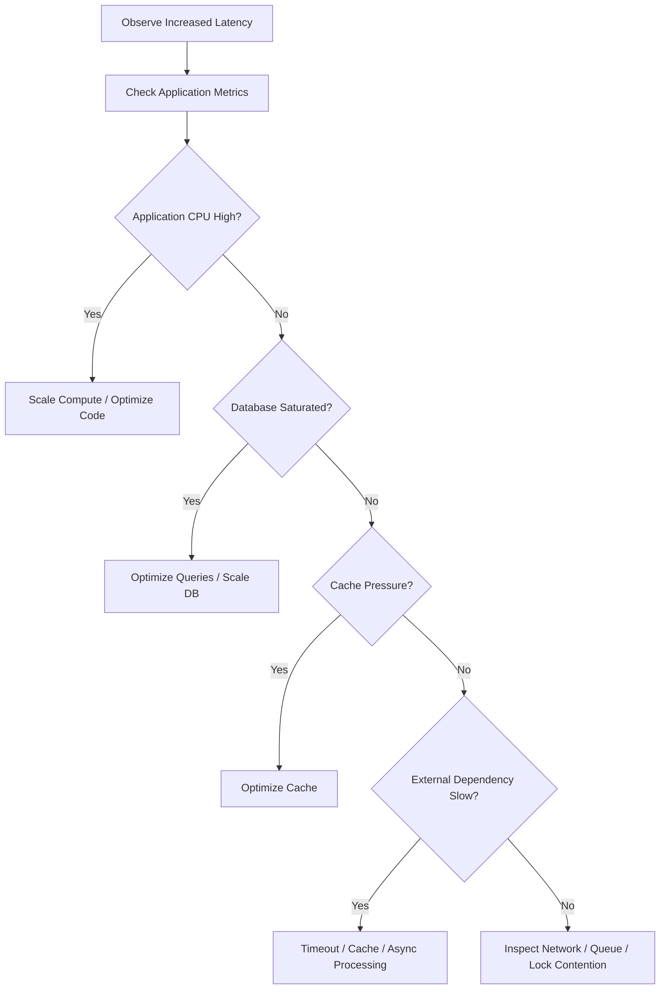

Scaling decisions should be based on measurable constraints rather than intuition.

---

## Capacity Planning

Capacity planning estimates how much infrastructure is required to handle expected workloads.

Important inputs include:

- Requests per second
- Average and peak traffic
- Payload size
- CPU cost per request
- Memory usage
- Database queries per request
- Cache hit ratio
- Queue processing rate
- Growth rate

For example:

```text
Peak traffic = 10,000 RPS

Average application capacity =
500 RPS per instance

Required instances =
10,000 / 500 = 20

Operational headroom =
30%

Target fleet =
26 instances
```

The actual number should be validated through load testing rather than relying solely on theoretical calculations.

---

## Load Testing

Scalability claims should be validated experimentally.

Useful tools include:

- k6
- Locust
- JMeter
- Gatling

A load test should measure:

- Throughput
- P50 latency
- P95 latency
- P99 latency
- Error rate
- CPU
- Memory
- Database utilization
- Cache hit ratio
- Queue latency

Example k6 test:

```javascript
import http from "k6/http";
import { check } from "k6";

export const options = {
    stages: [
        { duration: "2m", target: 100 },
        { duration: "5m", target: 500 },
        { duration: "2m", target: 1000 },
    ],
};

export default function () {
    const response = http.get("https://api.example.com/products");

    check(response, {
        "status is 200": (r) => r.status === 200,
    });
}
```

The purpose is not simply determining maximum RPS. It is identifying where latency or error rates begin to degrade.

---

## Scalability and Database Transactions

Transactions can become a scaling constraint when they remain open for too long.

Poor design:

```text
BEGIN TRANSACTION

Query database

Call external API

Generate report

Send notification

COMMIT
```

The database transaction remains open while unrelated network operations execute.

Better:

```text
BEGIN TRANSACTION
    Update database state
COMMIT

Perform asynchronous external work
```

Keep transactional boundaries as narrow as practical.

Long transactions can cause:

- Lock contention
- Table bloat
- Increased connection utilization
- Replication lag
- Reduced throughput

---

## Scalability and Distributed Locks

Distributed locks can coordinate access to shared resources, but excessive lock usage can become a bottleneck.

Examples include:

- Redis locks
- PostgreSQL advisory locks
- DynamoDB conditional writes

Use locks only when required for correctness.

Prefer atomic operations when possible.

For example, instead of:

```text
GET counter
+
1
SET counter
```

use an atomic increment operation.

```python
await redis.incr("orders:counter")
```

Atomic operations reduce race conditions and avoid unnecessary distributed coordination.

---

## Security Considerations

Scalability mechanisms can introduce security vulnerabilities if poorly designed.

### Cache security

Ensure private responses are not accidentally shared.

### Rate limiting

Apply limits by appropriate dimensions:

- IP
- User
- API key
- Tenant
- Endpoint

### Multi-tenant systems

Avoid allowing one tenant to consume disproportionate infrastructure capacity.

Tenant-level quotas can provide isolation.

### Autoscaling

Autoscaling should not become an uncontrolled cost mechanism. Protect scaling policies from malicious or accidental traffic spikes through:

- AWS WAF
- API quotas
- Authentication
- Rate limits
- Budgets and alerts

---

## Cost Considerations

Scaling increases infrastructure cost, so the objective is not maximum capacity but sufficient capacity at acceptable cost.

| Strategy | Scalability | Cost Characteristic |
|---|---|---|
| Vertical scaling | Limited | Large instances can become expensive |
| Horizontal scaling | High | Pay for additional instances |
| Caching | High | Redis infrastructure adds cost but reduces DB load |
| Read replicas | High for reads | Additional database capacity |
| Queues | High | Additional messaging and worker costs |
| CDN | High | Reduces origin load and bandwidth |
| Sharding | Very high | Significant operational complexity |

A good architecture optimizes for:

```text
Required performance
+
Required reliability
+
Acceptable operational complexity
+
Acceptable cost
```

---

## Monitoring Scalability

Production dashboards should expose bottlenecks before customers notice them.

### API metrics

- Requests per second
- P50/P95/P99 latency
- HTTP 4xx/5xx
- Concurrent requests
- Saturation

### Database metrics

- CPU
- Connections
- IOPS
- Query latency
- Lock waits
- Replication lag

### Redis metrics

- Hit ratio
- Memory utilization
- Evictions
- Commands/sec
- Latency
- Hot keys

### Kafka metrics

- Consumer lag
- Partition throughput
- Under-replicated partitions
- Producer errors

### Queue metrics

- Queue depth
- Oldest message age
- Processing rate
- DLQ size

The most important scalability metric is often **saturation**: how close a resource is to the point where additional workload causes disproportionate latency increases.

---

## Common Scalability Anti-Patterns

### Scaling application servers without measuring the bottleneck

Adding instances may increase database pressure without increasing useful throughput.

### Using sticky sessions unnecessarily

Sticky sessions reduce load-balancing flexibility and make horizontal scaling less effective.

Prefer shared session state where practical.

### Caching everything

Caching introduces consistency and invalidation complexity. Cache data because it provides measurable value, not because Redis is available.

### Increasing database connections indefinitely

More connections can reduce rather than improve database performance.

### Making every operation synchronous

Long workflows increase latency and tie compute resources to downstream dependencies.

Use asynchronous processing where immediate completion is unnecessary.

### Premature sharding

Sharding creates significant operational complexity. Optimize queries, indexes, caching, replicas, and database capacity first.

### Ignoring hot keys

Average throughput can look healthy while one key, tenant, partition, or shard is overloaded.

Always inspect distribution, not only aggregate metrics.

---

## Interview Traps

### Does horizontal scaling always improve performance?

No. It improves compute capacity when the workload can be distributed. A shared database, external API, lock, or serialized operation can remain the bottleneck.

### Is caching a scalability solution?

Caching can reduce downstream workload dramatically, but it introduces consistency, invalidation, memory, and stampede concerns.

### Why is statelessness important?

It allows requests to be distributed across instances without requiring a particular server to retain user state.

### Are read replicas always safe?

No. Replication lag can cause stale reads. Workflows requiring read-after-write consistency may need to read from the primary.

### Does autoscaling guarantee scalability?

No. Autoscaling increases capacity only when the underlying architecture can actually scale. A saturated database or external dependency can remain the limiting factor.

### When should sharding be used?

When a single database cannot meet storage or throughput requirements after simpler scaling strategies have been exhausted and the application can tolerate the operational complexity.

---

## Production Scalability Checklist

### Application

- [ ] Application instances are stateless.
- [ ] Horizontal scaling has been tested.
- [ ] Connection pools are explicitly sized.
- [ ] Long-running operations are asynchronous where appropriate.
- [ ] External calls have timeouts.
- [ ] Expensive endpoints are profiled.
- [ ] Rate limiting is configured.

### Database

- [ ] Slow queries are monitored.
- [ ] Important queries have appropriate indexes.
- [ ] Connection count is controlled.
- [ ] Read replicas are used where justified.
- [ ] Replication lag is monitored.
- [ ] Long-running transactions are tracked.
- [ ] Partitioning is considered for very large tables.

### Cache

- [ ] Cache hit ratio is monitored.
- [ ] TTLs are configured.
- [ ] Cache stampedes are controlled.
- [ ] Hot keys are monitored.
- [ ] Private data is not accidentally shared.
- [ ] Cache failure does not completely break the application where avoidable.

### Asynchronous processing

- [ ] Queue depth is monitored.
- [ ] Message age is monitored.
- [ ] Workers scale independently.
- [ ] Dead Letter Queues are configured.
- [ ] Consumers are idempotent.
- [ ] Kafka partition counts support expected parallelism.

### Infrastructure

- [ ] Load balancing is configured.
- [ ] Auto Scaling policies use meaningful signals.
- [ ] Multiple Availability Zones are used for critical workloads.
- [ ] CloudWatch alarms are configured.
- [ ] Load testing has been performed.
- [ ] Scaling behavior has been tested under failure conditions.

## Key Takeaways

- Scalability is achieved by removing actual bottlenecks, not by blindly adding compute capacity; horizontal scaling works best when applications are stateless and dependencies can scale independently.
- Caching, database optimization, read replicas, asynchronous queues, and partitioning each solve different scaling problems and should be selected according to workload characteristics.
- Database connections, transactions, locks, hot keys, and uneven traffic distribution frequently become bottlenecks even when application servers scale successfully.
- Autoscaling should use workload-relevant signals such as request latency, queue depth, or consumer lag rather than relying on CPU utilization alone.
- Production scalability requires continuous measurement, load testing, capacity planning, observability, and cost control rather than a one-time architectural decision.