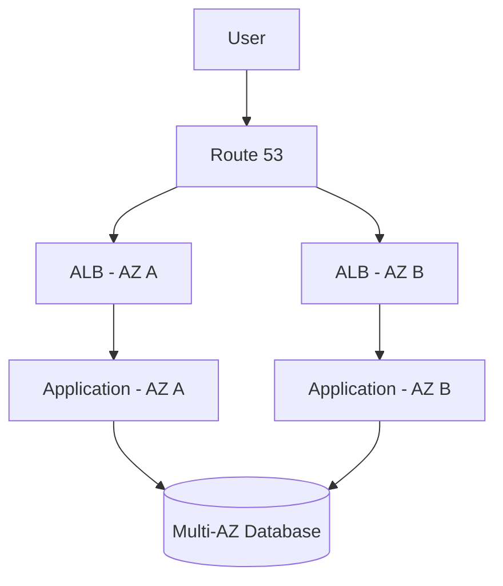
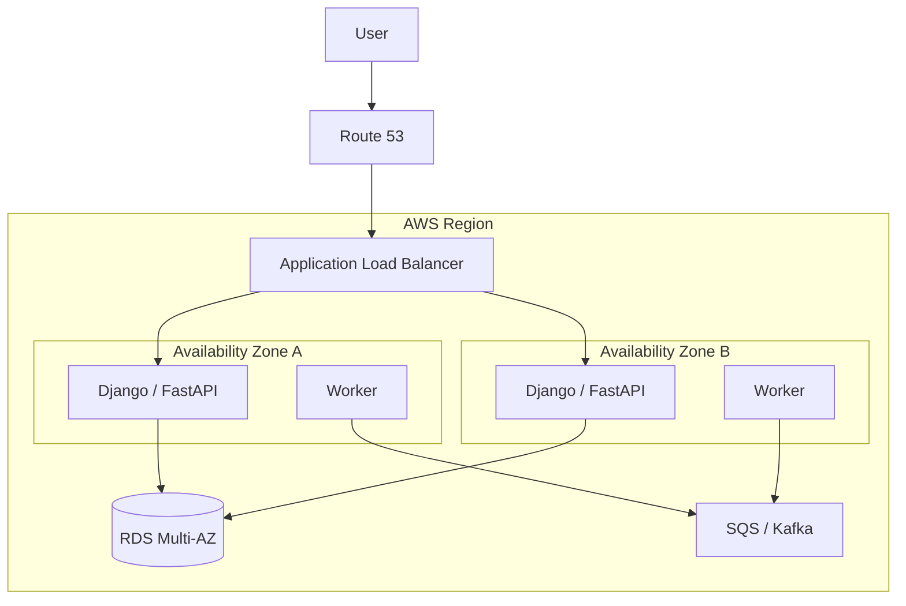
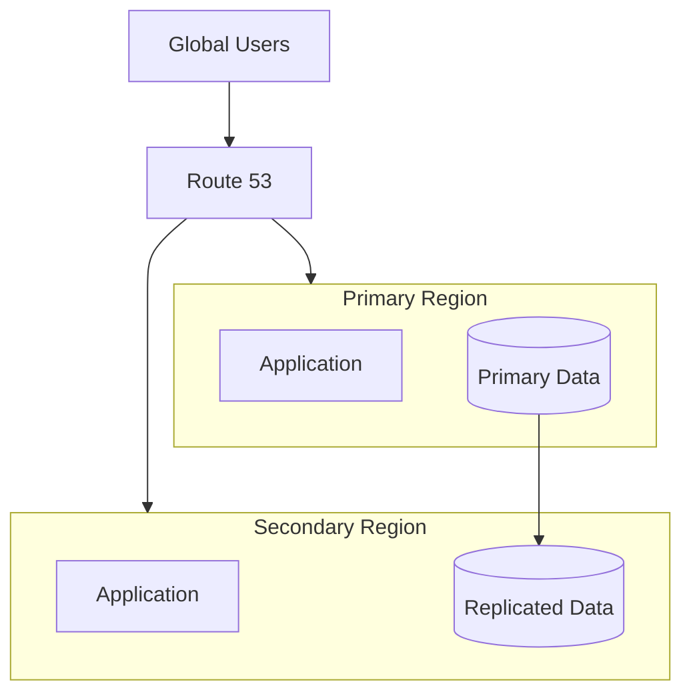
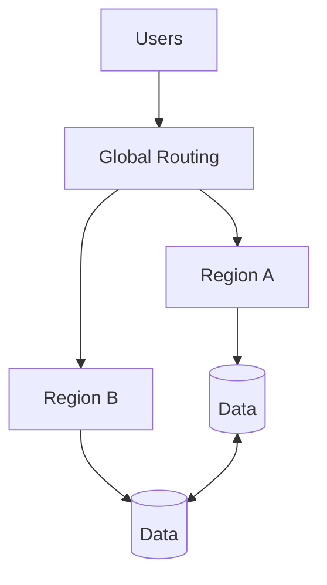
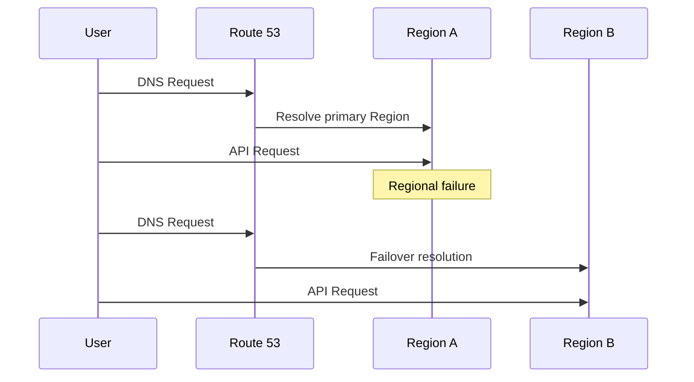
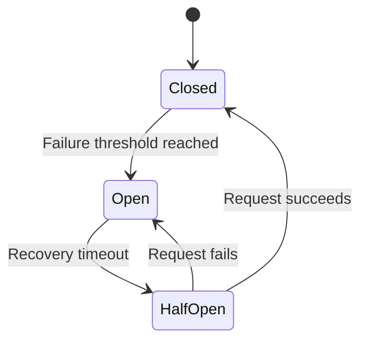

# 03- High Availability and Disaster Recovery

## Overview

High availability (HA) and disaster recovery (DR) address different failure scopes:

- **High availability** minimizes service interruption during expected and localized failures.
- **Disaster recovery** restores service and data after larger-scale failures that may affect an entire Availability Zone, Region, application environment, or critical data set.

A production AWS architecture should assume that failures will occur. The objective is not to eliminate every failure but to prevent a single failure from becoming a system-wide outage and to provide a tested recovery path when redundancy is insufficient.

A useful distinction is:

```text
High Availability
    ↓
Keep the service running during failures

Disaster Recovery
    ↓
Restore the service after a major failure
```

HA is primarily about **resilience during runtime**. DR is primarily about **recovery after a major incident**.

These concepts must be designed together with scalability, observability, security, deployment strategy, data consistency, and operational procedures.

---

## Availability vs Reliability vs Resilience

These terms are related but should not be treated as interchangeable.

| Concept | Meaning | Primary Question |
|---|---|---|
| Availability | Percentage of time a service is usable | Is the service available? |
| Reliability | Ability to perform correctly over time | Does the system behave correctly? |
| Resilience | Ability to continue or recover from failures | How does the system respond to failure? |
| Fault tolerance | Ability to continue operating despite component failure | Can the system tolerate this failure? |
| Disaster recovery | Ability to restore service after major disruption | How quickly can we recover? |

A system can be highly available but still unreliable.

For example, an API may return HTTP `200` consistently while returning incorrect business data. Availability alone does not guarantee correctness.

---

## Availability Targets

Availability is commonly expressed as a percentage.

| Availability | Approximate downtime per year |
|---|---:|
| 99% | 3.65 days |
| 99.9% | 8.76 hours |
| 99.95% | 4.38 hours |
| 99.99% | 52.56 minutes |
| 99.999% | 5.26 minutes |

Higher availability targets generally require:

- More redundancy
- Better failure detection
- Automated recovery
- More sophisticated deployment strategies
- Stronger operational processes
- More testing
- Higher infrastructure cost

The correct target should be derived from business requirements rather than choosing the highest possible number.

---

## Failure Domains

A senior architecture starts by identifying failure domains.

Typical AWS failure domains include:

```text
Process
   ↓
Container / Pod
   ↓
EC2 Instance
   ↓
Availability Zone
   ↓
Region
   ↓
Global dependency / Provider
```

A system should be designed so that the failure of one domain does not unnecessarily propagate into another.

For example:



If one Availability Zone fails, traffic can continue through the remaining zone.

---

## High Availability

### What it is

High availability is the architectural property of continuing service operation despite failures of individual components or failure domains.

A highly available backend typically distributes workloads across multiple Availability Zones.

### Why it exists

Without redundancy:

```text
Load Balancer
      ↓
One EC2 Instance
      ↓
Database
```

An instance failure becomes an application outage.

With redundancy:

```text
                 Load Balancer
                /             \
               ↓               ↓
            App A            App B
               \               /
                \             /
                 Database HA
```

A single application instance can fail without necessarily causing service unavailability.

### When to use

HA should be considered for:

- Production APIs
- Authentication services
- Payment systems
- Critical internal platforms
- Customer-facing applications
- Stateful services
- Infrastructure components with strict availability requirements

---

## Multi-AZ Architecture

Multi-AZ means deploying redundant infrastructure across multiple Availability Zones within an AWS Region.

A typical backend architecture might look like:



### Benefits

- Availability Zone failure tolerance
- Better fault isolation
- Load distribution
- Safer deployments
- Improved recovery characteristics

### Limitations

Multi-AZ does not protect against:

- Region-wide failures
- Application-wide bugs
- Data corruption
- Incorrect deployments
- Credential compromise
- Logical deletion
- Operator mistakes

This is why Multi-AZ is not a complete disaster recovery strategy.

---

## Availability Zone Independence

Deploying multiple instances is not sufficient if all instances depend on a single failure domain.

Poor design:

```text
AZ A
├── App 1
├── App 2
└── App 3
```

If AZ A becomes unavailable, the entire application disappears.

Better:

```text
AZ A
├── App 1
└── App 2

AZ B
├── App 3
└── App 4

AZ C
├── App 5
└── App 6
```

Critical infrastructure should also avoid accidentally concentrating dependencies in one Availability Zone.

---

## Stateless Application Design

Stateless applications are easier to make highly available.

A Django or FastAPI application should avoid relying on:

- Local session state
- Local filesystem persistence
- Process-local locks for business correctness
- Local uploaded files
- In-memory queues
- Instance-specific business state

Prefer shared infrastructure:

| Requirement | Recommended approach |
|---|---|
| Sessions | Redis or database-backed sessions |
| Files | Amazon S3 |
| Persistent data | PostgreSQL/RDS |
| Background jobs | SQS, Kafka, Celery |
| Shared cache | Redis |
| Configuration | AWS Systems Manager Parameter Store / Secrets Manager |

This allows instances to be replaced without losing application state.

---

## Health Checks

Health checks determine whether a component should continue receiving traffic.

A typical endpoint is:

```http
GET /health
```

A production system may expose separate checks for different purposes.

### Liveness

Answers:

> Is this process alive?

Example:

```http
GET /health/live
```

This should normally avoid expensive dependency checks.

### Readiness

Answers:

> Can this instance safely receive traffic?

Example:

```http
GET /health/ready
```

A readiness check may verify critical dependencies such as:

- Database connectivity
- Required configuration
- Essential downstream services

### Common mistake

Making the liveness endpoint depend on every external dependency can cause cascading failures.

If PostgreSQL is temporarily unavailable and every application reports itself dead, an orchestrator may continuously restart healthy processes, making recovery harder.

---

## Failure Detection and Automatic Recovery

HA depends on detecting failures quickly and taking corrective action.

Typical mechanisms include:

- Load balancer health checks
- EC2 Auto Scaling
- ECS service health checks
- Kubernetes probes
- CloudWatch alarms
- Route 53 health checks
- Database failover mechanisms

A common recovery loop is:


The shorter and more reliable this loop is, the smaller the outage window.

---

## Database High Availability

The database is often the hardest component to make highly available because application servers can usually be replicated more easily than stateful databases.

For PostgreSQL workloads on AWS, Amazon RDS provides managed high-availability capabilities.

A simplified architecture:

```text
Application
     │
     ▼
RDS Endpoint
     │
     ▼
Primary DB
     │
     │ synchronous / managed replication
     ▼
Standby DB
```

The application should connect through the managed database endpoint rather than hardcoding a specific instance address.

### Why this matters

During failover:

```text
Old Primary
    ↓
Failure detected
    ↓
Standby promoted
    ↓
Database endpoint resolves to new primary
```

The application can reconnect without requiring a database hostname change in application configuration.

### Production considerations

Monitor:

- Database CPU
- Storage
- Connections
- Replication state
- Failover events
- Query latency
- Lock contention
- Transaction duration

---

## Read Replicas vs High Availability

Read replicas and HA replicas solve different problems.

| Feature | Primary Goal |
|---|---|
| Multi-AZ standby | High availability / failover |
| Read replica | Read scalability |
| Backup | Recovery from data loss |
| Cross-Region replica | Regional recovery / read locality |

A read replica should not automatically be considered a replacement for a Multi-AZ HA configuration.

---

## Redis High Availability

Redis can become a critical dependency if the application uses it for:

- Sessions
- Distributed locks
- Caching
- Rate limiting
- Celery task state
- Application coordination

For production workloads, use a managed highly available Redis-compatible service such as Amazon ElastiCache and configure the appropriate replication and failover model.

The architecture should also distinguish between:

```text
Cache-only Redis
```

and:

```text
Redis holding correctness-critical state
```

If Redis is only a cache, the application may be able to rebuild the data after failure.

If Redis contains authoritative business state, its durability and recovery requirements become substantially more demanding.

---

## Multi-Region Architecture

Multi-Region architecture deploys infrastructure across multiple AWS Regions.



### Why it exists

Multi-Region protects against regional failures that Multi-AZ cannot address.

Potential causes include:

- Large-scale regional service disruption
- Regional networking failures
- Major infrastructure incidents
- Regional operational mistakes

### Trade-offs

Multi-Region introduces significant complexity:

- Data replication
- DNS failover
- Cross-region latency
- Consistency challenges
- Deployment coordination
- Duplicate infrastructure cost
- Operational complexity

Multi-Region should therefore be justified by business requirements.

---

## Multi-AZ vs Multi-Region

| Property | Multi-AZ | Multi-Region |
|---|---|---|
| Scope | Within one Region | Multiple Regions |
| Primary purpose | High availability | Disaster recovery / regional resilience |
| Complexity | Moderate | High |
| Cost | Moderate | High |
| Network latency | Low | Higher |
| Data replication | Usually simpler | More complex |
| Regional failure protection | No | Yes |
| Operational overhead | Lower | Higher |
| Typical default | Production baseline | Critical workloads |

A common production progression is:

```text
Single AZ
   ↓
Multi-AZ
   ↓
Backup + Restore
   ↓
Cross-Region DR
   ↓
Multi-Region Active/Active
```

The correct level depends on business requirements.

---

## Disaster Recovery

### What it is

Disaster recovery is the set of architectural and operational mechanisms used to restore systems after a major disruptive event.

A disaster can include:

- Region failure
- Data corruption
- Accidental deletion
- Ransomware
- Credential compromise
- Deployment failure
- Infrastructure misconfiguration
- Operator error

DR therefore includes more than backups.

A complete DR strategy includes:

```text
Backup
+
Replication
+
Recovery infrastructure
+
Recovery procedures
+
Automation
+
Testing
```

---

## RTO and RPO

Two metrics are fundamental to DR planning.

### Recovery Time Objective

**RTO** defines the maximum acceptable time to restore service.

Example:

```text
RTO = 30 minutes
```

The organization expects the application to be restored within 30 minutes.

### Recovery Point Objective

**RPO** defines the maximum acceptable amount of data loss measured in time.

Example:

```text
RPO = 5 minutes
```

The business accepts losing at most approximately five minutes of recent data in the defined disaster scenario.

### RTO vs RPO

| Requirement | Question |
|---|---|
| RTO | How quickly must service return? |
| RPO | How much recent data can we lose? |

These requirements strongly influence architecture cost.

---

## DR Strategies

AWS architectures commonly fall into several DR patterns.

| Strategy | RTO | RPO | Cost | Complexity |
|---|---|---|---|---|
| Backup and restore | High | Higher | Low | Low |
| Pilot light | Medium | Low/Medium | Medium | Medium |
| Warm standby | Low/Medium | Low | Medium/High | High |
| Active/Passive | Low | Low | High | High |
| Active/Active | Very low | Very low | Very high | Very high |

The exact achievable RTO/RPO depends on implementation and must be validated through testing.

---

## Backup and Restore

This is the simplest DR model.

```text
Production
    │
    ▼
Backups
    │
    ▼
Disaster
    │
    ▼
Provision Infrastructure
    │
    ▼
Restore Data
    │
    ▼
Start Application
```

### Advantages

- Lowest cost
- Simple architecture
- Suitable for many internal systems
- Good protection against accidental deletion

### Limitations

- Slow recovery
- Infrastructure must be recreated
- Large databases can take significant time to restore
- Recovery procedures must be automated and tested

Backups are necessary but do not automatically guarantee a successful recovery.

---

## Pilot Light

Pilot light maintains a minimal environment in another Region.

For example:

```text
Primary Region
├── Full application
├── Full compute
└── Primary database

DR Region
├── Minimal infrastructure
└── Replicated data
```

During a disaster, additional compute capacity is launched.

### Advantages

- Lower cost than full warm standby
- Faster than backup-only recovery
- Data can be continuously or frequently replicated

### Limitations

- Requires infrastructure automation
- Recovery depends on scaling infrastructure
- More complex than backup and restore

Infrastructure as Code is particularly important here.

---

## Warm Standby

A warm standby maintains a reduced but operational environment in the DR Region.

```text
Primary Region
    Full Capacity
        │
        │ Data Replication
        ▼
DR Region
    Reduced Capacity
```

During failure:

```text
Scale DR environment
        ↓
Promote / switch data
        ↓
Redirect traffic
```

### Advantages

- Faster recovery
- Environment already running
- Easier validation

### Limitations

- Higher continuous cost
- Data synchronization complexity
- Requires regular failover testing

---

## Active/Passive

In an active/passive architecture:

```text
Region A
ACTIVE
  ↓
Serves production traffic

Region B
PASSIVE
  ↓
Ready for failover
```

Traffic is normally served by one Region.

If Region A fails:

```text
Region A failure
       ↓
Health detection
       ↓
Route 53 failover
       ↓
Region B becomes active
```

This model provides strong regional resilience without requiring both Regions to serve full production traffic simultaneously.

---

## Active/Active

Both Regions serve production traffic.



### Advantages

- Very low failover time
- Both Regions provide production capacity
- Better geographic latency
- Better resource utilization

### Limitations

Active/active is significantly harder because application state must be coordinated across Regions.

Challenges include:

- Cross-region consistency
- Concurrent writes
- Conflict resolution
- Distributed transactions
- Session routing
- Cache consistency
- Event duplication
- Clock differences
- Operational complexity

Do not choose active/active simply because it sounds more resilient.

---

## Traffic Failover

Route 53 can be used to route traffic between Regions.

A simplified active/passive flow:



DNS failover has propagation and caching characteristics. The effective failover time is not determined solely by the health-check interval.

Applications and clients may cache DNS responses according to TTL and resolver behavior.

---

## Data Replication

DR is fundamentally a data problem.

Compute can often be recreated quickly:

```text
EC2 / ECS / EKS / Lambda
```

But business data may be irreplaceable.

Data replication strategies include:

- Database replication
- Cross-Region database replicas
- Amazon S3 Cross-Region Replication
- DynamoDB global replication
- Kafka replication
- Event-based replication
- Backup replication

The correct strategy depends on:

- RPO
- Data volume
- Write rate
- Consistency requirements
- Recovery time
- Cost

---

## Backup Strategy

A robust backup strategy should consider:

### Backup frequency

Determine how frequently backups must be created based on RPO.

### Retention

Define how long backups must remain available.

### Geographic redundancy

Store critical recovery data outside the primary failure domain.

### Immutability

Backups should be protected against accidental or malicious deletion.

### Encryption

Encrypt backups using appropriate AWS KMS keys and access controls.

### Recovery testing

A backup that has never been restored should not be treated as proven recoverable.

---

## Backup Verification

A production backup process should verify:

```text
Backup created
      ↓
Backup accessible
      ↓
Backup integrity validated
      ↓
Restore performed
      ↓
Application starts
      ↓
Data validation passes
```

Automated recovery testing is substantially more valuable than merely monitoring whether a backup job reports success.

---

## Disaster Recovery Runbook

A DR plan should define explicit operational steps.

Example:

```text
1. Detect regional failure
2. Confirm incident scope
3. Declare disaster
4. Freeze conflicting deployments
5. Validate DR data state
6. Promote required databases
7. Provision or scale compute
8. Update traffic routing
9. Validate application health
10. Run business-level smoke tests
11. Monitor error rates and latency
12. Communicate recovery status
13. Preserve incident evidence
14. Plan controlled failback
```

A runbook should identify:

- Owners
- Escalation paths
- Required permissions
- Commands
- Infrastructure dependencies
- Validation procedures
- Communication responsibilities

---

## Infrastructure as Code

DR environments should be reproducible.

Terraform or AWS CloudFormation can define infrastructure such as:

- VPCs
- Subnets
- Security groups
- Load balancers
- ECS/EKS resources
- RDS
- IAM
- S3
- CloudWatch
- Route 53

Example Terraform structure:

```text
infrastructure/
├── modules/
│   ├── network/
│   ├── application/
│   ├── database/
│   └── monitoring/
├── environments/
│   ├── production/
│   └── disaster-recovery/
└── global/
    └── dns/
```

Manual DR infrastructure is difficult to trust because it can drift from production.

---

## Deployment Resilience

A highly available architecture can still become unavailable because of a bad deployment.

Deployment strategies should therefore be part of the HA design.

Common strategies include:

| Strategy | Risk | Rollback |
|---|---|---|
| Rolling | Moderate | Moderate |
| Blue/Green | Low | Fast |
| Canary | Low | Fast |
| Recreate | High | Slow |

A deployment pipeline should support:

- Automated tests
- Health checks
- Gradual rollout
- Automated rollback
- Database migration safety
- Observability validation

---

## Database Migration Safety

Database migrations can cause outages even when application infrastructure is highly available.

Prefer backward-compatible migrations.

For example:

```text
Deployment 1
Application supports old + new schema

        ↓

Migration adds new column

        ↓

Deployment 2
Application starts using new column

        ↓

Later
Remove old column
```

Avoid migrations that require old and new application versions to understand incompatible schemas simultaneously.

This is particularly important during rolling deployments.

---

## Dependency Failure

A system can remain highly available internally while failing because of an external dependency.

For example:

```text
Django API
   ↓
Payment Provider
   ↓
Provider unavailable
```

If every API request waits indefinitely for the payment provider, the application's resources can become exhausted.

Use:

- Timeouts
- Retries with exponential backoff
- Jitter
- Circuit breakers
- Bulkheads
- Fallbacks
- Asynchronous processing

Retries should be bounded. Uncontrolled retries can turn a dependency failure into a system-wide overload.

---

## Circuit Breaker

A circuit breaker prevents repeated calls to an unhealthy dependency.



### States

**Closed**

Requests flow normally.

**Open**

Requests are rejected or handled through a fallback without calling the failing dependency.

**Half-open**

A limited number of requests are allowed to test recovery.

Circuit breakers protect application capacity during downstream failures.

---

## Bulkheads

Bulkheads isolate resource pools so one failing dependency does not consume all application capacity.

For example:

```text
Application
├── Payment connection pool
├── Email connection pool
└── Analytics connection pool
```

If analytics becomes slow, it should not consume every worker thread or HTTP connection needed for payment operations.

This is especially important in microservices and asynchronous worker architectures.

---

## Security Considerations

HA and DR environments increase the number of systems that must be secured.

Important controls include:

- Least-privilege IAM
- Encryption at rest
- Encryption in transit
- Private subnets for internal systems
- Restricted security groups
- Secrets Manager / Parameter Store
- CloudTrail auditing
- Backup access controls
- Cross-Region replication permissions
- Separate recovery credentials where appropriate

### DR account isolation

For critical systems, consider separating recovery infrastructure or backup administration from the primary environment.

If an attacker compromises production credentials, unrestricted access to backups can allow the attacker to destroy the recovery mechanism as well.

---

## Monitoring and Alerting

HA and DR require observability at multiple levels.

### Application

Monitor:

- Request rate
- Error rate
- P95/P99 latency
- Health checks
- Saturation
- Dependency failures

### Infrastructure

Monitor:

- EC2/ECS/EKS health
- Load balancer target health
- Auto Scaling events
- CPU
- Memory
- Network
- Disk utilization

### Database

Monitor:

- Connections
- CPU
- Storage
- Replication lag
- Failover events
- Query latency
- Locks

### DR

Monitor:

- Backup success
- Backup age
- Replication lag
- Replication failures
- DR environment drift
- Recovery test results

A particularly useful metric is:

> **Time since last successful recovery test**

---

## Disaster Recovery Testing

A DR plan that has never been tested is an assumption, not a capability.

Testing should progressively validate:

### Backup restoration

Restore a database or S3 object set.

### Component failure

Terminate instances and verify automatic replacement.

### Availability Zone failure

Simulate loss of application capacity in one AZ.

### Dependency failure

Simulate unavailable external services.

### Regional failover

Validate that the DR Region can serve production traffic.

### Full disaster simulation

Exercise the entire recovery procedure with relevant engineering and business teams.

---

## Chaos Engineering

Chaos engineering deliberately introduces controlled failures to validate resilience.

Examples include:

- Terminating instances
- Blocking network access
- Increasing dependency latency
- Stopping consumers
- Simulating database failures
- Injecting application errors

The objective is not to create outages for their own sake. It is to validate assumptions.

A useful progression is:

```text
Failure assumption
      ↓
Controlled experiment
      ↓
Observe system behavior
      ↓
Identify weakness
      ↓
Improve architecture
      ↓
Repeat
```

---

## Common HA and DR Anti-Patterns

### Single-AZ production deployment

Multiple application instances in one AZ do not provide AZ-level resilience.

### Treating backups as a complete DR strategy

A backup is useful only if it can be restored within the required RTO and provides the required RPO.

### Untested backups

A successful backup job does not prove that application recovery will succeed.

### Multi-AZ without multi-Region requirements analysis

Multi-AZ protects against many localized failures but does not protect against a regional disaster.

### Active/active without a data consistency strategy

Running two Regions is not enough. The architecture must define how concurrent state changes are handled.

### Hardcoded infrastructure

Manual failover procedures become unreliable when infrastructure differs between environments.

### Infinite retries

Retries can amplify dependency failures and exhaust application resources.

### Shared recovery credentials

If production credentials can destroy backups or DR resources, a production compromise can become a recovery compromise.

### Ignoring DNS behavior

Route 53 failover does not mean every client immediately switches Regions.

### Database migration without rollback planning

Application availability does not protect against schema changes that make all application versions incompatible.

---

## Interview Traps

### Is Multi-AZ the same as disaster recovery?

No. Multi-AZ primarily provides high availability within a Region. DR addresses recovery from larger failures, potentially including Region loss.

### Is a read replica a backup?

No. A read replica primarily provides read scalability and potentially failover capabilities depending on the architecture. It does not replace independent backups.

### What is the difference between RTO and RPO?

RTO measures acceptable recovery time. RPO measures acceptable data loss in time.

### Why isn't active/active always better?

Active/active increases availability and can reduce failover time, but introduces substantial complexity around distributed state, consistency, conflict resolution, and operations.

### Why is statelessness important for HA?

Stateless services can be replaced and redistributed without requiring traffic to return to a particular instance.

### Why should DR infrastructure use IaC?

Infrastructure as Code makes recovery environments reproducible, reviewable, automatable, and less susceptible to configuration drift.

---

## Production Architecture Checklist

### Application

- [ ] Application instances are stateless.
- [ ] Multiple Availability Zones are used.
- [ ] Load balancer health checks are configured.
- [ ] Readiness and liveness behavior is appropriate.
- [ ] External dependencies have timeouts.
- [ ] Retries are bounded and use backoff.
- [ ] Circuit breakers are used where appropriate.
- [ ] Deployments support rollback.

### Database

- [ ] Production database has an HA strategy.
- [ ] Backups are enabled.
- [ ] Backup retention meets business requirements.
- [ ] Recovery data is protected from accidental deletion.
- [ ] Replication is monitored.
- [ ] Database failover has been tested.
- [ ] Database migrations are backward compatible.

### Disaster Recovery

- [ ] RTO is explicitly defined.
- [ ] RPO is explicitly defined.
- [ ] DR architecture matches those requirements.
- [ ] Critical data is recoverable outside the primary failure domain.
- [ ] DR infrastructure is defined as code.
- [ ] Recovery runbooks are documented.
- [ ] Recovery permissions are tested.
- [ ] Failover procedures are periodically exercised.
- [ ] Failback procedures are documented.

### Security

- [ ] Recovery environments use least-privilege IAM.
- [ ] Backups are encrypted.
- [ ] Backup deletion is appropriately protected.
- [ ] Secrets are not embedded in infrastructure code.
- [ ] Cross-Region access is controlled.
- [ ] Audit logging covers recovery operations.

### Observability

- [ ] Application availability is monitored.
- [ ] Dependency health is monitored.
- [ ] Database replication lag is monitored.
- [ ] Backup failures generate alerts.
- [ ] Recovery tests produce measurable results.
- [ ] Disaster recovery readiness is reviewed periodically.

## Key Takeaways

- **High availability and disaster recovery solve different failure scopes:** Multi-AZ primarily protects against localized failures, while DR provides recovery capabilities for larger disruptions such as regional failures and data-loss events.
- **RTO and RPO drive DR architecture:** backup/restore, pilot light, warm standby, and active/active provide progressively faster recovery at increasing cost and operational complexity.
- **Data is the hardest part of recovery:** compute can usually be recreated, but databases, backups, replication, consistency, and data corruption require explicit recovery strategies.
- **Resilience must include dependencies and deployments:** timeouts, bounded retries, circuit breakers, bulkheads, backward-compatible migrations, and rollback mechanisms prevent local failures from becoming cascading outages.
- **A DR plan is only credible when tested:** automated infrastructure, documented runbooks, backup restoration, failover exercises, and periodic disaster simulations are essential to proving the required RTO and RPO.