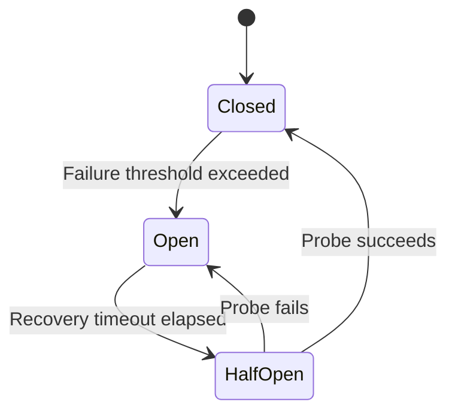
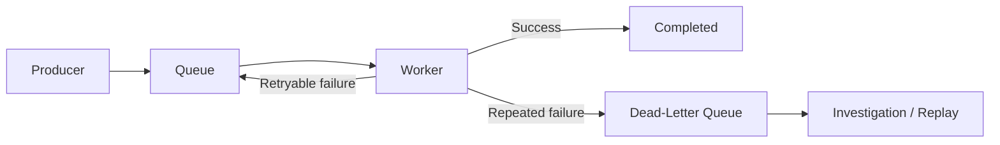
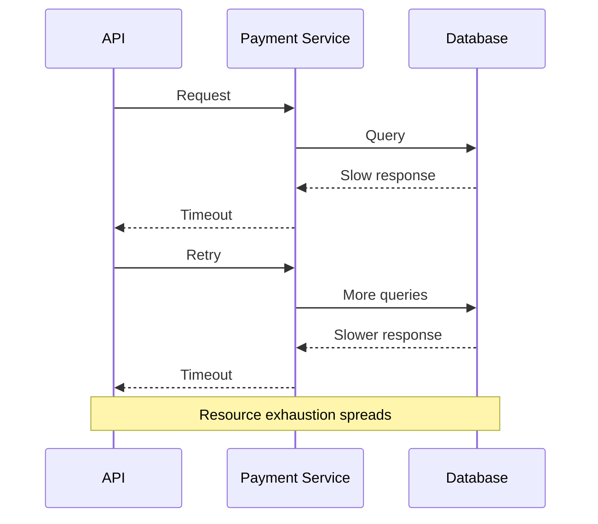
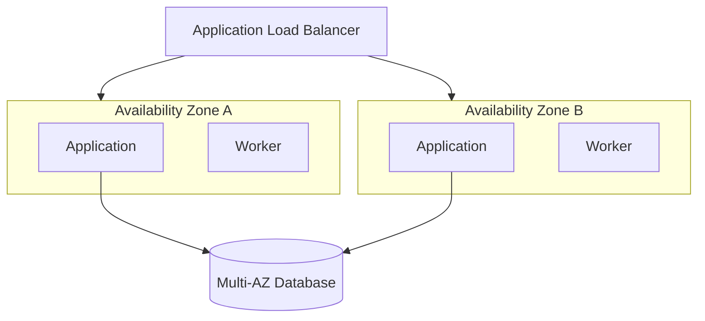
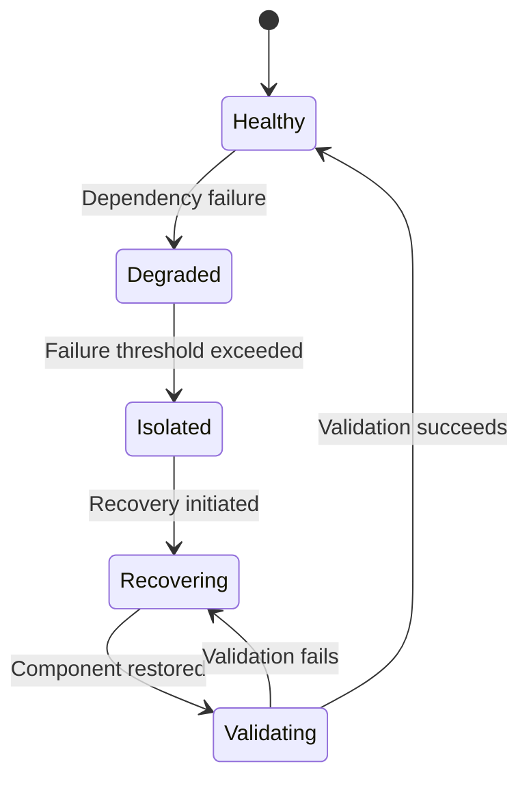
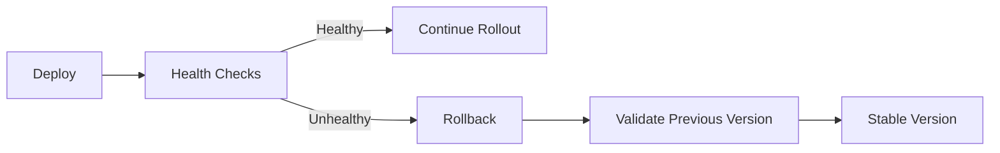

# 04- Failure Isolation and Recovery

## Overview

Failure isolation is the architectural practice of limiting the blast radius of a failure so that one unhealthy component, dependency, workload, or infrastructure boundary does not cause unrelated parts of the system to fail.

Recovery is the complementary capability of detecting the failure, restoring the affected component, and returning the system to a healthy operating state.

A resilient backend should therefore be designed around:

```text
Failure
   ↓
Contain
   ↓
Detect
   ↓
Degrade safely
   ↓
Recover
   ↓
Validate
   ↓
Restore normal operation
```

High availability provides redundancy, but redundancy alone does not guarantee resilience. If a shared dependency, connection pool, queue, database, or deployment can exhaust resources across the entire system, a failure in one component can still become a cascading outage.

Failure isolation focuses on controlling **blast radius**. Recovery focuses on restoring **service and correctness** after isolation has contained the incident.

---

## Failure Domains and Blast Radius

A failure domain is a boundary within which a failure can occur and potentially affect other components.

Typical boundaries include:

```text
Request
  ↓
Process
  ↓
Container / Pod
  ↓
Instance
  ↓
Service
  ↓
Availability Zone
  ↓
Region
  ↓
External Provider
```

The **blast radius** is the portion of the system affected by the failure.

A good architecture minimizes the blast radius by creating independent failure domains.

### Example

Consider an API with a single shared database connection pool:

```text
API
├── Orders
├── Payments
├── Users
└── Reports
       ↓
Shared DB Pool
       ↓
PostgreSQL
```

If a reporting query consumes all connections, unrelated APIs can become unavailable.

A more isolated architecture might use:

```text
Orders API
    ↓
Orders DB resources

Payments API
    ↓
Payments DB resources

Reports
    ↓
Read-only / isolated resources
```

The goal is not to eliminate all shared infrastructure. Shared components should be identified deliberately and protected because they represent potential high-blast-radius failure points.

---

## Failure Isolation Principles

Several principles consistently improve failure isolation.

| Principle | Purpose |
|---|---|
| Bulkheads | Prevent resource exhaustion from spreading |
| Timeouts | Prevent stuck dependencies from consuming resources |
| Circuit breakers | Stop repeated calls to unhealthy dependencies |
| Rate limiting | Prevent overload |
| Backpressure | Prevent producers from overwhelming consumers |
| Queue isolation | Prevent one workload from blocking another |
| Cell architecture | Limit failures to independent partitions |
| Multi-AZ deployment | Isolate infrastructure failures |
| Resource quotas | Prevent one workload from consuming everything |
| Graceful degradation | Preserve critical functionality during partial failure |
| Retry budgets | Prevent retry storms |
| Independent deployments | Reduce correlated deployment failures |

---

## Bulkhead Isolation

### What it is

A bulkhead isolates resources so that failure in one workload cannot consume all resources required by other workloads.

The concept comes from compartmentalizing a system into independent resource pools.

### Why it exists

Without isolation:

```text
Application
      ↓
Single Thread Pool
      ↓
Payment
Email
Analytics
Search
```

If Analytics becomes slow, it may consume the entire thread pool.

With isolation:

```text
Application
├── Payment Pool
├── Email Pool
├── Analytics Pool
└── Search Pool
```

Analytics can fail without necessarily exhausting payment capacity.

### Backend example

A Python service making synchronous HTTP calls might use separate concurrency limits for critical and non-critical dependencies.

Conceptually:

```text
Critical dependency
    max concurrent requests = 50

Non-critical dependency
    max concurrent requests = 10
```

The exact values must be determined from workload characteristics and load testing.

### Production considerations

Bulkheads can be implemented through:

- Separate worker pools
- Separate Kubernetes deployments
- Separate ECS services
- Separate connection pools
- Separate queues
- Concurrency limits
- CPU and memory limits
- Kubernetes resource requests and limits

---

## Timeouts

### What it is

A timeout limits how long a request can wait for an operation.

Every network dependency should have an explicit timeout.

```text
API
 ↓
Payment Provider
 ↓
Timeout after 2 seconds
```

Without a timeout:

```text
API request
    ↓
Dependency hangs
    ↓
Worker waits
    ↓
More requests arrive
    ↓
Workers exhausted
    ↓
API unavailable
```

### Types of timeouts

A production HTTP client may need separate limits for:

- Connection timeout
- TLS handshake timeout
- Read timeout
- Total request timeout

For example:

```python
import httpx

timeout = httpx.Timeout(
    connect=1.0,
    read=2.0,
    write=2.0,
    pool=1.0,
)

client = httpx.AsyncClient(timeout=timeout)
```

Timeout values should reflect the dependency's expected latency and the API's own latency budget.

### Common mistake

Setting extremely large timeouts because "the dependency sometimes takes longer."

This converts a slow dependency into a resource-exhaustion problem.

A better approach is:

```text
Short timeout
+
Bounded retry
+
Circuit breaker
+
Fallback / asynchronous processing
```

---

## Circuit Breakers

A circuit breaker prevents an application from continuously calling a dependency that is already failing.



### Closed

Requests are sent normally.

### Open

Requests are rejected immediately or handled through a fallback.

### Half-open

A limited number of requests are allowed to determine whether the dependency has recovered.

### Why it exists

Suppose an API sends 10,000 requests per second to a failing provider.

Without a circuit breaker:

```text
10,000 requests/sec
        ↓
Failing provider
        ↓
10,000 timeouts
        ↓
Worker exhaustion
        ↓
API outage
```

With a circuit breaker:

```text
Provider failure
      ↓
Circuit opens
      ↓
Requests fail fast / fallback
      ↓
Application resources remain available
```

Circuit breakers protect the caller from dependency failure; they do not fix the dependency itself.

---

## Retry Isolation

Retries can improve reliability for transient failures, but uncontrolled retries can create a retry storm.

Consider:

```text
1000 original requests
        ↓
Each request retries 3 times
        ↓
Up to 4000 attempts
```

If the downstream service is already overloaded, the retries increase the load and make recovery harder.

### Use

- Exponential backoff
- Jitter
- Maximum retry count
- Retry budgets
- Appropriate timeout limits

Example:

```text
Attempt 1 → immediate
Attempt 2 → 100 ms
Attempt 3 → 250 ms
Attempt 4 → 500 ms
```

The exact schedule depends on the dependency and workload.

### Do not blindly retry

Avoid automatic retries for operations that may not be idempotent unless the API provides an idempotency mechanism.

For example:

```http
POST /payments
```

A client retry could potentially create a duplicate payment if the first request succeeded but the response was lost.

Use an idempotency key where the operation supports it:

```http
Idempotency-Key: 7f7e3e...
```

---

## Backpressure

### What it is

Backpressure prevents producers from generating work faster than consumers can process it.

Without backpressure:

```text
Producer
  ↓
10,000 jobs/sec
  ↓
Consumer
  ↓
1,000 jobs/sec
  ↓
Queue grows indefinitely
```

Eventually memory, storage, or processing capacity is exhausted.

### Common mechanisms

- Queue limits
- Consumer concurrency limits
- Rate limiting
- Bounded buffers
- Kafka consumer controls
- SQS visibility and concurrency controls
- Kubernetes autoscaling

Backpressure should be designed intentionally rather than allowing queues to grow without limits.

---

## Queue Isolation

A single queue for unrelated workloads can create head-of-line blocking.

Poor design:

```text
              Shared Queue
            /      |       \
        Email    Payment   Analytics
```

If Analytics produces millions of jobs, payment processing can be delayed.

Better:

```text
Payment Queue
    ↓
Payment Workers

Email Queue
    ↓
Email Workers

Analytics Queue
    ↓
Analytics Workers
```

This allows:

- Independent scaling
- Independent retry policies
- Independent monitoring
- Independent dead-letter queues
- Different priority levels

For Celery-based systems, separate queues and worker pools are often useful for critical workloads.

---

## Dead-Letter Queues

A dead-letter queue (DLQ) isolates messages that repeatedly fail processing.



### Why it exists

Without a DLQ:

```text
Bad message
    ↓
Retry
    ↓
Retry
    ↓
Retry
    ↓
Retry forever
```

A poison message can block processing or consume large amounts of capacity.

### Production considerations

A DLQ should have:

- Alerting
- Retention policy
- Message inspection
- Controlled replay
- Access controls
- Ownership
- Runbooks

Do not automatically replay every DLQ message without understanding the failure.

---

## Graceful Degradation

Graceful degradation means preserving essential functionality when non-critical dependencies fail.

Example:

```text
Product API
├── Product data      → Required
├── Inventory         → Required
├── Recommendations   → Optional
└── Analytics         → Optional
```

If recommendations fail:

```text
Return product
+
inventory
-
recommendations
```

The entire request does not need to fail.

### Appropriate fallbacks

Examples include:

- Cached data
- Default configuration
- Stale-but-acceptable data
- Reduced feature set
- Asynchronous processing
- Static response
- Queueing work for later

Fallbacks should not silently return incorrect business data.

---

## Dependency Classification

Every production service should classify its dependencies.

| Dependency | Failure Impact | Typical Strategy |
|---|---|---|
| Primary database | Critical | HA + failover |
| Payment provider | Critical | Timeout + retry + circuit breaker |
| Redis cache | Variable | Fallback to source |
| Recommendation engine | Low | Graceful degradation |
| Analytics | Low | Async queue |
| Authentication | Critical | HA + caching where appropriate |
| External notification | Medium | Queue + retry + DLQ |

This classification determines which dependencies deserve stronger isolation.

---

## Cascading Failures

A cascading failure occurs when one component's failure causes other components to fail.

Typical sequence:



The key lesson is that failures propagate through dependencies.

To stop propagation:

```text
Timeout
   +
Bounded retry
   +
Circuit breaker
   +
Bulkhead
   +
Backpressure
   +
Graceful degradation
```

---

## Resource Isolation

Shared resources should have explicit limits.

Important resources include:

- CPU
- Memory
- Threads
- Processes
- File descriptors
- Database connections
- HTTP connections
- Queue consumers
- Kafka partitions
- Kubernetes pods

### Database connection exhaustion

Suppose:

```text
Application instances = 20
Pool size per instance = 50
```

Potential maximum connections:

```text
20 × 50 = 1000 connections
```

If PostgreSQL can safely handle only a fraction of that number, horizontal scaling can accidentally make the database less available.

Connection pool sizing must therefore consider the entire deployment, not just one instance.

---

## Kubernetes Resource Isolation

Kubernetes supports resource requests and limits.

Conceptually:

```yaml
resources:
  requests:
    cpu: "250m"
    memory: "256Mi"
  limits:
    cpu: "1"
    memory: "512Mi"
```

Requests help scheduling.

Limits constrain resource consumption.

Namespaces, quotas, pod disruption budgets, node pools, and separate deployments can further isolate workloads.

Isolation must be validated against actual workload behavior because overly aggressive limits can cause unnecessary throttling or OOM kills.

---

## Availability Zone Isolation

AWS applications should distribute critical workloads across Availability Zones.



If AZ A becomes unavailable, traffic can continue through AZ B if sufficient capacity remains.

### Important consideration

Running two instances across two AZs is not enough if the application requires four instances under normal load.

The surviving AZ must have enough capacity to handle the expected failure scenario.

This is a capacity-planning problem, not simply a deployment-count problem.

---

## Cell-Based Architecture

For large systems, a single global deployment can have a very large blast radius.

A cell-based architecture partitions users or workloads into independent cells.

```text
Global Router
    │
    ├── Cell A
    │    ├── API
    │    ├── Workers
    │    └── Data
    │
    ├── Cell B
    │    ├── API
    │    ├── Workers
    │    └── Data
    │
    └── Cell C
         ├── API
         ├── Workers
         └── Data
```

If Cell A fails:

```text
Cell A → Unavailable

Cell B → Healthy
Cell C → Healthy
```

The system's blast radius is reduced to one partition.

Cell architectures are particularly useful for large multi-tenant platforms.

---

## Tenant Isolation

Multi-tenant applications need explicit failure boundaries.

A single tenant generating excessive traffic should not make every tenant unavailable.

Possible isolation mechanisms include:

- Per-tenant rate limits
- Tenant-specific queues
- Workload quotas
- Separate database schemas
- Separate databases
- Dedicated compute
- Cell assignment

A common progression is:

```text
Shared infrastructure
      ↓
Rate limiting
      ↓
Quota isolation
      ↓
Workload isolation
      ↓
Dedicated infrastructure
```

The appropriate level depends on tenant importance, workload characteristics, compliance requirements, and cost.

---

## Recovery Detection

Recovery begins with reliable failure detection.

Detection sources include:

- Load balancer health checks
- CloudWatch alarms
- Application metrics
- Distributed tracing
- Database health metrics
- Queue depth
- Kafka consumer lag
- Kubernetes probes
- Synthetic monitoring

Detection should distinguish between:

```text
Component unhealthy
```

and:

```text
Component intentionally unavailable
```

Poor health-check design can cause unnecessary failovers or restart loops.

---

## Recovery Strategies

Different failures require different recovery mechanisms.

| Failure | Typical Recovery |
|---|---|
| Container crash | Restart |
| Instance failure | Replace instance |
| AZ failure | Shift traffic |
| Database failure | Failover |
| Queue consumer failure | Restart / rebalance |
| Poison message | DLQ |
| Cache failure | Rebuild / fallback |
| Deployment failure | Rollback |
| Region failure | DR failover |
| Data corruption | Restore verified backup |

Recovery should be automated wherever the failure mode is predictable.

---

## Automatic vs Manual Recovery

### Automatic recovery

Useful for:

- Instance failures
- Container crashes
- Health-check failures
- Consumer restarts
- Auto Scaling events

Advantages:

- Fast response
- Consistent execution
- Reduced operational load

Risks:

- Automation can amplify failures
- Incorrect health checks can trigger destructive behavior
- Recovery loops can hide underlying problems

### Manual recovery

Appropriate for:

- Data corruption
- Security incidents
- Major regional disasters
- Complex business decisions
- Irreversible operations

A strong system uses automation for predictable failures and controlled human intervention for ambiguous or high-risk failures.

---

## Recovery State Machine

Recovery can be modeled explicitly.



This model is useful for designing operational workflows and monitoring.

---

## Recovery Validation

A component should not immediately return to production traffic merely because it has restarted.

A safer lifecycle is:

```text
Restart
  ↓
Process starts
  ↓
Dependency initialization
  ↓
Readiness check
  ↓
Smoke test
  ↓
Receive limited traffic
  ↓
Observe
  ↓
Full traffic
```

This reduces the risk of routing traffic to a technically running but functionally unhealthy component.

---

## Database Recovery

Database recovery requires additional care because availability and correctness are both important.

A recovery workflow might be:

```text
Database failure
      ↓
Detect failure
      ↓
Determine failure type
      ↓
Automatic failover if appropriate
      ↓
Verify primary
      ↓
Verify application connectivity
      ↓
Validate critical queries
      ↓
Resume normal traffic
```

For corruption:

```text
Corruption detected
      ↓
Stop propagation
      ↓
Identify recovery point
      ↓
Restore isolated copy
      ↓
Validate data
      ↓
Determine business recovery point
      ↓
Controlled restoration
```

Do not blindly restore the newest backup if that backup contains the corruption.

---

## Recovery From Bad Deployments

Deployment failures are a common operational failure mode.

A resilient deployment pipeline should support:



Deployment rollback is easier when:

- Releases are immutable
- Container images are versioned
- Database changes are backward compatible
- Configuration changes are version controlled
- Feature flags are available

---

## Recovery From Configuration Errors

Configuration is often overlooked as a failure source.

Examples:

- Incorrect database URL
- Invalid environment variable
- Wrong security group
- Expired credentials
- Incorrect feature flag
- Incorrect DNS record

Configuration should therefore be:

- Version controlled where appropriate
- Validated before deployment
- Centrally managed
- Audited
- Tested in CI/CD

Secrets should remain in secure secret-management systems rather than source code.

---

## Recovery From Cache Failure

A cache should generally not become a single point of failure unless it is intentionally used as a stateful system.

For a cache-backed API:

```text
API
 ↓
Redis
 ↓
Cache hit → Return
```

On cache failure:

```text
API
 ↓
Redis unavailable
 ↓
Fallback to PostgreSQL
```

However, this can cause a cache stampede.

If thousands of requests simultaneously fall back to PostgreSQL, the database can become overloaded.

Therefore cache failure recovery should consider:

- Request throttling
- Local short-lived caching
- Request coalescing
- Database capacity
- Circuit breakers
- Controlled fallback behavior

---

## Recovery From Queue Failure

Queue-based architectures need to distinguish between:

```text
Queue unavailable
```

and:

```text
Consumer unavailable
```

If consumers fail while the queue remains healthy:

```text
Queue
 ↓
Messages accumulate
 ↓
Consumers recover
 ↓
Backlog drains
```

If the queue itself becomes unavailable, producers may need to:

- Fail fast
- Buffer temporarily
- Degrade functionality
- Retry with backoff
- Route to an alternative mechanism

Never allow unbounded in-memory buffering as a default recovery mechanism.

---

## Recovery and Idempotency

Recovery often involves retries and replay.

Therefore critical operations should be idempotent where possible.

Example:

```text
Payment event
event_id = 12345
```

Consumer receives:

```text
12345
```

Processes it.

The same event is delivered again:

```text
12345
```

The consumer recognizes that it has already been processed and does not perform the business operation twice.

A common pattern is maintaining an idempotency record:

```text
processed_events
----------------
event_id
processed_at
result
```

This is especially important with:

- Kafka
- SQS
- Celery
- Webhooks
- Payment processing
- Distributed workflows

---

## Observability for Failure Isolation

Monitoring should identify both failures and their blast radius.

Important metrics include:

### Application

- Error rate
- Request latency
- Saturation
- Request volume
- Dependency latency

### Resource isolation

- Worker utilization
- Connection pool usage
- Thread pool usage
- CPU throttling
- Memory pressure

### Queues

- Queue depth
- Message age
- Consumer throughput
- Retry count
- DLQ depth

### Databases

- Connection utilization
- Lock contention
- Query latency
- CPU
- Replication lag

### Kubernetes

- Pod restarts
- OOM kills
- CPU throttling
- Pending pods
- Node pressure

A useful observability principle is:

> Measure the resource that can become exhausted before it becomes exhausted.

---

## Alerting

Alerts should distinguish between symptoms and causes.

Poor alert:

```text
API latency high
```

Better alert set:

```text
API latency high
+
Database connection utilization high
+
Database query latency high
```

Correlation through logs, metrics, and traces helps determine whether the API is the source of the problem or merely the component experiencing the downstream failure.

---

## Distributed Tracing

In microservices, tracing helps identify failure propagation.

```text
Request
  ↓
API Gateway
  ↓
Order Service
  ↓
Payment Service
  ↓
Database
```

A trace can show:

```text
Order Service: 50 ms
Payment Service: 4,500 ms
Database: 4,300 ms
```

This makes the failure path visible.

OpenTelemetry is commonly used to instrument Python services and export traces to an observability backend.

---

## Security Considerations

Failure isolation mechanisms must not create security boundaries accidentally or weaken existing ones.

Important considerations include:

- Least-privilege IAM
- Network segmentation
- Private subnets
- Restricted security groups
- Encryption in transit
- Secret isolation
- Per-service credentials
- Audit logging
- Protected recovery operations

Recovery permissions are particularly sensitive.

A recovery automation role should have enough permissions to recover the system but should not automatically have unrestricted administrative access.

---

## Cost Considerations

Isolation has a cost.

Examples:

```text
More queues
    ↓
More infrastructure

More worker pools
    ↓
More compute

More Regions
    ↓
More infrastructure + replication

Dedicated databases
    ↓
Higher database cost
```

The goal is not maximum isolation everywhere.

Instead:

```text
Business criticality
+
Failure probability
+
Blast radius
+
Recovery requirements
+
Cost
```

should determine where isolation is justified.

---

## Production Failure-Isolation Checklist

### Application

- [ ] Every external dependency has explicit timeouts.
- [ ] Retry policies are bounded.
- [ ] Retries use exponential backoff and jitter where appropriate.
- [ ] Critical operations are idempotent.
- [ ] Circuit breakers protect unstable dependencies.
- [ ] Non-critical features can degrade gracefully.
- [ ] Critical workloads have isolated resource pools.

### Compute

- [ ] Applications run across multiple Availability Zones.
- [ ] Capacity remains sufficient after expected infrastructure failures.
- [ ] Resource requests and limits are appropriate.
- [ ] Worker pools are isolated where necessary.
- [ ] Health checks distinguish liveness from readiness.

### Data

- [ ] Database connections are bounded.
- [ ] Database failover is tested.
- [ ] Backups are independently recoverable.
- [ ] Data corruption recovery procedures exist.
- [ ] Redis failure does not automatically cause total application failure unless intentionally designed.

### Messaging

- [ ] Critical workloads use dedicated queues where appropriate.
- [ ] Queue depth is monitored.
- [ ] Consumer lag is monitored.
- [ ] Retry policies are bounded.
- [ ] DLQs exist for poison messages.
- [ ] Replay procedures are documented.

### Operations

- [ ] Automated recovery exists for predictable failures.
- [ ] Manual runbooks exist for complex failures.
- [ ] Recovery steps are tested.
- [ ] Rollback procedures are automated where possible.
- [ ] Incident ownership is defined.
- [ ] Recovery actions are audited.

### Observability

- [ ] Failure propagation is visible through distributed tracing.
- [ ] Resource exhaustion is monitored.
- [ ] Dependency health is monitored.
- [ ] Alerts distinguish symptoms from likely causes.
- [ ] Blast radius can be measured during incidents.

---

## Common Mistakes and Pitfalls

| Mistake | Why It Happens | Better Approach |
|---|---|---|
| Infinite retries | Retries appear to improve reliability | Use bounded retries and backoff |
| One shared worker pool | Simpler deployment | Isolate critical workloads |
| One queue for everything | Easier configuration | Separate critical and non-critical workloads |
| Huge HTTP timeouts | Dependency occasionally runs slowly | Use strict latency budgets |
| No idempotency | Retry behavior overlooked | Design operations for safe replay |
| Cache as a hard dependency | Cache becomes part of correctness path | Define explicit cache failure behavior |
| All workloads in one AZ | Lower initial cost | Distribute across AZs |
| Shared DB pool without limits | Connection scaling overlooked | Model total connection capacity |
| Restarting everything on failure | Recovery automation is too broad | Isolate and recover only affected components |
| Untested failover | Architecture appears resilient on paper | Run controlled failure exercises |
| Automatic DLQ replay | Recovery is treated as a simple retry | Investigate root cause before replay |
| No degraded mode | Every dependency is treated as mandatory | Classify critical vs optional dependencies |

---

## Interview Questions

### What is failure isolation?

Failure isolation limits the blast radius of a failure so that an unhealthy component or dependency does not cause unrelated parts of the system to fail.

### What is a bulkhead?

A bulkhead isolates resources between workloads so that one workload cannot exhaust resources required by another.

### Why are timeouts important?

Without timeouts, requests waiting on failed dependencies can consume threads, workers, connections, and memory until the caller itself becomes unavailable.

### Why can retries make an outage worse?

Retries increase traffic toward an already unhealthy dependency and can create a retry storm, causing further resource exhaustion.

### What is graceful degradation?

It is the ability to preserve essential functionality while temporarily disabling or reducing non-critical functionality.

### Why are DLQs useful?

They isolate repeatedly failing messages so that poison messages do not block or continuously consume normal processing capacity.

### How does cell-based architecture reduce blast radius?

It partitions workloads into independent cells so that failure in one cell affects only a subset of users or workloads.

### Why is idempotency important during recovery?

Recovery often involves retries, replay, and duplicate delivery. Idempotent operations prevent repeated execution from causing duplicate business effects.

### Is Multi-AZ enough for failure isolation?

Not necessarily. Multi-AZ protects against Availability Zone failures, but application-level failures, dependency failures, data corruption, and shared resource exhaustion can still affect every AZ.

## Key Takeaways

- **Failure isolation limits blast radius:** bulkheads, queues, resource quotas, cells, and failure-domain boundaries prevent localized failures from becoming system-wide outages.
- **Timeouts, retries, and circuit breakers must work together:** bounded retries and fast failure protect application capacity when dependencies become slow or unavailable.
- **Recovery must be controlled and observable:** health checks, readiness validation, rollback mechanisms, automated recovery, and explicit runbooks prevent unstable components from immediately re-entering production traffic.
- **State and replay require correctness guarantees:** database recovery, queue replay, Kafka events, Celery jobs, and external operations should use idempotency and explicit recovery semantics.
- **Resilience is a capacity and isolation problem as much as an availability problem:** a system must retain enough resources after expected failures while preventing one workload, tenant, dependency, or Availability Zone from exhausting shared capacity.