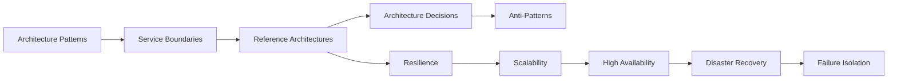
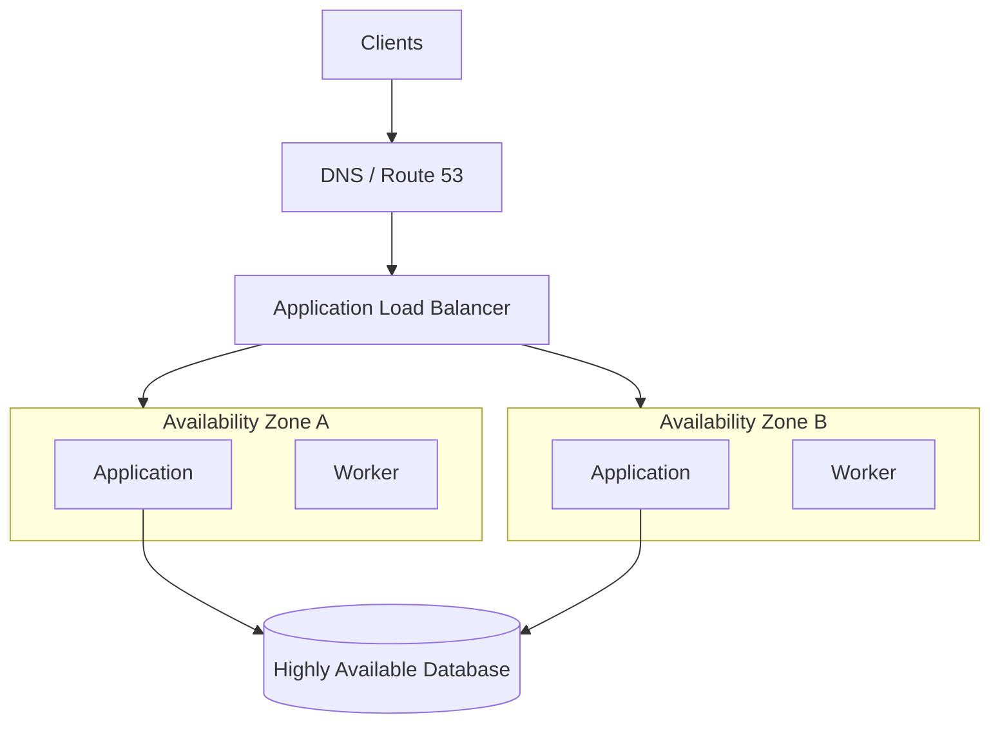

# README

## Overview

This directory contains the production-oriented architecture and operations reference material for designing resilient AWS-backed backend systems.

The documents progress from architectural patterns to concrete operational concerns such as resilience, scalability, high availability, disaster recovery, failure isolation, and recovery. The focus is on the engineering decisions required to operate backend systems reliably rather than on AWS service-by-service tutorials.

The material is intended to connect application architecture with infrastructure architecture. Topics such as microservices, serverless workloads, queues, databases, caching, multi-AZ deployments, multi-region strategies, observability, and recovery procedures are considered together because production reliability depends on how these components interact.

---

## Architecture and Operations Coverage

| Area | Document | Focus |
|---|---|---|
| Operations | [01- Resilience Patterns](./01-%20Resilience%20Patterns.md) | Designing systems that tolerate component failures |
| Operations | [02- Scalability Patterns](./02-%20Scalability%20Patterns.md) | Scaling compute, storage, databases, queues, and workloads |
| Operations | [03- High Availability and Disaster Recovery](./03-%20High%20Availability%20and%20Disaster%20Recovery.md) | Availability design and recovery planning |
| Operations | [04- Failure Isolation and Recovery](./04-%20Failure%20Isolation%20and%20Recovery.md) | Limiting blast radius and recovering from failures |

---

## How the Material Fits Together

The architecture material can be viewed as a progression:



Architecture determines how the system is structured. Operations determines how that structure behaves under load, failure, deployment changes, and infrastructure disruption.

A production architecture should therefore be evaluated across both dimensions.

---

## Architecture Principles

The material emphasizes several recurring engineering principles.

### Design for Failure

AWS infrastructure is highly available, but individual resources and dependencies can still fail.

Design systems assuming:

- Instances can terminate.
- Containers can crash.
- Pods can be rescheduled.
- Availability Zones can become unavailable.
- Databases can become unhealthy.
- Network dependencies can become slow.
- External providers can fail.
- Queues can accumulate backlog.
- Deployments can introduce regressions.
- Credentials and configuration can become invalid.

The architecture should define how the system behaves when each important dependency fails.

### Minimize Blast Radius

A failure should affect the smallest practical portion of the system.

Useful mechanisms include:

- Bulkheads
- Resource limits
- Independent queues
- Service isolation
- Tenant isolation
- Cell-based architecture
- Multi-AZ deployment
- Independent worker pools
- Circuit breakers
- Rate limiting

### Prefer Bounded Failure

Unbounded behavior is a common source of cascading failures.

Examples include:

```text
Unbounded retries
Unbounded queues
Unbounded concurrency
Unbounded memory usage
Unbounded database connections
Unbounded request duration
```

Production systems should establish explicit limits.

### Make Recovery a Design Requirement

Recovery should not be treated as an operational afterthought.

Architecture should account for:

- Failure detection
- Failover
- Rollback
- Backup restoration
- Data recovery
- Queue replay
- Dead-letter processing
- Dependency recovery
- Traffic shifting
- Health validation

---

## Scalability and Capacity

Scalability is not simply adding more EC2 instances or Kubernetes pods.

A backend system contains multiple capacity boundaries:

```text
Client Traffic
      ↓
Load Balancer
      ↓
Application Compute
      ↓
Connection Pools
      ↓
Database / Cache
      ↓
Queues / Streams
      ↓
External Dependencies
```

Scaling one layer can expose the capacity limit of another.

For example:

```text
20 application instances
×
50 database connections
=
1000 potential connections
```

Increasing application capacity without considering database connection limits can reduce overall reliability.

Scalability decisions should therefore consider:

- Throughput
- Latency
- Concurrency
- Connection capacity
- Storage capacity
- Queue depth
- Consumer throughput
- Database capacity
- Network bandwidth
- External dependency limits
- Cost

---

## High Availability

High availability focuses on reducing service interruption through redundancy and failure handling.

Typical AWS availability architecture:



Multi-AZ architecture protects against failures within a single Availability Zone, but it does not automatically protect against:

- Application bugs
- Bad deployments
- Data corruption
- Shared dependency failures
- Credential failures
- Regional outages

High availability must therefore be combined with resilience and recovery strategies.

---

## Disaster Recovery

Disaster recovery addresses larger failures where normal high-availability mechanisms are insufficient.

Common strategies include:

| Strategy | Recovery Characteristics | Typical Cost |
|---|---|---|
| Backup and restore | Slowest recovery | Lower |
| Pilot light | Minimal infrastructure running | Low–medium |
| Warm standby | Reduced-capacity environment | Medium |
| Active-passive | Standby environment ready for failover | Medium–high |
| Active-active | Multiple production regions | Highest |

Two important recovery objectives are:

### Recovery Time Objective

**RTO** defines how long the service can remain unavailable before recovery is required.

### Recovery Point Objective

**RPO** defines how much data loss, measured in time, is acceptable.

For example:

```text
RTO = 30 minutes
RPO = 5 minutes
```

means the system should recover within approximately 30 minutes and should lose no more than approximately five minutes of acceptable data under the defined disaster scenario.

---

## Failure Isolation

Failure isolation prevents one component from consuming resources or propagating failures into unrelated components.

A typical isolation model is:

```text
Global System
│
├── Service A
│   ├── Compute
│   ├── Queue
│   └── Data
│
├── Service B
│   ├── Compute
│   ├── Queue
│   └── Data
│
└── Service C
    ├── Compute
    ├── Queue
    └── Data
```

Isolation mechanisms include:

- Timeouts
- Circuit breakers
- Bulkheads
- Rate limiting
- Backpressure
- Queue separation
- Resource quotas
- Tenant isolation
- Cell architecture

The objective is not to eliminate every shared resource. Shared resources should instead be treated as explicit architectural dependencies and protected accordingly.

---

## Reliability Patterns

Common reliability patterns covered by this directory include:

| Pattern | Primary Problem Addressed |
|---|---|
| Timeout | Slow or stuck dependency |
| Retry with backoff | Transient failure |
| Circuit breaker | Persistent dependency failure |
| Bulkhead | Resource exhaustion |
| Rate limiting | Excessive traffic |
| Backpressure | Producer overload |
| Queue | Asynchronous processing |
| Dead-letter queue | Poison messages |
| Idempotency | Duplicate processing |
| Graceful degradation | Optional dependency failure |
| Multi-AZ | AZ failure |
| Multi-region | Regional failure |
| Health checks | Failure detection |
| Rollback | Bad deployment |
| Backup and restore | Data loss or corruption |

These patterns should be combined according to the failure mode being addressed rather than applied indiscriminately.

---

## Data and Messaging Considerations

Distributed systems introduce additional failure modes because messages and operations can be retried, duplicated, delayed, or reordered.

Backend systems using:

- PostgreSQL
- Redis
- Kafka
- SQS
- Celery
- REST APIs
- gRPC

should explicitly define:

- Delivery semantics
- Idempotency
- Retry behavior
- Ordering requirements
- Dead-letter handling
- Transaction boundaries
- Recovery behavior

For example, a payment operation should not blindly retry a `POST` request if the first request may already have succeeded.

A durable idempotency key can provide protection against duplicate business effects.

---

## Observability

A resilient architecture must be observable.

At minimum, monitor:

### Application

- Request rate
- Error rate
- Latency
- Saturation
- Dependency failures

### Infrastructure

- CPU
- Memory
- Network
- Disk
- Instance health
- Container restarts

### Database

- Query latency
- Connection utilization
- CPU
- Storage
- Lock contention
- Replication lag

### Messaging

- Queue depth
- Message age
- Consumer throughput
- Consumer lag
- Retry count
- DLQ depth

### Kubernetes

- Pod restarts
- OOM kills
- CPU throttling
- Pending pods
- Node pressure

Observability should help answer:

```text
What failed?
Where did it fail?
When did it fail?
How many users are affected?
What dependency caused it?
Is the system recovering?
What is the remaining blast radius?
```

---

## Security and Operations

Architecture decisions must include security and operational boundaries.

Important considerations include:

- IAM least privilege
- Private networking
- Security groups
- Encryption in transit
- Encryption at rest
- Secrets management
- Audit logging
- Service-specific credentials
- Deployment permissions
- Recovery permissions
- Configuration management
- Infrastructure as code

Recovery automation should have narrowly scoped permissions.

A recovery role should be capable of performing its recovery workflow without becoming an unrestricted administrative credential.

---

## Architecture Decision Records

Architectural decisions should be recorded when they have meaningful long-term consequences.

An ADR should generally capture:

- Context
- Problem
- Decision
- Alternatives considered
- Trade-offs
- Consequences

For example:

```text
Decision:
Use asynchronous processing through SQS for email delivery.

Reason:
Email delivery is not latency-critical and should not block
the synchronous API request.

Trade-off:
The API becomes eventually consistent with email delivery.

Operational consequence:
Queue depth, message age, retries, and DLQ depth must be monitored.
```

ADRs prevent architectural knowledge from existing only in conversations or individual engineers' memory.

---

## Common Anti-Patterns

The architecture should explicitly guard against common failure modes.

| Anti-Pattern | Risk |
|---|---|
| Distributed monolith | Service boundaries exist but remain tightly coupled |
| Shared database for every service | Strong coupling and large failure domain |
| Synchronous dependency chains | Latency and failures propagate |
| Infinite retries | Retry storms |
| No timeouts | Resource exhaustion |
| One queue for unrelated workloads | Head-of-line blocking |
| Cache as mandatory dependency | Cache failure becomes application failure |
| Single-AZ deployment | Infrastructure failure causes outage |
| Untested DR | Recovery assumptions remain theoretical |
| Manual deployment recovery | Slow and error-prone recovery |
| Unbounded worker concurrency | Database and dependency overload |
| No idempotency | Duplicate business operations |

The correct response is not always to remove the pattern completely. The engineering objective is to understand the trade-off and control its failure modes.

---

## Recommended Design Review Questions

Before approving an AWS architecture, ask:

### Availability

- What happens if one instance fails?
- What happens if one Availability Zone fails?
- Is enough capacity available after the failure?

### Dependency Failure

- What happens if the database becomes slow?
- What happens if Redis is unavailable?
- What happens if an external API times out?
- Which dependencies are mandatory?

### Scalability

- What is the first capacity bottleneck?
- What happens during a traffic spike?
- Can one tenant consume all resources?
- What happens when application instances scale horizontally?

### Data

- What happens if data is corrupted?
- What is the RPO?
- What is the RTO?
- Have backups actually been restored and verified?

### Messaging

- Can messages be duplicated?
- Are consumers idempotent?
- What happens to poison messages?
- Is there a DLQ?
- How is backlog handled after recovery?

### Deployment

- Can a bad release be rolled back?
- Are database migrations backward compatible?
- Can configuration changes be rolled back?
- Can traffic be shifted safely?

### Operations

- How is failure detected?
- What is automatically recovered?
- What requires human intervention?
- Is there an incident runbook?
- Can the failure scenario be tested safely?

---

## Suggested Reading Order

The recommended order for this directory is:

```text
Architecture
    │
    ├── Microservices Architecture
    ├── Serverless Architecture Patterns
    ├── Real-World Reference Architectures
    ├── Architecture Decision Records
    └── Common Architecture Anti-Patterns
             │
             ▼
Operations
    │
    ├── Resilience Patterns
    ├── Scalability Patterns
    ├── High Availability and Disaster Recovery
    └── Failure Isolation and Recovery
```

This progression moves from **how systems are structured** to **how those systems behave under load and failure**.

---

## Engineering Checklist

Use this checklist during architecture reviews.

### Architecture

- [ ] Service boundaries are explicit.
- [ ] Synchronous and asynchronous communication are intentional.
- [ ] Critical dependencies are identified.
- [ ] Shared infrastructure is documented.
- [ ] Architectural trade-offs are recorded.

### Scalability

- [ ] Application scaling strategy is defined.
- [ ] Database capacity is understood.
- [ ] Connection pools are bounded.
- [ ] Queue throughput is understood.
- [ ] External service limits are considered.

### Reliability

- [ ] Network calls have timeouts.
- [ ] Retry policies are bounded.
- [ ] Idempotency is defined where required.
- [ ] Circuit breakers exist where appropriate.
- [ ] Backpressure is implemented where necessary.
- [ ] Critical workloads are isolated.

### Availability

- [ ] Critical compute spans multiple Availability Zones.
- [ ] Capacity is sufficient after an expected AZ failure.
- [ ] Database availability requirements are defined.
- [ ] Health checks are meaningful.
- [ ] Failover behavior has been tested.

### Disaster Recovery

- [ ] RTO is defined.
- [ ] RPO is defined.
- [ ] Backups are automated.
- [ ] Backups are tested through restoration.
- [ ] Recovery procedures are documented.
- [ ] Regional recovery requirements are understood.

### Operations

- [ ] Metrics are available.
- [ ] Logs are centralized.
- [ ] Distributed tracing is available where appropriate.
- [ ] Alerts identify actionable failures.
- [ ] Runbooks exist.
- [ ] Rollback procedures are tested.
- [ ] Recovery permissions follow least privilege.

---

## Key Takeaways

- **Architecture and operations are inseparable:** a production AWS design must account for scalability, availability, failure behavior, recovery, and operational ownership.
- **Design around failure domains:** Multi-AZ, isolation, bulkheads, queues, resource limits, and bounded dependencies reduce the blast radius of failures.
- **Scalability requires capacity analysis across the entire system:** increasing application capacity without accounting for databases, connections, queues, caches, or external dependencies can reduce reliability.
- **Recovery must be measurable and tested:** RTO, RPO, backups, failover, rollback, and recovery procedures should be explicit rather than assumed.
- **Good architecture is deliberate trade-off management:** use ADRs to document important decisions, alternatives, constraints, and operational consequences.