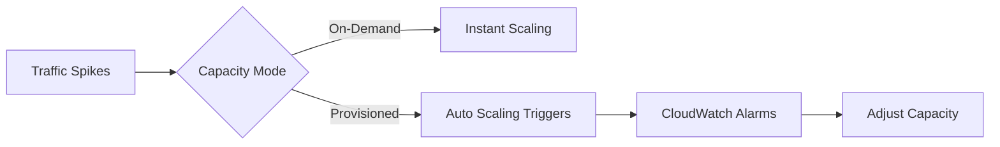

# 09- AWS DynamoDB

## Overview

This section focuses on production operations, including capacity management, scaling policies, performance monitoring, and cost reduction.

## 09- AWS DynamoDB Files

| File | Topic | Primary Focus |
|---|---|---|
| [01- Capacity Modes](./01-%20Capacity%20Modes.md) | Capacity Modes | One of the most important architectural decisions when de... |
| [02- Read & Write Capacity Units](./02-%20Read%20%26%20Write%20Capacity%20Units.md) | Read & Write Capacity Units | Every read and write operation in Amazon DynamoDB consume... |
| [03- Auto Scaling Deep Dive](./03-%20Auto%20Scaling%20Deep%20Dive.md) | Auto Scaling Deep Dive | Provisioning the correct capacity for a DynamoDB table is... |
| [04- Hot Partitions & Adaptive Capacity](./04-%20Hot%20Partitions%20%26%20Adaptive%20Capacity.md) | Hot Partitions & Adaptive Capacity | One of the biggest misconceptions about DynamoDB is that ... |
| [05- Performance Optimization Best Practices](./05-%20Performance%20Optimization%20Best%20Practices.md) | Performance Optimization Best Practices | Amazon DynamoDB is designed to deliver **single-digit mil... |
| [06- Monitoring with CloudWatch](./06-%20Monitoring%20with%20CloudWatch.md) | Monitoring with CloudWatch | Building a scalable DynamoDB application is only half the... |
| [07- Performance Troubleshooting](./07-%20Performance%20Troubleshooting.md) | Performance Troubleshooting | No matter how well a DynamoDB table is designed, producti... |
| [08- Cost Optimization](./08-%20Cost%20Optimization.md) | Cost Optimization | Amazon DynamoDB is designed to scale from a few requests ... |
| [09- Production Performance Patterns](./09-%20Production%20Performance%20Patterns.md) | Production Performance Patterns | Designing a DynamoDB table that performs well in developm... |

## Progression

The documentation in this section builds conceptually according to the following flow:



## Core Concepts

### Capacity Modes
The billing and scaling paradigm of the table.

### Adaptive Capacity
DynamoDB's internal mechanism for rebalancing partitions when traffic is uneven.

## Engineering Patterns

- **Scheduled Scaling:** Pre-warming tables before known traffic spikes.
- **Capacity Degradation:** Falling back to localized caching when throttling occurs.

## Practical Considerations

On-Demand mode is safer for unpredictable workloads but can be up to 7x more expensive for consistent, predictable traffic.

## Common Mistakes

- Leaving development tables in On-Demand mode, leading to runaway costs.
- Setting Auto Scaling maximums too high without billing alerts.
- Ignoring `ProvisionedThroughputExceededException` metrics.

## Recommended Reading Order

To maximize comprehension, study the files in this sequence:

1. [01- Capacity Modes](./01-%20Capacity%20Modes.md)
2. [02- Read & Write Capacity Units](./02-%20Read%20%26%20Write%20Capacity%20Units.md)
3. [03- Auto Scaling Deep Dive](./03-%20Auto%20Scaling%20Deep%20Dive.md)
4. [04- Hot Partitions & Adaptive Capacity](./04-%20Hot%20Partitions%20%26%20Adaptive%20Capacity.md)
5. [05- Performance Optimization Best Practices](./05-%20Performance%20Optimization%20Best%20Practices.md)
6. [06- Monitoring with CloudWatch](./06-%20Monitoring%20with%20CloudWatch.md)
7. [07- Performance Troubleshooting](./07-%20Performance%20Troubleshooting.md)
8. [08- Cost Optimization](./08-%20Cost%20Optimization.md)
9. [09- Production Performance Patterns](./09-%20Production%20Performance%20Patterns.md)

## Decision Checklist

- [ ] Is Point-in-Time Recovery (PITR) enabled?
- [ ] Are CloudWatch alarms configured for throttling?
- [ ] Have we right-sized provisioned capacity?

## Mental Model

Operating DynamoDB is about managing throughput pipes rather than disk space or CPU.

## Key Takeaways

- Master the concepts before writing code.
- Understand the capacity implications of your designs.
- Continuously monitor production metrics.

## Folder Structure

```text
09- AWS DynamoDB/
    01- Capacity Modes.md
    02- Read & Write Capacity Units.md
    03- Auto Scaling Deep Dive.md
    04- Hot Partitions & Adaptive Capacity.md
    05- Performance Optimization Best Practices.md
    06- Monitoring with CloudWatch.md
    07- Performance Troubleshooting.md
    08- Cost Optimization.md
    09- Production Performance Patterns.md
    README.md
```

---

## Repository Navigation

- [AWS Concepts](../../01-%20Concepts/README.md)
- [AWS Architecture](../../02-%20Architecture/README.md)
- [AWS Operations](../../04-%20Operations/README.md)
- [AWS Security](../../05-%20Security/README.md)
- [AWS Troubleshooting](../../07-%20Troubleshooting/README.md)
- [AWS Interview Questions](../../08-%20Interview%20Questions/README.md)
- [AWS Integrations](../../09-%20Integrations/README.md)
