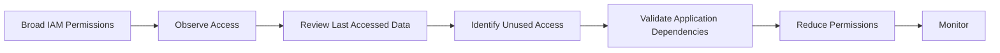
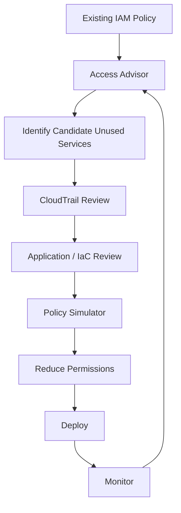
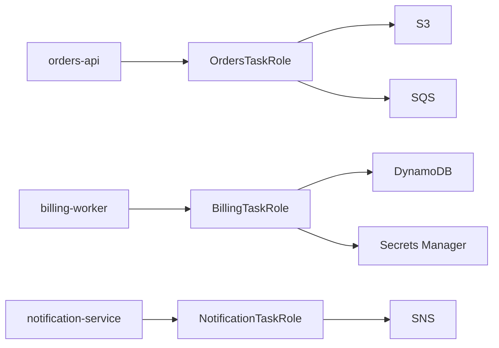

# 01- IAM Access Advisor

## Overview

AWS IAM Access Advisor is the operational view of **last accessed information** for IAM users, groups, roles, and policies.

It helps answer:

```text
Which AWS services has this identity or policy actually attempted to use?
When was the most recent attempt?
Which services appear to be unused?
```

This makes Access Advisor useful for:

- Least-privilege refinement
- IAM access reviews
- Removing obsolete permissions
- Role cleanup
- Policy consolidation
- Security audits
- Production access analysis

AWS now describes this capability as **last accessed information**. IAM can provide service-level last accessed data for IAM resources and, for supported services and actions, action-level information as well. ([AWS: Refine permissions using last accessed information](https://docs.aws.amazon.com/IAM/latest/UserGuide/access_policies_last-accessed.html))

Access Advisor is best treated as **evidence for permission reduction**, not as a complete authorization audit.

---

## What Access Advisor Measures

For an IAM resource, AWS can report the most recent attempt to access:

```text
AWS services
```

and, for supported services and actions:

```text
Specific management actions
```

Examples:

```text
Amazon S3
Amazon EC2
AWS Lambda
IAM
```

The report can show:

```text
Service name
Service namespace
Last authenticated time
Entity that last accessed the service
Tracked action activity
```

The exact level of detail depends on the report granularity and the services/actions supported by IAM last accessed reporting. ([AWS: View last accessed information for IAM](https://docs.aws.amazon.com/IAM/latest/UserGuide/access_policies_last-accessed-view-data.html))

---

## Why Access Advisor Exists

Broad IAM permissions are common during development.

For example:

```text
ApplicationRole
    ├── Amazon S3
    ├── Amazon SQS
    ├── Amazon DynamoDB
    ├── Amazon EC2
    ├── Amazon SNS
    ├── AWS Lambda
    └── CloudWatch
```

After several months, the application may only use:

```text
S3
SQS
Secrets Manager
CloudWatch
```

Access Advisor provides operational evidence that can help identify candidates for removing unused service permissions.

The intended workflow is:



This supports least privilege without relying purely on assumptions.

---

## Supported IAM Resource Types

Last accessed information can be generated for:

| Resource | What the report represents |
|---|---|
| IAM user | Services attempted by the user |
| IAM group | Services attempted by group members |
| IAM role | Services attempted while using the role |
| Managed policy | Services attempted by identities using that policy |

AWS documents these four IAM resource types for last accessed reporting. ([AWS: View last accessed information for IAM](https://docs.aws.amazon.com/IAM/latest/UserGuide/access_policies_last-accessed-view-data.html))

For a policy, the report helps answer:

```text
Which services have identities using this policy attempted to access?
```

This is particularly useful for customer-managed policies shared across multiple roles.

---

## Service-Level vs Action-Level Data

AWS supports two report granularities:

| Granularity | Provides |
|---|---|
| `SERVICE_LEVEL` | Last accessed information by AWS service |
| `ACTION_LEVEL` | Service information plus supported tracked actions |

Service-level reporting is useful for high-level cleanup:

```text
Does this role still need EC2?
```

Action-level reporting is more precise:

```text
Does this role still need ec2:DescribeInstances?
```

However, action-level reporting is only available for services and actions that AWS tracks. It should not be interpreted as complete coverage of every possible AWS API action. ([AWS CLI: `generate-service-last-accessed-details`](https://docs.aws.amazon.com/cli/latest/reference/iam/generate-service-last-accessed-details.html))

---

## Tracking Window

AWS currently reports at least **400 days** of service last accessed information, or less if the Region began supporting this capability more recently.

Recent activity generally appears within about **four hours**. ([AWS: Refine permissions using last accessed information](https://docs.aws.amazon.com/IAM/latest/UserGuide/access_policies_last-accessed.html))

This creates an important operational rule:

```text
No activity in the report
    ≠
Permission is definitely unnecessary
```

A service may be used:

```text
Quarterly
Annually
During disaster recovery
During a rare operational workflow
Only during releases
Only during batch processing
```

Therefore, use access history together with application and operational knowledge.

---

## Access Attempts vs Successful Access

This is one of the most important Access Advisor details.

Last accessed data includes **attempts** to access AWS APIs, not only successful requests. ([AWS: Refine permissions using last accessed information](https://docs.aws.amazon.com/IAM/latest/UserGuide/access_policies_last-accessed.html))

For example:

```text
Role has:
s3:GetObject

Application attempts:
s3:GetObject
    ↓
S3 returns AccessDenied
```

The attempt can still appear in last accessed data.

Therefore:

```text
Last accessed activity
    ≠
Successful authorization
```

For authoritative information about whether a request succeeded or was denied, use CloudTrail. AWS explicitly recommends CloudTrail as the authoritative source for API-call success and denial details. ([AWS: Refine permissions using last accessed information](https://docs.aws.amazon.com/IAM/latest/UserGuide/access_policies_last-accessed.html))

---

## Access Advisor and CloudTrail

These tools answer different questions.

| Tool | Primary purpose |
|---|---|
| Access Advisor | What services/actions have been attempted recently by an IAM resource? |
| CloudTrail | What API request actually occurred, who made it, and whether it succeeded or failed? |
| IAM Policy Simulator | Would the supplied policy/context allow the request? |
| Access Analyzer | Is a policy malformed, overly permissive, or exposing access patterns of interest? |

A practical security workflow is:

```text
Access Advisor
    ↓
Find candidate unused access
    ↓
CloudTrail
    ↓
Verify real activity and outcome
    ↓
Application / architecture review
    ↓
Policy change
```

---

## Important Policy Evaluation Limitation

Access Advisor does **not** calculate complete effective permissions across every IAM policy type.

For IAM last accessed reporting, AWS states that the data does not account for:

```text
Resource-based policies
ACLs
AWS Organizations SCPs
IAM permissions boundaries
STS assume-role policies
```

It primarily reports what is allowed by the relevant permissions policies. ([AWS: Refine permissions using last accessed information](https://docs.aws.amazon.com/IAM/latest/UserGuide/access_policies_last-accessed.html))

This means:

```text
Access Advisor says:
Role can access S3

        ↓

Actual request may still fail because of:
SCP
Boundary
Resource policy
Condition
KMS authorization
Other service-specific controls
```

Never use Access Advisor alone to infer effective authorization.

---

## Permissions Boundaries and Access Advisor

Consider:

```text
Role policy:
Allow s3:*

Boundary:
Allow only s3:GetObject
```

Access Advisor can report S3 activity, but that does not mean the role can actually perform every S3 operation.

The effective authorization is still constrained by the boundary.

AWS defines permissions boundaries as maximum permissions that an identity-based policy can grant to an IAM user or role. ([AWS: Permissions boundaries](https://docs.aws.amazon.com/IAM/latest/UserGuide/access_policies_boundaries.html))

Use Access Advisor for:

```text
Usage evidence
```

and policy evaluation for:

```text
Effective authorization
```

---

## SCPs and Access Advisor

In a multi-account organization:

```text
IAM role
    ↓
Identity policy
    ↓
SCP
    ↓
Resource
```

An SCP can limit what the account's identities are allowed to do.

Access Advisor information for IAM resources does not incorporate SCPs when determining the services allowed by the resource's permissions policies. ([AWS: Refine permissions using last accessed information](https://docs.aws.amazon.com/IAM/latest/UserGuide/access_policies_last-accessed.html))

Therefore:

```text
Reported service access
    ≠
Guaranteed effective access
```

For organization-level analysis, AWS also provides last accessed information for AWS Organizations entities and SCPs, with different semantics from IAM resource reporting. ([AWS: View last accessed information for AWS Organizations](https://docs.aws.amazon.com/IAM/latest/UserGuide/access_policies_last-accessed-view-data-orgs.html))

---

## IAM Console

Access Advisor is available through the IAM console's **Last Accessed** view.

Typical workflow:

```text
IAM
  ↓
Users / Roles / Policies
  ↓
Select resource
  ↓
Last Accessed
```

For an IAM role, the view can help answer:

```text
Which AWS services has this role attempted to use?
When was each service last used?
```

AWS documents the console and API/CLI workflows separately. ([AWS: View last accessed information for IAM](https://docs.aws.amazon.com/IAM/latest/UserGuide/access_policies_last-accessed-view-data.html))

---

## CLI Workflow

For automation and repeatable audits, use the AWS CLI.

The workflow is:

```text
Generate report
    ↓
Receive JobId
    ↓
Poll report
    ↓
Wait for COMPLETED
    ↓
Inspect service/action data
```

---

## Generate a Service Last Accessed Report

For a role:

```bash
aws iam generate-service-last-accessed-details \
    --arn arn:aws:iam::123456789012:role/BackendApiRole
```

For a managed policy:

```bash
aws iam generate-service-last-accessed-details \
    --arn arn:aws:iam::123456789012:policy/BackendProductionAccess
```

The command starts a background report-generation job and returns a `JobId`. ([AWS CLI: `generate-service-last-accessed-details`](https://docs.aws.amazon.com/cli/latest/reference/iam/generate-service-last-accessed-details.html))

Example:

```json
{
  "JobId": "2eb6c2b8-7b4c-3xmp-3c13-03b72c8cdfdc"
}
```

---

## Generate Action-Level Data

To request service and tracked action information:

```bash
aws iam generate-service-last-accessed-details \
    --arn arn:aws:iam::123456789012:role/BackendApiRole \
    --granularity ACTION_LEVEL
```

Without specifying granularity, the report defaults to service-level data. ([AWS CLI: `generate-service-last-accessed-details`](https://docs.aws.amazon.com/cli/latest/reference/iam/generate-service-last-accessed-details.html))

---

## Retrieve the Report

Use the returned job ID:

```bash
aws iam get-service-last-accessed-details \
    --job-id <JOB_ID>
```

The operation returns a status such as:

```text
IN_PROGRESS
COMPLETED
FAILED
```

When complete, the result includes service last accessed information. ([AWS CLI: `get-service-last-accessed-details`](https://docs.aws.amazon.com/cli/latest/reference/iam/get-service-last-accessed-details.html))

---

## Polling for Completion

A simple production-oriented shell pattern is:

```bash
JOB_ID=$(aws iam generate-service-last-accessed-details \
    --arn arn:aws:iam::123456789012:role/BackendApiRole \
    --query 'JobId' \
    --output text)

for _ in {1..20}; do
    STATUS=$(aws iam get-service-last-accessed-details \
        --job-id "$JOB_ID" \
        --query 'JobStatus' \
        --output text)

    case "$STATUS" in
        COMPLETED)
            break
            ;;
        FAILED)
            echo "Access Advisor report failed" >&2
            exit 1
            ;;
        IN_PROGRESS)
            sleep 10
            ;;
        *)
            echo "Unexpected report status: $STATUS" >&2
            exit 1
            ;;
    esac
done

aws iam get-service-last-accessed-details \
    --job-id "$JOB_ID" \
    --output json
```

In CI/CD or scheduled automation, prefer bounded polling and explicit failure handling instead of an infinite loop.

---

## Inspecting the Report

A report may contain entries similar to:

```json
{
  "ServiceName": "Amazon S3",
  "ServiceNamespace": "s3",
  "LastAuthenticated": "2026-09-10T09:12:00Z",
  "TotalAuthenticatedEntities": 1
}
```

A service with no recorded access can appear without a recent access timestamp.

This distinction is useful:

```text
Service present + timestamp
    → observed attempt

Service present + no timestamp
    → permission policy allows service according to report logic,
      but no tracked attempt was observed in the period
```

([AWS CLI: `get-service-last-accessed-details`](https://docs.aws.amazon.com/cli/latest/reference/iam/get-service-last-accessed-details.html))

---

## Filtering CLI Output

Use `--query` to focus on relevant fields:

```bash
aws iam get-service-last-accessed-details \
    --job-id "$JOB_ID" \
    --query 'ServicesLastAccessed[].{Service:ServiceNamespace,LastAccess:LastAuthenticated}' \
    --output table
```

Find services with no recorded access:

```bash
aws iam get-service-last-accessed-details \
    --job-id "$JOB_ID" \
    --query 'ServicesLastAccessed[?LastAuthenticated==null].ServiceNamespace' \
    --output text
```

Find recently accessed services:

```bash
aws iam get-service-last-accessed-details \
    --job-id "$JOB_ID" \
    --query 'ServicesLastAccessed[?LastAuthenticated!=null].[ServiceNamespace,LastAuthenticated]' \
    --output table
```

This makes Access Advisor practical for recurring IAM reviews.

---

## Action-Level Reporting

When using:

```bash
--granularity ACTION_LEVEL
```

the report can include tracked actions within the service.

Example:

```text
Amazon S3
    ├── GetObject
    ├── PutObject
    └── ListBucket
```

The exact action coverage depends on AWS's current supported service/action tracking list. ([AWS: IAM action last accessed information](https://docs.aws.amazon.com/IAM/latest/UserGuide/access_policies_last-accessed.html))

Do not assume that every action for every AWS service has action-level history.

---

## `iam:PassRole` Limitation

`iam:PassRole` is not included in IAM action last accessed information. ([AWS: Refine permissions using last accessed information](https://docs.aws.amazon.com/IAM/latest/UserGuide/access_policies_last-accessed.html))

This matters for:

```text
Lambda
ECS
CloudFormation
EC2
Step Functions
Other services that assume or receive execution roles
```

A role or deployment pipeline can critically depend on:

```text
iam:PassRole
```

even when Access Advisor does not show it as an action-level usage signal.

Always inspect infrastructure code and CloudTrail when auditing role-delegation permissions.

---

## Data Plane Limitation

IAM action last accessed information is not available for arbitrary data-plane events.

AWS explicitly distinguishes tracked management actions from data-plane activity. ([AWS: Refine permissions using last accessed information](https://docs.aws.amazon.com/IAM/latest/UserGuide/access_policies_last-accessed.html))

For example:

```text
S3 object access
DynamoDB data operations
SQS message processing
```

should not automatically be inferred from action last-accessed history.

For data-plane activity, use service-specific logging and CloudTrail capabilities where supported.

---

## Policy-Level Access Advisor

Access Advisor can be generated for a managed policy:

```bash
aws iam generate-service-last-accessed-details \
    --arn arn:aws:iam::123456789012:policy/BackendProductionAccess
```

This is useful for finding:

```text
Policies granting access to many services
        ↓
Only some services actually used
        ↓
Candidates for policy reduction
```

For a shared customer-managed policy, policy-level analysis can be more useful than examining each role independently.

---

## Policy vs Role Analysis

| Scope | Best question |
|---|---|
| Role | What services does this workload actually attempt to use? |
| User | What services does this human identity attempt to use? |
| Group | What services do members of this group attempt to use? |
| Managed policy | Which services are actually associated with identities using this policy? |

Use the smallest useful scope.

For a single microservice:

```text
Role-level report
```

For a shared engineering policy:

```text
Policy-level report
```

---

## Identify Which Entities Use a Policy

For group and policy reports, AWS provides:

```bash
aws iam get-service-last-accessed-details-with-entities
```

This can identify entities that could have used the relevant group or policy permissions to access a specific service. ([AWS CLI: `get-service-last-accessed-details-with-entities`](https://docs.aws.amazon.com/cli/latest/reference/iam/get-service-last-accessed-details-with-entities.html))

This is useful when a policy is shared:

```text
BackendReadOnlyPolicy
    ├── ServiceA
    ├── ServiceB
    └── ServiceC
```

and you need to know:

```text
Which roles actually attempted to use ServiceB?
```

---

## Identify Policies Granting Access

For an identity, use:

```bash
aws iam list-policies-granting-service-access \
    --arn arn:aws:iam::123456789012:role/BackendApiRole \
    --service-namespaces s3
```

This answers:

```text
Which identity-based policies currently grant this identity access to S3?
```

The command includes managed and inline identity policies applicable to the specified user, group, or role, but does not account for other policy types such as resource policies, SCPs, permissions boundaries, or STS assume-role policies. ([AWS CLI: `list-policies-granting-service-access`](https://docs.aws.amazon.com/cli/latest/reference/iam/list-policies-granting-service-access.html))

---

## Access Advisor and Least Privilege

Access Advisor fits into a broader least-privilege process:



The key principle is:

```text
Observed inactivity
    +
Architecture knowledge
    +
Runtime evidence
    +
Authorization testing
    =
Safer permission reduction
```

Do not treat an absence of observed activity as sufficient evidence by itself.

---

## Production Permission Review

A production role might initially have:

```json
{
  "Effect": "Allow",
  "Action": [
    "s3:*",
    "sqs:*",
    "ec2:*",
    "lambda:*",
    "secretsmanager:*"
  ],
  "Resource": "*"
}
```

Access Advisor may show:

```text
S3              recently used
SQS              recently used
Secrets Manager  recently used
EC2              no observed access
Lambda           no observed access
```

The correct response is not:

```text
Delete EC2 and Lambda permissions immediately.
```

Instead:

```text
1. Confirm application architecture.
2. Inspect deployment and operational tooling.
3. Check CloudTrail.
4. Check scheduled jobs and failover paths.
5. Validate required permissions.
6. Reduce policy scope.
7. Monitor after deployment.
```

---

## Rare Operational Access

Some permissions are intentionally infrequent.

Examples:

```text
Disaster recovery
Database restore
Emergency failover
Migration jobs
Incident response
Scheduled monthly reports
One-time data repair
Deployment rollback
```

Suppose:

```text
Role:
BackupRestoreRole

Last S3 access:
11 months ago
```

Removing S3 access solely from that timestamp could break disaster recovery.

Access Advisor should therefore be integrated with:

```text
Runbooks
DR plans
Terraform / CloudFormation
Deployment manifests
Scheduled jobs
Operational procedures
```

---

## Production Review Cadence

A practical IAM review program can use different frequencies.

| Review | Suggested approach |
|---|---|
| High-privilege production roles | Frequent review |
| Standard application roles | Periodic review |
| Shared customer-managed policies | Periodic policy-level review |
| Break-glass roles | Separate controlled review |
| CI/CD roles | Review with deployment architecture changes |
| Service accounts with sensitive data access | Review with security/compliance cycles |

Do not rely on a single annual report for rapidly changing systems.

Access patterns should be reviewed whenever:

```text
Architecture changes
Services are retired
Teams change ownership
Microservices are removed
AWS services are replaced
CI/CD design changes
Production roles are consolidated
```

---

## Access Advisor for Microservices

A useful architecture pattern is:

```text
One workload
    ↓
Dedicated IAM role
    ↓
Minimal service permissions
```

Example:



Access Advisor can then be used at role level to answer:

```text
Which services does each workload actually attempt to use?
```

This is much easier to reason about than one shared role covering the entire platform.

---

## Access Advisor for CI/CD Roles

CI/CD roles frequently accumulate permissions because deployment systems evolve.

Example:

```text
Old:
ECS
CloudFormation
ECR
S3
Lambda

Current:
ECS
ECR
CloudFormation
```

Access Advisor can identify services that appear unused.

However, CI/CD review must include:

```text
Deployment scripts
Terraform
CloudFormation
GitHub Actions
GitLab CI
Release rollback procedures
Migration jobs
Manual deployment paths
```

An unused service in normal deployments may still be needed by:

```text
Rollback
Emergency deployment
Infrastructure recovery
```

---

## Access Advisor for Human Identities

For human identities, prefer centralized identity and role-based access wherever possible.

Access Advisor can still help identify:

```text
Unused service access
Stale permissions
Overly broad permission sets
```

For workforce access, combine it with:

```text
IAM Identity Center
Permission sets
MFA
Federation
Access reviews
Temporary role sessions
```

Avoid using Access Advisor as a reason to retain long-lived IAM users.

---

## Access Advisor and Unused Access Analyzer

AWS also provides **IAM Access Analyzer unused access analysis** for continuously identifying unused permissions and external/unused access patterns.

These capabilities are complementary:

```text
Access Advisor
    → Historical last accessed information

Unused access analysis
    → Continuous analysis of unused permissions
```

AWS explicitly documents unused access analyzers as a way to continuously monitor last accessed and unused access information. ([AWS: Refine permissions using last accessed information](https://docs.aws.amazon.com/IAM/latest/UserGuide/access_policies_last-accessed.html))

Use the mechanism appropriate to the operational requirement rather than assuming they are interchangeable.

---

## Access Advisor and IAM Access Analyzer

Do not confuse:

| Capability | Primary purpose |
|---|---|
| IAM Access Advisor / Last Accessed | Historical service/action usage evidence |
| IAM Access Analyzer | Analyze external access, unused access, and validate policies |
| Policy Simulator | Test authorization decisions |
| CloudTrail | Observe actual API activity |

They solve different problems.

---

## Security Considerations

Access Advisor itself does not grant or remove permissions.

It provides information that administrators can use to make permission decisions.

Security risk comes from interpreting the information incorrectly.

Avoid:

```text
"Not accessed recently, therefore safe to remove."
```

Prefer:

```text
"Not observed during the reporting period; investigate before removal."
```

For sensitive roles, combine:

```text
Access Advisor
+
CloudTrail
+
Policy review
+
Architecture review
+
Application ownership
```

---

## Reliability Considerations

Permission reduction can create production outages.

Before removing a permission, consider:

```text
Normal traffic
Background workers
Celery tasks
Scheduled jobs
Kafka consumers
Batch processing
Deployment workflows
Disaster recovery
Operational scripts
```

For a FastAPI service:

```text
HTTP request
    ↓
FastAPI
    ↓
boto3
    ↓
IAM role
    ↓
AWS service
```

A rarely executed code path may still depend on an AWS permission.

Test those paths before final removal.

---

## High Availability and Disaster Recovery

IAM cleanup should account for HA and DR workflows.

For example:

```text
Primary Region
    ↓
Application role

Failover Region
    ↓
Same or secondary application role
```

A permission that appears unused in the primary environment may be required during regional failover.

Before reducing permissions, review:

```text
Multi-Region deployment
Backup restoration
Failover automation
Disaster recovery roles
Break-glass access
Infrastructure recovery pipelines
```

---

## Cost Considerations

Access Advisor itself is primarily an IAM analysis capability rather than a workload data-processing system.

The main operational cost comes from incorrect permission changes:

```text
Overly broad access
    → larger security exposure

Overly aggressive removal
    → outages / deployment failures / recovery failures
```

The objective is not:

```text
Minimum permissions at any cost
```

but:

```text
Least privilege that preserves required functionality
```

---

## Common Mistakes

| Mistake | Why it is dangerous | Better approach |
|---|---|---|
| Treating no access as proof of no need | Rare workflows may be missed | Validate architecture and operational paths |
| Assuming last access means successful access | Reports include attempts | Confirm outcomes in CloudTrail |
| Using Access Advisor as an effective-permissions calculator | Several policy types are excluded | Evaluate boundaries, SCPs, resource policies, and conditions separately |
| Removing access immediately | Can create production failures | Stage and monitor changes |
| Ignoring `iam:PassRole` | It is not tracked in action last accessed data | Review role-passing paths separately |
| Assuming all AWS actions are tracked | Action-level coverage is service-specific | Check AWS-supported action list |
| Ignoring data-plane activity | IAM action last accessed data is not general data-plane telemetry | Use service logs and CloudTrail where supported |
| Reviewing only roles | Shared policies may hide broader access patterns | Review policies and groups too |
| Relying only on IAM console | Hard to automate at scale | Use CLI/API plus scheduled reporting |

---

## Interview Traps

### "What does Access Advisor tell you?"

It provides historical information about when IAM identities or policies were last used to attempt access to AWS services, and for supported services/actions can provide action-level information.

It does not simply return a definitive list of effective permissions.

### "If Access Advisor says a service was never accessed, can you remove it?"

Not automatically.

Possible reasons include:

```text
Rare workflow
DR path
Unexecuted code
Scheduled job
Denied attempt not understood
Tracking limitations
Service/action not covered
```

### "Does last accessed mean successful access?"

No.

It records access attempts. CloudTrail should be used to determine whether the request succeeded or was denied. ([AWS: Refine permissions using last accessed information](https://docs.aws.amazon.com/IAM/latest/UserGuide/access_policies_last-accessed.html))

### "Does Access Advisor include SCPs and permissions boundaries?"

IAM last accessed information does not incorporate those policy types when determining the services allowed by the IAM resource's permission policies. ([AWS: GetServiceLastAccessedDetails](https://docs.aws.amazon.com/IAM/latest/APIReference/API_GetServiceLastAccessedDetails.html))

### "Can it prove a policy is safe to delete?"

No.

It provides usage evidence, not a complete dependency graph.

---

## Senior-Level IAM Reasoning

A strong production review asks:

```text
What permissions does this identity have?
        ↓
Which services appear to be used?
        ↓
Which access was actually successful?
        ↓
Which policy grants that access?
        ↓
Which non-identity policies affect the request?
        ↓
Which application paths depend on the permission?
        ↓
Which rare operational paths depend on it?
        ↓
Can the permission be reduced safely?
```

The critical distinction is:

```text
Usage evidence
    ≠
Authorization truth
    ≠
Application dependency truth
```

A senior engineer combines all three.

---

## Recommended Permission-Reduction Workflow

Use the following process for production IAM cleanup:

```text
1. Generate Access Advisor report.
2. Identify candidate unused services/actions.
3. Check CloudTrail for real API activity.
4. Review application source code and IaC.
5. Review scheduled and asynchronous workloads.
6. Review DR and break-glass procedures.
7. Identify which policy grants the access.
8. Test the intended permissions with Policy Simulator where appropriate.
9. Create a narrowly scoped policy change.
10. Deploy through normal change management.
11. Monitor application and CloudTrail behavior.
12. Roll back if an overlooked dependency appears.
```

This creates a controlled transition from:

```text
Broad permissions
```

to:

```text
Evidence-based least privilege
```

---

## Operational Checklist

Before removing an AWS service from a production role, verify:

```text
[ ] Access Advisor reviewed
[ ] Reporting period understood
[ ] AWS service/action is covered by tracking
[ ] CloudTrail reviewed
[ ] Application code reviewed
[ ] IaC reviewed
[ ] Scheduled jobs reviewed
[ ] Celery / worker jobs reviewed
[ ] CI/CD workflows reviewed
[ ] DR and failover paths reviewed
[ ] SCP / boundary / resource policies considered
[ ] iam:PassRole dependencies reviewed
[ ] Policy Simulator considered
[ ] Change deployed safely
[ ] Post-change monitoring enabled
```

---

## Practical Example: Reducing a Backend Role

Suppose:

```text
Role:
OrdersServiceRole
```

Current service permissions:

```text
S3
SQS
SNS
EC2
Lambda
CloudWatch
Secrets Manager
```

Access Advisor reports recent activity for:

```text
S3
SQS
CloudWatch
Secrets Manager
```

Before reducing access:

```bash
aws iam generate-service-last-accessed-details \
    --arn arn:aws:iam::123456789012:role/OrdersServiceRole
```

Review the report:

```bash
aws iam get-service-last-accessed-details \
    --job-id "$JOB_ID" \
    --query 'ServicesLastAccessed[].{Service:ServiceNamespace,LastAccess:LastAuthenticated}' \
    --output table
```

Then investigate candidate services with:

```bash
aws cloudtrail lookup-events \
    --lookup-attributes \
        AttributeKey=EventSource,AttributeValue=lambda.amazonaws.com
```

Finally validate the policy change and deploy.

The objective is not merely to make the policy smaller. The objective is to make it **smaller without breaking required application or operational behavior**.

---

## AWS CLI Reference

### Generate report

```bash
aws iam generate-service-last-accessed-details \
    --arn <IAM_RESOURCE_ARN>
```

### Generate action-level report

```bash
aws iam generate-service-last-accessed-details \
    --arn <IAM_RESOURCE_ARN> \
    --granularity ACTION_LEVEL
```

### Retrieve report

```bash
aws iam get-service-last-accessed-details \
    --job-id <JOB_ID>
```

### Retrieve associated entities

```bash
aws iam get-service-last-accessed-details-with-entities \
    --job-id <JOB_ID> \
    --service-namespace s3
```

### Identify policies granting service access

```bash
aws iam list-policies-granting-service-access \
    --arn <USER_OR_GROUP_OR_ROLE_ARN> \
    --service-namespaces s3
```

### Inspect identity

```bash
aws sts get-caller-identity
```

### Query service results

```bash
aws iam get-service-last-accessed-details \
    --job-id <JOB_ID> \
    --query 'ServicesLastAccessed[].{Service:ServiceNamespace,LastAccess:LastAuthenticated}' \
    --output table
```

---

## AWS Documentation Links

- [Refine permissions using last accessed information](https://docs.aws.amazon.com/IAM/latest/UserGuide/access_policies_last-accessed.html)
- [View last accessed information for IAM](https://docs.aws.amazon.com/IAM/latest/UserGuide/access_policies_last-accessed-view-data.html)
- [IAM action last accessed information](https://docs.aws.amazon.com/IAM/latest/UserGuide/access_policies_last-accessed.html)
- [AWS CLI `generate-service-last-accessed-details`](https://docs.aws.amazon.com/cli/latest/reference/iam/generate-service-last-accessed-details.html)
- [AWS CLI `get-service-last-accessed-details`](https://docs.aws.amazon.com/cli/latest/reference/iam/get-service-last-accessed-details.html)
- [AWS CLI `get-service-last-accessed-details-with-entities`](https://docs.aws.amazon.com/cli/latest/reference/iam/get-service-last-accessed-details-with-entities.html)
- [AWS CLI `list-policies-granting-service-access`](https://docs.aws.amazon.com/cli/latest/reference/iam/list-policies-granting-service-access.html)
- [IAM `GetServiceLastAccessedDetails` API](https://docs.aws.amazon.com/IAM/latest/APIReference/API_GetServiceLastAccessedDetails.html)
- [IAM Service Last Accessed Data](https://docs.aws.amazon.com/IAM/latest/APIReference/API_ServiceLastAccessed.html)
- [IAM Permissions Boundaries](https://docs.aws.amazon.com/IAM/latest/UserGuide/access_policies_boundaries.html)
- [IAM Access Analyzer](https://docs.aws.amazon.com/IAM/latest/UserGuide/what-is-access-analyzer.html)
- [AWS Organizations Last Accessed Information](https://docs.aws.amazon.com/IAM/latest/UserGuide/access_policies_last-accessed-view-data-orgs.html)

## Key Takeaways

- **Access Advisor provides usage evidence, not complete effective permissions:** use it to identify service/action access patterns, not to calculate the final authorization result.
- **Last accessed means attempted access:** confirm successful versus denied API calls with CloudTrail before removing permissions. ([AWS: Refine permissions using last accessed information](https://docs.aws.amazon.com/IAM/latest/UserGuide/access_policies_last-accessed.html))
- **Use Access Advisor for least-privilege refinement:** combine last-accessed data with application architecture, IaC, CI/CD, scheduled jobs, and disaster-recovery requirements before changing production policies.
- **Know the reporting limitations:** resource policies, SCPs, permissions boundaries, STS assume-role policies, and unsupported action/data-plane activity are not fully represented by IAM last accessed data. ([AWS: GetServiceLastAccessedDetails](https://docs.aws.amazon.com/IAM/latest/APIReference/API_GetServiceLastAccessedDetails.html))
- **For scalable operations, automate the workflow:** generate reports with the CLI/API, analyze candidates, validate policy changes, deploy safely, and monitor for overlooked dependencies.