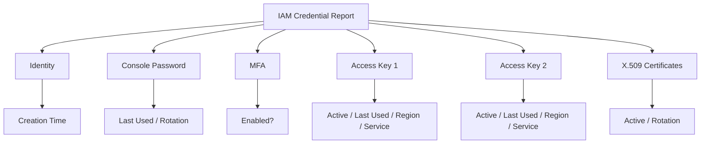
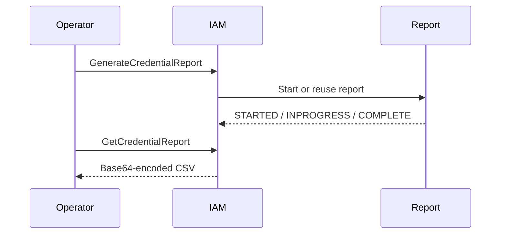
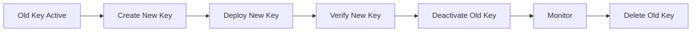
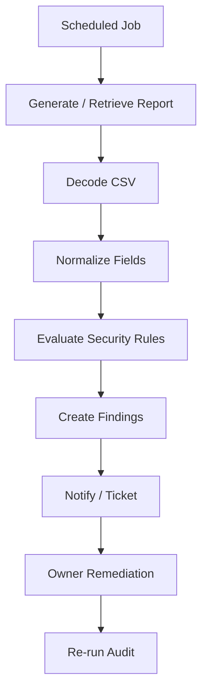
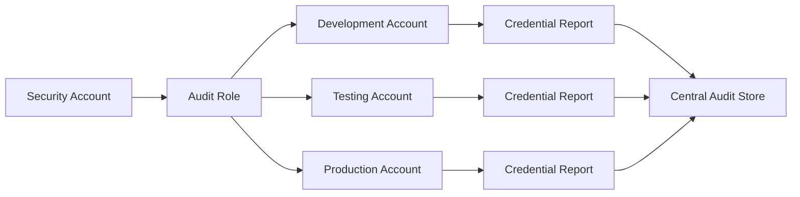
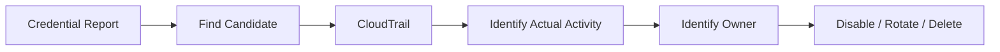

# 02- IAM Credentials Report

## Overview

The AWS IAM credential report is an account-level CSV report that provides the credential status of IAM identities.

It is primarily used for:

- Credential lifecycle audits
- MFA compliance checks
- Access key inventory
- Identifying stale IAM user credentials
- Security and compliance reviews
- Detecting unused long-term credentials
- Supporting credential rotation programs

AWS currently exposes credential information for the account root user and IAM users, including passwords, up to two access keys per user, MFA status, and X.509 signing certificates. It does **not** provide complete visibility into every credential type used by AWS services or workloads. ([AWS: Generate credential reports](https://docs.aws.amazon.com/IAM/latest/UserGuide/id_credentials_getting-report.html))

The report should therefore be treated as:

```text
Credential inventory
    +
Credential lifecycle evidence
```

rather than:

```text
Complete IAM authorization inventory
```

---

## What the Credential Report Contains

The report is a CSV document containing credential-related fields for account identities.

The primary categories are:

```text
Identity metadata
Password state
MFA state
Access key 1
Access key 2
X.509 certificate 1
X.509 certificate 2
Additional credential information
```

A typical operational interpretation is:



AWS documents the complete CSV schema in the IAM User Guide. ([AWS: Understanding the credential report format](https://docs.aws.amazon.com/IAM/latest/UserGuide/id_credentials_getting-report.html))

---

## Why the Credential Report Exists

IAM users can accumulate long-lived credentials over time:

```text
Console password
Access key
Access key
MFA device
Legacy certificate
```

This creates operational risk:

```text
Credential created
    ↓
Workload or user changes
    ↓
Credential remains active
    ↓
No one remembers its purpose
    ↓
Credential becomes stale
```

The credential report gives security and platform teams a centralized inventory for identifying these conditions.

It is particularly useful for environments that are still migrating from IAM users and long-lived access keys toward:

```text
IAM Identity Center
AssumeRole
OIDC
EC2 roles
ECS task roles
Lambda execution roles
EKS workload identity
```

AWS recommends federation and temporary credentials for human access where possible and retaining only the minimum IAM users required for specific use cases. ([AWS security audit guidelines](https://docs.aws.amazon.com/IAM/latest/UserGuide/security-audit-guide.html))

---

## Report Scope

The credential report includes:

| Credential type | Included |
|---|---|
| IAM user password | Yes |
| Root-user password state | Yes |
| IAM user access key 1 | Yes |
| IAM user access key 2 | Yes |
| Root access key 1/2 | Yes |
| IAM user MFA state | Yes |
| X.509 signing certificate 1 | Yes |
| X.509 signing certificate 2 | Yes |
| More than two access keys | Not individually reported |
| Service-specific credentials | No |
| IAM roles | No |
| ECS task-role credentials | No |
| EC2 instance-role credentials | No |
| Lambda execution-role credentials | No |
| EKS workload credentials | No |
| IAM Identity Center sessions | No |

AWS explicitly states that the credential report includes only IAM-managed credentials and does not include service-specific credentials or access keys beyond the first two per user. ([AWS: Generate credential reports](https://docs.aws.amazon.com/IAM/latest/UserGuide/id_credentials_getting-report.html))

---

## Important Distinction: Credentials vs Permissions

The report answers:

```text
What credentials exist?
What is their lifecycle state?
When were certain credentials last used?
```

It does not answer:

```text
What can this principal do?
```

For permissions, use:

```text
IAM policy inspection
IAM Access Analyzer
Policy Simulator
Organizations controls
Resource policies
CloudTrail
```

Therefore:

```text
Credential Report
    → Credential state

IAM Policies
    → Potential authorization

Policy Evaluation
    → Effective authorization

CloudTrail
    → Runtime activity
```

---

## Report Generation Lifecycle

AWS stores a single credential report for the account.

The workflow is:



AWS permits credential report generation at most once every **four hours**. If a report has already been generated within that period, requesting a new one returns the existing recent report instead of creating another fresh report. ([AWS: Generate credential reports](https://docs.aws.amazon.com/IAM/latest/UserGuide/id_credentials_getting-report.html))

This is important for automation:

```text
Generate
    ↓
Do not assume immediate refresh
    ↓
Retrieve current report
    ↓
Check GeneratedTime
```

---

## Required IAM Permissions

To generate a report:

```text
iam:GenerateCredentialReport
```

To retrieve it:

```text
iam:GetCredentialReport
```

AWS documents these as separate permissions. ([AWS: Generate credential reports](https://docs.aws.amazon.com/IAM/latest/UserGuide/id_credentials_getting-report.html))

A minimal auditing identity could therefore be granted only the permissions required for report generation and retrieval, subject to the organization's broader security model.

---

## Generate a Credential Report

Using the AWS CLI:

```bash
aws iam generate-credential-report
```

A typical response is:

```json
{
  "State": "STARTED",
  "Description": "No report exists. Starting a new report generation task"
}
```

The API can report:

```text
STARTED
INPROGRESS
COMPLETE
```

depending on the report-generation state. ([AWS: GenerateCredentialReport API](https://docs.aws.amazon.com/IAM/latest/APIReference/API_GenerateCredentialReport.html))

---

## Retrieve the Report

Use:

```bash
aws iam get-credential-report
```

The API returns:

```text
Content
GeneratedTime
ReportFormat
```

The `Content` value is Base64-encoded and the report format is `text/csv`. ([AWS: GetCredentialReport API](https://docs.aws.amazon.com/IAM/latest/APIReference/API_GetCredentialReport.html))

The CLI handles the response for normal terminal use, but scripts that process the raw API response should account for the encoded content.

---

## Save the Report Locally

A simple workflow is:

```bash
aws iam generate-credential-report

aws iam get-credential-report \
    --query 'Content' \
    --output text
```

For a repeatable audit workflow, save the response and decode the CSV explicitly rather than manually copying terminal output.

---

## Generate and Decode With Python

For backend automation, Boto3 can retrieve the report programmatically.

```python
from __future__ import annotations

import base64
import csv
import io

import boto3


def get_credential_report() -> list[dict[str, str]]:
    iam = boto3.client("iam")

    iam.generate_credential_report()

    response = iam.get_credential_report()
    content = response["Content"]

    if isinstance(content, str):
        decoded = base64.b64decode(content).decode("utf-8")
    else:
        decoded = base64.b64decode(content).decode("utf-8")

    reader = csv.DictReader(io.StringIO(decoded))
    return list(reader)


if __name__ == "__main__":
    for row in get_credential_report():
        print(
            row["user"],
            row["mfa_active"],
            row["access_key_1_active"],
        )
```

For production automation, do not assume that `GenerateCredentialReport` immediately produces a freshly generated report. AWS limits generation frequency and may return the existing report when it is still recent. ([AWS: Generate credential reports](https://docs.aws.amazon.com/IAM/latest/UserGuide/id_credentials_getting-report.html))

A scheduled security job should therefore inspect `GeneratedTime`.

---

## Report Freshness

The `GeneratedTime` response field identifies when the current report was created.

Example:

```json
{
  "GeneratedTime": "2026-09-18T10:30:00Z",
  "ReportFormat": "text/csv"
}
```

Use this field in automation:

```text
Current time
    -
GeneratedTime
    =
Report age
```

A security dashboard should show:

```text
Report generated:
2026-09-18T10:30:00Z

Report age:
<calculated>

Fresh enough:
Yes / No
```

Do not label a report as "current" merely because the API request to `get-credential-report` succeeded.

---

## Root User Coverage

The credential report includes a row representing the AWS account root user.

The root row uses the root ARN, for example:

```text
arn:aws:iam::123456789012:root
```

AWS documents root-user values in the report and applies certain credential fields to both root and IAM users. ([AWS: Generate credential reports](https://docs.aws.amazon.com/IAM/latest/UserGuide/id_credentials_getting-report.html))

This makes the report useful for checking:

```text
Root access keys
Root password state
Root MFA state
```

However, root-user security should also be managed through dedicated root-account controls and AWS Organizations governance rather than relying solely on the credential report.

---

## Password Fields

Important password columns include:

```text
password_enabled
password_last_used
password_last_changed
password_next_rotation
```

Interpretation:

| Field | Meaning |
|---|---|
| `password_enabled` | Whether a password exists |
| `password_last_used` | Last recorded AWS website sign-in |
| `password_last_changed` | When the password was last changed |
| `password_next_rotation` | Next required password rotation when applicable |

The `password_last_used` field refers to password use for AWS websites that record sign-in activity, such as the AWS Management Console. It does not represent general programmatic API use. ([AWS: Generate credential reports](https://docs.aws.amazon.com/IAM/latest/UserGuide/id_credentials_getting-report.html))

---

## Interpreting `password_last_used`

Possible values include:

```text
ISO 8601 timestamp
no_information
N/A
```

These values mean different things.

| Value | Interpretation |
|---|---|
| Timestamp | Recorded password use |
| `no_information` | No recorded sign-in data |
| `N/A` | Password does not apply |

Do not interpret:

```text
no_information
```

as proof that a user has never used the account under every possible access mechanism.

Programmatic access can use access keys or temporary role credentials without using a console password.

---

## MFA Status

The key field is:

```text
mfa_active
```

Values:

```text
TRUE
FALSE
```

Example audit condition:

```text
Human IAM user
+
Console password
+
MFA inactive
=
Security review candidate
```

AWS recommends MFA for IAM user access and stronger identity patterns for workforce access. ([AWS security audit guidelines](https://docs.aws.amazon.com/IAM/latest/UserGuide/security-audit-guide.html))

For modern workforce architectures, prefer:

```text
IAM Identity Center
+
Federated identity
+
MFA
+
Temporary credentials
```

rather than creating large numbers of IAM users.

---

## Access Key Fields

Each user can have two tracked access-key slots:

```text
access_key_1_*
access_key_2_*
```

Important fields include:

```text
access_key_1_active
access_key_1_last_rotated
access_key_1_last_used_date
access_key_1_last_used_region
access_key_1_last_used_service
```

and the equivalent fields for key 2.

AWS supports up to two access keys per user to facilitate rotation. ([AWS: Generate credential reports](https://docs.aws.amazon.com/IAM/latest/UserGuide/id_credentials_getting-report.html))

---

## Access Key Rotation

A standard rotation pattern is:



The purpose of maintaining two keys is to allow a controlled transition.

Avoid:

```text
Delete old key first
    ↓
Create new key later
```

because this creates an unnecessary outage window.

For production workloads, however, the preferred architectural solution is usually to remove long-lived access keys from workloads entirely and use IAM roles or other temporary-credential mechanisms.

---

## Access Key Last Used

The report provides:

```text
last used date
last used region
last used service
```

For example:

```text
User:
legacy-deployer

Key 1:
Active = TRUE
Last used = 2026-02-14
Service = s3
Region = ap-south-1
```

This is strong evidence that the key has been active recently.

It does **not** by itself tell you:

```text
Which application owns the key
Which permissions were used
Whether the key should still exist
```

Correlate the credential with:

```text
CI/CD configuration
Secrets Manager
GitHub Actions
GitLab CI
Application configuration
CloudTrail
Infrastructure ownership
```

---

## Access Key Usage Aggregation

AWS records access-key last-used information with aggregation behavior.

AWS states that if an access key is used multiple times within a 15-minute span, only the first use is recorded in the relevant last-used field. ([AWS: Generate credential reports](https://docs.aws.amazon.com/IAM/latest/UserGuide/id_credentials_getting-report.html))

Therefore:

```text
Last used:
10:00

does not mean:

"No API calls occurred after 10:00."
```

It means the report's access-key last-used tracking does not show a later timestamp under its recording semantics.

For precise API activity, use CloudTrail.

---

## Access Key Region Limitations

The field:

```text
access_key_1_last_used_region
```

can be:

```text
N/A
```

for services that are not Region-specific.

AWS specifically notes Amazon S3 as an example of a service where the Region field can be `N/A`. ([AWS: Generate credential reports](https://docs.aws.amazon.com/IAM/latest/UserGuide/id_credentials_getting-report.html))

Therefore:

```text
N/A region
    ≠
N/A access-key activity
```

Inspect the service field and last-used date as well.

---

## `additional_credentials_info`

The report includes:

```text
additional_credentials_info
```

when more than two access keys or certificates are associated with the user.

The report does not enumerate all credentials beyond its supported tracked slots.

Use:

```bash
aws iam list-access-keys \
    --user-name <USER>
```

to inspect IAM access keys directly.

For service-specific credentials, use the relevant IAM APIs because they are not fully represented in the credential report. ([AWS: Generate credential reports](https://docs.aws.amazon.com/IAM/latest/UserGuide/id_credentials_getting-report.html))

---

## Service-Specific Credentials

The credential report does not include service-specific credentials.

Examples include credentials for services or mechanisms that have their own credential model.

AWS explicitly recommends APIs such as:

```text
ListServiceSpecificCredentials
ListAccessKeys
```

when complete credential visibility is required. ([AWS: Generate credential reports](https://docs.aws.amazon.com/IAM/latest/UserGuide/id_credentials_getting-report.html))

Therefore:

```text
Credential report
    +
Service-specific credential inventory
    =
Broader IAM credential audit
```

---

## X.509 Signing Certificates

Legacy IAM X.509 signing certificates are represented by:

```text
cert_1_active
cert_1_last_rotated
cert_2_active
cert_2_last_rotated
```

Users can have up to two tracked X.509 signing certificates. ([AWS: Generate credential reports](https://docs.aws.amazon.com/IAM/latest/UserGuide/id_credentials_getting-report.html))

In modern backend architectures, these are uncommon and should receive the same lifecycle scrutiny as any other long-lived credential.

---

## Credential Report vs IAM Roles

IAM roles do not appear as rows representing role credentials in the report.

This is expected.

A role generally uses temporary credentials obtained through:

```text
STS
AssumeRole
Web identity
ECS credential provider
EC2 instance profile
Lambda execution role
EKS workload identity
```

Therefore:

```text
ApplicationRole
```

should not be expected in the IAM credential report as an access-key inventory row.

To audit roles, use:

```text
IAM role inventory
Access Advisor / last accessed information
CloudTrail
IAM Access Analyzer
Policy inspection
```

---

## Human Identity Audit

The credential report is particularly useful for legacy IAM-user environments.

Example:

```text
IAM User
    ├── Password
    ├── MFA
    ├── Access Key 1
    └── Access Key 2
```

An audit can identify combinations such as:

```text
Password enabled
+
MFA disabled
```

or:

```text
Access key active
+
Never used
```

or:

```text
Access key active
+
Last used many months ago
```

These are candidates for review, not automatic deletion targets.

---

## Production Credential Review

A practical security review can classify credentials:

| Condition | Initial interpretation |
|---|---|
| Active access key, recently used | Active dependency |
| Active access key, never used | Review candidate |
| Active access key, very old last use | Review candidate |
| Password enabled, MFA disabled | Security review candidate |
| Password disabled, access key active | Programmatic identity |
| Two active access keys | Rotation / lifecycle review |
| Old certificate active | Legacy credential review |
| User no longer needed | Deprovisioning candidate |

Always combine the report with:

```text
Owner information
Application dependencies
CloudTrail
CI/CD configuration
Secrets management
Identity architecture
```

---

## Automating Credential Audits

A production security pipeline can transform the CSV into findings:



Example rules:

```text
MFA disabled for console-enabled IAM user
Active access key not used recently
Multiple active access keys
Old credential rotation date
Unnecessary IAM user
Legacy certificate active
```

Do not encode arbitrary deletion into the first version of the automation.

Start with:

```text
Detect
    ↓
Report
    ↓
Owner review
    ↓
Remediate
```

---

## Example: CSV Analysis With Python

A local audit script can inspect the report:

```python
from __future__ import annotations

import csv
from pathlib import Path


def load_report(path: str) -> list[dict[str, str]]:
    with Path(path).open(newline="", encoding="utf-8") as file:
        return list(csv.DictReader(file))


def find_active_unmanaged_keys(rows: list[dict[str, str]]) -> list[dict[str, str]]:
    findings = []

    for row in rows:
        if row["access_key_1_active"] == "true" and row["access_key_1_last_used_date"] in {
            "N/A",
            "",
        }:
            findings.append(row)

        if row["access_key_2_active"] == "true" and row["access_key_2_last_used_date"] in {
            "N/A",
            "",
        }:
            findings.append(row)

    return findings


if __name__ == "__main__":
    report = load_report("credential_report.csv")

    for finding in find_active_unmanaged_keys(report):
        print(
            finding["user"],
            finding["arn"],
        )
```

In production, avoid using a fixed "old" threshold without considering business context.

A better audit combines:

```text
Last-used timestamp
Credential owner
Application dependency
CloudTrail
Exception policy
```

---

## Example: Detect Console Users Without MFA

```python
from __future__ import annotations

import csv
from pathlib import Path


def find_users_without_mfa(path: str) -> list[str]:
    with Path(path).open(newline="", encoding="utf-8") as file:
        rows = csv.DictReader(file)

        return [
            row["user"]
            for row in rows
            if row["password_enabled"].lower() == "true"
            and row["mfa_active"].lower() != "true"
        ]


if __name__ == "__main__":
    users = find_users_without_mfa("credential_report.csv")

    for user in users:
        print(user)
```

This is useful as an audit report, but enforcement should be aligned with the organization's identity architecture.

For example, a mature workforce environment may have very few IAM users because most human access is handled through IAM Identity Center.

---

## Credential Report in CI/CD

Do not normally generate the report on every deployment.

The report is account-wide and IAM limits generation to at most once every four hours. ([AWS: Generate credential reports](https://docs.aws.amazon.com/IAM/latest/UserGuide/id_credentials_getting-report.html))

Better patterns include:

```text
Scheduled security job
    ↓
Generate / retrieve report
    ↓
Analyze
    ↓
Publish findings
```

For example:

```text
Daily security audit
Weekly credential hygiene report
Monthly compliance evidence
```

The generation schedule should account for the four-hour minimum generation interval.

---

## Multi-Account Architecture

The credential report is account-scoped.

In a multi-account AWS organization:

```text
Management / Security tooling
        ↓
Enumerate AWS accounts
        ↓
Assume audit role in each account
        ↓
Generate / retrieve credential report
        ↓
Centralize findings
```

Example:



For mature organizations, central IAM governance should complement per-account credential reports.

---

## Cross-Account Audit Pattern

A security account can assume an audit role:

```text
SecurityAuditRole
    ↓
Account A
Account B
Account C
...
```

The role needs permission to:

```text
iam:GenerateCredentialReport
iam:GetCredentialReport
```

in each target account.

Keep this role read-only and narrowly scoped.

Do not grant:

```text
iam:*
```

just because the role performs security auditing.

---

## Credential Report Security

Credential reports contain sensitive security metadata.

They can reveal:

```text
IAM usernames
ARNs
Access-key activity
Password usage
MFA state
Credential age
Credential lifecycle patterns
```

Protect the report like security audit data.

Avoid storing it in:

```text
Public S3 buckets
Git repositories
Developer laptops without controls
Unrestricted CI artifacts
Public ticket attachments
```

Use:

```text
Encryption at rest
Least-privilege IAM
Restricted access
Retention controls
Audit logging
```

---

## Access Keys Should Not Be Secrets in the Report

The credential report does not expose secret access-key values.

It reports metadata such as:

```text
Active state
Creation / rotation time
Last-used time
Region
Service
```

This is safer than exposing secrets, but the report is still sensitive because it reveals credential inventory and usage patterns.

---

## Credential Rotation

A credential report is useful for detecting credentials that need lifecycle action.

For IAM access keys:

```text
Inventory
    ↓
Identify owner
    ↓
Identify workload
    ↓
Create replacement
    ↓
Deploy replacement
    ↓
Verify
    ↓
Deactivate old credential
    ↓
Monitor
    ↓
Delete old credential
```

For human access:

```text
Prefer federation / IAM Identity Center
```

For workloads:

```text
Prefer IAM roles / temporary credentials
```

For CI/CD:

```text
Prefer OIDC / short-lived role sessions
```

---

## Deleting Stale Credentials Safely

Never automate:

```text
Last used > threshold
    ↓
Delete credential
```

without safeguards.

A safer workflow is:

```text
Candidate identified
    ↓
Owner identified
    ↓
Dependency checked
    ↓
CloudTrail reviewed
    ↓
Credential disabled
    ↓
Observation period
    ↓
Delete if confirmed unused
```

For high-risk credentials, use a longer quarantine period.

---

## Access Key Deactivation as a Safety Mechanism

Deactivation is often safer than immediate deletion.

For example:

```bash
aws iam update-access-key \
    --user-name deploy-user \
    --access-key-id AKIAEXAMPLE \
    --status Inactive
```

This gives you a controlled test:

```text
Disable
    ↓
Observe application
    ↓
No failures
    ↓
Delete
```

It is especially useful during migrations from legacy long-lived keys.

---

## Credential Report and CloudTrail

Use the tools together.

Credential report:

```text
"Key was last used on March 10."
```

CloudTrail:

```text
"Here are the actual API events involving that access key."
```

The combined workflow is:



This avoids making destructive lifecycle decisions using a single data source.

---

## Credential Report and Access Advisor

These two IAM operational tools are complementary.

| Tool | Focus |
|---|---|
| Credential Report | Credential lifecycle state |
| Access Advisor | AWS service/action usage by IAM resources |
| CloudTrail | Runtime API activity |
| Access Analyzer | Policy analysis and access findings |

Example:

```text
Credential Report:
Access key active

Access Advisor:
S3 recently accessed

CloudTrail:
S3 API requests from the key

Conclusion:
Credential is actively involved
```

No one source provides the complete picture.

---

## Credential Report and IAM Access Analyzer

IAM Access Analyzer can help identify:

```text
Unused access
External access
Policy validation findings
```

The credential report focuses instead on:

```text
Credential existence
Credential state
Credential age
Credential usage metadata
MFA state
```

They should be used together in IAM governance rather than treated as replacements.

---

## Reliability Considerations

Credential-report automation should tolerate:

```text
Report generation still running
Recent report already exists
Temporary IAM API failure
Throttling / service failure
Missing credentials
Insufficient permissions
Malformed CSV handling
```

The report generation API can return:

```text
STARTED
INPROGRESS
COMPLETE
```

and documented service errors include `LimitExceeded` and `ServiceFailure`. ([AWS: GenerateCredentialReport API](https://docs.aws.amazon.com/IAM/latest/APIReference/API_GenerateCredentialReport.html))

Do not implement:

```text
Infinite polling
```

Use:

```text
Bounded retries
Exponential backoff
Maximum execution time
Explicit failure handling
```

---

## Monitoring

If credential reports feed a security platform, monitor:

```text
Report generation failures
Report age
Number of IAM users
Number of active access keys
Number of keys without recent use
Number of password-enabled users
Number of users without MFA
Number of active certificates
Number of unresolved findings
```

A useful operational metric is:

```text
Report freshness
=
Current time - GeneratedTime
```

Alert when the report exceeds the expected data freshness window.

---

## Compliance and Audit Use

The credential report can provide evidence for controls around:

```text
Password lifecycle
MFA enforcement
Access-key lifecycle
Credential rotation
Inactive credentials
Human access governance
```

AWS explicitly describes credential reports as useful for auditing and compliance and supports providing them to external auditors or granting auditors permissions to retrieve them. ([AWS: Generate credential reports](https://docs.aws.amazon.com/IAM/latest/UserGuide/id_credentials_getting-report.html))

However, the report should be treated as one evidence source within a broader control framework.

---

## Common Mistakes

| Mistake | Why it happens | Better approach |
|---|---|---|
| Assuming report generation always creates fresh data | Report generation is limited to once every four hours | Check `GeneratedTime` |
| Treating `get-credential-report` as a live inventory API | It returns the most recently generated report | Use direct APIs when current state is required |
| Assuming roles appear in the report | Credential report targets IAM-managed user credentials | Inspect roles separately |
| Assuming the report includes service-specific credentials | It does not | Query service-specific credential APIs |
| Assuming more than two keys are fully visible | Only the first two are directly reported | Use `list-access-keys` |
| Deleting all old keys automatically | Rare workloads may depend on them | Verify ownership and activity |
| Treating `N/A` as zero activity | `N/A` may mean the field is not applicable | Interpret each field according to AWS semantics |
| Assuming last-used means successful access | Usage metadata is not authorization evidence | Use CloudTrail |
| Storing reports without access controls | Reports contain sensitive security metadata | Encrypt and restrict |
| Auditing only IAM users | Modern workloads use roles and federated identities | Audit workload identity separately |

---

## Interview Traps

### "What does an IAM credential report contain?"

It contains account-level credential status for IAM-managed credentials, including:

```text
Password status
MFA
Up to two access keys
X.509 certificates
Credential timestamps
Access-key last-used information
```

([AWS: Generate credential reports](https://docs.aws.amazon.com/IAM/latest/UserGuide/id_credentials_getting-report.html))

### "Does it show IAM roles?"

No. The report is focused on IAM-managed credentials associated with IAM users and the account root user. Roles require different operational inspection methods.

### "Can you generate the report whenever you want?"

AWS limits report generation to once every four hours. If a recent report already exists, IAM returns the existing report rather than generating another one. ([AWS: Generate credential reports](https://docs.aws.amazon.com/IAM/latest/UserGuide/id_credentials_getting-report.html))

### "Does an active access key mean it is currently being used?"

No.

```text
Active
    ≠
Recently used
```

Inspect the last-used fields and CloudTrail.

### "Does last-used data prove the key is still required?"

No.

It is evidence of activity, not proof of current business necessity.

### "What does the credential report tell you that Access Advisor does not?"

The credential report focuses on:

```text
Credential lifecycle state
```

while Access Advisor focuses on:

```text
AWS service/action access history
```

They answer different operational questions.

---

## Senior-Level Credential Governance

A mature IAM program separates three concerns:

```text
Identity
    ↓
Credential
    ↓
Authorization
```

For example:

```text
IAM user
    ↓
Access key
    ↓
IAM policy
    ↓
AWS API
```

A credential report mainly addresses:

```text
Does the credential exist?
Is it active?
How old is it?
When was it last used?
Is MFA enabled?
```

It does not fully answer:

```text
What can this identity do?
```

Senior-level IAM governance combines:

```text
Credential Report
+
Access Advisor
+
CloudTrail
+
Access Analyzer
+
Policy review
+
Application ownership
```

---

## Recommended IAM Credential Lifecycle

For human identities:

```text
Federated identity
    ↓
IAM Identity Center
    ↓
Temporary role credentials
```

For workloads:

```text
Application
    ↓
Managed workload identity
    ↓
Temporary credentials
```

For legacy IAM-user credentials:

```text
Inventory
    ↓
Owner identification
    ↓
Usage validation
    ↓
Rotation / deactivation
    ↓
Migration
    ↓
Deletion
```

The target architecture should be:

```text
Minimum long-lived credentials
+
Short-lived credentials
+
Centralized workforce identity
+
Workload identity
+
Continuous auditing
```

---

## Operational Checklist

Use the following checklist during credential reviews:

```text
[ ] Report generated or existing report freshness verified
[ ] GeneratedTime reviewed
[ ] IAM users inventoried
[ ] Root credential state reviewed
[ ] Password-enabled users reviewed
[ ] MFA state reviewed
[ ] Access key 1 reviewed
[ ] Access key 2 reviewed
[ ] Old access keys identified
[ ] Never-used keys identified
[ ] Owners identified
[ ] CloudTrail reviewed for important keys
[ ] Service-specific credentials reviewed separately
[ ] IAM roles reviewed separately
[ ] Workload identities reviewed
[ ] CI/CD credentials reviewed
[ ] Stale credentials disabled before deletion where appropriate
[ ] Audit findings tracked to remediation
```

---

## AWS CLI Reference

Generate a report:

```bash
aws iam generate-credential-report
```

Retrieve the report:

```bash
aws iam get-credential-report
```

Retrieve metadata:

```bash
aws iam get-credential-report \
    --query '{GeneratedTime:GeneratedTime,Format:ReportFormat}' \
    --output table
```

Inspect a user's access keys:

```bash
aws iam list-access-keys \
    --user-name <USER_NAME>
```

Inspect the last use of a specific access key:

```bash
aws iam get-access-key-last-used \
    --access-key-id <ACCESS_KEY_ID>
```

Deactivate an old key:

```bash
aws iam update-access-key \
    --user-name <USER_NAME> \
    --access-key-id <ACCESS_KEY_ID> \
    --status Inactive
```

Re-enable after validation:

```bash
aws iam update-access-key \
    --user-name <USER_NAME> \
    --access-key-id <ACCESS_KEY_ID> \
    --status Active
```

Delete after confirmed migration:

```bash
aws iam delete-access-key \
    --user-name <USER_NAME> \
    --access-key-id <ACCESS_KEY_ID>
```

These direct APIs complement the account-wide credential report when more granular credential inspection is required. ([AWS: Manage IAM user access keys](https://docs.aws.amazon.com/IAM/latest/UserGuide/access-keys-admin-managed.html))

---

## AWS API and SDK Reference

The two core IAM API operations are:

```text
GenerateCredentialReport
GetCredentialReport
```

The workflow is:

```text
GenerateCredentialReport
        ↓
GeneratedTime / state
        ↓
GetCredentialReport
        ↓
Base64-encoded CSV
```

Boto3 exposes the equivalent methods:

```python
iam.generate_credential_report()
iam.get_credential_report()
```

AWS's current Boto3 documentation defines the report-generation response states as:

```text
STARTED
INPROGRESS
COMPLETE
```

([Boto3 `generate_credential_report`](https://docs.aws.amazon.com/boto3/latest/reference/services/iam/client/generate_credential_report.html))

---

## AWS Documentation Links

- [Generate credential reports for your AWS account](https://docs.aws.amazon.com/IAM/latest/UserGuide/id_credentials_getting-report.html)
- [AWS IAM Security Audit Guidelines](https://docs.aws.amazon.com/IAM/latest/UserGuide/security-audit-guide.html)
- [AWS CLI `generate-credential-report`](https://docs.aws.amazon.com/cli/latest/reference/iam/generate-credential-report.html)
- [AWS CLI `get-credential-report`](https://docs.aws.amazon.com/cli/latest/reference/iam/get-credential-report.html)
- [AWS `GenerateCredentialReport` API](https://docs.aws.amazon.com/IAM/latest/APIReference/API_GenerateCredentialReport.html)
- [AWS `GetCredentialReport` API](https://docs.aws.amazon.com/IAM/latest/APIReference/API_GetCredentialReport.html)
- [Boto3 `generate_credential_report`](https://docs.aws.amazon.com/boto3/latest/reference/services/iam/client/generate_credential_report.html)
- [Boto3 `get_credential_report`](https://docs.aws.amazon.com/boto3/latest/reference/services/iam/client/get_credential_report.html)
- [Managing Access Keys for IAM Users](https://docs.aws.amazon.com/IAM/latest/UserGuide/access-keys-admin-managed.html)
- [IAM Access Advisor / Last Accessed Information](https://docs.aws.amazon.com/IAM/latest/UserGuide/access_policies_last-accessed.html)
- [IAM Access Analyzer](https://docs.aws.amazon.com/IAM/latest/UserGuide/what-is-access-analyzer.html)
- [AWS CloudTrail](https://docs.aws.amazon.com/awscloudtrail/latest/userguide/cloudtrail-user-guide.html)

## Key Takeaways

- **The IAM credential report is a credential inventory, not an authorization report:** it covers IAM-managed credentials such as passwords, MFA state, the first two access keys, and X.509 certificates. ([AWS: Generate credential reports](https://docs.aws.amazon.com/IAM/latest/UserGuide/id_credentials_getting-report.html))
- **Report freshness matters:** AWS limits generation to once every four hours, so always inspect `GeneratedTime` before treating the report as current. ([AWS: Generate credential reports](https://docs.aws.amazon.com/IAM/latest/UserGuide/id_credentials_getting-report.html))
- **Use credential metadata for lifecycle decisions:** active state, last-used timestamps, rotation dates, MFA status, and ownership are useful signals for identifying stale or risky credentials.
- **Do not rely on the report alone:** roles, service-specific credentials, workload identities, and authorization behavior require additional tools such as IAM APIs, Access Advisor, Access Analyzer, and CloudTrail.
- **Prefer short-lived identity over long-lived keys:** use IAM Identity Center, AssumeRole, OIDC, and AWS workload identity patterns to reduce the number of permanent credentials that need lifecycle management.