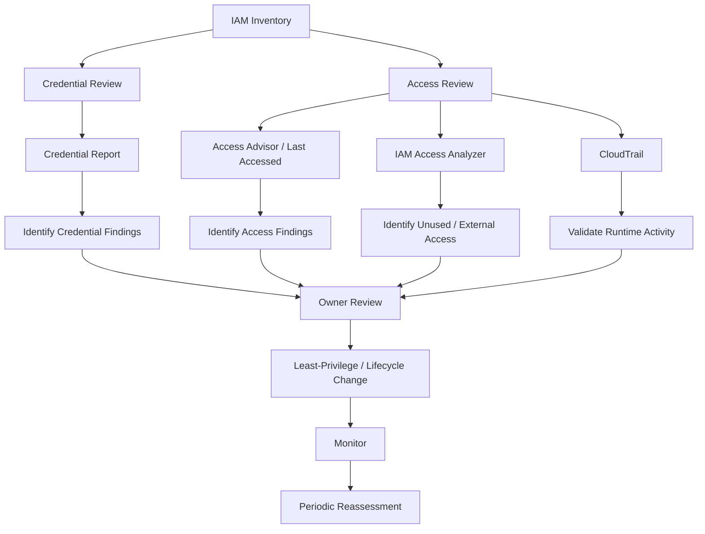
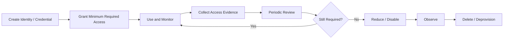
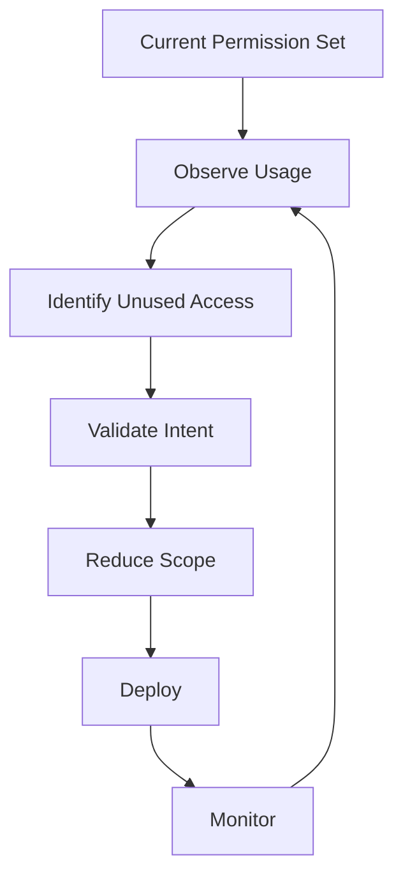
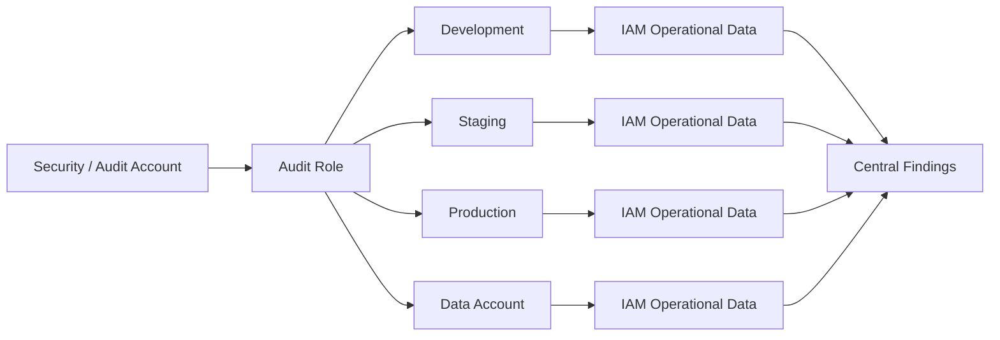
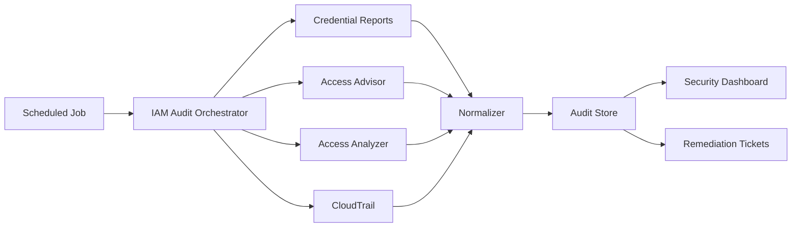

# README

## Overview

This directory contains the operational documentation for AWS IAM lifecycle management, access reviews, credential hygiene, and ongoing permission governance.

The focus is not on designing IAM policies from scratch. It is on answering operational questions such as:

```text
Which credentials exist?
Which credentials are still active?
Which identities and services are actually being used?
Which permissions appear unused?
Which credentials or permissions should be reviewed?
How can IAM access be reduced safely?
```

The primary tools covered here are:

```text
IAM Access Advisor / Last Accessed Information
IAM Credential Reports
IAM Access Analyzer
CloudTrail
IAM policy inspection and review
```

The operational model is:



---

## Navigation

| # | File | Description |
|---|---|---|
| 01 | [01- IAM Access Advisor](./01-%20IAM%20Access%20Advisor.md) | IAM last accessed information, service/action usage, least-privilege reviews, and access reduction |
| 02 | [02- IAM Credentials Report](./02-%20IAM%20Credentials%20Report.md) | IAM credential inventory, MFA state, access keys, password state, credential lifecycle, and audit workflows |

---

## Operational Scope

This directory covers the operational side of IAM:

```text
Credential inventory
    ↓
Credential lifecycle
    ↓
Access usage
    ↓
Unused access detection
    ↓
Access review
    ↓
Least-privilege refinement
    ↓
Auditability
    ↓
Continuous governance
```

It complements the other IAM sections of the playbook.

```text
01- Concepts/10- IAM/
    → IAM architecture and authorization concepts

03- CLI/03- IAM CLI/
    → IAM command-line operations

04- Operations/10- IAM/
    → IAM lifecycle, access reviews, and operational governance

05- Security/09- IAM/
    → IAM security controls and hardening

07- Troubleshooting/09- IAM/
    → IAM incident investigation and debugging
```

---

## Operational Tool Map

| Tool | Primary question | Main use |
|---|---|---|
| IAM Credential Report | What IAM credentials exist and what is their lifecycle state? | Credential audit |
| IAM Access Advisor / Last Accessed | Which services/actions have been accessed? | Permission review |
| IAM Access Analyzer | Which access is unused, external, or otherwise noteworthy? | Continuous access analysis |
| CloudTrail | What API activity actually occurred? | Runtime evidence |
| Policy Simulator | Would this authorization request be allowed under supplied conditions? | Authorization testing |
| IAM policy inspection | What permissions are configured? | Configuration review |

IAM Access Analyzer currently provides separate analysis capabilities for external/internal access, unused access, policy validation, custom policy checks, and policy generation from CloudTrail activity. ([AWS IAM Access Analyzer](https://docs.aws.amazon.com/IAM/latest/UserGuide/what-is-access-analyzer.html))

---

## Access Advisor vs Credential Report

These two documents solve different problems.

| Area | Access Advisor | Credential Report |
|---|---|---|
| Primary purpose | Access usage analysis | Credential inventory |
| IAM users | Yes | Yes |
| IAM roles | Yes | No role credential rows |
| Groups | Yes | No |
| Managed policies | Yes | No |
| MFA state | No | Yes |
| Password state | No | Yes |
| Access key lifecycle | Usage evidence | Credential metadata |
| Service usage | Yes | No |
| Action-level usage | Supported services/actions | No |
| Credential age | No | Yes |
| Last-used credential metadata | No | Yes |
| Least-privilege review | Strong | Indirect |
| Credential rotation review | Indirect | Strong |

AWS provides IAM last accessed information for users, groups, roles, and policies. ([AWS: View last accessed information for IAM](https://docs.aws.amazon.com/IAM/latest/UserGuide/access_policies_last-accessed-view-data.html))

AWS credential reports provide account-level credential state for the root user and IAM users. ([AWS: Generate credential reports](https://docs.aws.amazon.com/IAM/latest/UserGuide/id_credentials_getting-report.html))

---

## Operational Review Model

A production IAM review should combine multiple evidence sources.

```text
Credential Report
    +
Access Advisor
    +
IAM Access Analyzer
    +
CloudTrail
    +
IAM policy configuration
    +
Application / infrastructure knowledge
```

Each source answers a different question:

```text
Credential Report
    → Does the credential exist?

Access Advisor
    → Has the identity attempted to use the service/action?

Access Analyzer
    → Which access appears unused or externally exposed?

CloudTrail
    → What API requests actually occurred?

IAM Policies
    → What access is configured?

Application / IaC
    → What access is intentionally required?
```

This prevents a common operational mistake:

```text
One data source
    ↓
Automatic permission removal
```

---

## IAM Operational Lifecycle

A mature IAM operations process follows:



This lifecycle applies differently to:

```text
Human identities
Workload roles
Access keys
CI/CD identities
Emergency roles
Shared managed policies
```

---

## Human Identity Operations

Modern workforce access should generally favor:

```text
Federation
    ↓
IAM Identity Center
    ↓
Permission sets
    ↓
Temporary role sessions
```

rather than creating long-lived IAM users for every employee.

IAM users should remain only where a specific requirement justifies them.

For legacy IAM users, operations should include:

```text
MFA review
Password review
Access-key review
Owner identification
Usage review
Credential rotation
Deactivation
Deprovisioning
```

The credential report is particularly useful for identifying IAM-user credential conditions, while Access Advisor and Access Analyzer provide additional access-usage evidence.

---

## Workload Identity Operations

Production workloads should generally use temporary role credentials rather than embedded long-lived IAM access keys.

Typical patterns:

```text
EC2
    → Instance profile / IAM role

ECS
    → Task role

Lambda
    → Execution role

EKS
    → Pod/workload identity

CI/CD
    → OIDC + IAM role

Cross-account
    → AssumeRole
```

Operational review should therefore focus on:

```text
Role ownership
Trust relationships
Permission scope
Observed usage
Unused access
Cross-account relationships
Credential provider behavior
```

A credential report alone cannot provide this complete view because IAM roles are not represented as IAM-user credential rows.

---

## Credential Hygiene

The credential lifecycle should be explicit:

```text
Inventory
    ↓
Owner
    ↓
Purpose
    ↓
Usage
    ↓
Rotation
    ↓
Deactivation
    ↓
Deletion
```

For an access key:

```text
Active
    ↓
Identify owner
    ↓
Confirm workload
    ↓
Create replacement
    ↓
Deploy replacement
    ↓
Verify
    ↓
Deactivate old key
    ↓
Observe
    ↓
Delete old key
```

Avoid:

```text
Unknown owner
+
Long-lived key
+
No lifecycle owner
```

These credentials represent long-term operational risk.

---

## Access Review Workflow

A practical access review should follow:

```text
1. Identify the principal.
2. Identify the credentials or role used.
3. Inspect configured policies.
4. Review last-accessed information.
5. Review Access Analyzer findings.
6. Review CloudTrail activity when necessary.
7. Check application and infrastructure dependencies.
8. Identify rare operational and DR paths.
9. Propose the smallest safe change.
10. Deploy through change management.
11. Monitor.
12. Reassess.
```

This workflow avoids treating "unused" as an automatic synonym for "safe to remove."

---

## Least-Privilege Refinement

Least privilege should be treated as a continuous engineering process.

A useful loop is:



The evidence sources are complementary:

```text
Access Advisor
    → Historical access evidence

Access Analyzer
    → Unused-access findings and policy analysis

CloudTrail
    → Runtime activity

Source code / IaC
    → Intended application behavior
```

---

## Access Advisor Operations

IAM last accessed information can be reviewed for:

```text
Users
Groups
Roles
Policies
```

The reports show when a principal or policy-related identity last attempted to access allowed services, and action-level data is available for supported services/actions. ([AWS: View last accessed information for IAM](https://docs.aws.amazon.com/IAM/latest/UserGuide/access_policies_last-accessed-view-data.html))

Typical workflow:

```bash
aws iam generate-service-last-accessed-details \
    --arn arn:aws:iam::123456789012:role/BackendApiRole
```

Then:

```bash
aws iam get-service-last-accessed-details \
    --job-id <JOB_ID>
```

For deeper action-level analysis:

```bash
aws iam generate-service-last-accessed-details \
    --arn arn:aws:iam::123456789012:role/BackendApiRole \
    --granularity ACTION_LEVEL
```

Use this evidence to identify candidates for review, not as an automatic deletion signal.

---

## Credential Report Operations

Generate:

```bash
aws iam generate-credential-report
```

Retrieve:

```bash
aws iam get-credential-report
```

The returned report contains credential metadata such as:

```text
Password state
MFA state
Access-key state
Access-key last-use information
Credential rotation information
X.509 certificate state
```

AWS returns the report as Base64-encoded CSV and includes a `GeneratedTime` timestamp. ([AWS `GetCredentialReport`](https://docs.aws.amazon.com/IAM/latest/APIReference/API_GetCredentialReport.html))

AWS limits report generation to once every four hours, so scheduled auditing should account for report freshness and should not assume every generation call creates a new report. ([AWS: Generate credential reports](https://docs.aws.amazon.com/IAM/latest/UserGuide/id_credentials_getting-report.html))

---

## IAM Access Analyzer Operations

IAM Access Analyzer can be used for several operational use cases:

```text
External access
Internal access
Unused access
Policy validation
Custom policy checks
Policy generation
```

Unused-access analyzers can identify:

```text
Unused roles
Unused IAM user access keys
Unused IAM user passwords
Unused permissions
```

AWS supports organization-wide unused-access analysis and account-level analysis. The configured tracking period can range from 1 to 365 days. ([AWS: Create an unused access analyzer](https://docs.aws.amazon.com/IAM/latest/UserGuide/access-analyzer-create-unused.html))

For large organizations, this is especially useful because the analysis can continuously produce findings rather than requiring manual one-off reviews. ([AWS: IAM Access Analyzer findings](https://docs.aws.amazon.com/IAM/latest/UserGuide/access-analyzer-findings.html))

---

## Access Analyzer vs Access Advisor

These tools overlap but should not be treated as duplicates.

| Capability | Access Advisor | Access Analyzer |
|---|---|---|
| Historical last-accessed data | Yes | Uses last-access data for unused analysis |
| Unused roles | Indirect/manual | Yes |
| Unused permissions | Indirect/manual | Yes |
| Unused passwords | Credential report / indirect | Yes |
| Unused access keys | Credential report / indirect | Yes |
| External access analysis | No | Yes |
| Policy validation | No | Yes |
| Custom policy checks | No | Yes |
| Policy generation from CloudTrail | No | Yes |

AWS Access Analyzer's unused access analysis is specifically designed to continuously identify unused access for IAM users and roles. ([AWS: IAM Access Analyzer](https://docs.aws.amazon.com/IAM/latest/UserGuide/what-is-access-analyzer.html))

---

## CloudTrail as Operational Evidence

CloudTrail should be used when operational decisions require actual API activity.

For example:

```text
Access Advisor:
S3 accessed recently

CloudTrail:
Which API?
Which principal?
Which resource?
Success or failure?
When?
```

CLI:

```bash
aws cloudtrail lookup-events \
    --lookup-attributes \
        AttributeKey=EventName,AttributeValue=GetObject
```

For security-sensitive access reviews, CloudTrail can confirm whether a credential or principal actually performed the operation.

---

## Multi-Account IAM Operations

In a multi-account AWS organization, IAM operations should be centralized where practical.

A common model is:



Operational automation should use:

```text
Cross-account AssumeRole
+
Read-only audit permissions
+
Central reporting
```

rather than distributing administrative credentials across accounts.

For organization-wide unused access analysis, IAM Access Analyzer supports organization-level analyzers. ([AWS: Create an unused access analyzer](https://docs.aws.amazon.com/IAM/latest/UserGuide/access-analyzer-create-unused.html))

---

## Production Role Review

A production role should have an owner and a documented purpose.

Example:

```text
Role:
OrdersServiceTaskRole

Owner:
Orders Platform Team

Purpose:
AWS access required by orders-api

Primary services:
SQS
S3
Secrets Manager

Review evidence:
Access Advisor
Access Analyzer
CloudTrail

Last review:
2026-09-01
```

This creates operational traceability.

Avoid roles named only:

```text
TempRole
AppRole
ServiceRole
AdminRole
```

without documented ownership or intended usage.

---

## CI/CD IAM Operations

CI/CD identities often accumulate permissions over time.

Example:

```text
Deployment role
    ├── ECR
    ├── ECS
    ├── CloudFormation
    ├── S3
    ├── Lambda
    └── IAM
```

After architecture changes:

```text
Lambda
S3
```

may no longer be required.

Review:

```text
Access Advisor
Access Analyzer
CloudTrail
Deployment definitions
GitHub Actions
GitLab pipelines
Terraform
CloudFormation
Rollback procedures
```

CI/CD should preferably use:

```text
OIDC
+
short-lived IAM role sessions
```

instead of static access keys.

---

## Break-Glass and Emergency Access

Emergency roles need special treatment.

A role may appear unused because:

```text
It exists only for incidents.
```

Do not automatically remove such a role based on inactivity.

Instead document:

```text
Purpose
Owner
Activation procedure
MFA requirements
Approval process
Maximum session duration
CloudTrail monitoring
Periodic validation
```

Operationally:

```text
Unused
    ≠
Unnecessary
```

This is particularly important for:

```text
DR
Security incidents
Account recovery
Production outages
Regional failover
```

---

## IAM Access Reviews

A useful periodic review should cover:

### Identity

```text
IAM users
IAM roles
Groups
Permission sets
Cross-account roles
Break-glass roles
```

### Credentials

```text
Access keys
Passwords
MFA
Service-specific credentials
OIDC providers
Federated identities
```

### Permissions

```text
Managed policies
Inline policies
Resource policies
Permissions boundaries
SCPs
RCPs
Session policies
```

### Usage

```text
Access Advisor
Access Analyzer
CloudTrail
Application telemetry
IaC
```

---

## Operational Review Matrix

| Review area | Primary evidence | Supporting evidence |
|---|---|---|
| IAM user cleanup | Credential report | CloudTrail |
| Access-key cleanup | Credential report | CloudTrail |
| MFA review | Credential report | Identity Center |
| Role cleanup | Access Analyzer | Access Advisor, CloudTrail |
| Unused permission review | Access Analyzer | Access Advisor |
| Service access review | Access Advisor | CloudTrail |
| External access | Access Analyzer | Resource policies |
| Policy correctness | IAM policy inspection | Policy Simulator |
| Runtime API behavior | CloudTrail | Application logs |
| Cross-account access | Trust + permission policies | CloudTrail |
| CI/CD role review | Access Analyzer / Access Advisor | Pipeline configuration |

---

## Security Considerations

Operational IAM data is sensitive.

Reports and findings can expose:

```text
IAM usernames
Role names
Account IDs
Credential state
MFA state
Access patterns
Policy relationships
Resource access
```

Protect operational IAM data with:

```text
Least-privilege access
Encryption at rest
Access logging
Retention controls
Restricted audit roles
Secure storage
```

Do not place raw credential reports, policy inventories, or unrestricted CloudTrail exports into public repositories or broadly accessible storage.

---

## Reliability Considerations

IAM operational automation should be resilient to:

```text
API throttling
Eventual consistency
Report-generation delays
Transient AWS service failures
Cross-account access failures
Expired audit credentials
Partial account availability
```

Use:

```text
Bounded retries
Exponential backoff
Idempotent workflows
Explicit failure states
Audit timestamps
Per-account status
```

Do not let a failed account silently disappear from a central security report.

A multi-account audit should distinguish:

```text
No findings
```

from:

```text
Audit failed
```

---

## Monitoring

Operational IAM tooling should expose metrics such as:

```text
Credential report age
IAM users with active credentials
IAM users without MFA
Unused access findings
Unused roles
Unused access keys
Unused passwords
External access findings
Policy validation failures
Unresolved IAM findings
Audit job failures
Accounts not successfully scanned
```

Example organizational dashboard:

```text
Accounts scanned           48
Accounts failed              1
Active IAM users            17
Users without MFA            0
Unused roles                 6
Unused access keys           4
Unused permissions          31
External-access findings     2
Stale audit reports          1
```

The goal is not to maximize the number of findings resolved instantly.

The goal is to maintain:

```text
Controlled IAM exposure
+
Traceable ownership
+
Current access
+
Predictable remediation
```

---

## Cost Considerations

The operational tooling itself should be designed around the required review frequency.

Credential reports are account-level reports and have generation constraints.

IAM Access Analyzer unused-access analysis is billed based on the number of IAM roles and users analyzed per month per analyzer. ([AWS: Manage an unused access analyzer](https://docs.aws.amazon.com/IAM/latest/UserGuide/access-analyzer-manage-unused.html))

For organization-wide deployments:

```text
Choose analyzer scope deliberately
+
Avoid unnecessary duplicate analyzers
+
Automate finding collection
+
Measure remediation value
```

Do not create redundant analyzers in every account or Region without understanding their scope.

For unused access analysis, findings do not change based on Region, so AWS states that separate unused-access analyzers are not required for every Region. ([AWS: Create an unused access analyzer](https://docs.aws.amazon.com/IAM/latest/UserGuide/access-analyzer-create-unused.html))

---

## Disaster Recovery Considerations

IAM operations must preserve recovery access.

Review:

```text
Break-glass roles
Root-account controls
DR automation roles
Cross-account recovery roles
Backup/restore permissions
Regional failover permissions
Infrastructure recovery pipelines
```

A least-privilege cleanup that removes DR access can be more damaging than the original excess permission.

Therefore, classify roles into:

```text
Normal workload
Operational
Deployment
Security
Break-glass
Disaster recovery
```

and review each class using appropriate criteria.

---

## Auditability

Every IAM operational change should be traceable to:

```text
Who
What
Why
When
Approved by whom
What changed
What evidence supported the change
What happened after the change
```

For example:

```text
Finding:
Unused S3 permission

Evidence:
Access Analyzer + Access Advisor + CloudTrail

Decision:
Remove s3:DeleteObject

Owner:
Orders Platform

Change:
PR #4812

Validation:
Policy simulation + staging test

Deployment:
2026-09-18

Result:
No production errors
```

This turns IAM cleanup from ad-hoc administration into an engineering process.

---

## Change Management

Production IAM changes should follow the same discipline as application changes.

Preferred workflow:

```text
Finding
    ↓
Evidence
    ↓
Owner review
    ↓
Policy modification
    ↓
Code review
    ↓
Automated validation
    ↓
Staging / controlled deployment
    ↓
Production rollout
    ↓
Monitoring
```

Useful automated checks include:

```text
Policy syntax validation
Access Analyzer policy validation
Custom policy checks
Terraform plan
CloudFormation change set
Policy simulation
Account identity verification
```

---

## Recommended Automation Architecture

A centralized IAM operations service can periodically collect:

```text
Credential reports
Last accessed data
Access Analyzer findings
CloudTrail evidence
IAM inventory
```

Example:



For a Python implementation, this could be a:

```text
Celery worker
+
scheduled task
+
boto3
+
PostgreSQL
+
security dashboard
```

For AWS-native deployments, consider:

```text
EventBridge
+
Lambda
+
S3
+
Athena
+
Security Hub / ticketing integration
```

The architecture should favor idempotent collection and immutable audit evidence.

---

## Common Operational Mistakes

| Mistake | Why it happens | Better approach |
|---|---|---|
| Remove permissions directly from an audit result | Over-trusting one signal | Validate with CloudTrail and application ownership |
| Treat unused as unnecessary | Rare operational paths exist | Review DR, scheduled jobs, and break-glass paths |
| Audit only IAM users | Modern workloads use roles | Review roles and workload identities |
| Ignore CI/CD | Deployment roles are frequently over-privileged | Review pipeline permissions separately |
| Ignore `iam:PassRole` | It is easy to overlook | Review role-passing workflows explicitly |
| Disable keys without identifying ownership | Key names are often insufficient | Map keys to applications and owners |
| Delete instead of deactivate | No safe rollback | Deactivate first when appropriate |
| Treat failed audit as no findings | Collection errors are hidden | Track audit status separately |
| Store raw reports insecurely | Audit data feels non-secret | Treat as sensitive security data |
| Create duplicate analyzers | Organizational scope is misunderstood | Design analyzer scope deliberately |
| Remove DR permissions | Inactivity looks like irrelevance | Preserve recovery paths |
| Use permanent admin access for auditing | Convenience | Dedicated least-privilege audit role |

---

## Operational Interview Topics

This directory supports common senior-level IAM operations questions:

### Access Reviews

- How do you determine whether an IAM role is still needed?
- How do you identify unused permissions?
- How do you distinguish unused from unnecessary access?
- How do you perform IAM access reviews across multiple AWS accounts?

### Credential Governance

- What does the IAM credential report contain?
- How do you identify stale access keys?
- How would you rotate an access key without downtime?
- How do you migrate a workload away from static credentials?

### Access Advisor

- What does last accessed information tell you?
- What are its limitations?
- How does Access Advisor differ from CloudTrail?
- Can last accessed information prove that a permission is safe to remove?

### Access Analyzer

- What is an unused access analyzer?
- How does it complement Access Advisor?
- How would you operationalize unused-access findings?
- How would you handle findings for emergency roles?

### Production IAM Governance

- How would you audit IAM across 50 AWS accounts?
- How would you centralize findings?
- How would you build an IAM cleanup pipeline without causing outages?
- How would you prove that a permission-removal change was safe?

---

## Senior-Level Operational Model

A senior IAM engineer should think in terms of:

```text
Identity
    ↓
Credential
    ↓
Permission
    ↓
Usage
    ↓
Evidence
    ↓
Ownership
    ↓
Change
    ↓
Verification
```

The key distinction is:

```text
Configured access
    ≠
Effective access
    ≠
Observed access
    ≠
Required access
```

For example:

```text
Configured:
s3:*

Effective:
limited by boundary / SCP / resource policy

Observed:
s3:GetObject

Required:
s3:GetObject + s3:PutObject

```

Each layer answers a different question.

Good IAM operations reconcile all four before making production changes.

---

## Recommended IAM Operations Cadence

The exact cadence should match the environment, but a useful operating model is:

| Activity | Typical trigger |
|---|---|
| Credential report | Scheduled audit |
| MFA review | Scheduled security review |
| Access-key review | Scheduled + lifecycle events |
| Last-access review | Periodic access review |
| Unused-access analyzer | Continuous |
| External-access findings | Continuous |
| High-privilege role review | Frequent / change-driven |
| CI/CD role review | Architecture or pipeline changes |
| Break-glass role review | Periodic validation |
| DR permission validation | DR exercises |
| Cross-account trust review | Architecture/account changes |

The important principle is:

```text
Continuous monitoring
+
Periodic review
+
Change-driven review
```

rather than relying on one annual IAM audit.

---

## Quick Reference

### Credential Report

```bash
aws iam generate-credential-report

aws iam get-credential-report
```

### Access Advisor

```bash
aws iam generate-service-last-accessed-details \
    --arn <IAM_RESOURCE_ARN>

aws iam get-service-last-accessed-details \
    --job-id <JOB_ID>
```

### IAM Access Analyzer

```bash
aws accessanalyzer list-analyzers

aws accessanalyzer list-findings-v2
```

### Caller Identity

```bash
aws sts get-caller-identity
```

### IAM Access Keys

```bash
aws iam list-access-keys \
    --user-name <USER>

aws iam get-access-key-last-used \
    --access-key-id <ACCESS_KEY_ID>
```

### CloudTrail

```bash
aws cloudtrail lookup-events \
    --lookup-attributes \
        AttributeKey=EventName,AttributeValue=<EVENT_NAME>
```

---

## Related Documentation

### IAM Concepts

See:

```text
01- Concepts/10- IAM/
```

for:

```text
IAM users
IAM roles
IAM policies
STS
Trust policies
Cross-account access
Workload identity
Advanced authorization
```

### IAM Security

See:

```text
05- Security/09- IAM/
```

for:

```text
MFA
Root account security
Least privilege
Credential management
Access Analyzer
Privilege escalation
```

### IAM Troubleshooting

See:

```text
07- Troubleshooting/09- IAM/
```

for:

```text
AccessDenied
Authentication failures
AssumeRole failures
CLI profile issues
Diagnostic tooling
Entity/resource errors
```

### IAM CLI

See:

```text
03- CLI/03- IAM CLI/
```

for:

```text
Identity inspection
Role management
Policy inspection
STS operations
Credential management
CLI filtering
```

---

## AWS Documentation Links

- [IAM Last Accessed Information](https://docs.aws.amazon.com/IAM/latest/UserGuide/access_policies_last-accessed.html)
- [View Last Accessed Information for IAM](https://docs.aws.amazon.com/IAM/latest/UserGuide/access_policies_last-accessed-view-data.html)
- [Review Last Accessed Information](https://docs.aws.amazon.com/IAM/latest/UserGuide/getting-started-reduce-permissions-last-accessed.html)
- [IAM Credential Reports](https://docs.aws.amazon.com/IAM/latest/UserGuide/id_credentials_getting-report.html)
- [AWS `GetCredentialReport` API](https://docs.aws.amazon.com/IAM/latest/APIReference/API_GetCredentialReport.html)
- [IAM Access Analyzer](https://docs.aws.amazon.com/IAM/latest/UserGuide/what-is-access-analyzer.html)
- [Create an Unused Access Analyzer](https://docs.aws.amazon.com/IAM/latest/UserGuide/access-analyzer-create-unused.html)
- [Manage an Unused Access Analyzer](https://docs.aws.amazon.com/IAM/latest/UserGuide/access-analyzer-manage-unused.html)
- [Review Access Analyzer Findings](https://docs.aws.amazon.com/IAM/latest/UserGuide/access-analyzer-findings-view.html)
- [IAM Access Analyzer Findings](https://docs.aws.amazon.com/IAM/latest/UserGuide/access-analyzer-findings.html)
- [IAM Access Analyzer Pricing](https://aws.amazon.com/iam/access-analyzer/pricing/)
- [AWS CloudTrail](https://docs.aws.amazon.com/awscloudtrail/latest/userguide/cloudtrail-user-guide.html)
- [IAM Security Best Practices](https://docs.aws.amazon.com/IAM/latest/UserGuide/best-practices.html)

## Key Takeaways

- **IAM operations require multiple evidence sources:** combine credential reports, last-accessed information, Access Analyzer, CloudTrail, policy configuration, and application ownership rather than relying on a single signal.
- **Credential governance and access governance are different:** credential reports manage password, MFA, access-key, and certificate lifecycle, while Access Advisor and Access Analyzer focus on access usage and unused permissions.
- **Treat unused access as a review signal, not an automatic deletion instruction:** validate scheduled jobs, CI/CD, disaster recovery, break-glass workflows, and rare operational paths before reducing production access.
- **Prefer continuous and centralized governance:** use workload identity, short-lived credentials, organization-level access analysis where appropriate, centralized findings, and scheduled reviews across AWS accounts.
- **Make IAM changes auditable and reversible:** every production access change should have an owner, evidence, controlled deployment, monitoring, and a clear remediation or rollback path.