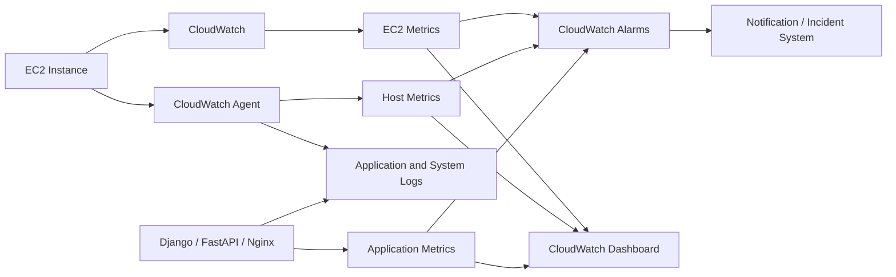
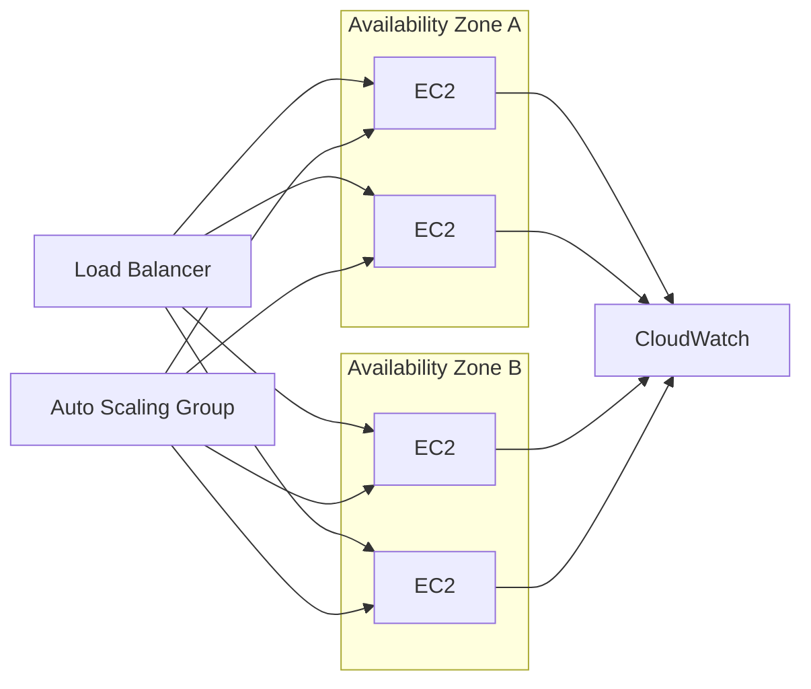

# 01- EC2 Monitoring and Observability

## Overview

EC2 monitoring and observability provide the signals required to determine whether an instance, its underlying infrastructure, and the application running on it are behaving as expected.

EC2 publishes standard metrics to Amazon CloudWatch automatically. Basic monitoring provides most instance metrics at 5-minute periods, while detailed monitoring can provide 1-minute periods. EC2 status-check metrics are available at 1-minute frequency. :contentReference[oaicite:0]{index=0}

For production systems, infrastructure metrics alone are not sufficient. A useful observability model correlates:

```text
Infrastructure
    |
    +-- EC2 state
    +-- Status checks
    +-- CPU
    +-- Network
    +-- EBS performance
    |
    v
Operating System
    |
    +-- Memory
    +-- Filesystem
    +-- Processes
    +-- Load
    |
    v
Application
    |
    +-- Request rate
    +-- Latency
    +-- Errors
    +-- Dependency health
    |
    v
Service
    |
    +-- Availability
    +-- SLOs
    +-- User impact
```

The core principle is:

> Monitor infrastructure to detect resource problems, and observe the application to understand their impact.

## Monitoring vs Observability

Monitoring and observability overlap but solve different problems.

| Concern | Monitoring | Observability |
|---|---|---|
| Primary purpose | Detect known failure conditions | Understand unknown or complex failures |
| Typical data | Metrics and alarms | Metrics, logs, traces, events |
| Example | CPU > 80% | Why API latency increased |
| Focus | Known signals | System behavior and relationships |
| Typical action | Alert | Investigate and correlate |

A production EC2 environment should use both.

## EC2 Monitoring Architecture

A typical backend architecture can use CloudWatch for infrastructure signals and application instrumentation for service-level telemetry.



AWS provides standard EC2 metrics through the `AWS/EC2` namespace. The CloudWatch agent can extend monitoring with in-guest system metrics, logs, and additional application telemetry. :contentReference[oaicite:1]{index=1}

## EC2 Standard Metrics

EC2 publishes several categories of metrics.

| Category | Examples | Primary use |
|---|---|---|
| CPU | `CPUUtilization` | Compute pressure |
| Network | `NetworkIn`, `NetworkOut` | Traffic and throughput |
| Network packets | `NetworkPacketsIn`, `NetworkPacketsOut` | Packet-level behavior |
| Disk | `DiskReadOps`, `DiskWriteOps` | Instance storage activity where applicable |
| EBS | `EBSReadOps`, `EBSWriteOps`, bytes | EBS I/O |
| Status | `StatusCheckFailed` | Overall status |
| Instance status | `StatusCheckFailed_Instance` | Instance-level health |
| System status | `StatusCheckFailed_System` | Underlying infrastructure |
| EBS status | `StatusCheckFailed_AttachedEBS` | Attached EBS health |
| CPU credits | `CPUCreditBalance` | Burstable instances |
| CPU credit usage | `CPUCreditUsage` | Burstable instance behavior |

The exact metrics available can vary by instance type and configuration. :contentReference[oaicite:2]{index=2}

## Basic vs Detailed Monitoring

EC2 supports basic and detailed monitoring.

### Basic Monitoring

Basic monitoring is enabled by default.

Most EC2 instance metrics are available in 5-minute periods, while status-check metrics are available at 1-minute frequency. :contentReference[oaicite:3]{index=3}

### Detailed Monitoring

Detailed monitoring provides instance metrics at 1-minute periods.

Enable it for an existing instance:

```bash
aws ec2 monitor-instances \
    --profile production \
    --region ap-south-1 \
    --instance-ids i-0123456789abcdef0
```

Disable it:

```bash
aws ec2 unmonitor-instances \
    --profile production \
    --region ap-south-1 \
    --instance-ids i-0123456789abcdef0
```

It can also be enabled at launch:

```bash
aws ec2 run-instances \
    --image-id ami-0123456789abcdef0 \
    --instance-type t3.medium \
    --monitoring Enabled=true
```

Detailed monitoring has additional CloudWatch metric charges, so it should be enabled according to operational requirements rather than indiscriminately. :contentReference[oaicite:4]{index=4}

## Choosing Monitoring Granularity

Use higher-frequency monitoring when faster detection materially affects recovery.

| Workload | Typical approach |
|---|---|
| Development | Basic monitoring |
| Batch workloads | Basic unless faster detection matters |
| Production APIs | Detailed monitoring often useful |
| Latency-sensitive services | Detailed monitoring plus application metrics |
| Critical infrastructure | Detailed monitoring and service-level telemetry |
| Short-lived workloads | Evaluate whether additional monitoring cost is justified |

Monitoring frequency should be driven by operational requirements and recovery objectives.

## CPU Monitoring

`CPUUtilization` measures CPU usage for the EC2 instance.

Inspect it using CloudWatch:

```bash
aws cloudwatch get-metric-statistics \
    --profile production \
    --region ap-south-1 \
    --namespace AWS/EC2 \
    --metric-name CPUUtilization \
    --dimensions Name=InstanceId,Value=i-0123456789abcdef0 \
    --statistics Average Maximum \
    --period 300 \
    --start-time "2026-09-20T18:00:00Z" \
    --end-time "2026-09-20T19:00:00Z" \
    --output json
```

For production automation, generate timestamps dynamically instead of hard-coding them.

High CPU can result from:

- Increased request traffic
- Expensive API endpoints
- CPU-intensive serialization
- Python worker saturation
- Celery workloads
- Database contention
- Retry storms
- Infinite loops
- Background processing
- Incorrect application configuration

CPU should therefore be correlated with request rate, latency, error rate, and application behavior.

## CPU Credits for Burstable Instances

Burstable instance families can expose CPU credit metrics.

Relevant metrics include:

- `CPUCreditBalance`
- `CPUCreditUsage`
- `CPUSurplusCreditBalance`
- `CPUSurplusCreditsCharged`

Inspect available EC2 CPU metrics:

```bash
aws cloudwatch list-metrics \
    --profile production \
    --region ap-south-1 \
    --namespace AWS/EC2 \
    --dimensions Name=InstanceId,Value=i-0123456789abcdef0 \
    --output table
```

A common operational mistake is interpreting high CPU as proof that the instance needs a larger instance type.

For burstable instances, also inspect CPU credit behavior.

## Network Monitoring

Important network metrics include:

- `NetworkIn`
- `NetworkOut`
- `NetworkPacketsIn`
- `NetworkPacketsOut`

Use them to identify:

- Unexpected traffic spikes
- Traffic drops
- Capacity pressure
- Asymmetric behavior
- Network-intensive workloads
- Potential anomalies

For example:

```bash
aws cloudwatch get-metric-statistics \
    --profile production \
    --region ap-south-1 \
    --namespace AWS/EC2 \
    --metric-name NetworkIn \
    --dimensions Name=InstanceId,Value=i-0123456789abcdef0 \
    --statistics Sum \
    --period 300 \
    --start-time "2026-09-20T18:00:00Z" \
    --end-time "2026-09-20T19:00:00Z" \
    --output json
```

Network metrics do not explain the complete network path. For connectivity problems, correlate them with:

- ENI configuration
- Security Groups
- NACLs
- Route tables
- Load balancer metrics
- Application logs

## EBS Monitoring

EBS provides CloudWatch metrics for attached volumes. EBS volume metrics are available automatically at 1-minute periods at no additional charge. :contentReference[oaicite:5]{index=5}

Important metrics include:

- `VolumeReadOps`
- `VolumeWriteOps`
- `VolumeReadBytes`
- `VolumeWriteBytes`
- `VolumeIdleTime`
- `VolumeQueueLength`
- `VolumeThroughputPercentage`
- `VolumeConsumedReadWriteOps`
- `VolumeAvgIOPS`
- `VolumeAvgThroughput`

Available metrics vary according to volume type and instance architecture.

Inspect EBS metrics:

```bash
aws cloudwatch list-metrics \
    --profile production \
    --region ap-south-1 \
    --namespace AWS/EBS \
    --dimensions Name=VolumeId,Value=vol-0123456789abcdef0 \
    --output table
```

## EBS IOPS and Throughput

Storage performance should be considered across multiple layers:

```text
Application
    |
    v
Filesystem
    |
    v
Block Device
    |
    v
EBS Volume
    |
    v
EC2 Instance EBS Limits
```

A volume may support a particular IOPS or throughput configuration while the EC2 instance itself imposes additional limits.

For Nitro-based instances, EC2 also provides metrics such as:

- `InstanceEBSIOPSExceededCheck`
- `InstanceEBSThroughputExceededCheck`

These indicate when an application attempted to exceed the instance's EBS performance limits. :contentReference[oaicite:6]{index=6}

## Disk Space vs EBS Capacity

EBS monitoring does not automatically provide filesystem free-space information inside the guest OS.

For example:

```text
EBS volume:
100 GiB

Filesystem:
95 GiB used

Application:
No remaining writable space
```

The EBS service knows the volume capacity, but filesystem utilization is an in-guest operating-system metric.

This distinction is critical for production monitoring.

## CloudWatch Agent

The CloudWatch agent extends EC2 observability beyond standard AWS-provided metrics.

It can collect:

- Memory utilization
- Swap utilization
- Filesystem utilization
- Disk metrics
- Process metrics
- System metrics
- Application logs
- Custom metrics
- Additional telemetry

AWS documents the CloudWatch agent as a mechanism for collecting metrics, logs, and traces from EC2 and other environments. :contentReference[oaicite:7]{index=7}

A common architecture is:

```text
EC2
 |
 +-- AWS/Vended Metrics
 |       |
 |       v
 |   CloudWatch
 |
 +-- CloudWatch Agent
         |
         +-- Memory
         +-- Filesystem
         +-- Process
         +-- Logs
         +-- Additional Metrics
```

## Why Memory Monitoring Requires Additional Telemetry

EC2's standard instance metrics do not provide the same in-guest visibility as an operating-system monitoring agent.

For example, an EC2 instance may show:

```text
CPUUtilization = 35%
```

while the operating system is experiencing:

```text
Memory pressure
Swap activity
OOM kills
```

The CPU metric alone cannot identify this.

For backend workloads such as Django, FastAPI, Gunicorn, Celery, and Nginx, memory visibility is often essential.

## CloudWatch Agent Configuration

A simplified Linux CloudWatch agent configuration might look like:

```json
{
  "metrics": {
    "metrics_collected": {
      "mem": {
        "measurement": [
          "mem_used_percent",
          "mem_available_percent"
        ],
        "metrics_collection_interval": 60
      },
      "disk": {
        "measurement": [
          "used_percent"
        ],
        "resources": [
          "*"
        ],
        "metrics_collection_interval": 60
      }
    }
  }
}
```

The configuration should be adapted to the workload and managed consistently through infrastructure automation.

Avoid manually configuring hundreds of production instances independently.

## CloudWatch Agent Deployment

A production architecture should normally manage the CloudWatch agent through:

- AMIs
- User Data
- Systems Manager
- Configuration management
- Launch Templates
- Infrastructure as Code

For example:

```text
Golden AMI / Launch Template
          |
          v
EC2 Instance
          |
          +-- CloudWatch Agent
          |
          +-- Application
          |
          +-- SSM Agent
```

The CloudWatch agent can also be managed through Systems Manager to avoid manually connecting to individual instances. AWS provides an EC2 health solution that combines CloudWatch Agent collection with dashboards for supported EC2 fleets. :contentReference[oaicite:8]{index=8}

## Filesystem Monitoring

For backend servers, monitor filesystem utilization for important mount points:

```text
/
├── /var
├── /var/log
├── /var/lib
├── /tmp
└── application data mount
```

A filesystem can become unavailable even when the underlying EBS volume is healthy.

Monitor:

- Used percentage
- Available bytes
- Inodes
- Growth rate

For example, an alert on:

```text
DiskUsedPercent > 80%
```

may be useful as a warning, while:

```text
DiskUsedPercent > 90%
```

may require urgent action.

Thresholds should be workload-specific rather than treated as universal AWS defaults.

## Process Monitoring

For application servers, process-level metrics can help explain resource consumption.

Examples:

```text
gunicorn
uvicorn
nginx
celery
python
postgres client processes
```

Useful signals include:

- CPU per process
- Memory RSS
- Process count
- Process restarts
- File descriptor usage

This is particularly useful when total EC2 CPU is high but the responsible workload is unknown.

## Status Check Monitoring

EC2 provides several status-check categories.

AWS currently documents:

- System status checks
- Instance status checks
- Attached EBS status checks
- Application status checks as an opt-in capability :contentReference[oaicite:9]{index=9}

The corresponding CloudWatch metrics include:

```text
StatusCheckFailed
StatusCheckFailed_Instance
StatusCheckFailed_System
StatusCheckFailed_AttachedEBS
```

These metrics can be used to create CloudWatch alarms. :contentReference[oaicite:10]{index=10}

## Status Checks vs Application Health

Consider a FastAPI service:

```text
EC2 Instance
    |
    +-- System status: OK
    +-- Instance status: OK
    |
    v
Nginx
    |
    v
FastAPI
    |
    +-- Database unavailable
```

EC2 may report the instance as healthy while the application returns HTTP `503`.

Therefore:

```text
EC2 Health
    !=
Application Health
```

Both signals should be monitored.

## Application-Level Monitoring

For Django or FastAPI applications, monitor service-level indicators such as:

| Signal | Example |
|---|---|
| Request rate | Requests/sec |
| Latency | p50, p95, p99 |
| Errors | HTTP 5xx rate |
| Saturation | Worker utilization |
| Dependency latency | PostgreSQL/Redis latency |
| Queue depth | Celery backlog |
| Database connections | Active/available connections |
| Application restarts | Process restart rate |

A useful service model is:

```text
Traffic
   |
   v
Requests
   |
   +--> Rate
   +--> Latency
   +--> Errors
   |
   v
Application
   |
   +--> CPU
   +--> Memory
   +--> Workers
   |
   v
Dependencies
   |
   +--> PostgreSQL
   +--> Redis
   +--> Kafka
```

## Nginx and Application Correlation

For an EC2-hosted API:

```text
Client
  |
  v
ALB
  |
  v
Nginx
  |
  v
Gunicorn / Uvicorn
  |
  v
Django / FastAPI
  |
  +--> PostgreSQL
  +--> Redis
  +--> Celery
```

If latency increases, EC2 CPU alone cannot identify the cause.

Correlate:

- ALB request count
- ALB target response time
- EC2 CPU
- EC2 network
- Memory
- Nginx access logs
- Application latency
- PostgreSQL latency
- Redis latency
- Celery queue depth

This is where observability becomes more valuable than isolated metric monitoring.

## CloudWatch Logs

The CloudWatch agent can collect logs from EC2 instances. :contentReference[oaicite:11]{index=11}

Common log sources include:

```text
/var/log/messages
/var/log/syslog
/var/log/nginx/access.log
/var/log/nginx/error.log
application logs
Celery logs
systemd service logs
```

A production logging strategy should define:

- Log groups
- Retention periods
- Structured log format
- Access controls
- Sensitive-data handling
- Application correlation IDs
- Log volume controls

## Structured Application Logs

Prefer structured logs over arbitrary text.

Example:

```json
{
  "timestamp": "2026-09-20T18:30:10Z",
  "level": "ERROR",
  "service": "payments-api",
  "request_id": "req-12345",
  "path": "/api/payments",
  "status": 500,
  "latency_ms": 842,
  "error": "database_timeout"
}
```

This makes CloudWatch Logs Insights and downstream analysis substantially more useful.

## CloudWatch Logs Insights

Example query:

```text
fields @timestamp, service, status, latency_ms, path
| filter status >= 500
| stats count() as errors,
        avg(latency_ms) as avg_latency
    by path
| sort errors desc
```

For production APIs, structured logs make it possible to correlate:

```text
request ID
    ->
application log
    ->
dependency call
    ->
error
```

## CloudWatch Alarms

An alarm evaluates a metric against configured conditions and can trigger actions.

A basic CPU alarm:

```bash
aws cloudwatch put-metric-alarm \
    --profile production \
    --region ap-south-1 \
    --alarm-name "payments-api-high-cpu" \
    --namespace AWS/EC2 \
    --metric-name CPUUtilization \
    --dimensions Name=InstanceId,Value=i-0123456789abcdef0 \
    --statistic Average \
    --period 300 \
    --evaluation-periods 3 \
    --threshold 80 \
    --comparison-operator GreaterThanThreshold \
    --alarm-actions "$SNS_TOPIC_ARN"
```

The correct threshold depends on the workload.

A CPU alarm should not automatically be treated as an incident without context.

## Alarm Design

Good alarms detect actionable conditions.

Poor alarm:

```text
CPU > 70%
```

with no context or sustained duration.

Better:

```text
CPU > 80%
for 3 consecutive periods
```

combined with:

- Request rate
- Error rate
- Latency
- ASG capacity

For example:

```text
High CPU
+
High request rate
+
Normal error rate
=
Likely traffic-driven scaling event
```

versus:

```text
High CPU
+
Low request rate
+
High error rate
=
Potential application problem
```

Metric correlation reduces false positives.

## Alarm Types

Useful EC2 alarm categories include:

| Alarm | Purpose |
|---|---|
| High CPU | Detect sustained compute pressure |
| Status check failure | Detect infrastructure or instance impairment |
| Low CPU | Identify unexpectedly idle resources where appropriate |
| EBS performance | Detect storage pressure |
| Network anomaly | Detect unusual traffic |
| Memory | Detect host memory pressure through agent metrics |
| Filesystem | Detect disk exhaustion |
| Application error rate | Detect service failures |
| Application latency | Detect degraded performance |

Do not create alarms merely because a metric exists.

Every production alarm should have a clear operational response.

## Status Check Alarm

Example:

```bash
aws cloudwatch put-metric-alarm \
    --profile production \
    --region ap-south-1 \
    --alarm-name "payments-api-status-check-failed" \
    --namespace AWS/EC2 \
    --metric-name StatusCheckFailed \
    --dimensions Name=InstanceId,Value=i-0123456789abcdef0 \
    --statistic Maximum \
    --period 60 \
    --evaluation-periods 2 \
    --threshold 0 \
    --comparison-operator GreaterThanThreshold \
    --alarm-actions "$SNS_TOPIC_ARN"
```

Status-check alarms can be useful for automated recovery or operational escalation. AWS also documents automatic instance recovery using CloudWatch alarms for certain impaired instances. :contentReference[oaicite:12]{index=12}

## Automatic Recovery

For suitable workloads, CloudWatch alarms can be configured to recover an impaired EC2 instance.

The important distinction is:

```text
Detect impairment
       |
       v
Alarm
       |
       v
Recovery action
       |
       v
Verify instance
       |
       v
Verify application
```

Automatic recovery should be used only when:

- The workload supports it.
- The failure mode is appropriate.
- Recovery does not hide a recurring configuration defect.
- The application has independent health monitoring.

Automatic recovery is not a replacement for application observability.

## Dashboards

A production EC2 dashboard should answer operational questions quickly.

A useful dashboard layout is:

```text
+---------------------------------------------------+
| Service Health                                    |
| Request Rate | Error Rate | p95 | Availability    |
+---------------------------------------------------+
| EC2                                               |
| CPU | Memory | Status | Network                   |
+---------------------------------------------------+
| Storage                                           |
| EBS IOPS | Throughput | Queue | Disk Usage       |
+---------------------------------------------------+
| Load Balancer                                     |
| Requests | Target Health | Response Time         |
+---------------------------------------------------+
| Capacity                                          |
| ASG Desired | In Service | Pending | Scaling     |
+---------------------------------------------------+
```

Dashboards should be service-oriented rather than simply containing every available metric.

## Monitoring Auto Scaling Groups

For ASG-managed applications, monitor both instance health and capacity.

Important dimensions include:

- Desired capacity
- Minimum capacity
- Maximum capacity
- In-service instances
- Pending instances
- Terminating instances
- Scaling activities
- Target tracking metrics
- Instance refresh status

A useful capacity relationship is:

```text
Desired Capacity
       |
       v
Healthy In-Service Instances
       |
       v
Load Balancer Healthy Targets
       |
       v
Application Capacity
```

If desired capacity is 10 but only 6 targets are healthy, the service may already be degraded.

## Monitoring Load Balancers

For EC2-backed APIs, load balancer metrics should complement instance metrics.

Monitor:

- Request count
- Target response time
- HTTP 4xx
- HTTP 5xx
- Healthy target count
- Unhealthy target count
- Rejected connections where applicable

This allows correlation such as:

```text
ALB 5xx increases
       |
       +--> EC2 CPU normal
       |
       +--> Target health degraded
       |
       v
Application / deployment investigation
```

rather than immediately resizing EC2.

## Monitoring EBS and Filesystem Together

A useful storage dashboard correlates:

```text
EBS IOPS
EBS Throughput
EBS Queue
Filesystem Usage
Application I/O Latency
```

Example failure pattern:

```text
Filesystem usage: 92%
EBS IOPS: normal
Application errors: increasing
```

This suggests a capacity problem rather than EBS performance saturation.

Another pattern:

```text
Filesystem usage: 45%
EBS throughput: saturated
Application latency: increasing
```

This suggests a storage-performance problem rather than insufficient filesystem capacity.

## Monitoring Burstable Instances

For burstable workloads, monitor:

```text
CPUUtilization
CPUCreditBalance
CPUCreditUsage
```

Example:

```text
CPU = 70%
CPU Credits = rapidly decreasing
Latency = increasing
```

The correct response may involve instance sizing or workload behavior rather than simply adding more application workers.

## Monitoring Network Saturation

Network metrics should be interpreted alongside workload characteristics.

Monitor:

```text
NetworkIn
NetworkOut
NetworkPacketsIn
NetworkPacketsOut
```

For a high-throughput service, also consider:

- Instance networking limits
- Load balancer throughput
- EBS throughput
- Application serialization
- Connection counts
- Downstream service capacity

High network traffic is not inherently a problem.

The operational question is whether the observed traffic exceeds the workload's expected capacity or correlates with degradation.

## Monitoring Logs, Metrics, and Traces Together

A robust observability model uses three primary telemetry types:

```text
             Observability
                  |
       +----------+----------+
       |          |          |
     Metrics     Logs      Traces
       |          |          |
    "What?"     "Why?"    "Where?"
```

Examples:

### Metrics

```text
p95 latency = 850 ms
```

### Logs

```text
database timeout after 5000 ms
```

### Trace

```text
HTTP request
  -> Django
      -> PostgreSQL
          -> slow query
```

CloudWatch supports metrics, logs, and trace collection through AWS services and the CloudWatch agent. :contentReference[oaicite:13]{index=13}

## Correlation IDs

For distributed backend systems, propagate a request or correlation ID.

Example:

```text
Client
  |
  | X-Request-ID: req-123
  v
Nginx
  |
  v
Django / FastAPI
  |
  +--> PostgreSQL
  |
  +--> Redis
  |
  +--> Kafka
```

The same identifier can appear in:

- ALB logs
- Nginx logs
- Application logs
- Background worker logs
- Trace attributes

This makes cross-service investigation significantly easier.

## Monitoring Celery Workers

For a Django/FastAPI system using Celery:

```text
API
 |
 v
Redis / SQS
 |
 v
Celery Workers
 |
 +--> PostgreSQL
 +--> External APIs
```

EC2 monitoring should not stop at worker CPU.

Monitor:

- Worker process count
- Queue depth
- Task latency
- Task failure rate
- Retry rate
- Worker memory
- Worker CPU
- Task execution duration

A CPU alarm without queue-depth context can produce misleading conclusions.

## Monitoring Kafka-Based Workloads

For Kafka consumers on EC2, correlate:

```text
Consumer CPU
Consumer memory
Network throughput
Consumer lag
Broker health
Application errors
```

A consumer with normal CPU can still be failing to keep up because of:

- Slow downstream APIs
- Database latency
- Consumer configuration
- Partition imbalance
- Processing bottlenecks

Infrastructure monitoring must be correlated with application-level throughput.

## Monitoring PostgreSQL-Dependent Applications

For applications using PostgreSQL:

```text
EC2
 |
 v
Django / FastAPI
 |
 v
Connection Pool
 |
 v
PostgreSQL
```

Useful application signals include:

- Query latency
- Connection pool saturation
- Query errors
- Transaction duration
- Database connection count

If application latency increases while EC2 CPU remains low, investigate the database path before resizing the EC2 instance.

## Monitoring Strategy for Production EC2

A practical production monitoring stack can be divided into layers.

| Layer | Key signals |
|---|---|
| EC2 | State, status checks, CPU, network |
| EBS | IOPS, throughput, queue, performance limits |
| OS | Memory, filesystem, processes |
| ALB/NLB | Requests, latency, target health, errors |
| Application | Rate, latency, errors, saturation |
| Dependencies | PostgreSQL, Redis, Kafka, external APIs |
| Capacity | ASG desired/in-service/pending |
| Logs | Application, Nginx, OS, deployment |
| Traces | Cross-service request flow |

This layered model prevents infrastructure metrics from becoming a substitute for service observability.

## Monitoring and High Availability

Monitoring should support the availability architecture.

For an ASG-backed service:



Monitoring should detect:

- Loss of an instance
- Loss of an Availability Zone's capacity
- Reduced healthy target count
- Scaling failures
- Repeated replacement
- Application degradation

## Monitoring and Incident Response

A good alarm should lead to a clear investigation path.

Example:

```text
ALARM: payments-api high error rate
                |
                v
Check ALB target health
                |
                v
Check EC2 status
                |
                v
Check CPU / memory / disk
                |
                v
Check application logs
                |
                v
Check PostgreSQL / Redis
                |
                v
Check recent deployment
```

Monitoring without a corresponding operational response creates alert noise rather than reliability.

## Alert Fatigue

Avoid alerting on every abnormal metric.

An alert should generally be:

- Actionable
- Specific
- Associated with service impact or risk
- Appropriately persistent
- Routed to an owner
- Documented with a response procedure

Prefer:

```text
ALB healthy targets < required capacity
```

over dozens of independent low-value alerts that operators cannot correlate.

## Thresholds vs Baselines

Static thresholds are useful but incomplete.

For example:

```text
CPU > 80%
```

may be normal for a compute-intensive worker.

Conversely:

```text
CPU = 40%
```

may be abnormal if the service normally operates at 5% and traffic suddenly stopped.

Use both:

- Absolute thresholds
- Historical baselines
- Rate-of-change signals
- Service-level objectives

The correct alert depends on workload behavior.

## Monitoring During Deployments

Deployment observability should cover the deployment lifecycle:

```text
Deployment Start
      |
      v
New Instances
      |
      v
EC2 Health
      |
      v
Target Registration
      |
      v
Target Health
      |
      v
Application Errors
      |
      v
Latency
      |
      v
Capacity
```

For ASG instance refreshes, watch:

- Refresh status
- Replacement rate
- Healthy target count
- Error rate
- Latency
- Instance status
- Application startup failures

A deployment should not be considered healthy merely because EC2 instances reached `running`.

## Monitoring Cost

Monitoring has an operational cost.

Consider:

- Detailed EC2 monitoring
- CloudWatch custom metrics
- High-cardinality dimensions
- Log ingestion
- Log retention
- Dashboards
- Metric alarms
- Agent collection frequency

AWS notes that detailed EC2 monitoring incurs charges for EC2 metrics sent to CloudWatch. :contentReference[oaicite:14]{index=14}

A practical strategy is to monitor critical production workloads more aggressively while avoiding unnecessary high-frequency telemetry for low-value resources.

## Security Considerations

Monitoring data can contain sensitive infrastructure information.

Potentially sensitive data includes:

- Private IP addresses
- Hostnames
- Request paths
- User identifiers
- Authentication metadata
- Database errors
- Internal service names
- Deployment information

Production controls should include:

- Least-privilege CloudWatch access
- Restricted dashboard access
- Appropriate log-group permissions
- Log retention policies
- Sensitive-data redaction
- No secrets in application logs
- Encryption where required
- CloudTrail auditing for infrastructure changes

Never log:

```text
AWS access keys
Database passwords
JWT secrets
API tokens
Private keys
Session credentials
```

## Scalability Considerations

Monitoring architecture should scale with the EC2 fleet.

Avoid manually creating dashboards and agents for each instance.

Prefer:

- Launch Templates
- Auto Scaling
- Systems Manager
- Infrastructure as Code
- Consistent tags
- Standardized CloudWatch dashboards
- Standardized alarms
- Automated agent configuration

A scalable model is:

```text
Golden Configuration
        |
        v
Launch Template
        |
        v
Auto Scaling Group
        |
        v
EC2 Fleet
        |
        v
Standard Monitoring
```

New instances should become observable automatically.

## Monitoring Auto Scaling Fleets

For dynamic fleets, instance-level dashboards are less useful than service-level views.

Prefer:

```text
payments-api
    |
    +-- Desired capacity
    +-- Healthy targets
    +-- Request rate
    +-- Error rate
    +-- p95 latency
    +-- Aggregate CPU
    +-- Aggregate memory
```

rather than relying exclusively on:

```text
instance-001 CPU
instance-002 CPU
instance-003 CPU
...
```

Individual instance views remain valuable during incident investigation.

## Operational Best Practices

- Treat EC2 monitoring as one layer of service observability.
- Monitor CPU, network, EBS, and status checks using CloudWatch.
- Add CloudWatch Agent metrics for memory, filesystem, and process visibility where required.
- Monitor application rate, latency, errors, and saturation separately.
- Correlate load balancer, EC2, OS, and application signals.
- Use detailed monitoring where 1-minute infrastructure telemetry provides meaningful operational value.
- Design alarms around actionable conditions rather than metric availability.
- Standardize monitoring through Launch Templates, Systems Manager, or infrastructure automation.
- Monitor Auto Scaling capacity and healthy target count, not only individual instances.
- Protect logs and monitoring data as infrastructure information.
- Establish clear incident-response procedures for every critical alarm.
- Test monitoring by deliberately exercising failure scenarios in non-production environments.

## Common Mistakes

### Monitoring CPU Only

CPU does not reveal:

- Memory pressure
- Disk exhaustion
- Network problems
- Application errors
- Database latency
- Queue backlog

Use a layered monitoring model.

### Treating EC2 Status Checks as Application Monitoring

EC2 status checks validate infrastructure and instance-level conditions. They do not prove that Django, FastAPI, Nginx, Redis, PostgreSQL, or Kafka is functioning correctly.

### Ignoring Filesystem Usage

A healthy EBS volume can contain a filesystem that is 100% full.

Monitor filesystem utilization separately.

### Alerting on Short CPU Spikes

Short CPU spikes can be normal.

Use sustained thresholds, workload context, and service-level signals.

### Creating One Alarm Per Instance Without Fleet-Level Signals

Dynamic ASGs make instance-level alerting noisy.

Monitor aggregate service health while retaining instance-level diagnostics.

### Collecting Everything at High Frequency

High-frequency metrics and logs increase cost and operational noise.

Collect telemetry according to its diagnostic and business value.

### Logging Secrets

Infrastructure and application logs should never contain credentials or tokens.

### No Runbook for Alarms

An alarm without an operational response creates alert fatigue.

Every important alarm should answer:

```text
What happened?
Why does it matter?
What should the operator check?
What action is safe?
```

## Interview Traps

### What Is the Difference Between Basic and Detailed EC2 Monitoring?

Basic monitoring provides most instance metrics at 5-minute periods. Detailed monitoring provides 1-minute instance metric periods and incurs additional charges. Status-check metrics are available at 1-minute frequency independently. :contentReference[oaicite:15]{index=15}

### Does EC2 Provide Memory Utilization by Default?

Standard EC2 metrics do not provide the same in-guest memory visibility as an operating-system monitoring agent. The CloudWatch agent can collect memory metrics from the instance. :contentReference[oaicite:16]{index=16}

### Does EBS Monitoring Tell You Filesystem Free Space?

No. EBS metrics describe storage-level behavior. Filesystem capacity and free space are operating-system-level signals that require in-guest monitoring. :contentReference[oaicite:17]{index=17}

### Is High CPU Always a Problem?

No. High CPU can be normal for a compute-intensive workload. The important question is whether CPU pressure correlates with service degradation, saturation, or capacity limits.

### What Should You Monitor for an EC2-Hosted API?

At minimum, monitor:

```text
EC2 health
CPU
Memory
Filesystem
Network
EBS
Load balancer health
Request rate
Latency
Error rate
Application logs
Dependency health
```

### Why Are Application Metrics Necessary If CloudWatch Monitors EC2?

Because infrastructure health and application health are different layers.

An instance can be healthy while the application is returning errors or experiencing high latency.

### What Is a Good Production Alarm?

A good alarm identifies an actionable condition with enough persistence and context to avoid unnecessary escalation.

For example:

```text
Healthy targets below required capacity
+
Sustained for multiple evaluation periods
```

is generally more useful than an isolated transient CPU spike.

## Production Monitoring Checklist

### Infrastructure

- Monitor EC2 status checks.
- Monitor CPU utilization.
- Monitor network traffic.
- Monitor EBS performance.
- Monitor burstable CPU credits where applicable.
- Monitor instance capacity and lifecycle state.

### Operating System

- Monitor memory.
- Monitor filesystem utilization.
- Monitor inode utilization.
- Monitor process health.
- Monitor system logs.

### Application

- Monitor request rate.
- Monitor latency.
- Monitor HTTP error rates.
- Monitor worker utilization.
- Monitor dependency latency.
- Monitor application logs.

### Load Balancing

- Monitor healthy target count.
- Monitor unhealthy target count.
- Monitor target response time.
- Monitor load balancer errors.
- Monitor connection behavior.

### Auto Scaling

- Monitor desired capacity.
- Monitor healthy in-service capacity.
- Monitor scaling activities.
- Monitor instance refreshes.
- Monitor repeated replacement.

### Operations

- Define actionable alarms.
- Maintain dashboards.
- Maintain incident runbooks.
- Test alarm paths.
- Review alert noise.
- Review monitoring costs.
- Standardize telemetry across new instances.

## Key Takeaways

- **EC2 monitoring is layered:** combine EC2 metrics, status checks, EBS metrics, operating-system telemetry, load balancer signals, and application observability.
- **CloudWatch provides the foundation:** standard EC2 metrics cover CPU, network, storage, and status checks, while detailed monitoring and the CloudWatch agent extend visibility where required. :contentReference[oaicite:18]{index=18}
- **Infrastructure health is not application health:** a healthy EC2 instance can still host an unhealthy Django, FastAPI, Nginx, Celery, or dependency stack.
- **Design alarms around actionability:** correlate sustained resource conditions with service-level impact and maintain a clear response procedure.
- **Make observability part of the infrastructure lifecycle:** new ASG instances should automatically receive standardized metrics, logs, alarms, and dashboards rather than requiring manual configuration.