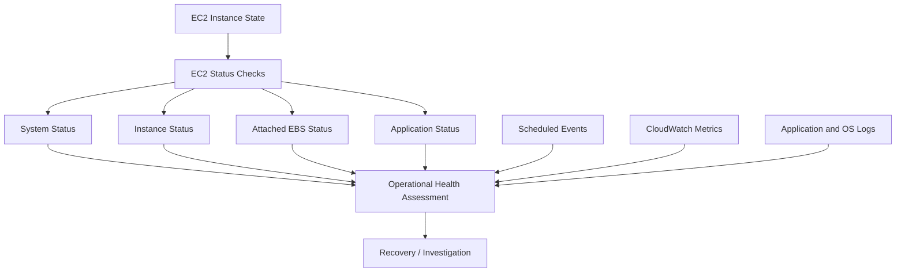
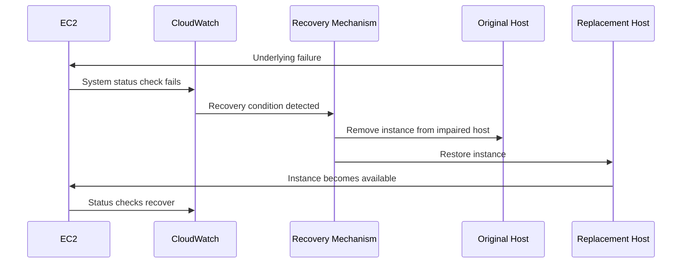
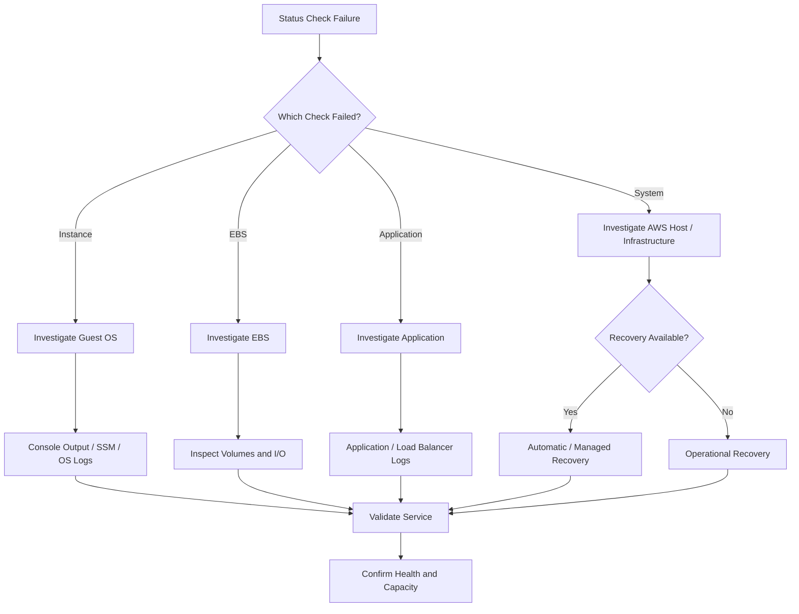

# 02- Instance Health and Status Checks

## Overview

EC2 instance health is evaluated through several independent signals that answer different operational questions:

- Is the underlying AWS infrastructure healthy?
- Is the guest operating system reachable?
- Are attached EBS resources functioning?
- Is the application responding?
- Does AWS have a maintenance or lifecycle event scheduled for the instance?

Amazon EC2 performs system, instance, and attached EBS status checks automatically. Application status checks are an additional opt-in mechanism. Status checks run every minute and return a pass or fail result. :contentReference[oaicite:0]{index=0}

A production operator should therefore avoid treating:

```text
EC2 state = running
```

as equivalent to:

```text
Instance = healthy
Application = healthy
Service = available
```

A useful health model is:



The goal is not merely to detect that an instance is unhealthy. The goal is to identify **which layer failed and what recovery action is appropriate**.

## EC2 Instance State vs Health

EC2 instance state describes the lifecycle state of an instance.

Common states include:

| State | Meaning |
|---|---|
| `pending` | Instance is being launched |
| `running` | Instance is running |
| `stopping` | Instance is transitioning to stopped |
| `stopped` | Instance is stopped |
| `shutting-down` | Instance is being terminated |
| `terminated` | Instance has been permanently terminated |

Health checks are different.

An instance can be:

```text
State: running
System status: impaired
```

or:

```text
State: running
System status: ok
Instance status: impaired
```

Therefore, operational tooling should inspect both instance state and status checks.

## Types of EC2 Status Checks

EC2 currently provides four status-check categories:

| Check | Detects | Managed by |
|---|---|---|
| System status | Problems with underlying AWS infrastructure | EC2 |
| Instance status | Problems inside the instance | EC2 |
| Attached EBS status | Problems accessing attached EBS volumes | EC2 |
| Application status | Application-level HTTP/HTTPS health | Customer-configured |

System, instance, and attached EBS checks are automatic. Application status checks are opt-in. :contentReference[oaicite:1]{index=1}

## System Status Checks

A system status check evaluates the underlying infrastructure supporting the instance.

Examples of problems that can cause a system status check failure include:

- Loss of network connectivity to the host
- Loss of system power
- Hardware failure
- Problems with the physical host
- Host-level software issues

A system status failure generally indicates a problem below the guest operating system. AWS can use this signal for automatic instance recovery on supported configurations. :contentReference[oaicite:2]{index=2}

Conceptually:

```text
AWS Infrastructure
        |
        v
Physical / Virtual Host
        |
        X  <-- System problem
        |
        v
EC2 Instance
```

### CLI Inspection

```bash
aws ec2 describe-instance-status \
    --profile production \
    --region ap-south-1 \
    --instance-ids i-0123456789abcdef0
```

Extract the system status:

```bash
aws ec2 describe-instance-status \
    --profile production \
    --region ap-south-1 \
    --instance-ids i-0123456789abcdef0 \
    --query 'InstanceStatuses[0].SystemStatus.Status' \
    --output text
```

Expected output:

```text
ok
```

or:

```text
impaired
```

## Instance Status Checks

Instance status checks identify problems associated with the instance itself.

Typical examples include:

- Failed system-level networking inside the guest
- Incorrect network configuration
- Memory exhaustion
- Filesystem problems
- Kernel-level issues
- Problems preventing the operating system from responding correctly

The important distinction is:

```text
System status
    =
AWS infrastructure / host

Instance status
    =
guest instance / operating system
```

A system status check can pass while an instance status check fails.

## Attached EBS Status Checks

Attached EBS status checks identify impaired functionality involving attached EBS volumes.

This is particularly useful when an instance is running but storage operations are impaired.

Example:

```text
EC2
 |
 +-- OS
 |
 +-- Application
 |
 +-- EBS Volume
          |
          X
      I/O problem
```

Inspect the attached EBS status:

```bash
aws ec2 describe-instance-status \
    --profile production \
    --region ap-south-1 \
    --instance-ids i-0123456789abcdef0 \
    --query 'InstanceStatuses[0].AttachedEbsStatus.Status' \
    --output text
```

## Application Status Checks

Application status checks provide application-level health information for an EC2 instance.

Unlike system, instance, and attached EBS checks, application status checks are opt-in and are configured by the customer. AWS documents them as HTTP or HTTPS application-level checks. :contentReference[oaicite:3]{index=3}

This creates a useful hierarchy:

```text
System
   |
   v
Instance
   |
   v
EBS
   |
   v
Application
```

However, application health should still be designed carefully.

For a FastAPI service:

```text
GET /health
```

could verify that the application process is responding without making every external dependency a hard requirement.

## Overall Instance Status

The overall status is useful as a first signal, but it should not replace inspecting individual components.

For example:

```bash
aws ec2 describe-instance-status \
    --profile production \
    --region ap-south-1 \
    --instance-ids i-0123456789abcdef0 \
    --query 'InstanceStatuses[0].{Instance:InstanceId,State:InstanceState.Name,System:SystemStatus.Status,InstanceStatus:InstanceStatus.Status,EBS:AttachedEbsStatus.Status}' \
    --output table
```

A healthy result might look conceptually like:

```text
-------------------------------------------------------
| Instance              | State   | System | Instance |
-------------------------------------------------------
| i-0123456789abcdef0   | running | ok     | ok       |
-------------------------------------------------------
```

The exact output depends on the available fields returned for the instance.

## Inspecting All Running Instances

By default, `describe-instance-status` returns status for running instances.

```bash
aws ec2 describe-instance-status \
    --profile production \
    --region ap-south-1
```

To include instances in other lifecycle states:

```bash
aws ec2 describe-instance-status \
    --profile production \
    --region ap-south-1 \
    --include-all-instances
```

AWS documents `--include-all-instances` for retrieving status information beyond running instances. :contentReference[oaicite:4]{index=4}

## Finding Impaired Instances

A useful operational query is to find instances with impaired status:

```bash
aws ec2 describe-instance-status \
    --profile production \
    --region ap-south-1 \
    --filters \
        Name=instance-status.status,Values=impaired \
    --query 'InstanceStatuses[].{InstanceId:InstanceId,State:InstanceState.Name,Instance:InstanceStatus.Status,System:SystemStatus.Status}' \
    --output table
```

This is more useful than manually inspecting a large fleet.

## CloudWatch Status Check Metrics

EC2 publishes status-check metrics in the `AWS/EC2` namespace.

Important metrics include:

| Metric | Meaning |
|---|---|
| `StatusCheckFailed` | Any status check failure |
| `StatusCheckFailed_Instance` | Instance status check failure |
| `StatusCheckFailed_System` | System status check failure |
| `StatusCheckFailed_AttachedEBS` | Attached EBS status failure |
| `StatusCheckFailed_AttachedEBS` | Attached EBS health signal |

Status-check metrics are available at 1-minute frequency by default and do not require detailed EC2 monitoring. :contentReference[oaicite:5]{index=5}

Check available metrics:

```bash
aws cloudwatch list-metrics \
    --profile production \
    --region ap-south-1 \
    --namespace AWS/EC2 \
    --metric-name StatusCheckFailed_System
```

## Understanding Status Check Metric Values

Status check metrics are essentially binary signals:

```text
0 = check passed
1 = check failed
```

For example:

```text
StatusCheckFailed_System = 0
```

means the system status check passed for the reported period.

```text
StatusCheckFailed_System = 1
```

indicates a system-level failure.

AWS notes that status-check metrics can temporarily enter insufficient-data states because metric reporting can be interrupted. This should not automatically be interpreted as an instance failure. :contentReference[oaicite:6]{index=6}

## Status Checks and CloudWatch Alarms

A status-check alarm can notify an operator when an instance becomes impaired.

Example:

```bash
aws cloudwatch put-metric-alarm \
    --profile production \
    --region ap-south-1 \
    --alarm-name "api-status-check-failed" \
    --namespace AWS/EC2 \
    --metric-name StatusCheckFailed \
    --dimensions Name=InstanceId,Value=i-0123456789abcdef0 \
    --statistic Maximum \
    --period 60 \
    --evaluation-periods 2 \
    --threshold 0 \
    --comparison-operator GreaterThanThreshold \
    --treat-missing-data missing \
    --alarm-actions "$SNS_TOPIC_ARN"
```

Using multiple evaluation periods can reduce reactions to transient signals.

AWS specifically recommends treating missing status-check metric data as missing rather than automatically interpreting it as a failure, especially when alarms can trigger disruptive actions. :contentReference[oaicite:7]{index=7}

## Why `StatusCheckFailed` Alone Is Not Enough

The aggregate metric tells you that something failed, but not necessarily what failed.

Use:

```text
StatusCheckFailed
```

for fleet-level or simple alarming, then inspect:

```text
StatusCheckFailed_System
StatusCheckFailed_Instance
StatusCheckFailed_AttachedEBS
```

to determine the failure domain.

For example:

```text
StatusCheckFailed = 1
StatusCheckFailed_System = 1
StatusCheckFailed_Instance = 0
```

points toward an infrastructure/system problem rather than an operating-system problem.

## System Failure vs Instance Failure

The distinction determines the recovery strategy.

| Signal | Likely failure domain | Typical response |
|---|---|---|
| System failed | AWS host/infrastructure | Recovery / AWS Health investigation |
| Instance failed | Guest OS / instance | OS and configuration investigation |
| EBS failed | Attached storage path | Storage investigation |
| Application failed | Application | Application investigation |
| All checks pass | No detected EC2 status impairment | Continue higher-layer investigation |

Do not immediately reboot or terminate an instance simply because an aggregate check failed.

Identify the failed layer first.

## Automatic Instance Recovery

EC2 supports automatic recovery mechanisms for supported instances when an underlying hardware or software problem causes a system status check failure.

AWS documents two recovery mechanisms:

- Simplified automatic recovery
- CloudWatch action-based recovery

Automatic recovery attempts to move the instance from an impaired host to another host. :contentReference[oaicite:8]{index=8}

The conceptual flow is:



Automatic recovery is intended for underlying infrastructure failures. It is not a general-purpose application restart mechanism.

## What Automatic Recovery Preserves

For supported recovery scenarios, AWS documents preservation of important instance characteristics such as:

- Instance ID
- Public IPv4 address
- Private IP addresses
- Elastic IP addresses
- Instance metadata
- Availability Zone
- Attached EBS volumes

Volatile memory is not preserved, and operating-system uptime resets. Instance-store data can also be lost depending on the recovery mechanism. :contentReference[oaicite:9]{index=9}

Therefore, applications must tolerate an unexpected reboot.

## Automatic Recovery Does Not Fix Everything

Automatic recovery is appropriate for specific infrastructure failures.

It does not solve:

```text
Application deadlock
Bad deployment
Broken configuration
Database outage
Memory leak
Filesystem corruption
Security Group misconfiguration
Incorrect application startup
```

For example:

```text
System status = ok
Instance status = ok
Application = HTTP 500
```

Automatic instance recovery is not the correct response.

Investigate the application instead.

## Verifying Automatic Recovery

If an instance unexpectedly becomes unavailable and later returns, investigate whether automatic recovery occurred.

AWS Health Dashboard records automatic recovery events, including success and failure events. The `StatusCheckFailed_System` metric can also indicate an underlying system failure. :contentReference[oaicite:10]{index=10}

Operationally:

```text
Unexpected reboot
      |
      +--> AWS Health event
      |
      +--> StatusCheckFailed_System
      |
      +--> Instance events
      |
      v
Determine recovery cause
```

Do not assume every unexpected reboot was caused by automatic recovery.

## Scheduled EC2 Events

EC2 can schedule infrastructure events that affect an instance.

Examples include:

- Instance stop
- Instance retirement
- Instance reboot
- System reboot
- System maintenance

AWS sends notifications for scheduled events and also publishes relevant AWS Health events that can be monitored with EventBridge. :contentReference[oaicite:11]{index=11}

Scheduled events should be treated as operational work items rather than ignored notifications.

## Inspecting Scheduled Events

Use:

```bash
aws ec2 describe-instance-status \
    --profile production \
    --region ap-south-1 \
    --include-all-instances \
    --instance-ids i-0123456789abcdef0 \
    --query 'InstanceStatuses[0].Events' \
    --output table
```

The status response can include scheduled events associated with the instance. AWS's `DescribeInstanceStatus` API exposes scheduled events along with system, instance, attached EBS, and application status information. :contentReference[oaicite:12]{index=12}

## Scheduled Event Types

| Event | Operational effect |
|---|---|
| `instance-stop` | Instance is stopped |
| `instance-retirement` | Instance is stopped or terminated depending on root storage |
| `instance-reboot` | Instance is rebooted in place |
| `system-reboot` | Instance is rebooted and migrated to a new host |
| `system-maintenance` | Instance can be temporarily affected by network or power maintenance |

AWS documents these event types and their effects in the EC2 scheduled-event documentation. :contentReference[oaicite:13]{index=13}

## Handling Scheduled Maintenance

For EBS-backed instances, one option for certain maintenance events is to stop and start the instance before the scheduled event.

A stop/start is different from a reboot:

```text
Reboot
    |
    +-- OS restart
    +-- Usually same host

Stop + Start
    |
    +-- Instance stopped
    +-- AWS can place it on different host
```

AWS documents stop/start as a way to migrate an EBS-backed instance to another host for applicable maintenance scenarios. :contentReference[oaicite:14]{index=14}

However, do not perform this blindly on a production instance.

Consider:

- Public IP changes unless an Elastic IP is used
- Application downtime
- Attached storage
- Database state
- Load balancer registration
- ASG ownership
- Stateful workloads
- Maintenance windows

## Auto Scaling and Scheduled Events

Instances managed by an Auto Scaling Group should generally be treated differently from manually managed instances.

If an EC2 instance in an Auto Scaling Group is affected by a scheduled event, EC2 Auto Scaling can eventually replace it through its health-check and replacement behavior. :contentReference[oaicite:15]{index=15}

Conceptually:

```text
Scheduled Event
      |
      v
Instance affected
      |
      v
ASG detects unhealthy / unavailable capacity
      |
      v
Replacement instance
      |
      v
Load Balancer health check
      |
      v
Healthy service capacity
```

This is one reason production applications should favor immutable, replaceable instances over manually repaired servers.

## Application Health Checks

Application health checks should be designed according to the service architecture.

For a FastAPI application:

```python
from fastapi import FastAPI

app = FastAPI()


@app.get("/health")
def health() -> dict[str, str]:
    return {"status": "ok"}
```

For a more meaningful readiness endpoint, dependency checks can be separated from basic process health.

Conceptually:

```text
/health
    |
    +-- Process is alive
    |
    v
200 OK

/ready
    |
    +-- Application initialized
    +-- Required dependencies available
    |
    v
200 OK / 503
```

Avoid making every dependency mandatory for every health endpoint.

A Redis outage should not necessarily make a service's process-level liveness endpoint fail.

## Liveness vs Readiness

The distinction is especially useful in systems behind a load balancer or managed by Auto Scaling.

| Check | Question |
|---|---|
| Liveness | Is the application process alive? |
| Readiness | Can this instance currently serve traffic? |
| Dependency health | Are required dependencies available? |
| EC2 status | Is the EC2 infrastructure functioning? |

This creates a layered health model:

```text
AWS Infrastructure
        |
        v
EC2 Status
        |
        v
Operating System
        |
        v
Application Process
        |
        v
Readiness
        |
        v
Business Functionality
```

## Health Checks Behind a Load Balancer

A production API might use:

```text
Internet
   |
   v
ALB
   |
   v
Target Group
   |
   +--> EC2 #1
   +--> EC2 #2
   +--> EC2 #3
```

The ALB health check determines whether targets should receive traffic.

This is independent from EC2 status checks.

An instance can be:

```text
EC2 status = healthy
ALB target = unhealthy
```

For example, the application could be listening on the wrong port or returning HTTP 500.

## EC2 Health vs ALB Health

| Signal | Scope |
|---|---|
| System status | AWS infrastructure |
| Instance status | Guest instance |
| Attached EBS status | Storage path |
| Application status | Application endpoint |
| ALB target health | Load-balancer traffic eligibility |

For production APIs, all relevant layers should be considered.

## Diagnosing a Failed Status Check

Use a structured investigation.



## First Response Checklist

When a status check fails:

1. Identify the affected instance.
2. Determine which status check failed.
3. Check the instance lifecycle state.
4. Inspect recent scheduled events.
5. Check CloudWatch status metrics.
6. Check AWS Health events.
7. Check application and load balancer health.
8. Determine whether automatic recovery is active.
9. Avoid unnecessary reboot/terminate actions.
10. Validate the service after recovery.

## Inspecting Status with AWS CLI

A compact diagnostic command:

```bash
aws ec2 describe-instance-status \
    --profile production \
    --region ap-south-1 \
    --include-all-instances \
    --instance-ids i-0123456789abcdef0 \
    --query 'InstanceStatuses[].{
        InstanceId:InstanceId,
        State:InstanceState.Name,
        System:SystemStatus.Status,
        Instance:InstanceStatus.Status,
        EBS:AttachedEbsStatus.Status,
        Events:Events
    }' \
    --output json
```

For scripting, JSON is usually preferable to table output.

## Checking Status for an Entire Fleet

```bash
aws ec2 describe-instance-status \
    --profile production \
    --region ap-south-1 \
    --query 'InstanceStatuses[].{
        InstanceId:InstanceId,
        State:InstanceState.Name,
        System:SystemStatus.Status,
        Instance:InstanceStatus.Status,
        EBS:AttachedEbsStatus.Status
    }' \
    --output table
```

For a fleet-level diagnostic, combine this with tags obtained through `describe-instances`.

## Correlating Status with Instance Metadata

Status checks do not provide the complete operational context.

Combine:

```bash
aws ec2 describe-instance-status \
    --profile production \
    --region ap-south-1 \
    --instance-ids i-0123456789abcdef0 \
    --output json
```

with:

```bash
aws ec2 describe-instances \
    --profile production \
    --region ap-south-1 \
    --instance-ids i-0123456789abcdef0 \
    --query 'Reservations[].Instances[].{
        InstanceId:InstanceId,
        Type:InstanceType,
        AZ:Placement.AvailabilityZone,
        PrivateIP:PrivateIpAddress,
        PublicIP:PublicIpAddress,
        State:State.Name,
        Tags:Tags
    }' \
    --output json
```

This gives operators enough context to determine whether the instance belongs to:

- A production service
- A specific Availability Zone
- An Auto Scaling Group
- A particular deployment
- A stateful workload

## Console Output for Instance-Level Problems

When an instance status check fails and the operating system may be unhealthy, EC2 console output can provide useful boot-level information.

```bash
aws ec2 get-console-output \
    --profile production \
    --region ap-south-1 \
    --instance-id i-0123456789abcdef0 \
    --output text
```

This can help identify:

- Boot failures
- Kernel errors
- Filesystem problems
- Startup failures
- Network initialization problems

For modern production environments, Systems Manager Session Manager is often preferable to direct SSH when the instance remains reachable and is configured for Systems Manager access.

## Systems Manager as a Diagnostic Tool

For instances with appropriate Systems Manager configuration, operational access can avoid opening SSH access broadly.

The diagnostic model becomes:

```text
Status Check
     |
     v
Can SSM reach instance?
     |
     +-- Yes --> Inspect OS
     |
     +-- No --> Investigate deeper failure
```

Useful diagnostics include:

- Running processes
- Memory
- Filesystem
- Network configuration
- Service status
- System logs

Status checks and Systems Manager complement each other rather than replacing one another.

## Health Checks in Auto Scaling

Auto Scaling Groups can use health information to determine whether instances should remain in service.

A production application typically has multiple health layers:

```text
EC2 health
    |
    v
ASG health
    |
    v
ALB target health
    |
    v
Application readiness
```

If an instance is unhealthy, ASG may replace it rather than requiring an operator to repair it manually.

This is particularly effective for immutable workloads.

## Repeated Instance Replacement

Repeated replacement is a signal, not a solution.

Example:

```text
Launch instance
      |
      v
ALB health check fails
      |
      v
ASG terminates instance
      |
      v
Launch replacement
      |
      v
Health check fails again
      |
      +----> Loop
```

Investigate common causes:

- Broken AMI
- Incorrect Launch Template
- Failed User Data
- Incorrect application port
- Security Group issue
- Application startup failure
- Missing environment configuration
- Dependency failure
- Incorrect ALB health-check path

Do not respond by continuously increasing ASG capacity.

## Scheduled Events and High Availability

Scheduled events are less disruptive when applications are designed for replacement.

For example:

```text
AZ-A
  EC2-A1
  EC2-A2

AZ-B
  EC2-B1
  EC2-B2
```

If one instance is unavailable, traffic can continue through other healthy targets.

This is why:

- Multi-AZ deployment
- Auto Scaling
- Load balancing
- Stateless application design
- Externalized state

are more important than trying to keep one specific EC2 instance alive indefinitely.

## Stateful EC2 Workloads

Stateful instances require more careful health procedures.

Examples:

- Databases
- File-processing nodes
- Legacy applications
- Stateful queues
- Specialized workloads

Before restarting or replacing an instance, determine:

```text
Where is the state?
    |
    +-- EBS
    +-- Instance store
    +-- Database
    +-- External object storage
    +-- Shared filesystem
```

Recovery strategy should depend on where the authoritative state resides.

## Instance Store Considerations

Instance store is ephemeral.

A recovery or replacement workflow must not assume that instance-store data survives instance lifecycle events.

For critical data, prefer durable storage such as:

- EBS
- Amazon S3
- Amazon EFS
- Managed databases

depending on the workload.

## Production Recovery Decision Matrix

| Failure | First investigation | Typical recovery |
|---|---|---|
| System status failed | AWS infrastructure / Health events | Automatic or manual recovery |
| Instance status failed | Guest OS | SSM, console output, OS investigation |
| EBS status failed | Storage | Volume and attachment investigation |
| Application status failed | Application | Logs, dependencies, deployment |
| Scheduled reboot | AWS event | Planned maintenance |
| Scheduled retirement | Instance lifecycle | Replace/migrate |
| ALB unhealthy | Application/network path | Target and health-check investigation |
| Repeated ASG replacement | AMI/configuration | Fix launch path |

The recovery action should match the failure domain.

## Monitoring and Alerting

Create alarms for meaningful status conditions.

For critical instances, consider:

```text
StatusCheckFailed_System
StatusCheckFailed_Instance
StatusCheckFailed_AttachedEBS
```

and, where configured:

```text
Application health
ALB target health
```

Use appropriate evaluation periods and missing-data behavior.

Avoid an alarm that immediately terminates or reboots an instance based on a single transient data point.

## Security Considerations

Health diagnostics can expose infrastructure information.

Protect:

- EC2 status information
- Console output
- Application logs
- AWS Health information
- CloudWatch dashboards
- Systems Manager access

Use IAM least privilege for operators.

Avoid granting broad EC2 mutation permissions merely because an engineer needs to inspect health.

Separate:

```text
Read-only diagnostics
```

from:

```text
Disruptive recovery actions
```

where practical.

## Operational Best Practices

- Distinguish EC2 lifecycle state from health status.
- Always determine which status-check layer failed.
- Treat system, instance, EBS, and application health as separate signals.
- Use CloudWatch status metrics for alerting and historical analysis.
- Monitor scheduled events through EC2 and AWS Health.
- Configure automatic recovery where appropriate and supported.
- Prefer replacement over manual repair for stateless ASG-managed workloads.
- Investigate repeated ASG replacement rather than repeatedly increasing capacity.
- Use load balancer health as an application-availability signal.
- Design health endpoints with clear liveness and readiness semantics.
- Avoid destructive recovery actions based on insufficient data.
- Validate application health after any infrastructure recovery.
- Use multi-AZ architecture to reduce the impact of individual instance failures.
- Treat instance-store data as ephemeral.
- Document recovery procedures for every critical alarm.

## Common Mistakes

### Treating `running` as Healthy

`running` only describes lifecycle state.

Always inspect status checks and application health.

### Rebooting a System Status Failure Immediately

A system status failure can indicate an underlying host problem.

First inspect:

```text
System status
AWS Health
CloudWatch
Scheduled events
Automatic recovery
```

before selecting a disruptive action.

### Treating Missing Metrics as Failure

Missing telemetry does not necessarily mean the instance failed. AWS explicitly recommends appropriate missing-data handling for status-check alarms. :contentReference[oaicite:16]{index=16}

### Confusing Reboot with Stop/Start

A reboot and stop/start have different infrastructure implications.

For certain maintenance scenarios, stop/start can migrate an EBS-backed instance to a different host. :contentReference[oaicite:17]{index=17}

### Using EC2 Health as Application Health

A healthy EC2 instance can still return:

```text
HTTP 500
HTTP 503
High latency
Database errors
```

Monitor the application separately.

### Manually Repairing ASG Instances

Manual changes to immutable ASG instances can disappear during replacement.

Fix the source of truth:

```text
AMI
Launch Template
User Data
Configuration
Infrastructure as Code
```

### Ignoring Scheduled Events

Scheduled events can provide advance warning of infrastructure maintenance, reboot, stop, or retirement. :contentReference[oaicite:18]{index=18}

Ignoring them can turn planned maintenance into an incident.

## Interview Traps

### What Is the Difference Between System and Instance Status Checks?

**System status checks** evaluate the underlying AWS infrastructure supporting the instance.

**Instance status checks** evaluate problems associated with the instance itself, such as operating-system or instance-level reachability problems.

### Can a Running EC2 Instance Be Unhealthy?

Yes.

For example:

```text
Instance state = running
Instance status = impaired
```

The lifecycle state and health status are separate concepts.

### What Does a System Status Check Failure Usually Indicate?

It generally indicates an underlying host or AWS infrastructure problem rather than an application-level problem. Automatic recovery can address supported system-status failures. :contentReference[oaicite:19]{index=19}

### Does Automatic Recovery Fix an Application Crash?

No.

Automatic recovery is designed around supported underlying infrastructure failures. An application crash should be handled through application process management, deployment mechanisms, load balancer health checks, or Auto Scaling behavior.

### What Is the Difference Between EC2 Status and ALB Target Health?

EC2 status checks evaluate EC2-level health.

ALB target health determines whether the load balancer considers a target eligible to receive traffic.

An instance can pass EC2 checks while failing the ALB health check.

### Why Should You Inspect Scheduled Events?

AWS can schedule reboot, stop, retirement, or maintenance events. Knowing about them allows operators to plan replacement, migration, or maintenance instead of discovering the impact during an outage. :contentReference[oaicite:20]{index=20}

### What Happens When an ASG Instance Becomes Unhealthy?

Depending on the configured health-check behavior, Auto Scaling can terminate the unhealthy instance and launch a replacement.

The important engineering question is whether the replacement becomes healthy. Repeated replacement indicates an underlying launch or configuration problem.

## Production Health Checklist

### Instance

- Check lifecycle state.
- Check system status.
- Check instance status.
- Check attached EBS status.
- Check recent scheduled events.

### AWS Infrastructure

- Check AWS Health events.
- Check automatic recovery configuration.
- Check recent infrastructure events.
- Check Availability Zone impact.

### Operating System

- Check console output when appropriate.
- Check SSM connectivity.
- Check system logs.
- Check filesystem and memory.
- Check critical processes.

### Application

- Check application readiness.
- Check ALB target health.
- Check HTTP error rates.
- Check latency.
- Check application logs.
- Check database and cache dependencies.

### Auto Scaling

- Check desired capacity.
- Check healthy instances.
- Check replacement activity.
- Check target health.
- Check Launch Template and AMI.

### Recovery

- Prefer the least disruptive appropriate action.
- Avoid repeated reboot/terminate cycles.
- Preserve evidence before destructive actions.
- Verify the service after recovery.
- Investigate recurring failures at their source.

## Key Takeaways

- **EC2 health is layered:** distinguish lifecycle state, system status, instance status, attached EBS status, application health, and load balancer health.
- **System status failures and instance status failures have different failure domains:** identify the failed layer before choosing a recovery action. :contentReference[oaicite:21]{index=21}
- **Scheduled events are operational signals:** monitor AWS Health and EC2 events so maintenance, reboot, and retirement work can be planned. :contentReference[oaicite:22]{index=22}
- **Automatic recovery is targeted, not universal:** it is designed for supported underlying infrastructure failures and does not replace application-level recovery. :contentReference[oaicite:23]{index=23}
- **Production recovery should be evidence-driven:** correlate status checks, CloudWatch metrics, scheduled events, OS signals, load balancer health, and application telemetry before taking disruptive actions.