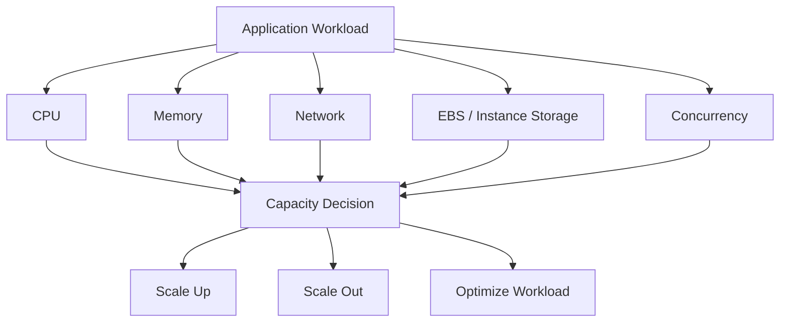
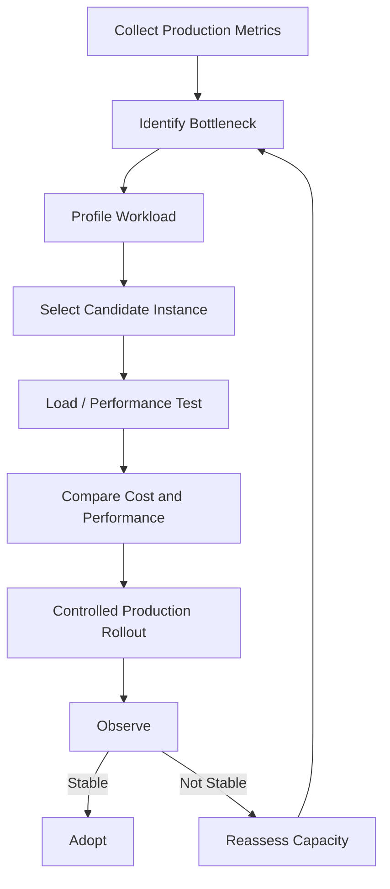

# 03- Capacity and Resource Management

## Overview

EC2 capacity management is the process of ensuring that the compute fleet has enough CPU, memory, network, storage, and placement capacity to handle current and expected workloads without systematically overprovisioning resources.

Capacity management is broader than choosing an instance type.

A production EC2 environment must answer:

- How much compute capacity is required?
- Which instance family and size match the workload?
- Is the bottleneck CPU, memory, network, EBS, or application concurrency?
- How much headroom is required?
- Can capacity scale quickly enough during demand spikes?
- Are AWS service quotas large enough for the planned fleet?
- Can the workload be distributed across Availability Zones?
- Is the current fleet oversized or undersized?
- What happens if one Availability Zone or capacity pool becomes unavailable?

A useful capacity model is:

```text
Workload Demand
      |
      v
Resource Requirements
      |
      +---- CPU
      +---- Memory
      +---- Network
      +---- EBS
      +---- Instance count
      +---- IP / ENI capacity
      |
      v
Instance Selection
      |
      v
Fleet Capacity
      |
      v
Headroom + Scaling Strategy
      |
      v
Quota Validation
      |
      v
Production Capacity
```

Capacity planning should therefore be driven by **measured workload characteristics**, not simply by selecting a larger instance whenever utilization increases.

## Capacity Dimensions

EC2 capacity is multidimensional.

| Dimension | Typical bottleneck | Example signal |
|---|---|---|
| CPU | CPU-bound application | CPU utilization |
| Memory | Large working set / caching | Memory utilization |
| Network | High request or data throughput | Network bytes |
| EBS | Database or storage-heavy workload | IOPS / throughput / latency |
| Instance count | Fleet scaling | Running instances |
| vCPU quota | Account-level capacity | Service Quotas |
| ENI/IP capacity | Highly networked workloads | ENI/IP limits |
| Storage capacity | Persistent data growth | EBS provisioned storage |
| Application concurrency | Too many simultaneous requests | Queue depth / latency |
| Availability Zone capacity | Regional placement constraints | Launch failures |

The correct instance size is therefore the one that satisfies the workload's **dominant constraints**, not necessarily the one with the highest CPU count.

## Capacity vs Utilization

Capacity is the amount of resource available.

Utilization is how much of that resource is currently being consumed.

For example:

```text
Instance:
    8 vCPUs
    32 GiB memory

Observed:
    CPU = 30%
    Memory = 92%
```

The instance may be CPU-underutilized but memory-constrained.

Increasing CPU capacity would not solve the actual bottleneck.

A senior capacity review therefore considers multiple dimensions simultaneously.

## Resource Bottleneck Model



The correct response to saturation depends on the bottleneck.

## CPU Capacity

CPU is the most visible EC2 resource, but it is not always the limiting resource.

CPU-heavy workloads include:

- CPU-intensive Python processing
- Compression
- Encryption
- Image processing
- Video processing
- Scientific computation
- High-throughput application servers
- Background workers

For example:

```text
FastAPI
   |
   +--> CPU-heavy serialization
   |
   +--> CPU-heavy business logic
   |
   v
High CPU utilization
```

A compute-optimized instance family may be more appropriate than a general-purpose instance for sustained CPU-heavy workloads.

### CPU Utilization Is Not the Entire Story

A high CPU percentage can indicate:

- Genuine workload demand
- Inefficient application code
- Excessive serialization
- Garbage collection pressure
- Busy polling
- Incorrect worker configuration
- Traffic imbalance

Before resizing, determine why CPU is high.

## Memory Capacity

Memory is particularly important for backend applications.

Examples:

- Django application workers
- FastAPI services
- PostgreSQL workloads
- Redis
- JVM applications
- Data-processing services
- In-memory caches

Python processes can consume significant memory depending on:

- Worker count
- Application object graphs
- Request concurrency
- Caching
- Data processing
- Memory fragmentation
- Native libraries

A simplified model:

```text
Total Memory
    |
    +-- OS
    +-- Application workers
    +-- Cache
    +-- Buffers
    +-- Monitoring agents
    +-- Safety headroom
```

Do not allocate 100% of instance memory to application workers.

Production systems require operating-system and workload headroom.

## Python Worker Capacity

Consider a Django deployment using Gunicorn:

```text
EC2
 |
 +-- Gunicorn worker 1
 +-- Gunicorn worker 2
 +-- Gunicorn worker 3
 +-- Gunicorn worker 4
 +-- Nginx
 +-- CloudWatch Agent
 +-- OS
```

If each worker consumes approximately 600 MiB under production load, four workers already require roughly:

```text
4 × 600 MiB = 2400 MiB
```

That does not include:

- Nginx
- OS
- page cache
- monitoring agents
- background processes
- memory spikes

Worker count should therefore be derived from measured resource consumption rather than blindly following CPU-based formulas.

## Network Capacity

Network capacity can become the bottleneck for:

- API gateways
- High-throughput REST services
- gRPC services
- Kafka clients
- Object storage transfers
- Replication
- Database traffic
- Large file processing

An application can have:

```text
CPU = 40%
Memory = 50%
Network = saturated
```

In this situation, adding CPU does not solve the problem.

Instance types have different network capabilities, and the available bandwidth can vary by instance family and size.

## EBS Capacity

EBS performance is bounded by both the attached volumes and the EC2 instance's EBS performance limits.

Conceptually:

```text
Effective EBS Performance
    =
minimum(
    Instance EBS limit,
    Aggregate volume capability
)
```

AWS explicitly documents that an instance's EBS performance is bounded by the instance limit or the aggregate performance of attached volumes, whichever is smaller. ([docs.aws.amazon.com](https://docs.aws.amazon.com/AWSEC2/latest/UserGuide/ebs-optimized.html?utm_source=chatgpt.com))

For example:

```text
Instance capability: 40,000 IOPS
Volumes:             60,000 IOPS

Effective maximum:
                     40,000 IOPS
```

Conversely:

```text
Instance capability: 80,000 IOPS
Volumes:             20,000 IOPS

Effective maximum:
                     20,000 IOPS
```

Capacity planning must therefore consider both sides.

## EBS Throughput vs IOPS

IOPS and throughput are different constraints.

IOPS measures operations per second.

Throughput measures data transferred per second.

A workload performing many small operations may be IOPS-bound:

```text
Many small random reads
        |
        v
High IOPS requirement
```

A workload processing large sequential blocks may be throughput-bound:

```text
Large sequential reads
        |
        v
High MB/s requirement
```

AWS notes that EBS IOPS and throughput limits can be interdependent depending on I/O size. ([docs.aws.amazon.com](https://docs.aws.amazon.com/AWSEC2/latest/UserGuide/ebs-optimized.html?utm_source=chatgpt.com))

## Instance Type Selection

Instance selection should begin with workload characteristics.

Common categories include:

| Workload | Typical instance family direction |
|---|---|
| Balanced web/API workloads | General purpose |
| CPU-intensive services | Compute optimized |
| Memory-heavy services | Memory optimized |
| High local storage workloads | Storage optimized |
| GPU workloads | Accelerated computing |
| Specialized high-performance workloads | HPC / specialized families |

Do not choose an instance family solely because it has more vCPUs.

A database workload may need memory and EBS throughput more than additional CPU.

## Right-Sizing

Right-sizing means selecting the smallest practical capacity that satisfies:

- Performance requirements
- Reliability requirements
- Availability requirements
- Scaling requirements
- Operational headroom

The goal is not:

```text
Lowest possible instance size
```

The goal is:

```text
Required performance
+
Operational headroom
+
Failure tolerance
```

## Right-Sizing Workflow



A production right-sizing exercise should use actual workload measurements.

## Headroom

Running continuously at maximum capacity is usually unsafe.

If an application normally consumes:

```text
CPU = 70%
```

and traffic can increase by 50%, the current capacity may not provide enough room.

Capacity planning should account for:

- Traffic growth
- Deployment overhead
- Background jobs
- Failure of one instance
- Availability Zone loss
- Traffic redistribution
- Short-term bursts

Headroom is a reliability mechanism, not merely wasted capacity.

## Capacity Planning for Auto Scaling

For an Auto Scaling Group:

```text
Minimum = baseline capacity
Desired = normal operating capacity
Maximum = controlled upper bound
```

For example:

```text
min = 4
desired = 6
max = 20
```

The numbers should be based on measured workload capacity.

If one instance can reliably handle:

```text
200 requests/sec
```

and the expected peak is:

```text
900 requests/sec
```

the fleet needs enough instances to handle the load with the desired safety margin.

A simplified model is:

```text
Required instances
=
Peak demand / Sustainable capacity per instance
```

Then add failure and operational headroom.

## Scale-Up vs Scale-Out

There are two primary capacity strategies.

| Strategy | Description | Useful when |
|---|---|---|
| Scale up | Use a larger instance | Workload is difficult to distribute |
| Scale out | Add more instances | Application is horizontally scalable |

For stateless web applications, scale-out is often operationally attractive:

```text
             ALB
              |
      +-------+-------+
      |       |       |
     EC2     EC2     EC2
      |       |       |
    App     App     App
```

Scaling out also improves failure isolation.

## When Scale-Up Makes Sense

Scale-up can be appropriate when:

- Application state is difficult to distribute
- A single process requires large memory
- Database workloads require large memory
- Specialized hardware is required
- Licensing is per-instance
- Horizontal scaling introduces excessive coordination

However, larger instances can create a larger failure domain.

## When Scale-Out Makes Sense

Scale-out works particularly well for:

- Stateless Django APIs
- FastAPI services
- REST APIs
- gRPC services
- Celery workers
- Nginx-backed services
- Microservices

The application must be designed for horizontal operation.

Externalize:

- Sessions
- Shared files
- Persistent state
- Distributed locks
- Caches where appropriate

## Capacity and Availability Zones

Capacity should be distributed across Availability Zones where the architecture supports it.

Example:

```text
Region
 |
 +-- AZ-A
 |    +-- EC2
 |    +-- EC2
 |
 +-- AZ-B
      +-- EC2
      +-- EC2
```

If all capacity is concentrated in one Availability Zone, an AZ-level failure can remove the entire service.

For a two-AZ service, avoid operating with exactly the minimum capacity required to survive normal traffic.

## Failure-Aware Capacity

Suppose a service requires four healthy instances during normal peak load.

A fragile configuration is:

```text
AZ-A: 2
AZ-B: 2
```

with no additional capacity.

If one AZ becomes unavailable:

```text
AZ-A: 0
AZ-B: 2
```

the remaining capacity may be insufficient.

A resilient architecture plans capacity around failure scenarios:

```text
Normal:
AZ-A: 3
AZ-B: 3

After AZ-A loss:
AZ-A: 0
AZ-B: 3
```

Whether this is sufficient depends on the workload and recovery model.

## Capacity Reservations and Quotas

Capacity can fail for reasons unrelated to application demand.

For example:

```text
Desired:
20 × instance

Available quota:
10 × equivalent vCPU capacity

Result:
Launch can fail
```

EC2 On-Demand Instance quotas are managed using vCPU capacity and are Region-specific. AWS can automatically increase some quotas based on usage, and quota increases can also be requested. ([docs.aws.amazon.com](https://docs.aws.amazon.com/AWSEC2/latest/UserGuide/ec2-resource-limits.html?utm_source=chatgpt.com))

Capacity planning must therefore include account-level limits.

## Checking EC2 Quotas

The AWS CLI can query Service Quotas.

```bash
aws service-quotas list-service-quotas \
    --service-code ec2 \
    --profile production \
    --region ap-south-1
```

Find a specific quota:

```bash
aws service-quotas list-service-quotas \
    --service-code ec2 \
    --profile production \
    --region ap-south-1 \
    --query 'Quotas[?contains(QuotaName, `Running On-Demand`)].{Name:QuotaName,Code:QuotaCode,Value:Value}' \
    --output table
```

Quota names and available entries can vary by service and Region, so production automation should discover the current quota rather than hard-code assumptions.

## Quotas Are Capacity Constraints

A quota is different from physical AWS capacity.

```text
Account quota
    |
    v
How much your account is allowed to provision

AWS capacity
    |
    v
Whether AWS currently has capacity for the requested resource
```

Both can affect launches.

For example:

```text
Quota available
+
AWS capacity unavailable
=
Launch failure
```

The reverse is also possible:

```text
AWS capacity available
+
Account quota exhausted
=
Launch failure
```

## EBS Quotas

EBS has its own quotas for resources and operations.

AWS notes that EBS quotas are generally Region-specific and that some quotas can be increased. AWS can also automatically adjust some EBS quotas based on usage. ([docs.aws.amazon.com](https://docs.aws.amazon.com/ebs/latest/userguide/ebs-resource-quotas.html?utm_source=chatgpt.com))

Capacity planning should account for:

- Provisioned EBS storage
- Provisioned IOPS
- Throughput
- Concurrent modifications
- Snapshot operations
- Volume counts
- Snapshot workflows

Do not assume that increasing EC2 capacity automatically increases EBS capacity.

## Network Capacity and ENIs

Network-heavy architectures can encounter interface or IP-related limits.

Examples include:

- Many interfaces attached to one instance
- High-density container workloads
- Large microservice deployments
- Services using multiple private IP addresses
- Network-intensive ECS-on-EC2 deployments

The maximum number of network interfaces depends on the EC2 instance type and size.

This becomes particularly important for workloads that allocate network interfaces dynamically. AWS documents instance-specific network interface limits as a placement constraint for such workloads. ([docs.aws.amazon.com](https://docs.aws.amazon.com/AmazonECS/latest/developerguide/operating-at-scale-service-quotas.html?utm_source=chatgpt.com))

## Resource Exhaustion

Resource exhaustion occurs when demand exceeds available capacity.

Common examples:

```text
CPU exhaustion
Memory exhaustion
Disk exhaustion
EBS IOPS exhaustion
Network saturation
Connection exhaustion
ENI/IP exhaustion
vCPU quota exhaustion
```

The symptom may appear at a higher layer.

For example:

```text
Memory pressure
      |
      v
Python workers killed
      |
      v
HTTP 502 / 503
      |
      v
ALB marks target unhealthy
```

The observed HTTP error is therefore not necessarily the root cause.

## Capacity Signals

Useful capacity signals include:

| Resource | Signals |
|---|---|
| CPU | Utilization, load average, CPU saturation |
| Memory | Used memory, available memory, swap |
| Network | Bytes, packets, bandwidth |
| EBS | IOPS, throughput, latency, queueing |
| Disk | Filesystem usage, inode usage |
| Application | Requests/sec, latency, errors |
| Queue | Queue depth, processing latency |
| Fleet | Instance count, ASG capacity |
| Quotas | Current usage vs quota |

CloudWatch provides many EC2-level metrics, but memory and filesystem utilization generally require in-guest monitoring such as the CloudWatch agent.

## Capacity and Application Performance

Capacity should be correlated with application metrics.

For a Django API:

```text
Traffic
   |
   v
ALB
   |
   v
EC2
   |
   +-- CPU
   +-- Memory
   +-- Network
   |
   v
Gunicorn
   |
   v
Django
   |
   +-- PostgreSQL
   +-- Redis
```

A rise in request latency should be correlated with:

- CPU
- Memory
- worker count
- database latency
- Redis latency
- network throughput
- EBS latency

Scaling EC2 without checking downstream dependencies can simply move the bottleneck.

## Downstream Capacity

Consider:

```text
10 EC2 instances
       |
       v
PostgreSQL
```

If one instance generates:

```text
100 DB connections
```

then:

```text
10 × 100 = 1000 connections
```

Scaling the EC2 fleet can overwhelm PostgreSQL even when EC2 itself has plenty of capacity.

The same applies to:

- Redis connections
- Kafka consumers
- external APIs
- database IOPS
- network links

Capacity planning must therefore follow the complete request path.

## Celery Worker Capacity

Background workers require separate capacity planning.

For example:

```text
Django
  |
  v
Redis / Kafka
  |
  v
Celery Workers
  |
  v
External API / Database
```

Worker capacity should consider:

- Task execution time
- Concurrency
- CPU usage
- Memory per worker
- Queue depth
- Retry behavior
- Downstream rate limits

Increasing Celery concurrency can increase CPU and memory consumption without increasing useful throughput if the downstream system is already saturated.

## Kubernetes and EC2 Capacity

When EC2 provides Kubernetes worker nodes, there are multiple capacity layers:

```text
EC2 Instance
    |
    v
Kubernetes Node
    |
    v
Pod Requests / Limits
    |
    v
Application
```

A node can have available CPU while the scheduler cannot place a pod because of:

- Memory constraints
- Pod count limits
- ENI/IP limits
- Taints
- Affinity rules
- Requested resources

EC2 capacity should therefore be evaluated together with the scheduler's resource model.

## Capacity Planning Methodology

A practical planning process is:

### Establish Baseline

Measure:

- Average traffic
- Peak traffic
- CPU
- Memory
- Network
- EBS
- Application latency
- Error rate
- Queue depth

### Identify Bottlenecks

Determine which resource saturates first.

```text
CPU?
Memory?
Network?
EBS?
Database?
External dependency?
```

### Determine Per-Instance Capacity

Measure sustainable capacity rather than theoretical maximum.

For example:

```text
Instance:
    4 vCPU
    16 GiB

Sustainable:
    250 requests/sec
    p95 < 200 ms
```

### Model Peak Demand

If expected peak demand is:

```text
1500 requests/sec
```

and sustainable instance capacity is:

```text
250 requests/sec
```

then the baseline mathematical requirement is:

```text
1500 / 250 = 6 instances
```

Production planning should then add capacity for:

- Failures
- Deployment
- Traffic spikes
- AZ loss
- Scaling delay

### Validate

Run load tests or controlled production experiments.

Do not treat a spreadsheet estimate as proof of capacity.

## Scaling Headroom

A simple planning model is:

```text
Required Capacity
=
Peak Demand
×
Safety Factor
```

The safety factor should be based on:

- Traffic volatility
- Scaling latency
- Failure tolerance
- Deployment strategy
- Business criticality

Avoid blindly selecting an arbitrary percentage.

A service with predictable traffic and fast horizontal scaling may need a different headroom strategy from a service with sudden traffic spikes and slow startup.

## Scaling Time Matters

Capacity planning must include how quickly new instances become useful.

```text
Traffic spike
    |
    v
CloudWatch metric
    |
    v
Scaling policy
    |
    v
EC2 launch
    |
    v
Boot
    |
    v
User Data
    |
    v
Application startup
    |
    v
Health check
    |
    v
Traffic eligible
```

If this process takes five minutes, an Auto Scaling policy reacting only after severe saturation may be too slow.

Mitigations include:

- Maintaining sufficient baseline capacity
- Predictive scaling where appropriate
- Faster application startup
- Pre-baked AMIs
- Efficient health checks
- Appropriate scaling policies

## Instance Selection by Workload

### General Purpose

Useful for:

- Django APIs
- FastAPI APIs
- Nginx
- General microservices
- Mixed CPU/memory workloads

### Compute Optimized

Useful when CPU is consistently the dominant constraint.

Examples:

- CPU-heavy Python workers
- Encoding
- Compression
- Compute-intensive services

### Memory Optimized

Useful when memory is the dominant constraint.

Examples:

- Large in-memory caches
- Memory-heavy applications
- Large database workloads
- Analytics workloads

### Storage Optimized

Useful for storage-intensive workloads requiring high local storage performance.

### Accelerated Computing

Useful when the workload requires specialized accelerators such as GPUs.

The correct choice depends on measured requirements and supported features, not only the family name.

## Cost-Aware Capacity Management

Capacity and cost are tightly connected.

Oversizing:

```text
Low utilization
+
High fixed capacity
=
Waste
```

Undersizing:

```text
High utilization
+
Insufficient headroom
=
Performance / availability risk
```

The target is:

```text
Required performance
+
Reliability margin
+
Reasonable cost
```

Consider:

- On-Demand pricing
- Savings Plans
- Reserved Instances where appropriate
- Spot capacity for interruptible workloads
- Instance utilization
- EBS storage
- EBS IOPS and throughput
- Elastic IP charges where applicable
- Data transfer costs
- Idle instances

## Capacity Optimization Workflow

```text
Measure
   |
   v
Identify Bottleneck
   |
   v
Right-size
   |
   v
Load Test
   |
   v
Deploy Gradually
   |
   v
Monitor
   |
   v
Compare Cost / Performance
   |
   v
Repeat
```

Capacity optimization should be continuous rather than a one-time exercise.

## Production Capacity Checklist

### Compute

- [ ] Instance family matches workload
- [ ] CPU has sufficient headroom
- [ ] Memory has sufficient headroom
- [ ] Worker concurrency is appropriate
- [ ] Instance count supports failure scenarios

### Network

- [ ] Network bandwidth is sufficient
- [ ] ENI limits are understood
- [ ] IP capacity is sufficient
- [ ] Load balancer capacity is considered

### Storage

- [ ] EBS volume size is sufficient
- [ ] EBS IOPS are sufficient
- [ ] EBS throughput is sufficient
- [ ] Instance EBS limits are not the bottleneck
- [ ] Filesystem capacity has alerting

### Scaling

- [ ] ASG min/desired/max values are intentional
- [ ] Scaling policies are tested
- [ ] Scale-out time is understood
- [ ] Scale-in behavior is safe
- [ ] Multi-AZ distribution is configured

### Quotas

- [ ] EC2 vCPU quotas are sufficient
- [ ] EBS quotas are sufficient
- [ ] VPC/ENI/IP quotas are sufficient
- [ ] Auto Scaling quotas are sufficient
- [ ] Quota increases are requested before major growth

### Application

- [ ] Database capacity is included
- [ ] Redis capacity is included
- [ ] Kafka capacity is included where applicable
- [ ] External service limits are considered
- [ ] Queue depth is monitored

## Common Mistakes

### Choosing Instances Based Only on CPU

A workload can be memory-, network-, or storage-bound.

**Avoid it:** identify the first resource to saturate.

### Running Without Headroom

Operating at sustained near-100% utilization leaves little room for traffic spikes or failures.

**Avoid it:** define a capacity policy that includes workload growth and failure scenarios.

### Ignoring EBS Instance Limits

Provisioning high-IOPS EBS volumes does not guarantee that the EC2 instance can consume all those IOPS.

**Avoid it:** compare aggregate volume performance with the EC2 instance's EBS limits. ([docs.aws.amazon.com](https://docs.aws.amazon.com/AWSEC2/latest/UserGuide/ebs-optimized.html?utm_source=chatgpt.com))

### Scaling EC2 Without Checking the Database

More API instances can increase database connections and query load.

**Avoid it:** model the complete dependency chain.

### Treating ASG Maximum as Infinite Capacity

An Auto Scaling Group can still be constrained by:

- EC2 quotas
- EBS quotas
- VPC limits
- Instance availability
- API throttling

**Avoid it:** validate account and regional capacity before planned scale events.

### Using Theoretical Instance Capacity

Vendor maximums are not automatically equivalent to sustainable application throughput.

**Avoid it:** benchmark the real workload.

### Ignoring AZ Failure

A fleet sized only for normal demand may become insufficient after losing an Availability Zone.

**Avoid it:** perform failure-aware capacity planning.

### Overprovisioning Permanently

Oversized instances can hide inefficient application behavior and increase operating costs.

**Avoid it:** use measured right-sizing reviews.

## Interview Traps

### What Is Right-Sizing?

Right-sizing is selecting resource capacity that satisfies workload performance and reliability requirements without unnecessary overprovisioning.

It is based on observed workload behavior rather than simply choosing the smallest instance.

### Is CPU Utilization Enough to Determine Instance Size?

No.

You must also consider memory, network, EBS performance, application concurrency, downstream dependencies, and scaling behavior.

### What Is the Difference Between Scale-Up and Scale-Out?

Scale-up increases the capacity of individual instances.

Scale-out increases the number of instances.

Stateless web services commonly benefit from scale-out, while some stateful or tightly coupled workloads may require scale-up.

### Can an EC2 Instance With Low CPU Still Be Overloaded?

Yes.

It may be constrained by:

- Memory
- Network
- EBS
- File descriptors
- Application concurrency
- Downstream dependencies

### Why Does EBS Performance Depend on the EC2 Instance?

The EC2 instance has limits on the EBS connection. Even if attached volumes are provisioned for more IOPS or throughput, the instance-side limit can become the bottleneck. ([docs.aws.amazon.com](https://docs.aws.amazon.com/AWSEC2/latest/UserGuide/ebs-optimized.html?utm_source=chatgpt.com))

### Why Can an Auto Scaling Group Fail to Scale Out?

Possible causes include:

- EC2 vCPU quota
- Instance-specific capacity constraints
- Availability Zone capacity
- EBS or networking limits
- Invalid Launch Template
- Security Group or subnet problems
- IAM permission failures
- API throttling

Auto Scaling itself also has service quotas and API throttling limits. ([docs.aws.amazon.com](https://docs.aws.amazon.com/autoscaling/ec2/userguide/ec2-auto-scaling-quotas.html?utm_source=chatgpt.com))

### Why Is Capacity Planning More Than Instance Selection?

Because the application is part of a dependency graph:

```text
Client
  |
  v
ALB
  |
  v
EC2
  |
  +--> Redis
  +--> PostgreSQL
  +--> Kafka
  +--> External APIs
```

Increasing one component can overload another.

## Operational Best Practices

- Measure before resizing.
- Identify the actual bottleneck instead of assuming CPU is the problem.
- Select instance families according to workload characteristics.
- Keep production capacity below hard resource limits.
- Maintain explicit headroom for spikes and failures.
- Design capacity around Availability Zone failure scenarios.
- Use Auto Scaling for horizontally scalable workloads.
- Pre-bake AMIs to reduce scale-out time.
- Monitor both EC2 resources and application-level metrics.
- Include database, cache, queue, and external-service capacity in planning.
- Review EC2 and dependent-service quotas before major growth.
- Request quota increases before the capacity is required.
- Benchmark candidate instance types with representative workloads.
- Review cost and performance together.
- Revisit right-sizing as application behavior changes.

## Key Takeaways

- **Capacity is multidimensional:** CPU, memory, network, EBS, instance count, quotas, and application dependencies can all become bottlenecks.
- **Right-size from measurements:** choose instance types based on the workload's actual limiting resources rather than CPU count alone.
- **Plan for failure as well as demand:** production capacity should account for scaling delay, traffic spikes, instance failures, and Availability Zone loss.
- **Quotas are part of capacity planning:** EC2, EBS, networking, and Auto Scaling quotas can prevent scale-out even when the application still needs more capacity. ([docs.aws.amazon.com](https://docs.aws.amazon.com/AWSEC2/latest/UserGuide/ec2-resource-limits.html?utm_source=chatgpt.com))
- **Scale the whole dependency chain:** increasing EC2 capacity can simply move the bottleneck to PostgreSQL, Redis, Kafka, EBS, networking, or another downstream system.