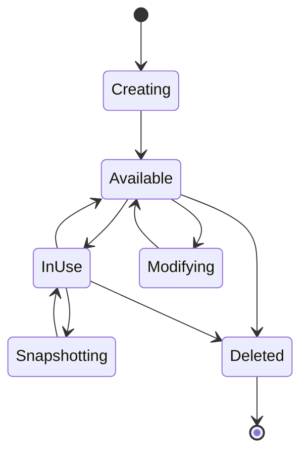
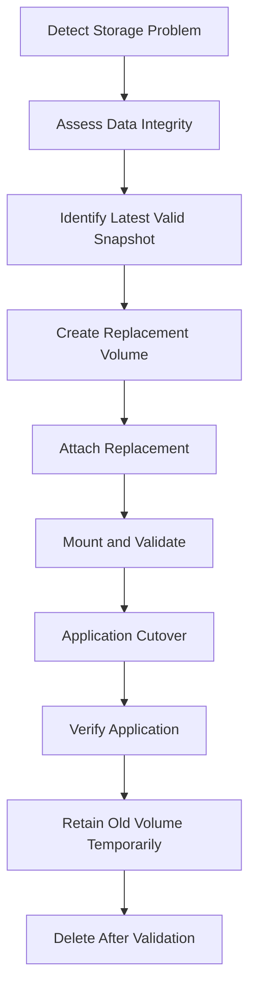
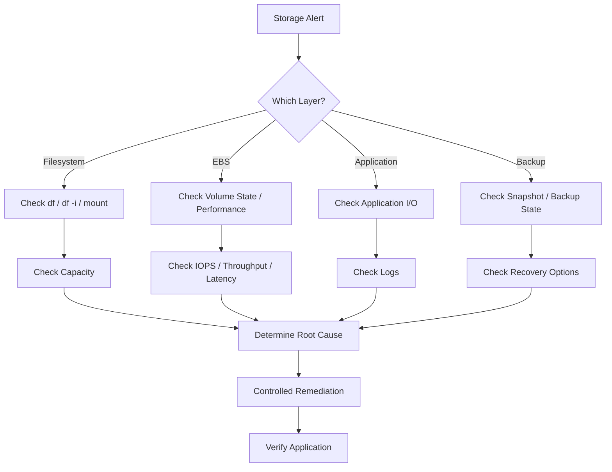

# 04- Storage Operations

## Overview

Storage operations on EC2 cover the lifecycle and operational management of persistent and ephemeral storage attached to instances.

For most production EC2 workloads, the primary storage service is Amazon EBS. EBS provides persistent block storage that can be attached to EC2 instances in the same Availability Zone. Instance store provides physically attached ephemeral storage and has a fundamentally different lifecycle. :contentReference[oaicite:0]{index=0}

A production storage operation typically involves:

```text
EC2 Instance
    |
    +-- Root EBS Volume
    |
    +-- Data EBS Volumes
    |
    +-- Instance Store
    |
    v
Filesystem
    |
    v
Application
```

The operational responsibility extends beyond AWS resources:

```text
AWS Volume
    |
    v
Block Device
    |
    v
Partition
    |
    v
Filesystem
    |
    v
Mount Point
    |
    v
Application
```

A volume can be healthy at the AWS layer while the filesystem is full, incorrectly mounted, corrupted, or inaccessible to the application.

## EBS and Instance Store

| Characteristic | EBS | Instance Store |
|---|---|---|
| Persistence | Persistent | Ephemeral |
| Lifecycle | Independent of instance when preserved | Tied to instance lifecycle |
| Snapshot support | Yes | No direct EBS snapshot |
| Detachable | Yes | No |
| Cross-AZ movement | Through snapshot/copy workflows | No |
| Typical use | OS, databases, application data | Temporary/cache/scratch data |
| Failure model | Durable within its Availability Zone | Data can be lost when instance lifecycle changes |

EBS is normally the default choice for persistent application data.

Instance store is appropriate when the data can be recreated and the workload benefits from local ephemeral storage.

## EBS Volume Lifecycle

An EBS volume generally follows this lifecycle:



The actual lifecycle includes operations such as creation, attachment, modification, snapshotting, detachment, and deletion. AWS documents the volume lifecycle as separate AWS-level operations combined with guest operating-system operations such as formatting, mounting, and filesystem management. :contentReference[oaicite:1]{index=1}

## Inspecting EBS Volumes

Start with the AWS resource state:

```bash
aws ec2 describe-volumes \
    --profile production \
    --region ap-south-1 \
    --volume-ids vol-0123456789abcdef0
```

Useful fields include:

- Volume ID
- State
- Size
- Volume type
- IOPS
- Throughput
- Availability Zone
- Encryption state
- KMS key
- Attachments
- Device name
- Tags

A compact operational query:

```bash
aws ec2 describe-volumes \
    --profile production \
    --region ap-south-1 \
    --volume-ids vol-0123456789abcdef0 \
    --query 'Volumes[0].{
        VolumeId:VolumeId,
        State:State,
        Size:Size,
        Type:VolumeType,
        IOPS:Iops,
        Throughput:Throughput,
        AZ:AvailabilityZone,
        Encrypted:Encrypted,
        Attachments:Attachments
    }' \
    --output table
```

## Volume States

The most important operational states are:

| State | Meaning |
|---|---|
| `creating` | Volume is being created |
| `available` | Volume is not attached |
| `in-use` | Volume is attached |
| `deleting` | Volume deletion is in progress |
| `deleted` | Volume has been deleted |
| `error` | Volume creation failed |

An `available` volume is not necessarily unused from a business perspective.

It may contain:

- Database data
- Historical files
- Backups
- Application state
- Migration data

Always inspect tags and ownership before deleting unattached storage.

## Creating an EBS Volume

Create an encrypted volume in the same Availability Zone as the target instance:

```bash
aws ec2 create-volume \
    --profile production \
    --region ap-south-1 \
    --availability-zone ap-south-1a \
    --volume-type gp3 \
    --size 100 \
    --encrypted \
    --tag-specifications \
        'ResourceType=volume,Tags=[{Key=Name,Value=api-data},{Key=Environment,Value=production}]'
```

The volume must be created in the same Availability Zone as the EC2 instance to which it will be attached. :contentReference[oaicite:2]{index=2}

## Attaching a Volume

```bash
aws ec2 attach-volume \
    --profile production \
    --region ap-south-1 \
    --volume-id vol-0123456789abcdef0 \
    --instance-id i-0123456789abcdef0 \
    --device /dev/sdf
```

The device name supplied to EC2 may not be the device name visible inside a modern Linux guest.

For example:

```text
AWS attachment request
/dev/sdf

Linux guest
/dev/nvme1n1
```

Always inspect the guest:

```bash
lsblk
```

and:

```bash
sudo blkid
```

Do not assume that `/dev/sdf` is the final Linux device path.

## Formatting a New Volume

A newly created EBS volume is a raw block device.

Before formatting, verify that the device is actually the intended new volume.

```bash
lsblk
```

Then inspect the filesystem:

```bash
sudo file -s /dev/nvme1n1
```

If the volume is genuinely new and has no filesystem:

```bash
sudo mkfs -t xfs /dev/nvme1n1
```

**Do not run `mkfs` on a volume containing existing data.**

Formatting an existing filesystem can destroy the data. AWS explicitly warns that creating a filesystem on a volume that already contains a filesystem overwrites the existing data. :contentReference[oaicite:3]{index=3}

## Mounting a Volume

Create a mount point:

```bash
sudo mkdir -p /srv/data
```

Mount the filesystem:

```bash
sudo mount /dev/nvme1n1 /srv/data
```

Verify:

```bash
df -h /srv/data
```

and:

```bash
findmnt /srv/data
```

A production mount should generally be configured using a stable filesystem identifier rather than relying on a potentially changing device name.

## Persistent Mounting

Retrieve the UUID:

```bash
sudo blkid /dev/nvme1n1
```

Example:

```text
/dev/nvme1n1: UUID="4d7d9c4b-..." TYPE="xfs"
```

Configure `/etc/fstab`:

```text
UUID=4d7d9c4b-... /srv/data xfs defaults,nofail 0 2
```

Test the configuration:

```bash
sudo mount -a
```

Then verify:

```bash
findmnt /srv/data
```

`nofail` can prevent an unavailable non-root data volume from preventing normal boot in appropriate workloads.

## Storage Layout for a Backend Service

A typical EC2-hosted backend might use:

```text
EC2
 |
 +-- Root EBS
 |      |
 |      +-- OS
 |      +-- Nginx
 |      +-- Application code
 |
 +-- Data EBS
        |
        +-- Temporary processing
        +-- Local application data
        +-- Service-specific state
```

For highly available web applications, avoid making local EBS the authoritative source for data that must survive instance replacement.

Instead:

```text
Django / FastAPI
      |
      +--> PostgreSQL
      +--> Redis
      +--> S3
      +--> EFS
```

Use EBS for workloads that genuinely require block storage.

## EBS Performance Management

EBS performance is controlled through:

- Volume type
- Volume size
- Provisioned IOPS where supported
- Provisioned throughput where supported
- EC2 instance EBS limits
- Workload I/O pattern

For example:

```text
Application
    |
    v
EC2 EBS interface
    |
    v
Instance EBS limit
    |
    v
EBS Volume
    |
    v
Filesystem
```

The effective performance can be limited by either the EC2 instance or the attached volumes. :contentReference[oaicite:4]{index=4}

## IOPS vs Throughput

IOPS and throughput represent different workload characteristics.

| Workload | Primary concern |
|---|---|
| Many small random operations | IOPS |
| Large sequential transfers | Throughput |
| Database random I/O | IOPS + latency |
| Large file processing | Throughput |
| Log-heavy application | Throughput + filesystem capacity |

Do not increase IOPS when the actual bottleneck is throughput.

Likewise, increasing throughput does not automatically solve a high-random-I/O workload.

## Monitoring Storage Utilization

AWS-level EBS metrics and guest-level filesystem metrics answer different questions.

```text
CloudWatch
    |
    +-- EBS volume performance
    |
    +-- IOPS
    +-- Throughput
    +-- Queueing
    +-- Burst / credit behavior where applicable

CloudWatch Agent / OS
    |
    +-- Filesystem utilization
    +-- Inodes
    +-- Memory
    +-- Process-level metrics
```

An EBS volume can have excellent AWS-level health while the filesystem is:

```text
95% full
```

Monitor both layers.

## Disk Space Monitoring

Linux:

```bash
df -h
```

Filesystem-specific:

```bash
df -h /srv/data
```

Inode utilization:

```bash
df -i
```

Large directories:

```bash
sudo du -xh /srv/data | sort -h | tail -20
```

These commands distinguish:

```text
Capacity exhausted
```

from:

```text
Unexpected data growth
```

## Filesystem Full vs EBS Full

A filesystem can be full before the EBS volume's provisioned capacity is reached if the partition or filesystem was not expanded correctly.

Example:

```text
EBS volume
100 GiB -> 200 GiB

Partition
100 GiB

Filesystem
100 GiB
```

The AWS volume is 200 GiB, but the application may still see only 100 GiB.

AWS requires the guest partition and filesystem to be extended after increasing the EBS volume size. :contentReference[oaicite:5]{index=5}

## Resizing an EBS Volume

EBS Elastic Volumes allows supported volumes to be modified without detaching them.

Typical workflow:

```text
Snapshot
   |
   v
Modify EBS volume
   |
   v
Monitor modification
   |
   v
Extend partition
   |
   v
Extend filesystem
   |
   v
Verify capacity
```

AWS recommends taking a snapshot before modifying valuable volumes and then monitoring the modification until the volume reaches an appropriate state. :contentReference[oaicite:6]{index=6}

Example:

```bash
aws ec2 modify-volume \
    --profile production \
    --region ap-south-1 \
    --volume-id vol-0123456789abcdef0 \
    --size 200
```

Monitor the modification:

```bash
aws ec2 describe-volumes-modifications \
    --profile production \
    --region ap-south-1 \
    --volume-ids vol-0123456789abcdef0
```

Increasing the AWS volume size does not automatically expand the filesystem.

## Extending a Linux Filesystem

First inspect:

```bash
lsblk
df -h
```

For an XFS filesystem:

```bash
sudo xfs_growfs /srv/data
```

For an ext4 filesystem:

```bash
sudo resize2fs /dev/nvme1n1p1
```

If the volume uses a partition, extend the partition before extending the filesystem.

For example:

```text
EBS
 |
 +-- Partition
       |
       +-- Filesystem
```

The correct command depends on the partition layout and filesystem.

## LVM-Based Storage

If the EBS volume is managed through LVM:

```text
EBS
 |
 v
Partition
 |
 v
Physical Volume
 |
 v
Volume Group
 |
 v
Logical Volume
 |
 v
Filesystem
```

Resizing must occur through the appropriate layers.

A typical flow is:

```bash
sudo pvresize /dev/nvme1n1p1
sudo lvextend -l +100%FREE /dev/mapper/app-data
sudo xfs_growfs /srv/data
```

Do not apply these commands blindly. First inspect:

```bash
lsblk
sudo pvs
sudo vgs
sudo lvs
df -h
```

## Shrinking EBS Storage

Increasing an EBS volume is operationally simpler than shrinking one.

Do not assume:

```bash
aws ec2 modify-volume --size 100
```

can safely reduce an existing 200 GiB volume.

For workloads requiring a smaller volume, a safer pattern is usually:

```text
Existing volume
      |
      v
Snapshot / backup
      |
      v
Create smaller volume
      |
      v
Copy data
      |
      v
Validate
      |
      v
Cut over
```

Filesystem-level constraints must be handled before moving data.

## Snapshot Before Risky Storage Operations

For important storage changes:

```text
Before:
    Production volume

Backup:
    EBS snapshot

Change:
    Resize / migration / filesystem operation

Validate:
    Application + filesystem

Rollback:
    Restore from snapshot if required
```

EBS snapshots are incremental backups that store changed blocks after the initial snapshot. AWS recommends regular snapshots or automated backup mechanisms such as Data Lifecycle Manager or AWS Backup for data resiliency. :contentReference[oaicite:7]{index=7}

## Snapshot Consistency

A snapshot is not automatically equivalent to an application-consistent database backup.

For write-heavy applications:

```text
Application
    |
    +-- OS cache
    +-- Filesystem
    +-- EBS
```

The snapshot captures data written to the volume at the time the snapshot is requested, but application or OS-cached data may not yet have been written. AWS recommends pausing writes or unmounting where appropriate when stronger consistency is required. :contentReference[oaicite:8]{index=8}

For databases, prefer database-native backup mechanisms where appropriate and use EBS snapshots as part of the broader recovery strategy.

## Creating a Snapshot

```bash
aws ec2 create-snapshot \
    --profile production \
    --region ap-south-1 \
    --volume-id vol-0123456789abcdef0 \
    --description "Production database volume backup"
```

Add useful tags:

```bash
aws ec2 create-tags \
    --profile production \
    --region ap-south-1 \
    --resources snap-0123456789abcdef0 \
    --tags \
        Key=Environment,Value=production \
        Key=BackupType,Value=manual \
        Key=SourceVolume,Value=vol-0123456789abcdef0
```

Snapshot creation is asynchronous, so operational workflows should inspect snapshot state before treating the operation as complete. :contentReference[oaicite:9]{index=9}

## Backup Automation

Production EBS backup should not depend on engineers remembering to run CLI commands manually.

Consider:

- AWS Backup
- Amazon Data Lifecycle Manager
- Scheduled snapshot workflows
- Retention policies
- Cross-Region copies for disaster recovery

A useful policy includes:

```text
Frequency
Retention
Encryption
Region
Application consistency
Restore testing
Ownership
```

Backups that have never been restored are assumptions, not validated recovery mechanisms.

## Restoring EBS Storage

A snapshot can be used to create a new EBS volume.

```text
Snapshot
    |
    v
New EBS volume
    |
    v
Attach
    |
    v
Mount
    |
    v
Validate data
```

Example:

```bash
aws ec2 create-volume \
    --profile production \
    --region ap-south-1 \
    --availability-zone ap-south-1a \
    --snapshot-id snap-0123456789abcdef0 \
    --volume-type gp3 \
    --tag-specifications \
        'ResourceType=volume,Tags=[{Key=Name,Value=restored-data}]'
```

A volume created from a snapshot initially requires storage blocks to be initialized before full performance is reached. AWS documents this as volume initialization. :contentReference[oaicite:10]{index=10}

## Replacing a Damaged Volume

For serious volume problems:



This is often safer than repeatedly modifying a potentially damaged storage resource.

AWS documents restoring an EBS volume from a snapshot as a mechanism for replacing a volume and recovering specific data. :contentReference[oaicite:11]{index=11}

## Detaching a Volume

Before detaching a data volume:

1. Stop application writes.
2. Flush filesystem buffers.
3. Unmount the filesystem.
4. Confirm no process is using the mount.
5. Detach the volume.
6. Verify the AWS attachment state.

Linux example:

```bash
sudo sync
sudo umount /srv/data
```

Check:

```bash
findmnt /srv/data
```

If the mount remains busy:

```bash
sudo lsof +f -- /srv/data
```

Do not force a detach simply because a normal detach is taking time.

Forced storage operations can increase the risk of filesystem inconsistency.

## Detaching Through AWS CLI

```bash
aws ec2 detach-volume \
    --profile production \
    --region ap-south-1 \
    --volume-id vol-0123456789abcdef0
```

Inspect the volume afterward:

```bash
aws ec2 describe-volumes \
    --profile production \
    --region ap-south-1 \
    --volume-id vol-0123456789abcdef0 \
    --query 'Volumes[0].{State:State,Attachments:Attachments}' \
    --output json
```

A detached volume should eventually become:

```text
available
```

## Volume Attachment Problems

An attachment can be in states such as:

- `attaching`
- `attached`
- `detaching`
- `detached`
- `busy`

AWS exposes attachment state through the EC2 volume attachment information. :contentReference[oaicite:12]{index=12}

Inspect:

```bash
aws ec2 describe-volumes \
    --profile production \
    --region ap-south-1 \
    --volume-ids vol-0123456789abcdef0 \
    --query 'Volumes[0].Attachments'
```

Common causes of attachment problems include:

- Wrong Availability Zone
- Instance does not support the requested attachment configuration
- Volume already attached
- Attachment still transitioning
- Device naming assumptions
- Multi-Attach configuration issues
- Instance or volume limits

## Availability Zone Constraint

An EBS volume is scoped to an Availability Zone.

For example:

```text
Volume
ap-south-1a
    |
    X
    |
EC2
ap-south-1b
```

The volume cannot simply be attached across AZs.

To move data across AZs:

```text
Volume in AZ-A
      |
      v
Snapshot
      |
      v
Create volume in AZ-B
```

This distinction is important during:

- Disaster recovery
- Instance replacement
- AZ migration
- Application migration

## DeleteOnTermination

EBS volumes attached to EC2 instances have a `DeleteOnTermination` attribute.

```text
DeleteOnTermination = true
    |
    v
Instance termination
    |
    v
Volume deleted

DeleteOnTermination = false
    |
    v
Instance termination
    |
    v
Volume preserved
```

The exact default behavior can vary depending on how and when the volume was attached, so production environments should explicitly verify the setting rather than rely on defaults. :contentReference[oaicite:13]{index=13}

Inspect it:

```bash
aws ec2 describe-instances \
    --profile production \
    --region ap-south-1 \
    --instance-ids i-0123456789abcdef0 \
    --query 'Reservations[].Instances[].BlockDeviceMappings[].{Device:DeviceName,Volume: Ebs.VolumeId,DeleteOnTermination:Ebs.DeleteOnTermination}' \
    --output table
```

## Persistent Data vs Ephemeral Data

A critical architectural decision is whether data should survive instance replacement.

### Ephemeral

Suitable for:

- Temporary files
- Cache artifacts
- Intermediate processing
- Rebuildable data

### Persistent

Suitable for:

- Authoritative application data
- Database storage
- Important files
- Business records

However, persistent data does not necessarily mean it should live on a single EC2-attached EBS volume.

For highly available systems:

```text
Application
    |
    +--> Managed PostgreSQL
    +--> S3
    +--> EFS
    +--> Managed Redis
```

can be preferable to a single EBS volume.

## Instance Store Operations

Instance store provides local ephemeral storage.

It can be useful for:

- Temporary datasets
- Scratch space
- Caches
- High-performance temporary processing

Do not use instance store as the sole authoritative location for business-critical data.

A robust application assumes:

```text
Instance store data
    =
rebuildable
```

## Database Storage on EC2

If PostgreSQL runs directly on EC2:

```text
PostgreSQL
    |
    +-- WAL volume
    +-- Data volume
    +-- Backup strategy
```

Storage planning should consider:

- IOPS
- Throughput
- Latency
- WAL growth
- Database growth
- Free space
- Backup duration
- Snapshot strategy
- Recovery time

Do not monitor only total EBS capacity.

A database can experience performance degradation long before the filesystem reaches 100%.

## Log Storage

Applications frequently consume storage through logs.

For example:

```text
Django
FastAPI
Nginx
Celery
System logs
        |
        v
Local disk
```

Without log rotation:

```text
Disk usage
    |
    v
100%
    |
    v
Application failures
```

Prefer centralized logging where appropriate:

```text
EC2
 |
 +--> CloudWatch Logs
 +--> OpenSearch
 +--> External logging platform
```

Local logs should have bounded retention.

## Storage Monitoring

Monitor at multiple layers.

| Layer | Example signals |
|---|---|
| EBS | IOPS, throughput, queueing, latency |
| Filesystem | Used %, free space |
| Inodes | Inode utilization |
| Application | I/O latency, errors |
| Database | WAL, checkpoints, query latency |
| Logs | Growth rate |
| Backups | Snapshot age and success |
| Capacity | Provisioned vs consumed |

A production alarm should identify actionable conditions rather than simply alerting on every metric.

## Storage Growth Management

For predictable growth:

```text
Current usage
    |
    v
Growth rate
    |
    v
Forecast exhaustion date
    |
    v
Resize threshold
    |
    v
Automated / planned expansion
```

For example:

```text
Volume size = 500 GiB
Current usage = 350 GiB
Growth = 10 GiB/day
```

The useful question is not merely:

```text
Is disk usage high?
```

but:

```text
When will capacity become unsafe?
```

This enables proactive resizing.

## Storage Cost Management

Storage cost includes more than EBS volume size.

Consider:

- Provisioned EBS storage
- Provisioned IOPS
- Provisioned throughput
- EBS snapshots
- Cross-Region snapshot copies
- Unattached volumes
- Retained historical backups
- Unused volumes
- EBS volume types

AWS recommends resource management practices such as tracking resources with tags and regularly reviewing limits and resource usage. :contentReference[oaicite:14]{index=14}

## Finding Unattached Volumes

A common cleanup query:

```bash
aws ec2 describe-volumes \
    --profile production \
    --region ap-south-1 \
    --filters Name=status,Values=available \
    --query 'Volumes[].{
        VolumeId:VolumeId,
        Size:Size,
        Type:VolumeType,
        AZ:AvailabilityZone,
        Created:CreateTime,
        Tags:Tags
    }' \
    --output table
```

Do not automatically delete all `available` volumes.

First determine:

- Owner
- Environment
- Business purpose
- Backup availability
- Retention requirements
- Whether it is part of a migration

## Deleting a Volume

An EBS volume must not be attached when it is deleted. AWS documents the `available` state as the normal state for deleting an unattached volume. :contentReference[oaicite:15]{index=15}

```bash
aws ec2 delete-volume \
    --profile production \
    --region ap-south-1 \
    --volume-id vol-0123456789abcdef0
```

Deletion is destructive.

Before deleting an important volume:

```text
Verify ownership
      |
      v
Verify backup
      |
      v
Verify retention policy
      |
      v
Confirm no dependency
      |
      v
Delete
```

If a Recycle Bin retention rule applies, deletion can instead result in temporary retention according to that rule. :contentReference[oaicite:16]{index=16}

## Storage Operations in Auto Scaling

Auto Scaling changes the operational model.

A common architecture is:

```text
ALB
 |
 v
ASG
 |
 +-- EC2
 +-- EC2
 +-- EC2
```

If each instance contains unique local data:

```text
EC2 #1 --> Data A
EC2 #2 --> Data B
EC2 #3 --> Data C
```

instance replacement can cause data loss or inconsistency.

Prefer:

```text
EC2
 |
 +--> S3
 +--> RDS / PostgreSQL
 +--> EFS
 +--> Other durable service
```

when the data must survive replacement.

## EBS and Immutable Infrastructure

For immutable application servers:

```text
AMI
 |
 v
Launch Template
 |
 v
EC2
 |
 v
Application
```

Root EBS should generally be disposable.

Persistent state should be externalized:

```text
EC2 replacement
      |
      v
New instance
      |
      v
Reconnect to durable state
```

This reduces operational coupling between an application instance and its storage.

## Storage Security

Production EBS volumes should generally use encryption.

Check encryption:

```bash
aws ec2 describe-volumes \
    --profile production \
    --region ap-south-1 \
    --volume-ids vol-0123456789abcdef0 \
    --query 'Volumes[0].{Encrypted:Encrypted,KmsKeyId:KmsKeyId}' \
    --output table
```

Security considerations include:

- Encrypt EBS volumes
- Control KMS key access
- Restrict snapshot permissions
- Restrict volume attachment permissions
- Protect backup copies
- Tag storage resources
- Avoid sensitive data on ephemeral storage unless explicitly required
- Audit storage access

AWS recommends encrypting EBS volumes and snapshots as part of EC2 security best practices. :contentReference[oaicite:17]{index=17}

## Storage Incident Workflow

When an application reports storage problems:



## Disk-Full Incident

A practical response:

```bash
df -h
df -i
findmnt
```

Identify large directories:

```bash
sudo du -xhd1 /var | sort -h
```

Inspect deleted-but-open files:

```bash
sudo lsof +L1
```

Then determine whether the issue is:

- Log growth
- Application-generated files
- Temporary files
- Database growth
- Deleted-but-open files
- Filesystem sizing
- Inode exhaustion

Do not immediately delete arbitrary files from a production server.

## EBS Performance Incident

When an application experiences I/O latency:

```text
Application latency
       |
       v
Filesystem metrics
       |
       v
EBS metrics
       |
       v
Instance EBS limits
       |
       v
Volume configuration
```

Check:

```bash
lsblk
df -h
```

Then correlate CloudWatch metrics for the volume and instance.

Determine whether the bottleneck is:

```text
IOPS
Throughput
Queueing
Latency
Filesystem
Application
```

## Storage Change Safety

Before production storage changes:

- Identify the exact volume.
- Verify environment and owner.
- Check current attachments.
- Check filesystem and mount point.
- Create a snapshot when appropriate.
- Confirm rollback strategy.
- Confirm application impact.
- Perform the change.
- Monitor the modification.
- Extend partition/filesystem if required.
- Validate application behavior.
- Record the change.

## Common Mistakes

### Formatting the Wrong Device

Running:

```bash
mkfs
```

on an existing data volume can destroy the filesystem.

**Avoid it:** inspect `lsblk`, `blkid`, mount points, and volume IDs before formatting.

### Increasing EBS Size but Not the Filesystem

The AWS volume can show 200 GiB while Linux still reports 100 GiB.

**Avoid it:** extend the partition and filesystem after increasing the volume size. :contentReference[oaicite:18]{index=18}

### Assuming Device Names Are Stable

`/dev/sdf` at the AWS API layer can appear as an NVMe device such as `/dev/nvme1n1`.

**Avoid it:** identify devices using `lsblk`, UUIDs, and filesystem metadata.

### Deleting Every Unattached Volume

An `available` volume may still contain important data.

**Avoid it:** verify ownership, retention, snapshots, and dependencies first.

### Ignoring Inodes

A filesystem can report available space while running out of inodes.

**Avoid it:** monitor both `df -h` and `df -i`.

### Treating EBS Snapshots as Database Backups

A snapshot may not provide the application-level consistency required by a database recovery procedure.

**Avoid it:** combine EBS snapshots with database-native backup and restore procedures where appropriate.

### Forgetting DeleteOnTermination

A preserved volume can survive instance termination and continue generating charges.

**Avoid it:** explicitly define and audit `DeleteOnTermination` behavior. :contentReference[oaicite:19]{index=19}

### Using Local EBS as the Only Source of Application State

An ASG can replace an instance.

**Avoid it:** externalize durable application state when the workload requires high availability.

### Resizing Without Rollback Planning

Storage modifications can affect production systems even when the operation is designed to be online.

**Avoid it:** snapshot valuable data and establish a rollback/recovery path before changes. :contentReference[oaicite:20]{index=20}

## Interview Traps

### Does Increasing an EBS Volume Automatically Increase Filesystem Size?

No.

The EBS volume must be expanded at the AWS layer, and the guest partition and filesystem may also need to be extended. :contentReference[oaicite:21]{index=21}

### Can an EBS Volume Be Attached to Any EC2 Instance?

No.

The instance must be in the same Availability Zone as the volume for normal EBS attachment. :contentReference[oaicite:22]{index=22}

### What Is the Difference Between EBS and Instance Store?

EBS is persistent block storage that can survive an instance lifecycle when configured appropriately.

Instance store is local ephemeral storage whose data should be treated as disposable.

### What Happens to an EBS Volume When an EC2 Instance Terminates?

It depends on the volume's `DeleteOnTermination` attribute.

`true` causes deletion; `false` preserves the volume. :contentReference[oaicite:23]{index=23}

### Are EBS Snapshots Full Copies Every Time?

No.

EBS snapshots are incremental after the initial baseline, storing changed blocks. :contentReference[oaicite:24]{index=24}

### Can You Delete an Attached EBS Volume?

Normally no.

The volume must be detached before deletion. :contentReference[oaicite:25]{index=25}

### Why Can a Restored EBS Volume Initially Perform Poorly?

A volume created from a snapshot can require storage block initialization. Full performance is reached after the required blocks have been initialized. :contentReference[oaicite:26]{index=26}

### Should Application Data Live on the Root EBS Volume?

Not by default.

For production workloads, separate operational concerns and externalize durable state where appropriate.

### Why Is EBS Performance Not Determined Only by the Volume?

Because the EC2 instance itself can impose EBS performance limits. The effective performance can be constrained by either the instance or the attached volumes. :contentReference[oaicite:27]{index=27}

## Production Storage Checklist

### Volume Management

- [ ] Volumes are tagged
- [ ] Ownership is identifiable
- [ ] Availability Zones are understood
- [ ] Volume types match workload
- [ ] IOPS and throughput are appropriate
- [ ] Encryption is enabled

### Filesystems

- [ ] Mount points are documented
- [ ] `/etc/fstab` is validated
- [ ] Filesystem capacity is monitored
- [ ] Inodes are monitored
- [ ] Log growth is controlled
- [ ] Device identification does not depend on fragile names

### Backups

- [ ] Important volumes have backups
- [ ] Snapshot retention is defined
- [ ] Backup encryption is configured
- [ ] Recovery procedures are documented
- [ ] Restore testing is performed
- [ ] Cross-Region recovery is considered where required

### Availability

- [ ] Critical state is not tied to one disposable instance
- [ ] ASG replacement behavior is understood
- [ ] Multi-AZ requirements are addressed
- [ ] Storage dependencies are documented

### Operations

- [ ] Storage changes have rollback procedures
- [ ] Volume modifications are monitored
- [ ] Unattached volumes are reviewed
- [ ] `DeleteOnTermination` is intentional
- [ ] EBS quotas are monitored
- [ ] Storage alerts are actionable

## Key Takeaways

- **EBS operations span multiple layers:** AWS volume, block device, partition, filesystem, mount point, and application; troubleshooting must identify the failing layer.
- **Resizing is a two-stage operation:** increasing EBS capacity does not automatically make the additional space available to the filesystem. :contentReference[oaicite:28]{index=28}
- **Persistent data requires an explicit lifecycle strategy:** understand `DeleteOnTermination`, backups, snapshots, AZ constraints, and instance replacement behavior. :contentReference[oaicite:29]{index=29}
- **Monitor both capacity and performance:** filesystem usage, inodes, IOPS, throughput, latency, and instance-side EBS limits provide different operational signals.
- **Backups are only useful when recovery is validated:** automate snapshots or backups, define retention, and regularly test restoration rather than assuming a successful snapshot guarantees recoverability. :contentReference[oaicite:30]{index=30}