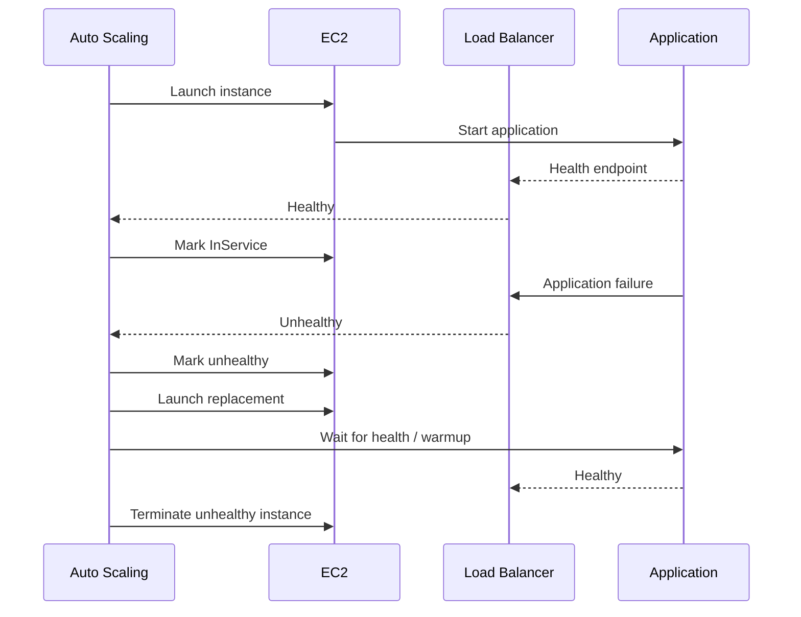
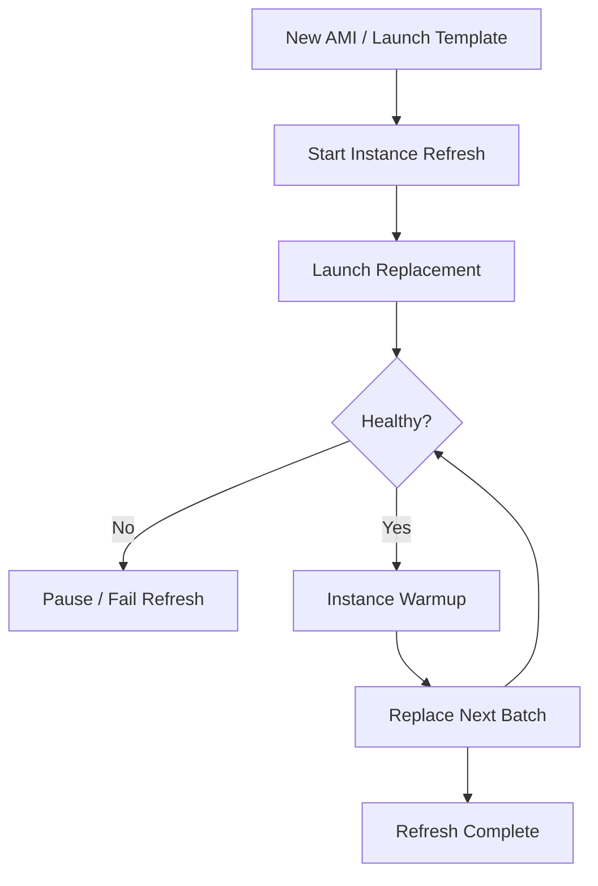

# 05- Auto Scaling Operations

## Overview

Amazon EC2 Auto Scaling manages the number of EC2 instances in an Auto Scaling Group (ASG) so that application capacity can respond to workload demand while maintaining configured capacity boundaries.

An Auto Scaling Group maintains a desired number of instances and can dynamically adjust that capacity between configured minimum and maximum values. It also replaces unhealthy instances to maintain the desired capacity. :contentReference[oaicite:0]{index=0}

A production ASG is not simply an "instance counter". It is an operational control plane connecting:

```text
Launch Template
       |
       v
Auto Scaling Group
       |
       +---- Desired / Min / Max Capacity
       |
       +---- Health Checks
       |
       +---- Scaling Policies
       |
       +---- Instance Warmup
       |
       +---- Instance Refresh
       |
       +---- Lifecycle Hooks
       |
       v
EC2 Fleet
       |
       v
Load Balancer
       |
       v
Application
```

For backend services such as Django, FastAPI, REST APIs, gRPC services, and Celery workers, Auto Scaling is most effective when instances are:

- Replaceable
- Reproducible
- Stateless where practical
- Health-checked
- Automatically configured
- Independently scalable

## Auto Scaling Group Fundamentals

An Auto Scaling Group defines the fleet-level behavior for a set of EC2 instances.

The most important capacity values are:

| Setting | Purpose |
|---|---|
| Minimum capacity | Lowest number of instances the group should maintain |
| Desired capacity | Current target number of instances |
| Maximum capacity | Upper bound for automatic scaling |
| Availability Zones | Locations across which instances can be distributed |
| Launch Template | Defines how new instances are launched |
| Health checks | Determine whether instances should remain in service |

Conceptually:

```text
Min Capacity
      |
      v
Desired Capacity
      |
      v
Max Capacity
```

The desired capacity can change as scaling policies respond to workload conditions, but it remains constrained by the minimum and maximum values. :contentReference[oaicite:1]{index=1}

## Capacity Model

Consider:

```text
Min     = 3
Desired = 6
Max     = 20
```

Normal operation:

```text
3 <= Desired <= 20
```

If demand increases:

```text
6 -> 8 -> 12 -> 16
```

If demand decreases:

```text
16 -> 12 -> 8 -> 6
```

The ASG should not automatically exceed:

```text
20
```

or fall below:

```text
3
```

unless an operator or configuration explicitly changes those limits.

## Desired Capacity Is Not a Health Guarantee

An ASG can have:

```text
Desired capacity = 6
```

while temporarily having fewer healthy instances because:

- Instances are launching
- Instances are terminating
- Instances are failing health checks
- An instance refresh is running
- Capacity is temporarily unavailable

Auto Scaling continuously works toward the desired state rather than guaranteeing that the desired state is immediately available. :contentReference[oaicite:2]{index=2}

## Launch Template as the Source of Instance Configuration

New instances should generally be reproducible from a Launch Template.

A Launch Template can define:

- AMI
- Instance type
- IAM instance profile
- Security Groups
- User Data
- EBS mappings
- Network configuration
- Key pair
- Metadata options

Architecture:

```text
Launch Template
      |
      +-- AMI
      +-- Instance Type
      +-- IAM Role
      +-- Security Groups
      +-- EBS
      +-- User Data
      |
      v
Auto Scaling Group
      |
      v
EC2 Instances
```

The ASG uses the current launch configuration when replacing or launching instances. :contentReference[oaicite:3]{index=3}

## Inspecting an Auto Scaling Group

```bash
aws autoscaling describe-auto-scaling-groups \
    --profile production \
    --region ap-south-1 \
    --auto-scaling-group-names production-api-asg
```

A compact query:

```bash
aws autoscaling describe-auto-scaling-groups \
    --profile production \
    --region ap-south-1 \
    --auto-scaling-group-names production-api-asg \
    --query 'AutoScalingGroups[0].{
        Name:AutoScalingGroupName,
        Min:MinSize,
        Desired:DesiredCapacity,
        Max:MaxSize,
        Zones:AvailabilityZones,
        HealthCheck:HealthCheckType,
        GracePeriod:HealthCheckGracePeriod,
        Instances:Instances[].{Id:InstanceId,State:LifecycleState,Health:HealthStatus}
    }' \
    --output json
```

## Changing Desired Capacity

Manual scaling is useful during:

- Incident response
- Planned traffic events
- Load testing
- Maintenance
- Temporary capacity changes

```bash
aws autoscaling set-desired-capacity \
    --profile production \
    --region ap-south-1 \
    --auto-scaling-group-name production-api-asg \
    --desired-capacity 8
```

Before changing desired capacity, verify the current limits:

```bash
aws autoscaling describe-auto-scaling-groups \
    --profile production \
    --region ap-south-1 \
    --auto-scaling-group-names production-api-asg \
    --query 'AutoScalingGroups[0].{Min:MinSize,Desired:DesiredCapacity,Max:MaxSize}' \
    --output table
```

Do not use manual desired-capacity changes as a permanent replacement for correctly configured scaling policies.

## Changing Minimum and Maximum Capacity

```bash
aws autoscaling update-auto-scaling-group \
    --profile production \
    --region ap-south-1 \
    --auto-scaling-group-name production-api-asg \
    --min-size 4 \
    --max-size 20
```

Changing limits affects future scaling behavior.

For example:

```text
Before:
Min=2
Desired=6
Max=10

After:
Min=4
Desired=6
Max=20
```

The desired capacity remains 6 unless explicitly changed.

## Scaling Policies

Scaling policies determine when and how desired capacity changes.

Common approaches include:

| Policy | Use case |
|---|---|
| Target tracking | Maintain a target utilization or throughput |
| Step scaling | Apply different adjustments based on metric severity |
| Scheduled scaling | Predictable traffic patterns |
| Predictive scaling | Forecast recurring demand |
| Simple scaling | Legacy/simple workloads; generally less preferred |

AWS recommends target tracking or step scaling over simple scaling for most modern dynamic scaling scenarios. :contentReference[oaicite:4]{index=4}

## Target Tracking

Target tracking maintains a target value for a metric.

Example:

```text
Target:
Average CPU = 50%

CPU rises:
50% -> 60% -> 70%

        |
        v

Scale out

CPU falls:
70% -> 55% -> 45%

        |
        v

Scale in
```

AWS describes target tracking as similar to a thermostat: the ASG adjusts capacity to keep the selected metric near the target. :contentReference[oaicite:5]{index=5}

Typical target metrics include:

- Average CPU utilization
- Average network utilization
- Application Load Balancer request count per target
- Custom CloudWatch metrics

## Target Tracking Example

Create a target-tracking policy using the AWS CLI:

```bash
aws autoscaling put-scaling-policy \
    --profile production \
    --region ap-south-1 \
    --auto-scaling-group-name production-api-asg \
    --policy-name target-cpu-50 \
    --policy-type TargetTrackingScaling \
    --target-tracking-configuration '{
        "PredefinedMetricSpecification": {
            "PredefinedMetricType": "ASGAverageCPUUtilization"
        },
        "TargetValue": 50.0
    }'
```

Auto Scaling creates and manages the CloudWatch alarms associated with a target-tracking policy. Operators should not manually modify those managed alarms. :contentReference[oaicite:6]{index=6}

## Choosing the Scaling Metric

CPU is not always the correct scaling metric.

For an API service:

```text
CPU
```

may work well if request processing is CPU-bound.

For an ALB-backed service:

```text
RequestCountPerTarget
```

can be more directly related to traffic.

For a Celery worker fleet:

```text
Queue depth
```

may be a better signal.

The scaling metric should correlate with the resource that actually limits useful throughput.

## Custom Metrics

A custom application metric can be useful when infrastructure metrics do not represent workload demand.

Examples:

```text
QueueDepth
ActiveJobs
RequestsPerSecond
MessagesPerSecond
PendingTasks
```

A Celery architecture might look like:

```text
Django / FastAPI
      |
      v
Redis / SQS / Kafka
      |
      v
Queue Depth
      |
      v
Auto Scaling Policy
      |
      v
Celery EC2 Fleet
```

The important requirement is that the metric must reliably represent capacity pressure.

## Step Scaling

Step scaling allows different capacity adjustments for different levels of pressure.

Example:

```text
CPU < 50%
    |
    v
No scale

CPU 50-70%
    |
    v
+1 instance

CPU 70-85%
    |
    v
+2 instances

CPU > 85%
    |
    v
+4 instances
```

This is useful when the relationship between demand and required capacity is not well represented by a single target.

AWS documents step scaling as a dynamic scaling approach that can continue responding to additional alarm breaches while scaling activity is in progress, unlike simple scaling. :contentReference[oaicite:7]{index=7}

## Scheduled Scaling

Scheduled scaling is appropriate for predictable demand.

Example:

```text
09:00 -> 10 instances
18:00 -> 4 instances
```

Typical use cases:

- Business-hour traffic
- Batch windows
- Known reporting periods
- Planned events

Scheduled scaling can reduce the time required for reactive scale-out.

## Scheduled Scaling Example

```bash
aws autoscaling put-scheduled-update-group-action \
    --profile production \
    --region ap-south-1 \
    --auto-scaling-group-name production-api-asg \
    --scheduled-action-name business-hours \
    --start-time "2026-09-21T09:00:00Z" \
    --min-size 6 \
    --desired-capacity 8 \
    --max-size 20
```

Use scheduled scaling when demand is predictable. Do not use it as the only mechanism for unpredictable traffic.

## Instance Warmup

New instances are not immediately equivalent to fully productive instances.

Typical lifecycle:

```text
Launch
  |
  v
Boot
  |
  v
User Data
  |
  v
Application startup
  |
  v
Registration
  |
  v
Health check
  |
  v
Warmup
  |
  v
Useful capacity
```

Warmup should account for:

- Operating-system startup
- Application startup
- Container startup
- Dependency initialization
- Cache initialization
- Load balancer registration

Target tracking uses instance warmup to avoid treating newly launched instances as fully representative too early. :contentReference[oaicite:8]{index=8}

## Default Instance Warmup

Set a default warmup value based on measured startup behavior.

```bash
aws autoscaling update-auto-scaling-group \
    --profile production \
    --region ap-south-1 \
    --auto-scaling-group-name production-api-asg \
    --default-instance-warmup 180
```

Do not choose a warmup value simply because a common example uses 300 seconds.

Measure:

```text
EC2 launch
    ->
application ready
    ->
ALB healthy
    ->
normal traffic capacity
```

Then configure accordingly.

## Health Checks

Auto Scaling can use health signals from multiple sources, including:

- EC2 status checks
- Elastic Load Balancing
- VPC Lattice
- Amazon EBS
- Custom health checks
- Application status checks

When an `InService` instance is determined to be unhealthy, Auto Scaling can replace it to maintain desired capacity. :contentReference[oaicite:9]{index=9}

## EC2 Health Checks

EC2 status checks are always enabled.

Auto Scaling evaluates EC2 system and instance status checks when determining instance health. If an instance leaves the `running` state or becomes impaired, Auto Scaling can mark it unhealthy and replace it. :contentReference[oaicite:10]{index=10}

This gives the ASG an infrastructure-level failure signal.

## ELB Health Checks

For an API behind an ALB:

```text
ALB
 |
 +--> EC2 #1 -> /health -> 200
 |
 +--> EC2 #2 -> /health -> 503
 |
 +--> EC2 #3 -> /health -> 200
```

If ELB health checks are enabled for the ASG and the load balancer reports an instance as unhealthy, Auto Scaling can replace the instance. :contentReference[oaicite:11]{index=11}

This is significantly more useful than checking only whether the EC2 instance is running.

## Health Check Grace Period

New instances may need time to become healthy.

Without appropriate startup tolerance:

```text
Launch
  |
  v
Application still starting
  |
  v
Health check fails
  |
  v
Instance replaced
  |
  v
New instance launches
  |
  v
Same failure
```

This can create a replacement loop.

Configure the grace period according to actual startup time:

```bash
aws autoscaling update-auto-scaling-group \
    --profile production \
    --region ap-south-1 \
    --auto-scaling-group-name production-api-asg \
    --health-check-grace-period 120
```

Do not use an excessively large grace period to hide a slow or broken startup process.

## Unhealthy Instance Replacement

A typical replacement flow is:



Auto Scaling has mechanisms to avoid replacing all unhealthy instances simultaneously and supports instance maintenance policies for controlling replacement capacity. :contentReference[oaicite:12]{index=12}

## Investigating Unhealthy Instances

List ASG instances:

```bash
aws autoscaling describe-auto-scaling-instances \
    --profile production \
    --region ap-south-1
```

Inspect a specific ASG:

```bash
aws autoscaling describe-auto-scaling-groups \
    --profile production \
    --region ap-south-1 \
    --auto-scaling-group-names production-api-asg \
    --query 'AutoScalingGroups[0].Instances[].{
        InstanceId:InstanceId,
        Health:HealthStatus,
        Lifecycle:LifecycleState,
        Protected:ProtectedFromScaleIn
    }' \
    --output table
```

Then inspect EC2 status:

```bash
aws ec2 describe-instance-status \
    --profile production \
    --region ap-south-1 \
    --instance-ids i-0123456789abcdef0
```

Then inspect target health:

```bash
aws elbv2 describe-target-health \
    --profile production \
    --region ap-south-1 \
    --target-group-arn "$TARGET_GROUP_ARN"
```

Correlate all three layers.

## Scaling Activities

Scaling activities explain what Auto Scaling is doing and why.

```bash
aws autoscaling describe-scaling-activities \
    --profile production \
    --region ap-south-1 \
    --auto-scaling-group-name production-api-asg \
    --max-items 20
```

Important information includes:

- Activity ID
- Status
- Cause
- Description
- Start time
- End time
- Details

When troubleshooting:

```text
Metric
  |
  v
Scaling Policy
  |
  v
Scaling Activity
  |
  v
Instance Launch / Termination
```

Inspecting only the current instance count often misses the actual reason for a scaling event.

## Scaling Activity Failure

A scale-out operation can fail because of:

- EC2 quota
- Insufficient capacity
- Invalid AMI
- Invalid Launch Template
- IAM permissions
- Subnet capacity
- Security Group configuration
- EBS limits
- Network configuration
- Unsupported instance configuration

Inspect the activity history before changing scaling policies.

## Availability Zone Distribution

For production workloads, distribute ASG instances across multiple Availability Zones.

Example:

```text
Region
 |
 +-- AZ-A
 |    +-- EC2
 |    +-- EC2
 |
 +-- AZ-B
 |    +-- EC2
 |    +-- EC2
 |
 +-- AZ-C
      +-- EC2
      +-- EC2
```

This reduces the impact of an individual Availability Zone failure.

Auto Scaling also has an `AZRebalance` process that can rebalance instances across configured Availability Zones when the group becomes unbalanced. :contentReference[oaicite:13]{index=13}

## Subnet Capacity

An ASG can be configured across multiple subnets/AZs, but subnet capacity still matters.

A subnet can run out of private IPv4 addresses even when the AWS account has enough EC2 quota.

Operationally check:

```text
ASG
 |
 +-- AZ-A -> Subnet A -> Available IPs
 |
 +-- AZ-B -> Subnet B -> Available IPs
```

Capacity planning must therefore include:

- Subnet IP capacity
- ENI limits
- Instance limits
- EC2 quotas
- EBS quotas

## Instance Refresh

Instance refresh provides a controlled way to replace existing instances after changing the AMI or Launch Template.

Typical use cases:

- New AMI
- OS patching
- Application image update
- Launch Template change
- Security configuration update
- Instance type migration

AWS supports replacing instances in batches and waiting for new instances to pass health checks and warm up before continuing. :contentReference[oaicite:14]{index=14}

## Instance Refresh Workflow



## Starting an Instance Refresh

```bash
aws autoscaling start-instance-refresh \
    --profile production \
    --region ap-south-1 \
    --auto-scaling-group-name production-api-asg \
    --preferences '{
        "MinHealthyPercentage": 100,
        "InstanceWarmup": 180
    }'
```

With a minimum healthy percentage of 100%, the refresh can launch replacements before terminating existing instances, helping maintain desired capacity during the refresh. :contentReference[oaicite:15]{index=15}

## Monitoring an Instance Refresh

```bash
aws autoscaling describe-instance-refreshes \
    --profile production \
    --region ap-south-1 \
    --auto-scaling-group-name production-api-asg
```

Monitor:

- Status
- Percentage complete
- Instances remaining
- Failure reason
- Rollback behavior where configured

Do not start a fleet-wide refresh without validating the new AMI or Launch Template on a representative subset.

## Canary Instance Refresh

A safer deployment pattern is:

```text
New AMI
   |
   v
Small test group
   |
   v
Health + metrics
   |
   v
Instance Refresh
   |
   v
Full fleet
```

This reduces the blast radius of:

- Broken startup scripts
- Missing packages
- Incorrect IAM permissions
- Invalid application configuration
- Health-check failures

## Instance Maintenance Policy

An instance maintenance policy controls the minimum and maximum healthy capacity that can be maintained while instances are replaced.

For example:

```text
Desired capacity = 10

Minimum healthy = 90%
Maximum healthy = 110%
```

This allows replacement operations to maintain a healthy baseline while temporarily adding capacity.

AWS provides instance maintenance policies specifically for replacement events such as instance refresh and health-check replacement. :contentReference[oaicite:16]{index=16}

## Launch-Before-Terminate

For critical services, maintaining capacity during replacement is often preferable.

```text
Existing fleet
    |
    v
Launch replacement
    |
    v
Health check
    |
    v
Warmup
    |
    v
Terminate old instance
```

This is particularly useful for:

- Small production fleets
- Latency-sensitive APIs
- Stateful migration processes
- Services with expensive startup

The trade-off is temporary additional capacity and cost.

## Lifecycle Hooks

Lifecycle hooks allow custom actions during instance launch and termination.

Typical states include:

```text
Launching
    |
    v
Pending:Wait
    |
    v
InService

Terminating
    |
    v
Terminating:Wait
    |
    v
Terminated
```

Lifecycle hooks can be used for:

- Configuration workflows
- Draining workloads
- Log collection
- External registration
- Stateful shutdown
- Custom orchestration

AWS documents lifecycle hooks as a mechanism for invoking custom actions when instances launch or before they terminate. :contentReference[oaicite:17]{index=17}

## Lifecycle Hook Example

A termination workflow might be:

```text
ASG decides to terminate
          |
          v
Lifecycle hook
          |
          v
Stop accepting new work
          |
          v
Finish active tasks
          |
          v
Persist required state
          |
          v
Complete lifecycle action
          |
          v
Terminate
```

For a Celery worker, this can help avoid terminating a worker while it is processing an important task.

Lifecycle hooks should not become indefinite blockers.

## Scale-In Protection

Scale-in protection can prevent selected instances from being terminated during scale-in.

This can be useful for:

- Long-running jobs
- Stateful processes
- Specialized workers

But it should not become a permanent workaround for poor workload design.

For example:

```text
Celery worker
    |
    +-- Long task
    |
    v
Scale-in protection
```

The protection should be removed when the workload is safely drainable.

## Standby Instances

An instance can be placed into standby for controlled maintenance or operational workflows.

Conceptually:

```text
InService
    |
    v
Standby
    |
    +-- Maintenance
    |
    v
InService
```

Standby can temporarily remove an instance from service while keeping it associated with the ASG.

Use this carefully because reducing active capacity can affect availability.

## Load Balancer Integration

A typical production architecture is:

```text
Internet
   |
   v
ALB
   |
   v
Target Group
   |
   +--------+--------+
   |        |        |
  EC2      EC2      EC2
   |        |        |
Django    Django    Django
   |        |        |
   +--------+--------+
            |
            v
       PostgreSQL
```

The ASG manages instance capacity.

The ALB manages traffic distribution.

The health check determines whether a target can receive traffic.

These responsibilities should remain conceptually separate.

## Health Check Path Design

A health endpoint should be:

- Fast
- Deterministic
- Lightweight
- Authenticated appropriately for the architecture
- Safe to call frequently

For example:

```http
GET /health
```

could return:

```json
{
  "status": "ok"
}
```

A readiness endpoint can be more dependency-aware:

```http
GET /ready
```

with:

```text
Application initialized
+
Required dependencies available
=
Ready
```

Avoid making every optional dependency a hard requirement for readiness.

## Auto Scaling for Django and FastAPI

For stateless APIs:

```text
ALB
 |
 v
ASG
 |
 +-- EC2
 |    +-- Nginx
 |    +-- Gunicorn/Uvicorn
 |    +-- Django/FastAPI
 |
 +-- EC2
 |    +-- Nginx
 |    +-- Gunicorn/Uvicorn
 |    +-- Django/FastAPI
 |
 v
Shared / Managed State
```

Externalize:

- Sessions
- Persistent files
- Database state
- Shared caches where required

Use services such as:

- PostgreSQL / RDS
- Redis
- S3
- EFS

depending on the application's requirements.

## Auto Scaling for Celery

Celery workers have a different scaling signal.

```text
Application
    |
    v
Queue
    |
    v
Celery Workers
    |
    v
Task Completion
```

Useful metrics include:

- Queue depth
- Task age
- Task processing time
- Worker utilization
- Failure rate

CPU-only scaling can be misleading.

A worker may have low CPU while the queue grows because tasks are waiting on I/O.

## Scaling and Downstream Dependencies

Adding EC2 capacity can overload dependencies.

Example:

```text
2 EC2
  |
  +--> PostgreSQL: 200 connections

Scale out

10 EC2
  |
  +--> PostgreSQL: 1000 connections
```

The application may scale successfully while PostgreSQL becomes the bottleneck.

Consider:

- Connection pooling
- Database capacity
- Redis capacity
- Kafka partitions
- External API rate limits
- Network bandwidth

## Scale-In Safety

Scale-in can be more dangerous than scale-out.

During scale-in:

```text
Instance selected
      |
      v
Stop accepting new work
      |
      v
Drain existing requests
      |
      v
Terminate
```

For HTTP services, ALB deregistration delay helps drain in-flight requests.

For workers, graceful shutdown should allow active tasks to complete or be safely retried.

Never assume termination is equivalent to graceful application shutdown.

## Connection Draining

When an instance is removed from an ALB target group, existing connections can be allowed to drain according to the configured deregistration delay.

The operational sequence is:

```text
Scale-in
   |
   v
Target deregistration
   |
   v
No new requests
   |
   v
Existing requests finish
   |
   v
Instance termination
```

This prevents terminating an instance while it is actively serving requests.

## Scaling Cooldowns

Older simple scaling policies use cooldown behavior to wait before additional scaling activity.

AWS recommends target tracking or step scaling instead of relying on simple scaling and cooldown-based behavior for modern dynamic scaling. :contentReference[oaicite:18]{index=18}

For target tracking and step scaling, instance warmup is generally the more relevant control for understanding when new capacity becomes representative. :contentReference[oaicite:19]{index=19}

## Scaling Oscillation

Poorly designed policies can cause:

```text
Scale out
   |
   v
Metric drops
   |
   v
Scale in
   |
   v
Metric rises
   |
   v
Scale out
```

This is scaling oscillation.

Common causes include:

- Target too aggressive
- Incorrect metric
- Insufficient warmup
- Long startup time
- Application caching behavior
- Traffic spikes
- Multiple competing policies

Monitor scaling activity together with workload metrics.

## Multiple Target Tracking Policies

Multiple target-tracking policies can be useful when more than one metric represents capacity pressure.

For example:

```text
CPU target = 50%
Request count target = 500 requests/target
```

AWS documents that with multiple target-tracking policies, Auto Scaling prioritizes availability: it can scale out if any policy indicates scale-out, while scale-in requires all applicable target-tracking policies to permit scale-in. :contentReference[oaicite:20]{index=20}

Use multiple policies only when the metrics represent meaningful independent capacity signals.

## Scaling Policy Ownership

Infrastructure as Code should normally own:

- ASG configuration
- Launch Template
- Scaling policies
- Health checks
- Maintenance policy
- Lifecycle hooks

Examples:

- Terraform
- CloudFormation
- AWS CDK

Manual CLI changes can be useful for incident response, but permanent configuration should have a defined source of truth.

## Safe Operational Workflow

Before changing an ASG:

```text
Verify identity
      |
      v
Verify region
      |
      v
Inspect ASG
      |
      v
Inspect desired/min/max
      |
      v
Inspect scaling policies
      |
      v
Inspect health
      |
      v
Inspect scaling activities
      |
      v
Make controlled change
      |
      v
Monitor
      |
      v
Verify service
```

Verify AWS identity first:

```bash
aws sts get-caller-identity \
    --profile production
```

This prevents accidental changes to the wrong account.

## Production Incident Workflow

When an ASG behaves unexpectedly:

### Check Current Capacity

```bash
aws autoscaling describe-auto-scaling-groups \
    --profile production \
    --region ap-south-1 \
    --auto-scaling-group-names production-api-asg \
    --query 'AutoScalingGroups[0].{Min:MinSize,Desired:DesiredCapacity,Max:MaxSize,Instances:Instances[].{Id:InstanceId,Health:HealthStatus,State:LifecycleState}}' \
    --output json
```

### Check Scaling Activities

```bash
aws autoscaling describe-scaling-activities \
    --profile production \
    --region ap-south-1 \
    --auto-scaling-group-name production-api-asg \
    --max-items 20
```

### Check EC2 Health

```bash
aws ec2 describe-instance-status \
    --profile production \
    --region ap-south-1 \
    --include-all-instances
```

### Check Load Balancer Health

```bash
aws elbv2 describe-target-health \
    --profile production \
    --region ap-south-1 \
    --target-group-arn "$TARGET_GROUP_ARN"
```

### Check CloudWatch Metrics

Correlate:

```text
CPU
Memory
Network
Request count
Latency
Errors
Queue depth
Target health
Instance count
```

Only then change the scaling configuration.

## Common Failure Pattern: Replacement Loop

A frequent production failure looks like:

```text
Launch
  |
  v
Application startup fails
  |
  v
ALB health check fails
  |
  v
ASG marks instance unhealthy
  |
  v
Instance terminated
  |
  v
Replacement launched
  |
  +---------> Same failure
```

Investigate:

- AMI
- Launch Template
- User Data
- IAM role
- Security Groups
- Application port
- Health-check path
- Environment variables
- Secrets
- Dependency connectivity

Do not increase `max-size` to solve a broken launch path.

## Common Failure Pattern: Slow Startup

```text
Launch
  |
  v
Long User Data
  |
  v
Application starts
  |
  v
Health check fails during startup
  |
  v
Replacement
```

Possible improvements:

- Pre-bake dependencies into the AMI
- Reduce User Data work
- Optimize application startup
- Configure appropriate health-check grace period
- Configure appropriate instance warmup
- Make health endpoints lightweight

## Common Failure Pattern: Database Saturation

```text
Traffic increases
      |
      v
ASG scales out
      |
      v
More application workers
      |
      v
More DB connections
      |
      v
PostgreSQL saturation
      |
      v
Application latency increases
```

The correct solution may involve:

- Connection pooling
- Database scaling
- Query optimization
- Caching
- Read replicas
- Backpressure
- Application-level concurrency control

More EC2 instances alone may make the incident worse.

## Capacity and Cost

Auto Scaling can reduce idle capacity, but scaling does not automatically guarantee cost efficiency.

Monitor:

- Minimum capacity
- Desired capacity
- Maximum capacity
- Average utilization
- Scale-out frequency
- Scale-in frequency
- Instance startup time
- Instance age
- On-Demand vs discounted capacity
- Unused baseline capacity

A group with:

```text
min = 20
desired = 20
max = 20
```

is effectively fixed-capacity even though it is technically an Auto Scaling Group.

## Spot Instances

Spot Instances can reduce cost for interruption-tolerant workloads.

Suitable workloads may include:

- Stateless workers
- Batch processing
- CI workloads
- Distributed processing
- Fault-tolerant Celery workers

Avoid treating Spot as equivalent to stable capacity.

Design for:

```text
Interruption
    |
    v
Task retry
    |
    v
Replacement capacity
```

## Security Considerations

Auto Scaling launches instances automatically, so launch-time security configuration must be correct.

Verify:

- IAM instance profile
- Security Groups
- IMDS configuration
- EBS encryption
- Logging
- SSM configuration
- AMI patch level
- Secrets retrieval
- Least-privilege permissions

A vulnerable Launch Template can replicate the vulnerability across the entire fleet.

## AMI and Patch Management

An immutable fleet should receive updates through new AMIs or equivalent controlled configuration changes.

Typical flow:

```text
Patched Base Image
       |
       v
Application Image
       |
       v
Launch Template Version
       |
       v
Instance Refresh
       |
       v
Rolling Fleet Update
```

This is safer than manually patching every instance and hoping replacements inherit the changes.

## Monitoring Auto Scaling

Monitor at least:

### Capacity

- Desired capacity
- Current capacity
- In-service instances
- Pending instances
- Terminating instances

### Health

- Unhealthy instances
- EC2 status failures
- ALB target health
- Replacement rate

### Scaling

- Scaling activities
- Policy actions
- Scale-out frequency
- Scale-in frequency

### Application

- Request rate
- Latency
- Error rate
- Queue depth
- Database latency

### Operational

- Launch failures
- Quota exhaustion
- Instance refresh failures
- Capacity errors

## Production Best Practices

- Use Launch Templates as the reproducible definition of new instances.
- Keep production instances replaceable whenever possible.
- Distribute capacity across multiple Availability Zones.
- Prefer target tracking or step scaling for dynamic workloads. :contentReference[oaicite:21]{index=21}
- Choose scaling metrics that correlate with actual workload capacity.
- Configure realistic instance warmup values.
- Use ELB health checks for applications behind load balancers.
- Keep health-check endpoints lightweight and reliable.
- Use instance refresh for controlled fleet updates.
- Use maintenance policies when replacement capacity must be constrained.
- Validate new AMIs before large-scale refreshes.
- Use lifecycle hooks only when there is a concrete operational requirement.
- Design workers and APIs for graceful scale-in.
- Monitor scaling activities, not only instance counts.
- Include downstream services in capacity planning.
- Keep quotas and subnet capacity ahead of expected growth.
- Use Infrastructure as Code as the long-term source of truth.
- Avoid making manual CLI changes that are not reflected in the declared configuration.
- Treat repeated replacement as a configuration or application failure until proven otherwise.

## Common Mistakes

### Using CPU as the Only Scaling Signal

CPU may not represent actual workload pressure.

**Avoid it:** use request count, queue depth, latency, or custom metrics when they better represent capacity.

### Setting the Maximum Capacity Too Low

A restrictive maximum can prevent the application from obtaining enough capacity during legitimate traffic spikes.

**Avoid it:** calculate the maximum from expected peak demand, failure scenarios, quotas, and cost constraints.

### Setting the Maximum Capacity Extremely High

A very high maximum can allow a broken scaling policy to create unexpectedly large infrastructure costs.

**Avoid it:** establish an intentional upper safety boundary.

### Using an Incorrect Health-Check Path

If `/health` requires a database query that frequently fails, healthy instances may be replaced unnecessarily.

**Avoid it:** define health semantics deliberately and distinguish liveness from readiness.

### Using an Excessive Grace Period

A very long grace period can hide broken instances.

**Avoid it:** measure startup time and configure a realistic grace period.

### Using an Insufficient Warmup Period

If instances are considered ready before they can handle real traffic, scaling decisions can become inaccurate.

**Avoid it:** measure the time from launch to stable application capacity.

### Manually Modifying ASG Instances

Changes made directly to an instance can disappear when the ASG replaces it.

**Avoid it:** modify the Launch Template, AMI, User Data, or infrastructure configuration.

### Refreshing the Entire Fleet Without Validation

A broken AMI can replace every instance with a broken version.

**Avoid it:** use canary validation and conservative instance refresh settings.

### Ignoring Downstream Dependencies

Scaling API instances can overload PostgreSQL, Redis, Kafka, or external APIs.

**Avoid it:** include the entire request and data flow in capacity planning.

### Treating Desired Capacity as Actual Capacity

Desired capacity is a target, not proof that all instances are healthy and serving traffic.

**Avoid it:** inspect instance lifecycle, health, and load balancer target state.

## Interview Traps

### What Is the Difference Between Minimum, Desired, and Maximum Capacity?

- **Minimum** is the lower capacity boundary.
- **Desired** is the current target capacity.
- **Maximum** is the upper capacity boundary for automatic scaling.

### What Happens When an ASG Instance Becomes Unhealthy?

Auto Scaling can mark it unhealthy and replace it to maintain the group's desired capacity. Health signals can come from EC2, ELB, EBS, VPC Lattice, application status checks, and custom health checks depending on configuration. :contentReference[oaicite:22]{index=22}

### Why Use a Load Balancer Health Check Instead of Only an EC2 Status Check?

An EC2 status check can establish that the infrastructure and instance are functioning, but it does not prove that the application is correctly serving traffic.

An ALB health check can validate the application endpoint from the traffic-serving path.

### What Is Instance Warmup?

Instance warmup is the period during which a newly launched instance is initializing and should not yet be treated as fully representative capacity for scaling decisions. Target tracking uses warmup to improve scaling behavior. :contentReference[oaicite:23]{index=23}

### What Is Instance Refresh?

Instance refresh is a controlled mechanism for replacing instances in an ASG, commonly after changing an AMI or Launch Template. It can replace instances in batches while checking health and warmup. :contentReference[oaicite:24]{index=24}

### Why Is Target Tracking Often Preferred Over Simple Scaling?

Target tracking directly attempts to maintain a target utilization or throughput value and manages its associated alarms. AWS recommends target tracking or step scaling over simple scaling for modern dynamic scaling workloads. :contentReference[oaicite:25]{index=25}

### What Is a Lifecycle Hook?

A lifecycle hook pauses an instance at a lifecycle transition so custom actions can be performed before the instance continues to `InService` or terminates. :contentReference[oaicite:26]{index=26}

### Why Can an ASG Keep Replacing Instances Forever?

Common causes include:

- Broken AMI
- Invalid User Data
- Incorrect health-check path
- Application startup failure
- Security Group misconfiguration
- Missing IAM permissions
- Missing secrets
- Dependency connectivity problems

The ASG is often correctly detecting a broken instance; the underlying launch or application configuration is the real problem.

## Production Operations Checklist

### Before Changing Capacity

- [ ] Verify AWS account and Region
- [ ] Inspect current min/desired/max
- [ ] Check current healthy instance count
- [ ] Check scaling policies
- [ ] Check scaling activity history
- [ ] Check quotas
- [ ] Check subnet capacity
- [ ] Check downstream capacity

### Before Instance Refresh

- [ ] Validate AMI
- [ ] Validate Launch Template
- [ ] Test application startup
- [ ] Verify IAM permissions
- [ ] Verify security groups
- [ ] Verify health-check path
- [ ] Define warmup
- [ ] Define minimum healthy capacity
- [ ] Start with a controlled rollout

### During Incident Response

- [ ] Identify whether the problem is capacity or application health
- [ ] Inspect scaling activities
- [ ] Inspect EC2 status
- [ ] Inspect ALB target health
- [ ] Check CloudWatch metrics
- [ ] Check application logs
- [ ] Check downstream dependencies
- [ ] Avoid uncontrolled capacity increases
- [ ] Preserve evidence before terminating resources

### After Recovery

- [ ] Confirm desired capacity
- [ ] Confirm all instances are healthy
- [ ] Confirm ALB targets are healthy
- [ ] Confirm application latency and errors recovered
- [ ] Review scaling activity
- [ ] Investigate the root cause
- [ ] Update Infrastructure as Code if configuration changed
- [ ] Document operational findings

## Key Takeaways

- **An Auto Scaling Group is a fleet-management system, not just an instance counter:** it combines capacity limits, health checks, scaling policies, launch configuration, replacement, and lifecycle controls. :contentReference[oaicite:27]{index=27}
- **Scale on the metric that represents real workload pressure:** CPU is useful for some workloads, while request count, queue depth, throughput, or custom metrics may be better for others. :contentReference[oaicite:28]{index=28}
- **Health checks and warmup determine whether Auto Scaling replaces or trusts instances:** incorrect health endpoints or timing values can create replacement loops or premature scaling decisions. :contentReference[oaicite:29]{index=29}
- **Use controlled replacement mechanisms for fleet changes:** instance refresh, maintenance policies, health validation, and appropriate warmup reduce the risk of taking a production fleet offline during AMI or Launch Template changes. :contentReference[oaicite:30]{index=30}
- **Capacity must include dependencies and failure scenarios:** scaling EC2 without considering databases, caches, queues, network limits, quotas, and Availability Zones can simply move the bottleneck elsewhere.