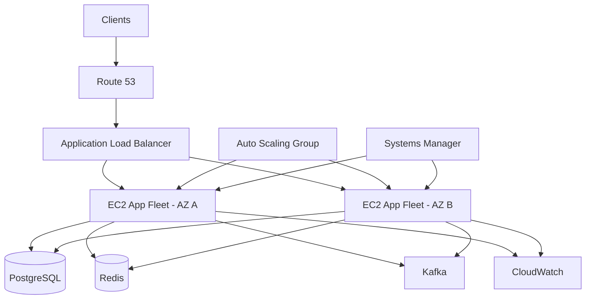

# README

## Overview

This folder contains the operational documentation required to run, troubleshoot, scale, secure, recover, and optimize production AWS EC2 environments.

The focus is on **day-2 operations** rather than introductory EC2 concepts. The documentation covers monitoring, health checks, capacity planning, storage, Auto Scaling, load balancing, backups, lifecycle management, cost optimization, service quotas, and production operating standards.

The operational model used throughout this section is:

```text
                         Production Traffic
                                |
                                v
                        Load Balancer
                                |
                   +------------+------------+
                   |                         |
                   v                         v
                AZ-a                       AZ-b
                   |                         |
              +----+----+               +----+----+
              |  EC2   |               |  EC2   |
              |  Fleet |               |  Fleet |
              +----+----+               +----+----+
                   |                         |
                   +------------+------------+
                                |
             +------------------+------------------+
             |                  |                  |
             v                  v                  v
        PostgreSQL            Redis              Kafka
```

Production EC2 operations should treat instances as replaceable compute resources and should rely on automation, observability, controlled changes, and tested recovery procedures rather than manual server maintenance.

## Navigation

| # | File | Description |
|---|---|---|
| 01 | [01- EC2 Monitoring and Observability](./01-%20EC2%20Monitoring%20and%20Observability.md) | CloudWatch metrics, logs, alarms, dashboards, and operational visibility |
| 02 | [02- Instance Health and Status Checks](./02-%20Instance%20Health%20and%20Status%20Checks.md) | EC2 status checks, scheduled events, impaired instances, and recovery |
| 03 | [03- Capacity and Resource Management](./03-%20Capacity%20and%20Resource%20Management.md) | Resource utilization, right-sizing, instance selection, quotas, and capacity planning |
| 04 | [04- Storage Operations](./04-%20Storage%20Operations.md) | EBS operations, resizing, utilization, snapshots, and storage lifecycle |
| 05 | [05- Auto Scaling Operations](./05-%20Auto%20Scaling%20Operations.md) | ASG capacity, scaling policies, health checks, and instance refresh |
| 06 | [06- Load Balancer Operations](./06-%20Load%20Balancer%20Operations.md) | Load balancer health, target registration, listener management, and routing |
| 07 | [07- Backup and Recovery](./07-%20Backup%20and%20Recovery.md) | EBS snapshot backup, AMI creation, cross-region recovery, and RTO/RPO planning |
| 08 | [08- Instance Lifecycle Operations](./08-%20Instance%20Lifecycle%20Operations.md) | Launch, stop, start, reboot, terminate, and instance replacement procedures |
| 09 | [09- Cost Optimization](./09-%20Cost%20Optimization.md) | Right-sizing, Savings Plans, Reserved Instances, Spot, and cost monitoring |
| 10 | [10- Service Limits and Quotas](./10-%20Service%20Limits%20and%20Quotas.md) | EC2 service quotas, limit monitoring, quota increase requests, and capacity reservations |
| 11 | [11- Production Best Practices](./11-%20Production%20Best%20Practices.md) | Production operating standards, automation, security, and operational readiness |

## Documentation Structure

| File | Focus |
|---|---|
| `01- EC2 Monitoring and Observability.md` | CloudWatch metrics, logs, alarms, dashboards, application visibility, and operational observability |
| `02- Instance Health and Status Checks.md` | EC2 status checks, scheduled events, impaired instances, recovery, and health troubleshooting |
| `03- Capacity and Resource Management.md` | Resource utilization, right-sizing, instance selection, quotas, capacity planning, and resource exhaustion |
| `04- Storage Operations.md` | EBS and instance storage operations, resizing, utilization, snapshots, attachment issues, and storage lifecycle |
| `05- Auto Scaling Operations.md` | ASG capacity, scaling policies, health checks, replacement behavior, instance refresh, and scaling incidents |
| `06- Load Balancer Operations.md` | Load balancer operation, target registration, health checks, listeners, connection draining, and maintenance |
| `07- Backup and Recovery.md` | EBS snapshots, AMIs, backup validation, restoration, RPO/RTO, and disaster recovery |
| `08- Instance Lifecycle Operations.md` | Launch, stop, start, reboot, termination, replacement, maintenance, and scheduled events |
| `09- Cost Optimization.md` | Right-sizing, purchasing strategies, utilization, storage, networking, idle resources, and cost control |
| `10- Service Limits and Quotas.md` | EC2, EBS, networking, Auto Scaling, API throttling, quota inspection, and quota increases |
| `11- Production Best Practices.md` | Production architecture, security, patching, access, monitoring, backups, reliability, and safe changes |

## Operational Areas

The documentation can be viewed as several related operational domains.

```text
EC2 Operations
|
+-- Observability
|   +-- Metrics
|   +-- Logs
|   +-- Alarms
|   +-- Dashboards
|   +-- Health
|
+-- Capacity
|   +-- CPU
|   +-- Memory
|   +-- Network
|   +-- EBS
|   +-- IP Capacity
|   +-- Service Quotas
|
+-- Compute Lifecycle
|   +-- Launch
|   +-- Stop
|   +-- Start
|   +-- Reboot
|   +-- Replace
|   +-- Terminate
|
+-- Scaling
|   +-- Auto Scaling
|   +-- Instance Refresh
|   +-- Health Checks
|   +-- Scaling Policies
|
+-- Traffic
|   +-- Load Balancers
|   +-- Target Health
|   +-- Listeners
|   +-- Connection Draining
|
+-- Storage
|   +-- EBS
|   +-- Snapshots
|   +-- Filesystems
|   +-- Instance Store
|
+-- Recovery
|   +-- Backups
|   +-- Restore
|   +-- DR
|   +-- Failure Recovery
|
+-- Cost
|   +-- Right-Sizing
|   +-- Purchasing
|   +-- Storage
|   +-- Network
|
+-- Production Standards
    +-- Security
    +-- Access
    +-- Patching
    +-- Tagging
    +-- Change Management
```

## Recommended Reading Order

For someone learning EC2 operations from an intermediate backend-engineering level, the recommended progression is:

```text
Monitoring
    |
    v
Health
    |
    v
Capacity
    |
    v
Storage
    |
    v
Auto Scaling
    |
    v
Load Balancing
    |
    v
Backup & Recovery
    |
    v
Lifecycle
    |
    v
Cost
    |
    v
Quotas
    |
    v
Production Best Practices
```

This sequence moves from understanding the current state of a production fleet toward designing and operating resilient infrastructure.

## Monitoring and Observability

**`01- EC2 Monitoring and Observability.md`** covers the visibility required to operate EC2 reliably.

Key areas include:

- CloudWatch metrics
- CPU utilization
- CPU credit behavior
- Network metrics
- EBS metrics
- Status checks
- CloudWatch Logs
- CloudWatch Agent
- Application logs
- Structured logging
- Alarms
- Dashboards
- Correlation IDs
- Application and infrastructure observability

The important operational distinction is:

```text
EC2 Healthy
    !=
Application Healthy
```

Infrastructure metrics should therefore be combined with application-level signals such as latency, error rate, queue depth, database connections, and target health.

## Instance Health

**`02- Instance Health and Status Checks.md`** covers diagnosing whether an EC2 instance and its underlying infrastructure are healthy.

Important concepts include:

- System status checks
- Instance status checks
- EBS-related health
- Application health
- Scheduled events
- Automatic recovery
- Auto Scaling replacement
- Systems Manager diagnostics
- Incident response

A running instance is not automatically a healthy application server.

## Capacity and Resource Management

**`03- Capacity and Resource Management.md`** covers the resources that determine how much workload an EC2 fleet can handle.

The analysis should include more than CPU:

```text
Application Load
      |
      +-- CPU
      +-- Memory
      +-- Network
      +-- EBS
      +-- Connections
      +-- File Descriptors
      |
      v
EC2 Capacity
      |
      v
Downstream Capacity
      |
      +-- PostgreSQL
      +-- Redis
      +-- Kafka
      +-- External APIs
```

Topics include:

- Right-sizing
- Instance families
- Scale-up vs scale-out
- Capacity headroom
- Failure capacity
- Service quotas
- Subnet IP capacity
- EBS performance
- Dependency capacity

## Storage Operations

**`04- Storage Operations.md`** covers operational management of EC2 storage.

Key areas include:

- EBS volumes
- Volume attachment
- Volume modification
- Filesystem expansion
- Filesystem utilization
- Inodes
- Snapshots
- Backup
- Delete-on-termination behavior
- Instance store
- Database storage
- Storage monitoring

A production storage workflow should distinguish:

```text
EBS Volume
    |
    v
Partition
    |
    v
Filesystem
    |
    v
Application
```

Increasing the EBS volume size does not necessarily expand the filesystem automatically.

## Auto Scaling Operations

**`05- Auto Scaling Operations.md`** covers day-2 operation of Auto Scaling Groups.

Topics include:

- Minimum, desired, and maximum capacity
- Launch Templates
- Target tracking
- Step scaling
- Scheduled scaling
- Health checks
- Unhealthy instance replacement
- Instance refresh
- Lifecycle hooks
- Scale-in protection
- Standby instances
- Scaling activities
- AZ distribution
- Replacement troubleshooting

The fundamental operational model is:

```text
Desired Capacity
       |
       v
ASG
       |
       +-- Healthy instance
       +-- Healthy instance
       +-- Unhealthy instance
       |
       v
Replacement / Scaling
```

An ASG should be able to replace an unhealthy instance without requiring an engineer to manually rebuild the server.

## Load Balancer Operations

**`06- Load Balancer Operations.md`** covers EC2-backed load balancing.

Topics include:

- ALB and NLB
- Listeners
- Target groups
- Target registration
- Target health
- Health checks
- Security Group relationships
- TLS termination
- SNI
- Connection draining
- Auto Scaling integration
- Long-lived connections
- gRPC considerations

A common production flow is:

```text
Client
  |
  v
ALB
  |
  v
Target Group
  |
  +--> EC2
  +--> EC2
  +--> EC2
```

Target health must be investigated independently from EC2 instance state.

## Backup and Recovery

**`07- Backup and Recovery.md`** covers protection and restoration of EC2 workloads.

Important areas include:

- RPO
- RTO
- EBS snapshots
- AMIs
- AWS Backup
- Application-consistent backups
- Database-native backups
- Cross-Region recovery
- Cross-account recovery
- Encryption
- Backup retention
- Restore validation
- Disaster recovery strategies

The operational principle is:

```text
Backup Exists
    !=
Recovery Works
```

Recovery procedures should be tested rather than assumed to work.

## Instance Lifecycle Operations

**`08- Instance Lifecycle Operations.md`** covers safe management of the EC2 lifecycle.

Topics include:

- Launch
- Start
- Stop
- Reboot
- Termination
- Stop protection
- Termination protection
- Scheduled events
- Instance replacement
- Instance refresh
- User Data
- Public and private IP behavior
- Graceful shutdown
- Lifecycle hooks

Production systems should avoid treating lifecycle operations as isolated manual actions. They should be integrated with load balancing, Auto Scaling, application shutdown behavior, and infrastructure automation.

## Cost Optimization

**`09- Cost Optimization.md`** covers controlling EC2-related operating costs without compromising reliability.

Areas include:

- Right-sizing
- Instance families
- On-Demand
- Spot
- Savings Plans
- Auto Scaling
- EBS costs
- Snapshots
- Public IPv4
- Elastic IPs
- Load balancers
- NAT Gateway
- Data transfer
- CloudWatch costs
- Idle resources

Cost should be evaluated against useful workload capacity rather than simply minimizing the hourly price of an instance.

## Service Limits and Quotas

**`10- Service Limits and Quotas.md`** covers AWS boundaries that can prevent otherwise valid architectures from scaling.

Relevant constraints include:

- EC2 vCPU quotas
- EBS limits
- ENI limits
- IP capacity
- Security Group limits
- Load balancer limits
- Auto Scaling limits
- API throttling
- Subnet capacity
- Availability Zone capacity

Capacity planning should account for:

```text
Normal Capacity
+
Peak Capacity
+
Failure Capacity
+
Deployment Capacity
+
DR Capacity
<
Available Infrastructure Capacity
```

## Production Best Practices

**`11- Production Best Practices.md`** consolidates the operating standards expected for production EC2 environments.

Major areas include:

- Multi-AZ architecture
- Immutable infrastructure
- Infrastructure as Code
- Auto Scaling
- Load balancing
- IAM roles
- Systems Manager
- IMDSv2
- Security Groups
- Private networking
- Patch management
- AMI management
- Centralized logging
- Monitoring
- Backup and recovery
- Graceful shutdown
- Deployment strategies
- Rollback
- Resource tagging
- Cost management
- Incident response

The key production principle is:

```text
Reproducible Infrastructure
          +
Automated Operations
          +
Observability
          +
Controlled Change
          +
Tested Recovery
          =
Operable Production EC2
```

## Operational Dependencies

EC2 should not be operated as an isolated service.

A production backend commonly depends on:

| Dependency | EC2 Operational Concern |
|---|---|
| ALB | Target health, listener configuration, connection draining |
| PostgreSQL | Connection capacity, latency, backups, failover |
| Redis | Memory, connections, latency, eviction |
| Kafka | Consumer lag, partitions, rebalancing |
| S3 | Object storage, artifacts, backups |
| IAM | Instance roles and authorization |
| CloudWatch | Metrics, logs, alarms |
| Systems Manager | Access, patching, operational automation |
| Route 53 | DNS resolution and routing |
| VPC | Subnets, routing, security, IP capacity |

Scaling EC2 without considering these dependencies can simply move the bottleneck elsewhere.

## Production Architecture Reference

A typical backend deployment can combine the operational concepts covered in this section:



This architecture separates:

- Traffic management
- Compute
- Scaling
- Data
- Messaging
- Observability
- Operational access

## CLI and Operations Relationship

This folder focuses on **operations**, while the dedicated EC2 CLI section provides the command-level tooling used to perform those operations.

The relationship is:

```text
EC2 CLI
   |
   v
Inspect / Change Resources
   |
   v
Operational Procedure
   |
   v
Monitoring / Validation
   |
   v
Runbook / Automation
```

Use the CLI documentation when the task requires exact AWS CLI commands. Use the operations documentation when the task requires understanding **what to inspect, why to inspect it, and how to operate the environment safely**.

## Practical Backend Scenarios

The operational documentation should support scenarios such as:

### API Fleet Has High Latency

Investigate:

```text
ALB
 |
 +-- Target health
 +-- Request count
 +-- Latency
 |
 v
EC2
 |
 +-- CPU
 +-- Memory
 +-- Network
 +-- EBS
 |
 v
Application
 |
 +-- DB latency
 +-- Redis latency
 +-- External APIs
```

### ASG Cannot Reach Desired Capacity

Investigate:

```text
ASG Activity
     |
     v
Launch Failure
     |
     +--> EC2 quota
     +--> Subnet IP capacity
     +--> AZ capacity
     +--> Launch Template
     +--> IAM
     +--> EBS
```

### Instance Becomes Unhealthy

Investigate:

```text
EC2 State
   |
   +-- System status
   +-- Instance status
   +-- EBS status
   |
   v
ALB Target Health
   |
   v
Application Health
   |
   v
Logs / Metrics
```

### Deployment Causes Errors

Investigate:

```text
Deployment
    |
    +-- AMI
    +-- Launch Template
    +-- Application Version
    +-- Configuration
    +-- Database Migration
    |
    v
Target Health
    |
    v
Application Metrics
    |
    +--> Healthy
    |
    +--> Rollback
```

## Production Operating Model

A mature EC2 environment should move from manual operations toward automation.

```text
Manual Operation
      |
      v
Documented Procedure
      |
      v
Repeatable Runbook
      |
      v
Automated Workflow
      |
      v
Infrastructure as Code
      |
      v
Policy + Observability
```

Not every operation needs to be fully automated, but recurring operational work should be evaluated for automation.

## Common Operational Principles

### Prefer Replacement Over Repair

If an instance is reproducible, replacing it is often safer than performing undocumented repairs.

### Prefer Automation Over Manual Configuration

Configuration should be represented in IaC, AMIs, deployment artifacts, or managed configuration systems.

### Prefer Private Access

Expose only the components that must be publicly reachable.

### Prefer Health-Based Routing

Traffic should be sent only to instances that can actually serve requests.

### Prefer Observable Systems

Every important operational action should have sufficient metrics, logs, and audit information.

### Prefer Tested Recovery

Recovery procedures should be exercised periodically.

### Prefer Explicit Ownership

Every production resource should have a team, service, or owner.

## Related Topics

This section works best alongside other AWS and backend-engineering documentation covering:

- VPC
- IAM
- AWS CLI
- CloudWatch
- S3
- Route 53
- EBS
- Load Balancing
- Auto Scaling
- PostgreSQL
- Redis
- Kafka
- Docker
- Kubernetes
- CI/CD
- Infrastructure as Code
- System Design

## Key Takeaways

- **Operate EC2 as a system, not as individual servers:** monitoring, health, scaling, networking, storage, dependencies, and recovery must be considered together.
- **Use automation and replaceable infrastructure:** Launch Templates, Auto Scaling, IaC, controlled AMIs, and deployment automation reduce configuration drift and operational risk.
- **Design for failure and recovery:** Multi-AZ deployment, health checks, backups, tested restoration, graceful shutdown, and dependency-aware capacity planning are core production concerns.
- **Use the operational documents together:** monitoring identifies problems, health and capacity documentation explains them, lifecycle and scaling procedures provide remediation, and production practices establish the operating standard.
- **Keep operations observable, secure, and reversible:** least-privilege access, centralized telemetry, controlled changes, rollback procedures, ownership, and runbooks make EC2 environments maintainable at scale.