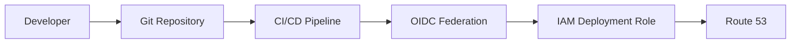
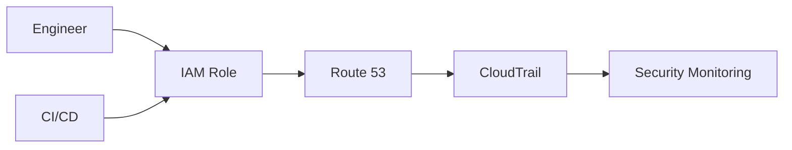
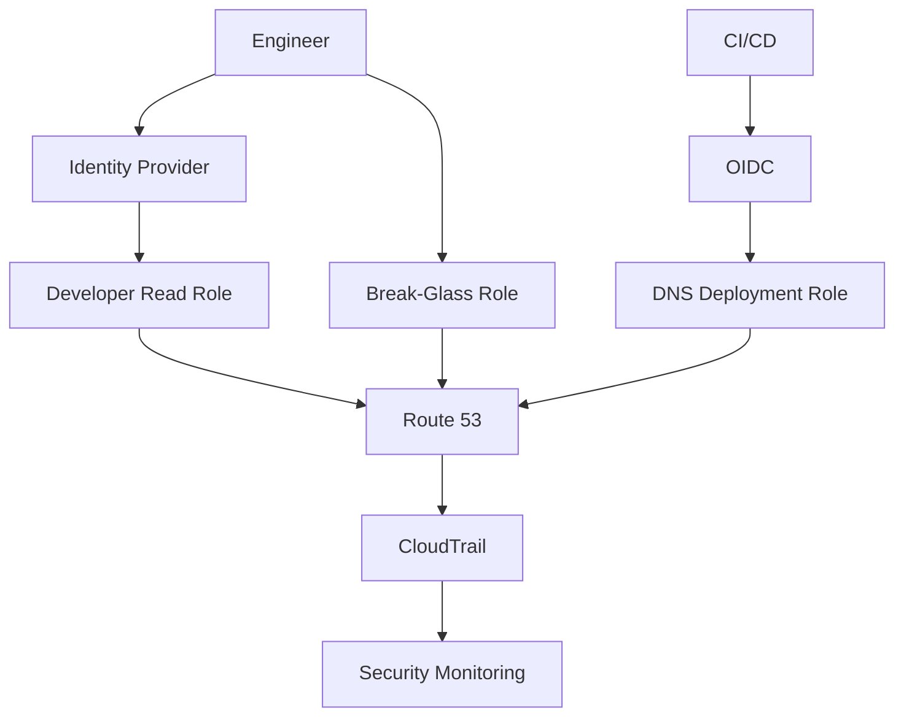

# 01- IAM and Access Control

## Overview

Amazon Route 53 is a critical control plane for production DNS, so access to Route 53 resources must be treated as infrastructure-level access.

AWS Identity and Access Management (IAM) controls **who can perform Route 53 API operations, which resources they can access, and under what conditions**. This is separate from DNS behavior itself: IAM controls management-plane operations such as creating records, changing routing policies, and deleting hosted zones, while Route 53 handles DNS queries through its data plane.

For backend engineers, the important distinction is:

```text
IAM
 │
 ├── Who can manage Route 53?
 ├── What Route 53 actions can they perform?
 └── Which resources can they modify?
          │
          ▼
Route 53 Control Plane
          │
          ▼
Hosted Zones / Records / Health Checks
          │
          ▼
DNS Data Plane
          │
          ▼
DNS Clients
```

A production Route 53 security model should therefore provide:

- Least-privilege permissions
- Role-based access
- Short-lived credentials
- Separation between deployment and human access
- Resource-level restrictions where supported
- Explicit controls around hosted-zone and record changes
- Auditable DNS modifications
- Strong protection against accidental deletion or takeover

---

## IAM and Route 53 Responsibilities

IAM and Route 53 solve different problems.

| Component | Responsibility |
|---|---|
| IAM | Authentication and authorization for AWS API operations |
| Route 53 | DNS hosting, routing, health checks, domain operations |
| Route 53 Resolver | DNS resolution inside AWS and hybrid environments |
| CloudTrail | Audit trail for supported AWS API activity |
| AWS Organizations | Account-level governance and boundaries |
| AWS Config / Security tooling | Configuration and compliance visibility |

A useful distinction is:

```text
"Can this identity modify DNS?"
                │
                ▼
              IAM

"What DNS answer should clients receive?"
                │
                ▼
            Route 53
```

IAM does not determine whether `api.example.com` resolves to an ALB.

It determines whether an identity is allowed to modify the Route 53 configuration that controls that answer.

---

## Route 53 Management Plane vs DNS Data Plane

This distinction is important during security reviews and incident response.

### Management Plane

The management plane consists of AWS API operations such as:

```text
CreateHostedZone
ChangeResourceRecordSets
DeleteHostedZone
GetHostedZone
ListHostedZones
CreateHealthCheck
DeleteHealthCheck
```

These operations are authorized through IAM.

### DNS Data Plane

DNS clients query authoritative Route 53 nameservers:

```text
Client
   │
   │ DNS query
   ▼
Recursive Resolver
   │
   ▼
Route 53 Authoritative DNS
   │
   ▼
DNS Response
```

A normal DNS query does not authenticate using an IAM user or IAM role.

This means an IAM policy such as:

```text
Allow ChangeResourceRecordSets
```

controls the ability to **change DNS records**, not the ability of clients to perform DNS queries.

---

## Why Route 53 Access Requires Strong Controls

A Route 53 record change can have consequences far beyond DNS.

For example:

```text
Attacker gains DNS modification permission
              │
              ▼
Changes api.example.com
              │
              ▼
Traffic redirected to attacker-controlled infrastructure
              │
              ├── Credential theft
              ├── Session interception
              ├── Phishing
              └── Application compromise
```

DNS is therefore part of the application's security boundary.

A compromised identity with Route 53 write permissions may be able to redirect:

- API traffic
- Web traffic
- Authentication endpoints
- Email-related records
- Verification records
- Internal service names

The impact depends on which DNS records and zones the identity can modify.

---

## IAM Policy Structure

A Route 53 IAM policy normally contains:

```text
Effect
Action
Resource
Condition
```

For example:

```json
{
  "Version": "2012-10-17",
  "Statement": [
    {
      "Sid": "ReadRoute53",
      "Effect": "Allow",
      "Action": [
        "route53:GetHostedZone",
        "route53:ListHostedZones",
        "route53:ListResourceRecordSets"
      ],
      "Resource": "*"
    }
  ]
}
```

This provides read-only access to selected Route 53 operations.

The important security principle is:

> Grant the smallest set of actions required to perform the job.

---

## Common Route 53 IAM Actions

Some commonly encountered actions include:

| Action | Purpose |
|---|---|
| `route53:ListHostedZones` | List hosted zones |
| `route53:GetHostedZone` | Retrieve hosted-zone information |
| `route53:ListResourceRecordSets` | Read DNS records |
| `route53:ChangeResourceRecordSets` | Create, update, or delete records |
| `route53:CreateHostedZone` | Create a hosted zone |
| `route53:DeleteHostedZone` | Delete a hosted zone |
| `route53:CreateHealthCheck` | Create a health check |
| `route53:DeleteHealthCheck` | Delete a health check |
| `route53:GetHealthCheck` | Read health-check configuration |
| `route53:ListTagsForResource` | Read resource tags |

Not every Route 53 API operation supports the same resource-level authorization model, so policies should be checked against the current AWS authorization reference rather than assuming every action can be restricted to an individual record.

---

## Read-Only Access

Developers, support engineers, and incident responders often need to inspect DNS without modifying it.

A read-only policy can allow:

```json
{
  "Version": "2012-10-17",
  "Statement": [
    {
      "Sid": "Route53ReadOnly",
      "Effect": "Allow",
      "Action": [
        "route53:GetHostedZone",
        "route53:ListHostedZones",
        "route53:ListResourceRecordSets",
        "route53:GetHealthCheck",
        "route53:ListTagsForResource"
      ],
      "Resource": "*"
    }
  ]
}
```

This is preferable to granting broad administrative access simply because someone needs to troubleshoot:

```bash
dig api.example.com
```

or inspect the configured records.

---

## Record Modification Permissions

The most security-sensitive Route 53 permission in many application environments is:

```text
route53:ChangeResourceRecordSets
```

This action can modify records within an authorized hosted zone.

A deployment pipeline may require this permission to update records during:

- Blue/green deployments
- DNS-based migrations
- Disaster recovery
- Environment provisioning
- Automated certificate validation
- Infrastructure deployment

However, granting it broadly can create significant blast radius.

A production policy should restrict the permission to the required hosted zone whenever the authorization model supports the desired resource scope.

---

## Resource-Level Least Privilege

Consider two policies.

### Broad

```json
{
  "Effect": "Allow",
  "Action": "route53:ChangeResourceRecordSets",
  "Resource": "*"
}
```

### Restricted

```json
{
  "Effect": "Allow",
  "Action": "route53:ChangeResourceRecordSets",
  "Resource": "arn:aws:route53:::hostedzone/Z1234567890"
}
```

The second approach limits the identity's write capability to a specific hosted zone.

The exact resource support and ARN format should always be validated against the current Route 53 IAM authorization model.

The important engineering principle is:

```text
Account
   │
   ├── Production hosted zone
   ├── Staging hosted zone
   └── Development hosted zone

Deployment role
   │
   └── Only required environment
```

Do not give a staging deployment role permission to modify production DNS simply because both environments use Route 53.

---

## Environment Isolation

A common production architecture separates AWS environments:

```text
AWS Organization
│
├── Production Account
│   └── production.example.com
│
├── Staging Account
│   └── staging.example.com
│
└── Development Account
    └── dev.example.com
```

This provides stronger isolation than relying only on IAM policy conditions.

For example:

```text
Staging deployment role
        │
        ▼
Staging AWS Account
        │
        ▼
Staging Route 53 Zone
```

The role cannot accidentally modify a production hosted zone because production resources exist in a separate account.

This is a powerful defense-in-depth strategy.

---

## IAM Roles vs IAM Users

For modern AWS environments, human access should generally use federated identities and IAM roles rather than long-lived IAM user access keys.

A typical architecture is:

```text
Engineer
   │
   ▼
Identity Provider / AWS IAM Identity Center
   │
   ▼
Temporary AWS Session
   │
   ▼
IAM Role
   │
   ▼
Route 53
```

For workloads:

```text
CI/CD
  │
  ▼
OIDC Federation
  │
  ▼
IAM Role
  │
  ▼
Route 53
```

This avoids storing permanent AWS access keys inside:

- GitHub Actions secrets
- Docker images
- EC2 files
- Developer machines
- CI/CD configuration

---

## CI/CD Access to Route 53

A deployment pipeline may need to update DNS.

A safer architecture is:



The pipeline obtains temporary credentials through role assumption.

The role should contain only the permissions required for the deployment.

For example:

```json
{
  "Version": "2012-10-17",
  "Statement": [
    {
      "Sid": "UpdateApplicationDNS",
      "Effect": "Allow",
      "Action": [
        "route53:ChangeResourceRecordSets"
      ],
      "Resource": "arn:aws:route53:::hostedzone/Z1234567890"
    },
    {
      "Sid": "ReadApplicationDNS",
      "Effect": "Allow",
      "Action": [
        "route53:GetHostedZone",
        "route53:ListResourceRecordSets"
      ],
      "Resource": "*"
    }
  ]
}
```

The deployment role should not automatically receive:

```text
AdministratorAccess
```

just because the pipeline deploys infrastructure.

---

## Route 53 and Infrastructure as Code

Terraform, CloudFormation, CDK, or another infrastructure-as-code system may manage Route 53.

For example:

```hcl
resource "aws_route53_record" "api" {
  zone_id = var.hosted_zone_id
  name    = "api.example.com"
  type    = "A"

  alias {
    name                   = aws_lb.api.dns_name
    zone_id                = aws_lb.api.zone_id
    evaluate_target_health = true
  }
}
```

The CI/CD role running Terraform must have the permissions required to perform these changes.

A mature environment should avoid giving every developer direct write access to production DNS.

Instead:

```text
Developer
   │
   ▼
Pull Request
   │
   ▼
Review
   │
   ▼
CI/CD
   │
   ▼
Assume Deployment Role
   │
   ▼
Route 53
```

This creates a controlled change path.

---

## Separation of Duties

Production DNS should ideally have different responsibilities for:

- Application development
- Infrastructure management
- Security
- Operations
- Deployment automation

For example:

| Role | DNS access |
|---|---|
| Developer | Read-only |
| Application CI | Specific record/zone changes where required |
| Infrastructure CI | Broader infrastructure changes |
| SRE | Controlled production changes |
| Security | Audit and investigation |
| Administrator | Emergency break-glass access |

The exact model depends on organizational requirements, but the principle is to avoid unnecessary privilege concentration.

---

## Hosted Zone Ownership

A hosted zone is a high-value infrastructure resource.

Deleting or modifying a hosted zone can affect an entire domain.

Consider:

```text
example.com
│
├── www.example.com
├── api.example.com
├── auth.example.com
├── admin.example.com
└── mail.example.com
```

A compromised identity with broad hosted-zone permissions could affect all of these services.

Therefore, permissions such as:

```text
route53:DeleteHostedZone
route53:CreateHostedZone
route53:ChangeResourceRecordSets
```

should be treated as privileged infrastructure operations.

---

## Record-Level Restrictions

A common misconception is that IAM can always restrict an identity to exactly one DNS record.

For example, an engineer may want:

```text
Allow:
    api.example.com

Deny:
    auth.example.com
    payments.example.com
```

Route 53 IAM authorization does not provide unrestricted record-by-record authorization for every operation in the same way a database ACL might.

When fine-grained record-level separation is required, consider architectural controls such as:

- Separate hosted zones
- Separate AWS accounts
- Dedicated deployment roles
- Controlled CI/CD workflows
- Explicit change approval
- Infrastructure-as-code boundaries

Do not assume that an IAM `Resource` value can represent an individual DNS record unless the relevant Route 53 action explicitly supports that resource type.

---

## IAM Policy Conditions

IAM conditions can provide additional constraints when supported by the relevant API operation.

Conditions may be based on context such as:

- Principal identity
- AWS account
- Source information
- Tags
- Requested region or other supported condition keys

However, Route 53 is a global service and not every IAM condition that works with regional services applies in the same way to Route 53.

The rule is:

> Never add an IAM condition based on intuition; verify that the specific Route 53 action supports it.

An invalid or unsupported condition may fail to provide the protection you expected.

---

## Explicit Deny

AWS IAM evaluates explicit denies before allows.

Conceptually:

```text
Explicit Deny
      │
      ▼
  Access Denied

No Explicit Deny
      │
      ▼
Evaluate Allows
```

This can be useful for high-risk production resources.

For example, an organization may use broader administrative policies while applying higher-level controls that explicitly deny destructive operations.

However, explicit deny policies should be designed carefully because they can also prevent legitimate automation.

---

## SCPs and Route 53

AWS Organizations Service Control Policies (SCPs) can provide organization-level guardrails.

A conceptual architecture is:

```text
AWS Organization
       │
       ▼
Service Control Policy
       │
       ▼
Production Account
       │
       ▼
IAM Role
       │
       ▼
Route 53
```

SCPs do not grant permissions. They establish the maximum available permission boundary for accounts or organizational units.

This can be useful for preventing dangerous operations across an organization.

For example, an organization may establish guardrails around:

- Production account access
- Route 53 administrative operations
- Account-level resource changes
- Cross-account permissions

Use SCPs as governance controls rather than as a replacement for least-privilege IAM policies.

---

## Permission Boundaries

Permission boundaries can restrict the maximum permissions an IAM principal can receive.

This can be useful when delegated teams create or manage IAM roles.

Conceptually:

```text
IAM Policy
     │
     ▼
Requested Permissions
     │
     ▼
Permission Boundary
     │
     ▼
Maximum Effective Permissions
```

This is especially useful in larger organizations where application teams need infrastructure autonomy without unrestricted administrative access.

---

## Cross-Account Route 53 Access

Production architectures frequently separate DNS management from application accounts.

For example:

```text
DNS Account
│
└── Route 53 Hosted Zone
        ▲
        │ AssumeRole
        │
Application Account
│
└── CI/CD
```

A deployment role in another account can assume a dedicated DNS-management role.

This provides stronger separation than distributing DNS credentials across multiple accounts.

A cross-account model should include:

- Explicit trust policies
- Least-privilege permissions
- Auditing
- Controlled role assumption
- Clear ownership
- Short-lived credentials

---

## Trust Policy vs Permission Policy

These are frequently confused.

### Trust Policy

Determines **who can assume a role**.

Conceptually:

```text
CI Account
   │
   │ AssumeRole
   ▼
DNS Deployment Role
```

### Permission Policy

Determines **what the role can do** after assumption.

```text
DNS Deployment Role
   │
   ├── List records
   ├── Read hosted zone
   └── Change specific hosted zone
```

Both must be correct.

A role with perfect Route 53 permissions is useless if the intended principal cannot assume it.

Conversely, a role with a permissive trust policy can become a security vulnerability even if its permission policy looks reasonable.

---

## Break-Glass Access

Production DNS should have an emergency recovery path.

A break-glass role can be used when:

- CI/CD is unavailable
- The normal deployment role is broken
- A DNS incident is actively affecting production
- Automated recovery cannot operate

The break-glass design should include:

- Strong authentication
- Minimal number of authorized users
- Explicit approval where appropriate
- Extensive auditing
- Alerting
- Short-lived access
- Regular access testing

Avoid making the break-glass role the normal operational path.

---

## DNS Takeover Risks

One of the most serious DNS security risks is unauthorized control of DNS records.

A simplified attack path is:

```text
Compromised IAM Identity
        │
        ▼
Route 53 Write Permission
        │
        ▼
Modify DNS Record
        │
        ▼
Traffic Redirected
        │
        ▼
Attacker Infrastructure
```

Potential consequences include:

- Credential harvesting
- Phishing
- API traffic interception
- Malware distribution
- Domain reputation damage
- Service outage

The correct defense is not merely "use private DNS."

The primary controls are:

- Strong identity protection
- Least privilege
- MFA for human access
- Short-lived credentials
- Restricted deployment roles
- CloudTrail monitoring
- Change review
- Infrastructure as code

---

## DNSSEC and IAM

DNSSEC and IAM address different security problems.

| Technology | Protects |
|---|---|
| IAM | Authorization to manage AWS resources |
| DNSSEC | Authenticity/integrity of DNS responses |
| TLS | Security of application connections |
| WAF | HTTP request filtering |
| CloudTrail | API activity auditing |

For example:

```text
IAM
 │
 └── Prevent unauthorized DNS changes

DNSSEC
 │
 └── Protect DNS response authenticity

TLS
 │
 └── Protect application traffic
```

These controls complement rather than replace each other.

---

## Monitoring Route 53 Access

Route 53 management activity should be auditable.

A common architecture is:



Important events to monitor include:

- Hosted-zone creation
- Hosted-zone deletion
- Record modifications
- Health-check changes
- Unexpected role assumptions
- Changes outside normal deployment windows
- Changes from unexpected principals

A DNS change should be attributable to an identity and ideally to a deployment or approved change request.

---

## CloudTrail and DNS Changes

CloudTrail records supported AWS API activity.

For operational investigations, useful information includes:

- Who made the API call
- Which role or identity was used
- When the request occurred
- Which API operation was invoked
- Source information
- Request details where available

During a DNS incident, the investigation should correlate:

```text
DNS Incident
    │
    ├── DNS record change
    ├── CloudTrail event
    ├── IAM principal
    ├── Deployment
    └── Application logs
```

This provides a much stronger incident timeline than examining DNS records alone.

---

## Production IAM Architecture

A mature Route 53 environment might look like:



The important characteristics are:

- Human access is controlled.
- CI/CD uses temporary credentials.
- Production write access is limited.
- Emergency access is separate.
- DNS changes are audited.
- Security monitoring can detect unusual activity.

---

## Example: Django or FastAPI Production Deployment

Suppose a FastAPI service is deployed behind an ALB:

```text
api.example.com
       │
       ▼
Route 53
       │
       ▼
Application Load Balancer
       │
       ▼
FastAPI
```

The application itself does not need Route 53 write permissions.

This is an important security principle.

The application process should generally **not** have permissions such as:

```text
route53:ChangeResourceRecordSets
```

unless the application genuinely has a business requirement to modify DNS.

Instead:

```text
FastAPI
   │
   └── No Route 53 write access

CI/CD
   │
   └── Route 53 deployment role
```

This prevents an application compromise from automatically becoming a DNS compromise.

---

## Route 53 Access for Kubernetes

A Kubernetes workload may need AWS permissions through mechanisms such as IAM roles for service accounts or EKS Pod Identity.

If a controller manages Route 53 records, its role should be narrowly scoped.

Conceptually:

```text
Kubernetes Controller
        │
        ▼
AWS Pod Identity / IAM
        │
        ▼
Dedicated IAM Role
        │
        ▼
Route 53
```

Do not give the entire Kubernetes node role unrestricted Route 53 permissions merely because one controller needs DNS access.

Use workload-specific identity where possible.

---

## Route 53 and Secrets

Route 53 permissions should not be mixed with unrelated application privileges.

Avoid policies such as:

```text
Route 53
+
Secrets Manager
+
S3
+
DynamoDB
+
RDS
+
AdministratorAccess
```

when the workload only needs DNS updates.

A dedicated DNS role should generally have a narrow responsibility:

```text
DNS Deployment Role
       │
       └── Route 53
```

This reduces blast radius during credential compromise.

---

## Common Mistakes

### Giving `AdministratorAccess` to a DNS Pipeline

**Problem:** A pipeline compromise becomes an account-wide compromise.

**Better approach:** Create a dedicated deployment role with only the required Route 53 actions.

---

### Giving Applications Route 53 Write Access

**Problem:** An application vulnerability can become a DNS takeover.

**Better approach:** Keep DNS management in infrastructure or deployment automation.

---

### Using Long-Lived AWS Access Keys

**Problem:** Keys can leak through repositories, CI systems, logs, or developer machines.

**Better approach:** Use temporary credentials through IAM roles and federation.

---

### Assuming Read Access Is Harmless

**Problem:** DNS configuration can expose infrastructure information and service relationships.

**Better approach:** Still apply least privilege and determine whether public or internal DNS information is sensitive.

---

### Giving Staging Roles Production DNS Access

**Problem:** A staging compromise or deployment mistake can affect production.

**Better approach:** Separate accounts and restrict roles to their environment.

---

### Relying Only on IAM Policies

**Problem:** IAM cannot compensate for every architectural weakness.

**Better approach:** Combine IAM with account separation, SCPs, CI/CD controls, monitoring, MFA, and change management.

---

### Assuming Record-Level IAM Isolation Always Exists

**Problem:** Route 53 resource authorization is action-specific.

**Better approach:** Verify resource-level support for each API action and use hosted-zone/account boundaries when finer isolation is required.

---

### Ignoring Role Trust Policies

**Problem:** A permission policy may be correct while an unintended principal can assume the role.

**Better approach:** Review both trust and permission policies.

---

### No Break-Glass Path

**Problem:** A broken deployment pipeline can prevent emergency DNS recovery.

**Better approach:** Maintain tightly controlled emergency access and test it periodically.

---

## Security Design Checklist

### Identity

- [ ] Human users authenticate through a centralized identity system.
- [ ] MFA is enforced where appropriate.
- [ ] Long-lived access keys are avoided.
- [ ] Workloads use IAM roles.
- [ ] CI/CD uses temporary credentials.

### Authorization

- [ ] Route 53 permissions follow least privilege.
- [ ] Read and write access are separated.
- [ ] Production and non-production access are separated.
- [ ] Destructive permissions are restricted.
- [ ] Resource-level restrictions are used where supported.

### Architecture

- [ ] Production DNS is isolated appropriately.
- [ ] Cross-account DNS management uses dedicated roles.
- [ ] Applications do not unnecessarily receive DNS write permissions.
- [ ] Kubernetes workloads use dedicated AWS identities.

### Operations

- [ ] DNS is managed through infrastructure as code where appropriate.
- [ ] Changes are reviewed.
- [ ] CloudTrail auditing is enabled.
- [ ] Security monitoring detects suspicious DNS changes.
- [ ] Break-glass access exists.
- [ ] Emergency procedures are documented and tested.

---

## Interview-Level Distinctions

### Does IAM control DNS queries?

No.

IAM controls AWS API authorization for Route 53 management operations. DNS queries are handled through the DNS data plane.

---

### Does an application need Route 53 permissions to call `api.example.com`?

No.

A normal application only needs DNS resolution and network connectivity.

It does not need AWS credentials to resolve a public Route 53-hosted domain.

---

### Should a FastAPI application have `route53:ChangeResourceRecordSets`?

Normally no.

DNS changes should generally be performed by infrastructure automation or a dedicated operational workflow.

---

### How should CI/CD modify production DNS?

Prefer:

```text
CI/CD
  │
  ▼
OIDC / Temporary Credentials
  │
  ▼
Dedicated IAM Role
  │
  ▼
Restricted Route 53 Permissions
  │
  ▼
Production Hosted Zone
```

Avoid storing long-lived AWS access keys in the pipeline.

---

### How do you reduce Route 53 blast radius?

Use a combination of:

- Least-privilege IAM policies
- Separate deployment roles
- Separate AWS accounts
- Hosted-zone-level restrictions where supported
- SCPs
- Permission boundaries
- Infrastructure as code
- Change approval
- CloudTrail monitoring
- Break-glass controls

---

## Key Takeaways

- IAM controls authorization for Route 53 management operations; it does not authenticate normal DNS queries.
- Route 53 management access should be treated as privileged infrastructure access.
- `route53:ChangeResourceRecordSets` can have significant security impact and should be tightly controlled.
- Prefer IAM roles and short-lived credentials over long-lived access keys.
- CI/CD should use a dedicated Route 53 deployment role rather than administrator permissions.
- Applications such as Django and FastAPI normally do not need Route 53 write permissions.
- Separate production and non-production DNS access.
- Separate AWS accounts provide a stronger security boundary than IAM policies alone.
- Hosted-zone-level restrictions should be used where supported.
- Do not assume every Route 53 action supports record-level IAM restrictions.
- Role trust policies determine who can assume a role; permission policies determine what that role can do.
- SCPs and permission boundaries can provide additional organizational guardrails.
- Cross-account DNS management should use explicit trust relationships and dedicated roles.
- CloudTrail provides an important audit trail for Route 53 management activity.
- DNS security should be layered with IAM, DNSSEC where appropriate, TLS, WAF, and application security controls.
- A compromised application should not automatically gain the ability to modify production DNS.
- Production DNS should have both normal automated access and tightly controlled break-glass access.
- The goal is not simply to make Route 53 inaccessible; it is to make every DNS modification **intentional, attributable, limited, and recoverable**.