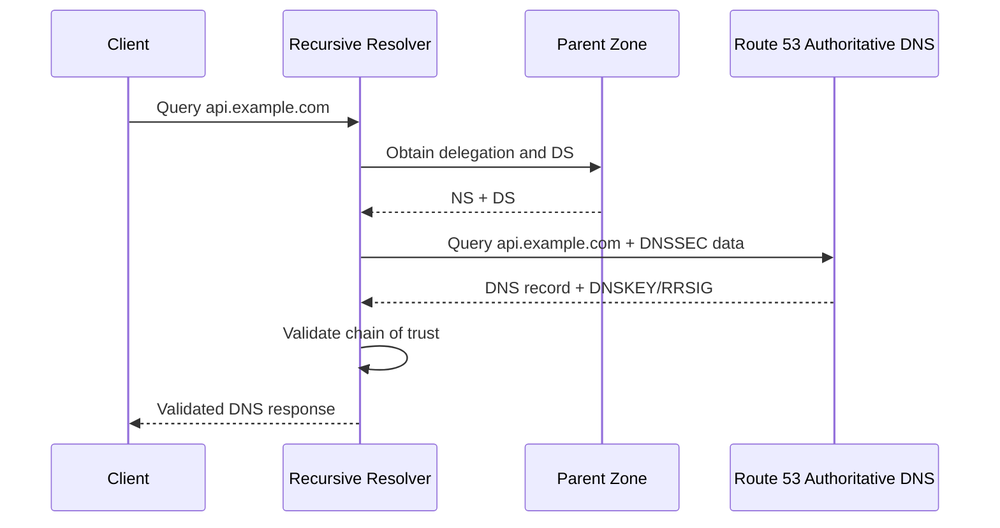
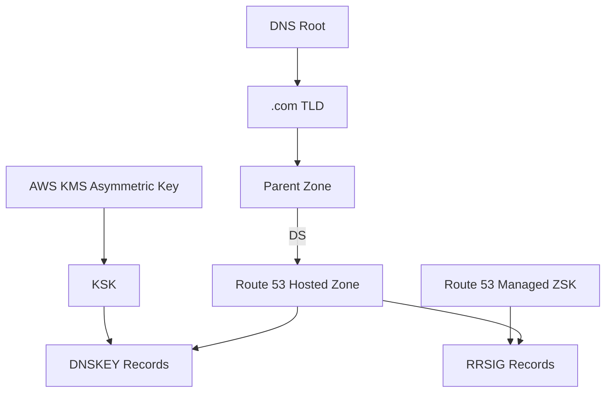
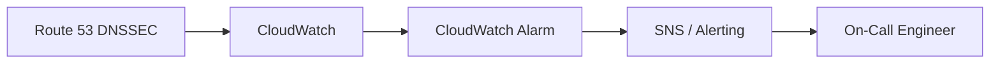
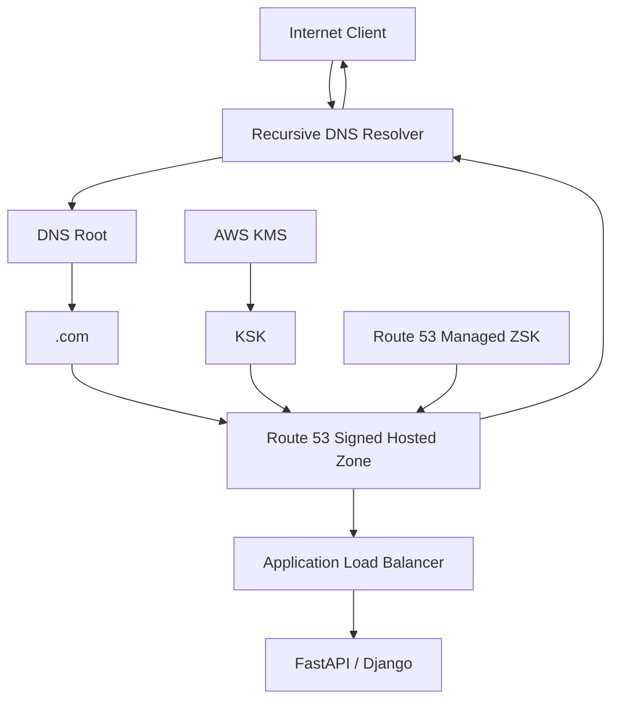

# 02- DNSSEC

## Overview

DNSSEC (Domain Name System Security Extensions) adds cryptographic authenticity and integrity to DNS responses.

Traditional DNS is fundamentally trust-based:

```text
Client
  │
  │ "What is the IP for api.example.com?"
  ▼
Recursive Resolver
  │
  ▼
Authoritative DNS
  │
  ▼
IP Address
```

Without DNSSEC, a resolver can receive a DNS response but does not have a cryptographic mechanism to prove that the response originated from the legitimate authoritative DNS infrastructure and was not modified.

DNSSEC introduces digital signatures and a **chain of trust**:

```text
Root
  │
  ▼
.com
  │
  ▼
example.com
  │
  ▼
api.example.com
```

Each level establishes trust in the next level through cryptographic information.

For Route 53, DNSSEC signing protects public hosted zones by allowing DNSSEC-aware resolvers to validate that DNS responses are authentic and have not been tampered with. Route 53 manages the zone-signing process, while the customer manages the key-signing key through AWS KMS. :contentReference[oaicite:0]{index=0}

---

## What DNSSEC Protects

DNSSEC primarily protects against attacks where an attacker attempts to provide a forged DNS answer.

For example:

```text
User
 │
 │ api.example.com
 ▼
Resolver
 │
 │ legitimate answer
 ▼
203.0.113.10
```

An attacker attempting DNS spoofing might try to make the resolver believe:

```text
api.example.com
       │
       ▼
198.51.100.50
```

If the legitimate zone is DNSSEC-signed and the resolver validates DNSSEC, the forged response fails cryptographic validation.

The important distinction is:

> DNSSEC authenticates DNS data; it does not encrypt DNS traffic.

---

## DNSSEC vs Traditional DNS

| Property | Traditional DNS | DNSSEC |
|---|---|---|
| DNS resolution | Yes | Yes |
| Authenticity of DNS data | No cryptographic validation | Yes |
| Integrity protection | No | Yes |
| Encryption | No | No |
| Digital signatures | No | Yes |
| Chain of trust | No | Yes |
| Protection against forged DNS responses | Limited | Yes, for validating resolvers |
| Application-layer TLS replacement | No | No |

DNSSEC should therefore complement, not replace, TLS.

A production API should generally use both:

```text
DNSSEC
  │
  └── Authenticate DNS response

TLS
  │
  └── Protect application connection
```

---

## Why DNSSEC Exists

DNS was originally designed around a relatively trusted network environment.

A DNS response historically looked conceptually like:

```text
Query:
    api.example.com

Response:
    203.0.113.10
```

The resolver had to trust that response.

DNSSEC adds cryptographic verification:

```text
DNS Response
     │
     ├── Resource Record
     └── Digital Signature
              │
              ▼
       Cryptographic Validation
              │
        ┌─────┴─────┐
        │           │
      Valid       Invalid
        │           │
        ▼           ▼
     Accept       Reject
```

This is particularly important for internet-facing services where DNS controls the destination of user traffic.

---

## DNSSEC Components

The main components to understand are:

| Component | Purpose |
|---|---|
| KSK | Key-signing key used to sign DNSKEY information |
| ZSK | Zone-signing key used to sign zone records |
| DNSKEY | Publishes public keys used for DNSSEC validation |
| RRSIG | Cryptographic signature over DNS records |
| DS | Delegation Signer record establishing parent-to-child trust |
| Parent Zone | Holds the DS record for the child zone |
| Resolver | Validates the DNSSEC chain |
| KMS | Stores the customer-managed asymmetric key backing Route 53 KSKs |

Route 53 uses both a KSK and ZSK model. Route 53 manages ZSK operations, while the customer is responsible for KSK management. Each Route 53 KSK is based on an asymmetric customer-managed AWS KMS key. :contentReference[oaicite:1]{index=1}

---

## KSK and ZSK

DNSSEC separates signing responsibilities between two types of keys.

### Key-Signing Key

The **KSK** signs the DNSKEY records.

Conceptually:

```text
KSK
 │
 ▼
DNSKEY records
 │
 ▼
DS record
 │
 ▼
Parent Zone
```

The KSK is the key that participates in establishing the chain of trust.

In Route 53, the KSK is based on a customer-managed asymmetric KMS key. Customers are responsible for KSK lifecycle management, including rotation when required. :contentReference[oaicite:2]{index=2}

### Zone-Signing Key

The **ZSK** signs the actual DNS records in the zone.

```text
ZSK
 │
 ├── A
 ├── AAAA
 ├── CNAME
 ├── MX
 ├── TXT
 └── other DNS records
```

Route 53 manages ZSK operations for Route 53 DNSSEC signing. :contentReference[oaicite:3]{index=3}

---

## DNSKEY

A DNSSEC-enabled zone publishes DNSKEY records.

Conceptually:

```text
example.com
      │
      ▼
DNSKEY
      │
      ├── KSK public key
      └── ZSK public key
```

Resolvers retrieve these public keys to validate signatures.

The resolver does not need the private key.

The private signing material remains under the control of the signing system.

---

## RRSIG

An `RRSIG` record contains a digital signature associated with a DNS record set.

Conceptually:

```text
A Record
api.example.com → 203.0.113.10

       +
       
RRSIG
       │
       ▼
Cryptographic signature
```

The validating resolver uses the appropriate DNSSEC public key to verify the signature.

If the response has been modified, the signature verification fails.

---

## DS Record

The **Delegation Signer (DS)** record is the critical link between the parent zone and the child zone.

For example:

```text
Root
 │
 ▼
.com
 │
 │ DS for example.com
 ▼
example.com
 │
 └── DNSKEY
```

The DS record contains information derived from a DNSSEC key in the child zone.

This allows the resolver to establish a chain of trust from the parent zone to the child zone.

AWS describes establishing the DNSSEC chain of trust as a separate step after enabling Route 53 signing. :contentReference[oaicite:4]{index=4}

---

## Chain of Trust

The chain of trust is the core DNSSEC concept.

Consider:

```text
Root
 │
 │ cryptographic trust
 ▼
.com
 │
 │ DS
 ▼
example.com
 │
 │ DNSKEY
 ▼
api.example.com
 │
 │ RRSIG
 ▼
DNS Response
```

The resolver validates each relationship.

A simplified validation flow is:



If validation fails, a DNSSEC-aware resolver can return a failure instead of accepting potentially forged data.

---

## DNSSEC Request Lifecycle

A simplified production request looks like:

```text
Application
    │
    │ DNS query
    ▼
Recursive Resolver
    │
    ├── Cached?
    │      │
    │      └── Yes → Return cached answer
    │
    └── No
         │
         ▼
      Root/TLD
         │
         ▼
    Parent DS record
         │
         ▼
    Route 53 Authoritative DNS
         │
         ├── DNS record
         ├── DNSKEY
         └── RRSIG
              │
              ▼
       Cryptographic validation
              │
        ┌─────┴─────┐
        │           │
      Valid       Invalid
        │           │
        ▼           ▼
      Answer      Failure
```

Caching can cause the resolver to reuse previously validated information until the relevant TTLs expire.

---

## Route 53 DNSSEC Architecture

A Route 53 public hosted zone can be represented as:



The important security boundary is that the customer-managed KMS key backing the KSK is not simply an application secret stored in an EC2 instance or container.

---

## Route 53 KMS Integration

Route 53 DNSSEC signing uses a customer-managed asymmetric KMS key for the KSK. :contentReference[oaicite:5]{index=5}

The relationship is:

```text
AWS KMS
   │
   │ asymmetric key
   ▼
Route 53 KSK
   │
   ▼
DNSSEC signing
   │
   ▼
Signed Route 53 Zone
```

This means DNSSEC introduces an additional operational dependency:

```text
Route 53
   │
   └── KMS
```

The KMS key must satisfy the requirements for Route 53 DNSSEC signing.

Operationally, the key must be treated as production cryptographic infrastructure rather than an ordinary application key.

---

## Enabling DNSSEC in Route 53

The process has three major stages:

```text
Prepare
   │
   ▼
Enable Route 53 DNSSEC Signing
   │
   ▼
Create/Configure KSK
   │
   ▼
Wait for signing to become effective
   │
   ▼
Publish DS at parent
   │
   ▼
Validate chain of trust
```

AWS explicitly recommends preparing and monitoring the zone before establishing the chain of trust. :contentReference[oaicite:6]{index=6}

---

## Preparation Before Enabling DNSSEC

Do not treat DNSSEC activation as an ordinary DNS record change.

Before enabling it:

- Verify that the TLD supports DNSSEC.
- Verify that the parent DNS provider supports DS records.
- Understand the registrar/registry workflow.
- Establish monitoring.
- Review current DNS health.
- Identify rollback procedures.
- Verify ownership of the parent zone.
- Plan the DS publication step.

AWS recommends monitoring zone availability before enabling signing and carefully coordinating the DS insertion. :contentReference[oaicite:7]{index=7}

---

## Enable DNSSEC Signing

Using the AWS CLI, Route 53 can create a KSK using a customer-managed KMS key.

Example:

```bash
aws --region us-east-1 route53 create-key-signing-key \
  --hosted-zone-id Z1234567890 \
  --key-management-service-arn arn:aws:kms:us-east-1:123456789012:key/example-key-id \
  --name production-ksk \
  --status ACTIVE \
  --caller-reference "dnssec-$(date +%s)"
```

Then enable DNSSEC signing:

```bash
aws --region us-east-1 route53 enable-hosted-zone-dnssec \
  --hosted-zone-id Z1234567890
```

AWS recommends verifying that the signing operation reaches an `INSYNC` state before proceeding with the chain of trust. :contentReference[oaicite:8]{index=8}

---

## Establishing the Chain of Trust

Enabling signing alone is not the complete DNSSEC setup.

You must establish the parent-to-child trust relationship.

Conceptually:

```text
example.com
    │
    │ Route 53 signs zone
    ▼
DNSKEY available
    │
    │ Generate DS information
    ▼
Parent Zone
    │
    │ DS record
    ▼
.com
```

For a domain registered with Route 53, the DNSSEC key information can be configured through the Route 53 registrar workflow.

For a domain registered elsewhere, the DS information must be configured with the appropriate registrar or parent-zone operator. :contentReference[oaicite:9]{index=9}

---

## DS Record Format

A DS record contains fields such as:

```text
Key Tag
Algorithm
Digest Type
Digest
```

Conceptually:

```text
12345 13 2 abcdef1234567890...
```

For the Route 53 DNSSEC setup documented by AWS, the chain-of-trust configuration uses ECDSAP256SHA256 with algorithm type 13 and SHA-256 digest type 2. :contentReference[oaicite:10]{index=10}

The exact DS values must come from the DNSSEC configuration for the actual zone.

Never invent DS values manually.

---

## DNSSEC and TTL

DNSSEC changes operational behavior around TTLs.

For Route 53 signed hosted zones, Route 53 enforces a maximum TTL of one week for records in the zone. If a higher TTL is configured, Route 53 enforces the one-week limit. :contentReference[oaicite:11]{index=11}

This matters during migrations and rollback planning.

Before enabling DNSSEC, understand:

```text
Current DNS TTL
       │
       ▼
DNSSEC activation
       │
       ▼
Maximum effective TTL
       │
       ▼
Rollback propagation time
```

AWS also recommends using a low DS TTL during chain-of-trust establishment to reduce recovery time if a rollback is required. :contentReference[oaicite:12]{index=12}

---

## DNSSEC and Resolver Validation

Signing a zone and validating a zone are different operations.

### Signing

Route 53 signs DNS data:

```text
Route 53
   │
   ▼
Signed DNS records
```

### Validation

A recursive resolver verifies the signatures:

```text
Resolver
   │
   ▼
DNSSEC validation
   │
   ├── Valid → return response
   └── Invalid → return failure
```

A domain can therefore be DNSSEC-signed even when a particular client is using a resolver that does not perform DNSSEC validation.

AWS notes that not all DNS resolvers support DNSSEC validation. :contentReference[oaicite:13]{index=13}

---

## Route 53 Resolver DNSSEC Validation

Route 53 also supports DNSSEC validation for DNS queries originating from a VPC.

This is different from signing a public hosted zone.

```text
Public DNSSEC Signing
        │
        ▼
Route 53 Authoritative DNS
```

versus:

```text
VPC
 │
 ▼
Route 53 Resolver
 │
 ▼
DNSSEC Validation
```

AWS allows DNSSEC validation to be enabled for a VPC's Route 53 Resolver. :contentReference[oaicite:14]{index=14}

This can help protect workloads from receiving forged DNS responses during recursive resolution.

---

## Public DNSSEC Signing vs VPC Validation

| Feature | DNSSEC Signing | DNSSEC Validation |
|---|---|---|
| Purpose | Sign DNS data | Verify DNS data |
| Performed by | Route 53 authoritative service | Resolver |
| Primary target | Public hosted zone | VPC DNS resolution |
| Cryptographic operation | Creates signatures | Verifies signatures |
| KMS KSK dependency | Yes for Route 53 signing | Not equivalent |
| DS chain required | Yes for public chain of trust | Resolver uses DNSSEC trust chain |

Do not confuse these two features when designing AWS DNS security.

---

## Route 53 Resolver Validation Caveat

AWS documents an important behavior for VPC Resolver DNSSEC validation: the Resolver performs validation, but currently ignores the `DO` and `CD` EDNS header bits and does not return DNSSEC records or set the `AD` bit in responses.

Therefore, applications cannot rely on the VPC Resolver itself to expose DNSSEC validation status to the application through those response flags. If an application requires its own recursive DNSSEC validation, AWS recommends performing recursive resolution independently. :contentReference[oaicite:15]{index=15}

This distinction matters for security-sensitive backend architectures.

---

## DNSSEC and TLS

DNSSEC and TLS operate at different layers.

```text
Application
    │
    │ HTTPS
    ▼
TLS
    │
    ▼
HTTP / REST / gRPC
    │
    ▲
    │
DNS resolves destination
    │
    ▲
    │
DNSSEC authenticates DNS data
```

DNSSEC helps answer:

> "Did the DNS response come from the legitimate DNS chain?"

TLS helps answer:

> "Is the endpoint presenting the expected certificate and is the connection encrypted?"

For a production FastAPI service:

```text
https://api.example.com
        │
        ├── DNSSEC → DNS authenticity
        │
        └── TLS    → Transport security
```

DNSSEC should not be treated as a replacement for HTTPS.

---

## DNSSEC Does Not Encrypt DNS

A common misconception is:

```text
DNSSEC = encrypted DNS
```

This is incorrect.

DNSSEC provides:

- Authentication of DNS data
- Integrity of DNS data
- Cryptographic signatures
- Chain-of-trust validation

DNSSEC does not provide:

- Confidentiality
- Encryption of DNS queries
- Encryption of application traffic

Technologies such as encrypted DNS transports solve different problems.

---

## DNSSEC and Route 53 Health Checks

DNSSEC does not replace Route 53 health checks.

These solve different problems:

```text
DNSSEC
  │
  └── "Is this DNS response authentic?"

Health Check
  │
  └── "Is this endpoint healthy?"
```

They can work together:

```text
Client
  │
  ▼
Route 53
  │
  ├── DNSSEC signing
  │
  └── Health-based routing
          │
          ▼
      Healthy Target
```

DNSSEC protects the DNS answer's authenticity, while health checks influence which answer Route 53 returns.

---

## DNSSEC and Routing Policies

DNSSEC can coexist with Route 53 routing policies such as:

- Simple routing
- Weighted routing
- Latency-based routing
- Failover routing
- Geolocation routing
- Geoproximity routing
- Multivalue answer routing

The routing policy determines the DNS response.

DNSSEC signs the resulting DNS data.

Conceptually:

```text
Client Query
     │
     ▼
Route 53 Routing Policy
     │
     ▼
Selected DNS Answer
     │
     ▼
DNSSEC Signature
     │
     ▼
Resolver Validation
```

This allows routing and DNS authenticity to remain separate concerns.

---

## Key Rotation

KSK rotation must be planned carefully because the KSK participates in the chain of trust.

A simplified rotation strategy is:

```text
Existing KSK
     │
     ▼
Create new KSK
     │
     ▼
Publish new trust information
     │
     ▼
Allow propagation
     │
     ▼
Activate new signing relationship
     │
     ▼
Retire old KSK
```

Route 53 supports up to two KSKs per hosted zone. :contentReference[oaicite:16]{index=16}

Do not remove the old trust relationship prematurely.

The general principle is:

> Establish trust in the replacement key before removing trust in the old key.

---

## KSK Rotation Considerations

During rotation:

- Keep the old key available while required.
- Ensure the parent DS relationship is updated correctly.
- Account for DNS caching.
- Monitor DNSSEC validation.
- Confirm that DNS resolution remains healthy.
- Remove the old key only after the old trust relationship is no longer needed.

A KSK rotation is not equivalent to changing an ordinary DNS record.

It is a cryptographic infrastructure change.

---

## Disabling DNSSEC

Disabling DNSSEC also requires careful sequencing.

A safe conceptual flow is:

```text
Identify DNSSEC state
        │
        ▼
Remove/retire DS relationship appropriately
        │
        ▼
Allow DNS caches to expire
        │
        ▼
Disable Route 53 signing
        │
        ▼
Verify DNS resolution
```

The exact sequence depends on where the domain is registered and where the parent zone is managed.

The critical rule is:

> Do not create a state where the parent advertises a DS record for a child zone that is no longer correctly signed.

An incorrect DS/signing relationship can make a domain appear unavailable to DNSSEC-validating resolvers.

---

## DNSSEC Failure Modes

Common failures include:

| Failure | Potential result |
|---|---|
| Incorrect DS record | DNSSEC validation failure |
| Missing DS record | No complete chain of trust |
| Broken KMS key configuration | DNSSEC signing problems |
| KSK requires action | Potential signing outage |
| Incorrect key rotation | Validation failures |
| Unsupported parent DS behavior | Child zone can become unresolvable |
| Resolver clock problems | Signature validation problems |
| DNSSEC validation misconfiguration | Internal resolution failures |

AWS explicitly warns that DNSSEC errors should be addressed quickly because they can cause a zone outage. :contentReference[oaicite:17]{index=17}

---

## DNSSEC and Clock Synchronization

DNSSEC signatures have validity periods.

A resolver with an incorrect system clock may fail validation.

For production systems:

```text
Host
 │
 └── Accurate time
       │
       └── NTP / managed time synchronization
```

AWS notes that when establishing the chain of trust, resolver clocks should be within an appropriate range of the correct time. :contentReference[oaicite:18]{index=18}

Time synchronization is therefore a small but important operational dependency.

---

## Monitoring DNSSEC

DNSSEC should be actively monitored.

AWS specifically recommends CloudWatch alarms for:

```text
DNSSECInternalFailure
DNSSECKeySigningKeysNeedingAction
```

These alarms are important because unresolved DNSSEC failures can make domains unavailable. :contentReference[oaicite:19]{index=19}

A production monitoring model can be:



The objective is not merely to detect that DNSSEC is broken.

The objective is to detect the problem **before users experience prolonged DNS resolution failures**.

---

## Operational Monitoring

Useful signals include:

- DNSSEC internal failures
- KSKs requiring action
- DNS query success rates
- DNS resolution latency
- NXDOMAIN rates
- SERVFAIL rates
- DNSSEC validation failures
- Unexpected DNS changes
- Parent DS configuration changes

During DNSSEC rollout, monitor from multiple independent resolvers.

For example:

```bash
dig +dnssec api.example.com
```

and:

```bash
dig +dnssec example.com
```

The exact output depends on the resolver and its DNSSEC behavior.

Use multiple resolver perspectives rather than trusting a single local DNS cache.

---

## Verifying DNSSEC Records

`dig` is useful for DNSSEC troubleshooting.

For example:

```bash
dig +dnssec example.com
```

To inspect DNSKEY records:

```bash
dig DNSKEY example.com
```

To inspect DS information:

```bash
dig DS example.com
```

To inspect the DNS response and authority information:

```bash
dig +dnssec api.example.com
```

When troubleshooting, examine:

- `DNSKEY`
- `RRSIG`
- `DS`
- `NSEC` / `NSEC3` where applicable
- Response status
- Authority section
- TTLs
- Resolver behavior

---

## DNSSEC Proof of Nonexistence

DNSSEC also supports authenticated proof that a DNS name or record does not exist.

For example:

```text
Query:
    nonexistent.example.com

Response:
    NXDOMAIN
```

DNSSEC can provide cryptographic proof supporting the negative response.

This prevents an attacker from simply fabricating a negative response in a DNSSEC-validating environment.

Route 53 supports DNSSEC proofs of nonexistence as part of its DNSSEC implementation. :contentReference[oaicite:20]{index=20}

---

## Security Considerations

DNSSEC should be treated as part of a broader DNS security architecture.

### Identity Security

Protect:

- Route 53 write permissions
- KMS permissions
- Registrar access
- Parent-zone administration
- DNS deployment roles

A DNSSEC configuration can still be compromised if an attacker gains sufficient administrative access.

### Registrar Security

The registrar is a critical trust boundary because the parent DS relationship can be changed there.

Protect registrar accounts with:

- Strong authentication
- MFA
- Restricted administrative access
- Change monitoring
- Recovery procedures

### KMS Security

The customer-managed KMS key backing the KSK is also security-sensitive.

Avoid:

- Uncontrolled key administration
- Broad KMS permissions
- Unmonitored key deletion
- Unreviewed key policy changes

### Route 53 Security

Continue to apply least privilege to:

```text
route53:ChangeResourceRecordSets
```

and other DNS management operations.

DNSSEC does not make excessive IAM permissions safe.

---

## DNSSEC and IAM

DNSSEC introduces additional IAM and KMS dependencies.

A simplified model is:

```text
CI/CD / DNS Administrator
        │
        ▼
IAM Role
        │
        ├── Route 53 permissions
        │
        └── KMS permissions where required
                    │
                    ▼
                 KMS Key
                    │
                    ▼
                Route 53 KSK
```

The DNSSEC administrator should not automatically receive broad permissions over every AWS resource.

Use dedicated roles for DNS and cryptographic infrastructure where practical.

---

## Production Architecture

A production public API might use:



The responsibilities remain separated:

```text
KMS
 └── Cryptographic key management

Route 53
 ├── DNS hosting
 ├── Routing
 ├── Health checks
 └── DNSSEC signing

Resolver
 └── DNSSEC validation

ALB
 └── HTTP/TLS traffic distribution

Application
 └── Business logic
```

This separation is important for both security and operational troubleshooting.

---

## High Availability Considerations

DNSSEC should improve DNS authenticity without becoming a new operational single point of failure.

Production considerations include:

- Monitor DNSSEC health continuously.
- Monitor KSK status.
- Protect the KMS key.
- Maintain registrar access.
- Maintain parent-zone DS information.
- Test key rotation procedures.
- Document rollback procedures.
- Test from independent resolvers.

A DNSSEC failure can be more severe than an ordinary DNS configuration error because DNSSEC-validating resolvers may reject otherwise reachable DNS data.

---

## Disaster Recovery

DNSSEC disaster recovery should cover more than Route 53 records.

Document and protect:

```text
DNS Zone
   │
   ├── Hosted zone configuration
   ├── KSK configuration
   ├── KMS key ownership
   ├── DS record
   ├── Registrar access
   └── Recovery procedure
```

When migrating a hosted zone between AWS accounts, DNSSEC requires special handling. AWS documents re-enabling signing and establishing the chain of trust for the new hosted zone. :contentReference[oaicite:21]{index=21}

Do not assume that copying DNS records alone is sufficient to migrate a DNSSEC-enabled production zone.

---

## Cost Considerations

DNSSEC introduces additional infrastructure considerations.

In particular:

- Customer-managed KMS keys can incur AWS KMS charges.
- DNS query volume can affect Route 53 costs.
- Monitoring and alerting can introduce additional CloudWatch costs.
- Operational complexity has an engineering cost.

AWS specifically notes that a separate charge applies for each customer-managed KMS key created for Route 53 DNSSEC signing. :contentReference[oaicite:22]{index=22}

For production systems, security and reliability requirements should drive the decision rather than treating DNSSEC as a purely cost-based feature.

---

## Common Mistakes

### Enabling Signing Without Establishing the Chain of Trust

**Problem:** The hosted zone is signed, but the parent does not correctly publish the DS relationship.

**Result:** DNSSEC validation does not have a complete trust chain.

**Better approach:** Treat signing and chain-of-trust establishment as two coordinated stages.

---

### Publishing an Incorrect DS Record

**Problem:** The DS information does not match the child's DNSSEC configuration.

**Result:** Validating resolvers can return DNS failures.

**Better approach:** Use the DS information generated by the DNSSEC configuration and verify it before publication.

---

### Treating DNSSEC as Encryption

**Problem:** Engineers assume DNS queries or responses are confidential.

**Better approach:** Use DNSSEC for authenticity and TLS or encrypted DNS protocols for confidentiality requirements.

---

### Forgetting the Registrar

**Problem:** Engineers configure Route 53 but forget that the DS relationship is controlled at the parent/registrar level.

**Better approach:** Identify who owns the parent zone and registrar before starting the migration or activation.

---

### Deleting a KSK Too Early

**Problem:** The old trust relationship may still be referenced by resolvers.

**Better approach:** Follow a controlled key-rotation sequence and retain the old key until it is safe to remove.

---

### Ignoring KMS Dependencies

**Problem:** DNSSEC signing depends on a customer-managed KMS key for the KSK.

**Better approach:** Include KMS permissions, key lifecycle, monitoring, and recovery in the DNSSEC operational model.

---

### No DNSSEC CloudWatch Alarms

**Problem:** A signing or KSK problem can remain unnoticed.

**Better approach:** Alert on `DNSSECInternalFailure` and `DNSSECKeySigningKeysNeedingAction`. :contentReference[oaicite:23]{index=23}

---

### Enabling DNSSEC Validation Without Testing

**Problem:** Internal DNS resolution can change when validation is enabled.

**Better approach:** Test validation behavior before enabling it broadly and monitor resolution after the change. AWS warns that enabling or disabling VPC Resolver DNSSEC validation can affect DNS resolution and can take several minutes. :contentReference[oaicite:24]{index=24}

---

### Using Only One Resolver for Testing

**Problem:** A local resolver may cache old results or have different DNSSEC behavior.

**Better approach:** Test through multiple independent DNS resolvers and inspect authoritative responses directly where appropriate.

---

## Production Checklist

### Before Enabling DNSSEC

- [ ] Confirm the TLD supports DNSSEC.
- [ ] Confirm the parent-zone provider supports DS records.
- [ ] Identify registrar ownership.
- [ ] Verify the KMS key requirements.
- [ ] Verify Route 53 IAM permissions.
- [ ] Establish DNS monitoring.
- [ ] Establish CloudWatch alarms.
- [ ] Document rollback procedures.
- [ ] Record current DNS and TTL configuration.

### During Activation

- [ ] Enable Route 53 DNSSEC signing.
- [ ] Create or configure the KSK.
- [ ] Verify signing reaches `INSYNC`.
- [ ] Retrieve DS information.
- [ ] Publish the DS record at the parent.
- [ ] Allow required DNS propagation.
- [ ] Test through independent resolvers.

### After Activation

- [ ] Verify DNS resolution.
- [ ] Verify DNSSEC validation.
- [ ] Monitor `SERVFAIL` behavior.
- [ ] Monitor Route 53 DNSSEC errors.
- [ ] Monitor KSK status.
- [ ] Test application endpoints.
- [ ] Document the final DNSSEC state.

### During Key Rotation

- [ ] Create the replacement KSK.
- [ ] Establish the required trust relationship.
- [ ] Allow propagation.
- [ ] Activate the replacement signing configuration.
- [ ] Monitor validation.
- [ ] Retire the old key only when safe.
- [ ] Verify the final chain of trust.

---

## Interview-Level Distinctions

### What problem does DNSSEC solve?

DNSSEC provides cryptographic authentication and integrity for DNS data.

It helps validating resolvers detect forged or modified DNS responses.

---

### Does DNSSEC encrypt DNS?

No.

DNSSEC provides authentication and integrity, not confidentiality.

---

### What is the difference between KSK and ZSK?

The KSK is used to sign DNSKEY information and participates in establishing the chain of trust.

The ZSK signs the zone's DNS records.

In Route 53, KSK management is tied to a customer-managed asymmetric KMS key, while Route 53 manages ZSK operations. :contentReference[oaicite:25]{index=25}

---

### What is a DS record?

A DS record establishes the parent-to-child DNSSEC trust relationship.

```text
Parent Zone
    │
    └── DS
          │
          ▼
Child Zone
    │
    └── DNSKEY
```

---

### Is enabling Route 53 DNSSEC signing enough?

No.

The chain of trust must also be established by correctly publishing the DS relationship at the parent zone or registrar. :contentReference[oaicite:26]{index=26}

---

### What happens if DNSSEC validation fails?

A DNSSEC-aware resolver can reject the response rather than returning potentially unauthenticated data.

This is why DNSSEC configuration errors can result in apparent domain outages.

---

### Does DNSSEC replace HTTPS?

No.

DNSSEC authenticates DNS data.

TLS protects the application connection and authenticates the service endpoint through certificates.

---

### Who manages the Route 53 ZSK?

Route 53 manages ZSK operations for Route 53 DNSSEC signing. The customer is responsible for KSK management. :contentReference[oaicite:27]{index=27}

---

### Why is KMS involved?

Route 53 DNSSEC KSKs are based on asymmetric customer-managed KMS keys.

KMS therefore provides the cryptographic key-management foundation for the Route 53 KSK. :contentReference[oaicite:28]{index=28}

---

### What is the difference between Route 53 DNSSEC signing and Resolver DNSSEC validation?

Signing occurs on authoritative DNS data:

```text
Route 53
   │
   └── Signs DNS responses
```

Validation occurs during recursive resolution:

```text
Resolver
   │
   └── Verifies DNSSEC signatures
```

Route 53 Resolver can perform DNSSEC validation for VPC DNS resolution. :contentReference[oaicite:29]{index=29}

---

## Key Takeaways

- DNSSEC provides cryptographic authenticity and integrity for DNS data.
- DNSSEC does not encrypt DNS queries or application traffic.
- Route 53 supports DNSSEC signing for public hosted zones.
- Route 53 DNSSEC uses both KSK and ZSK concepts.
- The KSK is based on a customer-managed asymmetric AWS KMS key.
- Route 53 manages ZSK operations for Route 53 DNSSEC signing.
- The DS record connects the parent zone to the child zone and establishes the chain of trust.
- Enabling DNSSEC signing is not sufficient; the parent DS relationship must also be established.
- DNSSEC-aware recursive resolvers validate the signatures before accepting signed DNS data.
- DNSSEC validation failures can result in DNS resolution failures, making operational monitoring critical.
- Route 53 recommends CloudWatch alarms for `DNSSECInternalFailure` and `DNSSECKeySigningKeysNeedingAction`.
- Signed Route 53 hosted zones have an effective maximum TTL of one week.
- KSK rotation must be planned carefully because the KSK participates in the chain of trust.
- Registrar and parent-zone security are part of the DNSSEC security boundary.
- DNSSEC should be combined with IAM least privilege, KMS security, registrar protection, CloudTrail, monitoring, and controlled change management.
- Route 53 Resolver DNSSEC validation is separate from authoritative Route 53 DNSSEC signing.
- VPC Resolver validation can affect internal DNS resolution and should be tested before production rollout.
- DNSSEC and TLS solve different security problems and should normally be used together.
- DNSSEC configuration is infrastructure security work, not merely a DNS feature toggle.
- The production objective is a **valid, continuously monitored chain of trust with a tested recovery and key-rotation procedure**.