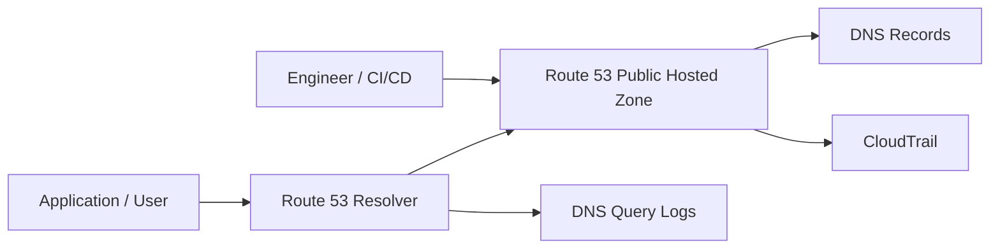
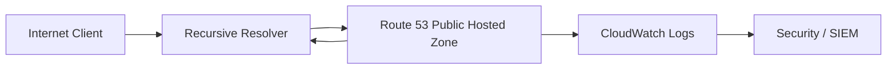
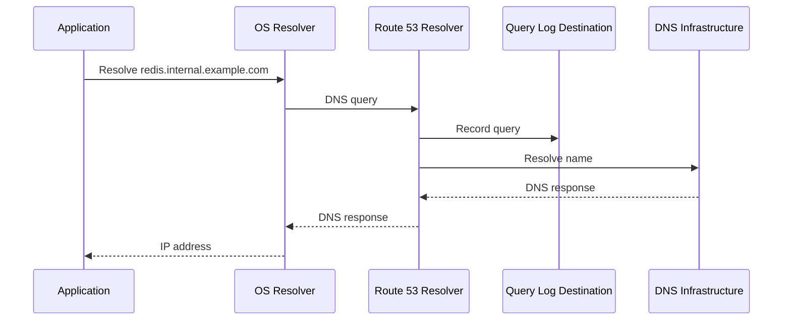
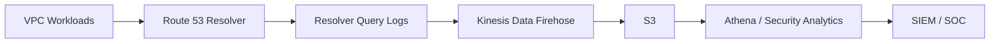
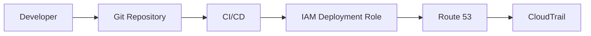
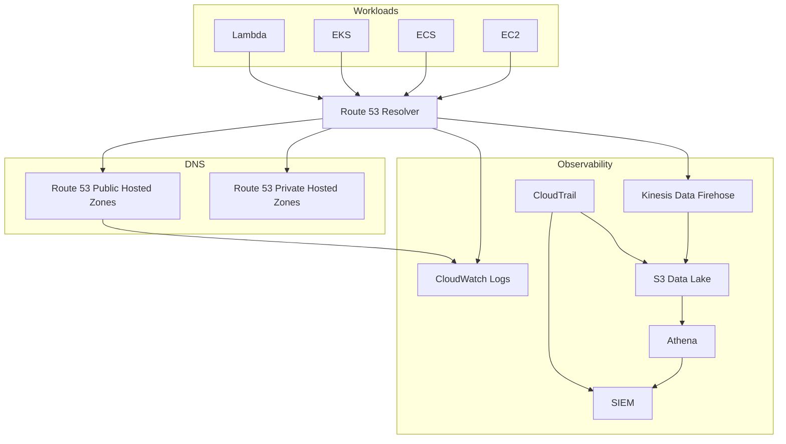

# 03- Query Logging and Auditing

## Overview

Amazon Route 53 provides several complementary mechanisms for understanding and auditing DNS activity:

- **Public hosted zone query logging** records DNS queries received by Route 53 authoritative name servers for a public hosted zone.
- **Route 53 Resolver query logging** records DNS queries handled by the Route 53 Resolver for VPC workloads.
- **AWS CloudTrail** records API activity against Route 53 and related AWS services.
- **CloudWatch** provides centralized monitoring, metrics, alarms, and operational visibility around DNS infrastructure.
- **S3 and Firehose-based delivery** can be used with Resolver query logging for centralized long-term analysis and downstream processing.

These mechanisms answer different questions.

| Requirement | Primary mechanism |
|---|---|
| Who changed a Route 53 record? | CloudTrail |
| Which DNS names are clients querying? | Route 53 query logging |
| Which VPC workload generated DNS traffic? | Resolver query logging |
| Which IAM principal changed DNS configuration? | CloudTrail |
| Long-term DNS analytics | S3 / Firehose |
| Real-time operational monitoring | CloudWatch |
| Security investigation | Query logs + CloudTrail + application/network logs |

A production DNS architecture should not treat query logging and auditing as interchangeable. **Query logs tell you what DNS traffic occurred; CloudTrail tells you who changed the DNS infrastructure.**

---

## Why DNS Logging Matters

DNS is part of the request path for almost every backend system.

Consider a typical API request:

```text
Client
  │
  │ https://api.example.com
  ▼
DNS Resolver
  │
  │ api.example.com → ALB
  ▼
Application Load Balancer
  │
  ▼
FastAPI / Django
```

If DNS behavior changes unexpectedly, application-level logs may not immediately explain why.

DNS logging helps answer questions such as:

- Which domains are workloads resolving?
- Which internal clients are generating unusual DNS traffic?
- Did DNS traffic suddenly increase?
- Is a service repeatedly resolving an unexpected domain?
- Are clients querying obsolete hostnames?
- Did DNS behavior change after a deployment?
- Which records were modified?
- Which IAM principal performed the change?
- Did a security incident involve suspicious DNS activity?

For senior backend engineers, DNS logs are therefore part of the broader production observability and security model.

---

## DNS Query Logging vs DNS Auditing

The distinction is fundamental.

### Query Logging

Query logging records DNS resolution activity.

```text
Workload
   │
   │ DNS query
   ▼
Route 53 Resolver
   │
   ├── Query log
   │
   ▼
DNS response
```

Example:

```text
10.20.5.17 → api.example.com
```

This tells you that a DNS query occurred.

### API Auditing

CloudTrail records control-plane API activity.

```text
Engineer / CI/CD
       │
       │ ChangeResourceRecordSets
       ▼
Route 53
       │
       └── CloudTrail event
```

This tells you who requested the infrastructure change.

### Together



A production investigation often needs both paths.

---

## Route 53 Logging Model

There are two major DNS query logging contexts.

| Context | Logging mechanism | Typical use |
|---|---|---|
| Public hosted zone | Route 53 public hosted zone query logging | Internet-facing DNS visibility |
| VPC DNS resolution | Route 53 Resolver query logging | Internal workload visibility |

These should not be confused.

A workload inside a VPC normally sends DNS queries through the VPC Resolver. Those queries are not equivalent to queries received by a public Route 53 hosted zone's authoritative name servers.

---

## Public Hosted Zone Query Logging

Public hosted zone query logging captures queries that Route 53 receives for a public hosted zone.

For example:

```text
Internet Client
      │
      │ api.example.com
      ▼
Recursive Resolver
      │
      ▼
Route 53 Authoritative DNS
      │
      ├── DNS response
      └── Query log
```

This is useful for understanding public DNS demand.

Typical use cases include:

- DNS traffic analysis
- Security investigation
- Identifying unexpected clients
- Understanding hostname usage
- Troubleshooting public DNS behavior
- Detecting unusual query patterns

---

## What Public Query Logs Tell You

A Route 53 public hosted zone query log can provide information about the DNS query, including details such as:

- Query timestamp
- Hosted zone
- Query name
- Query type
- DNS response code
- Protocol
- Transport
- Resolver-related information
- Source-related information available in the log

The exact fields depend on the Route 53 logging format and should be treated as an operational schema rather than an application API contract.

A simplified representation is:

```json
{
  "query_name": "api.example.com",
  "query_type": "A",
  "response_code": "NOERROR"
}
```

Do not build production parsers assuming that a simplified representation contains every field or that field formatting will remain identical to an application log schema.

---

## Public Query Logging Architecture

A typical architecture is:



The DNS response path and logging path are logically separate.

The logging system should not be considered part of the DNS resolution path.

---

## Route 53 Resolver Query Logging

Route 53 Resolver query logging is intended for DNS queries processed by the Route 53 Resolver.

This is especially valuable for workloads running in:

- EC2
- ECS
- EKS
- Lambda attached to a VPC
- Private subnets
- Other AWS resources using VPC DNS resolution

A typical flow is:

```text
EC2 / ECS / EKS / Lambda
          │
          │ DNS query
          ▼
Route 53 Resolver
          │
          ├──────────────► Query Log
          │
          ▼
DNS response
```

For example:

```text
10.20.10.25
     │
     │ database.internal.example.com
     ▼
Route 53 Resolver
     │
     ▼
10.20.30.15
```

The query log allows the platform team to understand which VPC workloads are performing DNS resolution.

---

## Why Resolver Query Logging Is Important for Backend Systems

Backend systems frequently depend on DNS for service discovery and infrastructure access.

Examples:

```text
api service
    │
    ├── PostgreSQL hostname
    ├── Redis hostname
    ├── Kafka bootstrap hostname
    ├── AWS service endpoints
    └── external APIs
```

Unexpected DNS activity can therefore indicate:

- Misconfigured service discovery
- Incorrect environment configuration
- Broken application retries
- Malware or compromised workloads
- Data exfiltration attempts
- Dependency migration issues
- DNS-based service discovery failures

For Kubernetes environments, Resolver logs can be particularly useful when investigating which workloads or nodes are generating unexpected DNS traffic.

---

## Resolver Query Logging Destinations

Route 53 Resolver query logging supports centralized destinations such as:

- Amazon CloudWatch Logs
- Amazon S3
- Amazon Kinesis Data Firehose

The destination should be selected based on the operational requirement.

| Destination | Best suited for |
|---|---|
| CloudWatch Logs | Interactive troubleshooting and near-real-time operations |
| S3 | Long-term retention, compliance, and large-scale analytics |
| Kinesis Data Firehose | Streaming into downstream analytics or security systems |

A common production architecture is:

```text
Route 53 Resolver
       │
       ▼
Kinesis Data Firehose
       │
       ▼
S3
       │
       ├── Athena
       ├── Security analytics
       └── Long-term retention
```

---

## CloudTrail for Route 53 Auditing

DNS query logs answer:

> What DNS queries occurred?

CloudTrail answers:

> Who called the Route 53 API?

This distinction is essential.

For example, an engineer may run:

```bash
aws route53 change-resource-record-sets \
  --hosted-zone-id Z123456789 \
  --change-batch file://change.json
```

CloudTrail can provide an audit trail for the API operation.

Conceptually:

```text
CI/CD Pipeline
      │
      │ Route 53 API
      ▼
Route 53
      │
      ▼
CloudTrail
      │
      ▼
S3 / CloudWatch / Security tooling
```

CloudTrail should be enabled as part of the AWS account auditing strategy.

---

## Route 53 Control-Plane vs Data-Plane Visibility

This distinction is useful during incident response.

| Activity | Visibility |
|---|---|
| DNS query from client | Query logging |
| DNS record lookup | Query logging |
| DNS record modification | CloudTrail |
| Hosted zone creation | CloudTrail |
| Hosted zone deletion | CloudTrail |
| Health check configuration change | CloudTrail |
| Resolver configuration change | CloudTrail |
| IAM role performing change | CloudTrail |
| VPC DNS query | Resolver query logging |

The exact CloudTrail event availability depends on the AWS service operation and whether the operation is logged by CloudTrail.

---

## Query Logging Request Flow

A production VPC request can be visualized as:



The logging operation should be designed so that DNS resolution remains reliable even if the logging destination has an operational issue.

---

## Logging Should Not Become a DNS Dependency

A common architectural mistake is assuming:

```text
DNS Query
   │
   ▼
Log Successfully
   │
   ▼
Return DNS Response
```

The logging pipeline should not be treated as a synchronous application dependency.

Instead:

```text
DNS Query
   │
   ▼
Resolver
   │
   ├── Resolve DNS
   │
   └── Produce log
```

DNS availability must remain the primary objective.

Logging is an observability capability around the DNS system, not the reason DNS exists.

---

## Creating a Resolver Query Log Configuration

A Resolver query logging configuration associates VPCs with a logging destination.

The exact AWS CLI command depends on the destination type.

For example, a CloudWatch Logs destination can be configured using the Route 53 Resolver API.

Conceptually:

```bash
aws route53resolver create-resolver-query-log-config \
  --name production-dns-query-logs \
  --destination-arn arn:aws:logs:us-east-1:123456789012:log-group:/aws/route53/resolver
```

The returned configuration can then be associated with a VPC.

```bash
aws route53resolver associate-resolver-query-log-config \
  --resolver-query-log-config-id rqlc-0123456789abcdef \
  --resource-id vpc-0123456789abcdef
```

Use the AWS CLI/API documentation for the current required parameters and IAM permissions when implementing this through automation.

---

## Infrastructure as Code

DNS logging should normally be managed through infrastructure as code rather than manually configured in the console.

A conceptual Terraform configuration looks like:

```hcl
resource "aws_route53_resolver_query_log_config" "production" {
  name            = "production-dns-query-logs"
  destination_arn = aws_cloudwatch_log_group.resolver.arn
}

resource "aws_route53_resolver_query_log_config_association" "production" {
  resolver_query_log_config_id = aws_route53_resolver_query_log_config.production.id
  resource_id                  = aws_vpc.production.id
}
```

The exact resources and arguments should match the AWS provider version used by the project.

The important engineering principle is:

> DNS observability configuration should be version-controlled and deployed through the same controlled infrastructure lifecycle as the DNS infrastructure itself.

---

## Public Hosted Zone Query Logging Configuration

Public hosted zone query logging is configured separately from Resolver query logging.

Conceptually:

```text
Public Hosted Zone
       │
       ▼
Query Logging Configuration
       │
       ▼
CloudWatch Logs
```

The CloudWatch Logs destination must be configured with the permissions required by Route 53.

This is an important operational detail because DNS logging configuration involves a cross-service relationship between:

```text
Route 53
   │
   └── CloudWatch Logs
          │
          └── Resource policy / permissions
```

Do not assume that creating a log group automatically gives Route 53 permission to write to it.

---

## CloudWatch Log Groups

Use dedicated log groups for DNS logs.

For example:

```text
/aws/route53/public-query
/aws/route53/resolver
```

A production naming convention should make:

- Environment
- Account
- Region
- Service
- Log type

easy to identify.

For example:

```text
/aws/production/route53/resolver-query
```

Centralized naming makes cross-account observability easier.

---

## Log Retention

Do not leave DNS logs with indefinite retention by default.

Choose retention based on:

- Security requirements
- Compliance requirements
- Incident-response requirements
- Cost
- Expected query volume
- Organizational logging policy

A common architecture is:

```text
CloudWatch Logs
      │
      │ Short/medium-term operational retention
      ▼
S3
      │
      │ Long-term retention
      ▼
Athena / SIEM
```

This separates operational troubleshooting from long-term archival.

---

## DNS Log Cost Considerations

DNS logging can generate significant volume.

Suppose:

```text
1,000,000 DNS queries/day
```

and each query generates a log record.

Over time, the volume becomes substantial:

```text
1M/day
  │
  ├── 30M/month
  │
  └── 365M/year
```

Therefore:

- Do not log blindly without understanding volume.
- Define retention intentionally.
- Consider S3 for long-term storage.
- Compress archived data where appropriate.
- Avoid unnecessary duplication across multiple logging pipelines.
- Monitor CloudWatch Logs ingestion costs.
- Apply lifecycle policies to long-term storage.

For high-volume environments, DNS logs should be treated as a data pipeline rather than a small troubleshooting artifact.

---

## Security Monitoring with DNS Logs

DNS is valuable for security analytics because compromised workloads frequently generate unusual DNS activity.

Potential indicators include:

- Queries to unexpected external domains
- High-frequency DNS queries
- Repeated NXDOMAIN responses
- Random-looking subdomains
- Queries to newly observed domains
- Unexpected DNS record types
- Large volumes of TXT queries
- Workloads communicating with domains unrelated to their role

A security pipeline might look like:



DNS logs should be correlated with:

- VPC Flow Logs
- CloudTrail
- GuardDuty findings
- Application logs
- Load balancer logs
- Kubernetes audit logs where applicable

No individual telemetry source should be treated as complete security evidence.

---

## Detecting Suspicious DNS Patterns

A basic investigation might search for high-volume queries.

Conceptually:

```sql
SELECT
    query_name,
    COUNT(*) AS query_count
FROM dns_logs
GROUP BY query_name
ORDER BY query_count DESC;
```

For operational analytics, useful dimensions include:

| Dimension | Example question |
|---|---|
| Query name | Which domains are queried most? |
| Source IP | Which workloads generate traffic? |
| Query type | Are TXT queries unusually high? |
| Response code | Are NXDOMAIN responses increasing? |
| Time | Did traffic spike after deployment? |
| VPC | Which environment is affected? |
| Account | Which AWS account generated traffic? |

The exact SQL schema depends on how the DNS logs are stored and transformed.

---

## DNS Query Volume Analysis

A sudden increase in DNS queries can indicate an application problem.

Example:

```text
Normal:
    20 DNS queries/request

After deployment:
    500 DNS queries/request
```

Possible causes include:

- Missing DNS caching
- Short application cache lifetimes
- Repeated service discovery
- Connection initialization loops
- Misconfigured retries
- Resolver failures
- Broken connection pooling

For Python services, repeated hostname resolution can sometimes indicate incorrect connection management.

For example:

```text
FastAPI
  │
  ├── PostgreSQL connection
  ├── Redis connection
  └── External API client
```

Production clients should generally reuse connections where appropriate rather than repeatedly constructing network clients.

---

## DNS Logging and Redis

Consider a FastAPI service using Redis:

```text
FastAPI
   │
   │ redis.internal.example.com
   ▼
Route 53 Resolver
   │
   ▼
Redis
```

If every request causes a new DNS resolution, query volume can increase unnecessarily.

A DNS query log can reveal:

```text
redis.internal.example.com
redis.internal.example.com
redis.internal.example.com
redis.internal.example.com
...
```

This can indicate a connection lifecycle or client configuration problem.

DNS logs therefore provide indirect evidence about application architecture.

---

## DNS Logging and Kubernetes

Kubernetes workloads commonly generate significant DNS traffic because service discovery depends heavily on DNS.

A typical flow is:

```text
Pod
 │
 │ service.namespace.svc.cluster.local
 ▼
CoreDNS
 │
 ▼
Route 53 Resolver
```

Not every Kubernetes DNS query necessarily reaches Route 53 Resolver because CoreDNS can answer cluster-local records itself.

However, external names can cause CoreDNS to forward queries to the VPC resolver.

For example:

```text
Pod
 │
 ▼
CoreDNS
 │
 ├── Kubernetes Service → local answer
 │
 └── api.external.com
          │
          ▼
     Route 53 Resolver
```

This distinction matters when using DNS logs to troubleshoot Kubernetes.

Do not assume Resolver logs contain every DNS lookup performed by every pod.

---

## DNS Logging and Lambda

VPC-connected Lambda functions use VPC DNS infrastructure for DNS resolution.

A production investigation might therefore correlate:

```text
Lambda
  │
  ▼
Route 53 Resolver
  │
  ▼
DNS Query Log
```

with:

```text
CloudWatch Lambda Logs
```

This can help determine whether an invocation is repeatedly resolving a dependency.

For example:

```text
Lambda invocation
      │
      ├── api.internal.example.com
      ├── redis.internal.example.com
      └── database.internal.example.com
```

Unexpected resolution patterns can indicate configuration or dependency issues.

---

## CloudTrail Investigation

When a DNS record unexpectedly changes, start with CloudTrail.

The investigation should answer:

```text
What changed?
    │
    ▼
Which Route 53 API?
    │
    ▼
Which IAM principal?
    │
    ▼
Which AWS account?
    │
    ▼
When?
    │
    ▼
From where?
```

A useful incident timeline might be:

```text
14:01 DNS record changed
14:02 CloudTrail event observed
14:03 Application errors increase
14:05 DNS query pattern changes
14:07 Rollback begins
14:08 DNS cache begins expiring
```

This is much stronger than inspecting application logs alone.

---

## CloudTrail Event Investigation

CloudTrail events can be searched using CloudTrail tooling or CloudTrail Lake.

For example, the AWS CLI can be used to look up Route 53 events:

```bash
aws cloudtrail lookup-events \
  --lookup-attributes AttributeKey=EventSource,AttributeValue=route53.amazonaws.com
```

For production environments, centralized CloudTrail storage and querying is generally preferable to relying only on ad-hoc CLI searches.

---

## Auditing CI/CD DNS Changes

DNS changes should ideally come from controlled automation.

A production pipeline might look like:



This creates a traceable chain:

```text
Git commit
    ↓
Pipeline execution
    ↓
IAM role
    ↓
Route 53 API call
    ↓
CloudTrail event
```

This is significantly easier to audit than manual console changes.

---

## IAM for DNS Changes

Use least privilege for Route 53 management.

Avoid giving application workloads permissions such as:

```text
route53:*
```

unless there is a strong and documented reason.

A deployment role might be restricted to:

```text
route53:ChangeResourceRecordSets
route53:GetChange
route53:ListResourceRecordSets
route53:ListHostedZones
```

and scoped to the required hosted zones where IAM/resource-level restrictions support the operation.

The principle is:

> Applications that only consume DNS should generally not have permissions to modify DNS.

---

## Protecting DNS Logs

DNS logs can contain sensitive operational information.

Examples:

```text
internal-service.example.com
database.production.internal
partner-api.example.com
```

These names can reveal architecture and dependencies.

Apply:

- IAM least privilege
- Encryption at rest
- Encryption in transit
- Controlled log access
- Appropriate retention
- Centralized audit trails
- Security monitoring

Do not expose DNS logs broadly to application developers if they contain sensitive internal infrastructure information.

---

## Cross-Account DNS Logging

Large organizations commonly centralize logging.

A possible architecture is:

```text
Production Account
       │
       ▼
Route 53 Resolver
       │
       ▼
Central Logging Account
       │
       ├── S3
       ├── CloudWatch
       ├── Firehose
       └── SIEM
```

This provides several advantages:

- Centralized retention
- Consistent access control
- Reduced log fragmentation
- Easier compliance
- Central security analysis

Cross-account logging requires carefully designed IAM and resource policies.

Do not grant broad cross-account access simply to simplify initial configuration.

---

## Multi-Region Considerations

Route 53 is a global DNS service, but the surrounding logging infrastructure can have regional characteristics.

For production environments:

- Define where logs are stored.
- Consider cross-region replication for critical audit data.
- Centralize security analytics.
- Ensure incident responders can access logs during a regional outage.
- Avoid assuming that one regional logging destination constitutes disaster recovery.

For long-term audit data, S3-based architectures can provide stronger retention and lifecycle-management capabilities.

---

## High Availability Considerations

Query logging should not introduce a dependency that can compromise DNS availability.

The desired architecture is:

```text
DNS Resolution
     │
     ├── Primary objective
     │
     ▼
Successful DNS response

Logging
     │
     └── Observability path
```

Operationally:

- Monitor the logging configuration.
- Monitor destination health.
- Avoid coupling application startup to log availability.
- Maintain independent DNS monitoring.
- Test DNS resolution separately from log delivery.

The question should always be:

> Can DNS still resolve correctly if the logging pipeline is degraded?

---

## Monitoring DNS Logging

Monitor at least:

- Query volume
- Log delivery health
- Log ingestion rate
- Error rates
- Unexpected query spikes
- NXDOMAIN rates
- SERVFAIL rates
- High-cardinality query names
- Logging configuration changes
- CloudTrail activity

A simple operational model is:

```text
DNS
 │
 ├── Availability
 ├── Latency
 ├── Query volume
 └── Error rate
        │
        ▼
   CloudWatch
        │
        ▼
     Alarm
        │
        ▼
    On-call
```

Logging itself should also be monitored.

---

## Detecting DNS Anomalies

A useful baseline is:

```text
Normal DNS volume
        │
        ▼
Historical baseline
        │
        ▼
Current query volume
        │
        ├── Within expected range
        │
        └── Significant deviation
                 │
                 ▼
             Investigation
```

Useful anomaly signals include:

- Sudden query-volume increase
- Sudden increase in unique domains
- Sudden increase in NXDOMAIN
- New external domains
- Repeated queries from a single source
- High-frequency TXT lookups
- DNS activity outside expected deployment windows

For security-sensitive environments, feed these signals into centralized security analytics rather than relying exclusively on manual inspection.

---

## Troubleshooting DNS With Query Logs

A production troubleshooting workflow can be:

### Identify the symptom

```text
Application timeout
```

### Check application logs

Determine whether the application reports:

```text
Name resolution failure
```

### Inspect DNS behavior

Check:

```text
Query name
Query type
Response code
Query frequency
Source
```

### Compare with infrastructure changes

Search CloudTrail for:

```text
Route 53 API activity
```

### Check the target

Verify:

```text
Record
TTL
Routing policy
Health check
Target IP / hostname
```

### Correlate timelines

```text
DNS change
   │
   ▼
Query behavior
   │
   ▼
Application errors
```

This prevents DNS incidents from being diagnosed only from the application layer.

---

## Common Mistakes

### Confusing Query Logs With CloudTrail

**Problem:** Engineers search CloudTrail for DNS queries.

**Why it fails:** CloudTrail records AWS API activity, not individual DNS lookups.

**Better approach:**

```text
DNS traffic → Query logs
AWS configuration changes → CloudTrail
```

---

### Assuming Public Hosted Zone Logs Capture VPC Resolver Traffic

**Problem:** Engineers enable public hosted zone query logging and expect to see every internal VPC lookup.

**Why it fails:** Internal workloads normally use Route 53 Resolver.

**Better approach:** Configure Resolver query logging for VPC DNS visibility.

---

### Assuming Resolver Logs Capture Every Kubernetes Query

**Problem:** Engineers expect every pod DNS lookup to appear in Route 53 Resolver logs.

**Why it fails:** CoreDNS may answer cluster-local queries without forwarding them to the VPC resolver.

**Better approach:** Understand the Kubernetes DNS forwarding path before interpreting the logs.

---

### Logging Without Retention Planning

**Problem:** DNS logs accumulate indefinitely.

**Result:**

- Increasing storage costs
- Difficult searches
- Poor data lifecycle management

**Better approach:** Define operational and archival retention separately.

---

### Giving Developers Broad Access to DNS Logs

**Problem:** DNS logs expose internal architecture.

**Better approach:** Use least-privilege access and provide filtered analytics where appropriate.

---

### Giving Applications Route 53 Write Permissions

**Problem:** A compromised application can modify DNS.

**Better approach:** Separate DNS administration from application runtime permissions.

---

### Ignoring DNS Query Volume

**Problem:** DNS logs are treated as negligible.

**Result:** Large environments can generate substantial log volume and cost.

**Better approach:** Estimate query volume before enabling organization-wide logging.

---

### Treating DNS Logs as an Application Log Schema

**Problem:** Application code depends directly on undocumented log fields.

**Better approach:** Treat DNS logging formats as infrastructure telemetry and normalize them into a controlled analytics schema if required.

---

### Using DNS Logs Without Correlation

**Problem:** A query such as:

```text
api.example.com
```

does not explain why it happened.

**Better approach:** Correlate DNS logs with:

- Application logs
- VPC Flow Logs
- CloudTrail
- Load balancer logs
- Kubernetes logs
- Security findings

---

## Production Architecture

A mature AWS environment can centralize DNS observability:



This architecture separates:

```text
DNS resolution
    │
    └── Availability path

DNS logging
    │
    └── Observability path

CloudTrail
    │
    └── Audit path

S3 / SIEM
    │
    └── Long-term security and compliance path
```

---

## Operational Best Practices

### Treat DNS as Production Infrastructure

DNS should have:

- Version-controlled configuration
- Controlled deployments
- IAM least privilege
- Change auditing
- Monitoring
- Alerting
- Incident procedures

### Centralize Logs

For organizations with multiple AWS accounts:

```text
Account A ─┐
Account B ─┼──► Central Logging
Account C ─┘
```

This simplifies security investigation.

### Separate Operational and Compliance Retention

Use:

```text
CloudWatch
    │
    └── Fast operational search

S3
    │
    └── Long-term retention
```

### Automate DNS Changes

Prefer:

```text
Git
  ↓
CI/CD
  ↓
IAM Role
  ↓
Route 53
```

over uncontrolled manual changes.

### Monitor the DNS System Independently

Do not assume:

```text
Logs exist
    =
DNS is healthy
```

A production DNS monitoring strategy should actively test DNS resolution.

---

## Security Investigation Workflow

When suspicious DNS activity is detected:

```text
Suspicious DNS Query
        │
        ▼
Identify Source
        │
        ▼
Identify Workload
        │
        ▼
Check Application Logs
        │
        ▼
Check VPC Flow Logs
        │
        ▼
Check CloudTrail
        │
        ▼
Check Security Findings
        │
        ▼
Determine Root Cause
```

For example:

```text
Unexpected domain
       │
       ▼
Resolver query log
       │
       ▼
Source IP
       │
       ▼
EC2 / Pod / Lambda
       │
       ▼
VPC Flow Logs
       │
       ▼
Network destination
```

DNS logs become substantially more useful when correlated with other telemetry.

---

## Incident Response Example

Suppose a production API begins making unexpected DNS requests.

Query logs show:

```text
worker-01 → suspicious.example
worker-01 → suspicious.example
worker-01 → suspicious.example
```

The investigation should proceed:

1. Identify the source workload.
2. Determine which application owns the workload.
3. Inspect recent deployments.
4. Check application logs.
5. Check VPC Flow Logs.
6. Check CloudTrail for infrastructure changes.
7. Check security findings.
8. Determine whether the domain is expected.
9. Isolate the workload if compromise is suspected.
10. Preserve relevant telemetry for investigation.

DNS logs alone should not be used to declare a security incident.

They are one evidence source in a larger investigation.

---

## Query Logging vs VPC Flow Logs

These logs answer different questions.

| Telemetry | Answers |
|---|---|
| DNS query log | What DNS name was queried? |
| VPC Flow Log | What network connection occurred? |
| Application log | What did the application attempt to do? |
| CloudTrail | Who changed AWS infrastructure? |
| Load balancer log | Which HTTP request reached the load balancer? |

For example:

```text
DNS:
    api.partner.com → 203.0.113.10

VPC Flow Logs:
    10.20.5.10 → 203.0.113.10:443

Application:
    POST /payments

CloudTrail:
    No infrastructure change
```

Together these provide a much stronger operational picture.

---

## Query Logging vs Application Observability

Application observability should not attempt to replace infrastructure DNS logs.

For a FastAPI service:

```text
FastAPI
 ├── Application logs
 ├── Metrics
 ├── Traces
 └── DNS activity
        │
        ▼
Route 53 Resolver Query Logs
```

OpenTelemetry traces can tell you that an outbound dependency call was slow.

DNS query logs can help determine whether the service repeatedly resolves the dependency.

These are complementary signals.

---

## Key Takeaways

- Route 53 query logging and CloudTrail solve different observability problems.
- Query logs show DNS resolution activity; CloudTrail shows AWS API activity.
- Public hosted zone query logging is for queries received by Route 53 authoritative DNS for public hosted zones.
- Route 53 Resolver query logging provides visibility into DNS queries handled by the VPC Resolver.
- Resolver query logs are especially valuable for EC2, ECS, EKS, Lambda, and other VPC workloads.
- Resolver query logs can be delivered to destinations including CloudWatch Logs, S3, and Kinesis Data Firehose.
- CloudWatch is useful for operational investigation and near-real-time log analysis.
- S3 is well suited to long-term retention and large-scale DNS analytics.
- Firehose is useful when DNS telemetry needs to enter a downstream analytics or security pipeline.
- CloudTrail should be used to determine who changed Route 53 infrastructure and which API operation was executed.
- DNS query logging should not be treated as part of the DNS availability path.
- DNS logging configuration should normally be managed through infrastructure as code.
- DNS logs can reveal internal service names and infrastructure topology and therefore require access control.
- DNS query volume can become substantial in large environments and should be considered for both cost and performance analysis.
- Kubernetes DNS behavior must be interpreted carefully because CoreDNS can answer cluster-local queries without forwarding them to Route 53 Resolver.
- DNS logs become significantly more valuable when correlated with VPC Flow Logs, application logs, CloudTrail, load balancer logs, and security findings.
- A sudden DNS query spike can indicate application misconfiguration, inefficient connection management, service-discovery problems, or security activity.
- Applications generally should not have permissions to modify Route 53 records.
- Production DNS should use least-privilege IAM, controlled CI/CD changes, CloudTrail auditing, query logging, monitoring, and documented incident-response procedures.
- The senior-engineering mental model is to separate **DNS traffic visibility**, **DNS configuration auditing**, and **security analytics** into distinct but correlated telemetry paths.