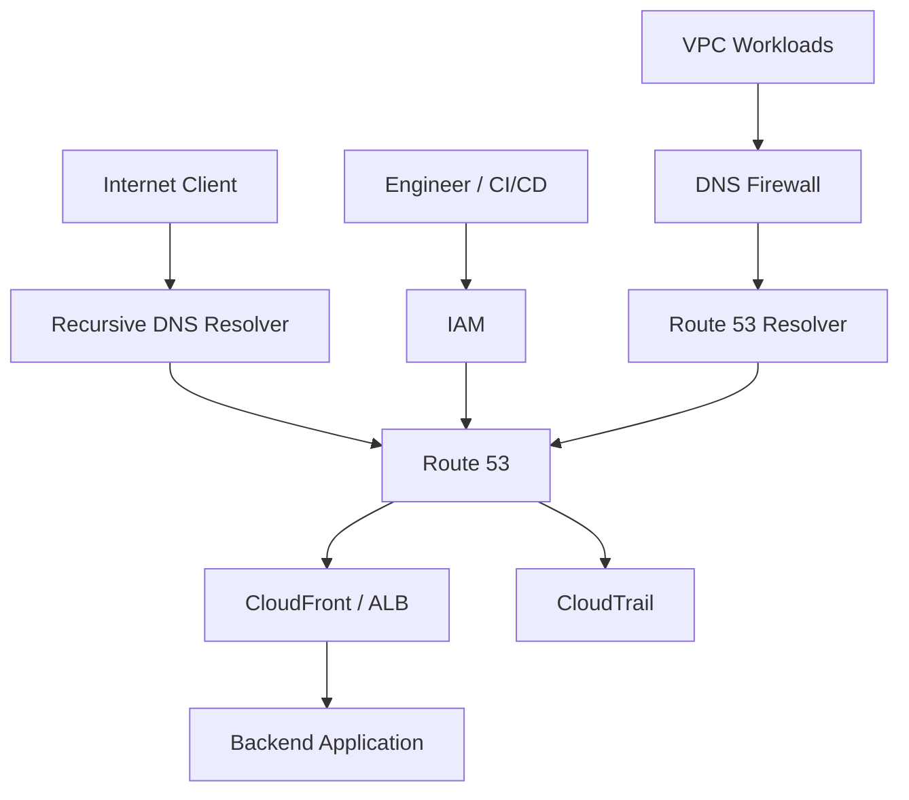
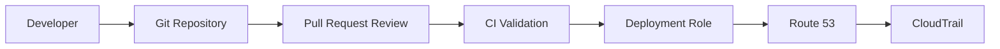
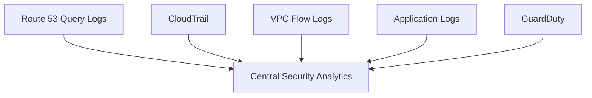
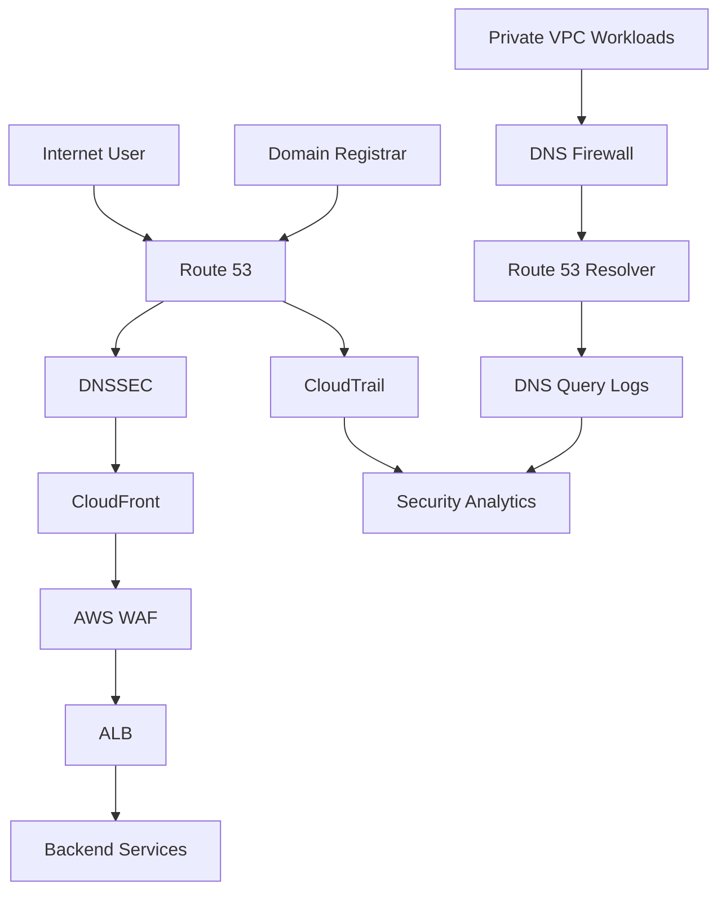

# 04- DNS Attack Protection

## Overview

DNS is a critical part of the application request path and a high-value security boundary. A DNS failure, malicious record change, or abuse of DNS infrastructure can redirect traffic, expose services, disrupt availability, or support broader attacks.

For AWS environments using Amazon Route 53, DNS protection should be designed across multiple layers:

- **Route 53 configuration security** protects hosted zones and records from unauthorized changes.
- **IAM** controls who can modify DNS infrastructure.
- **DNSSEC** protects the authenticity and integrity of responses for supported public hosted zones.
- **Route 53 Resolver DNS Firewall** helps control outbound DNS resolution from VPC workloads.
- **Route 53 health checks and routing policies** improve resilience but are not substitutes for security controls.
- **CloudTrail** provides an audit trail for Route 53 API activity.
- **Query logging** provides visibility into DNS queries.
- **AWS WAF and CloudFront** protect HTTP applications after DNS resolution and should be considered complementary controls.
- **GuardDuty and centralized security analytics** can help identify suspicious DNS-related behavior.

The important architectural distinction is:

> Route 53 protects DNS infrastructure and DNS behavior; it does not replace application-layer security controls.

---

## DNS Attack Surface

A production DNS architecture has several security boundaries.



Security concerns exist in both the **control plane** and the **data plane**.

| Attack surface | Example threat | Primary controls |
|---|---|---|
| DNS records | Unauthorized modification | IAM, CloudTrail, CI/CD controls |
| DNS responses | Response tampering | DNSSEC |
| VPC DNS queries | Malicious domain resolution | Route 53 Resolver DNS Firewall |
| Public application | HTTP attacks | CloudFront, AWS WAF, ALB |
| DNS telemetry | Loss of visibility | Query logging, CloudTrail |
| AWS credentials | Unauthorized DNS changes | IAM, MFA, temporary credentials |
| Domain registration | Domain takeover | Registrar security, MFA, registry controls |

---

## DNS Attack Categories

Common DNS-related threats include:

| Attack | Description | Primary concern |
|---|---|---|
| DNS hijacking | Unauthorized control or modification of DNS | Integrity |
| DNS spoofing | Forged DNS responses | Integrity |
| Cache poisoning | Malicious data inserted into resolver cache | Integrity |
| DDoS | Overwhelming DNS or application infrastructure | Availability |
| DNS tunneling | Using DNS for covert communication | Confidentiality |
| Malicious domains | Workloads resolving attacker-controlled domains | Security |
| Domain takeover | Unauthorized control of domain infrastructure | Integrity |
| Subdomain takeover | Abandoned resource referenced by DNS | Integrity |
| Record deletion | Removing required DNS records | Availability |
| Credential compromise | Stolen AWS permissions used to modify DNS | Integrity |

A senior engineer should avoid treating these as one problem. Different attack classes require different controls.

---

## Protecting Route 53 With IAM

The most fundamental Route 53 security control is restricting who can modify DNS.

A production application generally should not have permissions such as:

```text
route53:*
```

Instead, separate permissions according to responsibility.

For example:

```text
Application Runtime
    │
    └── DNS read/use only

CI/CD Deployment Role
    │
    └── Specific DNS modification permissions

DNS Administration Role
    │
    └── Broader Route 53 management

Security Team
    │
    └── Audit and investigation permissions
```

This limits the blast radius if an application or deployment credential is compromised.

---

## Least-Privilege Route 53 Permissions

A deployment pipeline that only needs to update records should not automatically receive permission to:

- Delete hosted zones
- Create arbitrary hosted zones
- Modify unrelated environments
- Change health-check configuration
- Modify domains outside its ownership boundary

Where supported, scope IAM policies to specific hosted zone resources and operations.

A conceptual policy is:

```json
{
  "Version": "2012-10-17",
  "Statement": [
    {
      "Sid": "ManageProductionRecords",
      "Effect": "Allow",
      "Action": [
        "route53:ChangeResourceRecordSets",
        "route53:GetChange",
        "route53:ListResourceRecordSets"
      ],
      "Resource": "arn:aws:route53:::hostedzone/Z1234567890ABC"
    }
  ]
}
```

The exact permissions required depend on the deployment workflow.

Do not blindly copy broad administrative policies into production.

---

## Separate DNS Administration From Application Roles

A backend service such as Django or FastAPI typically needs to resolve DNS names.

It does not need permission to modify DNS records.

For example:

```text
FastAPI
   │
   ├── PostgreSQL DNS resolution
   ├── Redis DNS resolution
   ├── External API DNS resolution
   │
   └── No Route 53 write permission
```

This is an important security boundary.

If an application is compromised and has Route 53 write permissions, an attacker may be able to redirect production traffic.

---

## Protecting the DNS Control Plane

The Route 53 control plane should be treated as privileged infrastructure.

Recommended controls include:

- IAM least privilege
- Temporary credentials
- MFA for privileged human access
- SSO where available
- Dedicated deployment roles
- Separation of production and non-production roles
- CloudTrail logging
- Change review
- Infrastructure as code
- Automated policy validation
- Restricted break-glass access

A good operational model is:

```text
Developer
   │
   ▼
Git Pull Request
   │
   ▼
CI/CD Validation
   │
   ▼
Deployment Role
   │
   ▼
Route 53
   │
   ▼
CloudTrail
```

This provides both preventive and detective controls.

---

## DNSSEC

DNSSEC provides cryptographic authentication of DNS data.

Its purpose is to help a resolver determine whether DNS data originated from the authoritative DNS system and was not modified in transit.

Without DNSSEC:

```text
Client
  │
  ▼
Resolver
  │
  ▼
DNS response
```

With DNSSEC:

```text
Client
  │
  ▼
Resolver
  │
  ▼
DNS response + DNSSEC validation
  │
  ▼
Authenticated DNS data
```

DNSSEC addresses **DNS data integrity and authenticity**.

It does not encrypt ordinary DNS queries.

---

## What DNSSEC Protects

DNSSEC helps protect against attacks where an attacker attempts to provide false DNS data.

For example:

```text
Expected:
api.example.com → legitimate endpoint

Attacker attempts:
api.example.com → malicious endpoint
```

DNSSEC allows validating resolvers to verify the cryptographic chain associated with the DNS data.

It does not protect:

- Compromised AWS credentials
- Unauthorized Route 53 API calls
- Application vulnerabilities
- HTTP attacks
- Stolen domain registrar credentials
- DDoS against unrelated application layers

DNSSEC is one layer of a broader security architecture.

---

## DNSSEC Chain of Trust

The conceptual DNSSEC trust model is:

```text
Root
  │
  ▼
TLD
  │
  ▼
Domain
  │
  ▼
Route 53 Hosted Zone
  │
  ▼
DNSSEC Signed Record
```

The resolver validates the cryptographic chain.

The key engineering principle is:

> DNSSEC protects the authenticity of DNS data, but the DNS infrastructure must still be securely administered.

---

## DNSSEC Key Management

DNSSEC introduces cryptographic key management into DNS operations.

This creates additional operational responsibilities:

- Key lifecycle management
- Key rotation
- Key storage
- Validation testing
- Monitoring
- Recovery procedures

For Route 53 DNSSEC signing, AWS manages the signing process and integrates the required key-management infrastructure.

Production teams should still understand the operational implications.

A DNSSEC misconfiguration can cause validating resolvers to reject DNS responses.

That means:

```text
Security control
      │
      └── Incorrect configuration
                 │
                 ▼
          DNS resolution failure
```

Security changes must therefore be tested carefully.

---

## DNSSEC and Availability

DNSSEC improves integrity but introduces additional failure modes if configured incorrectly.

For example:

```text
DNSSEC enabled
      │
      ▼
Incorrect delegation / signing configuration
      │
      ▼
Validation failure
      │
      ▼
Some clients cannot resolve the domain
```

Therefore:

- Validate DNSSEC before production rollout.
- Monitor DNSSEC status.
- Document key-management procedures.
- Test recovery procedures.
- Treat DNSSEC changes as production infrastructure changes.

Do not assume that enabling a security feature automatically improves availability.

---

## Route 53 Resolver DNS Firewall

Route 53 Resolver DNS Firewall provides filtering for DNS queries originating from VPC resources.

Conceptually:

```text
EC2 / ECS / EKS / Lambda
          │
          ▼
Route 53 Resolver
          │
          ▼
DNS Firewall
     ┌────┴────┐
     │         │
   ALLOW      BLOCK
     │         │
     ▼         ▼
 DNS Query   NXDOMAIN /
             blocked response
```

It is useful for controlling outbound DNS resolution.

Common use cases include:

- Blocking known malicious domains
- Preventing access to prohibited domains
- Applying organizational domain policies
- Reducing malware communication
- Controlling DNS-based exfiltration risks

---

## Why DNS Firewall Matters

Consider a compromised EC2 instance:

```text
Compromised EC2
      │
      │ DNS query
      ▼
attacker-domain.example
```

Without DNS filtering:

```text
DNS query
   │
   ▼
Successful resolution
   │
   ▼
Outbound connection
```

With DNS Firewall:

```text
DNS query
   │
   ▼
DNS Firewall
   │
   ▼
Domain blocked
```

This does not guarantee that the compromised host cannot communicate externally, but it adds a valuable preventive layer.

---

## DNS Firewall Rule Groups

DNS Firewall uses rule groups containing rules that determine how DNS queries are handled.

A production policy might conceptually contain:

```text
Rule Group
 ├── Known malicious domains → BLOCK
 ├── Internal domains → ALLOW
 ├── Approved external domains → ALLOW
 └── Other domains → ALERT / default policy
```

The exact behavior depends on the rule configuration and rule priority.

Rule groups can be associated with VPCs.

---

## DNS Firewall Allow Lists and Block Lists

Two common approaches are:

### Block List

```text
Known malicious domains
        │
        ▼
      BLOCK
```

Useful when the organization wants broad DNS access but needs to prevent known threats.

### Allow List

```text
Approved domains
        │
        ▼
      ALLOW
```

Useful in highly restricted environments.

However, allow-list architectures require careful dependency management.

A backend service may unexpectedly depend on:

- Package repositories
- Authentication providers
- AWS endpoints
- Monitoring services
- External APIs
- Certificate services

Do not introduce a restrictive allow list without understanding application dependencies.

---

## DNS Firewall and Kubernetes

Kubernetes environments require special consideration.

A typical architecture is:

```text
Pod
 │
 ▼
CoreDNS
 │
 ├── Cluster-local query
 │       └── CoreDNS
 │
 └── External query
         │
         ▼
     VPC Resolver
         │
         ▼
     DNS Firewall
```

This means DNS Firewall may not see every DNS query generated inside Kubernetes.

Cluster-local queries can be answered by CoreDNS before reaching the VPC Resolver.

Security teams should therefore understand the entire DNS path before relying on Resolver-level filtering as the only DNS security control.

---

## DNS Tunneling

DNS tunneling abuses DNS queries and responses as a communication channel.

Conceptually:

```text
Compromised Workload
       │
       │ encoded data
       ▼
attacker-controlled-domain.com
       │
       ▼
Attacker DNS infrastructure
```

The attacker may encode information into subdomains.

For example:

```text
<encoded-data>.example-attacker.com
```

Repeated queries can transport information through DNS.

Potential indicators include:

- Very long query names
- High numbers of unique subdomains
- Random-looking labels
- High query frequency
- Unusual TXT queries
- Domains not associated with application functionality

DNS query logging is valuable for detecting these patterns.

---

## DNS Exfiltration

DNS can also be abused for data exfiltration.

A simplified example:

```text
Sensitive data
     │
     ▼
Encode
     │
     ▼
DNS query
     │
     ▼
attacker.example.com
```

The DNS infrastructure may be used as a covert transport channel.

Defensive controls include:

- Resolver query logging
- DNS Firewall
- Egress controls
- VPC Flow Logs
- GuardDuty
- Endpoint security
- SIEM correlation
- Application-level monitoring

DNS filtering alone is not sufficient to prevent all forms of exfiltration.

---

## DNS Hijacking

DNS hijacking occurs when an attacker gains unauthorized control over DNS configuration or causes clients to use malicious DNS infrastructure.

Possible attack paths include:

```text
Compromised AWS credentials
        │
        ▼
Route 53 API
        │
        ▼
Malicious record
```

or:

```text
Compromised registrar account
        │
        ▼
Nameserver delegation changed
        │
        ▼
Attacker-controlled DNS
```

This demonstrates why DNS security must cover both:

- AWS Route 53
- Domain registrar / domain delegation

Securing only Route 53 is insufficient if an attacker can change the domain's nameservers at the registrar.

---

## Registrar Security

The domain registrar is outside the Route 53 hosted-zone API boundary.

Production domain security should include:

- Strong authentication
- MFA
- Restricted administrative access
- Registrar account monitoring
- Registry locking features where applicable
- Controlled nameserver changes
- Recovery procedures
- Documented ownership

The security chain is:

```text
Registrar
   │
   ▼
Nameserver Delegation
   │
   ▼
Route 53 Hosted Zone
   │
   ▼
DNS Records
   │
   ▼
Application
```

A compromise anywhere in this chain can affect DNS integrity.

---

## Subdomain Takeover

Subdomain takeover can occur when a DNS record points to a resource that has been deleted or abandoned while the DNS record remains.

For example:

```text
old-api.example.com
        │
        ▼
CNAME
        │
        ▼
Deleted cloud resource
```

If an attacker can later claim the referenced resource, the attacker may control:

```text
old-api.example.com
```

Potential targets include abandoned:

- Load balancers
- Cloud application endpoints
- SaaS resources
- Static hosting resources

The prevention strategy is:

- Remove obsolete DNS records.
- Inventory DNS records.
- Monitor dangling records.
- Remove DNS records before deleting dependent resources where appropriate.
- Include DNS cleanup in infrastructure teardown workflows.

---

## DNS Record Ownership

A production organization should know:

```text
Who owns this record?
Who deploys it?
What resource does it target?
What service depends on it?
What happens if the target is deleted?
```

A DNS inventory can contain:

| Record | Owner | Target | Environment | Lifecycle |
|---|---|---|---|---|
| `api.example.com` | Payments | ALB | Production | Active |
| `old-api.example.com` | Legacy | Deleted resource | Production | Review |
| `internal.example.com` | Platform | Private service | Production | Active |

This becomes especially important in large organizations with hundreds or thousands of DNS records.

---

## DDoS Protection

Route 53 is designed to provide highly available DNS infrastructure, but DNS availability and application availability are separate concerns.

A typical public architecture is:

```text
Internet
   │
   ▼
Route 53
   │
   ▼
CloudFront
   │
   ▼
AWS WAF
   │
   ▼
ALB
   │
   ▼
Application
```

Each layer addresses different threats.

| Layer | Primary role |
|---|---|
| Route 53 | DNS resolution and routing |
| CloudFront | Global content delivery and edge protection |
| AWS WAF | HTTP request filtering |
| ALB | Application load balancing |
| Shield | DDoS protection |
| Application | Authentication and business security |

Do not expect Route 53 DNS routing to filter malicious HTTP requests.

---

## Route 53 Health Checks Are Not Security Controls

Health checks determine whether endpoints appear healthy for routing purposes.

For example:

```text
Endpoint A
   │
   ├── Healthy → Route traffic
   │
   └── Unhealthy → Fail over
```

They do not determine whether a request is malicious.

A healthy compromised endpoint is still healthy from the perspective of a basic health check.

Therefore:

```text
Health Checks → Availability
Security Controls → Security
```

Do not use health checks as a replacement for WAF, authentication, authorization, or endpoint security.

---

## DNS Firewall vs AWS WAF

These controls operate at different layers.

| Feature | DNS Firewall | AWS WAF |
|---|---|---|
| Layer | DNS | HTTP/HTTPS |
| Primary purpose | DNS query filtering | Web request filtering |
| Blocks malicious domains | Yes | Not its primary purpose |
| Blocks SQL injection | No | Yes |
| Blocks XSS | No | Yes |
| Controls outbound DNS | Yes | No |
| Protects API endpoint | Indirectly | Directly |
| Useful for compromised workloads | Yes | Limited |

A production architecture may use both.

```text
Outbound workload traffic
        │
        ▼
DNS Firewall
        │
        ▼
DNS resolution
```

and:

```text
Internet client
        │
        ▼
CloudFront
        │
        ▼
AWS WAF
        │
        ▼
ALB
        │
        ▼
Application
```

---

## CloudTrail for DNS Security

CloudTrail should be used to detect unauthorized Route 53 changes.

Important operations to monitor include:

- Record modifications
- Hosted zone changes
- Health-check changes
- Resolver configuration changes
- DNS Firewall configuration changes
- IAM changes affecting DNS administration

A security investigation might look like:

```text
DNS anomaly
    │
    ▼
Query logs
    │
    ▼
Unexpected destination
    │
    ▼
CloudTrail
    │
    ├── DNS configuration changed?
    │
    └── No configuration change
```

If a DNS record changed unexpectedly, CloudTrail can help establish the administrative timeline.

---

## Protecting DNS Changes in CI/CD

DNS should preferably be modified through controlled pipelines.

A mature workflow looks like:



Useful controls include:

- Pull request review
- Policy validation
- Environment-specific IAM roles
- Production deployment approval
- Automated drift detection
- CloudTrail auditing
- Rollback procedures

Manual production DNS changes should be treated as exceptional operations.

---

## DNS Change Validation

Before deploying a production DNS change, validate:

```text
Record name
Record type
Target
TTL
Routing policy
Health check
Hosted zone
Environment
```

For example, accidentally applying:

```text
api.production.example.com
```

to the development hosted zone may not immediately produce an obvious application error.

The deployment system should therefore validate environment and hosted-zone ownership.

---

## DNS Security Monitoring

Monitor security-relevant events such as:

- Route 53 record modifications
- Hosted zone creation/deletion
- Nameserver changes
- DNSSEC configuration changes
- DNS Firewall rule changes
- Unexpected DNS query spikes
- High NXDOMAIN rates
- Unusual external domains
- High-frequency queries
- Suspicious domain patterns
- Unauthorized IAM activity

A useful architecture is:

```text
Route 53
   │
   ├── CloudTrail
   ├── Query Logs
   └── DNSSEC status
        │
        ▼
Central Security Analytics
        │
        ▼
Detection Rules
        │
        ▼
Security Team
```

---

## Security Logging Correlation

DNS security becomes much stronger when multiple telemetry sources are correlated.



For example:

```text
DNS query:
    suspicious.example.com

VPC flow:
    workload → suspicious IP:443

Application:
    unexpected outbound request

GuardDuty:
    suspicious network behavior
```

The combined evidence is significantly stronger than any individual signal.

---

## Production Security Architecture

A layered production architecture can look like:



This provides layered protection:

```text
Domain ownership
       ↓
DNS integrity
       ↓
DNS query control
       ↓
Edge protection
       ↓
HTTP protection
       ↓
Application security
       ↓
Audit and detection
```

---

## Defense in Depth

A senior AWS architecture should not depend on a single DNS security feature.

A practical layered model is:

| Layer | Control |
|---|---|
| Domain | Registrar security |
| AWS identity | IAM |
| DNS integrity | DNSSEC |
| DNS egress | Resolver DNS Firewall |
| DNS auditing | CloudTrail |
| DNS visibility | Query logging |
| Edge | CloudFront |
| HTTP security | AWS WAF |
| DDoS | AWS Shield |
| Network | VPC controls |
| Workload | Endpoint/application security |
| Detection | GuardDuty / SIEM |

Each control should have a clearly defined responsibility.

---

## Common Mistakes

### Assuming DNSSEC Encrypts DNS

**Problem:** DNSSEC is treated as DNS encryption.

**Why it fails:** DNSSEC provides authentication and integrity, not confidentiality.

**Better approach:** Use appropriate encrypted DNS mechanisms where required and understand the client/resolver architecture.

---

### Assuming DNSSEC Prevents DNS Hijacking

**Problem:** Teams enable DNSSEC and assume unauthorized Route 53 changes are impossible.

**Why it fails:** A privileged attacker who can modify the authoritative DNS configuration may still cause operational damage.

**Better approach:**

```text
IAM
+
MFA
+
CI/CD controls
+
CloudTrail
+
DNSSEC
```

Use multiple controls.

---

### Giving Applications Route 53 Permissions

**Problem:** Runtime workloads receive DNS write permissions.

**Risk:** A compromised workload could potentially modify production DNS.

**Better approach:** Keep DNS administration privileges in dedicated roles.

---

### Using DNS Firewall as a Complete Egress Control

**Problem:** DNS Firewall is assumed to prevent all outbound communication.

**Why it fails:** Attackers can potentially use IP addresses, alternative protocols, compromised approved domains, or other channels.

**Better approach:** Combine DNS filtering with network egress controls, VPC Flow Logs, endpoint security, and threat detection.

---

### Assuming DNS Firewall Sees Every Kubernetes Query

**Problem:** All pod DNS traffic is expected to pass through Route 53 Resolver.

**Why it fails:** CoreDNS can resolve cluster-local records locally.

**Better approach:** Understand the complete CoreDNS forwarding configuration.

---

### Leaving Dangling DNS Records

**Problem:** DNS records remain after cloud resources are deleted.

**Risk:** Potential subdomain takeover.

**Better approach:** Treat DNS records and target resources as a lifecycle pair.

---

### Ignoring the Registrar

**Problem:** AWS Route 53 is secured but the registrar account is weakly protected.

**Risk:** An attacker can potentially modify nameserver delegation.

**Better approach:** Secure both the registrar and Route 53.

---

### Treating Health Checks as Security

**Problem:** Health checks are assumed to detect malicious endpoints.

**Why it fails:** Health checks measure endpoint health, not trustworthiness.

**Better approach:** Use health checks for availability and dedicated security controls for threats.

---

### Using Only One Telemetry Source

**Problem:** DNS query logs are considered sufficient for security investigation.

**Why it fails:** They show DNS activity but not necessarily the resulting network connection, application behavior, or infrastructure change.

**Better approach:** Correlate:

```text
DNS Logs
+
VPC Flow Logs
+
CloudTrail
+
Application Logs
+
Security Findings
```

---

## Interview Traps

### Does DNSSEC Encrypt DNS Traffic?

**No.**

DNSSEC provides authentication and integrity of DNS data.

---

### Does DNSSEC Stop Unauthorized Route 53 API Calls?

**No.**

IAM and AWS control-plane security prevent unauthorized API changes.

---

### Does DNS Firewall Protect HTTP APIs?

**Not directly.**

DNS Firewall controls DNS resolution. AWS WAF operates at the HTTP/HTTPS layer.

---

### Are Route 53 Health Checks Security Controls?

**No.**

They are primarily availability and routing mechanisms.

---

### Can DNS Firewall Prevent All Data Exfiltration?

**No.**

It can reduce DNS-based threats but cannot replace network and endpoint security.

---

### Does Securing Route 53 Secure the Domain?

**Not necessarily.**

Domain registrar and delegation security must also be considered.

---

### What Protects Against Unauthorized DNS Record Changes?

Use layered controls:

```text
IAM
+
MFA / SSO
+
CI/CD
+
Least privilege
+
CloudTrail
+
Change review
```

DNSSEC addresses response authenticity rather than replacing access control.

---

## Production Checklist

Before considering Route 53 security mature, verify:

### Identity and Access

- [ ] Route 53 permissions follow least privilege.
- [ ] Application roles do not have unnecessary DNS write permissions.
- [ ] Production DNS administration uses dedicated roles.
- [ ] Privileged human access uses strong authentication.
- [ ] Temporary credentials are preferred over long-lived credentials.

### DNS Integrity

- [ ] DNSSEC is evaluated for public domains where appropriate.
- [ ] DNSSEC configuration is monitored.
- [ ] Domain registrar security is configured.
- [ ] Nameserver delegation changes are controlled.

### DNS Filtering

- [ ] Resolver DNS Firewall is evaluated for VPC workloads.
- [ ] Malicious-domain blocking is enabled where appropriate.
- [ ] Rule groups are version-controlled.
- [ ] Kubernetes DNS behavior is understood before relying on Resolver filtering.

### Logging and Auditing

- [ ] CloudTrail is enabled.
- [ ] Route 53 API activity is monitored.
- [ ] Resolver query logging is configured where required.
- [ ] Public hosted zone query logging is evaluated where appropriate.
- [ ] DNS logs have defined retention.
- [ ] Security teams can access required telemetry.

### Infrastructure Security

- [ ] DNS changes are managed through CI/CD where practical.
- [ ] Production changes require appropriate review.
- [ ] DNS records are inventoried.
- [ ] Dangling records are periodically reviewed.
- [ ] DNS and target-resource lifecycles are coordinated.

### Detection

- [ ] Unexpected DNS volume is monitored.
- [ ] Suspicious domains are investigated.
- [ ] DNS logs are correlated with network logs.
- [ ] GuardDuty/security findings are incorporated into investigations.
- [ ] Incident-response procedures include DNS investigation.

---

## Key Takeaways

- DNS is a security-critical part of a production architecture, not merely a naming service.
- Route 53 security requires separate controls for DNS configuration, DNS response integrity, DNS query behavior, and security auditing.
- IAM is the primary control for preventing unauthorized Route 53 API operations.
- Applications generally should not have permission to modify production DNS records.
- DNSSEC provides cryptographic authentication and integrity for supported DNS responses; it does not provide DNS confidentiality.
- DNSSEC does not replace IAM, registrar security, CloudTrail, or operational change controls.
- Route 53 Resolver DNS Firewall can restrict DNS queries generated by VPC workloads and help block known malicious domains.
- DNS Firewall is a DNS-layer control and should not be treated as a complete network egress security mechanism.
- Kubernetes environments require careful analysis because CoreDNS can answer some queries without forwarding them to Route 53 Resolver.
- DNS tunneling and DNS-based exfiltration can be detected through query behavior, but effective protection requires multiple security layers.
- Subdomain takeover risk can arise from dangling DNS records that reference deleted or abandoned resources.
- Domain registrar security is as important as Route 53 security because nameserver delegation can determine which DNS infrastructure controls a domain.
- Route 53 health checks improve availability and routing decisions but are not security controls.
- CloudFront, AWS WAF, Shield, and application security operate at different layers and complement Route 53 rather than replace it.
- CloudTrail provides visibility into Route 53 control-plane activity, while query logs provide visibility into DNS traffic.
- DNS security investigations should correlate query logs, CloudTrail, VPC Flow Logs, application logs, and threat-detection findings.
- Production DNS changes should preferably flow through reviewed, auditable CI/CD pipelines using dedicated IAM deployment roles.
- The senior-engineering approach is **defense in depth**: secure domain ownership, restrict DNS administration, authenticate DNS responses, control DNS queries, monitor changes, and correlate DNS telemetry with the rest of the infrastructure security stack.