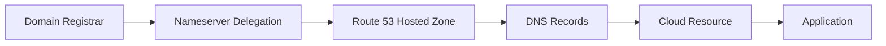
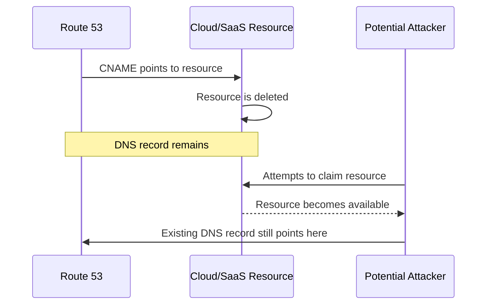
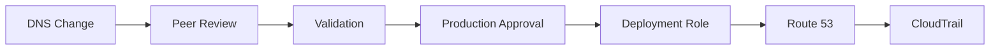
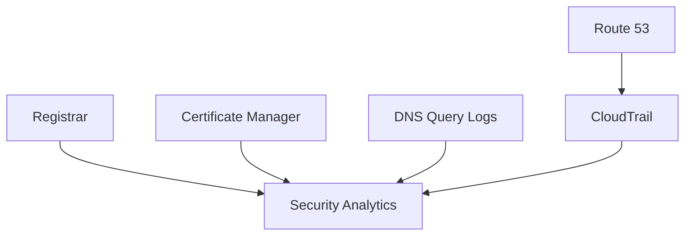

# 05- Domain and Subdomain Security

## Overview

Domain and subdomain security is the practice of protecting the DNS hierarchy that maps application names to infrastructure. In a production AWS environment, this includes the domain registrar, Route 53 hosted zones, DNS records, delegated subdomains, TLS certificates, cloud resources, and the processes that create and remove them.

A DNS compromise can have a much larger impact than a single application failure. An attacker who gains control of a production record may redirect users to malicious infrastructure, intercept application traffic through a separately compromised certificate path, facilitate phishing, or create convincing malicious subdomains.

A secure domain architecture therefore needs to protect the complete chain:

```text
Domain Registrar
      │
      ▼
Nameserver Delegation
      │
      ▼
Route 53 Hosted Zone
      │
      ▼
DNS Records
      │
      ├── CloudFront
      ├── ALB
      ├── API Gateway
      ├── S3
      └── Other Services
```

The most important engineering principle is:

> A DNS record is part of the security boundary of the resource it points to.

Deleting an infrastructure resource without reviewing its DNS records, or delegating a subdomain without controlling who can modify it, can create security vulnerabilities.

---

## Domain Security Boundaries

A production domain typically contains multiple administrative boundaries.

For example:

```text
example.com
│
├── www.example.com
├── api.example.com
├── admin.example.com
├── static.example.com
├── auth.example.com
│
└── internal.example.com
      ├── service-a.internal.example.com
      └── service-b.internal.example.com
```

Each name may have:

- A different application owner
- A different AWS account
- A different hosted zone
- A different deployment pipeline
- A different security requirement
- A different lifecycle

This becomes important as organizations scale.

A small environment may have one hosted zone:

```text
example.com
```

A larger organization may separate responsibilities:

```text
Root Account
    │
    ├── Production Account
    │      └── example.com
    │
    ├── Platform Account
    │      └── platform.example.com
    │
    └── Development Account
           └── dev.example.com
```

The separation reduces blast radius and makes ownership clearer.

---

## Domain Security Chain

Domain security should be considered end-to-end.



An attacker only needs to compromise an important link in this chain to affect traffic.

For example:

```text
Registrar compromised
        │
        ▼
Nameserver delegation changed
        │
        ▼
Attacker-controlled DNS
        │
        ▼
Traffic redirected
```

Alternatively:

```text
AWS credentials compromised
        │
        ▼
Route 53 record modified
        │
        ▼
api.example.com
        │
        ▼
Unexpected endpoint
```

These are different attack paths and require different controls.

---

## Protecting the Domain Registrar

The registrar controls domain-level configuration, including the delegation that identifies authoritative nameservers.

Registrar security should therefore include:

- Strong authentication
- MFA
- Dedicated administrative accounts
- Restricted administrative access
- Recovery procedures
- Monitoring of domain changes
- Controlled nameserver changes
- Registry-level protection where available
- Documented ownership and escalation procedures

The registrar account should not be treated like an ordinary SaaS account.

A compromise at this layer can potentially invalidate controls implemented inside Route 53.

---

## Route 53 Hosted Zone Security

A Route 53 hosted zone contains the authoritative DNS records for a domain or delegated subdomain.

Production hosted zones should be treated as privileged infrastructure.

Typical controls include:

| Control | Purpose |
|---|---|
| IAM | Restrict Route 53 API access |
| Least privilege | Limit record modification scope |
| CI/CD | Centralize controlled DNS changes |
| CloudTrail | Audit API activity |
| Infrastructure as Code | Version and review DNS configuration |
| Change review | Prevent accidental production changes |
| Monitoring | Detect unexpected modifications |
| DNSSEC | Protect DNS response integrity where applicable |

Avoid granting broad Route 53 permissions to application runtime roles.

---

## Least-Privilege DNS Access

A backend application normally needs DNS resolution but does not need permission to modify DNS.

For example:

```text
FastAPI Application
      │
      ├── Resolve PostgreSQL hostname
      ├── Resolve Redis hostname
      ├── Resolve external API hostname
      │
      └── No Route 53 write access
```

DNS administration should instead be performed by dedicated roles.

```text
Developer
    │
    ▼
Pull Request
    │
    ▼
CI/CD
    │
    ▼
Dedicated DNS Deployment Role
    │
    ▼
Route 53
```

This limits the blast radius of compromised application credentials.

---

## Public vs Private Hosted Zones

Route 53 supports both public and private hosted zones.

| Hosted zone | Visibility | Typical use |
|---|---|---|
| Public | Internet DNS | `api.example.com` |
| Private | Associated VPCs | `db.internal.example.com` |

A private hosted zone can be used for internal service discovery.

For example:

```text
Production VPC
│
├── api.internal.example.com
├── postgres.internal.example.com
└── redis.internal.example
```

These names should not be exposed through public DNS when they are intended only for internal workloads.

---

## Avoiding Internal Information Leakage

DNS names can unintentionally reveal infrastructure details.

Examples:

```text
database-prod-01.example.com
internal-admin.example.com
vpn-prod.example.com
jenkins.example.com
```

Public DNS should expose only what is required.

Prefer architecture-oriented public names:

```text
api.example.com
app.example.com
auth.example.com
```

Internal infrastructure names can remain inside private DNS namespaces where appropriate.

DNS naming is not a security control by itself, but unnecessary exposure increases reconnaissance information.

---

## Subdomain Delegation

A subdomain can be delegated to another authoritative DNS environment.

For example:

```text
example.com
    │
    └── dev.example.com
            │
            ▼
       Separate Hosted Zone
```

The parent zone can delegate the subdomain using NS records.

This can provide organizational isolation.

For example:

```text
example.com
    │
    ├── Production DNS Team
    │
    └── dev.example.com
            │
            └── Development Team
```

However, delegation also creates a new trust boundary.

---

## Delegated Subdomain Security

When delegating:

```text
team.example.com
```

the parent organization should understand:

- Who controls the delegated zone?
- Which AWS account owns it?
- Who can modify it?
- Which resources can it reference?
- Who monitors it?
- What happens if the team or account is removed?
- How is the delegation revoked?

A delegated subdomain should have an explicit owner and lifecycle.

---

## Subdomain Takeover

Subdomain takeover occurs when a DNS record points to a resource that is no longer controlled by the organization while the DNS record remains active.

For example:

```text
old.example.com
      │
      ▼
CNAME
      │
      ▼
Deleted external resource
```

If another party can claim that external resource, they may be able to serve content through:

```text
old.example.com
```

The DNS record itself may still look valid.

---

## Common Takeover Pattern

A typical lifecycle problem looks like:



The vulnerability comes from a mismatch between DNS lifecycle and resource lifecycle.

---

## Preventing Subdomain Takeover

Use these controls:

- Remove DNS records when resources are decommissioned.
- Inventory CNAME and alias records.
- Detect dangling references.
- Include DNS cleanup in infrastructure teardown.
- Review third-party SaaS DNS records.
- Avoid creating DNS records manually outside infrastructure workflows.
- Monitor records targeting deleted resources.

A useful rule is:

> Resource deletion and DNS cleanup should be part of the same infrastructure lifecycle.

---

## DNS and CloudFront

A common production pattern is:

```text
www.example.com
       │
       ▼
Route 53
       │
       ▼
CloudFront
       │
       ▼
Application Origin
```

The security boundary includes:

- Route 53 record
- CloudFront distribution
- TLS certificate
- Origin configuration
- AWS WAF
- Origin access controls where applicable

A DNS record pointing to the wrong distribution can redirect users to an unintended application.

---

## DNS and ALB

A typical API architecture is:

```text
api.example.com
      │
      ▼
Route 53
      │
      ▼
Application Load Balancer
      │
      ▼
ECS / EC2 / Kubernetes
      │
      ▼
Backend Application
```

The DNS record should be managed together with the ALB lifecycle.

When replacing an ALB:

```text
Old ALB
  │
  └── api.example.com

        ↓ migration

New ALB
  │
  └── api.example.com
```

DNS changes should be validated before deleting the old infrastructure.

---

## DNS and API Gateway

A custom API domain may use:

```text
api.example.com
      │
      ▼
Route 53
      │
      ▼
API Gateway
      │
      ▼
Lambda
```

Security considerations include:

- Correct custom-domain configuration
- Correct certificate
- Route 53 record ownership
- API Gateway authorization
- WAF where appropriate
- Controlled DNS changes

DNS security does not replace API authentication or authorization.

---

## DNS and S3

Static websites or content delivery architectures can use:

```text
www.example.com
      │
      ▼
Route 53
      │
      ▼
CloudFront
      │
      ▼
S3
```

The preferred production architecture is generally to place CloudFront in front of private S3 content rather than exposing the bucket unnecessarily.

DNS controls only the name-to-endpoint relationship.

It does not secure the underlying S3 bucket.

---

## Wildcard DNS Records

Wildcard records can simplify DNS management.

For example:

```text
*.example.com
```

may provide a default destination for otherwise unmatched subdomains.

However, wildcard records can create security ambiguity.

Suppose:

```text
*.example.com → CloudFront
```

Then an accidentally created or forgotten hostname may automatically become reachable through the wildcard.

This can hide configuration mistakes.

Use wildcard records deliberately and understand their interaction with more-specific records.

---

## Wildcard Certificate vs Wildcard DNS

These are separate concepts.

| Feature | Wildcard DNS | Wildcard TLS certificate |
|---|---|---|
| Purpose | DNS resolution | TLS identity |
| Example | `*.example.com` | `*.example.com` |
| Controls traffic routing | Yes | No |
| Encrypts traffic | No | TLS does |
| Proves DNS ownership | No | Certificate validation does |
| Covers arbitrary subdomains | DNS-dependent | Certificate scope-dependent |

Do not assume that having a wildcard certificate automatically makes every subdomain secure.

---

## High-Risk Administrative Subdomains

Some subdomains deserve additional scrutiny:

```text
admin.example.com
login.example.com
auth.example.com
vpn.example.com
mail.example.com
portal.example.com
```

These often become targets for phishing or credential attacks.

Recommended controls include:

- Strong authentication
- MFA
- SSO
- Restricted exposure
- WAF where appropriate
- Monitoring
- Separate administrative domains where justified
- Careful DNS ownership

DNS security reduces the chance of traffic redirection but does not secure the application itself.

---

## Environment Separation

Avoid mixing production and non-production DNS under uncontrolled shared access.

A common structure is:

```text
example.com
│
├── Production
│     ├── api.example.com
│     └── app.example.com
│
├── Staging
│     └── staging.example.com
│
└── Development
      └── dev.example.com
```

For larger organizations, separate AWS accounts can provide stronger isolation:

```text
Production Account
    └── Production DNS

Staging Account
    └── Staging DNS

Development Account
    └── Development DNS
```

The appropriate structure depends on organizational scale and operational requirements.

---

## DNS Ownership Model

Every production DNS record should have a clear owner.

A useful inventory is:

| Record | Owner | Target | Environment | Criticality |
|---|---|---|---|---|
| `api.example.com` | Payments | ALB | Production | Critical |
| `app.example.com` | Web | CloudFront | Production | Critical |
| `staging.example.com` | Platform | ALB | Staging | Medium |
| `old.example.com` | Unknown | External SaaS | Production | Review |

Ownership should be represented in infrastructure metadata, repository configuration, or another authoritative inventory.

An unknown DNS record is a security and operational liability.

---

## DNS as Code

Production DNS should preferably be managed through infrastructure as code.

A simplified Terraform example:

```hcl
resource "aws_route53_record" "api" {
  zone_id = var.zone_id
  name    = "api.example.com"
  type    = "A"

  alias {
    name                   = aws_lb.api.dns_name
    zone_id                = aws_lb.api.zone_id
    evaluate_target_health = true
  }
}
```

Benefits include:

- Version control
- Peer review
- Repeatability
- Environment separation
- Change history
- Automated deployment
- Reduced manual configuration

However, infrastructure as code does not automatically make DNS secure. The CI/CD identity performing the deployment still requires least privilege.

---

## DNS Change Management

A production DNS change should answer:

```text
What is changing?
Why is it changing?
Who approved it?
Which hosted zone is affected?
Which application depends on it?
What is the rollback plan?
```

A controlled workflow is:



This is especially important for high-value records such as authentication and API endpoints.

---

## DNS TTL and Security

TTL determines how long recursive resolvers may cache DNS responses.

Security-sensitive changes can therefore take time to propagate through existing caches.

For example:

```text
Old record
    │
    ▼
Resolver cache
    │
    │ TTL not expired
    ▼
Old destination
```

Changing a DNS record does not guarantee that every client immediately observes the new value.

This matters during:

- Incident response
- Infrastructure migration
- Domain takeover remediation
- Failover
- Security incidents

Do not rely on a DNS record change as an instantaneous security control.

---

## DNS Failover During Security Incidents

Suppose a production endpoint is compromised:

```text
api.example.com
      │
      ▼
Compromised endpoint
```

A DNS-based failover mechanism can redirect traffic:

```text
api.example.com
      │
      ├── Primary → unhealthy
      │
      └── Secondary → healthy
```

However, DNS failover is constrained by:

- Resolver caching
- TTL
- Health-check behavior
- Client behavior
- Application state
- Existing connections

DNS failover should therefore be part of a broader incident-response strategy.

---

## Certificate and DNS Security

TLS certificates and DNS are closely related but solve different problems.

```text
DNS
 │
 └── Where should traffic go?

TLS
 │
 └── Is this endpoint presenting a valid identity?
```

A secure application needs both.

For example:

```text
https://api.example.com
       │
       ├── Route 53 → correct endpoint
       │
       └── TLS certificate → api.example.com
```

If DNS is compromised but the attacker cannot obtain a valid certificate for the domain, modern TLS validation can prevent a straightforward impersonation attack.

However, certificate issuance and DNS control themselves must be secured.

---

## DNS Validation Records for Certificates

AWS Certificate Manager can use DNS validation.

Conceptually:

```text
ACM
 │
 └── Validation CNAME
          │
          ▼
      Route 53
```

The validation record proves control over the domain.

Security considerations include:

- Protecting the hosted zone
- Avoiding accidental deletion of required validation records
- Understanding which certificates depend on which records
- Restricting who can modify validation records

DNS validation records should not be treated as disposable records without understanding their purpose.

---

## Preventing Accidental Domain Exposure

Avoid creating public records for resources that are intended to remain private.

For example, this architecture is risky:

```text
internal-admin.example.com
          │
          ▼
Public DNS
          │
          ▼
Internal service
```

Instead, use private DNS and network access controls where appropriate:

```text
Private VPC
   │
   ▼
internal-admin.internal.example.com
   │
   ▼
Private service
```

DNS visibility and network reachability are separate controls.

A private DNS name does not automatically provide authorization, and a public DNS name does not necessarily mean the application is reachable if network controls block access.

---

## Security Monitoring

Monitor changes and anomalies across the domain lifecycle.

Important signals include:

- Route 53 record changes
- Hosted zone changes
- Nameserver delegation changes
- Unexpected DNS records
- New subdomains
- Deleted records
- Dangling CNAMEs
- DNSSEC configuration changes
- Certificate issuance
- Unexpected DNS query patterns
- Changes to critical administrative records

A centralized security architecture can correlate these signals:



The goal is not merely to log changes but to identify changes that violate expected ownership or deployment patterns.

---

## Critical DNS Records

Not all records have the same business impact.

A useful classification is:

| Criticality | Examples | Protection |
|---|---|---|
| Critical | `login`, `auth`, `api`, root domain | Strong change controls |
| High | `app`, `www`, payment endpoints | Controlled CI/CD |
| Medium | Staging endpoints | Standard controls |
| Low | Temporary development records | Lifecycle monitoring |

Critical records should have:

- Explicit owners
- Restricted write permissions
- Change approval
- Monitoring
- Documented recovery procedures

---

## Incident Response for DNS Compromise

If an unexpected DNS change is detected, first establish what changed and who changed it.

A useful investigation flow is:

```text
Unexpected DNS behavior
        │
        ▼
Inspect current record
        │
        ▼
Compare with expected configuration
        │
        ▼
Inspect CloudTrail
        │
        ▼
Identify principal
        │
        ▼
Contain credentials
        │
        ▼
Restore known-good DNS
        │
        ▼
Validate TLS and application behavior
        │
        ▼
Investigate broader compromise
```

Do not immediately assume the problem is limited to DNS.

A compromised AWS identity may have modified other resources.

---

## DNS Recovery

Production DNS recovery should be reproducible.

Recommended practices include:

- Store DNS configuration in version control.
- Keep hosted-zone identifiers documented.
- Maintain known-good record definitions.
- Use infrastructure as code.
- Document registrar configuration.
- Document nameserver delegation.
- Keep emergency administrative procedures.
- Test DNS recovery procedures periodically.

A recovery plan should answer:

```text
Can we recreate the hosted zone?
Can we restore the records?
Can we restore delegation?
Can we verify DNSSEC?
Can we validate TLS?
Can we identify the previous known-good configuration?
```

---

## Security Considerations for Microservices

Microservice environments can generate large DNS surfaces.

For example:

```text
api.example.com
auth.example.com
orders.example.com
payments.example.com
inventory.example.com
```

Internally:

```text
orders.internal.example.com
payments.internal.example.com
inventory.internal.example.com
```

As the number of services increases, so does the risk of:

- Orphaned records
- Unclear ownership
- Excessive public exposure
- Inconsistent access controls
- Stale service discovery records

Service discovery should therefore be designed together with DNS governance rather than allowing every team to create arbitrary public records.

---

## Kubernetes and Subdomain Security

Kubernetes can create additional DNS complexity.

A common architecture is:

```text
Internet
   │
   ▼
Route 53
   │
   ▼
Ingress / Load Balancer
   │
   ▼
Kubernetes
   │
   └── CoreDNS
```

External DNS controllers may automatically create Route 53 records.

This creates an important security boundary:

```text
Kubernetes Controller
        │
        ▼
AWS IAM Role
        │
        ▼
Route 53
```

The controller should receive only the permissions required for the DNS zones it manages.

A compromised cluster should not automatically gain unrestricted access to every production DNS zone.

---

## ExternalDNS Security

If a Kubernetes DNS controller such as ExternalDNS is used, apply least privilege to its AWS identity.

Prefer:

```text
Kubernetes Namespace / Workload
          │
          ▼
IAM Role
          │
          ▼
Specific Route 53 Hosted Zone
```

Avoid granting broad permissions such as:

```text
route53:*
```

across all hosted zones unless there is a compelling operational reason.

The DNS controller is effectively part of the DNS control plane and must be treated accordingly.

---

## Multi-Account DNS Architecture

Large AWS organizations frequently use multiple accounts.

A possible model is:

```text
AWS Organization
│
├── Network Account
│
├── Security Account
│
├── Production Account
│      └── Production services
│
├── Staging Account
│
└── Development Account
```

DNS ownership should be explicit.

For example:

```text
Central DNS Account
       │
       ├── example.com
       └── internal.example.com
```

or:

```text
Production Account
       └── example.com

Development Account
       └── dev.example.com
```

There is no universally correct structure. The important design principles are isolation, ownership, least privilege, and operational clarity.

---

## Advantages of Strong Domain Governance

A mature domain-security model provides:

- Reduced DNS takeover risk
- Reduced subdomain takeover risk
- Smaller IAM blast radius
- Clear ownership
- Better incident response
- Reproducible DNS configuration
- Safer infrastructure migrations
- Better auditability
- Easier multi-account management
- Reduced accidental public exposure

The operational benefit is as important as the security benefit.

---

## Limitations and Trade-offs

Strong controls introduce operational complexity.

| Control | Benefit | Trade-off |
|---|---|---|
| Central DNS management | Consistency | Potential bottleneck |
| Strict IAM | Smaller blast radius | More complex permissions |
| CI/CD-only changes | Auditability | Slower emergency changes |
| Subdomain delegation | Team autonomy | More trust boundaries |
| DNSSEC | DNS integrity | More operational complexity |
| Private DNS | Reduced exposure | Requires VPC design |
| Automated DNS controllers | Faster changes | Controller becomes privileged infrastructure |
| DNS inventory | Visibility | Requires maintenance |

The goal is not maximum restriction everywhere.

The goal is controlled autonomy with a clearly defined security boundary.

---

## Common Mistakes

### Treating DNS as Configuration Instead of Infrastructure

**Problem:** DNS changes are made manually without review.

**Risk:** Production traffic can be redirected accidentally or maliciously.

**Better approach:** Manage critical DNS through version-controlled infrastructure and controlled deployment roles.

---

### Securing Route 53 but Ignoring the Registrar

**Problem:** AWS permissions are tightly controlled while registrar credentials are weak.

**Risk:** Nameserver delegation can potentially be changed outside Route 53.

**Better approach:** Secure the entire domain lifecycle.

---

### Leaving CNAME Records After Resource Deletion

**Problem:** Infrastructure is deleted while DNS remains.

**Risk:** Potential subdomain takeover.

**Better approach:** Couple DNS and resource lifecycle management.

---

### Giving Kubernetes DNS Controllers Broad Permissions

**Problem:** A controller receives access to all Route 53 zones.

**Risk:** A compromised cluster can potentially affect unrelated DNS infrastructure.

**Better approach:** Scope permissions to the required hosted zones and operations.

---

### Assuming Private DNS Provides Security

**Problem:** An internal DNS name is considered equivalent to authorization.

**Why it fails:** DNS naming does not enforce application or network authorization.

**Better approach:** Combine private DNS with security groups, network controls, authentication, and authorization.

---

### Using Wildcards Without Understanding Their Scope

**Problem:** A wildcard record unintentionally handles unexpected hostnames.

**Risk:** Unknown applications may become reachable through a default route.

**Better approach:** Use wildcard records deliberately and monitor unexpected hostnames.

---

### Assuming DNS Changes Are Immediate

**Problem:** An incident response team changes a record and expects every client to use it immediately.

**Why it fails:** Recursive resolvers and other caches may retain the previous response until TTL expiration.

**Better approach:** Design migration and incident procedures around DNS caching behavior.

---

### Treating DNS Names as Secrets

**Problem:** Internal hostnames are assumed to be secret because they are not linked publicly.

**Why it fails:** DNS names should not be relied upon as a confidentiality mechanism.

**Better approach:** Enforce access through network and application security controls.

---

## Interview Traps

### Is DNS Security the Same as TLS Security?

**No.**

DNS determines where a name resolves. TLS authenticates the endpoint and protects application traffic in transit.

---

### Does a Private Hosted Zone Make an Application Secure?

**No.**

It controls DNS visibility. Authentication, authorization, networking, and application security are still required.

---

### What Causes Subdomain Takeover?

A common cause is a DNS record pointing to a deleted or abandoned external resource that another party can subsequently claim.

---

### Why Is the Registrar Important When Using Route 53?

Because domain delegation is controlled at the domain-registration layer. An attacker who controls nameserver delegation may be able to redirect authoritative DNS away from the intended Route 53 hosted zone.

---

### Should Applications Modify Route 53 Records?

Normally, no.

DNS modification should generally be performed by dedicated infrastructure or deployment identities with narrowly scoped permissions.

---

### Can DNSSEC Prevent Unauthorized Route 53 Changes?

No.

DNSSEC protects DNS data authenticity and integrity. IAM and control-plane security protect Route 53 configuration from unauthorized changes.

---

### Does a Wildcard DNS Record Secure All Subdomains?

No.

A wildcard record controls DNS resolution for matching names. It does not secure the applications behind those names.

---

### Is DNS a Security Boundary?

Yes.

DNS determines where clients connect and can therefore directly influence application traffic. It should be treated as production infrastructure and protected accordingly.

---

## Production Checklist

### Domain and Registrar

- [ ] Registrar account uses strong authentication.
- [ ] MFA is enabled for privileged access.
- [ ] Nameserver changes are controlled.
- [ ] Domain ownership and escalation procedures are documented.
- [ ] Domain renewal responsibilities are explicit.

### Route 53

- [ ] Hosted zones have clear owners.
- [ ] Route 53 write permissions follow least privilege.
- [ ] Application runtime roles do not have unnecessary DNS write access.
- [ ] Production DNS changes are audited.
- [ ] Critical records are identified.

### Subdomains

- [ ] Delegated subdomains have explicit owners.
- [ ] Delegated zones have documented lifecycle procedures.
- [ ] Stale subdomains are periodically reviewed.
- [ ] Dangling DNS records are detected.
- [ ] Third-party CNAME targets are monitored.

### Infrastructure

- [ ] DNS is managed through infrastructure as code where practical.
- [ ] DNS changes are reviewed.
- [ ] Kubernetes DNS controllers use scoped IAM permissions.
- [ ] Production and development DNS access is separated appropriately.
- [ ] Resource deletion includes DNS cleanup.

### Application Security

- [ ] TLS certificates are correctly associated with domains.
- [ ] CloudFront and ALB configurations are reviewed alongside DNS.
- [ ] WAF is used where appropriate.
- [ ] Private services use private DNS where appropriate.
- [ ] DNS is not relied upon as an authorization mechanism.

### Monitoring and Recovery

- [ ] CloudTrail monitors Route 53 changes.
- [ ] DNS query logging is evaluated where required.
- [ ] Unexpected DNS changes generate alerts.
- [ ] DNS configuration is backed up through version control.
- [ ] Registrar and Route 53 recovery procedures are documented.
- [ ] DNS incident-response procedures are tested.

---

## Key Takeaways

- Domain security is broader than Route 53 security; it includes the registrar, nameserver delegation, hosted zones, records, certificates, and the resources behind those records.
- Route 53 hosted zones should be treated as privileged production infrastructure.
- IAM least privilege is the primary control for preventing unauthorized Route 53 API changes.
- Runtime applications generally need DNS resolution, not DNS administration privileges.
- Registrar security is critical because nameserver delegation exists outside the Route 53 record-management boundary.
- Subdomain delegation creates an additional trust boundary and requires explicit ownership and lifecycle management.
- Subdomain takeover commonly results from DNS records that reference deleted or abandoned resources.
- DNS records and the resources they reference should have coordinated lifecycles.
- Public and private hosted zones serve different purposes; private DNS can reduce unnecessary exposure but does not replace network or application authorization.
- Wildcard DNS records simplify management but can hide unexpected or unintended hostnames.
- DNS and TLS solve different problems: DNS determines routing, while TLS provides encrypted transport and endpoint authentication.
- DNS TTL and caching mean that DNS changes are not instantaneous and must be considered during migrations and security incidents.
- Kubernetes DNS controllers can become part of the Route 53 control plane and therefore require tightly scoped IAM permissions.
- DNS should preferably be managed through reviewed, version-controlled infrastructure and dedicated deployment identities.
- Critical DNS records should have explicit owners, appropriate criticality classification, monitoring, and recovery procedures.
- DNS query visibility, CloudTrail, certificate events, and infrastructure telemetry should be correlated when investigating domain-related security incidents.
- Strong domain security is defense in depth: secure the registrar, restrict Route 53 access, control delegation, prevent dangling records, protect certificates, monitor changes, and secure the applications behind the DNS names.