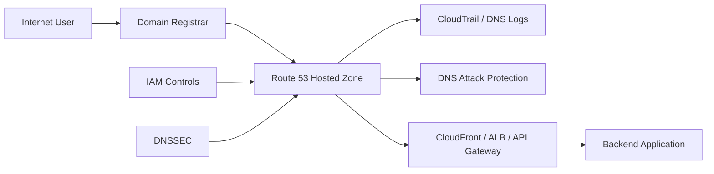
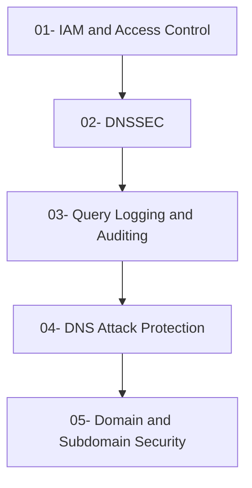

# README

## Overview

This section covers the security considerations required to operate Amazon Route 53 safely in production environments.

Route 53 is part of the application's traffic-control plane. A compromised DNS configuration can redirect users, expose infrastructure, break production services, or facilitate phishing and service impersonation. Security therefore extends beyond IAM permissions inside AWS and includes the domain registrar, nameserver delegation, hosted zones, DNS records, certificates, delegated subdomains, and the infrastructure behind those records.

The security material progresses from access control and DNS integrity to operational auditing, attack protection, and domain-level governance.

```text
Domain Security
│
├── IAM and Route 53 Access Control
│
├── DNSSEC and DNS Integrity
│
├── Query Logging and Auditing
│
├── DNS Attack Protection
│
└── Domain and Subdomain Security
```

---

## Security Architecture

A production Route 53 security model should protect the complete DNS control path.



The major security boundaries are:

| Layer | Primary security concern |
|---|---|
| Domain registrar | Domain ownership and nameserver delegation |
| Route 53 | Hosted-zone and record modification |
| IAM | Authorization to Route 53 APIs |
| DNSSEC | DNS response authenticity and integrity |
| DNS logging | Visibility and investigation |
| Subdomains | Delegation and ownership boundaries |
| CloudFront / ALB / API Gateway | Correct traffic destination |
| TLS | Endpoint authentication and encrypted transport |
| Application | Authentication, authorization, and application security |

---

## Documentation

### IAM and Access Control

**File:** `01- IAM and Access Control.md`

Covers the control plane for Route 53 and how to prevent unauthorized DNS changes.

Key topics include:

- Route 53 IAM permissions
- Least-privilege access
- Resource-specific permissions
- Developer vs deployment access
- CI/CD DNS roles
- Cross-account DNS administration
- Application runtime permissions
- IAM policy design
- Route 53 change authorization
- Production access controls

**Primary engineering concern:**

> Who is allowed to change production DNS, and exactly what are they allowed to change?

---

### DNSSEC

**File:** `02- DNSSEC.md`

Covers DNSSEC and the protection of DNS responses against tampering and spoofing.

Key topics include:

- DNSSEC fundamentals
- DNS authentication
- Chain of trust
- Route 53 DNSSEC signing
- Key-signing and zone-signing concepts
- DS records
- DNSSEC validation
- Operational considerations
- Key rollover
- Failure scenarios
- DNSSEC deployment risks

**Primary engineering concern:**

> Can a DNS resolver verify that the DNS response came from the legitimate authoritative zone?

---

### Query Logging and Auditing

**File:** `03- Query Logging and Auditing.md`

Covers DNS visibility, Route 53 control-plane auditing, and operational investigation.

Key topics include:

- Route 53 query logging
- CloudTrail
- DNS query analysis
- Record-change auditing
- Security investigation
- Centralized logging
- Suspicious DNS activity
- Retention considerations
- Monitoring and alerting
- Incident-response workflows

**Primary engineering concern:**

> Can the team determine what DNS activity occurred, when it happened, and who or what caused it?

---

### DNS Attack Protection

**File:** `04- DNS Attack Protection.md`

Covers common DNS-related attacks and defensive architecture.

Key topics include:

- DNS spoofing
- DNS cache poisoning
- DNS amplification
- DDoS considerations
- Route 53 resilience
- AWS Shield
- AWS WAF integration
- DNSSEC
- Rate and traffic considerations
- Monitoring suspicious activity
- Incident response

**Primary engineering concern:**

> How does the architecture remain available and trustworthy when DNS or application traffic is under attack?

---

### Domain and Subdomain Security

**File:** `05- Domain and Subdomain Security.md`

Covers security across the entire domain hierarchy rather than only Route 53 itself.

Key topics include:

- Registrar security
- Nameserver delegation
- Public vs private hosted zones
- Subdomain delegation
- Subdomain takeover
- Dangling DNS records
- Wildcard records
- DNS and TLS relationships
- CloudFront, ALB, and API Gateway
- Kubernetes DNS controllers
- Multi-account DNS architecture
- DNS ownership
- Domain recovery
- Production DNS governance

**Primary engineering concern:**

> Who controls each part of the domain hierarchy, and what happens when infrastructure or ownership changes?

---

## Recommended Reading Order

The files are intentionally ordered from access control toward broader domain security.



### Access Control

Start with:

`01- IAM and Access Control.md`

Understand who can modify DNS and how Route 53 permissions should be constrained.

### DNS Integrity

Continue with:

`02- DNSSEC.md`

Understand how DNS responses can be authenticated and protected against tampering.

### Visibility

Then study:

`03- Query Logging and Auditing.md`

Learn how to investigate DNS behavior and Route 53 configuration changes.

### Attack Protection

Continue with:

`04- DNS Attack Protection.md`

Connect DNS security to availability, DDoS protection, and broader AWS security controls.

### Domain Governance

Finish with:

`05- Domain and Subdomain Security.md`

This brings the individual controls together into a production domain-security model covering registrars, delegation, subdomains, certificates, infrastructure, and organizational ownership.

---

## Security Model

A senior backend engineer should think about Route 53 security as defense in depth rather than as a single feature.

```text
                    Domain Security
                          │
        ┌─────────────────┼─────────────────┐
        │                 │                 │
        ▼                 ▼                 ▼
   Access Control     DNS Integrity      Visibility
        │                 │                 │
       IAM              DNSSEC          CloudTrail
        │                 │            DNS Logging
        └─────────────────┼─────────────────┘
                          │
                          ▼
                   Attack Protection
                          │
                  Shield / WAF / Monitoring
                          │
                          ▼
                  Domain Governance
                          │
            Registrar / Delegation /
            Subdomains / Ownership
```

Each layer addresses a different failure mode.

| Layer | Protects against |
|---|---|
| IAM | Unauthorized Route 53 API changes |
| DNSSEC | DNS response tampering and spoofing |
| CloudTrail | Unattributed control-plane changes |
| Query logging | Lack of DNS visibility |
| Attack protection | Availability and traffic attacks |
| Subdomain governance | Delegation and takeover risks |
| Registrar controls | Domain-level compromise |
| TLS | Endpoint impersonation and traffic interception |

---

## Production Route 53 Security Checklist

### Identity and Access

- [ ] Route 53 permissions follow least privilege.
- [ ] Application runtime roles do not have unnecessary DNS write permissions.
- [ ] Production DNS changes use dedicated identities.
- [ ] CI/CD roles are scoped to the required hosted zones.
- [ ] Cross-account access is explicitly controlled.
- [ ] Privileged access requires strong authentication.

### DNS Integrity

- [ ] DNSSEC requirements have been evaluated.
- [ ] DNSSEC configuration is operationally understood.
- [ ] Critical domain records are protected from unauthorized modification.
- [ ] TLS certificates correctly correspond to production domains.
- [ ] DNS changes account for TTL and resolver caching.

### Monitoring and Auditing

- [ ] CloudTrail records Route 53 API activity.
- [ ] DNS query logging is configured where required.
- [ ] Critical DNS changes generate alerts.
- [ ] Unexpected record changes can be investigated.
- [ ] DNS ownership and record inventory are maintained.

### Domain and Subdomain Governance

- [ ] Registrar access is secured.
- [ ] Nameserver delegation is controlled.
- [ ] Delegated subdomains have explicit owners.
- [ ] Dangling DNS records are periodically identified.
- [ ] CNAME records referencing external services are reviewed.
- [ ] DNS records are removed when infrastructure is decommissioned.
- [ ] Wildcard records are intentionally designed and reviewed.

### Availability and Attack Protection

- [ ] DNS availability requirements are documented.
- [ ] DDoS protection requirements are evaluated.
- [ ] Route 53 is integrated into the broader AWS security architecture.
- [ ] DNS incident-response procedures exist.
- [ ] Failover procedures account for DNS caching.

---

## Route 53 Security and Backend Architecture

Route 53 rarely operates in isolation. A typical production backend may look like:

```text
                         Internet
                            │
                            ▼
                    api.example.com
                            │
                            ▼
                       Route 53
                            │
                 ┌──────────┴──────────┐
                 ▼                     ▼
             CloudFront               ALB
                 │                     │
                 ▼                     ▼
              API Gateway          ECS / EKS
                 │                     │
                 ▼                     ▼
              Lambda              FastAPI / Django
                 │                     │
                 └──────────┬──────────┘
                            ▼
                    PostgreSQL / Redis
```

Security decisions must therefore be made across the complete request path.

For example:

- Route 53 determines the DNS destination.
- CloudFront or ALB handles traffic routing.
- WAF can filter malicious HTTP traffic.
- TLS authenticates and encrypts the connection.
- API Gateway or the application performs authentication and authorization.
- Security groups and network controls restrict connectivity.
- IAM controls AWS API access.
- CloudTrail and logging provide operational visibility.

A secure DNS configuration cannot compensate for weaknesses in the application or network architecture.

---

## Common Security Misconceptions

| Misconception | Correct interpretation |
|---|---|
| Private DNS means the service is secure | DNS visibility is not authorization |
| DNSSEC prevents Route 53 changes | IAM protects Route 53 configuration |
| HTTPS makes DNS irrelevant | DNS still determines where clients connect |
| A hidden subdomain is a security mechanism | DNS names should not be treated as secrets |
| Deleting infrastructure automatically removes DNS | DNS lifecycle must be explicitly managed |
| Wildcard DNS secures subdomains | Wildcards control resolution, not application security |
| DNS changes propagate immediately | Recursive resolvers may cache previous responses |
| Route 53 security only requires IAM | Registrar, DNSSEC, monitoring, delegation, and lifecycle also matter |

---

## Key Engineering Principles

1. **Treat production DNS as critical infrastructure.**
2. **Separate DNS administration from application runtime permissions.**
3. **Use least privilege for every identity that can modify Route 53.**
4. **Secure the domain registrar in addition to AWS.**
5. **Treat subdomain delegation as a trust boundary.**
6. **Remove DNS records when their target infrastructure is removed.**
7. **Use DNSSEC when DNS response integrity requirements justify it.**
8. **Audit Route 53 changes through CloudTrail and maintain appropriate DNS visibility.**
9. **Do not use DNS names as an authorization or confidentiality mechanism.**
10. **Design DNS together with CloudFront, ALB, API Gateway, TLS, WAF, and application security.**
11. **Scope Kubernetes DNS controllers to the minimum Route 53 permissions they require.**
12. **Maintain ownership and lifecycle information for critical DNS records.**
13. **Design incident-response procedures around DNS caching and TTL behavior.**
14. **Use infrastructure as code and reviewed CI/CD workflows for production DNS wherever practical.**
15. **Protect the complete domain lifecycle: registrar → delegation → hosted zone → records → endpoint → application.**

---

## Key Takeaways

Route 53 security is not limited to preventing unauthorized API calls. A production-grade design protects the entire DNS control plane, including domain ownership, nameserver delegation, hosted zones, DNS records, DNS responses, subdomains, certificates, and the AWS resources behind them.

The most important controls are least-privilege IAM, secure registrar administration, DNS integrity mechanisms such as DNSSEC where appropriate, comprehensive auditing, attack protection, and disciplined DNS lifecycle management.

For backend engineering, the key mental model is simple:

```text
DNS is part of the production traffic path.

Protect:
Identity
   ↓
DNS Configuration
   ↓
DNS Integrity
   ↓
Traffic Destination
   ↓
TLS
   ↓
Application
   ↓
Data
```

A secure Route 53 architecture should minimize who can change DNS, make every important change observable, prevent stale or abandoned records, isolate delegated ownership, and integrate DNS security with the rest of the AWS backend architecture.