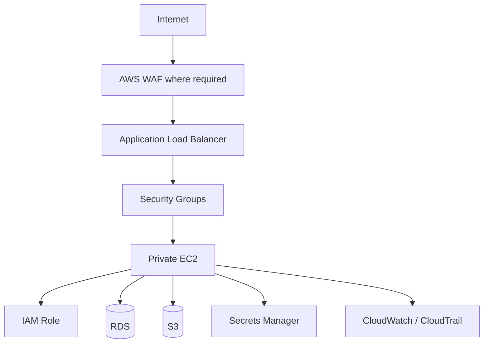
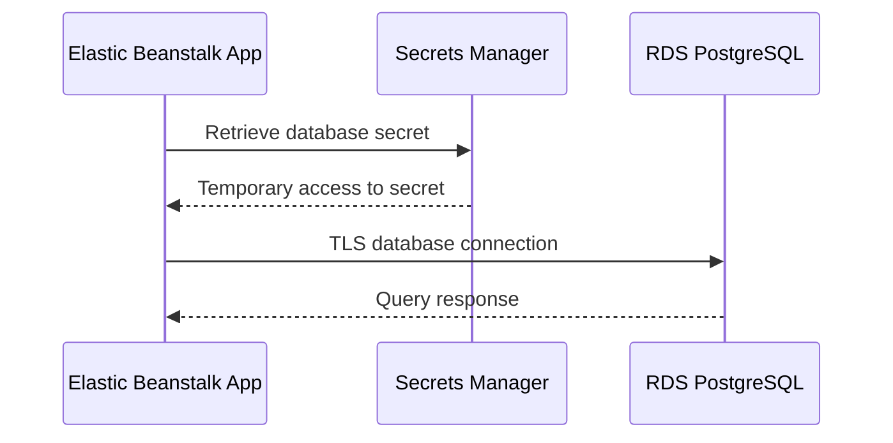

# 01- Security Overview

## Overview

Security in an AWS Elastic Beanstalk architecture is not a single configuration setting. It is a layered responsibility spanning the application, Elastic Beanstalk environment, EC2 instances, load balancer, VPC, IAM, data services, secrets, deployments, and monitoring.

A production security model should assume that individual application instances are replaceable and that every network boundary and AWS permission must be explicitly controlled.

A typical security architecture looks like:

```text
                         Internet
                            │
                            ▼
                    Route 53 / DNS
                            │
                            ▼
                 Application Load Balancer
                            │
                     HTTPS :443
                            │
                            ▼
                 Private EC2 Instances
                  Elastic Beanstalk
                    │      │      │
                    │      │      └── S3
                    │      └───────── Redis
                    └──────────────── RDS
                            │
                            ▼
                     AWS IAM / KMS
```

The primary security objectives are:

- Minimize Internet exposure
- Enforce least privilege
- Protect credentials and secrets
- Encrypt data in transit and at rest
- Restrict network communication
- Keep application instances disposable
- Secure deployment and configuration changes
- Centralize logging and auditing
- Detect suspicious or unauthorized activity
- Maintain recoverability after security incidents

## Security Model

Elastic Beanstalk security should be considered across multiple layers.

| Layer | Primary Security Controls |
|---|---|
| Application | Authentication, authorization, validation, secure headers |
| Load Balancer | HTTPS, TLS certificates, listener rules |
| Compute | IAM roles, OS hardening, patching |
| Network | VPC, subnets, security groups, NACLs |
| Identity | IAM roles, policies, least privilege |
| Secrets | Secrets Manager, Systems Manager Parameter Store |
| Data | Encryption, access control, backups |
| Storage | S3 policies, bucket blocking, encryption |
| Deployment | CI/CD permissions, environment protection |
| Monitoring | CloudWatch, CloudTrail, alerts |
| Recovery | Backups, snapshots, incident procedures |

Security should therefore be evaluated as a system rather than as an isolated Elastic Beanstalk feature.

## Threat Model

A production Elastic Beanstalk application should account for several categories of threats.

### External Network Attacks

Examples include:

- Port scanning
- Automated exploitation
- DDoS attempts
- Malicious API requests
- Credential attacks
- Application-layer attacks

The first architectural response is to minimize exposed infrastructure.

```text
Internet
   │
   ▼
Public ALB
   │
   ▼
Private Application Instances
```

EC2 instances should generally not be directly reachable from the Internet.

### Application Attacks

Infrastructure security does not protect an application from vulnerabilities such as:

- SQL injection
- Cross-site scripting
- Broken authorization
- Insecure deserialization
- SSRF
- Command injection
- Unsafe file uploads
- Weak authentication

Django, FastAPI, Nginx, and AWS security controls complement each other; none replaces secure application development.

### Credential Compromise

Credentials can be exposed through:

- Source control
- Logs
- Environment configuration
- Developer machines
- CI/CD systems
- Application errors

Long-lived AWS access keys should not be embedded into application code.

Prefer:

```text
EC2
 │
 ▼
IAM Role
 │
 ▼
AWS API
```

instead of:

```text
Application
 │
 ▼
Hard-coded AWS Access Key
```

## Defense in Depth

A strong Elastic Beanstalk security architecture uses multiple independent controls.



No individual control should be treated as sufficient by itself.

For example:

```text
HTTPS
  ≠
Application Security

Private Subnet
  ≠
Application Security

IAM
  ≠
Network Security
```

Production security comes from combining these controls correctly.

## Network Security

Network isolation is one of the most important security boundaries in an Elastic Beanstalk environment.

A common production topology is:

```text
Public Subnets
│
└── Application Load Balancer

Private Application Subnets
│
├── Elastic Beanstalk EC2
└── Workers

Private Data Subnets
│
├── RDS
└── Redis
```

The objective is to minimize the number of resources with direct Internet exposure.

## Public vs Private Resources

| Resource | Typical Placement | Internet Exposure |
|---|---|---|
| Internet-facing ALB | Public subnet | Yes |
| Elastic Beanstalk EC2 | Private subnet | Preferably no |
| RDS | Private subnet | No |
| Redis | Private subnet | No |
| NAT Gateway | Public subnet | Outbound infrastructure |
| S3 | AWS managed service | Controlled through IAM/policies |

A resource being inside a VPC does not automatically make it secure.

Routing and security-group configuration must also enforce the intended boundary.

## Security Groups

Security groups should represent application trust relationships.

A typical architecture is:

```text
Internet
   │
   ▼
ALB Security Group
   │
   ▼
Application Security Group
   │
   ▼
Database Security Group
```

For example:

| Security Group | Source | Port | Purpose |
|---|---|---:|---|
| ALB SG | Internet | 443 | HTTPS |
| EC2 SG | ALB SG | 80 | Application traffic |
| RDS SG | EC2 SG | 5432 | PostgreSQL |
| Redis SG | EC2 SG | 6379 | Redis |

The important principle is:

> Allow resources to communicate based on their role, not based on broad network ranges when narrower controls are available.

Avoid:

```text
RDS :5432
Source: 0.0.0.0/0
```

Prefer:

```text
RDS :5432
Source: Application Security Group
```

## Security Group Design

Separate security groups by responsibility rather than creating one large shared security group.

For example:

```text
sg-alb
   │
   └── HTTPS from Internet

sg-app
   │
   └── HTTP from sg-alb

sg-db
   │
   └── PostgreSQL from sg-app

sg-cache
   │
   └── Redis from sg-app
```

This makes the intended trust graph explicit.

It also makes security reviews and troubleshooting easier.

## Network ACLs

Network ACLs operate at the subnet level, while security groups operate at the resource level.

```text
Internet
   │
   ▼
Network ACL
   │
   ▼
Subnet
   │
   ▼
Security Group
   │
   ▼
EC2
```

Security groups should generally provide the primary resource-level access control.

NACLs are useful when a subnet-level allow/deny boundary is required, but unnecessary complexity can make troubleshooting difficult.

| Feature | Security Group | Network ACL |
|---|---|---|
| Scope | Network interface/resource | Subnet |
| Stateful | Yes | No |
| Allow rules | Yes | Yes |
| Deny rules | No explicit deny | Yes |
| Typical application control | Yes | Sometimes |

## Internet Exposure

A common security mistake is exposing application instances directly because the application already has an ALB.

Bad:

```text
Internet
 ├──► ALB
 └──► EC2
```

Prefer:

```text
Internet
   │
   ▼
ALB
   │
   ▼
Private EC2
```

If EC2 has no public IP and its security group accepts traffic only from the ALB security group, direct Internet access is significantly reduced.

## HTTPS and TLS

Production public APIs should normally use HTTPS.

Typical architecture:

```text
Client
  │
  │ HTTPS :443
  ▼
ALB
  │
  ▼
Elastic Beanstalk
```

AWS Certificate Manager can provide the certificate used by the load balancer.

The ALB can terminate TLS before forwarding traffic to the application.

```text
Client
   │
   │ TLS
   ▼
ALB
   │
   │ HTTP/HTTPS
   ▼
Application
```

The decision to use HTTPS between ALB and instances depends on the application's security and compliance requirements.

## TLS Termination

TLS termination at the ALB provides several operational advantages:

- Centralized certificate management
- Reduced application-level TLS complexity
- Easier certificate rotation
- Consistent HTTPS configuration
- Clear public ingress boundary

A common architecture is:

```text
Internet
   │
   │ HTTPS
   ▼
ALB
   │
   │ HTTP
   ▼
Nginx
   │
   ▼
Django / FastAPI
```

For environments requiring encryption across internal network segments:

```text
Internet
   │
   │ HTTPS
   ▼
ALB
   │
   │ HTTPS
   ▼
Nginx
   │
   ▼
Application
```

## HTTP Redirects

A production environment should generally redirect HTTP traffic to HTTPS when public HTTP is not intentionally required.

```text
HTTP :80
   │
   ▼
Redirect
   │
   ▼
HTTPS :443
```

This prevents clients from accidentally continuing to use an unencrypted endpoint.

## Application Security Headers

For web applications, security headers can reduce browser-side attack surfaces.

Depending on the application, consider:

- `Strict-Transport-Security`
- `Content-Security-Policy`
- `X-Content-Type-Options`
- `Referrer-Policy`
- Appropriate `Cache-Control`

Django provides several security-related settings, while Nginx or the load-balancing layer can also contribute to response-header enforcement.

Security headers should be selected based on the application's actual behavior rather than copied blindly from a generic configuration.

## AWS IAM

IAM controls which AWS resources an Elastic Beanstalk application can access.

The preferred model is:

```text
EC2 Instance
      │
      ▼
IAM Instance Role
      │
      ▼
AWS Services
```

For example:

```text
Django
  │
  ▼
boto3
  │
  ▼
IAM Role
  │
  ├── S3
  ├── Secrets Manager
  └── CloudWatch
```

The application does not need to know an AWS access key.

## Least Privilege

An application should receive only the permissions it requires.

Suppose a Django application only uploads objects to:

```text
s3://production-media/uploads/*
```

Its IAM policy should not automatically grant access to every S3 bucket.

Conceptually:

```text
Required:
s3:PutObject
Bucket:
production-media
Prefix:
uploads/*
```

rather than:

```text
s3:*
Resource:
*
```

Broad permissions increase the impact of a compromised application.

## IAM Roles vs Access Keys

Avoid:

```python
AWS_ACCESS_KEY_ID = "..."
AWS_SECRET_ACCESS_KEY = "..."
```

inside source code or committed configuration.

Prefer an IAM role attached to the EC2 instance.

The AWS SDK can automatically obtain temporary credentials from the instance role.

This provides:

- No long-lived application credentials
- Automatic credential rotation
- Centralized IAM management
- Reduced secret-management burden

## Secrets Management

Applications commonly require:

- Database passwords
- API keys
- JWT signing secrets
- Encryption keys
- Third-party credentials

These should not be stored directly in source control.

A production architecture can use:

```text
Elastic Beanstalk
       │
       ▼
Secrets Manager
       │
       ▼
Application
```

AWS Secrets Manager and Systems Manager Parameter Store are common choices depending on the secret/configuration requirements.

## Environment Variables

Environment variables can be useful for application configuration:

```text
DB_HOST
DB_NAME
DB_USER
DB_PASSWORD
SECRET_KEY
```

However, environment variables are not automatically a complete secrets-management strategy.

Consider:

- Who can view environment configuration
- Whether values are exposed in logs
- Whether configuration is stored in source control
- How credentials are rotated
- Which IAM principals can retrieve secrets

For sensitive production secrets, a managed secret store is generally preferable.

## Secret Rotation

Secret rotation must be considered together with application behavior.

For example:

```text
Secret Store
     │
     ▼
New Database Credential
     │
     ▼
Application
     │
     ▼
Connection Pool
     │
     ▼
Database
```

Applications using long-lived database connections may not immediately pick up new credentials.

Therefore, secret rotation should be tested with the application's connection-management behavior.

## Database Security

RDS should normally be private.

A typical architecture is:

```text
Internet
   X
   │
   ▼
RDS

Application
   │
   ▼
Private Network
   │
   ▼
RDS
```

The database security group should permit access only from the required application sources.

For PostgreSQL:

```text
Source: Application SG
Port: 5432
Protocol: TCP
```

Do not expose PostgreSQL directly to the Internet merely to simplify development or troubleshooting.

## S3 Security

Production S3 buckets should normally remain private.

Use:

- Block Public Access
- IAM policies
- Bucket policies
- Encryption
- Presigned URLs
- Appropriate logging and auditing

A common architecture is:

```text
Client
   │
   ▼
Application
   │
   │ Authorized request
   ▼
Presigned URL
   │
   ▼
Private S3 Bucket
```

This avoids making an entire bucket publicly readable.

## Data Encryption

Security should address both data in transit and data at rest.

```text
             Encryption
                 │
        ┌────────┴────────┐
        ▼                 ▼
   In Transit          At Rest
        │                 │
     TLS/HTTPS       KMS / Service
                      Encryption
```

Potentially encrypted resources include:

- RDS
- S3
- EBS
- Secrets
- Redis
- Backups
- Snapshots

Encryption requirements should be determined by the sensitivity of the workload and applicable compliance requirements.

## AWS KMS

AWS Key Management Service can manage encryption keys used by AWS services.

Conceptually:

```text
Application
    │
    ▼
AWS Service
    │
    ▼
KMS Key
```

KMS permissions are separate from the application's normal service permissions.

A service may therefore fail because:

```text
IAM allows S3 access
        │
        ▼
KMS permission missing
        │
        ▼
Operation denied
```

This distinction is important when troubleshooting encrypted resources.

## Elastic Beanstalk IAM Roles

Elastic Beanstalk environments can involve multiple IAM roles.

The exact role structure depends on the platform and configuration, but the important distinction is between:

- Permissions used by Elastic Beanstalk itself
- Permissions used by EC2 application instances
- Permissions used by deployment automation

Do not give every role administrator-level access simply to avoid permission errors.

A production IAM design should separate responsibilities.

## CI/CD Security

Deployment automation is part of the security boundary.

A typical pipeline is:

```text
Developer
    │
    ▼
GitHub
    │
    ▼
CI/CD
    │
    ▼
AWS
    │
    ▼
Elastic Beanstalk
```

The CI/CD identity should have only the permissions necessary to deploy the intended application.

Avoid:

```text
GitHub Actions
     │
     ▼
AdministratorAccess
```

Prefer a dedicated deployment identity with narrowly scoped permissions.

## OIDC for CI/CD

Where supported, modern CI/CD systems can use OIDC federation rather than storing long-lived AWS access keys.

Conceptually:

```text
GitHub Actions
      │
      │ OIDC
      ▼
AWS IAM
      │
      ▼
Temporary Credentials
      │
      ▼
Elastic Beanstalk
```

This reduces the need for persistent AWS credentials in CI/CD secrets.

## Deployment Security

Deployment configuration can modify:

- Application code
- Environment variables
- IAM permissions
- Networking
- Platform versions
- Instance configuration

Therefore, deployment permissions should be treated as privileged access.

Use:

- Protected branches
- Required reviews
- Environment protection
- Restricted deployment roles
- Audit logging
- Immutable build artifacts where appropriate

## Application Security

Elastic Beanstalk cannot compensate for application vulnerabilities.

A Django or FastAPI service should still implement:

- Authentication
- Authorization
- Input validation
- Secure serialization
- CSRF protection where applicable
- SQL injection protection
- Rate limiting where appropriate
- Secure file handling
- Dependency management
- Secure error handling

For example:

```text
Client
  │
  ▼
ALB
  │
  ▼
Application
  │
  ├── Authentication
  ├── Authorization
  ├── Validation
  └── Business Logic
```

Infrastructure security and application security must work together.

## Database Credential Flow

A production Django application can follow a flow such as:



The application should not contain the database password in source control.

## S3 Credential Flow

Similarly:

```text
Django / FastAPI
      │
      ▼
IAM Instance Role
      │
      ▼
S3 API
      │
      ▼
Private Bucket
```

The application does not need a permanent AWS access key.

## Logging and Auditing

Security events should be observable.

Important AWS services include:

- CloudWatch
- CloudTrail
- VPC Flow Logs
- Load balancer access logs
- Application logs

Conceptually:

```text
AWS Resources
      │
      ├── CloudTrail
      ├── CloudWatch
      ├── VPC Flow Logs
      └── ALB Logs
               │
               ▼
        Security Monitoring
```

Logs should be protected because they can contain sensitive information.

## CloudTrail

CloudTrail provides an audit trail for AWS API activity.

Useful questions include:

- Who changed the environment?
- Who modified a security group?
- Who changed an IAM policy?
- Who accessed or modified an AWS resource?
- When did a configuration change occur?

CloudTrail is particularly important during incident investigation.

## CloudWatch

CloudWatch provides operational visibility into the environment.

Monitor signals such as:

- CPU
- Memory where available
- Request counts
- HTTP errors
- Latency
- Instance health
- Deployment failures
- Application errors

Security monitoring should combine infrastructure events with application-level signals.

## VPC Flow Logs

VPC Flow Logs can help investigate network-level behavior.

For example:

```text
Unexpected traffic
      │
      ▼
VPC Flow Logs
      │
      ▼
Source / Destination
      │
      ▼
Security Investigation
```

Flow logs are useful for troubleshooting connectivity and investigating unexpected network communication, but they should not be treated as a complete security monitoring system.

## AWS WAF

AWS WAF can provide an additional application-layer security boundary in front of supported AWS resources such as an Application Load Balancer.

Conceptually:

```text
Internet
   │
   ▼
AWS WAF
   │
   ▼
ALB
   │
   ▼
Elastic Beanstalk
```

WAF can help with common web attack patterns and request filtering.

Potential controls include:

- IP-based rules
- Rate-based rules
- Managed rule groups
- Custom request matching
- Geographic restrictions where appropriate

WAF does not replace secure application development.

## Rate Limiting

Rate limiting can protect APIs from abusive or excessive traffic.

Possible layers include:

```text
WAF
 │
 ▼
ALB
 │
 ▼
Application
 │
 ▼
Redis-backed rate limiter
```

The correct location depends on whether the limit is:

- Global
- Per IP
- Per user
- Per API key
- Per endpoint

Rate limiting should be designed carefully when the application is horizontally scaled.

## DDoS Considerations

AWS infrastructure provides protections against many network-level attacks, but application-layer abuse can still overwhelm an API.

A layered approach may include:

```text
AWS DDoS Protection
        │
        ▼
WAF
        │
        ▼
ALB
        │
        ▼
Application Rate Limits
```

The appropriate controls depend on the application's exposure and threat model.

## Secure File Uploads

File uploads create both application and infrastructure security risks.

Do not trust:

- Filename
- MIME type supplied by the client
- File extension
- File contents
- User-controlled S3 key

A secure flow can be:

```text
Client
   │
   ▼
Application Authorization
   │
   ▼
Presigned Upload
   │
   ▼
S3
   │
   ▼
Validation / Scanning
```

For sensitive applications, uploaded files may require malware scanning before being made available to users.

## Security of Django Applications

Django provides several security mechanisms, but production configuration still matters.

Important areas include:

- `DEBUG = False`
- Secure cookies
- CSRF protection
- Host validation
- HTTPS
- HSTS
- Secure session configuration
- Dependency updates
- Secret management

For example:

```python
DEBUG = False

SESSION_COOKIE_SECURE = True
CSRF_COOKIE_SECURE = True
```

Exact settings should match the deployment architecture and application requirements.

## Security of FastAPI Applications

FastAPI applications should similarly enforce:

- Authentication
- Authorization
- Input validation
- Secure dependency management
- TLS
- Secure error responses
- Rate limiting where required
- Proper secret management

Pydantic validation helps validate request structures, but authorization must still be implemented explicitly.

## Dependency Security

Application dependencies are part of the attack surface.

For Python applications:

```text
Django
FastAPI
Gunicorn
Uvicorn
Requests
Pydantic
Database Drivers
```

Production processes should include:

- Dependency pinning
- Vulnerability scanning
- Regular updates
- Removal of unused packages
- Controlled dependency upgrades

A vulnerable package inside an otherwise secure AWS architecture remains a vulnerability.

## Patch Management

Elastic Beanstalk platform versions and underlying operating-system components require maintenance.

A production patch strategy should include:

```text
New Platform Version
        │
        ▼
Test Environment
        │
        ▼
Staging
        │
        ▼
Production
```

Do not automatically apply major platform changes to production without validation.

## Environment Separation

Development, staging, and production should be logically separated.

```text
Development
     │
     ▼
Staging
     │
     ▼
Production
```

Avoid sharing production:

- Databases
- Secrets
- S3 buckets
- Redis instances
- IAM credentials

with lower environments unless there is a deliberate, controlled requirement.

## Production Security Checklist

### Network

- [ ] Application instances are private where appropriate.
- [ ] Internet-facing traffic enters through the intended load balancer.
- [ ] Security groups use least privilege.
- [ ] Database access is restricted to application sources.
- [ ] Redis is not Internet-accessible.
- [ ] Unnecessary public IP addresses are disabled.
- [ ] NACLs are deliberately configured where required.

### Identity

- [ ] EC2 workloads use IAM roles.
- [ ] CI/CD uses a dedicated deployment identity.
- [ ] Long-lived AWS access keys are avoided.
- [ ] IAM policies follow least privilege.
- [ ] Administrative access is restricted and audited.

### Secrets

- [ ] Database credentials are not committed to source control.
- [ ] Application secrets use a managed secret store where appropriate.
- [ ] Secret rotation is planned.
- [ ] Secrets are not printed in logs.
- [ ] Access to secret stores is least privilege.

### Data

- [ ] RDS is private.
- [ ] S3 buckets are private unless public access is explicitly required.
- [ ] Encryption at rest is enabled according to requirements.
- [ ] TLS protects sensitive network traffic.
- [ ] Backups are enabled.
- [ ] Recovery procedures are tested.

### Application

- [ ] `DEBUG` is disabled in production.
- [ ] Authentication and authorization are enforced.
- [ ] Input validation is implemented.
- [ ] Dependencies are regularly scanned and updated.
- [ ] Secure cookies and HTTPS settings are configured.
- [ ] File uploads are validated and controlled.

### Monitoring

- [ ] CloudTrail is enabled according to organizational requirements.
- [ ] CloudWatch monitoring is configured.
- [ ] Relevant VPC Flow Logs are enabled where useful.
- [ ] ALB access logs are considered.
- [ ] Security-relevant alerts are configured.
- [ ] Logs are protected from unauthorized access.

### Deployment

- [ ] Production deployments require appropriate authorization.
- [ ] CI/CD permissions are restricted.
- [ ] Deployment artifacts are controlled.
- [ ] Platform updates are tested before production.
- [ ] Configuration changes are auditable.

## Common Security Mistakes

### Using AdministratorAccess for the Application

Bad:

```text
EC2
 │
 ▼
AdministratorAccess
```

Why it is dangerous:

A compromised application could potentially access or modify unrelated AWS resources.

Use a narrowly scoped IAM role instead.

### Storing AWS Credentials in Source Code

Bad:

```python
AWS_SECRET_ACCESS_KEY = "production-secret"
```

Why it is dangerous:

Credentials can leak through Git history, logs, pull requests, or developer machines.

Use IAM roles for AWS workloads.

### Public RDS

Bad:

```text
Internet
   │
   ▼
RDS PostgreSQL
```

Prefer:

```text
Internet
   │
   ▼
ALB
   │
   ▼
Private Application
   │
   ▼
Private RDS
```

### Public S3 Bucket for Private Files

Making an entire bucket public to simplify downloads can expose sensitive documents.

Use private buckets with controlled access.

### One Security Group for Everything

A shared security group can make trust relationships difficult to reason about.

Separate:

```text
ALB SG
App SG
DB SG
Cache SG
```

when the architecture requires distinct boundaries.

### Exposing SSH to the Internet

Avoid broadly allowing:

```text
TCP 22
Source: 0.0.0.0/0
```

If administrative access is required, use a controlled management approach appropriate to the environment rather than exposing SSH globally.

### Logging Secrets

Never log:

```text
DB_PASSWORD
AWS_SECRET_ACCESS_KEY
Authorization headers
Session tokens
```

Application logging should deliberately exclude sensitive values.

### Assuming Private Subnets Make the Application Secure

Private networking reduces exposure but does not eliminate:

- Application vulnerabilities
- Compromised credentials
- Excessive IAM permissions
- Malicious internal traffic
- Misconfigured security groups

Security remains layered.

## Interview Perspective

### Is Elastic Beanstalk itself a security boundary?

No.

Elastic Beanstalk manages application environments, but security still depends on AWS services and configuration such as:

- VPC
- Security groups
- IAM
- TLS
- S3 policies
- RDS controls
- Application security
- Monitoring

### How would you secure a production Elastic Beanstalk API?

A strong architecture would include:

```text
Internet
   │
   ▼
Route 53
   │
   ▼
WAF where appropriate
   │
   ▼
HTTPS ALB
   │
   ▼
Private EC2
   │
   ├── RDS
   ├── Redis
   └── S3
```

Alongside:

- Least-privilege IAM
- Managed secrets
- Encryption
- CloudTrail
- CloudWatch
- Secure CI/CD
- Application-level authentication and authorization

### Why use private EC2 instances?

To reduce direct Internet exposure and force application traffic through the intended ingress layer.

### Why should the database security group reference the application security group?

Because it expresses the actual trust relationship:

```text
Application SG
      │
      ▼
Database SG
```

rather than allowing arbitrary network sources.

### Why are IAM roles preferable to access keys on EC2?

IAM roles provide temporary credentials through the AWS runtime environment and avoid embedding long-lived credentials in the application.

### Does HTTPS solve application security?

No.

HTTPS protects traffic in transit but does not prevent:

- SQL injection
- Broken authorization
- SSRF
- Insecure file handling
- Vulnerable dependencies
- Excessive IAM permissions

### What is defense in depth?

Defense in depth means multiple independent controls protect the system:

```text
WAF
 │
 ▼
ALB / TLS
 │
 ▼
Security Groups
 │
 ▼
Private EC2
 │
 ▼
IAM
 │
 ▼
Application Authorization
 │
 ▼
Encrypted Data
```

If one layer fails, additional controls can still limit the impact.

## Key Takeaways

- Elastic Beanstalk security is a layered architecture spanning application, network, identity, compute, storage, data, deployment, and monitoring.
- Keep Internet-facing access concentrated at the intended ingress layer, typically an HTTPS load balancer.
- Place application instances in private subnets where the architecture permits it.
- Use security groups to model explicit trust relationships between ALB, application, database, and cache tiers.
- Apply least privilege to EC2 IAM roles, CI/CD identities, and AWS service permissions.
- Prefer IAM roles and temporary credentials over long-lived AWS access keys.
- Store production secrets in managed secret stores rather than source control or hard-coded configuration.
- Keep RDS and Redis private and restrict access to required application sources.
- Keep S3 buckets private by default and use controlled access such as IAM policies or presigned URLs.
- Encrypt sensitive data at rest and use TLS for sensitive data in transit.
- Treat deployment pipelines and platform configuration as privileged security boundaries.
- Secure application code independently of AWS infrastructure using authentication, authorization, validation, dependency management, and secure framework configuration.
- Use CloudTrail, CloudWatch, VPC Flow Logs, and relevant access logs to provide operational and security visibility.
- Consider AWS WAF and rate limiting for Internet-facing applications where the threat model requires them.
- Test backups, recovery procedures, secret rotation, and security controls rather than assuming configuration alone guarantees security.
- The strongest Elastic Beanstalk security posture comes from minimizing exposure, limiting permissions, isolating resources, protecting secrets, encrypting data, and continuously monitoring the environment.