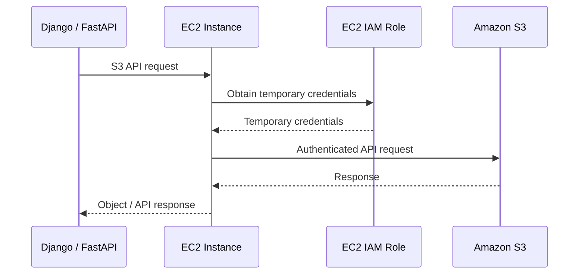
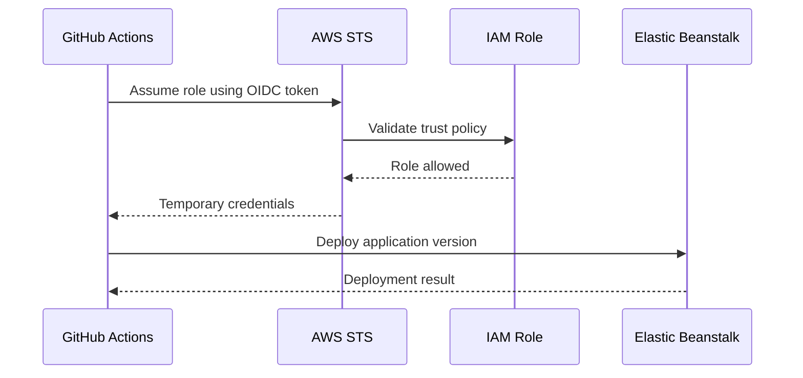
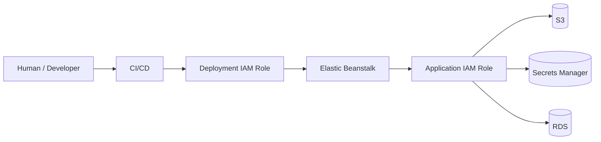

# 02- IAM and Access Control

## Overview

IAM and access control determine **who or what can perform which actions on AWS resources** in an Elastic Beanstalk architecture.

Elastic Beanstalk environments typically involve multiple identities rather than a single "Elastic Beanstalk role":

```text
                         AWS Account
                              │
             ┌────────────────┼────────────────┐
             │                │                │
             ▼                ▼                ▼
       Administrator      Elastic Beanstalk   CI/CD
          / User             Service          Identity
                              │
                              ▼
                         EC2 Instance
                              │
                              ▼
                         Instance Role
                              │
                  ┌───────────┼───────────┐
                  ▼           ▼           ▼
                 S3          RDS       Secrets Manager
```

The most important distinction is between:

- **Environment service role** — used by Elastic Beanstalk itself.
- **EC2 instance profile role** — used by EC2 instances running the application.
- **Human or automation identities** — used to create, update, inspect, and deploy Elastic Beanstalk environments.
- **Resource policies** — additional authorization controls attached to resources such as S3 buckets, KMS keys, and VPC endpoints.

AWS currently documents these as separate responsibilities. The Elastic Beanstalk environment service role allows Elastic Beanstalk to perform environment-management tasks such as enhanced health reporting and managed platform updates, while the EC2 instance profile allows application instances to interact with AWS services. :contentReference[oaicite:0]{index=0}

The architectural principle is:

> Give each identity only the permissions required for its specific responsibility.

## IAM Components in Elastic Beanstalk

A production environment commonly involves the following IAM components:

| Identity / Control | Used By | Primary Responsibility |
|---|---|---|
| IAM user or federated identity | Human | Administrative or operational access |
| IAM role | AWS service / workload | Temporary permissions |
| Elastic Beanstalk service role | Elastic Beanstalk | Environment management |
| EC2 instance profile | EC2 instances | Application AWS API access |
| CI/CD role | Deployment system | Application deployment |
| Resource policy | AWS resource | Resource-side authorization |
| KMS key policy | KMS | Encryption-key authorization |
| VPC endpoint policy | VPC endpoint | Restrict endpoint-mediated service access |

The exact permissions depend on the architecture and AWS services used.

## Identity Flow

A typical production request for an application that reads an S3 object looks like:



The application does not need to embed a permanent AWS access key.

IAM roles are specifically designed to let applications running on EC2 make AWS API requests without requiring developers to distribute and rotate long-lived credentials manually. :contentReference[oaicite:1]{index=1}

## Elastic Beanstalk Service Role

The Elastic Beanstalk service role is assumed by the Elastic Beanstalk service.

Conceptually:

```text
Elastic Beanstalk
       │
       │ AssumeRole
       ▼
Service Role
       │
       ├── Enhanced health
       ├── Managed platform updates
       └── Other environment-management operations
```

It is **not** the role that your Django or FastAPI application normally uses to access S3, Secrets Manager, or other application resources.

AWS currently documents `AWSElasticBeanstalkEnhancedHealth` and `AWSElasticBeanstalkManagedUpdatesCustomerRolePolicy` as policies used with the standard environment service role. :contentReference[oaicite:2]{index=2}

## EC2 Instance Profile

The EC2 instance profile is the mechanism through which an EC2 instance receives an IAM role.

Conceptually:

```text
Elastic Beanstalk
       │
       ▼
EC2 Instance
       │
       ▼
Instance Profile
       │
       ▼
IAM Role
       │
       ▼
Temporary AWS Credentials
```

An instance profile is a container for an IAM role that EC2 uses when launching an instance. An instance profile can contain one IAM role. :contentReference[oaicite:3]{index=3}

This distinction is important:

```text
IAM Role
   ≠
Instance Profile
```

The role contains the permissions and trust policy.

The instance profile is the EC2 attachment mechanism.

## EC2 Trust Relationship

The role attached to an EC2 instance profile must trust the EC2 service.

A simplified trust policy is:

```json
{
  "Version": "2012-10-17",
  "Statement": [
    {
      "Effect": "Allow",
      "Principal": {
        "Service": "ec2.amazonaws.com"
      },
      "Action": "sts:AssumeRole"
    }
  ]
}
```

The important part is:

```json
"Principal": {
  "Service": "ec2.amazonaws.com"
}
```

This means EC2 can assume the role.

The trust policy answers:

> Who is allowed to assume this role?

The permissions policy answers:

> What can the role do after it is assumed?

These are separate concepts.

## Trust Policy vs Permissions Policy

| Policy | Answers | Example |
|---|---|---|
| Trust policy | Who can assume the role? | EC2 |
| Permissions policy | What can the role do? | `s3:GetObject` |
| Resource policy | Who can access this resource? | S3 bucket policy |
| KMS key policy | Who can use the key? | IAM role |

A role can have correct permissions but an incorrect trust relationship, resulting in an inability to assume the role.

Conversely, a role can be assumable but have no useful permissions.

## Default Elastic Beanstalk Policies

Elastic Beanstalk provides AWS-managed policies for common environment use cases.

For EC2 instance profiles, AWS documents policies including:

- `AWSElasticBeanstalkWebTier`
- `AWSElasticBeanstalkWorkerTier`
- `AWSElasticBeanstalkMulticontainerDocker`

These policies support Elastic Beanstalk's environment-level functionality. :contentReference[oaicite:4]{index=4}

However, these policies are not automatically equivalent to application-specific least privilege.

AWS explicitly notes that Elastic Beanstalk managed policies are not granular and may grant permissions beyond the minimum required for a particular application. :contentReference[oaicite:5]{index=5}

Therefore:

```text
Elastic Beanstalk managed policy
              │
              ▼
Baseline environment functionality
```

should be distinguished from:

```text
Custom application policy
              │
              ▼
Application-specific AWS access
```

## Application-Specific Permissions

Suppose a Django application needs to upload files to:

```text
s3://company-production-media/uploads/
```

The EC2 role should receive only the permissions required by the application.

A simplified policy might be:

```json
{
  "Version": "2012-10-17",
  "Statement": [
    {
      "Sid": "UploadApplicationMedia",
      "Effect": "Allow",
      "Action": [
        "s3:PutObject"
      ],
      "Resource": "arn:aws:s3:::company-production-media/uploads/*"
    }
  ]
}
```

The exact policy should reflect the application's actual operations.

If the application only uploads objects, do not automatically grant:

```text
s3:*
```

across every bucket.

## Least Privilege

Least privilege means granting the minimum permissions necessary to perform a legitimate task.

Consider an API that generates reports and uploads them to S3.

Bad:

```text
EC2 Role
   │
   └── AdministratorAccess
```

Better:

```text
EC2 Role
   │
   ├── s3:PutObject
   ├── s3:GetObject
   └── restricted S3 resources
```

Least privilege reduces blast radius.

If an application is compromised, the attacker's available actions are constrained by the application's IAM permissions.

## Permission Scope

Permissions should be restricted across multiple dimensions:

```text
Action
  +
Resource
  +
Condition
```

For example:

```text
Action:
    s3:GetObject

Resource:
    arn:aws:s3:::company-production-media/reports/*

Condition:
    additional contextual restrictions where appropriate
```

This is much safer than:

```text
Action:
    s3:*

Resource:
    *
```

## IAM Policy Evaluation

AWS authorization can involve multiple policy types.

At a high level:

```text
Request
   │
   ▼
Identity-based policies
   │
   ├── Resource-based policies
   ├── Permission boundaries
   ├── Session policies
   ├── SCPs
   └── Other applicable controls
   │
   ▼
Explicit Deny?
   │
   ├── Yes → DENY
   │
   └── No
        │
        ▼
    Applicable Allow?
        │
        ├── Yes → ALLOW
        └── No  → DENY
```

The important operational rule is:

> An explicit deny overrides an allow.

This is why an IAM role can appear to have an `Allow` permission and still receive `AccessDenied`.

## Resource-Based Policies

Some AWS resources have their own policies.

S3 is a common example.

You can have:

```text
IAM Role
   │
   │ Identity policy
   ▼
S3 Bucket
   │
   │ Bucket policy
   ▼
Object
```

Both sides can affect authorization.

For cross-account architectures, resource-based policies become particularly important.

## S3 Access Example

A common production architecture is:

```text
EC2 Instance
     │
     ▼
IAM Role
     │
     │ s3:GetObject
     ▼
Private S3 Bucket
```

The bucket should not need to be public simply because the application needs access.

For application-specific objects, restrict the IAM policy to the required bucket and prefix.

## Secrets Manager Access

If an Elastic Beanstalk application retrieves secrets from AWS Secrets Manager, the EC2 instance profile needs permission to retrieve the relevant secret.

AWS documents that permissions for Elastic Beanstalk instances to fetch Secrets Manager secrets are granted through the EC2 instance profile role. :contentReference[oaicite:6]{index=6}

A simplified policy could be:

```json
{
  "Version": "2012-10-17",
  "Statement": [
    {
      "Sid": "ReadApplicationSecret",
      "Effect": "Allow",
      "Action": [
        "secretsmanager:GetSecretValue"
      ],
      "Resource": "arn:aws:secretsmanager:ap-south-1:123456789012:secret:production/my-api-*"
    }
  ]
}
```

If the secret uses a customer-managed KMS key, KMS authorization may also be required.

## Parameter Store Access

Applications can also retrieve configuration or secrets from AWS Systems Manager Parameter Store.

The same principle applies:

```text
Elastic Beanstalk EC2
        │
        ▼
IAM Instance Profile
        │
        ▼
Parameter Store
```

Grant access only to the parameters required by the application.

For example:

```text
/prod/backend/database/*
```

is preferable to granting unrestricted access to all parameters.

## KMS Permissions

Encryption introduces another authorization layer.

For example:

```text
Application
    │
    ▼
S3
    │
    ▼
KMS
```

An application may have:

```text
s3:GetObject
```

but still receive `AccessDenied` if the encrypted object requires KMS permissions that the calling identity lacks.

This is a common production troubleshooting issue.

## CI/CD Access Control

Deployment systems should have a separate identity from the application.

A clean architecture is:

```text
                         AWS Account
                              │
              ┌───────────────┴───────────────┐
              │                               │
              ▼                               ▼
       Application Role                Deployment Role
              │                               │
              ▼                               ▼
        Runtime APIs                    Elastic Beanstalk
```

The application should not need permission to deploy itself.

Similarly, the CI/CD system should not automatically receive all permissions available to the runtime application.

## GitHub Actions with OIDC

A modern CI/CD design can use OpenID Connect federation.



This avoids storing a long-lived AWS access key in GitHub secrets.

The IAM role's trust policy should restrict which repository, branch, tag, or deployment context can assume the role.

## Deployment Role

A deployment role should contain only the permissions required by the deployment process.

For example:

```text
CI/CD Role
   │
   ├── Elastic Beanstalk application/version operations
   ├── Environment update operations
   └── Required supporting resource operations
```

Do not start with:

```text
AdministratorAccess
```

and leave it permanently attached.

If additional permissions are genuinely required, identify the exact API calls and resources involved.

## Human Access

Developers should ideally access AWS through federated identities and role-based access rather than permanent IAM users with broad permissions.

A typical model is:

```text
Developer
    │
    ▼
Identity Provider / SSO
    │
    ▼
AWS Role
    │
    ├── Read-only
    ├── Developer
    └── Administrator
```

Production access should be more restricted than development access.

## Environment Separation

IAM policies should reflect environment boundaries.

For example:

```text
Development Role
    │
    └── dev resources

Staging Role
    │
    └── staging resources

Production Role
    │
    └── production resources
```

Avoid giving a development application's role access to production data.

A compromised development environment should not automatically provide a path to production resources.

## Resource Naming and ARN Scoping

Consistent naming makes IAM policies easier to scope.

For example:

```text
S3:
company-prod-media
company-stage-media
company-dev-media

Secrets:
prod/backend/database
stage/backend/database
dev/backend/database
```

Then policies can explicitly reference the appropriate resources.

This is much easier to audit than environments sharing generic resources.

## Conditions

IAM conditions can further restrict access.

For example, conditions can be used to constrain:

- Source VPC endpoint
- Source IP
- Principal attributes
- Requested region
- Encryption requirements
- Resource tags
- Transport security

A conceptual policy can look like:

```json
{
  "Version": "2012-10-17",
  "Statement": [
    {
      "Sid": "RequireTLS",
      "Effect": "Deny",
      "Action": "s3:*",
      "Resource": [
        "arn:aws:s3:::company-production-media",
        "arn:aws:s3:::company-production-media/*"
      ],
      "Condition": {
        "Bool": {
          "aws:SecureTransport": "false"
        }
      }
    }
  ]
}
```

Conditions should be introduced deliberately because overly complex policies can become difficult to reason about.

## VPC Endpoint Policies

When an application accesses AWS services through VPC endpoints, the endpoint can have its own policy.

Conceptually:

```text
Private EC2
    │
    ▼
VPC Endpoint
    │
    ▼
AWS Service
```

The endpoint policy provides an additional control over access through that endpoint.

AWS notes that an endpoint policy is separate from identity policies and does not replace them. :contentReference[oaicite:7]{index=7}

This can be useful when restricting private application access to specific resources.

## Role Separation

Do not use one role for every purpose.

Prefer:

```text
Elastic Beanstalk Service Role
        │
        └── Elastic Beanstalk management

Application Instance Role
        │
        └── Runtime AWS access

CI/CD Deployment Role
        │
        └── Deployment

Human Operator Role
        │
        └── Administrative operations
```

This creates clear security boundaries.

## Application Role Design

For a Django application:

```text
Django
  │
  ▼
EC2 Instance Profile
  │
  ├── S3 media access
  ├── Secrets Manager read
  └── CloudWatch-related permissions
```

For a FastAPI application:

```text
FastAPI
  │
  ▼
EC2 Instance Profile
  │
  ├── S3
  ├── Secrets Manager
  └── Required AWS APIs
```

The framework does not determine the IAM policy. The application's AWS resource requirements do.

## IAM for Celery Workers

If Celery workers run inside the same Elastic Beanstalk environment and require AWS access, their permissions normally come from the same EC2 instance role unless the architecture deliberately separates worker infrastructure.

For example:

```text
Celery Worker
     │
     ▼
EC2 Instance Role
     │
     ├── S3
     └── Secrets Manager
```

If workers require materially different permissions from web instances, separate worker infrastructure and separate IAM roles may provide a cleaner security boundary.

## IAM for S3 Uploads

A Django application that uploads generated reports might need:

```text
s3:PutObject
s3:GetObject
```

for a specific prefix.

Example:

```text
arn:aws:s3:::company-production-media/reports/*
```

It should not automatically receive:

```text
s3:DeleteBucket
s3:CreateBucket
s3:PutBucketPolicy
```

unless those operations are genuinely part of the application's responsibility.

## IAM for Database Access

IAM and database authentication are different concerns.

For a PostgreSQL application:

```text
IAM
 │
 └── Controls AWS API access

PostgreSQL
 │
 └── Controls database access
```

Giving an EC2 role access to RDS APIs does not automatically grant permission to execute SQL against PostgreSQL.

For example:

```text
rds:DescribeDBInstances
```

does not mean:

```text
SELECT * FROM users;
```

The application still needs valid database authentication and network connectivity.

This distinction is important when designing backend systems.

## Access Analyzer

IAM Access Analyzer can help identify permissions that are broader than necessary.

AWS documents that Access Analyzer can analyze CloudTrail activity and generate policy templates based on permissions actually used by a role. :contentReference[oaicite:8]{index=8}

A practical workflow is:

```text
Broad Initial Permissions
          │
          ▼
Run Application
          │
          ▼
Observe AWS API Usage
          │
          ▼
IAM Access Analyzer
          │
          ▼
Review Generated Permissions
          │
          ▼
Reduce Policy Scope
```

This is useful when converting an initially permissive environment into a more restrictive production configuration.

## Permission Boundaries

Permission boundaries can limit the maximum permissions that an IAM role can receive.

Conceptually:

```text
Role Policy
     │
     ▼
Requested Permissions
     │
     ▼
Permission Boundary
     │
     ▼
Maximum Effective Permissions
```

They are useful in larger organizations where developers or automation systems can create IAM roles but should not be able to create arbitrarily powerful roles.

Permission boundaries do not themselves grant permissions; they constrain the maximum permissions available to the role.

## Service Control Policies

In AWS Organizations, Service Control Policies can impose organization-level restrictions.

Conceptually:

```text
AWS Organization
       │
       ▼
SCP
       │
       ▼
AWS Account
       │
       ▼
IAM Role
```

An SCP can prevent actions even when an IAM identity policy allows them.

This is another reason an `Allow` statement does not necessarily guarantee that an API call will succeed.

## IAM Policy Variables and Tags

Resource tagging can support scalable access-control strategies.

For example:

```text
Environment=production
Application=payments
Team=backend
```

Policies can sometimes use tags and conditions to restrict access according to ownership or environment.

This becomes increasingly useful when the number of environments and services grows.

## Security Boundaries

A production Elastic Beanstalk architecture should create explicit boundaries:



The deployment identity and runtime identity are deliberately different.

## Operational Troubleshooting

When an application receives:

```text
AccessDenied
```

do not immediately attach an administrator policy.

Use a structured process.

### Identify the Caller

Determine which identity made the request.

For an Elastic Beanstalk application, verify the EC2 instance profile and role.

Conceptually:

```text
Application
    │
    ▼
EC2
    │
    ▼
Instance Profile
    │
    ▼
IAM Role
```

### Identify the API Call

Determine exactly what the application attempted.

For example:

```text
s3:GetObject
secretsmanager:GetSecretValue
kms:Decrypt
```

### Identify the Resource

Determine the exact ARN involved.

For example:

```text
arn:aws:s3:::company-production-media/reports/report.pdf
```

### Inspect Applicable Policies

Check:

- Identity policies
- Resource policies
- Trust policies
- Permission boundaries
- SCPs
- VPC endpoint policies
- KMS key policies

### Check Conditions

A policy can contain conditions that silently restrict access.

Examples:

```text
aws:SecureTransport
aws:SourceVpce
aws:PrincipalTag
aws:RequestedRegion
```

### Use CloudTrail

CloudTrail can help identify the actual API request and calling principal.

The goal is to determine:

```text
Who
 │
 ▼
Called what API
 │
 ▼
Against which resource
 │
 ▼
Under which conditions
 │
 ▼
Why authorization failed
```

## Common IAM Mistakes

### Giving the EC2 Role AdministratorAccess

Why it happens:

The application encounters multiple `AccessDenied` errors and an administrator policy appears to solve them immediately.

Why it is dangerous:

A compromised application inherits extremely broad AWS permissions.

Better approach:

```text
Identify API
    │
    ▼
Identify resource
    │
    ▼
Grant exact permission
```

### Confusing Service Role and Instance Role

Bad assumption:

```text
Elastic Beanstalk service role
        =
Application IAM role
```

They have different responsibilities.

The service role is used by Elastic Beanstalk.

The EC2 instance profile provides permissions to the application instances.

### Putting AWS Access Keys in `.env`

An `.env` file is not automatically secure.

If committed, copied, logged, or exposed through CI/CD, long-lived credentials can be compromised.

Use IAM roles for AWS workloads whenever possible.

### Using `s3:*` for Simple File Uploads

If the application only needs:

```text
s3:PutObject
```

do not grant unrestricted S3 administration.

Scope the resource to the required bucket and prefix.

### Granting Production Access to Development

A development role should not normally be able to:

```text
Read production database secrets
Delete production S3 objects
Modify production infrastructure
```

Environment separation should exist at the IAM layer as well as the infrastructure layer.

### Ignoring KMS Permissions

An application may have permission to access an encrypted S3 object but still fail because it lacks permission to use the associated KMS key.

Always consider both:

```text
S3 authorization
+
KMS authorization
```

### Modifying AWS-Managed Policies

Do not assume AWS-managed policies can be customized to fit your application.

Create customer-managed policies when granular, application-specific permissions are required.

AWS notes that Elastic Beanstalk managed policies are intentionally broad and may need to be supplemented or replaced with custom policies for granular access. :contentReference[oaicite:9]{index=9}

### Treating IAM as Only a User Problem

IAM applies to workloads too.

The following all need carefully designed permissions:

```text
Human
CI/CD
Elastic Beanstalk
EC2
Lambda
Celery Worker
Cross-account Service
```

## Production IAM Checklist

### Elastic Beanstalk

- [ ] Environment service role is configured.
- [ ] EC2 instance profile is configured.
- [ ] Service-role and instance-role responsibilities are separated.
- [ ] Required Elastic Beanstalk managed policies are understood.
- [ ] Unnecessary managed permissions are reviewed.

### Application

- [ ] Application uses an EC2 IAM role rather than long-lived AWS credentials.
- [ ] Application permissions are least privilege.
- [ ] S3 access is restricted to required buckets and prefixes.
- [ ] Secrets Manager or Parameter Store access is restricted.
- [ ] KMS permissions are explicitly reviewed where encryption is used.
- [ ] Worker processes have only required permissions.

### CI/CD

- [ ] Deployment identity is separate from runtime identity.
- [ ] OIDC is used where supported instead of long-lived AWS keys.
- [ ] Deployment permissions are restricted.
- [ ] Production deployment requires appropriate authorization.
- [ ] CI/CD trust policies restrict who can assume deployment roles.

### Environment Isolation

- [ ] Development roles cannot access production resources unnecessarily.
- [ ] Staging and production use separate resource boundaries where appropriate.
- [ ] Production secrets are not available to lower environments.
- [ ] S3, Secrets Manager, and KMS resources are environment-scoped.

### Monitoring

- [ ] CloudTrail is enabled according to organizational requirements.
- [ ] IAM activity is auditable.
- [ ] AccessDenied events can be investigated.
- [ ] IAM Access Analyzer is used where appropriate.
- [ ] Unused permissions are periodically reviewed.

## Interview Perspective

### What is the difference between an IAM role and an instance profile?

An IAM role defines the trust relationship and permissions.

An instance profile is the EC2 container used to associate a role with an EC2 instance.

```text
IAM Role
   │
   ▼
Instance Profile
   │
   ▼
EC2
```

### What is the difference between the Elastic Beanstalk service role and EC2 instance profile?

The Elastic Beanstalk service role is assumed by the Elastic Beanstalk service for environment-management operations.

The EC2 instance profile provides the runtime permissions available to application instances.

### Why should an application use an IAM role instead of an access key?

IAM roles provide temporary credentials and avoid manually distributing and rotating long-lived credentials.

### Does giving an EC2 role `rds:*` allow the application to query PostgreSQL?

No.

IAM permissions for the RDS AWS API and PostgreSQL database authentication are separate security mechanisms.

### Why does an application with `s3:GetObject` still receive `AccessDenied`?

Possible causes include:

- Incorrect resource ARN
- S3 bucket policy
- KMS permissions
- Explicit deny
- SCP
- Permission boundary
- VPC endpoint policy
- Policy condition

### Should CI/CD and the application use the same IAM role?

Generally no.

The deployment system and runtime application have different responsibilities and should have separate permissions.

### How would you reduce a broad IAM policy safely?

A practical process is:

```text
Observe actual API usage
        │
        ▼
CloudTrail
        │
        ▼
IAM Access Analyzer
        │
        ▼
Generate candidate policy
        │
        ▼
Review manually
        │
        ▼
Restrict resources/actions
        │
        ▼
Test
        │
        ▼
Deploy
```

Do not blindly replace a working production policy with an automatically generated policy without validating operational behavior.

### What happens if an IAM role has an Allow but an SCP denies the action?

The explicit deny at the organization policy layer prevents the action.

An IAM `Allow` does not override an applicable explicit deny.

## Key Takeaways

- Elastic Beanstalk IAM is composed of multiple identities with different responsibilities.
- The Elastic Beanstalk service role is used by the Elastic Beanstalk service; the EC2 instance profile provides runtime AWS permissions to application instances.
- An instance profile is the EC2 mechanism that associates an IAM role with an instance.
- Trust policies determine who can assume a role; permissions policies determine what the role can do.
- Elastic Beanstalk's AWS-managed policies provide baseline functionality but are not necessarily least-privilege policies for a specific application.
- Application-specific AWS permissions should be added through narrowly scoped policies.
- Prefer IAM roles and temporary credentials over long-lived AWS access keys.
- Scope permissions by action, resource, and conditions whenever practical.
- Separate runtime, deployment, Elastic Beanstalk management, and human administrative identities.
- CI/CD should use a dedicated deployment identity and, where supported, OIDC-based temporary credentials.
- S3 access should be restricted to required buckets and prefixes rather than broad `s3:*` permissions.
- Secrets Manager and Parameter Store access should be restricted to the secrets and parameters actually required by the application.
- KMS authorization must be considered separately when encrypted resources are accessed.
- IAM permissions for AWS APIs do not replace database authentication or application-level authorization.
- SCPs, permission boundaries, resource policies, endpoint policies, and explicit denies can affect the final authorization result.
- IAM Access Analyzer and CloudTrail can help reduce excessive permissions and troubleshoot authorization failures.
- Environment isolation should exist at the IAM layer so development and staging identities do not unnecessarily access production resources.
- The goal of production IAM design is not to make every operation succeed; it is to make every legitimate operation succeed with the smallest practical permission set.