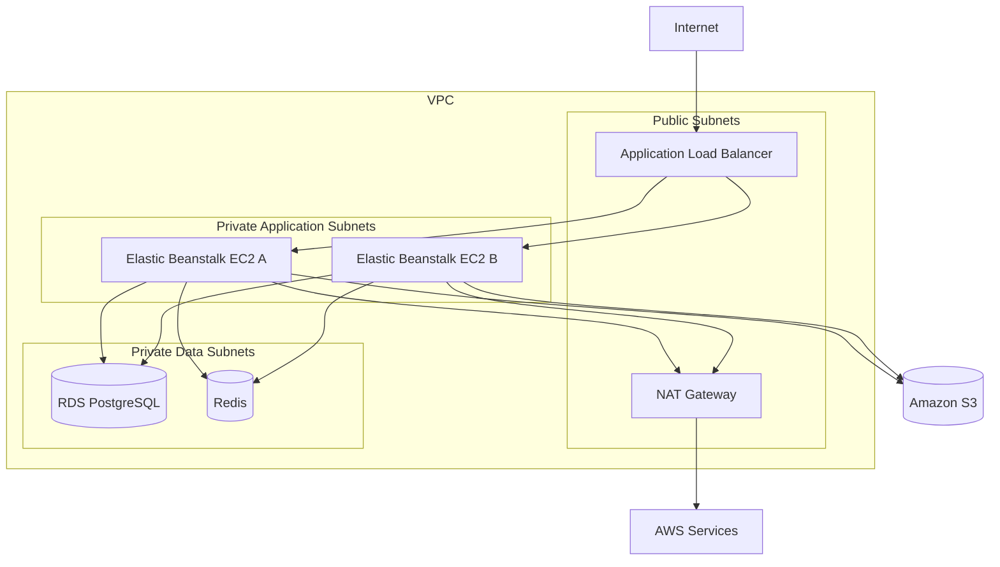

# 03- Network Security

## Overview

Network security in an AWS Elastic Beanstalk environment is primarily about controlling **which systems can communicate with which other systems, over which ports, and through which network paths**.

A production architecture should avoid exposing application instances and data services directly to the Internet. Instead, traffic should enter through a controlled ingress layer and then move through explicitly defined network boundaries.

A common architecture is:

```text
                         Internet
                            │
                            ▼
                     Route 53 / DNS
                            │
                            ▼
                  Application Load Balancer
                       Public Subnet
                            │
                     HTTPS :443
                            │
                            ▼
                 Private Application Subnets
                    ┌───────┴───────┐
                    ▼               ▼
                  EC2-A           EC2-B
                    │               │
                    └───────┬───────┘
                            │
              ┌─────────────┼─────────────┐
              ▼             ▼             ▼
            RDS           Redis           AWS Services
          PostgreSQL                    via controlled access
```

The security objective is not simply to make resources private. It is to establish an intentional trust model:

```text
Internet
   │
   ▼
ALB
   │
   ▼
Application
   │
   ├──► Database
   ├──► Cache
   └──► AWS Services
```

Each connection should exist because the architecture requires it.

## Network Security Model

A production Elastic Beanstalk environment typically uses several layers of network controls.

| Layer | Primary Responsibility |
|---|---|
| VPC | Network isolation |
| Subnets | Resource placement and routing boundaries |
| Route Tables | Traffic routing |
| Internet Gateway | Internet connectivity for public subnets |
| NAT Gateway | Controlled outbound Internet access from private subnets |
| Security Groups | Stateful resource-level traffic control |
| Network ACLs | Stateless subnet-level traffic control |
| Load Balancer | Controlled public application ingress |
| VPC Endpoints | Private access to supported AWS services |
| WAF | Application-layer request filtering where required |
| VPC Flow Logs | Network traffic visibility |

These controls solve different problems and should not be treated as interchangeable.

## Security Architecture

A typical production topology is:



The exact subnet and service layout depends on application requirements, but the security principle remains the same: **minimize publicly reachable resources**.

## VPC Security Boundary

A VPC provides the primary network isolation boundary for the application.

A production Elastic Beanstalk environment should normally run inside a dedicated VPC or an appropriately controlled shared VPC.

A simplified layout is:

```text
VPC
│
├── Public Subnets
│   ├── ALB
│   └── NAT Gateway
│
├── Private Application Subnets
│   ├── EC2
│   └── Workers
│
└── Private Data Subnets
    ├── RDS
    └── Redis
```

The VPC itself does not automatically make the environment secure. Routing, security groups, subnet placement, IAM, and application configuration still determine the effective security posture.

## Public and Private Subnets

The distinction between public and private subnets is primarily determined by routing.

A subnet is commonly considered public when its route table provides a path to an Internet Gateway.

A private application subnet typically does not have a direct route to the Internet Gateway.

```text
Public Subnet
    │
    ├── Route → Internet Gateway
    │
    └── Internet connectivity

Private Subnet
    │
    └── Route → NAT Gateway → Internet Gateway
```

This distinction matters because application instances should generally not require direct inbound Internet connectivity.

## Public Subnet Architecture

A public subnet may contain infrastructure that must accept Internet traffic.

For example:

```text
Internet
   │
   ▼
Internet Gateway
   │
   ▼
Public Subnet
   │
   ▼
ALB
```

The Application Load Balancer becomes the controlled public ingress point.

## Private Application Subnets

Application instances should generally be placed in private subnets when the application does not require direct inbound Internet access.

```text
Internet
   X
   │
   ▼
Private Application Subnet
   │
   ├── EC2-A
   ├── EC2-B
   └── EC2-C
```

The ALB can still reach these instances through private VPC networking.

This architecture reduces the attack surface because clients cannot directly target individual application instances.

## Application Load Balancer as the Ingress Boundary

The ALB should normally be the public entry point for an Internet-facing Elastic Beanstalk application.

```text
Client
  │
  │ HTTPS
  ▼
ALB
  │
  │ Private VPC traffic
  ▼
Elastic Beanstalk EC2
```

The ALB provides a stable frontend while the underlying EC2 fleet can scale or change.

This separation is especially important for horizontally scaled applications.

## Security Group Architecture

A clean production design separates security groups according to system roles.

```text
                 Internet
                    │
                    ▼
                 ALB SG
                    │
                    │ :80 / :443
                    ▼
                 App SG
                    │
          ┌─────────┴─────────┐
          │                   │
        :5432               :6379
          │                   │
          ▼                   ▼
       RDS SG              Redis SG
```

Example rules:

| Security Group | Source | Port | Purpose |
|---|---|---:|---|
| ALB SG | Internet | 443 | HTTPS ingress |
| ALB SG | Internet | 80 | HTTP redirect, if required |
| App SG | ALB SG | Application port | ALB-to-application traffic |
| RDS SG | App SG | 5432 | PostgreSQL |
| Redis SG | App SG | 6379 | Redis |

The source should reference the appropriate security group whenever possible instead of broad CIDR ranges.

## Security Groups

Security groups are stateful virtual firewalls associated with resources such as EC2 instances and network interfaces.

For example:

```text
App SG
  │
  └── Allow TCP 5432
       Source: RDS client security group
```

When an application initiates an allowed connection, the response traffic is automatically permitted because security groups are stateful.

This differs from network ACLs, which are stateless.

## Least-Privilege Security Groups

Bad:

```text
RDS
Port: 5432
Source: 0.0.0.0/0
```

This exposes PostgreSQL to every IPv4 address that can route to the resource.

Better:

```text
RDS
Port: 5432
Source: sg-application
```

This expresses the intended architecture:

```text
Application
     │
     ▼
PostgreSQL
```

rather than:

```text
Anyone
  │
  ▼
PostgreSQL
```

## Application Port Exposure

Suppose Gunicorn listens on port `8000`.

The application security group should not necessarily expose:

```text
TCP 8000
Source: 0.0.0.0/0
```

Instead:

```text
TCP 8000
Source: ALB Security Group
```

The application is reachable by the load balancer, not arbitrary Internet clients.

For Nginx-based deployments, the ALB may communicate with Nginx on port `80`, while Nginx forwards requests internally to Gunicorn or Uvicorn.

```text
ALB
 │
 │ :80
 ▼
Nginx
 │
 │ :8000
 ▼
Gunicorn / Uvicorn
 │
 ▼
Django / FastAPI
```

## Security Group Rules for Django and FastAPI

A typical Django or FastAPI deployment might use:

```text
Internet
   │
   ▼
ALB SG
   │
   │ HTTPS
   ▼
App SG
   │
   ├──► RDS SG :5432
   │
   ├──► Redis SG :6379
   │
   └──► HTTPS / AWS services
```

The framework does not change the network security model.

## Network ACLs

Network ACLs operate at the subnet level.

They are stateless, meaning inbound and outbound traffic are evaluated separately.

```text
Internet
   │
   ▼
NACL
   │
   ▼
Subnet
   │
   ▼
Security Group
   │
   ▼
Resource
```

Security groups are generally the primary control for application-to-application access.

NACLs are useful when subnet-level controls or explicit deny rules are required.

## Security Group vs Network ACL

| Feature | Security Group | Network ACL |
|---|---|---|
| Scope | Resource / network interface | Subnet |
| Stateful | Yes | No |
| Explicit deny | No | Yes |
| Rule evaluation | Allow rules | Ordered allow/deny rules |
| Typical application use | Primary | Additional subnet boundary |
| Return traffic | Automatically allowed | Must be explicitly handled |

A common mistake is adding complicated NACL rules to solve a problem that should have been handled with security groups.

## Route Tables

Route tables determine where traffic goes.

For a public subnet:

```text
0.0.0.0/0
     │
     ▼
Internet Gateway
```

For a private application subnet:

```text
0.0.0.0/0
     │
     ▼
NAT Gateway
```

For private access to another VPC resource:

```text
Application CIDR
     │
     ▼
Local VPC Route
```

Security groups control whether traffic is permitted, while route tables determine where permitted traffic can go.

Both must be correct.

## Internet Gateway

An Internet Gateway provides the VPC-level connection between the VPC and the Internet.

A typical public path is:

```text
Internet
   │
   ▼
Internet Gateway
   │
   ▼
Public Subnet
   │
   ▼
ALB
```

An Internet Gateway does not automatically make every resource in a VPC Internet-accessible.

The resource also requires appropriate routing and addressing.

## NAT Gateway

Private application instances may need outbound Internet access for operations such as:

- Installing packages during deployment
- Calling external APIs
- Downloading dependencies
- Accessing external services
- Applying platform updates

A NAT Gateway allows private resources to initiate outbound Internet connections without providing them with direct inbound Internet access.

```text
Private EC2
    │
    ▼
NAT Gateway
    │
    ▼
Internet Gateway
    │
    ▼
Internet
```

Responses to connections initiated by the private instance can return through the established connection.

## NAT Gateway Security Considerations

A NAT Gateway should normally reside in a public subnet.

The application instances remain in private subnets.

```text
Public Subnet
└── NAT Gateway

Private Subnet
└── EC2
```

Do not place the NAT Gateway itself in a private subnet and expect it to provide Internet access.

## NAT Gateway Availability

A single NAT Gateway can become a cross-AZ dependency.

A higher-availability architecture can use one NAT Gateway per Availability Zone:

```text
AZ-A
 ├── Private App Subnet
 │       │
 │       ▼
 │   NAT Gateway A
 │
AZ-B
 ├── Private App Subnet
 │       │
 │       ▼
 │   NAT Gateway B
```

This can improve resilience but increases cost.

The appropriate design depends on the application's availability requirements.

## VPC Endpoints

VPC endpoints can provide private connectivity from VPC resources to supported AWS services.

This can reduce the need for NAT-based access to those services.

Conceptually:

```text
Private EC2
    │
    ▼
VPC Endpoint
    │
    ▼
AWS Service
```

For example, an application may access S3 through a VPC endpoint instead of routing that traffic through a NAT Gateway.

This can provide:

- Private connectivity
- Reduced NAT processing
- More restrictive network paths
- Potential cost benefits at scale

## Gateway and Interface Endpoints

AWS provides different endpoint models.

| Endpoint Type | Typical Use |
|---|---|
| Gateway endpoint | Services such as S3 and DynamoDB |
| Interface endpoint | Private connectivity to supported AWS services through ENIs |

The exact endpoint design depends on the AWS service and architecture.

## VPC Endpoint Policies

A VPC endpoint can have a policy restricting which resources or operations are accessible through that endpoint.

Conceptually:

```text
Private EC2
    │
    ▼
VPC Endpoint
    │
    │ Endpoint Policy
    ▼
AWS Service
```

This adds another security boundary to the network path.

However, endpoint policies do not replace IAM permissions.

## Private Access to S3

For an application storing files in S3:

```text
Private EC2
    │
    ▼
S3 VPC Endpoint
    │
    ▼
Private AWS Network Path
    │
    ▼
S3
```

The application can still use the AWS SDK normally.

The security model remains:

```text
Network Path
    +
IAM
    +
S3 Policy
```

All three may matter.

## RDS Network Security

RDS should generally be deployed in private subnets and protected by a dedicated security group.

```text
App SG
   │
   │ TCP 5432
   ▼
RDS SG
   │
   ▼
PostgreSQL
```

Do not expose PostgreSQL to the Internet simply because the application needs database access.

## Redis Network Security

Redis should similarly remain private.

```text
App SG
   │
   │ TCP 6379
   ▼
Redis SG
   │
   ▼
Redis
```

A Redis instance exposed publicly can become a severe security vulnerability.

## Internal Service Communication

For a microservices architecture:

```text
Service A
   │
   │ Internal network
   ▼
Service B
```

Security groups should allow only the required communication.

For example:

```text
service-a-sg
      │
      ▼
service-b-sg :8000
```

Avoid broad internal rules such as:

```text
VPC CIDR
→
All ports
```

unless there is a specific architectural reason.

## gRPC Network Security

gRPC commonly uses HTTP/2 and TLS.

For internal services:

```text
Service A
    │
    │ gRPC / TLS
    ▼
Service B
```

Network security should restrict the destination port to the specific service consumers.

For example:

```text
Service B SG
Allow TCP 50051
Source: Service A SG
```

The exact port is application-specific.

## Nginx and Internal Networking

Nginx may operate inside the Elastic Beanstalk instance.

A typical request flow is:

```text
Internet
   │
   ▼
ALB
   │
   ▼
Nginx
   │
   ▼
Gunicorn / Uvicorn
   │
   ▼
Django / FastAPI
```

Nginx should not be exposed directly to the Internet if the ALB is intended to be the public ingress point.

## WAF and Network Security

AWS WAF operates at the application-request layer rather than replacing VPC network controls.

A layered architecture is:

```text
Internet
   │
   ▼
WAF
   │
   ▼
ALB
   │
   ▼
Security Group
   │
   ▼
Private EC2
```

WAF can filter malicious or unwanted HTTP requests.

Security groups control network connectivity.

They solve different problems.

## Network Security Layers

A useful way to reason about the architecture is:

```text
Layer 1: Routing
    │
    ▼
Can traffic reach the destination?

Layer 2: Security Groups / NACLs
    │
    ▼
Is the traffic allowed?

Layer 3: TLS
    │
    ▼
Is traffic encrypted?

Layer 4: Application Authentication
    │
    ▼
Is the caller authenticated?

Layer 5: Authorization
    │
    ▼
Is the caller allowed to perform the operation?
```

Passing one layer does not imply passing the others.

## DNS Security

DNS is part of the public network boundary.

A typical architecture is:

```text
Client
   │
   ▼
Route 53
   │
   ▼
ALB
   │
   ▼
Elastic Beanstalk
```

Use DNS records to point users toward the intended public endpoint rather than exposing EC2 instance addresses.

Avoid building application logic around dynamically changing instance IP addresses.

## TLS Between ALB and Application

There are two common patterns.

### TLS Termination at ALB

```text
Client
   │ HTTPS
   ▼
ALB
   │ HTTP
   ▼
Application
```

Advantages:

- Simple certificate management
- Centralized TLS termination
- Lower application complexity

### End-to-End TLS

```text
Client
   │ HTTPS
   ▼
ALB
   │ HTTPS
   ▼
Application
```

Advantages:

- Encryption across the internal hop
- Useful for stricter security or compliance requirements

The choice depends on the application's security requirements.

## Outbound Network Security

Network security should cover outbound traffic as well as inbound traffic.

A private application may need to call:

```text
External API
AWS API
Package Repository
Third-party Service
```

Instead of allowing unrestricted outbound access, evaluate which destinations are actually required.

Potential controls include:

- Security groups
- Network ACLs
- NAT architecture
- VPC endpoints
- DNS controls
- Network firewalls where justified
- Application-level allowlists

## Egress Considerations

A default configuration may allow:

```text
EC2
 │
 └──► 0.0.0.0/0
```

This is operationally convenient but can increase the blast radius of a compromised instance.

For sensitive environments, consider whether outbound traffic should be constrained.

However, aggressive egress restrictions can break:

- Package installation
- AWS API calls
- Third-party APIs
- Monitoring agents
- Platform operations

Security controls should therefore be based on actual dependency mapping.

## VPC Flow Logs

VPC Flow Logs provide visibility into network traffic metadata.

A simplified investigation might look like:

```text
Unexpected Traffic
       │
       ▼
VPC Flow Logs
       │
       ▼
Source / Destination
       │
       ▼
Port / Protocol
       │
       ▼
Security Investigation
```

Flow Logs can help answer questions such as:

- Which host attempted to communicate with another host?
- Which port was used?
- Was the traffic accepted or rejected?
- Is unexpected network traffic occurring?

Flow Logs are visibility tooling, not a replacement for security groups or NACLs.

## Network Security Monitoring

Important metrics and signals include:

- ALB 4xx responses
- ALB 5xx responses
- Connection errors
- Unusual traffic volume
- Unexpected rejected flows
- Security group changes
- Route table changes
- Network configuration changes
- Unexpected outbound destinations

Security events should be correlated with CloudTrail and application logs.

## Network Security and Auto Scaling

Auto Scaling changes the number of application instances.

A secure architecture should therefore avoid IP-based application-to-database rules whenever a security-group reference can express the relationship.

Bad:

```text
RDS
Allow 10.0.12.0/24
```

Better:

```text
RDS
Allow Source: Application SG
```

The security relationship remains valid as instances are added or removed.

## Network Security and High Availability

High availability and network security must be designed together.

A typical multi-AZ application architecture is:

```text
                  ALB
             /           \
            ▼             ▼
         AZ-A            AZ-B
        App-A           App-B
          │               │
          └───────┬───────┘
                  │
                  ▼
              RDS / Redis
```

Security groups should work consistently across both Availability Zones.

A security rule that works only for one subnet or one instance can become a hidden failure during scaling.

## Cross-AZ Traffic

Distributing application instances across Availability Zones improves availability but can introduce cross-AZ network traffic.

This has both:

- Performance implications
- Cost implications

For example:

```text
AZ-A Application
       │
       │ Cross-AZ
       ▼
AZ-B Database
```

The architecture should therefore place highly coupled resources appropriately while still maintaining availability requirements.

Do not compromise required redundancy solely to avoid network transfer costs.

## Network Security for Background Workers

If Celery workers run inside the Elastic Beanstalk environment:

```text
API
 │
 ▼
Broker
 │
 ▼
Celery Worker
 │
 ├──► RDS
 └──► S3
```

Worker security groups should allow only the communication they actually require.

If workers have different trust requirements from web instances, separate worker environments and security groups can provide stronger isolation.

## Security for Administrative Access

Administrative access to EC2 instances should not require exposing SSH broadly to the Internet.

Avoid:

```text
SSH :22
Source: 0.0.0.0/0
```

Prefer controlled management mechanisms and restricted administrative access.

The goal is:

```text
Administrator
     │
     ▼
Controlled Management Path
     │
     ▼
Private EC2
```

Administrative access should also be logged and auditable.

## Network Security and Containers

If Elastic Beanstalk is running containerized workloads, the same network principles still apply.

```text
ALB
 │
 ▼
EC2
 │
 ▼
Container
 │
 ├──► RDS
 └──► Redis
```

Containerization does not replace VPC-level security.

Security must exist across:

```text
VPC
+
Security Groups
+
Host
+
Container
+
Application
```

## Common Network Security Mistakes

### Public EC2 Instances

Bad:

```text
Internet
   │
   ▼
Public EC2
```

when direct Internet access is unnecessary.

Prefer:

```text
Internet
   │
   ▼
ALB
   │
   ▼
Private EC2
```

### Public RDS

Never expose PostgreSQL to the Internet simply to allow the application to connect.

Use private networking and restrictive security groups.

### Open Security Groups

Bad:

```text
TCP 0-65535
Source: 0.0.0.0/0
```

This effectively removes most network-level restrictions.

Define specific ports and trusted sources.

### Allowing the Entire VPC to Access Everything

A VPC CIDR is broader than a security-group relationship.

Bad:

```text
VPC CIDR
    │
    └──► All application ports
```

Prefer explicit service relationships where practical.

### Exposing Redis

Redis should generally not have Internet-facing access.

A publicly reachable Redis service can expose sensitive cached data and potentially allow destructive operations.

### Using NACLs as the Primary Application Firewall

NACLs operate at subnet boundaries and are stateless.

Complex NACL configurations can create difficult troubleshooting scenarios.

Use security groups for resource-level application communication.

### Single NAT Gateway for Critical Multi-AZ Systems

A single NAT Gateway can become a dependency for multiple Availability Zones.

For high-availability workloads, evaluate whether each Availability Zone should have its own NAT Gateway.

### Forgetting Outbound Traffic

Security reviews often focus only on inbound traffic.

A compromised application can also use unrestricted outbound access to communicate with external infrastructure.

Evaluate egress requirements.

### Hard-Coding IP Addresses

EC2 instances can be replaced and scaled.

Do not design application security around individual instance IP addresses when security-group references or service discovery can express the intended relationship.

### Assuming Private Subnets Solve Everything

Private subnets reduce exposure but do not protect against:

- Compromised application code
- Excessive IAM permissions
- Weak authentication
- Vulnerable dependencies
- Malicious internal traffic

Network security is one layer of defense in depth.

## Production Network Security Checklist

### VPC

- [ ] Production resources are deployed in the intended VPC.
- [ ] Public and private subnets have clearly defined purposes.
- [ ] Route tables are reviewed.
- [ ] Internet Gateway access is limited to intended public resources.
- [ ] NAT Gateway architecture matches availability requirements.

### Load Balancer

- [ ] ALB is the intended public ingress point.
- [ ] HTTPS is enabled.
- [ ] HTTP is redirected or intentionally supported.
- [ ] ALB security group allows only required inbound traffic.
- [ ] Application security group accepts traffic only from the intended ALB security group.

### Application

- [ ] Application instances are private where appropriate.
- [ ] Application ports are not Internet-accessible.
- [ ] Nginx, Gunicorn, and Uvicorn are not unnecessarily exposed.
- [ ] Internal services use restricted security-group relationships.

### Database and Cache

- [ ] RDS is private.
- [ ] RDS accepts traffic only from required application sources.
- [ ] Redis is private.
- [ ] Redis accepts traffic only from required application sources.
- [ ] Database and cache ports are not exposed publicly.

### AWS Services

- [ ] VPC endpoints are evaluated for applicable AWS services.
- [ ] Endpoint policies are reviewed where used.
- [ ] IAM and network controls are designed together.
- [ ] NAT access is not used unnecessarily for services that can be accessed privately.

### Monitoring

- [ ] VPC Flow Logs are enabled where useful.
- [ ] CloudTrail records network-configuration changes.
- [ ] Security-group changes are auditable.
- [ ] Route table changes are monitored.
- [ ] Unexpected network traffic can be investigated.

### Administration

- [ ] SSH is not exposed globally.
- [ ] Administrative access uses a controlled management path.
- [ ] Administrative activity is auditable.
- [ ] Production network changes require appropriate authorization.

## Interview Perspective

### Why put Elastic Beanstalk EC2 instances in private subnets?

Because the application instances generally do not need direct Internet ingress.

The ALB provides the public entry point:

```text
Internet
   │
   ▼
ALB
   │
   ▼
Private EC2
```

This reduces the attack surface.

### What is the difference between a security group and a NACL?

A security group is a stateful resource-level firewall.

A NACL is a stateless subnet-level firewall.

```text
Security Group → Resource
NACL            → Subnet
```

### Why should the RDS security group reference the application security group?

Because it creates an explicit trust relationship:

```text
Application
     │
     ▼
RDS
```

It also continues to work as the application Auto Scaling group adds or removes instances.

### Why use a NAT Gateway?

A NAT Gateway allows private instances to initiate outbound Internet connections without giving those instances direct inbound Internet exposure.

### Why might you use VPC endpoints?

They allow private access to supported AWS services and can reduce dependence on NAT-based paths.

They can also provide additional policy and network controls.

### Does a private subnet prevent an EC2 instance from accessing the Internet?

Not necessarily.

A private subnet can have an outbound route through a NAT Gateway:

```text
Private EC2
    │
    ▼
NAT Gateway
    │
    ▼
Internet Gateway
    │
    ▼
Internet
```

What matters is the routing configuration.

### Why use security-group references instead of IP ranges?

Auto Scaling changes the set of application instances.

Security-group references express the service relationship without depending on individual instance addresses.

### Does a security group protect against SQL injection?

No.

Security groups control network connectivity.

SQL injection is an application-layer vulnerability and must be addressed through secure application design, parameterized queries, ORM usage, and input handling.

### Is HTTPS enough to secure an Elastic Beanstalk application?

No.

HTTPS protects traffic in transit but does not replace:

- Network segmentation
- Security groups
- IAM
- Authentication
- Authorization
- Secure storage
- Application security
- Monitoring

### How would you secure a production Django API on Elastic Beanstalk?

A strong answer would be:

```text
Internet
   │
   ▼
Route 53
   │
   ▼
WAF where required
   │
   ▼
HTTPS ALB
   │
   ▼
Private Elastic Beanstalk EC2
   │
   ├──► Private RDS
   ├──► Private Redis
   └──► AWS services through controlled paths
```

Combined with:

- Restrictive security groups
- Least-privilege IAM
- Managed secrets
- TLS
- Network monitoring
- Application authentication and authorization

## Key Takeaways

- Network security in Elastic Beanstalk is primarily about controlling connectivity and minimizing exposed infrastructure.
- A common production architecture places the ALB in public subnets and application instances in private subnets.
- RDS and Redis should generally remain private and accept traffic only from required application sources.
- Security groups should model explicit service-to-service trust relationships.
- Prefer security-group references over broad CIDR ranges when defining application dependencies.
- Network ACLs operate at the subnet level and are stateless; security groups operate at the resource level and are stateful.
- Route tables determine where traffic travels; security groups and NACLs determine whether traffic is permitted.
- NAT Gateways provide outbound Internet access for private resources without making those resources directly Internet-facing.
- For high-availability architectures, evaluate the NAT Gateway design across Availability Zones.
- VPC endpoints can provide private access to supported AWS services and reduce unnecessary NAT traffic.
- HTTPS protects data in transit but does not replace application or network security.
- WAF operates at the HTTP request layer and complements, rather than replaces, VPC security controls.
- Private subnets reduce exposure but do not eliminate application vulnerabilities or excessive IAM permissions.
- Network security must cover both inbound and outbound traffic.
- VPC Flow Logs provide useful network visibility and should complement CloudTrail and application monitoring.
- Auto Scaling makes IP-based security rules fragile; service-oriented security-group relationships are more resilient.
- The goal is a network where every allowed connection has a clear architectural reason and unnecessary connectivity is denied.