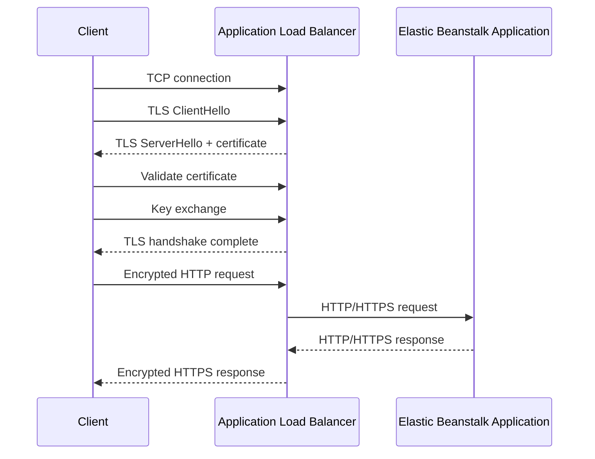
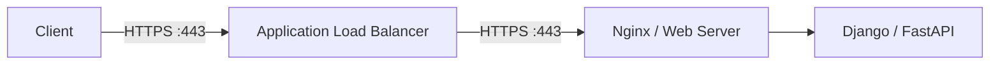
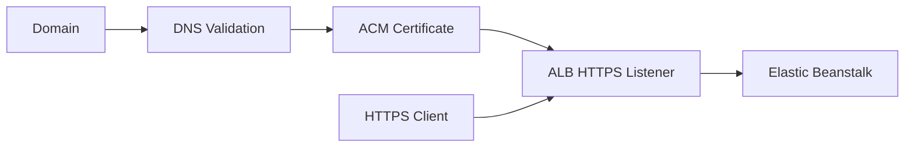

# 04- HTTPS and TLS Security

## Overview

HTTPS is HTTP transported over TLS (Transport Layer Security). In an AWS Elastic Beanstalk production environment, HTTPS protects application traffic between clients and the public entry point, typically an Application Load Balancer (ALB).

A common architecture is:

```text
Client
  │
  │ HTTPS / TLS
  ▼
Application Load Balancer
  │
  │ HTTP or HTTPS
  ▼
Elastic Beanstalk EC2
  │
  ▼
Django / FastAPI
```

Elastic Beanstalk supports HTTPS termination at the load balancer for load-balanced environments. AWS recommends AWS Certificate Manager (ACM) for provisioning and managing certificates used with AWS load balancers. Single-instance Elastic Beanstalk environments do not have a load balancer and therefore do not support load-balancer HTTPS termination. :contentReference[oaicite:0]{index=0}

HTTPS should be considered a baseline production requirement for applications that transmit authentication credentials, personal information, session data, API tokens, or other sensitive information.

TLS provides:

- **Confidentiality** — network observers cannot read encrypted application data.
- **Integrity** — modifications to the encrypted connection can be detected.
- **Authentication** — the client can verify that it is communicating with the expected server when certificate validation succeeds.

TLS does not provide application authorization. A valid HTTPS connection does not mean the caller is allowed to access an API.

## HTTPS and TLS

HTTPS is not itself an encryption protocol.

The relationship is:

```text
HTTP
  │
  ▼
TLS
  │
  ▼
TCP
  │
  ▼
IP
```

HTTP defines application semantics such as:

```text
GET /users
POST /orders
Authorization: Bearer ...
```

TLS protects the connection carrying those HTTP messages.

Modern production systems should use TLS rather than obsolete SSL terminology, although AWS APIs and configuration fields may still contain names such as `SSLPolicy` or `SSLCertificateArns`.

## Why TLS Matters

Without HTTPS:

```text
Client
  │
  │ HTTP
  ▼
Internet
  │
  ▼
Application
```

Sensitive information can be exposed to network attackers.

With HTTPS:

```text
Client
  │
  │ Encrypted TLS connection
  ▼
ALB
  │
  ▼
Application
```

This protects the client-to-load-balancer connection from passive network inspection and provides server authentication through the certificate.

TLS does not protect against:

- SQL injection
- Broken authentication
- Broken authorization
- Vulnerable dependencies
- Compromised application instances
- Stolen application credentials
- Malicious application logic

HTTPS is therefore one layer of a broader security architecture.

## TLS Request Lifecycle

A simplified TLS request flow is:



The exact TLS handshake depends on the negotiated TLS version and cipher suite, but the architectural idea is:

```text
TCP connection
      │
      ▼
TLS negotiation
      │
      ▼
Certificate validation
      │
      ▼
Cryptographic key establishment
      │
      ▼
Encrypted application traffic
```

## AWS Certificate Manager

AWS Certificate Manager (ACM) is the preferred mechanism for provisioning and managing certificates for AWS-integrated services such as Elastic Load Balancing. :contentReference[oaicite:1]{index=1}

A typical Elastic Beanstalk architecture is:

```text
                    AWS Certificate Manager
                              │
                              │ Certificate
                              ▼
Client ── HTTPS ──► Application Load Balancer
                              │
                              ▼
                       Elastic Beanstalk
```

For public certificates, ACM handles certificate lifecycle management and automatically attempts renewal before expiration. AWS currently documents public ACM certificates as valid for 198 days and says ACM attempts automatic renewal 45 days before expiration. :contentReference[oaicite:2]{index=2}

## Certificate Scope

ACM certificates are regional resources.

If the same domain is served through Elastic Load Balancing in multiple AWS Regions, an appropriate certificate must exist in each Region. ACM certificates cannot simply be copied between Regions. :contentReference[oaicite:3]{index=3}

For example:

```text
Production Region: ap-south-1
    └── ACM certificate for api.example.com

Secondary Region: us-east-1
    └── ACM certificate for api.example.com
```

This matters in multi-Region architectures.

## Certificate Validation

Before ACM can issue a public certificate, domain ownership must be validated.

DNS validation is generally preferred for production automation because the validation record can remain in DNS and support automated renewal.

Conceptually:

```text
Domain
  │
  ▼
DNS validation record
  │
  ▼
ACM verifies ownership
  │
  ▼
Certificate issued
  │
  ▼
ALB HTTPS listener
```

The certificate should cover the exact domain names clients use.

For example:

```text
api.example.com
```

should be covered by a certificate whose names include that hostname.

## Certificate and Domain Matching

The certificate must match the hostname presented by the client.

For example:

```text
Client:
https://api.example.com

Certificate:
api.example.com
```

is valid when the certificate is otherwise trusted and valid.

But:

```text
Client:
https://api.example.com

Certificate:
example.net
```

does not provide valid hostname authentication.

A certificate can contain multiple names through SANs (Subject Alternative Names), allowing one certificate to cover several hostnames.

## Wildcard Certificates

A wildcard certificate can cover a set of subdomains.

For example:

```text
*.example.com
```

can cover:

```text
api.example.com
www.example.com
admin.example.com
```

It does not normally cover the apex domain:

```text
example.com
```

If both are required, the certificate should include both names.

## ACM Certificate Example

A typical certificate request using the AWS CLI is:

```bash
aws acm request-certificate \
  --domain-name api.example.com \
  --validation-method DNS \
  --region ap-south-1
```

The returned certificate ARN can then be associated with the load balancer's HTTPS listener.

ACM public certificates can be requested through the AWS CLI, console, or API. :contentReference[oaicite:4]{index=4}

## HTTPS Listener

An ALB HTTPS listener accepts TLS connections from clients.

A simplified configuration is:

```text
Internet
   │
   │ TCP 443
   ▼
ALB HTTPS Listener
   │
   ├── Certificate
   ├── TLS security policy
   └── Listener rules
        │
        ▼
     Target Group
        │
        ▼
Elastic Beanstalk EC2
```

An HTTPS listener requires at least one server certificate and a security policy for TLS negotiation. :contentReference[oaicite:5]{index=5}

## Port 443

HTTPS normally uses TCP port `443`.

A common production configuration is:

```text
Port 80
   │
   └── HTTP → HTTPS redirect

Port 443
   │
   └── HTTPS → Application
```

The application should normally advertise HTTPS as the canonical URL.

## HTTP to HTTPS Redirect

A production application should generally redirect HTTP requests to HTTPS.

```text
HTTP :80
   │
   ▼
Redirect
   │
   ▼
HTTPS :443
   │
   ▼
Application
```

The redirect can be implemented at the load balancer.

The important principle is that HTTP should not provide a second insecure application path.

A redirect does not encrypt the initial HTTP request itself. Therefore, sensitive data should never be submitted over the HTTP endpoint before the redirect.

## Elastic Beanstalk HTTPS Configuration

Elastic Beanstalk supports configuring an HTTPS listener through the console or configuration files. For an Application Load Balancer, AWS documents using the `aws:elbv2:listener:443` namespace and specifying the ACM certificate ARN. :contentReference[oaicite:6]{index=6}

A configuration can look like:

```yaml
option_settings:
  aws:elbv2:listener:443:
    ListenerEnabled: 'true'
    Protocol: HTTPS
    SSLCertificateArns: arn:aws:acm:ap-south-1:123456789012:certificate/EXAMPLE
```

The exact configuration should be validated against the load balancer type and current Elastic Beanstalk platform configuration.

## HTTPS Termination at the Load Balancer

The most common architecture is TLS termination at the ALB.

```text
Client
  │
  │ HTTPS
  ▼
ALB
  │
  │ HTTP
  ▼
Application
```

The ALB performs:

1. TLS negotiation.
2. Certificate presentation.
3. Certificate-based server authentication.
4. Encryption/decryption.
5. HTTP forwarding to the application.

AWS documents HTTPS termination at the load balancer as the simplest HTTPS approach for a load-balanced Elastic Beanstalk environment. :contentReference[oaicite:7]{index=7}

## Advantages of Load Balancer Termination

- Centralized certificate management.
- Reduced TLS processing on application instances.
- Simplified application configuration.
- Easier certificate rotation.
- A single public TLS endpoint.
- Better separation between network infrastructure and application code.

For most Django and FastAPI applications, this is the default architecture to consider.

## Limitations of Load Balancer Termination

With:

```text
Client
  │ HTTPS
  ▼
ALB
  │ HTTP
  ▼
Application
```

the backend hop is not encrypted with TLS.

AWS notes that traffic between AWS resources is isolated from unrelated instances in the VPC, but applications with strict regulatory or security requirements may need encryption across all network connections. :contentReference[oaicite:8]{index=8}

Whether backend TLS is necessary should therefore be driven by:

- Compliance requirements.
- Security policy.
- Threat model.
- Network architecture.
- Data sensitivity.
- Organizational requirements.

## End-to-End TLS

End-to-end encryption can encrypt both network segments:

```text
Client
  │
  │ HTTPS
  ▼
ALB
  │
  │ HTTPS
  ▼
Application
```

This requires the application instances to terminate HTTPS as well.

AWS documents this approach for load-balanced Elastic Beanstalk environments where traffic between the load balancer and instances must also be encrypted. :contentReference[oaicite:9]{index=9}

## End-to-End TLS Architecture



The ALB terminates the external TLS connection and establishes another TLS connection to the backend.

This is sometimes called **TLS re-encryption**.

## Backend Certificate

With end-to-end TLS, the backend instance also needs a certificate.

For internal traffic, the certificate may come from an appropriate internal PKI or another certificate-management mechanism depending on the security requirements.

The important requirement is that the load balancer's backend connection is configured to use HTTPS and that certificate validation requirements are deliberately designed.

Do not treat "HTTPS enabled" as automatically equivalent to "backend certificate validation is secure."

AWS notes that, by default, when forwarding HTTPS to backend instances in the relevant Elastic Beanstalk configuration, the load balancer can trust certificates presented by backend instances unless additional trust controls are configured. :contentReference[oaicite:10]{index=10}

## TLS Termination vs End-to-End TLS

| Architecture | Client → ALB | ALB → App | Complexity | Typical Use |
|---|---|---|---|---|
| TLS termination | HTTPS | HTTP | Low | Most applications |
| End-to-end TLS | HTTPS | HTTPS | Medium | Strict security/compliance |
| TLS passthrough | Encrypted TCP | Encrypted | Higher | Specialized architectures |

The right choice depends on the threat model and operational requirements.

## TLS Passthrough

TLS passthrough means the load balancer forwards encrypted traffic without terminating TLS.

Conceptually:

```text
Client
  │
  │ Encrypted TLS
  ▼
Load Balancer
  │
  │ Encrypted TLS
  ▼
Application
```

The backend application performs the TLS termination.

AWS documents TCP passthrough using a Network Load Balancer when encrypted traffic needs to reach the targets without the load balancer decrypting it. :contentReference[oaicite:11]{index=11}

This is different from an ALB HTTPS listener.

## When to Use TLS Passthrough

TLS passthrough may be appropriate when:

- The backend must control the TLS session directly.
- The load balancer should not terminate encryption.
- Protocol requirements require transport-level forwarding.
- Specialized certificate or client-authentication requirements exist.

It adds operational complexity and should not be selected merely because "more encryption sounds better."

## TLS Security Policies

A TLS security policy controls which protocols and cipher suites can be negotiated between the client and load balancer.

AWS describes a security policy as a combination of supported protocols and ciphers used during TLS negotiation. :contentReference[oaicite:12]{index=12}

Conceptually:

```text
Client
  │
  ├── Supported TLS versions
  ├── Supported cipher suites
  │
  ▼
ALB Security Policy
  │
  ▼
Common secure configuration
```

The security policy determines which combinations are accepted.

## TLS Version

Modern production systems should prefer current TLS versions and avoid obsolete protocols.

A practical policy should:

- Support TLS 1.2 and, where appropriate, TLS 1.3.
- Avoid obsolete TLS versions.
- Follow current AWS-recommended security policies.
- Consider client compatibility before disabling older protocols.

AWS continuously introduces security policies with different protocol and cipher combinations, so production environments should use a current AWS-supported policy rather than hard-coding an outdated policy indefinitely. :contentReference[oaicite:13]{index=13}

## Cipher Suites

A cipher suite defines cryptographic algorithms used during TLS negotiation.

Conceptually:

```text
TLS Version
    +
Key Exchange
    +
Authentication
    +
Encryption
    +
Integrity
```

The exact algorithms are less important than understanding that the selected security policy controls which cryptographic combinations are permitted.

Avoid selecting a policy solely because an old client happens to require it.

## Certificate Rotation

Certificates expire.

A production architecture should therefore avoid manual certificate replacement wherever possible.

With ACM-managed certificates:

```text
ACM
 │
 ├── Certificate lifecycle
 ├── Renewal
 └── Integration
       │
       ▼
      ALB
```

ACM attempts automatic renewal for eligible public certificates. :contentReference[oaicite:14]{index=14}

Operational teams should still monitor certificate status and renewal events.

Automatic renewal is not a reason to ignore certificate monitoring.

## Certificate Renewal Failure

Renewal can fail because:

- DNS validation records were removed.
- Domain ownership changed.
- DNS configuration is incorrect.
- Certificate integration changed.
- The certificate is no longer associated with the expected resource.
- Organizational DNS automation broke.

A production process should detect renewal failures before the certificate expires.

## Certificate Monitoring

Important operational checks include:

- Certificate expiration.
- Renewal status.
- Domain validation status.
- ALB listener certificate association.
- Certificate changes.
- TLS handshake failures.

Certificate lifecycle monitoring is particularly important for production domains.

## Certificate Deployment

A useful deployment flow is:



The application itself does not need to manage the public certificate when TLS terminates at the ALB.

## Application Awareness of HTTPS

When TLS terminates at the ALB, Django or FastAPI may receive HTTP internally even though the original client used HTTPS.

```text
Client
  │
  │ HTTPS
  ▼
ALB
  │
  │ HTTP
  ▼
Django
```

The application must therefore correctly understand the original request scheme.

ALB forwards information about the original protocol through headers such as:

```text
X-Forwarded-Proto: https
```

The application or reverse proxy must be configured appropriately.

## Django HTTPS Configuration

Django commonly needs configuration that allows it to recognize secure requests correctly when operating behind a trusted proxy.

For example:

```python
SECURE_PROXY_SSL_HEADER = ("HTTP_X_FORWARDED_PROTO", "https")
SECURE_SSL_REDIRECT = True
SESSION_COOKIE_SECURE = True
CSRF_COOKIE_SECURE = True
```

These settings should only be used when the application is behind a proxy/load balancer that reliably sets the expected header.

Do not blindly trust arbitrary client-supplied `X-Forwarded-Proto` headers.

The proxy boundary must be controlled.

## Django HSTS

HTTP Strict Transport Security (HSTS) instructs browsers to use HTTPS for future requests to the domain.

Django supports:

```python
SECURE_HSTS_SECONDS = 31536000
SECURE_HSTS_INCLUDE_SUBDOMAINS = True
SECURE_HSTS_PRELOAD = True
```

HSTS should be enabled deliberately.

A common production rollout is:

```text
HTTPS verified
      │
      ▼
Short HSTS period
      │
      ▼
Validate application behavior
      │
      ▼
Increase HSTS duration
```

Enabling aggressive HSTS before confirming that all required subdomains support HTTPS can create operational problems.

## FastAPI and HTTPS

FastAPI applications commonly run behind a reverse proxy or load balancer.

For example:

```text
Client
  │
  │ HTTPS
  ▼
ALB
  │
  ▼
Nginx
  │
  ▼
Uvicorn
  │
  ▼
FastAPI
```

The TLS configuration generally belongs at the infrastructure boundary rather than inside the FastAPI application when the ALB is responsible for TLS termination.

The application should still generate correct HTTPS-aware URLs and handle forwarded headers appropriately.

## Secure Cookies

HTTPS should be combined with secure cookie settings.

For example:

```text
Secure
HttpOnly
SameSite
```

The `Secure` attribute ensures browsers send the cookie only over HTTPS.

`HttpOnly` helps prevent JavaScript from directly reading the cookie.

`SameSite` controls cross-site cookie behavior.

TLS protects the cookie while it is transmitted, but secure cookie attributes reduce other attack paths.

## TLS and Authentication

TLS protects credentials during transport.

For example:

```text
POST /login
Authorization / credentials
        │
        ▼
       TLS
        │
        ▼
      Server
```

Without TLS, credentials can potentially be exposed in transit.

However:

```text
HTTPS
   ≠
Authentication
```

The server still needs to authenticate the caller.

## TLS and Authorization

Similarly:

```text
TLS
 │
 └── Protects connection

Authentication
 │
 └── Identifies caller

Authorization
 │
 └── Determines allowed actions
```

A valid TLS session does not authorize access to `/admin`.

## TLS and API Tokens

Bearer tokens are especially sensitive.

For example:

```http
Authorization: Bearer <token>
```

The token should only be transmitted over HTTPS.

A leaked bearer token can allow an attacker to impersonate the token holder until the token expires or is revoked.

TLS therefore becomes a foundational control for REST APIs and gRPC services.

## TLS for gRPC

gRPC commonly uses HTTP/2 and can operate over TLS.

A typical architecture is:

```text
Service A
   │
   │ gRPC / TLS
   ▼
ALB / NLB
   │
   ▼
Service B
```

The exact load balancer depends on the required protocol and traffic model.

TLS protects the transport, while service authentication and authorization remain separate concerns.

## TLS and Internal Traffic

There are two legitimate production models.

### Model A: TLS at the Edge

```text
Client
  │ HTTPS
  ▼
ALB
  │ HTTP
  ▼
Private Application
```

This is operationally simple and often sufficient.

### Model B: TLS Everywhere

```text
Client
  │ HTTPS
  ▼
ALB
  │ HTTPS
  ▼
Application
  │ HTTPS
  ▼
Internal Service
```

This provides stronger encryption boundaries but increases:

- Certificate management.
- TLS configuration.
- CPU usage.
- Troubleshooting complexity.
- Operational overhead.

Use it when the security requirements justify the complexity.

## TLS Performance

TLS introduces computational overhead during connection establishment and encryption.

However, modern load balancers are designed to handle TLS termination efficiently.

A simplified comparison is:

```text
Without centralized TLS:
Many EC2 instances
   └── Each handles TLS

With ALB termination:
ALB
   └── Handles TLS centrally
        │
        └── EC2 handles application traffic
```

TLS performance should be measured rather than assumed.

Connection reuse, HTTP keep-alive, HTTP/2, and appropriate load-balancer configuration can reduce repeated handshake overhead.

## TLS and HTTP/2

HTTPS listeners can support modern HTTP behavior depending on the load balancer and configuration.

HTTP/2 can improve connection efficiency through:

- Multiplexing.
- Header compression.
- Stream concurrency.
- Reduced connection overhead.

The backend application does not necessarily need to terminate HTTP/2 when the ALB handles the client-facing connection.

## TLS and Health Checks

Health checks must be designed consistently with the selected backend protocol.

For example:

```text
ALB
 │
 │ HTTPS health check
 ▼
Application
```

may be appropriate when backend TLS is required.

If the ALB terminates TLS and communicates with the backend using HTTP:

```text
ALB
 │
 │ HTTP health check
 ▼
Application
```

may be sufficient.

A mismatch between the listener, target protocol, and health-check configuration can cause healthy applications to appear unhealthy.

## Security Headers

HTTPS should be combined with appropriate HTTP security headers.

Common examples include:

```http
Strict-Transport-Security: max-age=31536000
X-Content-Type-Options: nosniff
Content-Security-Policy: ...
Referrer-Policy: strict-origin-when-cross-origin
```

The exact headers depend on the application.

Do not blindly copy a security-header configuration without understanding its effect on frontend assets, third-party integrations, and browser behavior.

## Certificate Private Keys

One major advantage of using ACM with an integrated AWS service is that certificate private-key handling is managed by AWS rather than manually installing private keys on every application instance.

This reduces:

- Secret distribution.
- Manual certificate deployment.
- Key exposure.
- Rotation complexity.

For certificates used directly on customer-managed infrastructure, certificate and private-key lifecycle management becomes an application/platform responsibility unless a managed mechanism is used.

## ACM vs Manually Installed Certificates

| Approach | Certificate Management | Operational Complexity | Typical Use |
|---|---|---:|---|
| ACM + ALB | AWS-managed | Low | Recommended AWS load-balancer architecture |
| IAM certificate | Manual / legacy path | Higher | Specific legacy scenarios |
| Certificate on EC2 | Application/host-managed | High | Direct instance termination |
| Private CA | Organization-managed PKI | High | Internal/private trust requirements |

AWS identifies ACM as the preferred certificate-management solution for Elastic Beanstalk load balancer HTTPS. :contentReference[oaicite:15]{index=15}

## Security Group Configuration

The ALB security group should permit HTTPS from intended clients.

Example:

```text
ALB Security Group

Inbound:
TCP 443
Source: 0.0.0.0/0
```

For IPv6-enabled applications, the corresponding IPv6 rule should also be considered.

The application security group should then allow traffic only from the ALB security group:

```text
Application Security Group

Inbound:
TCP 8000
Source: ALB Security Group
```

The application should not independently expose port `8000` to the Internet.

## HTTP Security Group Configuration

If port 80 is used only for redirection:

```text
ALB
 │
 ├── 80  → Redirect
 │
 └── 443 → Application
```

allow port 80 on the ALB and ensure the listener redirects to HTTPS.

If HTTP is not required at all, it can be omitted.

## TLS Logging and Troubleshooting

When HTTPS fails, investigate the connection in layers.

```text
DNS
 │
 ▼
TCP connectivity
 │
 ▼
TLS handshake
 │
 ▼
Certificate validation
 │
 ▼
HTTP request
 │
 ▼
Application
```

This prevents treating every HTTPS failure as an application problem.

## Common TLS Failure Modes

| Symptom | Likely Area |
|---|---|
| DNS does not resolve | DNS |
| Connection refused | Listener / networking |
| TLS handshake failure | TLS policy / protocol / cipher |
| Certificate warning | Certificate / hostname / trust |
| Certificate expired | ACM / certificate lifecycle |
| HTTP 301 | Redirect configuration |
| HTTP 403 | WAF / application authorization |
| HTTP 502 | ALB-to-target connectivity/application |
| HTTP 503 | No healthy targets |
| Secure cookie not working | Application/proxy configuration |

## Certificate Troubleshooting

Check:

```text
Certificate status
Certificate domain names
Certificate Region
Certificate validation
Certificate attached to ALB listener
Certificate expiration
```

A common mistake is requesting the certificate in the wrong AWS Region.

For example:

```text
ALB:
ap-south-1

Certificate:
us-east-1
```

The certificate cannot simply be used as though ACM certificates were global resources. ACM certificates are regional. :contentReference[oaicite:16]{index=16}

## TLS Troubleshooting with OpenSSL

For low-level investigation, OpenSSL can inspect a TLS endpoint.

```bash
openssl s_client \
  -connect api.example.com:443 \
  -servername api.example.com
```

This can help inspect:

- Certificate chain.
- Subject.
- SANs.
- Negotiated TLS version.
- Negotiated cipher.
- Certificate expiration.

It is particularly useful when browser errors are too abstract to diagnose the underlying TLS problem.

## Testing HTTPS with curl

A basic request:

```bash
curl -I https://api.example.com
```

Follow redirects:

```bash
curl -I -L http://api.example.com
```

This can verify:

- HTTP-to-HTTPS redirect.
- Response status.
- Security headers.
- Final HTTPS endpoint.

For production debugging, avoid disabling certificate verification with options such as:

```bash
curl -k
```

unless the purpose is specifically to diagnose certificate validation behavior.

Disabling verification hides the exact security failure you are trying to investigate.

## Common HTTPS and TLS Mistakes

### Using HTTP in Production

Bad:

```text
http://api.example.com
```

for authentication or sensitive application traffic.

Prefer:

```text
https://api.example.com
```

and redirect HTTP to HTTPS where HTTP must remain available.

### Exposing the Application Port

Bad:

```text
Internet
   │
   ▼
EC2 :8000
```

Better:

```text
Internet
   │
   ▼
ALB :443
   │
   ▼
EC2 :8000
```

The application port should normally accept traffic only from the ALB security group.

### Using Self-Signed Public Certificates

Self-signed certificates can be useful for development or controlled internal scenarios, but they should not normally be used for public production websites.

Public clients expect a certificate chain trusted by their operating system or browser.

### Requesting the ACM Certificate in the Wrong Region

ACM certificates are regional resources.

Always request or import the certificate in the Region containing the relevant load balancer. :contentReference[oaicite:17]{index=17}

### Forgetting Certificate Renewal

Automatic ACM renewal reduces operational burden but should still be monitored.

A certificate that cannot renew automatically can eventually expire.

### Enabling HSTS Too Aggressively

A long HSTS policy can create operational problems if required subdomains do not support HTTPS.

Roll out HSTS deliberately.

### Trusting Arbitrary Forwarded Headers

An application should not blindly trust:

```text
X-Forwarded-Proto
X-Forwarded-For
```

from arbitrary clients.

The trusted proxy boundary must be clearly defined.

### Assuming TLS Solves Authentication

TLS authenticates the server endpoint through certificate validation.

It does not determine whether a user can access:

```text
GET /admin
```

Authentication and authorization remain application concerns.

### Assuming ALB HTTPS Means End-to-End Encryption

This architecture:

```text
Client
  │ HTTPS
  ▼
ALB
  │ HTTP
  ▼
Application
```

encrypts the client-to-ALB connection only.

If the requirement is encryption across the backend hop, configure HTTPS between the load balancer and application as well.

## Production HTTPS Checklist

### Certificates

- [ ] ACM certificate is used for the public load balancer where appropriate.
- [ ] Certificate covers all required hostnames.
- [ ] Certificate exists in the correct AWS Region.
- [ ] DNS validation is configured where appropriate.
- [ ] Certificate renewal is monitored.
- [ ] Certificate changes are auditable.

### Load Balancer

- [ ] HTTPS listener exists on port 443.
- [ ] Appropriate TLS security policy is configured.
- [ ] Certificate is attached to the listener.
- [ ] HTTP redirects to HTTPS where HTTP remains enabled.
- [ ] ALB security group allows intended HTTPS clients.
- [ ] Application security group allows traffic only from the ALB.

### Application

- [ ] Django/FastAPI correctly understands forwarded HTTPS information.
- [ ] Secure cookies are enabled.
- [ ] Authentication credentials are never transmitted over HTTP.
- [ ] HSTS is deployed deliberately where appropriate.
- [ ] Security headers are configured appropriately.
- [ ] Canonical URLs use HTTPS.

### Backend Encryption

- [ ] Backend TLS requirements have been explicitly evaluated.
- [ ] End-to-end TLS is used where required.
- [ ] Backend certificate validation is appropriately configured.
- [ ] Internal services use TLS when required by the threat model or compliance requirements.

### Monitoring

- [ ] Certificate expiration is monitored.
- [ ] ACM renewal status is monitored.
- [ ] TLS handshake failures can be investigated.
- [ ] ALB 4xx and 5xx metrics are monitored.
- [ ] Certificate and listener changes are auditable.

## Interview Perspective

### What is the simplest way to enable HTTPS on Elastic Beanstalk?

For a load-balanced environment, configure an HTTPS listener on the load balancer and associate an ACM certificate with it. AWS documents this as the simplest HTTPS architecture for a load-balanced Elastic Beanstalk environment. :contentReference[oaicite:18]{index=18}

### Where should the public TLS certificate normally live?

For an Elastic Beanstalk environment using an AWS load balancer, the certificate is normally managed through ACM and associated with the load balancer's HTTPS listener. :contentReference[oaicite:19]{index=19}

### What happens during TLS termination at the ALB?

The ALB:

1. Accepts the TLS connection.
2. Presents the server certificate.
3. Negotiates TLS parameters with the client.
4. Establishes encrypted communication.
5. Decrypts the HTTP request.
6. Routes the request to the backend.

### Is traffic from ALB to EC2 automatically HTTPS?

No.

You must explicitly configure the backend connection to use HTTPS if end-to-end encryption is required.

### Why might Django think an HTTPS request is HTTP?

Because TLS may terminate at the ALB:

```text
Client
  │ HTTPS
  ▼
ALB
  │ HTTP
  ▼
Django
```

The application therefore needs correct trusted-proxy handling of forwarded protocol information.

### What is the difference between TLS termination and TLS passthrough?

**TLS termination:**

```text
Client
  │ HTTPS
  ▼
ALB
  │ HTTP/HTTPS
  ▼
Application
```

The load balancer decrypts the client connection.

**TLS passthrough:**

```text
Client
  │ Encrypted TLS
  ▼
Load Balancer
  │ Encrypted TLS
  ▼
Application
```

The load balancer forwards encrypted traffic without terminating it.

### Why use ACM instead of manually installing certificates on every EC2 instance?

ACM centralizes certificate lifecycle management and integrates directly with AWS load balancers, reducing manual certificate deployment and renewal work. :contentReference[oaicite:20]{index=20}

### Why can an ACM certificate not simply be reused across Regions?

ACM certificates are regional resources. A load balancer in another Region requires a certificate available in that Region. :contentReference[oaicite:21]{index=21}

### Does HTTPS prevent SQL injection?

No.

HTTPS protects network communication.

SQL injection is an application security problem and must be prevented through parameterized queries, safe ORM usage, validation, and authorization controls.

### When would you choose end-to-end TLS?

Use it when the backend network hop must also be encrypted because of:

- Regulatory requirements.
- Organizational security policy.
- Sensitive data requirements.
- Stronger defense-in-depth requirements.
- Specific threat-model assumptions.

### How would you secure a production Django API on Elastic Beanstalk?

A strong architecture would be:

```text
                    Route 53
                       │
                       ▼
                    WAF
                 where required
                       │
                       ▼
             ALB HTTPS :443
             ACM Certificate
                       │
                 TLS termination
                       │
                       ▼
             Private EC2 instances
                       │
              ┌────────┴────────┐
              ▼                 ▼
        Private RDS          Private Redis
```

Combined with:

- Modern TLS security policies.
- HTTP-to-HTTPS redirection.
- Secure cookies.
- HSTS where appropriate.
- Correct forwarded-header handling.
- Restrictive security groups.
- Least-privilege IAM.
- Certificate lifecycle monitoring.
- End-to-end TLS when required.

## Key Takeaways

- HTTPS is HTTP protected by TLS; TLS provides confidentiality, integrity, and server authentication.
- For load-balanced Elastic Beanstalk environments, the ALB is commonly the public TLS termination point.
- ACM is the preferred certificate-management mechanism for Elastic Load Balancing integrations.
- ACM public certificates can be automatically renewed, but certificate lifecycle monitoring remains important.
- ACM certificates are regional resources and must be available in the Region containing the load balancer.
- An HTTPS listener requires a server certificate and a TLS security policy.
- Port 443 should normally be the production HTTPS entry point.
- HTTP should generally redirect to HTTPS when HTTP remains enabled.
- TLS termination at the ALB simplifies certificate and application management.
- TLS termination at the ALB does not automatically encrypt the ALB-to-application connection.
- End-to-end TLS should be considered when backend traffic must also be encrypted.
- TLS passthrough is a specialized architecture where encrypted traffic is forwarded without load-balancer termination.
- Django and FastAPI applications behind an HTTPS-terminating proxy must correctly handle trusted forwarded protocol information.
- Secure cookies, HSTS, and security headers complement TLS rather than replacing it.
- HTTPS protects transport; authentication and authorization remain separate application concerns.
- TLS configuration should use current AWS-supported security policies rather than obsolete protocol configurations.
- Certificate renewal, TLS failures, listener changes, and security-group changes should be observable and auditable.
- The production goal is not merely "HTTPS enabled"; it is a deliberate TLS architecture with correct certificate management, secure network boundaries, application awareness, and operational monitoring.