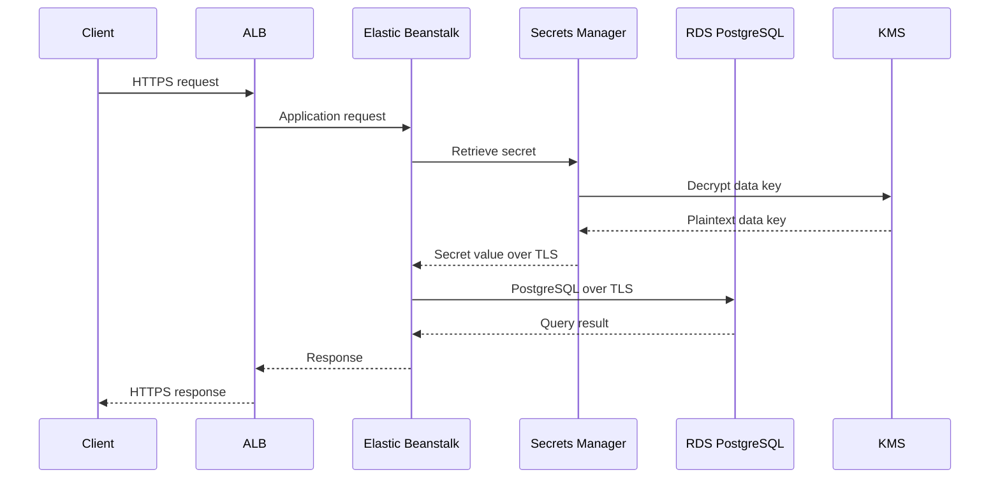
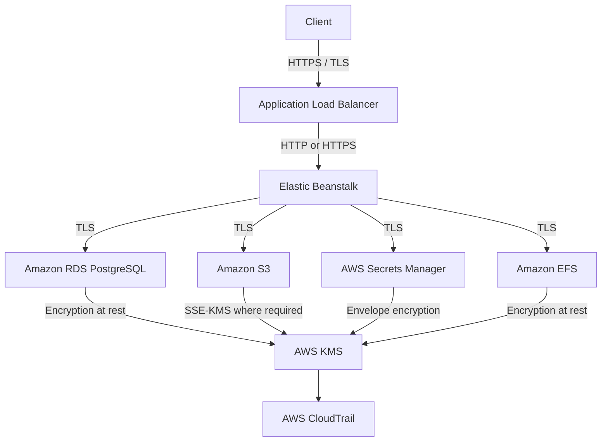

# 05- Encryption and Data Protection

## Overview

Encryption and data protection in AWS Elastic Beanstalk should be designed across the entire application data lifecycle rather than treated as a single Elastic Beanstalk configuration.

A production Elastic Beanstalk application typically handles several categories of data:

- Application source bundles and versions.
- Environment configuration and secrets.
- User and business data.
- Database records and backups.
- Files and object storage.
- Instance storage.
- Application and access logs.
- Data transmitted between clients, load balancers, application instances, databases, and AWS services.

AWS Elastic Beanstalk uses other AWS services for much of its underlying storage and networking. Consequently, encryption requirements must be evaluated at the service boundary where the data is actually stored or transmitted. AWS explicitly separates protection into data in transit and data at rest and recommends using the encryption capabilities of the underlying AWS services. :contentReference[oaicite:0]{index=0}

A useful production model is:

```text
                         Internet
                            │
                            │ HTTPS / TLS
                            ▼
                    Application Load Balancer
                            │
                    ┌───────┴────────┐
                    │                │
                    ▼                ▼
              Elastic Beanstalk    Other AWS APIs
                EC2 instances
                    │
          ┌─────────┼─────────┐
          │         │         │
          ▼         ▼         ▼
         RDS       S3       Secrets Manager
          │         │         │
          └─────────┼─────────┘
                    │
                    ▼
                   KMS
```

The security objective is not simply "encrypt everything." The objective is to ensure that sensitive data is:

- Encrypted during transmission.
- Encrypted while stored.
- Accessible only to authorized identities.
- Protected by appropriately managed encryption keys.
- Not unnecessarily exposed through logs, environment configuration, tags, backups, or application code.
- Recoverable without creating an uncontrolled copy of sensitive information.

## Data Protection Model

Data protection can be divided into several layers.

| Layer | Example | Primary Controls |
|---|---|---|
| Data in transit | Client → ALB | TLS |
| Data in transit | ALB → EC2 | HTTP or HTTPS based on requirements |
| Data in transit | EC2 → RDS | TLS |
| Data at rest | EC2 EBS volumes | EBS encryption |
| Data at rest | RDS | RDS encryption with KMS |
| Data at rest | S3 | SSE-S3 or SSE-KMS |
| Data at rest | EFS | EFS encryption with KMS |
| Secrets | Database passwords, API keys | Secrets Manager / Parameter Store |
| Application-level data | Highly sensitive fields | Application-level encryption |
| Audit data | CloudTrail events | CloudTrail / underlying storage controls |

The correct architecture depends on data classification, compliance requirements, threat model, and operational constraints.

## Shared Responsibility

Encryption does not eliminate the AWS shared responsibility model.

AWS protects the infrastructure underlying its services. The customer remains responsible for appropriate configuration, access control, data classification, key management where applicable, application security, and service-specific security configuration. AWS recommends controls such as TLS, encryption solutions, MFA, and CloudTrail logging for Elastic Beanstalk environments. :contentReference[oaicite:1]{index=1}

A useful distinction is:

```text
AWS responsibility
    │
    ├── Physical infrastructure
    ├── Managed service infrastructure
    └── Underlying service security

Customer responsibility
    │
    ├── IAM
    ├── Security groups
    ├── Encryption configuration
    ├── KMS key policies
    ├── Application security
    ├── Secret management
    └── Data classification
```

Encryption should therefore be part of the architecture rather than an isolated compliance checkbox.

## Encryption at Rest vs Encryption in Transit

### Encryption in Transit

Protects data while it moves between systems.

Examples:

```text
Browser ── HTTPS ──► ALB
EC2 ── TLS ──► RDS
EC2 ── TLS ──► Secrets Manager
EC2 ── TLS ──► S3
```

TLS is the standard mechanism for network encryption.

### Encryption at Rest

Protects stored data.

Examples:

```text
EBS volume ── encrypted
RDS storage ── encrypted
S3 object ── encrypted
EFS filesystem ── encrypted
Secret value ── encrypted
```

These controls solve different problems and should normally be implemented together.

## Elastic Beanstalk Data Storage

Elastic Beanstalk stores application versions and related objects in an S3 bucket that it creates for the AWS Region. AWS states that Elastic Beanstalk retains the default encryption provided by S3 for these buckets. :contentReference[oaicite:2]{index=2}

Conceptually:

```text
Developer
   │
   │ Application bundle
   ▼
Elastic Beanstalk
   │
   ▼
S3
   │
   └── Server-side encryption
```

This protects stored Elastic Beanstalk artifacts at rest.

However, encryption at rest does not make an accidentally committed secret safe.

For example:

```text
requirements.txt       → usually safe
application source     → potentially sensitive
.env with credentials  → security incident
private API key        → security incident
database password      → security incident
```

Encryption should therefore be combined with secret management and source-control hygiene.

## Amazon S3 Encryption

Amazon S3 automatically applies server-side encryption with S3-managed keys (SSE-S3) to new object uploads. AWS also supports SSE-KMS and DSSE-KMS when greater key-management control is required. :contentReference[oaicite:3]{index=3}

The primary options are:

| Encryption | Key Management | Typical Use |
|---|---|---|
| SSE-S3 | AWS-managed by S3 | Standard encryption at rest |
| SSE-KMS | AWS KMS | Greater key-control and audit requirements |
| DSSE-KMS | AWS KMS with dual-layer encryption | Specific high-assurance requirements |
| Client-side encryption | Application/customer | Data encrypted before reaching S3 |

For most Elastic Beanstalk deployments, SSE-S3 provides the baseline storage encryption automatically.

Use SSE-KMS when requirements include:

- Customer-managed key control.
- More granular key permissions.
- Key usage auditing.
- Cross-account key-management requirements.
- Specific compliance requirements.

## S3 Bucket Keys

When using SSE-KMS, S3 Bucket Keys can reduce the number of requests from S3 to AWS KMS and therefore reduce KMS-related request costs. :contentReference[oaicite:4]{index=4}

Conceptually:

```text
S3 Object
   │
   ▼
S3 Bucket Key
   │
   ▼
KMS
```

This is an optimization for SSE-KMS architectures, not a replacement for encryption.

## Elastic Beanstalk Application Versions

Elastic Beanstalk application versions and source bundles are stored in S3.

AWS specifically notes that client-side encryption is not a valid method for protecting source code in Elastic Beanstalk application versions and source bundles because Elastic Beanstalk needs access to these objects. The connection between the deployment environment and Elastic Beanstalk should therefore be secured with TLS. :contentReference[oaicite:5]{index=5}

This means:

```text
Developer
   │
   │ HTTPS
   ▼
AWS API / Elastic Beanstalk
   │
   ▼
Encrypted S3 storage
```

Do not attempt to solve source-bundle security by manually encrypting the entire deployment artifact if Elastic Beanstalk must consume it directly.

Instead:

- Protect the deployment channel with TLS.
- Protect the deployment identity with IAM.
- Keep secrets out of the artifact.
- Use S3 encryption.
- Restrict access to application-version artifacts.

## EBS Encryption

Elastic Beanstalk instances use Amazon EBS volumes for persistent block storage associated with EC2 instances.

AWS recommends enabling EBS encryption by default in the AWS account and Region so that new EBS volumes and snapshots are automatically encrypted. :contentReference[oaicite:6]{index=6}

Architecture:

```text
Elastic Beanstalk EC2
        │
        ▼
    EBS Volume
        │
        ▼
   KMS Encryption
```

EBS encryption also protects snapshots and data transferred between an instance and its attached EBS volume. :contentReference[oaicite:7]{index=7}

## EBS Encryption by Default

A strong account-level baseline is:

```text
AWS Account
   │
   ▼
EBS Encryption by Default
   │
   ├── New EBS volumes → encrypted
   └── New snapshots   → encrypted
```

This reduces the chance that an engineer creates an unencrypted volume accidentally.

The exact KMS key used should be selected according to organizational requirements.

## EBS AWS-Managed vs Customer-Managed KMS Keys

EBS supports AWS KMS keys for encryption.

The default AWS-managed EBS key is:

```text
aws/ebs
```

A customer-managed KMS key provides additional control over permissions, rotation, disabling, and auditing. EBS supports symmetric KMS keys for volume and snapshot encryption. :contentReference[oaicite:8]{index=8}

| Key Type | Control | Operational Burden | Typical Use |
|---|---|---:|---|
| AWS-managed KMS key | Lower | Low | Most standard workloads |
| Customer-managed KMS key | Higher | Higher | Compliance / organizational control |

Do not automatically choose customer-managed keys for every workload. They introduce additional key-policy and lifecycle responsibilities.

## EBS Encryption and Snapshots

Encryption must include the backup lifecycle.

A common mistake is:

```text
Encrypted volume
      │
      ▼
"Backup"
      │
      ▼
Unencrypted copy
```

The backup strategy must preserve the required encryption properties.

For EBS, encrypted volumes produce encrypted snapshots, and the encryption relationship must be considered when copying or sharing snapshots.

## Amazon RDS Encryption

For production databases, database encryption should normally be configured at the RDS layer rather than attempting to implement storage encryption inside Django or FastAPI.

RDS encryption at rest covers database storage, logs, automated backups, read replicas, and snapshots. RDS uses KMS for encryption and supports AWS-managed and customer-managed keys. :contentReference[oaicite:9]{index=9}

Architecture:

```text
Django / FastAPI
       │
       │ TLS
       ▼
      RDS
       │
       ▼
   KMS encryption
       │
       ├── Database storage
       ├── Backups
       ├── Snapshots
       └── Read replicas
```

## RDS Encryption at Rest

A production PostgreSQL deployment might look like:

```text
Elastic Beanstalk
      │
      │ PostgreSQL connection
      ▼
Amazon RDS PostgreSQL
      │
      ├── Encrypted storage
      ├── Encrypted backups
      ├── Encrypted snapshots
      └── KMS key
```

RDS encryption is transparent to normal database clients, so Django and FastAPI generally do not need application-level changes merely because storage encryption is enabled. :contentReference[oaicite:10]{index=10}

## RDS Encryption in Transit

Encryption at rest does not encrypt the network connection.

For sensitive production workloads, use TLS between the application and RDS.

```text
EC2
 │
 │ PostgreSQL + TLS
 ▼
RDS
```

The application should validate the database server certificate according to the database driver's capabilities and organizational requirements.

For example, a PostgreSQL application should use the appropriate CA certificate and SSL mode rather than simply disabling certificate validation.

Conceptually:

```text
sslmode = verify-full
```

is substantially stronger than:

```text
sslmode = disable
```

or configurations that encrypt traffic without validating the server identity.

## RDS Encryption Constraints

Encryption decisions should be made when the database is created.

For example, RDS encryption at rest cannot simply be switched off after enabling it. AWS documents migration through an encrypted snapshot or a new encrypted DB instance when converting an existing unencrypted database to an encrypted configuration. :contentReference[oaicite:11]{index=11}

This makes encryption a provisioning concern.

Prefer:

```text
Infrastructure as Code
        │
        ▼
Encrypted RDS
```

rather than:

```text
Create unencrypted RDS
        │
        ▼
Production data
        │
        ▼
"Let's encrypt it later"
```

## Coupled vs Decoupled RDS

Elastic Beanstalk can create a database coupled to an environment, but production architectures commonly decouple the database lifecycle from the application environment.

AWS supports using an externally managed RDS instance with Elastic Beanstalk and allows multiple environments to connect to a database. :contentReference[oaicite:12]{index=12}

A more resilient architecture is:

```text
Elastic Beanstalk Environment
        │
        │
        ▼
External RDS PostgreSQL
        │
        ├── Encryption
        ├── Backups
        ├── Monitoring
        └── Independent lifecycle
```

This prevents application-environment replacement from unnecessarily coupling the database lifecycle to the application deployment lifecycle.

## Secrets and Encryption

Database passwords, API keys, OAuth credentials, and third-party credentials should not be embedded directly in:

- Git repositories.
- Docker images.
- Source bundles.
- `.ebextensions` files.
- CI logs.
- Shell scripts.
- AMIs.
- Plain-text documentation.

Elastic Beanstalk integrates with AWS Secrets Manager and Systems Manager Parameter Store and can expose stored values to applications through environment variables. :contentReference[oaicite:13]{index=13}

A production pattern is:

```text
Secrets Manager
      │
      │ encrypted secret
      ▼
Elastic Beanstalk
      │
      ▼
Application environment
      │
      ▼
Django / FastAPI
```

## Secrets Manager Encryption

Secrets Manager uses envelope encryption with AWS KMS.

The high-level process is:

```text
Secret value
     │
     ▼
Generate data key
     │
     ▼
Encrypt secret with data key
     │
     ▼
Encrypt data key with KMS key
     │
     ▼
Store encrypted secret + encrypted data key
```

AWS documents that Secrets Manager does not directly encrypt the secret value with the KMS key. Instead, a data key encrypts the secret and the KMS key protects that data key. :contentReference[oaicite:14]{index=14}

This is an example of **envelope encryption**.

## Envelope Encryption

Envelope encryption separates data encryption from master-key management.

Conceptually:

```text
                KMS Key
                   │
                   ▼
             Encrypt Data Key
                   │
                   ▼
Data ──► Data Key ──► Ciphertext
```

The KMS key does not need to process every byte of application data.

Instead:

1. A data key is generated.
2. The data key encrypts the data.
3. The data key is encrypted by a KMS key.
4. The encrypted data key is stored with the ciphertext.
5. Decryption reverses the process.

This pattern is widely used by AWS managed services.

## AWS-Managed vs Customer-Managed KMS Keys

AWS provides different levels of KMS key control.

| Key | Management | Control | Typical Use |
|---|---|---|---|
| AWS-owned key | AWS | Lowest | Service internals |
| AWS-managed key | AWS service | Limited | Standard service encryption |
| Customer-managed key | Customer | Highest | Compliance / custom policies |

Customer-managed keys are useful when you need:

- Custom key policies.
- More granular authorization.
- Explicit key lifecycle management.
- Cross-account access.
- Stronger audit controls.

They also create operational responsibilities.

## KMS Key Policy

A KMS key is not simply another IAM resource.

Access can depend on both:

```text
IAM Policy
     +
KMS Key Policy
     +
Service Grants / Conditions
```

A common production failure is:

```text
IAM says Allow
        │
        ▼
KMS key policy says Deny / does not permit access
        │
        ▼
KMS AccessDenied
```

When using customer-managed KMS keys, verify both identity-based permissions and the KMS key policy.

## KMS `kms:ViaService`

For some service integrations, KMS policies can restrict key usage to requests made through a particular AWS service.

For example, Secrets Manager can use the `kms:ViaService` condition to constrain KMS usage to Secrets Manager. AWS documents this as a way to restrict customer-managed keys to requests originating from Secrets Manager. :contentReference[oaicite:15]{index=15}

Conceptually:

```text
Application
    │
    ▼
Secrets Manager
    │
    ▼
KMS
```

rather than allowing arbitrary principals to call the KMS key directly.

## Secret Rotation

Encryption protects a secret if storage is compromised, but it does not solve credential compromise.

For example:

```text
Encrypted password
       │
       ▼
Attacker obtains plaintext through application compromise
       │
       ▼
Credential still usable
```

Therefore, sensitive credentials should also be rotated.

A production secret lifecycle is:

```text
Create
  │
  ▼
Store encrypted
  │
  ▼
Consume
  │
  ▼
Rotate
  │
  ▼
Validate
  │
  ▼
Retire old credential
```

When Elastic Beanstalk fetches Secrets Manager or Parameter Store values into environment variables, updates to the underlying secret do not automatically update the already-populated environment variables. AWS documents that the environment variables must be manually refreshed after secret or parameter changes. :contentReference[oaicite:16]{index=16}

This is an important operational consideration for secret rotation.

## Environment Variables

Environment variables are convenient but should not be treated as a secret-management system by themselves.

Elastic Beanstalk supports plain-text environment properties as well as values sourced from Secrets Manager and Systems Manager Parameter Store. :contentReference[oaicite:17]{index=17}

Prefer:

```text
Secrets Manager
      │
      ▼
Elastic Beanstalk secret reference
      │
      ▼
Application
```

over:

```text
Git
 │
 ▼
.env
 │
 ▼
Elastic Beanstalk plain-text environment variable
```

The latter creates unnecessary secret exposure during source-control, deployment, and configuration management.

## Secret Exposure Through Logs

A frequent encryption mistake is focusing on storage while leaking the plaintext elsewhere.

Bad:

```python
logger.info("DATABASE_PASSWORD=%s", password)
```

Also dangerous:

```python
logger.info("Authorization header: %s", request.headers.get("Authorization"))
```

The secret may now exist in:

```text
Application logs
      │
      ▼
CloudWatch Logs
      │
      ▼
Log exports / archives
      │
      ▼
Additional copies
```

Once a secret enters a log pipeline, encrypting the log destination does not prevent the application from having disclosed the secret.

## Application-Level Encryption

Infrastructure-level encryption is not always sufficient.

Suppose a PostgreSQL table contains:

```text
customer
-----------------------------
id
name
email
phone
national_id
```

RDS encryption protects the database storage.

But if the database is compromised through valid application credentials, the attacker may still obtain plaintext values.

For highly sensitive fields, application-level encryption can provide another layer:

```text
Django / FastAPI
      │
      ▼
Encrypt sensitive field
      │
      ▼
PostgreSQL
      │
      ▼
Encrypted ciphertext
```

This can be appropriate for:

- Government identifiers.
- Highly sensitive personal information.
- Certain financial data.
- Application-specific secrets.

It should not be introduced casually because it affects:

- Searching.
- Indexing.
- Sorting.
- Database constraints.
- Key rotation.
- Data migration.
- Application performance.

## Field-Level Encryption Tradeoff

| Requirement | Infrastructure Encryption | Field-Level Encryption |
|---|---:|---:|
| Protect stolen disk | Yes | Yes |
| Protect database backups | Yes | Yes |
| Protect DB files | Yes | Yes |
| Hide values from DB administrators | Usually no | Potentially |
| Search plaintext field | Yes | More difficult |
| Operational complexity | Low | High |
| Application changes | Minimal | Significant |

Use the stronger control only where the threat model requires it.

## Application Data Flow

A production Django API might use:



The important point is that encryption exists at multiple boundaries rather than at a single point.

## Encryption Does Not Replace Access Control

Encryption and authorization solve different problems.

```text
Encryption
    │
    └── Protects data confidentiality

IAM
    │
    └── Controls AWS resource access

Application Authorization
    │
    └── Controls business access

Network Controls
    │
    └── Controls connectivity
```

For example, an encrypted S3 object can still be exposed if an IAM policy grants excessive `s3:GetObject` permissions.

Similarly, an encrypted RDS database can still be accessed by a compromised application role.

## Key Management Lifecycle

A production KMS key should have a defined lifecycle.

```text
Create
  │
  ▼
Authorize
  │
  ▼
Use
  │
  ▼
Monitor
  │
  ▼
Rotate
  │
  ▼
Retire
  │
  ▼
Schedule deletion
```

Key deletion is especially sensitive.

A KMS key that protects production data should not be deleted merely because it appears unused.

## KMS Key Availability and Recovery

Encryption introduces a dependency on key availability and authorization.

For example:

```text
RDS
 │
 ▼
KMS key unavailable / inaccessible
 │
 ▼
Database access problem
```

AWS documents that if RDS loses access to its KMS key, an encrypted DB instance can enter an inaccessible encryption-credentials state. :contentReference[oaicite:18]{index=18}

Therefore:

- Protect KMS key policies.
- Avoid accidental key disabling.
- Monitor key state.
- Control who can administer keys.
- Include KMS dependencies in disaster-recovery planning.

## Key Rotation

Automatic key rotation is useful for customer-managed KMS keys when supported and appropriate.

Rotation does not mean that previously encrypted data suddenly becomes unreadable. AWS KMS manages key material and maintains the ability to decrypt data encrypted under previous key material according to the service's key-management model.

The important operational distinction is:

```text
Key rotation
     ≠
Re-encrypt every application record immediately
```

Do not design a system assuming that rotating a KMS key automatically rewrites every existing application object.

## Encryption and Backups

Backups are part of the data lifecycle.

A production architecture should consider:

```text
Primary data
    │
    ├── Database backups
    ├── Snapshots
    ├── S3 replicas
    ├── Export files
    └── Disaster recovery copies
```

Every copy may contain the same sensitive information as the primary system.

A secure backup strategy therefore includes:

- Encryption.
- Access control.
- Retention policies.
- Cross-account protection where appropriate.
- Cross-Region protection where required.
- Restore testing.
- Key lifecycle planning.

RDS encryption at rest covers automated backups, snapshots, and read replicas associated with encrypted instances. :contentReference[oaicite:19]{index=19}

## Disaster Recovery and KMS

Cross-Region disaster recovery introduces additional key-management considerations.

For example:

```text
Primary Region
    │
    ├── RDS
    └── KMS Key A
          │
          │ Replication / backup
          ▼
Secondary Region
    │
    ├── RDS
    └── KMS Key B
```

KMS keys are Region-specific resources.

When encrypted data is replicated across Regions, the destination architecture must account for the KMS key available in the destination Region.

For RDS cross-Region encrypted replicas, AWS documents that the replica uses a KMS key in the destination Region. :contentReference[oaicite:20]{index=20}

## EFS Encryption

If an Elastic Beanstalk architecture uses Amazon EFS for shared filesystem storage, EFS supports encryption at rest.

EFS encrypts file data and metadata at rest and can use an AWS-owned key or customer-managed KMS key. :contentReference[oaicite:21]{index=21}

Architecture:

```text
Elastic Beanstalk instances
       │
       ▼
     EFS
       │
       ▼
      KMS
```

EFS encryption should be enabled when the filesystem contains sensitive information.

AWS documents that EFS encryption cannot simply be enabled on an existing unencrypted filesystem; migration to a new encrypted filesystem is required. :contentReference[oaicite:22]{index=22}

## Encryption and File Uploads

Consider a Django or FastAPI application accepting customer documents.

A secure architecture might be:

```text
Client
  │
  │ HTTPS
  ▼
ALB
  │
  ▼
Elastic Beanstalk
  │
  │ Authenticated S3 request
  ▼
S3
  │
  └── SSE-KMS
```

For particularly sensitive documents, client-side encryption may also be appropriate:

```text
Client
  │
  │ Encrypt
  ▼
Ciphertext
  │
  │ HTTPS
  ▼
S3
```

This provides a stronger boundary because the plaintext document does not need to reach the storage service.

Client-side encryption introduces substantially more application complexity and should be used when the threat model requires it.

## Data Classification

Encryption architecture should begin with data classification.

A practical model is:

| Classification | Examples | Typical Protection |
|---|---|---|
| Public | Public API documentation | TLS in transit |
| Internal | Application configuration | TLS + access control |
| Confidential | Business data | TLS + encryption at rest |
| Sensitive | Credentials, PII | TLS + encryption at rest + secret management |
| Highly sensitive | Financial / regulated identifiers | Strong access control + encryption + potentially field-level encryption |

The classification determines the appropriate controls.

Do not apply the same operational model to a public README and a database credential.

## Sensitive Data in Tags and Names

Encryption does not protect data that was never supposed to be there.

AWS explicitly recommends not placing confidential or sensitive information such as customer email addresses into tags or free-form fields such as resource names because such information can appear in billing or diagnostic logs. :contentReference[oaicite:23]{index=23}

Bad:

```text
Environment Name:
production-customer-john@example.com
```

Better:

```text
Environment Name:
production-api
```

Use identifiers rather than sensitive values.

## Encryption and CI/CD

CI/CD systems are another major data-protection boundary.

A deployment pipeline might look like:

```text
GitHub Actions
      │
      │ OIDC / temporary AWS credentials
      ▼
AWS
      │
      ▼
Elastic Beanstalk
```

Avoid:

```text
GitHub Secrets
      │
      ▼
Hardcoded AWS access key
      │
      ▼
Deployment artifact
```

Prefer short-lived credentials and least-privilege deployment roles.

Secrets required during deployment should be retrieved only when needed and should not be written to build logs or artifacts.

## Encryption and Docker

If Elastic Beanstalk is running Docker workloads, encryption still applies to the underlying AWS resources.

Do not assume:

```text
Docker image
   │
   └── "Encrypted"
```

means application data is protected.

You must separately consider:

- Image registry encryption.
- Image transport.
- EBS encryption.
- S3 encryption.
- Secrets.
- Database encryption.
- Network TLS.

Containerization changes the deployment model, not the fundamental data-protection requirements.

## Encryption and Redis

If Redis is used as a cache:

```text
Django / FastAPI
      │
      ▼
Redis
```

consider both:

- Encryption in transit.
- Encryption at rest where supported and required by the selected Redis service/configuration.

Do not store highly sensitive information in a cache merely because the cache is private.

A private subnet is a network control, not an encryption mechanism.

## Encryption and Kafka

For Kafka-based architectures:

```text
Producer
   │
   │ TLS
   ▼
Kafka
   │
   │ TLS
   ▼
Consumer
```

Kafka data may also require encryption at rest depending on the managed Kafka service and configuration.

For sensitive event streams, consider:

- TLS.
- Authentication.
- Authorization.
- Broker/storage encryption.
- Topic-level access control.
- Retention.
- Backup/export copies.

Encryption should cover the complete event lifecycle.

## Monitoring Encryption

Encryption should be observable.

Useful controls include:

- AWS Config rules for encrypted resources.
- CloudTrail KMS activity.
- CloudTrail configuration changes.
- S3 encryption configuration.
- RDS encryption status.
- EBS encryption-by-default status.
- Secrets Manager access.
- KMS key state changes.
- Security Hub findings where applicable.

The objective is to detect drift.

```text
Infrastructure as Code
        │
        ▼
Expected encryption
        │
        ▼
Actual AWS configuration
        │
        ▼
Drift detection
```

## CloudTrail and KMS

KMS activity should be auditable.

For customer-managed keys, CloudTrail can be used to inspect KMS operations and determine which identities and services are interacting with encryption keys.

This is useful when investigating:

```text
Who used the key?
When?
From which service?
For which resource?
Was the operation expected?
```

KMS logging is particularly valuable for compliance and incident response.

## Encryption Cost

Encryption is not always free.

SSE-S3 provides baseline S3 encryption without an additional encryption charge. SSE-KMS introduces KMS request and key-management costs. S3 Bucket Keys can reduce KMS request volume for SSE-KMS workloads. :contentReference[oaicite:24]{index=24}

Customer-managed KMS keys also introduce key-management considerations and potentially additional costs.

Cost analysis should therefore consider:

```text
Data volume
+
Request volume
+
KMS operations
+
Number of keys
+
Cross-Region replication
+
Backup copies
```

Do not optimize away encryption to save small infrastructure costs.

## Performance Considerations

Managed encryption is generally designed to minimize application impact.

For example:

```text
Django
   │
   ▼
RDS encrypted storage
```

does not require Django to manually encrypt every database page.

Similarly:

```text
Application
   │
   ▼
S3
   │
   ▼
SSE-KMS
```

allows S3 to manage object encryption.

Application-level encryption is different because encryption and decryption happen inside the application and can introduce:

- CPU overhead.
- Larger payloads.
- Additional latency.
- Key-management calls.
- More complicated indexing.

Use application-level encryption selectively.

## Common Mistakes

### Hardcoding Secrets

Bad:

```python
DATABASE_PASSWORD = "super-secret-password"
```

Use Secrets Manager or another appropriate secret-management mechanism.

### Storing `.env` in Git

Bad:

```text
.env
```

containing:

```text
DATABASE_PASSWORD=...
AWS_SECRET_ACCESS_KEY=...
```

Use:

```text
.env.example
```

for non-secret configuration and store actual secrets in an appropriate secret-management system.

### Assuming Private Subnets Encrypt Data

A private subnet controls network exposure.

It does not encrypt stored data.

You still need:

```text
Private subnet
+
TLS
+
Encryption at rest
+
IAM
```

as appropriate.

### Encrypting RDS but Not Backups

Backups are part of the data lifecycle.

Ensure that the backup and snapshot architecture preserves the required encryption controls.

### Using Customer-Managed KMS Keys Without Planning Recovery

A customer-managed key provides greater control but also creates a greater blast radius if the key is disabled, deleted, or inaccessible.

Key lifecycle must be part of disaster recovery.

### Logging Secrets

Never log:

```text
Passwords
API keys
Bearer tokens
Private keys
Session cookies
Database credentials
```

Encrypted log storage does not make plaintext secrets in logs acceptable.

### Rotating a Secret Without Refreshing Elastic Beanstalk

If Elastic Beanstalk loads a secret into an environment variable, rotating the source secret does not automatically update the already-populated environment variable. AWS requires the environment variables to be refreshed after the source secret or parameter changes. :contentReference[oaicite:25]{index=25}

### Assuming Encryption Provides Authorization

This is incorrect:

```text
Encrypted database
      │
      ▼
Anyone with application credentials
      │
      ▼
Allowed to query everything
```

Encryption must be combined with least-privilege access control.

### Putting Sensitive Data in Resource Names

Avoid putting:

```text
email addresses
customer IDs
account numbers
credentials
```

into tags, environment names, or free-form metadata. AWS specifically warns that such values can appear in billing or diagnostic logs. :contentReference[oaicite:26]{index=26}

## Production Architecture

A strong production Elastic Beanstalk data-protection architecture can look like:



The exact architecture should be adapted to the application's data sensitivity and compliance requirements.

## Recommended Production Baseline

| Area | Recommended Baseline |
|---|---|
| Client traffic | HTTPS |
| ALB | TLS listener on 443 |
| EBS | Encryption by default |
| RDS | Encryption at rest |
| RDS connections | TLS for sensitive workloads |
| S3 | Default server-side encryption |
| Sensitive S3 data | SSE-KMS where required |
| Secrets | Secrets Manager / Parameter Store |
| Secret values | Never hardcode |
| KMS | Least-privilege access |
| Logs | Never contain secrets |
| Backups | Encrypted and access-controlled |
| CI/CD | Short-lived credentials |
| Monitoring | CloudTrail + configuration monitoring |
| Disaster recovery | Include encryption keys and permissions |
| Application-level encryption | Only for data requiring stronger isolation |

## Security Review Checklist

### Data in Transit

- [ ] Public traffic uses HTTPS.
- [ ] TLS policies use current secure protocols.
- [ ] Database connections use TLS where required.
- [ ] AWS service API communication uses HTTPS.
- [ ] Internal service encryption requirements are documented.
- [ ] Certificates are monitored and renewed.

### Data at Rest

- [ ] EBS encryption by default is enabled.
- [ ] RDS encryption is enabled.
- [ ] S3 encryption is enabled.
- [ ] EFS encryption is enabled where EFS is used.
- [ ] Backups are encrypted.
- [ ] Snapshots are encrypted.
- [ ] Replicated data remains protected.

### Secrets

- [ ] No credentials are committed to Git.
- [ ] Secrets Manager or Parameter Store is used appropriately.
- [ ] Secret access uses least privilege.
- [ ] Secret rotation is implemented where required.
- [ ] Elastic Beanstalk secret refresh behavior is understood.
- [ ] Secrets never appear in application logs.

### KMS

- [ ] KMS key ownership is documented.
- [ ] Key policies are least privilege.
- [ ] Customer-managed keys are used only when their additional control is justified.
- [ ] Key state is monitored.
- [ ] Key rotation requirements are documented.
- [ ] Key deletion is tightly controlled.
- [ ] Disaster recovery includes required keys and permissions.

### Application

- [ ] Highly sensitive fields are identified.
- [ ] Application-level encryption is used where justified.
- [ ] Encryption keys are never embedded in source code.
- [ ] Django/FastAPI configuration does not leak secrets.
- [ ] Sensitive request data is not logged.
- [ ] Authentication and authorization are independent of encryption.

## Interview Perspective

### Does Elastic Beanstalk encrypt data at rest?

Elastic Beanstalk uses encryption capabilities of underlying AWS services. Its service-managed S3 bucket retains S3 default encryption, while EBS volumes should be encrypted through EBS encryption configuration. Databases, EFS, and other storage services must be evaluated according to their own encryption mechanisms. :contentReference[oaicite:27]{index=27}

### Does encryption protect data in transit?

Only if encryption is actually configured on the connection.

For example:

```text
HTTPS
  └── Encrypted

HTTP
  └── Not encrypted
```

Similarly, an ALB HTTPS listener does not automatically mean the ALB-to-instance connection uses HTTPS.

### What is envelope encryption?

Envelope encryption uses a data key to encrypt the actual data and a KMS key to encrypt the data key.

```text
KMS Key
   │
   ▼
Encrypted Data Key
   │
   ▼
Data Key ──► Encrypted Data
```

AWS Secrets Manager uses this model. :contentReference[oaicite:28]{index=28}

### Why use KMS instead of manually managing encryption keys?

KMS provides managed cryptographic key infrastructure, access control integration, auditing, and lifecycle capabilities.

It also integrates directly with AWS services such as RDS, EBS, S3, and Secrets Manager.

### When should I use a customer-managed KMS key?

Use one when you need additional control such as:

- Custom key policies.
- Fine-grained key authorization.
- Cross-account access.
- Stronger audit requirements.
- Explicit organizational key-management requirements.

Do not use one automatically for every resource without considering the operational burden.

### What happens if a KMS key is disabled?

Resources depending on that key may become inaccessible for encryption or decryption operations.

This is why KMS key state is part of disaster recovery planning.

### Does RDS encryption require Django changes?

Encryption at rest generally does not require Django to change how it stores database records. RDS handles storage encryption transparently. Network TLS is a separate concern and may require appropriate database-driver configuration. :contentReference[oaicite:29]{index=29}

### Why is application-level encryption sometimes necessary?

Infrastructure encryption protects storage and transport, but it may not protect sensitive values from an authorized database reader.

Field-level encryption can provide an additional security boundary when the threat model requires it.

### Should every database field be encrypted at the application level?

No.

It introduces complexity around:

- Searching.
- Indexing.
- Key rotation.
- Performance.
- Migrations.
- Debugging.

Use it selectively for genuinely sensitive fields.

### Why is a private subnet not enough?

A private subnet reduces Internet exposure but does not itself encrypt data.

A production design should separately consider:

```text
Network isolation
+
TLS
+
Encryption at rest
+
IAM
+
Application authorization
```

### What happens when a Secrets Manager secret is rotated?

If Elastic Beanstalk has loaded the secret into environment variables, the existing environment variables do not automatically refresh. The environment must be refreshed according to the Elastic Beanstalk secret integration behavior. :contentReference[oaicite:30]{index=30}

### Should secrets be stored directly as Elastic Beanstalk environment variables?

Plain-text environment properties should not be the preferred secret-management mechanism.

Prefer references to Secrets Manager or Systems Manager Parameter Store, with IAM permissions restricting access. Elastic Beanstalk supports both mechanisms for environment variables. :contentReference[oaicite:31]{index=31}

### What is the difference between encryption and access control?

Encryption protects data from unauthorized reading when the ciphertext is obtained.

Access control determines who can obtain or operate on the data in the first place.

A secure system needs both.

### How would you secure a production Django application running on Elastic Beanstalk?

A practical architecture would be:

```text
Internet
   │
   │ HTTPS
   ▼
ALB
   │
   │ HTTP or HTTPS based on requirements
   ▼
Elastic Beanstalk
   │
   ├── Secrets Manager
   │      └── KMS
   │
   ├── RDS PostgreSQL
   │      └── KMS + TLS
   │
   ├── S3
   │      └── SSE-S3 / SSE-KMS
   │
   └── EBS
          └── KMS
```

Then add:

- Least-privilege IAM.
- Security groups.
- Secure cookies.
- HSTS where appropriate.
- CloudTrail.
- Encryption monitoring.
- Backup encryption.
- Key lifecycle controls.
- Secret rotation.
- Application-level encryption for selected highly sensitive fields.

## Key Takeaways

- Encryption should be designed across the complete data lifecycle rather than treated as a single Elastic Beanstalk setting.
- Protect data both **in transit** and **at rest**.
- Elastic Beanstalk relies on the encryption capabilities of underlying AWS services such as S3, EBS, RDS, and EFS.
- Elastic Beanstalk's service-managed S3 storage uses S3's default server-side encryption.
- S3 now automatically encrypts new objects with SSE-S3 by default; SSE-KMS is appropriate when additional key-management control is required. :contentReference[oaicite:32]{index=32}
- Enable EBS encryption by default so newly created volumes and snapshots are protected.
- RDS encryption protects database storage, backups, read replicas, and snapshots.
- RDS encryption at rest does not replace TLS for database connections.
- Secrets should be stored in Secrets Manager or Parameter Store rather than source code or deployment artifacts.
- Secrets Manager uses envelope encryption with AWS KMS.
- Customer-managed KMS keys provide greater control but also introduce additional operational responsibilities.
- KMS key policies, IAM permissions, service grants, and key state must all be considered when troubleshooting encrypted resources.
- Secret rotation and environment-variable refresh are separate operational concerns in Elastic Beanstalk.
- Encryption does not replace IAM, network isolation, authentication, authorization, or application security.
- Application-level encryption is useful for selected highly sensitive fields but introduces substantial application complexity.
- Backups, snapshots, replicas, exports, and disaster-recovery copies must be included in the encryption strategy.
- KMS keys are critical production dependencies and must be included in disaster-recovery planning.
- Never log passwords, API keys, bearer tokens, private keys, or other sensitive credentials.
- Do not place sensitive information in AWS resource names, tags, or free-form metadata.
- The strongest production architecture combines encryption, least-privilege access, network controls, secret management, monitoring, and controlled key lifecycle management.