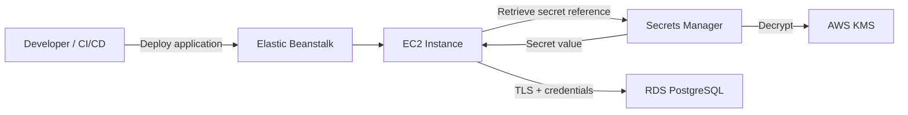
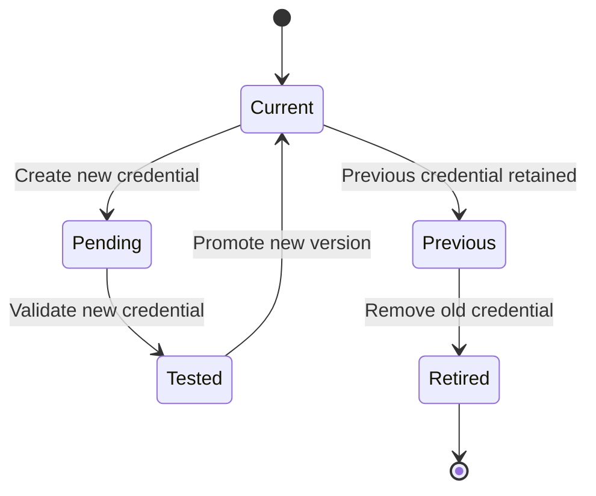
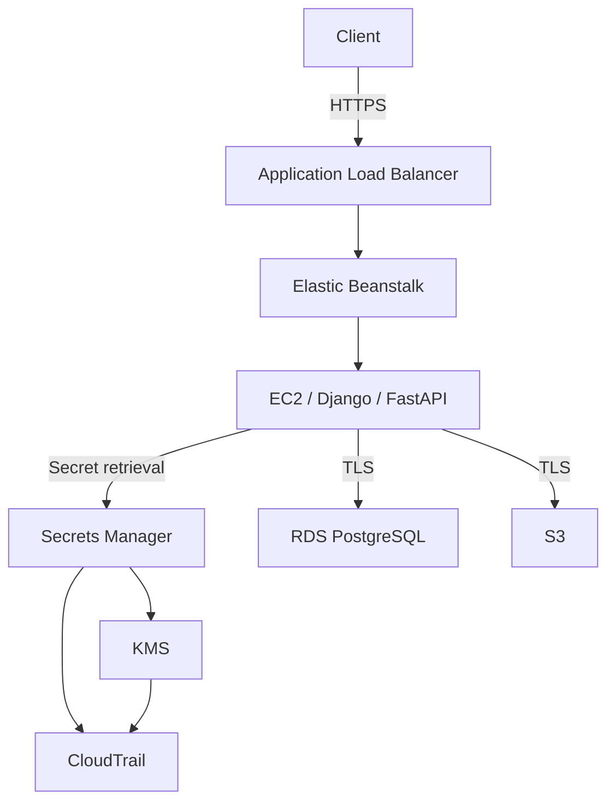

# 06- Secrets Management

## Overview

Secrets management is the practice of securely storing, accessing, rotating, auditing, and revoking sensitive application values such as:

- Database credentials
- API keys
- OAuth client secrets
- Third-party service credentials
- Signing keys
- Private tokens
- Encryption-related configuration
- Application credentials

In an AWS Elastic Beanstalk environment, secrets should not be treated as ordinary configuration.

A production architecture should separate:

```text
Application Configuration
        │
        ├── Non-sensitive
        │      └── Environment variables
        │
        └── Sensitive
               └── Secrets Manager / Parameter Store
```

AWS Elastic Beanstalk can natively reference AWS Secrets Manager and Systems Manager Parameter Store values from environment variables. This integration was introduced in March 2025 and removes the requirement for the application to make an explicit Secrets Manager or Parameter Store API call when using this mechanism. :contentReference[oaicite:0]{index=0}

A typical production architecture is:



The fundamental objective is:

> Secrets should exist only where they are required, for only as long as required, and should be accessible only by identities that need them.

## Why Secrets Management Matters

Hardcoding a credential creates a long-lived security problem.

Bad:

```python
DATABASE_PASSWORD = "production-password"
```

The credential can spread into:

```text
Git repository
   │
   ├── Git history
   ├── Pull requests
   ├── CI/CD artifacts
   ├── Developer machines
   ├── Application bundles
   └── Backups
```

Even deleting the value from the latest commit does not necessarily remove it from Git history or other copies.

A centralized secret-management system instead provides:

```text
Secret
  │
  ├── Central storage
  ├── Encryption
  ├── IAM authorization
  ├── Rotation
  ├── Auditing
  └── Controlled retrieval
```

AWS recommends storing credentials and other sensitive information in Secrets Manager rather than hardcoding them in application code. :contentReference[oaicite:1]{index=1}

## Secrets vs Configuration

Not every environment variable is a secret.

| Value | Classification | Typical Storage |
|---|---|---|
| `DEBUG=false` | Configuration | Environment variable |
| `LOG_LEVEL=INFO` | Configuration | Environment variable |
| `AWS_REGION=ap-south-1` | Configuration | Environment variable |
| `DATABASE_HOST` | Usually configuration | Environment variable / Parameter Store |
| `DATABASE_PASSWORD` | Secret | Secrets Manager |
| `API_KEY` | Secret | Secrets Manager |
| `JWT_SIGNING_KEY` | Secret | Secrets Manager |
| OAuth client secret | Secret | Secrets Manager |
| Encryption private key | Highly sensitive secret | Secrets Manager / dedicated key management |

The distinction matters because secrets require stronger lifecycle controls than ordinary configuration.

## Secrets Manager vs Parameter Store

AWS provides both Secrets Manager and Systems Manager Parameter Store.

| Capability | Secrets Manager | Parameter Store |
|---|---|---|
| Secret storage | Yes | Yes |
| SecureString | N/A | Yes |
| Encryption | KMS | KMS for SecureString |
| Automatic secret rotation | Strong native support | More limited / automation-dependent |
| Secret lifecycle | Strong | General configuration focus |
| Database credential rotation | Supported | Usually custom automation |
| Secret replication | Supported | Different mechanisms |
| Typical use | Credentials and secrets | Configuration + parameters |
| Cost | Paid service | Includes standard parameters; advanced features may incur charges |

For credentials that require lifecycle management and rotation, Secrets Manager is generally the stronger default.

For ordinary configuration and parameters, Parameter Store can be appropriate.

## AWS Secrets Manager

AWS Secrets Manager is a managed service for storing, retrieving, and rotating secrets.

It can manage:

- Database credentials
- Application credentials
- OAuth tokens
- API keys
- Other sensitive values

Secrets are encrypted at rest and retrieved securely over TLS. :contentReference[oaicite:2]{index=2}

Conceptually:

```text
Application
     │
     │ Request secret
     ▼
Secrets Manager
     │
     │ Decrypt / authorize
     ▼
Secret value
     │
     │ TLS
     ▼
Application
```

## Secret Structure

A secret can contain a simple value:

```text
production/api-key
```

or structured JSON:

```json
{
  "username": "application_user",
  "password": "REDACTED",
  "host": "database.example.internal",
  "port": 5432,
  "database": "application"
}
```

Structured secrets are useful when multiple related values form one credential set.

For database credentials, a structured secret can be easier to rotate and consume consistently.

## Secret Naming

Use predictable, non-sensitive names.

Good:

```text
production/api/database
production/api/stripe
production/api/oauth
```

Avoid putting secret values or sensitive personal information into secret names or tags.

For example, do not use:

```text
production/customer-john@example.com-password
```

AWS explicitly warns that sensitive information should not be stored in secret tags because tags are not encrypted. :contentReference[oaicite:3]{index=3}

## Secret Versioning

Secrets Manager maintains versions of secret values.

Conceptually:

```text
Secret
 │
 ├── Version A → Previous
 │
 ├── Version B → Current
 │
 └── Version C → Pending rotation
```

Version stages can be used during rotation workflows.

This allows applications and rotation mechanisms to coordinate credential changes without treating a secret as an immutable string.

## Elastic Beanstalk Secret Integration

Elastic Beanstalk can reference Secrets Manager or Parameter Store values directly from environment configuration.

Conceptually:

```text
Elastic Beanstalk Environment
          │
          │ Secret ARN / Parameter ARN
          ▼
Secrets Manager / Parameter Store
          │
          ▼
Environment Variable
          │
          ▼
Django / FastAPI
```

The application can then read the resulting environment variable normally.

AWS documents that Elastic Beanstalk retrieves these values during instance bootstrapping and assigns them to environment variables. :contentReference[oaicite:4]{index=4}

## Why Native Integration Is Useful

Without native integration:

```text
Application
    │
    ├── AWS credentials
    ├── Secrets Manager SDK
    ├── API call
    ├── Error handling
    └── Secret caching
```

With Elastic Beanstalk's environment-variable integration:

```text
Elastic Beanstalk
       │
       ▼
Secrets Manager
       │
       ▼
Environment Variable
       │
       ▼
Application
```

This can simplify application code.

However, it does not eliminate the need for IAM, rotation planning, refresh behavior, or secret-access monitoring.

## Elastic Beanstalk IAM Requirements

The EC2 instances in an Elastic Beanstalk environment use an IAM instance profile.

That role needs permission to retrieve the referenced secret or parameter.

A production design should follow:

```text
Elastic Beanstalk EC2 Role
          │
          ├── Read secret A
          └── Read parameter B
```

rather than:

```text
Elastic Beanstalk EC2 Role
          │
          └── Read every secret in the account
```

Least privilege should be applied to both the secret and the KMS key when customer-managed encryption keys are used.

## Example IAM Policy

A narrowly scoped policy can allow retrieval of one specific secret:

```json
{
  "Version": "2012-10-17",
  "Statement": [
    {
      "Sid": "ReadApplicationDatabaseSecret",
      "Effect": "Allow",
      "Action": [
        "secretsmanager:GetSecretValue"
      ],
      "Resource": "arn:aws:secretsmanager:ap-south-1:123456789012:secret:production/api/database-EXAMPLE"
    }
  ]
}
```

Avoid granting:

```json
{
  "Action": "secretsmanager:*",
  "Resource": "*"
}
```

to an application role.

AWS recommends least-privilege access to secrets using IAM policies and, where appropriate, resource-based policies. :contentReference[oaicite:5]{index=5}

## KMS Permissions

Secrets Manager encrypts secrets using AWS KMS.

The AWS-managed key:

```text
aws/secretsmanager
```

is sufficient for many workloads.

A customer-managed KMS key becomes useful when additional control is required, such as:

- Custom key policies
- Cross-account access
- Explicit key administration
- More granular auditing
- Organizational compliance requirements

AWS recommends the AWS-managed `aws/secretsmanager` key for most use cases and customer-managed keys when additional control is needed. :contentReference[oaicite:6]{index=6}

## Customer-Managed KMS Keys

Using a customer-managed key introduces another authorization layer:

```text
Application IAM Policy
        │
        ▼
Secrets Manager
        │
        ▼
KMS Key Policy
        │
        ▼
KMS Decrypt
```

A correct Secrets Manager permission does not automatically guarantee that every custom KMS configuration will work.

AWS recommends carefully designing IAM policies, KMS key policies, grants, and related endpoint policies when protecting KMS keys. :contentReference[oaicite:7]{index=7}

## `kms:ViaService`

When using a customer-managed KMS key with Secrets Manager, a key policy can restrict KMS usage to requests originating through Secrets Manager.

Conceptually:

```text
Application
    │
    ▼
Secrets Manager
    │
    │ kms:ViaService
    ▼
KMS
```

This is stronger than allowing arbitrary principals to use the KMS key directly.

AWS documents `kms:ViaService` as a control for limiting KMS usage to Secrets Manager requests. :contentReference[oaicite:8]{index=8}

## Runtime Retrieval vs Environment Variables

There are two common application patterns.

### Elastic Beanstalk Environment Variables

```text
Secrets Manager
       │
       ▼
Elastic Beanstalk
       │
       ▼
Environment Variable
       │
       ▼
Application
```

Advantages:

- Minimal application code.
- No Secrets Manager SDK required.
- Easy integration with existing twelve-factor applications.
- Works naturally with Django and FastAPI configuration.

Limitations:

- Values are loaded during instance bootstrapping.
- Rotation does not automatically update existing environment variables.
- Secret values become part of the process environment.
- Applications need a controlled restart or environment refresh after changes.

### Direct Runtime Retrieval

```text
Application
     │
     │ GetSecretValue
     ▼
Secrets Manager
```

Advantages:

- Application can retrieve the latest value.
- More explicit secret lifecycle.
- Application can implement caching and refresh logic.

Limitations:

- Application requires AWS SDK integration.
- IAM permissions become application concerns.
- Runtime dependency on Secrets Manager.
- Poorly implemented retrieval can increase latency and API traffic.

AWS recommends caching retrieved secrets where appropriate to reduce unnecessary Secrets Manager calls. :contentReference[oaicite:9]{index=9}

## Which Pattern Should Elastic Beanstalk Applications Use?

For a straightforward Django or FastAPI application, Elastic Beanstalk's native secret-to-environment-variable integration is often the simplest production approach.

For applications requiring dynamic rotation without process restarts, direct Secrets Manager retrieval with appropriate caching can be more suitable.

A useful decision table is:

| Requirement | Recommended Pattern |
|---|---|
| Simple application secrets | EB environment-variable integration |
| Database credentials | Secrets Manager |
| Dynamic credential rotation | Runtime retrieval or coordinated refresh |
| High-frequency secret access | Cached runtime retrieval |
| Ordinary configuration | Parameter Store / environment variables |
| Cross-account secret access | Secrets Manager + customer-managed KMS where required |

## Django Integration

A Django application can consume Elastic Beanstalk-provided environment variables using standard Python configuration.

```python
import os

DATABASE_PASSWORD = os.environ["DATABASE_PASSWORD"]
```

A typical Django database configuration might use:

```python
import os

DATABASES = {
    "default": {
        "ENGINE": "django.db.backends.postgresql",
        "NAME": os.environ["DATABASE_NAME"],
        "USER": os.environ["DATABASE_USER"],
        "PASSWORD": os.environ["DATABASE_PASSWORD"],
        "HOST": os.environ["DATABASE_HOST"],
        "PORT": os.environ.get("DATABASE_PORT", "5432"),
    }
}
```

The secret itself should not exist in the source repository.

## FastAPI Integration

FastAPI applications can use environment variables in the same way.

```python
import os

DATABASE_URL = os.environ["DATABASE_URL"]
```

For larger applications, configuration libraries such as Pydantic Settings can provide validation and typed configuration.

```python
from pydantic_settings import BaseSettings


class Settings(BaseSettings):
    database_url: str
    jwt_signing_key: str


settings = Settings()
```

The application code remains independent of whether the values came from local development configuration, Elastic Beanstalk environment variables, or another deployment mechanism.

## Local Development

Production secret management should not make local development impossible.

A useful model is:

```text
Local
 │
 └── .env.example
      + developer-managed local secrets

Production
 │
 └── AWS Secrets Manager
```

For example:

```text
.env.example

DATABASE_HOST=
DATABASE_NAME=
DATABASE_USER=
DATABASE_PASSWORD=
```

The real `.env` should be excluded from Git:

```gitignore
.env
.env.*
!.env.example
```

Do not copy production credentials into local `.env` files unless there is an explicit and controlled reason.

## Secret Rotation

Rotation means replacing a credential with a new credential.

It is important to distinguish:

```text
Changing secret in Secrets Manager
```

from:

```text
Changing credential in the actual database/service
```

A successful rotation must update both sides.

```text
Old Credential
      │
      ▼
Database / Service
      │
      ▼
New Credential
      │
      ▼
Secrets Manager
```

AWS defines rotation as updating the credentials in both Secrets Manager and the underlying database or service. :contentReference[oaicite:10]{index=10}

## Rotation Strategies

Secrets Manager supports managed rotation for supported services and Lambda-based rotation for other secret types. :contentReference[oaicite:11]{index=11}

A generic rotation lifecycle is:



The exact workflow depends on the credential type.

## Database Credential Rotation

Database credentials require particular care.

Suppose the application currently uses:

```text
username = app_user
password = password-A
```

Rotation changes the database credential to:

```text
username = app_user
password = password-B
```

If existing Elastic Beanstalk instances still have:

```text
password-A
```

while newly launched instances have:

```text
password-B
```

the environment can temporarily contain inconsistent credentials.

AWS explicitly warns that after a secret update, newly bootstrapped instances can receive the new value while existing instances continue using the previous value until their environment variables are refreshed. :contentReference[oaicite:12]{index=12}

## Elastic Beanstalk Secret Synchronization

Elastic Beanstalk fetches referenced secrets during instance bootstrapping.

Therefore:

```text
Secret updated
      │
      ▼
Existing instance
      │
      └── Old environment variable

New instance
      │
      └── New environment variable
```

This creates an important operational window.

AWS recommends using `UpdateEnvironment` or `RestartAppServer` to trigger Elastic Beanstalk to refetch the latest secret values. :contentReference[oaicite:13]{index=13}

## Secret Refresh

A simplified refresh workflow is:

```text
Rotate Secret
     │
     ▼
Validate New Credential
     │
     ▼
Refresh Elastic Beanstalk Environment
     │
     ▼
Instances bootstrap with latest value
     │
     ▼
Application uses new credential
     │
     ▼
Validate production traffic
```

Do not assume changing the secret in Secrets Manager is enough.

## Auto Scaling and Secret Rotation

Auto scaling makes secret synchronization more important.

Suppose:

```text
Instance A → old secret
Instance B → old secret
```

A secret is rotated.

Then a scale-out event occurs:

```text
Instance A → old secret
Instance B → old secret
Instance C → new secret
```

The application may now behave differently depending on which instance receives the request.

AWS explicitly documents this possibility and recommends that applications be able to accommodate different secret values during the refresh window. :contentReference[oaicite:14]{index=14}

## Safe Database Credential Rotation

A robust rotation strategy should support overlap.

Conceptually:

```text
Old credential ───────────────┐
                              │
                              ▼
                         Transition
                              ▲
                              │
New credential ───────────────┘
```

During the transition:

1. New credential is created.
2. New credential is validated.
3. Application instances are refreshed.
4. Traffic is observed.
5. Old credential is retired only after all consumers have migrated.

This reduces the risk of a deployment-wide authentication outage.

## Dual-Credential Strategies

For critical systems, alternating database users can be useful.

Example:

```text
app_user_a
app_user_b
```

At any point:

```text
Current → app_user_a
Next    → app_user_b
```

Rotation can then update the inactive credential before switching consumers.

AWS documents alternating-users rotation as one of the Secrets Manager rotation strategies. :contentReference[oaicite:15]{index=15}

## Secret Rotation Frequency

Rotation frequency should be based on:

- Credential sensitivity.
- Compliance requirements.
- Credential lifetime.
- Application restart behavior.
- Dependency capabilities.
- Operational risk.

More frequent rotation is not automatically better if the application cannot safely handle the change.

AWS Secrets Manager supports automatic rotation schedules, including frequent rotation for supported workflows. :contentReference[oaicite:16]{index=16}

The key engineering requirement is reliable rotation, not an arbitrary number of days.

## Secret Caching

Applications that retrieve secrets directly from Secrets Manager should generally avoid calling the API on every request.

Bad:

```text
HTTP request
    │
    ▼
Secrets Manager
    │
    ▼
Database
```

For every API request, this creates unnecessary network calls and latency.

Prefer:

```text
Application Startup
       │
       ▼
Secrets Manager
       │
       ▼
In-memory cache
       │
       ▼
Many application requests
```

AWS recommends caching secrets to reduce unnecessary Secrets Manager API calls. :contentReference[oaicite:17]{index=17}

Caching introduces its own tradeoff: a cached secret may remain stale until the cache refreshes.

## Secret Retrieval Failure

A production application must decide what happens if Secrets Manager is temporarily unavailable.

Possible strategies include:

```text
Startup retrieval
     │
     ├── Success → start application
     │
     └── Failure → fail startup
```

or:

```text
Application running
     │
     └── Secret refresh failure
            │
            ├── Continue using valid cached secret
            └── Retry refresh
```

For credentials that are mandatory for application startup, failing fast may be safer than starting with invalid or missing configuration.

For cached credentials, temporary retrieval failures may be recoverable.

The correct strategy depends on the credential's role and risk profile.

## Secret Access from a Private Subnet

A production Elastic Beanstalk application may run in private subnets.

The application still needs a network path to Secrets Manager.

Possible architectures include:

```text
Private EC2
    │
    ├── NAT Gateway
    │       │
    │       ▼
    │   Secrets Manager
    │
    └── VPC Interface Endpoint
            │
            ▼
       Secrets Manager
```

A VPC interface endpoint can keep Secrets Manager traffic within the AWS network and avoid requiring Internet/NAT connectivity for that service.

If using endpoint-based restrictions, ensure the resource policies do not accidentally block AWS services or rotation workflows that need access.

AWS recommends `aws:SourceVpc` or `aws:SourceVpce` conditions where appropriate, while warning that overly restrictive conditions can break service-based access patterns. :contentReference[oaicite:18]{index=18}

## Secret Access Through IAM

The normal authorization chain is:

```text
EC2 Instance Profile
        │
        ▼
IAM Policy
        │
        ▼
Secrets Manager Secret
        │
        ▼
Secret Value
```

When a customer-managed KMS key is used:

```text
EC2 Instance Profile
        │
        ▼
Secrets Manager
        │
        ▼
KMS Key Policy
        │
        ▼
Decrypt
```

Every layer must permit the operation.

## Resource-Based Policies

Secrets Manager supports resource-based policies in addition to identity-based IAM policies. :contentReference[oaicite:19]{index=19}

Resource policies can be useful for:

- Cross-account secret access.
- Centralized security controls.
- Restricting access to specific principals.
- Additional boundary conditions.

Use them carefully because a poorly designed resource policy can create either excessive access or unexpected access failures.

## Cross-Account Secrets

A centralized security account may own production secrets while application accounts consume them.

Conceptually:

```text
Security Account
     │
     └── Secrets Manager
             │
             │ Resource policy
             ▼
Application Account
     │
     └── Elastic Beanstalk
```

Cross-account access requires coordinated:

- IAM permissions.
- Secrets Manager resource policies.
- KMS key policies when customer-managed keys are involved.
- Network connectivity where applicable.

This is a senior-level design concern because the authorization chain spans multiple AWS accounts.

## Secret Replication

Secrets Manager supports replication of secrets to other AWS Regions.

This can be useful for:

- Multi-Region applications.
- Disaster recovery.
- Regional failover.

Architecture:

```text
Primary Region
    │
    └── Secret A
          │
          │ Replication
          ▼
Secondary Region
    │
    └── Secret A replica
```

Replication should be evaluated against:

- Data residency requirements.
- Compliance.
- Recovery objectives.
- Regional architecture.
- KMS configuration.

AWS recommends considering replication for secrets where multi-Region resilience is required. :contentReference[oaicite:20]{index=20}

## Secrets in CI/CD

CI/CD is a common secret-leak location.

Bad:

```yaml
env:
  AWS_ACCESS_KEY_ID: AKIA...
  AWS_SECRET_ACCESS_KEY: ...
```

Avoid long-lived AWS access keys where possible.

Prefer:

```text
GitHub Actions
      │
      │ OIDC
      ▼
AWS IAM Role
      │
      ▼
Elastic Beanstalk
```

For application secrets:

```text
CI/CD
  │
  └── Deploy reference/configuration
             │
             ▼
       Secrets Manager
```

The pipeline should not need to know the plaintext production database password merely to deploy the application.

## Secrets in Application Bundles

Do not include:

```text
.env
credentials.json
private.pem
service-account.json
database-password.txt
```

inside the Elastic Beanstalk source bundle.

The deployment artifact should contain application code, not production credentials.

A useful test is:

```bash
git grep -n -i "password"
git grep -n -i "secret"
git grep -n -i "api_key"
```

This is not a complete secret scanner, but it can catch obvious mistakes.

Dedicated secret scanners should also be used in CI/CD.

## Secret Leakage Through Logs

Never log secret values.

Bad:

```python
logger.info("Database configuration: %s", settings)
```

if `settings` contains credentials.

Also avoid:

```python
logger.info("Authorization: %s", request.headers["Authorization"])
```

Sensitive values can end up in:

```text
Application logs
     │
     ▼
CloudWatch Logs
     │
     ├── Retention
     ├── Exports
     └── Backups
```

AWS specifically advises Elastic Beanstalk users not to print, log, or expose sensitive data because it may become visible through log files or error messages. :contentReference[oaicite:21]{index=21}

## Secret Redaction

Production logging should deliberately redact sensitive fields.

For example:

```python
SENSITIVE_FIELDS = {
    "password",
    "authorization",
    "access_token",
    "refresh_token",
    "api_key",
}
```

A structured logging layer can replace values with:

```text
[REDACTED]
```

before the log event is emitted.

Redaction should happen before the value enters the logging pipeline.

## Secret Exposure Through Exceptions

Be careful with exceptions.

Bad:

```python
raise RuntimeError(f"Database connection failed: {database_url}")
```

The resulting traceback can expose:

```text
username
password
host
database
```

Prefer:

```python
raise RuntimeError("Database connection failed")
```

and log only non-sensitive diagnostic information.

## Secret Exposure Through Process Inspection

Environment variables are not equivalent to a hardware-backed secret vault.

Once a secret is injected into an environment variable, it exists in the application runtime environment.

Therefore:

```text
Secrets Manager
      │
      ▼
Environment variable
      │
      ▼
Process
```

has a different exposure model from:

```text
Application
      │
      ▼
Secrets Manager
      │
      ▼
In-memory secret
```

The second model can reduce the lifetime of the secret in the process environment, but it increases application complexity.

Choose deliberately.

## Docker and Elastic Beanstalk

Elastic Beanstalk Docker environments can also use Secrets Manager and Parameter Store references through environment variables when using supported platform versions. AWS documents this integration for Docker environments released on or after March 26, 2025. :contentReference[oaicite:22]{index=22}

Conceptually:

```text
Elastic Beanstalk
      │
      ▼
Docker Container
      │
      ▼
Environment Variable
```

For Docker Compose environments, the environment variables also need to be referenced correctly in `docker-compose.yml` for the processes inside the container to receive them. :contentReference[oaicite:23]{index=23}

Do not bake production secrets into the Docker image.

Bad:

```dockerfile
ENV DATABASE_PASSWORD=production-password
```

Better:

```dockerfile
ENV DATABASE_PASSWORD=""
```

and inject the runtime value through the deployment environment.

## Secret Rotation with Docker

The same refresh problem applies to containers.

If a secret is injected during container startup:

```text
Secret
  │
  ▼
Container startup
  │
  ▼
Environment variable
```

rotating the secret later does not automatically rewrite the running container's environment.

A controlled restart or redeployment may therefore be required.

## Secrets and Celery

If a Django application uses Celery:

```text
Django
  │
  ├── Database credential
  └── Broker credential
          │
          ▼
       Celery
```

Celery workers are separate processes and may have their own long-lived configuration.

When rotating:

```text
Django Web
   │
   └── New credential

Celery Worker
   │
   └── Old credential
```

can produce inconsistent behavior.

Secret rotation must therefore include all application processes:

- Web workers.
- Celery workers.
- Scheduled jobs.
- Management commands.
- Background consumers.

## Secrets and Redis

If Redis requires authentication:

```text
Django / FastAPI
      │
      │ Credential
      ▼
Redis
```

the Redis credential should be treated as a secret.

Do not assume that Redis being inside a private subnet means its password can safely be hardcoded.

Network isolation and secret management solve different problems.

## Secrets and Kafka

Kafka credentials should similarly be managed separately from application code.

```text
Kafka
  │
  ├── Username
  ├── Password
  ├── Client certificate
  └── Private key
```

If TLS client certificates are used, the private key is particularly sensitive and should be protected using an appropriate secret/key-management design.

## Monitoring Secret Access

Secrets should be observable without exposing their values.

Monitor:

- Secret retrieval events.
- Unauthorized access attempts.
- IAM policy changes.
- Resource policy changes.
- KMS usage.
- Rotation failures.
- Secret deletion.
- Secret replication failures.

The goal is:

```text
Observe metadata and access
          │
          ▼
Do not expose secret values
```

CloudTrail can provide an audit trail for AWS API activity, including Secrets Manager operations.

## Secret Rotation Monitoring

A rotation workflow should produce observable states:

```text
Rotation scheduled
      │
      ▼
Rotation started
      │
      ▼
New credential created
      │
      ▼
Credential validated
      │
      ▼
Application refreshed
      │
      ▼
Old credential retired
```

Alert when the process stops at an intermediate state.

A failed rotation is potentially more dangerous than no rotation because the system may be left in an inconsistent state.

## Secret Deletion

Secret deletion is a destructive operation.

Before deleting a production secret, verify:

- Which applications consume it.
- Which Elastic Beanstalk environments reference it.
- Whether rotation functions depend on it.
- Whether replicas exist.
- Whether disaster-recovery environments depend on it.
- Whether the secret is still referenced by infrastructure.

Avoid treating unused-looking secrets as automatically safe to delete.

## Disaster Recovery

Secrets are part of the application's recovery dependencies.

A disaster-recovery architecture should answer:

```text
If the primary Region fails:

Where is the secret?
Which KMS key protects it?
Can the DR application retrieve it?
Can the database credential still authenticate?
Can the application refresh its environment?
```

A DR application that can restore the database but cannot retrieve its credentials is not operationally recovered.

## Production Secret Architecture

A strong Elastic Beanstalk architecture can look like:



The application identity should have only the permissions required for its secrets.

## Example Production IAM Boundary

A production API might need:

```text
Elastic Beanstalk EC2 Role

secretsmanager:GetSecretValue
    │
    └── production/api/database

secretsmanager:GetSecretValue
    │
    └── production/api/payment
```

It should not automatically receive:

```text
secretsmanager:*
Resource: *
```

The smaller permission set reduces the blast radius of an application compromise.

## Secrets Manager CLI

Create a secret:

```bash
aws secretsmanager create-secret \
  --name production/api/database \
  --secret-string '{
    "username":"application_user",
    "password":"REDACTED",
    "host":"database.internal",
    "port":5432,
    "database":"application"
  }'
```

For production automation, avoid putting plaintext secrets directly into shell history or command-line arguments.

AWS explicitly warns that CLI usage can expose sensitive values through shell history and other command-line mechanisms. :contentReference[oaicite:24]{index=24}

## Retrieve Secret Metadata

```bash
aws secretsmanager describe-secret \
  --secret-id production/api/database
```

This returns metadata without requiring the application to print the secret value.

Avoid using:

```bash
aws secretsmanager get-secret-value ...
```

as a casual debugging command in shared terminals or scripts because the returned plaintext can appear in command output, terminal history, or captured logs.

## Elastic Beanstalk Configuration

A conceptual Elastic Beanstalk environment configuration can reference a secret ARN.

```yaml
option_settings:
  aws:elasticbeanstalk:application:environment:
    DATABASE_HOST:
      Ref: DatabaseHostParameter
    DATABASE_PASSWORD:
      Ref: DatabasePasswordSecret
```

The exact configuration syntax depends on whether the value is being configured as a Secrets Manager or Parameter Store reference and on the deployment mechanism.

The important design principle is:

```text
Elastic Beanstalk configuration
        │
        └── Reference
               │
               ▼
        Secrets Manager
```

rather than embedding the plaintext secret.

## Operational Refresh

When a secret is changed, trigger an environment refresh.

For example:

```bash
aws elasticbeanstalk update-environment \
  --environment-name production-api
```

A configuration update can trigger Elastic Beanstalk to re-bootstrap instances and retrieve the current referenced secret values.

AWS also documents `RestartAppServer` as an option for refreshing environment variables. :contentReference[oaicite:25]{index=25}

The exact operational procedure should be tested against the application's deployment and availability requirements.

## Blue-Green Deployments and Secrets

Blue-green deployment can reduce secret-rotation risk.

```text
Production
   │
   ├── Blue → old credential
   │
   └── Green → new credential
```

The new environment can be validated before traffic is switched.

A controlled sequence is:

```text
Rotate / prepare credential
        │
        ▼
Deploy Green environment
        │
        ▼
Validate database / dependencies
        │
        ▼
Run health checks
        │
        ▼
Shift traffic
        │
        ▼
Retire Blue
```

This can be safer than rotating credentials in-place on a highly sensitive production environment.

## Secret Management Anti-Patterns

### Hardcoded Secrets

```python
API_KEY = "123456789"
```

**Problem:** Secret enters source control and potentially Git history.

**Better:** Store the secret in Secrets Manager.

### Secrets in Docker Images

```dockerfile
ENV API_KEY="production-key"
```

**Problem:** The secret becomes part of the image metadata or layers.

**Better:** Inject the secret at runtime.

### Secrets in CI Logs

```bash
echo "$DATABASE_PASSWORD"
```

**Problem:** The credential may be retained in build logs.

**Better:** Never print secret values.

### Broad IAM Permissions

```text
secretsmanager:*
Resource: *
```

**Problem:** Application compromise can expose unrelated secrets.

**Better:** Scope access to exact secrets and actions.

### Secrets in Resource Tags

```text
password=production-password
```

**Problem:** Tags are not an encrypted secret store.

**Better:** Keep secret values in Secrets Manager. :contentReference[oaicite:26]{index=26}

### Assuming Rotation Is Instantaneous

```text
Rotate secret
    │
    └── "Every instance now has the new value"
```

**Problem:** Existing Elastic Beanstalk instances can retain the old environment variable until refreshed. :contentReference[oaicite:27]{index=27}

**Better:** Design and test a synchronization procedure.

## Security Considerations

A production secret-management design should enforce:

- Least-privilege IAM.
- No hardcoded credentials.
- No secrets in source-control history.
- No secrets in Docker images.
- No secrets in application logs.
- No secrets in error messages.
- No secrets in resource tags.
- Encryption at rest.
- TLS in transit.
- Controlled secret retrieval.
- Rotation where appropriate.
- Audit logging.
- Controlled deletion.
- Disaster-recovery coverage.

For Elastic Beanstalk specifically, AWS recommends restricting access to EC2 key pairs and configuring appropriate least-privilege IAM roles when sensitive values are passed as environment variables. :contentReference[oaicite:28]{index=28}

## Reliability Considerations

Secret management is part of application availability.

A database password that cannot be retrieved means:

```text
Application
     │
     ▼
No database authentication
     │
     ▼
Application outage
```

Therefore:

- Avoid unnecessary runtime calls to Secrets Manager.
- Cache secrets when using direct retrieval.
- Design startup behavior deliberately.
- Test rotation.
- Test secret refresh.
- Test KMS permission failures.
- Test disaster recovery.
- Ensure new instances receive the expected values.

AWS recommends caching Secrets Manager values where appropriate to reduce unnecessary API calls. :contentReference[oaicite:29]{index=29}

## Cost Considerations

Secrets management has operational and service costs.

Consider:

- Number of secrets.
- Rotation frequency.
- Secrets Manager API calls.
- KMS requests.
- Secret replication.
- VPC endpoint usage.
- NAT Gateway traffic if private instances access Secrets Manager through NAT.

Caching can reduce unnecessary Secrets Manager API calls.

Do not compromise security solely to eliminate small infrastructure costs.

## Production Checklist

### Secret Storage

- [ ] Production secrets are stored in Secrets Manager or an appropriate secret store.
- [ ] Secrets are not hardcoded.
- [ ] Secrets are not stored in Git.
- [ ] Secrets are not included in Docker images.
- [ ] Secret values are not placed in resource tags.

### Elastic Beanstalk

- [ ] Secret references are configured correctly.
- [ ] The EC2 instance profile has least-privilege secret access.
- [ ] Secret refresh behavior is understood.
- [ ] Application instances can be refreshed safely.
- [ ] Auto scaling behavior during rotation has been tested.

### IAM

- [ ] Secret access is scoped to specific resources.
- [ ] Application roles do not have Secrets Manager administrator permissions.
- [ ] KMS permissions are least privilege.
- [ ] Cross-account access is explicitly controlled where required.

### Rotation

- [ ] Rotation requirements are documented.
- [ ] Rotation is automated where appropriate.
- [ ] Database/service credentials are updated together with secret values.
- [ ] Applications tolerate the rotation transition.
- [ ] Old credentials are retired safely.
- [ ] Rotation failures generate alerts.

### Application

- [ ] Secrets are never logged.
- [ ] Exceptions do not expose credentials.
- [ ] Django/FastAPI configuration reads secrets safely.
- [ ] Background workers receive the same secret lifecycle treatment as web processes.
- [ ] Secret caching is used when direct runtime retrieval is implemented.

### Networking

- [ ] Private instances have an appropriate path to Secrets Manager.
- [ ] VPC endpoints are used where they improve the architecture.
- [ ] Endpoint/resource-policy restrictions have been tested.
- [ ] TLS is used for service communication.

### Disaster Recovery

- [ ] Required secrets are available in the DR Region/account.
- [ ] KMS dependencies are documented.
- [ ] Secret replication requirements are understood.
- [ ] DR applications can retrieve their secrets.
- [ ] Secret rotation has been tested in the DR environment.

## Interview Perspective

### Why should secrets not be stored in Elastic Beanstalk source bundles?

Because deployment artifacts can be copied, archived, downloaded, inspected, and retained independently of the running environment.

The source bundle should contain application code and configuration references, not plaintext production credentials.

### What is the preferred AWS service for application secrets?

AWS Secrets Manager is the primary choice when managing credentials and secrets that require lifecycle management, retrieval, auditing, and rotation. Parameter Store is useful for parameters and configuration, including encrypted `SecureString` values. :contentReference[oaicite:30]{index=30}

### How does Elastic Beanstalk retrieve a Secrets Manager secret?

Elastic Beanstalk can be configured with a secret ARN as an environment-variable source. During instance bootstrapping, Elastic Beanstalk retrieves the value and makes it available to the application as an environment variable. :contentReference[oaicite:31]{index=31}

### Does Elastic Beanstalk automatically update the environment variable after secret rotation?

No.

Existing instances retain their current values until the environment variables are refreshed.

Newly bootstrapped instances can receive the new value, which means a scale-out or replacement event can temporarily create different secret values across instances. :contentReference[oaicite:32]{index=32}

### How do you refresh Elastic Beanstalk secrets?

AWS recommends triggering an `UpdateEnvironment` or `RestartAppServer` operation so Elastic Beanstalk refetches the latest values. :contentReference[oaicite:33]{index=33}

### Why is secret rotation harder than simply changing a password?

Because the credential exists in multiple places:

```text
Database / external service
          │
          ├── Current credential
          │
          ▼
Secrets Manager
          │
          ▼
Elastic Beanstalk instances
          │
          ▼
Application processes
```

All consumers must transition safely.

### What happens during Elastic Beanstalk scale-out after a secret rotation?

A new instance can receive the latest secret while existing instances continue using the old environment variable until they are refreshed. :contentReference[oaicite:34]{index=34}

This means applications should be designed to tolerate the transition when necessary.

### Why use Secrets Manager instead of environment variables?

Environment variables are a delivery mechanism, not a complete secret-management system.

Secrets Manager provides:

- Centralized storage.
- Encryption.
- IAM-based access.
- Versioning.
- Rotation.
- Auditing.
- Replication.

Elastic Beanstalk can then use Secrets Manager as the source for environment variables. :contentReference[oaicite:35]{index=35}

### Should an application call Secrets Manager on every HTTP request?

Generally no.

That creates unnecessary latency and API traffic.

Use startup retrieval or a properly designed cache when direct runtime retrieval is required. AWS explicitly recommends caching Secrets Manager values where appropriate. :contentReference[oaicite:36]{index=36}

### What is the difference between Secrets Manager and KMS?

Secrets Manager manages the secret lifecycle.

KMS manages encryption keys.

Conceptually:

```text
Secrets Manager
      │
      │ Encrypt / decrypt
      ▼
     KMS
```

Secrets Manager is therefore the secret-management layer, while KMS provides cryptographic key management.

### When should a customer-managed KMS key be used?

Use it when you need additional control over:

- Key policy.
- Cross-account access.
- Key administration.
- Compliance.
- Auditing.

AWS recommends the AWS-managed `aws/secretsmanager` key for most use cases unless additional key control is required. :contentReference[oaicite:37]{index=37}

### What is the biggest IAM mistake with Secrets Manager?

Granting the application broad access such as:

```text
secretsmanager:*
Resource: *
```

A compromised application could then retrieve unrelated credentials.

Scope permissions to the smallest set of secrets and actions required.

### How would you secure a production Django application on Elastic Beanstalk?

A practical architecture is:

```text
Internet
   │
   │ HTTPS
   ▼
ALB
   │
   ▼
Elastic Beanstalk
   │
   ├── Django
   │
   ├── Secrets Manager
   │       └── KMS
   │
   └── RDS PostgreSQL
           └── TLS + encryption at rest
```

The EC2 instance profile receives only the permissions required to retrieve the application's secrets.

### How would you rotate a production database password safely?

A robust sequence is:

1. Create or rotate the new database credential.
2. Store the new credential in Secrets Manager.
3. Validate that the new credential works.
4. Refresh or restart the Elastic Beanstalk environment.
5. Confirm all instances use the expected credential.
6. Monitor database authentication failures.
7. Retire the old credential after the migration window.

For critical systems, an alternating-user strategy can reduce the risk of a hard cutover. :contentReference[oaicite:38]{index=38}

### What happens if KMS permissions are wrong?

Secrets Manager may be unable to decrypt the secret.

The resulting failure can appear as an access-denied error even when the application's Secrets Manager IAM permission appears correct.

Check:

```text
IAM policy
   +
Secrets Manager resource policy
   +
KMS key policy
   +
KMS grants / conditions
```

### Should secret values be logged for debugging?

No.

Use metadata instead:

```text
Secret name
Version ID
Operation status
Error category
Request correlation ID
```

Never log the plaintext secret.

## Key Takeaways

- Secrets are fundamentally different from ordinary application configuration.
- Never hardcode production credentials in Python, Django, FastAPI, Dockerfiles, Git repositories, or Elastic Beanstalk source bundles.
- AWS Secrets Manager is the preferred service for credentials and secrets that require lifecycle management.
- Parameter Store is useful for application parameters and encrypted configuration.
- Elastic Beanstalk can natively reference Secrets Manager and Parameter Store values as environment variables.
- Elastic Beanstalk retrieves these secret values during instance bootstrapping.
- Updating a secret in Secrets Manager does not automatically update existing Elastic Beanstalk environment variables.
- After secret rotation, use an appropriate `UpdateEnvironment` or `RestartAppServer` operation to refresh existing instances.
- Auto scaling can temporarily create a mixed state where new instances use the new secret and existing instances use the old one.
- Production credential rotation must therefore be designed as a transition rather than a single atomic configuration change.
- Secrets Manager encrypts secrets using AWS KMS and supports managed and Lambda-based rotation strategies depending on the secret type.
- The AWS-managed `aws/secretsmanager` KMS key is appropriate for most standard Secrets Manager use cases.
- Customer-managed KMS keys provide additional control but introduce additional key-policy and lifecycle responsibilities.
- IAM permissions for application roles should be scoped to the exact secrets the application needs.
- Secret access should be audited without exposing secret values.
- Direct runtime retrieval should normally use caching rather than making a Secrets Manager request for every application request.
- Private Elastic Beanstalk instances require an appropriate network path to Secrets Manager, potentially through a VPC interface endpoint.
- Secret rotation must account for every consumer, including Django workers, FastAPI processes, Celery workers, scheduled jobs, and background consumers.
- Secrets should never appear in application logs, exception messages, CI/CD logs, resource tags, or deployment artifacts.
- Secret management is part of availability and disaster recovery because an application cannot recover successfully if it cannot retrieve the credentials required to operate.
- A mature Elastic Beanstalk security architecture combines Secrets Manager, least-privilege IAM, KMS, TLS, controlled rotation, monitoring, and tested recovery procedures.