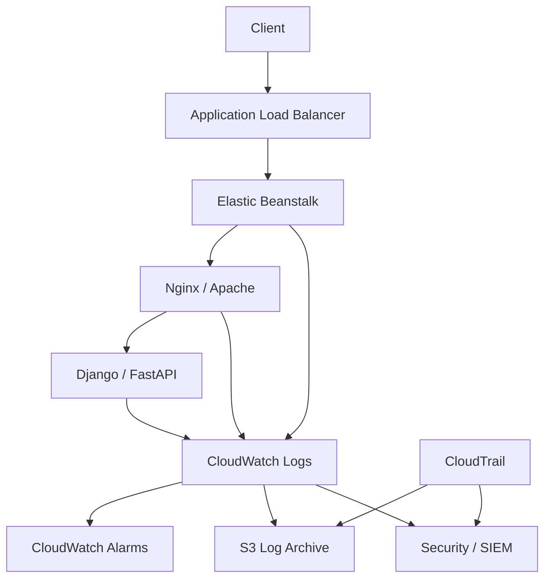
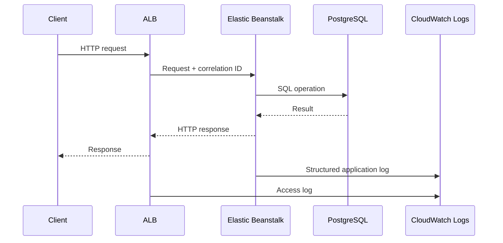
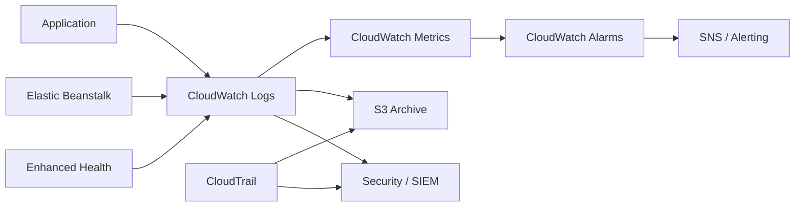

# 07- Logging and Auditing

## Overview

Logging and auditing are separate concerns that should be designed together in a production Elastic Beanstalk environment.

**Logging** answers:

> What happened inside the application and infrastructure?

**Auditing** answers:

> Who performed an administrative or security-sensitive action, when did they do it, and through which AWS API?

A production Elastic Beanstalk architecture should therefore combine:

```text
Application / EC2
      │
      ├── Application logs
      ├── Web server logs
      ├── Deployment logs
      └── Platform logs
             │
             ▼
      CloudWatch Logs
             │
             ├── Search
             ├── Metric filters
             ├── Alarms
             └── Retention
             
AWS API activity
      │
      ▼
CloudTrail
      │
      ├── S3
      ├── CloudWatch Logs
      └── Security monitoring
```

Elastic Beanstalk supports retrieving instance logs, publishing rotated logs to Amazon S3, and streaming instance logs to Amazon CloudWatch Logs. Enhanced health information can also be streamed to CloudWatch Logs. :contentReference[oaicite:0]{index=0}

CloudTrail provides the audit trail for AWS API activity, including the identity making the call, time, source IP address, request parameters, and response information. :contentReference[oaicite:1]{index=1}

## Logging vs Auditing

| Concern | Logging | Auditing |
|---|---|---|
| Primary question | What happened? | Who did it? |
| Typical source | Application / infrastructure | AWS API activity |
| Main service | CloudWatch Logs | CloudTrail |
| Data | Requests, errors, deployments, system events | API calls, identities, source IPs |
| Main use | Debugging and operations | Security and compliance |
| Retention | Operationally driven | Compliance/security driven |
| Example | HTTP 500 error | `UpdateEnvironment` API call |
| Primary audience | Developers / SRE | Security / platform / compliance |

They should not be treated as interchangeable.

An application error log does not tell you who changed an IAM policy.

Likewise, CloudTrail does not normally tell you why a Django request returned HTTP 500.

## Logging Architecture

A practical Elastic Beanstalk logging architecture is:



The exact log files available depend on the Elastic Beanstalk platform. For current Linux platforms, common logs include Elastic Beanstalk engine logs, proxy access/error logs, and application/platform-specific logs. :contentReference[oaicite:2]{index=2}

## Why Centralized Logging Matters

Instance-local logs are useful during troubleshooting, but they are insufficient as the primary production logging strategy.

Consider an environment with:

```text
Instance A
Instance B
Instance C
Instance D
```

A request may fail on Instance C.

If logs remain only on the local filesystem:

```text
Instance A → logs
Instance B → logs
Instance C → important error
Instance D → logs
```

the operational workflow becomes:

```text
Find instance
    ↓
Connect to instance
    ↓
Locate log
    ↓
Search log
    ↓
Correlate timestamps
```

With centralized logging:

```text
Instance A ─┐
Instance B ─┤
Instance C ─┼──> CloudWatch Logs
Instance D ─┘
                  │
                  ├── Search
                  ├── Filter
                  └── Alert
```

This is much more appropriate for horizontally scaled applications.

## Types of Elastic Beanstalk Logs

Elastic Beanstalk environments can expose several categories of logs.

| Log category | Purpose |
|---|---|
| Application logs | Application behavior and failures |
| Access logs | HTTP request activity |
| Error logs | Web server/application errors |
| Platform logs | Elastic Beanstalk platform operations |
| Deployment logs | Deployment and startup activity |
| System logs | OS-level troubleshooting |
| Health logs | Environment and instance health |
| Custom logs | Application-specific operational data |

Elastic Beanstalk deployment logs provide a chronological view of dependency installation, build output, application startup, and deployment errors. :contentReference[oaicite:3]{index=3}

## Application Logs

Backend applications should generate structured, useful logs.

For a Django or FastAPI application, useful events include:

```text
Request received
Request completed
Authentication failure
Database failure
External API failure
Background task failure
Business-critical state transition
Unexpected exception
```

Avoid logging every internal operation indiscriminately.

The goal is not maximum log volume.

The goal is **maximum operational signal per unit of log volume**.

## Structured Logging

Prefer structured logs over arbitrary strings.

Less useful:

```text
2026-08-13 10:42:31 ERROR payment failed for customer 123
```

More useful:

```json
{
  "level": "ERROR",
  "event": "payment_failed",
  "request_id": "req-8f2d",
  "customer_id": "customer-123",
  "provider": "payment-service",
  "error_code": "TIMEOUT"
}
```

Structured logs are easier to:

- Search.
- Filter.
- Aggregate.
- Analyze.
- Convert into metrics.
- Send to SIEM platforms.

## Recommended Log Fields

A production API should consider fields such as:

| Field | Purpose |
|---|---|
| `timestamp` | Event ordering |
| `level` | Severity |
| `service` | Service identification |
| `environment` | Production/staging/etc. |
| `event` | Machine-readable event |
| `request_id` | Request correlation |
| `trace_id` | Distributed tracing |
| `method` | HTTP method |
| `path` | Endpoint |
| `status_code` | Response status |
| `duration_ms` | Latency |
| `instance_id` | Infrastructure correlation |
| `error_type` | Failure classification |

Do not blindly log every available field.

Fields containing credentials, tokens, session identifiers, or sensitive personal information should be excluded or redacted.

## Log Levels

A common production hierarchy is:

| Level | Use |
|---|---|
| `DEBUG` | Detailed development diagnostics |
| `INFO` | Normal significant operations |
| `WARNING` | Unexpected but recoverable condition |
| `ERROR` | Failed operation |
| `CRITICAL` | Severe failure requiring immediate attention |

Production systems should avoid enabling excessive `DEBUG` logging indefinitely.

High-volume debug logging can:

- Increase CloudWatch costs.
- Increase storage requirements.
- Make incident investigation harder.
- Expose sensitive implementation details.
- Increase application I/O.

## Request Logging

For APIs, request logging should capture enough information to correlate a request without logging sensitive payloads.

Example:

```json
{
  "level": "INFO",
  "event": "http_request_completed",
  "request_id": "req-123",
  "method": "POST",
  "path": "/api/orders",
  "status_code": 201,
  "duration_ms": 142
}
```

Avoid logging:

```json
{
  "authorization": "Bearer eyJ...",
  "password": "secret",
  "credit_card": "..."
}
```

Request logging is especially useful when combined with load balancer, application, and database timing information.

## Request Correlation

A request ID allows engineers to follow one request across multiple components.



The same correlation identifier should appear in relevant application logs.

For distributed systems, propagate a trace identifier across service boundaries.

## CloudWatch Logs

CloudWatch Logs is the primary AWS-native service for centralized log collection from Elastic Beanstalk instances.

Elastic Beanstalk can stream instance logs to CloudWatch Logs in real time, with configurable retention and lifecycle behavior. :contentReference[oaicite:4]{index=4}

A production flow is:

```text
EC2 Instance
    │
    ├── nginx/access.log
    ├── nginx/error.log
    ├── application.log
    └── eb-engine.log
             │
             ▼
      CloudWatch Logs
             │
             ├── Search
             ├── Metric filters
             ├── Alarms
             └── Archive
```

## Enabling CloudWatch Log Streaming

Using the EB CLI:

```bash
eb logs --cloudwatch-logs enable
```

The EB CLI can also retrieve complete logs:

```bash
eb logs --all
```

or retrieve them as a ZIP archive:

```bash
eb logs --zip
```

AWS documents these operations through the `eb logs` command. :contentReference[oaicite:5]{index=5}

## Configuration with `.ebextensions`

Log streaming can be configured declaratively:

```yaml
option_settings:
  aws:elasticbeanstalk:cloudwatch:logs:
    StreamLogs: true
```

For longer-term retention, configure the retention period and lifecycle behavior explicitly:

```yaml
option_settings:
  aws:elasticbeanstalk:cloudwatch:logs:
    StreamLogs: true
    DeleteOnTerminate: false
    RetentionInDays: 180
```

Elastic Beanstalk supports retention settings for CloudWatch log groups and can preserve logs after environment termination when configured appropriately. :contentReference[oaicite:6]{index=6}

## Log Retention

Do not automatically retain every log forever.

A reasonable model is:

```text
Operational logs
    │
    ├── Short/medium retention
    │
    └── Archived if required

Security/audit logs
    │
    ├── Longer retention
    │
    └── Compliance archive
```

Retention should be based on:

- Incident-response requirements.
- Compliance.
- Security requirements.
- Cost.
- Business requirements.
- Regulatory requirements.

CloudWatch Logs retention can be configured per log group.

## S3 Log Storage

Elastic Beanstalk can also upload rotated logs to its environment S3 bucket.

This provides an additional persistence mechanism for logs. AWS documents that rotated logs can be uploaded periodically, while tail and bundle logs requested manually have different lifecycle behavior. :contentReference[oaicite:7]{index=7}

A simplified architecture is:

```text
EC2
 │
 │ rotated logs
 ▼
Elastic Beanstalk S3 bucket
 │
 ├── Retention
 ├── Lifecycle policies
 └── Archive
```

S3 can be particularly useful for longer-term archival and forensic analysis.

## CloudWatch Logs vs S3

| Requirement | CloudWatch Logs | S3 |
|---|---|---|
| Real-time search | Excellent | Poor |
| Operational debugging | Excellent | Moderate |
| Long-term archive | Possible | Excellent |
| Event filtering | Excellent | Requires additional tooling |
| Log analytics | Strong | Strong with additional services |
| Low-cost archival | Moderate | Strong |
| Immediate alerts | Strong | Requires additional processing |

A mature architecture can use both.

```text
CloudWatch Logs
    └── Operations / alerting

S3
    └── Long-term archive / compliance
```

## Deployment Logs

Deployment failures are often different from runtime failures.

A deployment may fail because of:

```text
Dependency installation
        │
        ├── Package failure
        ├── Build failure
        ├── Migration failure
        ├── Configuration failure
        └── Application startup failure
```

Elastic Beanstalk creates deployment logs containing deployment activity and errors, making them useful for diagnosing failed releases. :contentReference[oaicite:8]{index=8}

A production deployment investigation should therefore examine:

```text
Deployment log
      +
eb-engine log
      +
Application log
      +
Health events
```

rather than looking only at application logs.

## Environment Health Logs

Elastic Beanstalk enhanced health reporting provides environment and instance health information.

Current Elastic Beanstalk environments created with recent platform versions support the health agent and enhanced health reporting by default. :contentReference[oaicite:9]{index=9}

Enhanced health can identify conditions such as:

- Elevated HTTP errors.
- Failed health checks.
- Instance failures.
- Deployment-related problems.
- Resource or application health degradation.

Elastic Beanstalk can also stream health information to CloudWatch Logs. :contentReference[oaicite:10]{index=10}

## Health vs Application Logs

These answer different questions.

```text
Application Logs
    │
    └── "Why did this request fail?"

Elastic Beanstalk Health
    │
    └── "Is this instance/environment healthy?"

CloudTrail
    │
    └── "Who changed the AWS configuration?"
```

A production incident often requires all three.

## Monitoring Architecture



## Turning Logs Into Metrics

Logs are useful for exploration.

Metrics are better for continuously evaluating system health.

For example:

```text
Application logs
      │
      ▼
"payment_failed"
      │
      ▼
CloudWatch metric filter
      │
      ▼
PaymentFailureCount
      │
      ▼
CloudWatch Alarm
```

This converts an event stream into an operational signal.

## Example Metric Filters

A simple error pattern might look like:

```text
ERROR
```

A more useful structured event might be:

```text
"event":"payment_failed"
```

The second approach is preferable because it is less likely to match unrelated messages.

Avoid designing alarms around fragile free-form log messages.

## Alert Design

Not every error should page an engineer.

A useful distinction is:

| Signal | Typical response |
|---|---|
| One isolated 500 | Investigate / aggregate |
| Sustained 5xx spike | Alert |
| Authentication failures spike | Security alert |
| Deployment failure | Deployment alert |
| Instance health degraded | Operational alert |
| Database connection exhaustion | Immediate alert |
| Unauthorized AWS API activity | Security alert |

The goal is to avoid alert fatigue.

## CloudWatch Alarms

Alarms should generally operate on meaningful metrics.

Examples:

```text
HTTPCode_ELB_5XX_Count
HTTPCode_Target_5XX_Count
TargetResponseTime
CPUUtilization
HealthyHostCount
Application-specific error count
```

Log-derived metrics can complement infrastructure metrics.

For example:

```text
PaymentFailureCount > threshold
```

may indicate a business-critical problem that CPU utilization would not reveal.

## CloudTrail

CloudTrail is the primary AWS service for auditing AWS API activity.

It records information such as:

- Who made the request.
- What AWS API was called.
- When it happened.
- Source IP.
- Request parameters.
- Response information.

:contentReference[oaicite:11]{index=11}

This makes CloudTrail fundamentally different from application logging.

## Example CloudTrail Event

A simplified conceptual event looks like:

```json
{
  "eventSource": "elasticbeanstalk.amazonaws.com",
  "eventName": "UpdateEnvironment",
  "awsRegion": "ap-south-1",
  "sourceIPAddress": "203.0.113.10",
  "userIdentity": {
    "type": "AssumedRole",
    "arn": "arn:aws:iam::123456789012:role/deployment-role"
  }
}
```

The exact event structure depends on the AWS API operation.

## What to Audit

For Elastic Beanstalk, pay particular attention to:

- Environment creation.
- Environment deletion.
- Environment configuration changes.
- Application version changes.
- IAM changes.
- Security group changes.
- Load balancer changes.
- Secret-access policy changes.
- KMS key policy changes.
- Production deployment activity.

CloudTrail should be considered part of the security boundary, not simply a debugging tool.

## CloudTrail and CloudWatch Logs

CloudTrail logs can be delivered to CloudWatch Logs for centralized monitoring and alerting.

A common architecture is:

```text
AWS API activity
      │
      ▼
CloudTrail
      │
      ├── S3
      │
      └── CloudWatch Logs
              │
              ├── Metric filters
              └── Alarms
```

AWS documents using CloudWatch Logs to monitor CloudTrail log files and create metric filters for specific activity. :contentReference[oaicite:12]{index=12}

## Auditing Production Changes

Suppose a production environment suddenly changes configuration.

Application logs may show:

```text
Application restarted
```

CloudTrail can answer:

```text
Who initiated the environment update?
Which AWS API was called?
When was it called?
Which role or identity performed it?
What source IP was used?
```

This distinction is essential during security investigations.

## Deployment Audit Trail

A production deployment should produce a chain of evidence:

```text
Git commit
    │
    ▼
CI/CD pipeline
    │
    ▼
Elastic Beanstalk application version
    │
    ▼
UpdateEnvironment
    │
    ▼
Deployment logs
    │
    ▼
Health status
```

This makes production changes traceable.

A mature CI/CD system should make it possible to answer:

> Which source revision is currently serving production traffic?

## CI/CD Logging

GitHub Actions or another CI/CD platform should log:

- Build status.
- Test status.
- Deployment status.
- Application version.
- Environment.
- Deployment timestamp.
- Commit SHA.

It should not log:

- AWS secret keys.
- Database passwords.
- API keys.
- Tokens.
- Private keys.

The deployment log should contain references and identifiers rather than credentials.

## Logging Sensitive Data

One of the most dangerous logging mistakes is treating logs as harmless.

Logs can be:

```text
Stored
Copied
Indexed
Exported
Backed up
Viewed by operators
Forwarded to SIEM
```

Never log:

- Passwords.
- Authorization headers.
- Session cookies.
- Access tokens.
- Refresh tokens.
- Private keys.
- Database credentials.
- Full payment-card data.
- Unnecessary personal information.

## Redaction

Sensitive fields should be removed before logging.

Example:

```python
SENSITIVE_FIELDS = {
    "password",
    "authorization",
    "access_token",
    "refresh_token",
    "api_key",
}


def sanitize(data: dict) -> dict:
    return {
        key: "[REDACTED]" if key.lower() in SENSITIVE_FIELDS else value
        for key, value in data.items()
    }
```

Redaction should happen before the event is sent to the logging backend.

## Exception Logging

Be careful with exception messages.

Bad:

```python
raise RuntimeError(
    f"Database connection failed: {database_url}"
)
```

If `database_url` contains credentials, the secret is now part of the traceback.

Better:

```python
raise RuntimeError("Database connection failed")
```

Log safe diagnostic metadata separately.

## Access Logs

Web server access logs provide valuable information:

```text
timestamp
client
method
path
status
response size
request duration
```

They are useful for:

- Traffic analysis.
- 4xx/5xx investigation.
- Endpoint usage.
- Abuse detection.
- Latency investigation.

Do not assume access logs are automatically safe.

Query strings can contain sensitive values if applications allow them.

Avoid putting secrets into URLs in the first place.

## Application Logging for Django

A production Django application should use Python's logging framework rather than `print()`.

Example:

```python
import logging

logger = logging.getLogger(__name__)


def process_order(order_id: str) -> None:
    logger.info(
        "Processing order",
        extra={
            "order_id": order_id,
        },
    )
```

For production systems, structured logging libraries or a custom JSON formatter can make fields easier to search and aggregate.

## Application Logging for FastAPI

FastAPI applications can use the same Python logging infrastructure.

```python
import logging

from fastapi import FastAPI

logger = logging.getLogger(__name__)

app = FastAPI()


@app.get("/health")
async def health() -> dict[str, str]:
    logger.info("Health endpoint requested")
    return {"status": "ok"}
```

Avoid creating excessive logs for highly frequent endpoints such as health checks.

## Health Check Logging

Health endpoints can generate very high request volumes.

For example:

```text
ALB
 │
 ├── /health
 ├── /health
 ├── /health
 └── /health
```

Logging every successful health check at `INFO` can create significant noise.

Prefer:

- Reduced logging.
- Sampling.
- Metrics.
- Debug-level logging.

Use health metrics to monitor availability rather than generating massive application log volumes.

## Distributed Systems

In a microservices architecture:

```text
API
 │
 ├── Order Service
 │      │
 │      └── Payment Service
 │
 └── Inventory Service
```

a single request can generate logs across multiple services.

A correlation identifier should propagate:

```text
request_id = req-123
```

across the entire request chain.

For more advanced architectures, distributed tracing can add:

```text
trace_id
span_id
parent_span_id
```

This is especially valuable when using:

- REST.
- gRPC.
- Celery.
- Kafka.
- Multiple backend services.

## Kafka and Logging

Kafka consumers should log enough information to identify the event being processed without logging the entire message if the payload may contain sensitive information.

Useful:

```json
{
  "event": "order_processing_failed",
  "topic": "orders",
  "partition": 3,
  "offset": 18442,
  "order_id": "order-123",
  "error_type": "DatabaseTimeout"
}
```

Avoid:

```text
Entire Kafka message payload
```

unless there is a clear operational and security justification.

## Celery Logging

Celery workers are separate execution processes and therefore need independent logging coverage.

Monitor:

```text
Task received
Task completed
Task failed
Task retried
Task duration
Queue backlog
```

A web application's logs alone are insufficient to troubleshoot background processing.

## Log Rotation

Local instance logs can grow continuously.

Log rotation prevents:

```text
Disk usage
   │
   ▼
100%
   │
   ▼
Application failure
```

Elastic Beanstalk provides mechanisms for retrieving logs and uploading rotated logs to S3. :contentReference[oaicite:13]{index=13}

Centralized CloudWatch logging reduces dependence on local disk for long-term log retention.

## Disk Usage Monitoring

Even with centralized logging, monitor instance storage.

Useful signals include:

```text
DiskUsedPercent
DiskFreeSpace
Log directory size
Application temporary files
```

A full filesystem can cause:

- Logging failures.
- Database connection failures.
- Deployment failures.
- Application crashes.
- Package installation failures.

## Logging and Performance

Logging is I/O.

A high-volume application can generate substantial overhead:

```text
Request
  │
  ├── Business logic
  ├── Database
  └── Logging
          │
          ▼
      Serialization
          │
          ▼
       Network I/O
```

Avoid excessive synchronous logging in hot paths.

Potential optimizations include:

- Structured logging.
- Appropriate log levels.
- Sampling.
- Asynchronous logging where justified.
- Avoiding huge payloads.
- Avoiding duplicate logs.

## Logging Cost

CloudWatch Logs costs can increase with:

```text
Request volume
    ×
Log volume per request
    ×
Retention
```

For high-throughput APIs, logging every request body and response body is usually inappropriate.

Prefer compact structured events.

For example:

```json
{
  "event": "request_completed",
  "status": 200,
  "duration_ms": 42,
  "path": "/api/orders"
}
```

is significantly more operationally useful than storing entire HTTP payloads by default.

## Logging Strategy by Environment

| Environment | Recommended logging |
|---|---|
| Local | `DEBUG` where useful |
| Development | Detailed diagnostics |
| Staging | Production-like structure |
| Production | Structured, controlled verbosity |
| Security audit | Long-retention, access-controlled |

Staging should resemble production enough that logging and observability behavior is tested before release.

## Security Controls

Logging infrastructure itself requires security controls.

Protect:

- CloudWatch log groups.
- S3 log buckets.
- CloudTrail trails.
- IAM permissions.
- KMS keys.
- SIEM integrations.

A developer who can read production logs may indirectly gain access to sensitive information if logging is poorly designed.

Therefore:

```text
Application security
        +
Log security
        +
Audit security
```

must be treated as one system.

## IAM for CloudWatch Logs

Elastic Beanstalk instance profiles need appropriate CloudWatch Logs permissions when instance log streaming is enabled.

AWS documents permissions such as:

```text
logs:CreateLogStream
logs:PutLogEvents
logs:DescribeLogGroups
logs:DescribeLogStreams
```

for CloudWatch Logs integration. :contentReference[oaicite:14]{index=14}

Use the appropriate Elastic Beanstalk managed policy or a carefully scoped custom policy according to the environment's requirements.

Do not grant unrelated CloudWatch administrative permissions to application instances.

## S3 Log Security

If logs are stored in S3:

- Block unnecessary public access.
- Enable encryption.
- Restrict bucket access.
- Use lifecycle policies.
- Consider versioning where appropriate.
- Restrict deletion permissions.
- Monitor access.

Logs may contain operationally sensitive information even when they do not contain passwords.

## CloudTrail Security

CloudTrail logs should be protected against unauthorized modification or deletion.

A common production model is:

```text
Production Account
      │
      ▼
CloudTrail
      │
      ▼
Centralized S3 Log Archive
      │
      ├── Restricted IAM
      ├── Encryption
      └── Security monitoring
```

For organizations with multiple AWS accounts, centralized logging into a dedicated security/log archive account provides stronger separation of duties.

## Disaster Recovery

Logs are not always required for application recovery, but they can be critical for incident investigation and forensic analysis.

A DR strategy should consider:

```text
Application recovery
      +
Database recovery
      +
Secret recovery
      +
Audit-log availability
```

If the production environment is destroyed, CloudWatch log groups and centralized CloudTrail archives should remain available when configured for appropriate lifecycle behavior.

## Incident Investigation Workflow

A useful investigation sequence is:

```text
Incident detected
      │
      ▼
CloudWatch metrics
      │
      ▼
Application logs
      │
      ▼
Elastic Beanstalk health
      │
      ▼
Deployment logs
      │
      ▼
CloudTrail
      │
      ▼
Identify technical + administrative cause
```

For example:

```text
5xx spike
  │
  ▼
Application logs show DB connection errors
  │
  ▼
Deployment log shows recent environment update
  │
  ▼
CloudTrail shows configuration change
  │
  ▼
Identify deployment/configuration change
```

This is substantially stronger than inspecting application logs alone.

## Production Observability Baseline

A production Elastic Beanstalk application should generally have:

```text
Metrics
  ├── Request count
  ├── Error rate
  ├── Latency
  ├── Instance health
  └── Resource utilization

Logs
  ├── Application
  ├── Access
  ├── Error
  ├── Deployment
  └── Platform

Audit
  └── CloudTrail

Alerting
  ├── CloudWatch alarms
  └── Security alerts
```

No single telemetry source is sufficient.

## Common Mistakes

### Keeping Logs Only on EC2

**Problem:** Instance replacement can remove access to local logs.

**Better:** Stream important logs to CloudWatch Logs and archive where necessary.

### Logging Entire HTTP Payloads

**Problem:** Sensitive data and excessive log volume.

**Better:** Log selected metadata and business identifiers.

### Using `print()` Everywhere

**Problem:** Poor structure, inconsistent levels, difficult filtering.

**Better:** Use the application's logging framework.

### Logging Secrets

**Problem:** Credentials can become persistent security liabilities.

**Better:** Redact sensitive fields before emission.

### Using Logs as Metrics

**Problem:** Searching free-form text is fragile for alerting.

**Better:** Generate structured events and convert important events into metrics.

### No CloudTrail Strategy

**Problem:** Application logs cannot reliably answer who changed AWS infrastructure.

**Better:** Use CloudTrail for AWS API auditing.

### No Retention Policy

**Problem:** Logs may disappear too early or costs may grow indefinitely.

**Better:** Define retention according to operational and compliance requirements.

### Logging Health Checks at High Volume

**Problem:** Huge amounts of low-value noise.

**Better:** Use metrics and reduce successful health-check logging.

### Excessive `DEBUG` in Production

**Problem:** Higher cost, noise, performance overhead, and possible data exposure.

**Better:** Use controlled production log levels.

### Ignoring Background Workers

**Problem:** Celery or Kafka failures remain invisible even when the web application appears healthy.

**Better:** Give every execution path its own structured logging and monitoring.

## Production Logging Checklist

### Application

- [ ] Structured logging is enabled.
- [ ] Log levels are environment-appropriate.
- [ ] Request correlation IDs are available.
- [ ] Sensitive fields are redacted.
- [ ] Exceptions do not expose credentials.
- [ ] Health checks do not generate excessive logs.
- [ ] Background workers emit useful operational logs.

### Elastic Beanstalk

- [ ] Instance log streaming is enabled where required.
- [ ] Deployment logs are available.
- [ ] Enhanced health reporting is enabled.
- [ ] Health information is monitored.
- [ ] Local log rotation is configured.
- [ ] Important logs survive instance replacement.

### CloudWatch

- [ ] Log groups have explicit retention.
- [ ] Important error patterns have alarms.
- [ ] Log volume is monitored.
- [ ] Access to production logs is restricted.
- [ ] CloudWatch costs are reviewed.

### S3

- [ ] Log buckets are private.
- [ ] Encryption is enabled.
- [ ] Lifecycle policies are defined.
- [ ] Access is restricted.
- [ ] Long-term retention requirements are documented.

### CloudTrail

- [ ] AWS API activity is recorded.
- [ ] Production account activity is auditable.
- [ ] CloudTrail logs are protected.
- [ ] Security-sensitive events generate alerts where appropriate.
- [ ] Centralized log storage is used where organizationally required.

### Incident Response

- [ ] Engineers can correlate metrics, logs, health, and deployments.
- [ ] Deployment history is traceable to source revisions.
- [ ] CloudTrail can identify administrative changes.
- [ ] Log retention supports the incident-response window.
- [ ] DR environments retain required observability.

## Interview Perspective

### What is the difference between CloudWatch Logs and CloudTrail?

CloudWatch Logs is primarily used to collect and analyze logs generated by applications, infrastructure, and AWS services.

CloudTrail records AWS API activity for auditing.

```text
Application error
      │
      ▼
CloudWatch Logs

AWS configuration change
      │
      ▼
CloudTrail
```

### Why isn't EC2 local logging sufficient for Elastic Beanstalk?

Elastic Beanstalk is designed to replace and scale instances.

A local log file belongs to one instance:

```text
Instance A → local logs
```

If Instance A is terminated, the local logs may no longer be available.

Centralized CloudWatch logging provides persistent access independent of the instance lifecycle.

### What logs should you inspect after a failed Elastic Beanstalk deployment?

Start with:

```text
Deployment log
    +
eb-engine log
    +
Application startup logs
    +
Health events
```

Deployment logs specifically provide a chronological view of deployment operations and failures. :contentReference[oaicite:15]{index=15}

### How would you investigate a sudden production 5xx spike?

A practical sequence is:

1. Check CloudWatch metrics and error-rate alarms.
2. Identify affected instances/endpoints.
3. Search application and proxy logs.
4. Check Elastic Beanstalk enhanced health.
5. Check recent deployments.
6. Inspect deployment logs.
7. Check CloudTrail for infrastructure/configuration changes.
8. Correlate the event with database, Redis, Kafka, or external-service telemetry.

### Why use structured logging?

Structured logs allow machines and humans to consistently filter fields such as:

```text
request_id
status_code
duration_ms
event
service
error_type
```

This makes log analysis and metric extraction more reliable than parsing arbitrary text.

### What should never be logged?

Avoid:

```text
Passwords
API keys
Authorization headers
Session cookies
Private keys
Database credentials
Payment-card data
Unnecessary sensitive personal data
```

### How can logs become a performance problem?

Logging performs serialization and I/O.

At high request volume:

```text
1,000 requests/sec
×
5 log events/request
=
5,000 log events/sec
```

This can create significant CPU, network, storage, and CloudWatch ingestion overhead.

Log volume must therefore be designed as part of application performance.

### Why are metrics preferable to logs for alerting?

Logs are event-oriented.

Metrics are optimized for aggregation and threshold evaluation.

For example:

```text
payment_failed events
        │
        ▼
PaymentFailureCount
        │
        ▼
Alarm
```

This is more reliable than repeatedly searching arbitrary log messages.

### What does CloudTrail tell you that application logs cannot?

CloudTrail can identify AWS administrative activity such as:

```text
Who
When
Which AWS API
Source IP
Request parameters
```

Application logs generally cannot provide this authoritative AWS control-plane audit trail. :contentReference[oaicite:16]{index=16}

### How would you design centralized logging for multiple Elastic Beanstalk environments?

A practical architecture is:

```text
Development EB ─┐
Staging EB ─────┼──> CloudWatch Logs
Production EB ──┘          │
                           ├── Alerts
                           ├── Dashboards
                           └── Archive → S3
```

Separate environments should have clearly distinguishable log groups, retention policies, and access controls.

### How would you preserve logs after an Elastic Beanstalk environment is terminated?

Configure CloudWatch log streaming with an appropriate retention period and lifecycle setting so logs are not deleted when the environment is terminated.

Elastic Beanstalk supports `DeleteOnTerminate` and `RetentionInDays` for CloudWatch log streaming. :contentReference[oaicite:17]{index=17}

### How do deployment logs differ from application logs?

Deployment logs describe the deployment process:

```text
Dependency installation
Build
Hooks
Configuration
Application startup
Deployment errors
```

Application logs describe runtime behavior after the application is running.

Both are required for effective production troubleshooting.

### What is the role of enhanced health?

Enhanced health provides a higher-level view of instance and environment health by analyzing health information available from the environment.

It can show health status and causes rather than requiring engineers to infer overall health solely from raw logs. :contentReference[oaicite:18]{index=18}

## Key Takeaways

- Logging and auditing solve different problems and should be designed separately.
- CloudWatch Logs is the primary operational logging service for Elastic Beanstalk environments.
- CloudTrail is the primary AWS control-plane auditing mechanism.
- Do not rely on instance-local logs as the only production log source.
- Stream important Elastic Beanstalk instance logs to CloudWatch Logs.
- Use S3 when long-term log archival or additional retention is required.
- Configure explicit log retention instead of relying on indefinite storage.
- Deployment logs are critical for diagnosing build, installation, startup, and deployment failures.
- Enhanced health provides environment-level operational context that application logs alone cannot provide.
- Structured logging is preferable to arbitrary free-form log messages.
- Use request IDs and, where appropriate, distributed trace IDs to correlate activity across services.
- Never log passwords, tokens, API keys, private keys, authorization headers, or unnecessary sensitive data.
- Treat log infrastructure itself as sensitive production infrastructure.
- Convert important log events into metrics when alerting is required.
- Avoid excessive logging in high-throughput request paths.
- Health checks should generally be monitored through metrics rather than generating large volumes of application logs.
- Django, FastAPI, Celery, Kafka consumers, and other backend processes should have consistent logging practices.
- CloudTrail should be used to determine who changed AWS resources rather than attempting to infer administrative activity from application logs.
- A production incident should correlate metrics, application logs, Elastic Beanstalk health, deployment logs, and CloudTrail.
- Log retention should balance incident-response requirements, compliance, security, and cost.
- Centralized logging becomes increasingly important as Elastic Beanstalk scales across multiple instances.
- A mature observability architecture combines **metrics, logs, health signals, deployment telemetry, and audit trails** rather than relying on any single source.